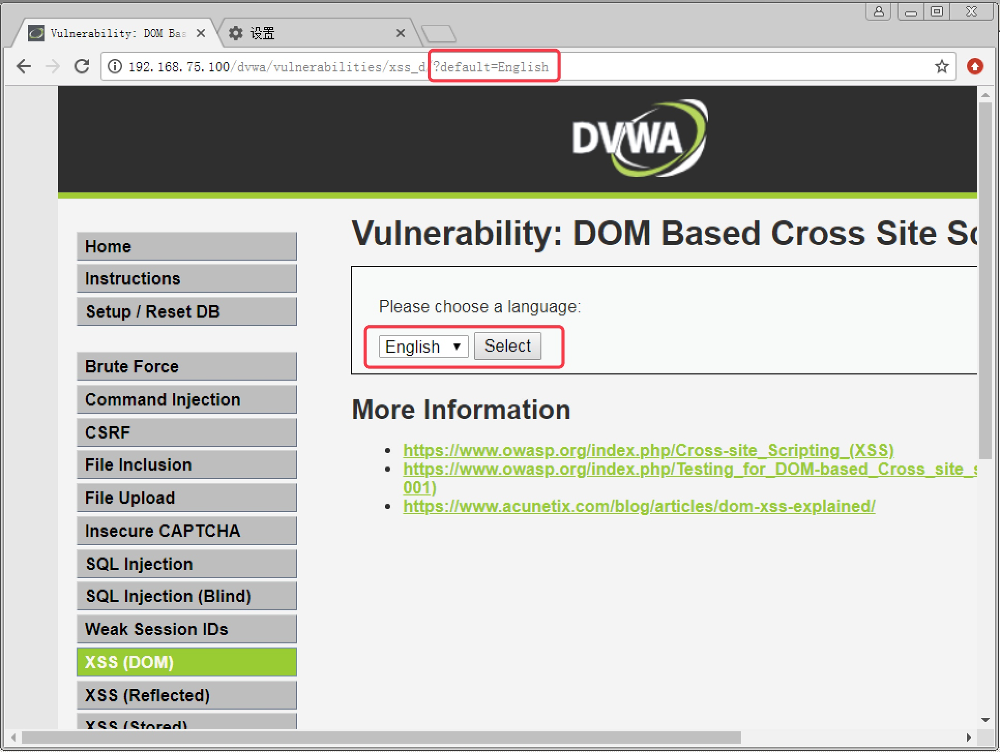
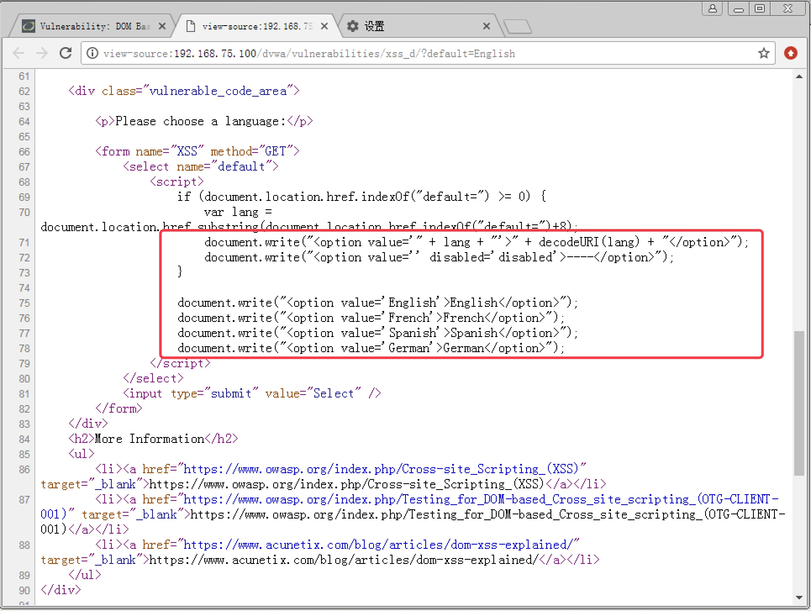
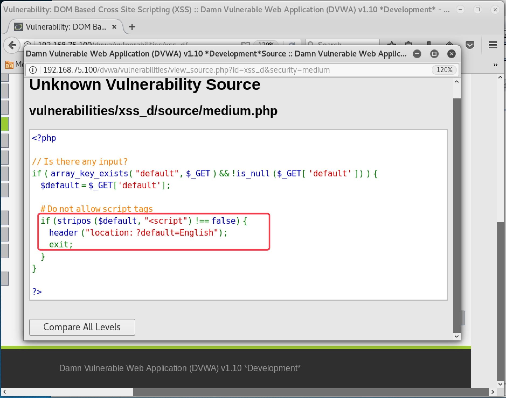
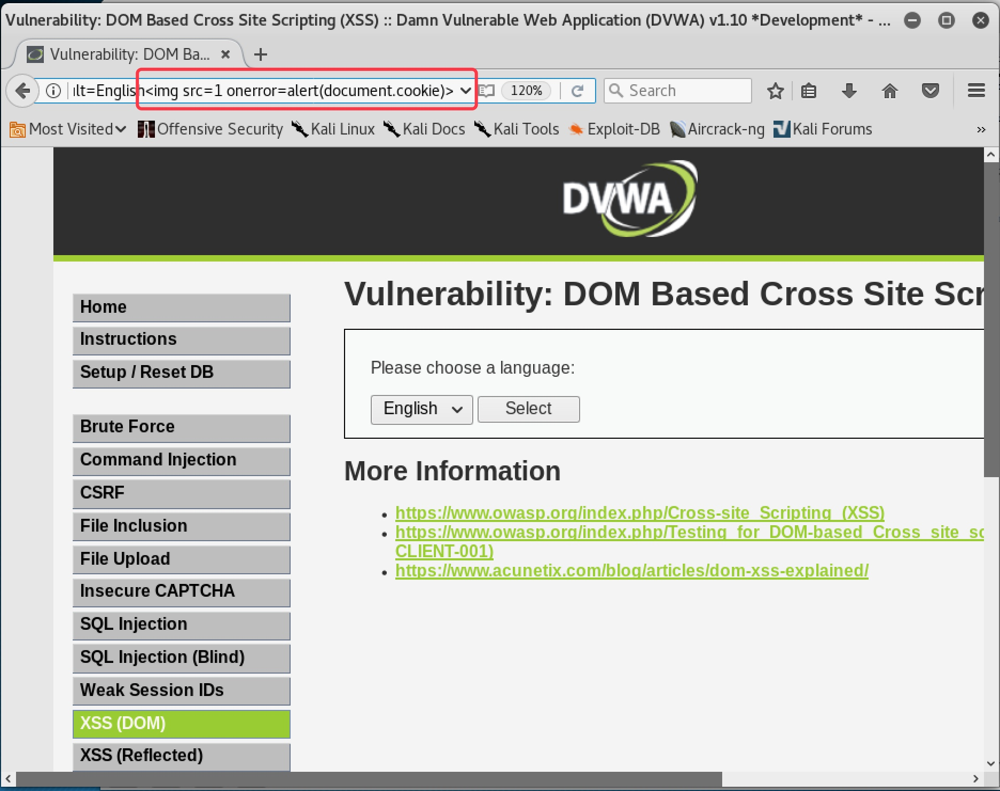
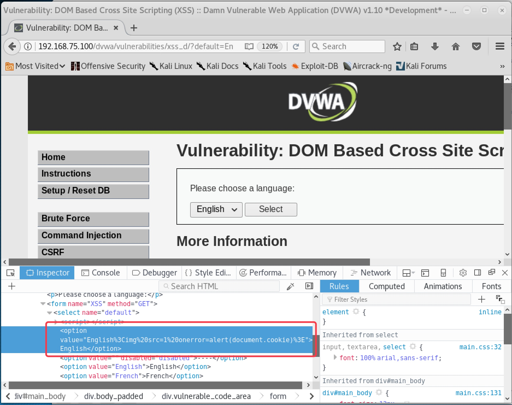
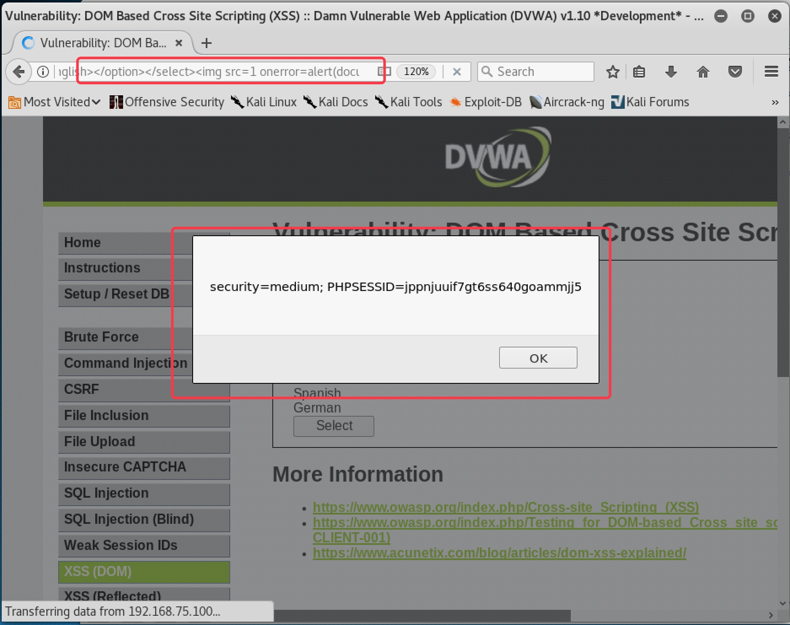
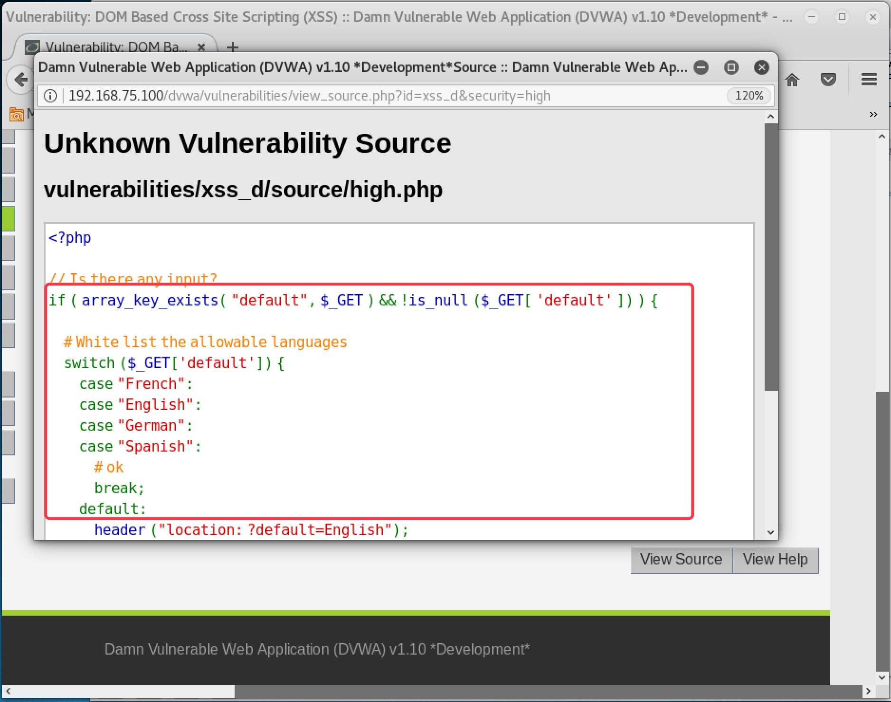
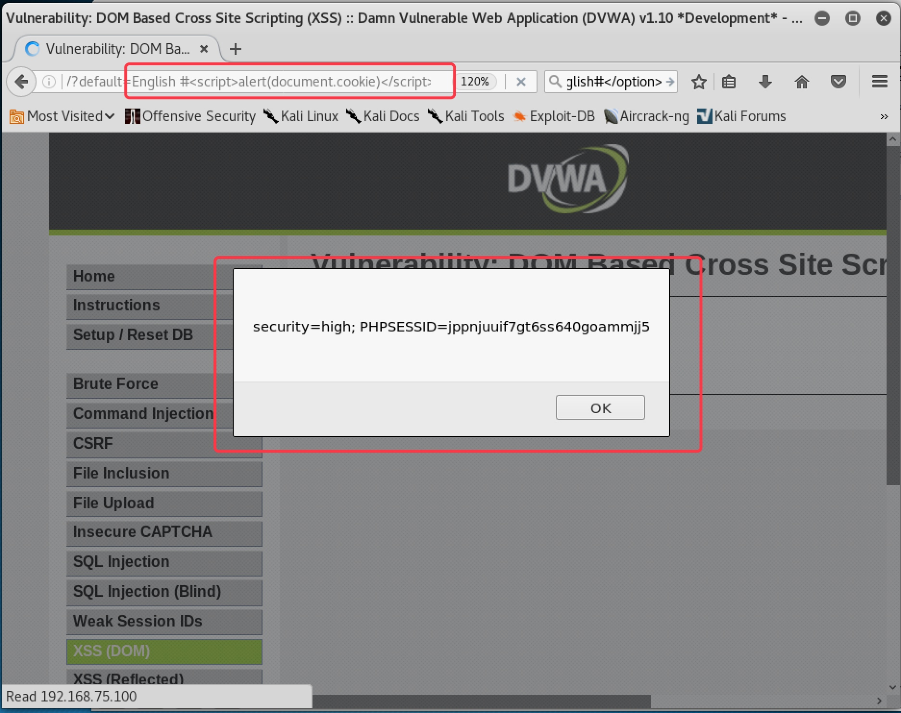
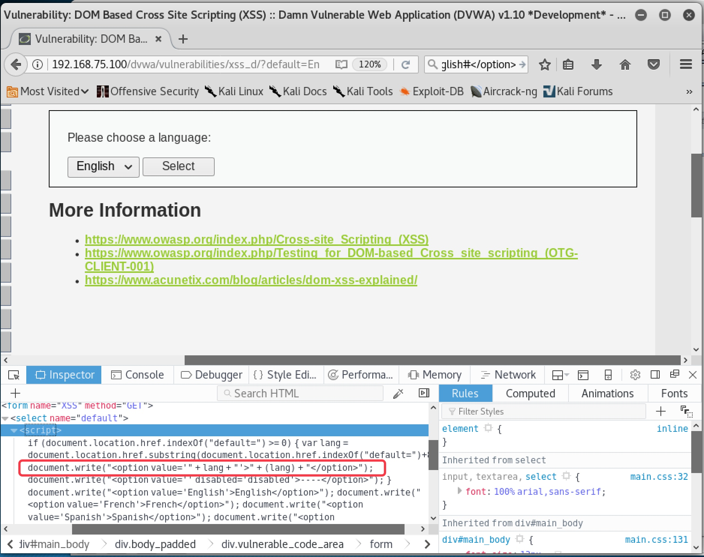
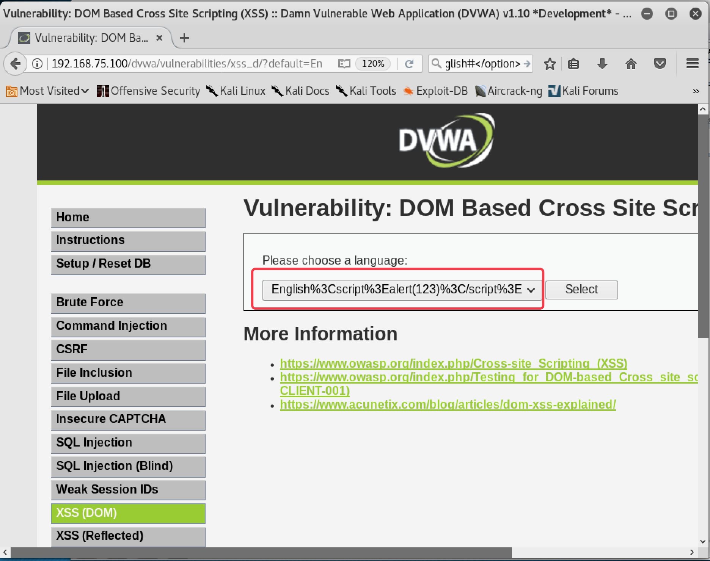

<!--more-->

# 9. DOM 型 XSS 攻击实战

#### 9.1 Low 级别 DOM 型 XSS 攻击实战

1. 设置安全级别为 `Low`，点击 `XSS(DOM)` 按钮，进入 `DOM` 型 `XSS` 攻击页面。发现是个选择框，随便选择一个选项，提交发现选择的参数会携带在 `URL` 中，说明页面提交方式为 `GET`，如图 9-1

   

   

   图 9-1

   

2. 在选择框附近点击右键选择 查看网页源代码 ，发现选择框中的内容使用了 `document.write` 的方式来输出，说明页面的 `XSS` 方式为 `DOM` 型，如图 9-2

   

   

   图 9-1

   

3. 在 URL 后直接加入攻击脚本 ``，发现可以直接弹窗，如图 9-2

   

   

   图 9-2

   

------

#### 9.2 Medium 级别 DOM 型 XSS 攻击实战

1. 设置安全级别为 `Medium`，进入 `DOM` 型 `XSS` 攻击页面。查看页面源码，发现存在代码，如果发现提交的内容中含有 ``，注意 # 前有一个空格，如图 9-8，可以弹窗

   

   

   图 9-8

   

------

#### 9.4 Impossible 级别 DOM 型攻击

　　查看 `Impossible` 级别源码，发现只有一句话：`Don’t need to do anything, protction handled on the client side`，如图 9-9。意思是不在服务端做任何措施，只在客户端浏览器实现防御。在浏览器开发者工具中查看源码，发现输出的变量值直接使用了 `lang`，而没有用 `decodeurl(lang)`，如图 9-10。也就是说页面本身不会对特殊字符的 `URL` 编码进行反编码还原，而是直接把特殊字符以 `URL` 编码的方式交由浏览器处理，所以就不存在 `XSS` 攻击的可能性了。
　　

图 9-9

图 9-10

　　尝试提交脚本，发现果然把特殊符号直接输出了 URL 编码，如图 9-11
　　

图 9-11