<!--more-->


# 从镜像仓库获得镜像

之前我们说到了，Docker 与其他虚拟化软件的一处不同就是将镜像管理纳入到了功能之中。实现虚拟化只是程序能够无缝移植的一部分，而有了镜像管理，就真正取代了我们在移植过程中的繁琐操作。利用 Docker 的镜像管理功能，我们可以很方便的通过网络传输和分享镜像，并保障镜像内容的一致性。所以，了解 Docker 的镜像管理方法可以算是掌握 Docker 的第一步。

## 镜像仓库

在之前的小节里，我们已经提到过 Docker 里集中存放镜像的一个概念，也就是**镜像仓库**。

如果说我们把镜像的结构用 Git 项目的结构做类比，那么镜像仓库就可以看似 GitLab、GitHub 等的托管平台，只不过 Docker 的镜像仓库托管的不是代码项目，而是镜像。

当然，存储镜像并不是镜像仓库最值得炫耀的功能，其最大的作用是实现了 Docker 镜像的分发。借助镜像仓库，我们得到了一个镜像的中转站，我们可以将开发环境上所使用的镜像推送至镜像仓库，并在测试或生产环境上拉取到它们，而这个过程仅需要几个命令，甚至自动化完成。

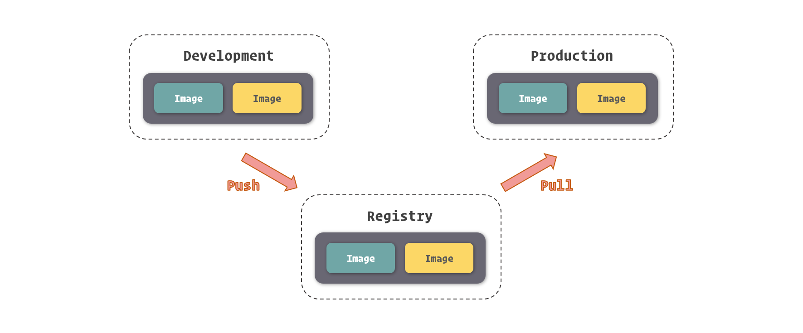

### 获取镜像

虽然有很多种方式将镜像引入到 Docker 之中，但我们最为常用的获取现有镜像的方式还是直接从镜像仓库中拉取，因为这种方式简单、快速、有保障。

要拉取镜像，我们可以使用 `docker pull` 命令，命令的参数就是我们之前所提到的镜像仓库名。

```
$ sudo docker pull ubuntu
Using default tag: latest
latest: Pulling from library/ubuntu
124c757242f8: Downloading [===============================================>   ]  30.19MB/31.76MB
9d866f8bde2a: Download complete 
fa3f2f277e67: Download complete 
398d32b153e8: Download complete 
afde35469481: Download complete 
```

当我们运行这个命令后，Docker 就会开始从镜像仓库中拉取我们所指定的镜像了，在控制台中，我们可以看到镜像拉取的进度。下载进度会分为几行，其实每一行代表的就是一个镜像层。Docker 首先会拉取镜像所基于的所有镜像层，之后再单独拉取每一个镜像层并组合成这个镜像。当然，如果在本地已经存在相同的镜像层 ( 共享于其他的镜像 )，那么 Docker 就直接略过这个镜像层的拉取而直接采用本地的内容。

上面是一个拉取官方镜像并且没有给出镜像标签的例子，大家注意到，当我们没有提供镜像标签时，Docker 会默认使用 latest 这个标签，这个我们在之前的小节中提到过，就不在赘述了。

当然，我们也能够使用完整的镜像命名来拉取镜像。

```
$ sudo docker pull openresty/openresty:1.13.6.2-alpine
1.13.6.2-alpine: Pulling from openresty/openresty
ff3a5c916c92: Pull complete 
ede0a2a1012b: Pull complete 
0e0a11843023: Pull complete 
246b2c6f4992: Pull complete 
Digest: sha256:23ff32a1e7d5a10824ab44b24a0daf86c2df1426defe8b162d8376079a548bf2
Status: Downloaded newer image for openresty/openresty:1.13.6.2-alpine
```

镜像在被拉取之后，就存放到了本地，接受当前这个 Docker 实例管理了，我们可以通过 `docker images` 命令看到它们。

```
$ sudo docker images
REPOSITORY            TAG                 IMAGE ID            CREATED             SIZE
ubuntu                latest              cd6d8154f1e1        12 days ago         84.1MB
openresty/openresty   1.13.6.2-alpine     08d5c926e4b6        3 months ago        49.3MB
```

## Docker Hub

既然说到镜像仓库，就不得不提 **Docker Hub** 了。Docker Hub 是 Docker 官方建立的中央镜像仓库，除了普通镜像仓库的功能外，它内部还有更加细致的权限管理，支持构建钩子和自动构建，并且有一套精致的 Web 操作页面。

Docker Hub 的地址是：[https://hub.docker.com/](https://hub.docker.com/)

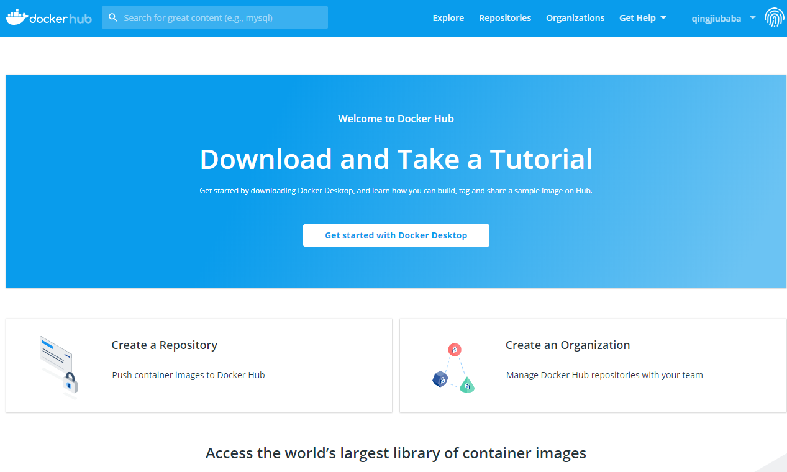

由于定位是 Docker 的中央镜像仓库系统，同时也是 Docker Engine 的默认镜像仓库，所以 Docker Hub 是开发者共享镜像的首选，那么也就意味着其中的镜像足够丰富。

常用服务软件的镜像，我们都能在 Docker Hub 中找到，甚至能找到针对它们不同用法的不同镜像。

同时，Docker Hub 也允许我们将我们制作好的镜像上传到其中，与广大 Docker 用户共享你的成果。

### 搜索镜像

由于 Docker Hub 提供了一套完整的 Web 操作界面，所以我们搜索其中的镜像会非常方便。

在上方的搜索条中输入镜像的关键词，回车搜索我们就可以看到镜像搜索的结果了。

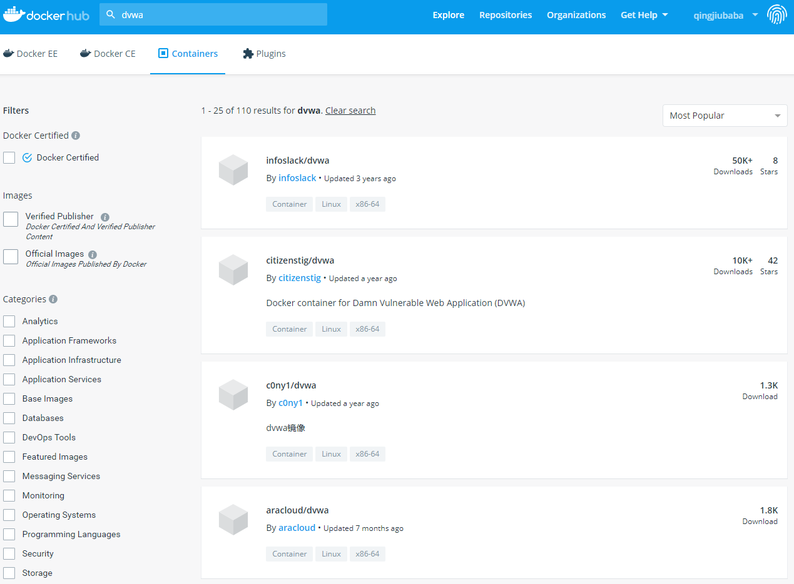

在 Docker Hub 的搜索结果中，有几项关键的信息有助于我们选择合适的镜像：

- **OFFICIAL** 代表镜像为 Docker 官方提供和维护，相对来说稳定性和安全性较高
- **STARS** 代表镜像的关注人数，这类似 GitHub 的 Stars，可以理解为热度
- **PULLS** 代表镜像被拉取的次数，基本上能够表示镜像被使用的频度

当然，关于镜像更多的信息我们可以在 **DETAILS** 中看到，这其中通常还包括了每个镜像不同的使用方法。具体如何阅读这些使用说明，我们会在之后的小节里专门介绍。

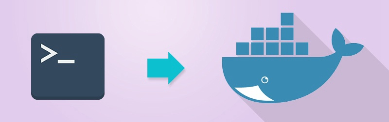

除了直接通过 Docker Hub 网站搜索镜像这种方式外，我们还可以用 docker CLI 中的 `docker search` 这个命令搜索 Docker Hub 中的镜像。

```
$ sudo docker search ubuntu
NAME                                                   DESCRIPTION                                     STARS               OFFICIAL            AUTOMATED
ubuntu                                                 Ubuntu is a Debian-based Linux operating sys…   8397                [OK]                
dorowu/ubuntu-desktop-lxde-vnc                         Ubuntu with openssh-server and NoVNC            220                                     [OK]
rastasheep/ubuntu-sshd                                 Dockerized SSH service, built on top of offi…   171                                     [OK]
consol/ubuntu-xfce-vnc                                 Ubuntu container with "headless" VNC session…   129                                     [OK]
ansible/ubuntu14.04-ansible                            Ubuntu 14.04 LTS with ansible                   95                                      [OK]
ubuntu-upstart                                         Upstart is an event-based replacement for th…   89                  [OK]                
neurodebian                                            NeuroDebian provides neuroscience research s…   54                  [OK]                
## ......
```

使用 `docker search` 命令，我们可以得到一个类似于 Docker Hub 网页版搜索的镜像列表结果，其中的信息与网页版也是类似的。通过这种方式我们可以在不方便访问 Web 的环境下搜索镜像，对于控制台爱好者来说也是一种不错的选择。

## 管理镜像

对镜像的管理要比搜索和获取镜像更常用，所以了解镜像管理相关的操作以及知识是非常有必要的。

除了之前我们所提到的 `docker images` 可以列出本地 Docker 中的所有镜像外，如果我们要获得镜像更详细的信息，我们可以通过 `docker inspect` 这个命令。

```
$ sudo docker inspect redis:3.2
[
    {
        "Id": "sha256:2fef532eadb328740479f93b4a1b7595d412b9105ca8face42d3245485c39ddc",
        "RepoTags": [
            "redis:3.2"
        ],
        "RepoDigests": [
            "redis@sha256:745bdd82bad441a666ee4c23adb7a4c8fac4b564a1c7ac4454aa81e91057d977"
        ],
## ......
    }
]
```

在 `docker inspect` 的结果中我们可以看到关于镜像相当完备的信息，由于条目分类比较多，这里我就不一一罗列展开了。

除了能够查看镜像的信息外，`docker inspect` 还能查看容器等之前我们所提到的 Docker 对象的信息，而传参的方式除了传递镜像或容器的名称外，还可以传入镜像 ID 或容器 ID。

```
$ sudo docker inspect redis:4.0
$ sudo docker inspect 2fef532e
```

### 参数识别

细心的读者在这里一定发现了一个细节，之前我们所谈到镜像 ID 是 64 个字符，而 `docker images` 命令里的缩写也有 12 个字符，为什么我这里展示的操作命令里只填写了 8 个字符呢？

这就有必要专门说说 Docker 所支持的这种传参方式了。

不论我们是通过镜像名还是镜像 ID 传递到 `docker inspect` 或者其他类似的命令 ( 需要指定 Docker 对象的命令 ) 里，Docker 都会根据我们传入的内容去寻找与之匹配的内容，只要我们所给出的内容能够找出唯一的镜像，那么 Docker 就会对这个镜像执行给定的操作。反之，如果找不到唯一的镜像，那么操作不会进行，Docker 也会显示错误。

也就是说，只要我们提供了能够唯一识别镜像或容器的信息，即使它短到只有 1 个字符，Docker 都是可以处理的。

例如我们有五个镜像：

```
REPOSITORY            TAG                 IMAGE ID            CREATED             SIZE
php                   7-fpm               f214b5c48a25        11 days ago         368MB
ubuntu                latest              cd6d8154f1e1        13 days ago         84.1MB
redis                 3.2                 2fef532eadb3        13 days ago         76MB
redis                 4.0                 e1a73233e3be        13 days ago         83.4MB
openresty/openresty   1.13.6.2-alpine     08d5c926e4b6        3 months ago        49.3MB
cogset/cron           latest              c01d5ac6fc8a        16 months ago       125MB
```

我们注意到镜像 ID 前缀为 2 的只有 redis:3.2 这个镜像，那么我们就可以使用 2 来指代这个镜像。

```
$ sudo docker inspect 2
```

而前缀为 c 的镜像有两个，这时候如果我们直接使用 c 来指代镜像的话，Docker 会提示未能匹配到镜像。

```
$ sudo docker inspect c
[]
Error: No such object: c
```

### 删除镜像

虽然 Docker 镜像占用的空间比较小，但日渐冗杂的镜像和凌乱的镜像版本会让管理越来越困难，所以有时候我们需要清理一些无用的镜像，将它们从本地的 Docker Engine 中移除。

删除镜像的命令是 `docker rmi`，参数是镜像的名称或 ID。

```
$ sudo docker rmi ubuntu:latest
Untagged: ubuntu:latest
Untagged: ubuntu@sha256:de774a3145f7ca4f0bd144c7d4ffb2931e06634f11529653b23eba85aef8e378
Deleted: sha256:cd6d8154f1e16e38493c3c2798977c5e142be5e5d41403ca89883840c6d51762
Deleted: sha256:2416e906f135eea2d08b4a8a8ae539328482eacb6cf39100f7c8f99e98a78d84
Deleted: sha256:7f8291c73f3ecc4dc9317076ad01a567dd44510e789242368cd061c709e0e36d
Deleted: sha256:4b3d88bd6e729deea28b2390d1ddfdbfa3db603160a1129f06f85f26e7bcf4a2
Deleted: sha256:f51700a4e396a235cee37249ffc260cdbeb33268225eb8f7345970f5ae309312
Deleted: sha256:a30b835850bfd4c7e9495edf7085cedfad918219227c7157ff71e8afe2661f63
```

删除镜像的过程其实是删除镜像内的镜像层，在删除镜像命令打印的结果里，我们可以看到被删除的镜像层以及它们的 ID。当然，如果存在两个镜像共用一个镜像层的情况，你也不需要担心 Docker 会删除被共享的那部分镜像层，只有当镜像层只被当前被删除的镜像所引用时，Docker 才会将它们从硬盘空间中移除。

`docker rmi` 命令也支持同时删除多个镜像，只需要通过空格传递多个镜像 ID 或镜像名即可。

```
$ sudo docker rmi redis:3.2 redis:4.0
Untagged: redis:3.2
Untagged: redis@sha256:745bdd82bad441a666ee4c23adb7a4c8fac4b564a1c7ac4454aa81e91057d977
Deleted: sha256:2fef532eadb328740479f93b4a1b7595d412b9105ca8face42d3245485c39ddc
## ......
Untagged: redis:4.0
Untagged: redis@sha256:b77926b30ca2f126431e4c2055efcf2891ebd4b4c4a86a53cf85ec3d4c98a4c9
Deleted: sha256:e1a73233e3beffea70442fc2cfae2c2bab0f657c3eebb3bdec1e84b6cc778b75
## ......
```


# 管理和存储数据

数据是应用程序重要的产出，所以很好的管理和存储数据，是对应用程序劳动结果的尊重。特别是在大数据时代，所有的数据都是重要的资产，保护好数据是每个开发者必须掌握的技能。我们知道，在 Docker 里，容器运行的文件系统处于沙盒环境中，与外界其实是隔离的，那么我们又要如何在 Docker 中合理的通过文件与外界进行数据交换呢？在这一小节中，我们就来介绍 Docker 中与文件数据有关的内容。

## 数据管理实现方式

Docker 容器中的文件系统于我们这些开发使用者来说，虽然有很多优势，但也有很多弊端，其中显著的两点就是：

- 沙盒文件系统是跟随容器生命周期所创建和移除的，数据无法直接被持久化存储。
- 由于容器隔离，我们很难从容器外部获得或操作容器内部文件中的数据。

当然，Docker 很好的解决了这些问题，这主要还是归功于 Docker 容器文件系统是基于 UnionFS。由于 UnionFS 支持挂载不同类型的文件系统到统一的目录结构中，所以我们只需要将宿主操作系统中，文件系统里的文件或目录挂载到容器中，便能够让容器内外共享这个文件。

由于通过这种方式可以互通容器内外的文件，那么文件数据持久化和操作容器内文件的问题就自然而然的解决了。

同时，UnionFS 带来的读写性能损失是可以忽略不计的，所以这种实现可以说是相当优秀的。

### 挂载方式

基于底层存储实现，Docker 提供了三种适用于不同场景的文件系统挂载方式：**Bind Mount**、**Volume** 和 **Tmpfs Mount**。

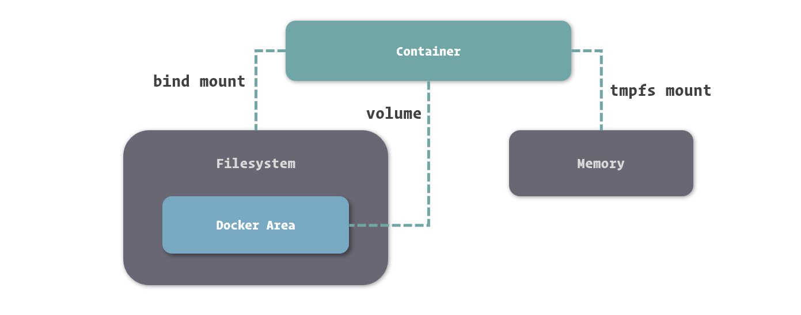

- **Bind Mount** 能够直接将宿主操作系统中的目录和文件挂载到容器内的文件系统中，通过指定容器外的路径和容器内的路径，就可以形成挂载映射关系，在容器内外对文件的读写，都是相互可见的。
- **Volume** 也是从宿主操作系统中挂载目录到容器内，只不过这个挂载的目录由 Docker 进行管理，我们只需要指定容器内的目录，不需要关心具体挂载到了宿主操作系统中的哪里。
- **Tmpfs Mount** 支持挂载系统内存中的一部分到容器的文件系统里，不过由于内存和容器的特征，它的存储并不是持久的，其中的内容会随着容器的停止而消失。

## 挂载文件到容器

要将宿主操作系统中的目录挂载到容器之后，我们可以在容器创建的时候通过传递 `-v` 或 `--volume` 选项来指定内外挂载的对应目录或文件。

```
$ sudo docker run -d --name nginx -v /webapp/html:/usr/share/nginx/html nginx:1.12
```

使用 `-v` 或 `--volume` 来挂载宿主操作系统目录的形式是 `-v <host-path>:<container-path>` 或 `--volume <host-path>:<container-path>`，其中 host-path 和 container-path 分别代表宿主操作系统中的目录和容器中的目录。这里需要注意的是，为了避免混淆，Docker 这里强制定义目录时必须使用绝对路径，不能使用相对路径。

我们能够指定目录进行挂载，也能够指定具体的文件来挂载，具体选择何种形式来挂载，大家可以根据具体的情况来选择。

当挂载了目录的容器启动后，我们可以看到我们在宿主操作系统中的文件已经出现在容器中了。

```
$ sudo docker exec nginx ls /usr/share/nginx/html
index.html
```

在 `docker inspect` 的结果里，我们可以看到有关容器数据挂载相关的信息。

```
$ sudo docker inspect nginx
[
    {
## ......
        "Mounts": [
            {
                "Type": "bind",
                "Source": "/webapp/html",
                "Destination": "/usr/share/nginx/html",
                "Mode": "",
                "RW": true,
                "Propagation": "rprivate"
            }
        ],
## ......
    }
]
```

在关于挂载的信息中我们可以看到一个 RW 字段，这表示挂载目录或文件的读写性 ( Read and Write )。实际操作中，Docker 还支持以只读的方式挂载，通过只读方式挂载的目录和文件，只能被容器中的程序读取，但不接受容器中程序修改它们的请求。在挂载选项 `-v` 后再接上 `:ro` 就可以只读挂载了。

```
$ sudo docker run -d --name nginx -v /webapp/html:/usr/share/nginx/html:ro nginx:1.12
```

由于宿主操作系统文件挂载在权限允许的情况下能够挂载任何目录或文件，这给系统的安全性造成了一定的隐患，所以我们在使用 Bind Mount 的时候，一定要特别注意挂载的外部目录选择。当然，在保证安全性的前提下，有几种常见场景非常适合使用这种挂载方式。

- 当我们需要从宿主操作系统共享配置的时候。对于一些配置项，我们可以直接从容器外部挂载到容器中，这利于保证容器中的配置为我们所确认的值，也方便我们对配置进行监控。例如，遇到容器中时区不正确的时候，我们可以直接将操作系统的时区配置，也就是 /etc/timezone 这个文件挂载并覆盖容器中的时区配置。
- 当我们需要借助 Docker 进行开发的时候。虽然在 Docker 中，推崇直接将代码和配置打包进镜像，以便快速部署和快速重建。但这在开发过程中显然非常不方便，因为每次构建镜像需要耗费一定的时间，这些时间积少成多，就是对开发工作效率的严重浪费了。如果我们直接把代码挂载进入容器，那么我们每次对代码的修改都可以直接在容器外部进行。

### 挂载临时文件目录

Tmpfs Mount 是一种特殊的挂载方式，它主要利用内存来存储数据。由于内存不是持久性存储设备，所以其带给 Tmpfs Mount 的特征就是临时性挂载。

与挂载宿主操作系统目录或文件不同，挂载临时文件目录要通过 `--tmpfs` 这个选项来完成。由于内存的具体位置不需要我们来指定，这个选项里我们只需要传递挂载到容器内的目录即可。

```
$ sudo docker run -d --name webapp --tmpfs /webapp/cache webapp:latest
```

容器已挂载的临时文件目录我们也可以通过 `docker inspect` 命令查看。

```
$ sudo docker inspect webapp
[
    {
## ......
         "Tmpfs": {
            "/webapp/cache": ""
        },
## ......
    }
]
```

挂载临时文件首先要注意它不是持久存储这一特性，在此基础上，它有几种常见的适应场景。

- 应用中使用到，但不需要进行持久保存的敏感数据，可以借助内存的非持久性和程序隔离性进行一定的安全保障。
- 读写速度要求较高，数据变化量大，但不需要持久保存的数据，可以借助内存的高读写速度减少操作的时间。

## 使用数据卷

除了与其他虚拟机工具近似的宿主操作系统目录挂载的功能外，Docker 还创造了数据卷 ( Volume ) 这个概念。数据卷的本质其实依然是宿主操作系统上的一个目录，只不过这个目录存放在 Docker 内部，接受 Docker 的管理。

在使用数据卷进行挂载时，我们不需要知道数据具体存储在了宿主操作系统的何处，只需要给定容器中的哪个目录会被挂载即可。

我们依然可以使用 `-v` 或 `--volume` 选项来定义数据卷的挂载。

```
$ sudo docker run -d --name webapp -v /webapp/storage webapp:latest
```

数据卷挂载到容器后，我们可以通过 `docker inspect` 看到容器中数据卷挂载的信息。

```
$ sudo docker inspect webapp
[
    {
## ......
        "Mounts": [
            {
                "Type": "volume",
                "Name": "2bbd2719b81fbe030e6f446243386d763ef25879ec82bb60c9be7ef7f3a25336",
                "Source": "/var/lib/docker/volumes/2bbd2719b81fbe030e6f446243386d763ef25879ec82bb60c9be7ef7f3a25336/_data",
                "Destination": "/webapp/storage",
                "Driver": "local",
                "Mode": "",
                "RW": true,
                "Propagation": ""
            }
        ],
## ......
    }
]
```

这里我们所得到的信息与绑定挂载有所区别，除了 Type 中的类型不一样之外，在数据卷挂载中，我们还要关注一下 Name 和 Source 这两个信息。

其中 Source 是 Docker 为我们分配用于挂载的宿主机目录，其位于 Docker 的资源区域 ( 这里是默认的 /var/lib/docker ) 内。当然，我们并不需要关心这个目录，一切对它的管理都已经在 Docker 内实现了。

为了方便识别数据卷，我们可以像命名容器一样为数据卷命名，这里的 Name 就是数据卷的命名。在我们未给出数据卷命名的时候，Docker 会采用数据卷的 ID 命名数据卷。我们也可以通过 `-v <name>:<container-path>` 这种形式来命名数据卷。

```
$ sudo docker run -d --name webapp -v appdata:/webapp/storage webapp:latest
```

由于 `-v` 选项既承载了 Bind Mount 的定义，又参与了 Volume 的定义，所以其传参方式需要特别留意。前面提到了，`-v` 在定义绑定挂载时必须使用绝对路径，其目的主要是为了避免与数据卷挂载中命名这种形式的冲突。

虽然与绑定挂载的原理差别不大，但数据卷在许多实际场景下你会发现它很有用。

- 当希望将数据在多个容器间共享时，利用数据卷可以在保证数据持久性和完整性的前提下，完成更多自动化操作。
- 当我们希望对容器中挂载的内容进行管理时，可以直接利用数据卷自身的管理方法实现。
- 当使用远程服务器或云服务作为存储介质的时候，数据卷能够隐藏更多的细节，让整个过程变得更加简单。

### 共用数据卷

数据卷的另一大作用是实现容器间的目录共享，也就是通过挂载相同的数据卷，让容器之间能够同时看到并操作数据卷中的内容。这个功能虽然也可以通过绑定挂载来实现，但通过数据卷来操作会更加的舒适、简单。

由于数据卷的命名在 Docker 中是唯一的，所以我们很容易通过数据卷的名称确定数据卷，这就让我们很方便的让多个容器挂载同一个数据卷了。

```
$ sudo docker run -d --name webapp -v html:/webapp/html webapp:latest
$ sudo docker run -d --name nginx -v html:/usr/share/nginx/html:ro nginx:1.12
```

我们使用 `-v` 选项挂载数据卷时，如果数据卷不存在，Docker 会为我们自动创建和分配宿主操作系统的目录，而如果同名数据卷已经存在，则会直接引用。

如果有朋友觉得这样对数据卷的操作方式还不够直接和准确，我们还可以通过 `docker volume` 下的几个命令专门操作数据卷。

通过 `docker volume create` 我们可以不依赖于容器独立创建数据卷。

```
$ sudo docker volume create appdata
```

通过 `docker volume ls` 可以列出当前已创建的数据卷。

```
$ sudo docker volume ls
DRIVER              VOLUME NAME
local               html
local               appdata
```

### 删除数据卷

虽然数据卷的目的是用来持久化存储数据的，但有时候我们也难免有删除它们以释放空间的需求。直接去 Docker 的目录下删除显然不是好的选择，我们应该通过 Docker 对数据卷的管理命令来删除它们。

我们可以直接通过 `docker volume rm` 来删除指定的数据卷。

```
$ sudo docker volume rm appdata
```

在删除数据卷之前，我们必须保证数据卷没有被任何容器所使用 ( 也就是之前引用过这个数据卷的容器都已经删除 )，否则 Docker 不会允许我们删除这个数据卷。

对于我们没有直接命名的数据卷，因为要反复核对数据卷 ID，这样的方式并不算特别友好。这种没有命名的数据卷，通常我们可以看成它们与对应的容器产生了绑定，因为其他容器很难使用到它们。而这种绑定关系的产生，也让我们可以在容器删除时将它们一并删除。

在 `docker rm` 删除容器的命令中，我们可以通过增加 `-v` 选项来删除容器关联的数据卷。

```
$ sudo docker rm -v webapp
```

如果我们没有随容器删除这些数据卷，Docker 在创建新的容器时也不会启用它们，即使它们与新创建容器所定义的数据卷有完全一致的特征。也就是说，此时它们已经变成了孤魂野鬼，纯粹的占用着硬盘空间而又不受管理。

此时我们可以通过 `docker volume rm` 来删除它们，但前提时你能在一堆乱码般的数据卷 ID 中找出哪个是没有被容器引用的数据卷。

为此，Docker 向我们提供了 `docker volume prune` 这个命令，它可以删除那些没有被容器引用的数据卷。

```
$ sudo docker volume prune -f
Deleted Volumes:
af6459286b5ce42bb5f205d0d323ac11ce8b8d9df4c65909ddc2feea7c3d1d53
0783665df434533f6b53afe3d9decfa791929570913c7aff10f302c17ed1a389
65b822e27d0be93d149304afb1515f8111344da9ea18adc3b3a34bddd2b243c7
## ......
```

## 数据卷容器

在数据卷的基础上，我们有一种相对新颖的用法，也就是数据卷容器。所谓数据卷容器，就是一个没有具体指定的应用，甚至不需要运行的容器，我们使用它的目的，是为了定义一个或多个数据卷并持有它们的引用。

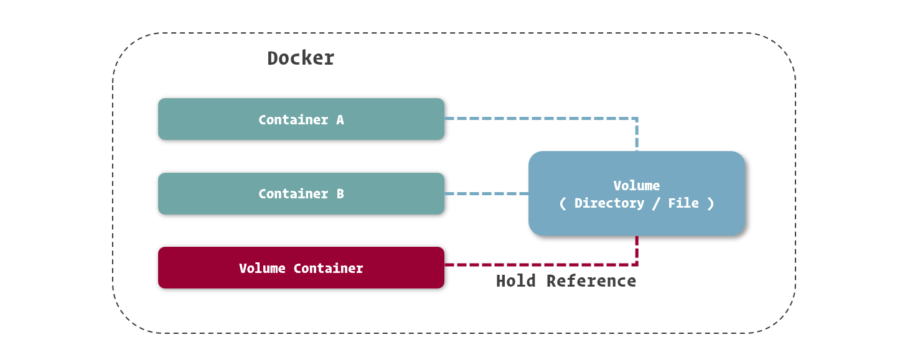

创建数据卷容器的方式很简单，由于不需要容器本身运行，因而我们找个简单的系统镜像都可以完成创建。

```
$ sudo docker create --name appdata -v /webapp/storage ubuntu
```

在使用数据卷容器时，我们不建议再定义数据卷的名称，因为我们可以通过对数据卷容器的引用来完成数据卷的引用。而不设置数据卷的名称，也避免了在同一 Docker 中数据卷重名的尴尬。

之前我们提到，Docker 的 Network 是容器间的网络桥梁，如果做类比，数据卷容器就可以算是容器间的文件系统桥梁。我们可以像加入网络一样引用数据卷容器，只需要在创建新容器时使用专门的 `--volumes-from` 选项即可。

```
$ sudo docker run -d --name webapp --volumes-from appdata webapp:latest
```

引用数据卷容器时，不需要再定义数据卷挂载到容器中的位置，Docker 会以数据卷容器中的挂载定义将数据卷挂载到引用的容器中。

虽然看上去数据卷容器与数据卷的使用方法变化不大，但最关键的就在于其真正隐藏了数据卷的配置和定义，我们只需要通过数据卷容器的名称来使用它。这些细节的隐藏，意味着我们能够更轻松的实现容器的迁移。

### 备份和迁移数据卷

由于数据卷本身就是宿主操作系统中的一个目录，我们只需要在 Docker 资源目录里找到它就可以很轻松的打包、迁移、恢复了。虽然这么做相对其他虚拟化方案来说已经很简单了，但在 Docker 里还不是最优雅的解决方式。

利用数据卷容器，我们还能够更方便的对数据卷中的数据进行迁移。

数据备份、迁移、恢复的过程可以理解为对数据进行打包，移动到其他位置，在需要的地方解压的过程。在数据打包之前，我们先建立一个用来存放打包文件的目录，这里我们使用 `/backup` 作为例子。

要备份数据，我们先建立一个临时的容器，将用于备份的目录和要备份的数据卷都挂载到这个容器上。

```
$ sudo docker run --rm --volumes-from appdata -v /backup:/backup ubuntu tar cvf /backup/backup.tar /webapp/storage
```

在这条命令中，除了挂载的配置外，我们再注意几个选项。通过 `--rm` 选项，我们可以让容器在停止后自动删除，而不需要我们再使用容器删除命令来删除它，这对于我们使用一些临时容器很有帮助。在容器所基于的镜像之后，我们还看到了一串命令，也就是 `tar cvf /backup/backup.tar /webapp/storage`，其实如果我们在镜像定义之后接上命令，可以直接替换掉镜像所定义的主程序启动命令，而去执行这一条命令。在很多场合下，我们还能通过这个方法干很多不同的事情。

在备份后，我们就可以在 /backup 下找到数据卷的备份文件，也就是 backup.tar 了。

如果要恢复数据卷中的数据，我们也可以借助临时容器完成。

```
$ docker run --rm --volumes-from appdata -v /backup:/backup ubuntu tar xvf /backup/backup.tar -C /webapp/storage --strip
```

恢复的过程与备份的过程类似，只不过把打包的命令转换为解包的命令而已。

## 另一个挂载选项

上面我们讲到了使用 `-v` 选项来挂载存在容易混淆的问题，其主要原因是挂载的方式和配置随着 Docker 的不断发展日渐丰富，而 `-v` 选项的传参方式限制了它能使用的场景。

其实在 Docker 里为我们提供了一个相对支持丰富的挂载方式，也就是通过 `--mount` 这个选项配置挂载。

```
$ sudo docker run -d --name webapp webapp:latest --mount 'type=volume,src=appdata,dst=/webapp/storage,volume-driver=local,volume-opt=type=nfs,volume-opt=device=<nfs-server>:<nfs-path>' webapp:latest
```

在 `--mount` 中，我们可以通过逗号分隔这种 CSV 格式来定义多个参数。其中，通过 type 我们可以定义挂载类型，其值可以是：bind，volume 或 tmpfs。另外，`--mount` 选项能够帮助我们实现集群挂载的定义，例如在这个例子中，我们挂载的来源是一个 NFS 目录。

由于在实际开发中，`-v` 基本上足够满足我们的需求，所以我们不常使用相对复杂的 `--mount` 选项来定义挂载，这里我们只是将它简单介绍，供大家参考。


# 镜像与容器

镜像和容器作为 Docker 里最基础的概念，我们很有必要了解 Docker 对它们的很多定义以及其他与它们有关的知识。在这一小节里，我们就专门针对镜像与容器两个概念展开，细致的梳理与这两者有关的概念和定义。

## Docker 镜像

如果进行形象的表述，我们可以将 Docker 镜像理解为包含应用程序以及其相关依赖的一个基础文件系统，在 Docker 容器启动的过程中，它以只读的方式被用于创建容器的运行环境。

从另一个角度看，在之前的小节里我们讲到了，Docker 镜像其实是由基于 UnionFS 文件系统的一组镜像层依次挂载而得，而每个镜像层包含的其实是对上一镜像层的修改，这些修改其实是发生在容器运行的过程中的。所以，我们也可以反过来理解，镜像是对容器运行环境进行持久化存储的结果。

### 深入镜像实现

与其他虚拟机的镜像管理不同，Docker 将镜像管理纳入到了自身设计之中，也就是说，所有的 Docker 镜像都是按照 Docker 所设定的逻辑打包的，也是受到 Docker Engine 所控制的。

这么说起来也许还不够具体，让我们来做一个比较。我们常见的虚拟机镜像，通常是由热心的提供者以他们自己熟悉的方式打包成镜像文件，被我们从网上下载或是其他方式获得后，恢复到虚拟机中的文件系统里的。而 Docker 的镜像我们必须通过 Docker 来打包，也必须通过 Docker 下载或导入后使用，不能单独直接恢复成容器中的文件系统。

虽然这么做失去了很多灵活性，但固定的格式意味着我们可以很轻松的在不同的服务器间传递 Docker 镜像，配合 Docker 自身对镜像的管理功能，让我们在不同的机器中传递和共享 Docker 变得非常方便。这也是 Docker 能够提升我们工作效率的一处体现。

对于每一个记录文件系统修改的镜像层来说，Docker 都会根据它们的信息生成了一个 Hash 码，这是一个 64 长度的字符串，足以保证全球唯一性。这种编码的形式在 Docker 很多地方都有体现，之后我们会经常见到。

由于镜像层都有唯一的编码，我们就能够区分不同的镜像层并能保证它们的内容与编码是一致的，这带来了另一项好处，就是允许我们在镜像之间共享镜像层。

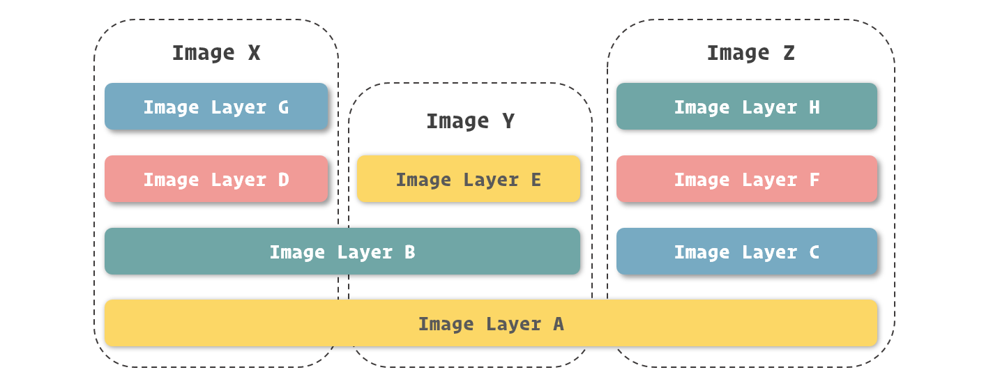

举一个实际的例子，由 Docker 官方提供的两个镜像 elasticsearch 镜像和 jenkins 镜像都是在 openjdk 镜像之上修改而得，那么在我们实际使用的时候，这两个镜像是可以共用 openjdk 镜像内部的镜像层的。

这带来的一项好处就是让镜像可以共用一些存储空间，达到 1 + 1 < 2 的效果，为我们在同一台机器里存放众多镜像提供了可能。

事实上，这个优势是更为明显的。一个虚拟机镜像的占用空间往往用 GB 来衡量，在同一台物理机上存放几个就已经是了不起的事情了。而 Docker 管理之下的镜像，占用空间是以 MB 为单位进行衡量的，加之镜像之间还能够共享部分的镜像层，也就是共享存储空间，所以我们在常见的硬盘里放下几十、数百个镜像也不是什么难事。

在之后的小节里，我们会讲到如何导出镜像，在导出镜像的时候，我们可以更清晰的看到镜像层的体现，这个留至后面我们来讲解。

### 查看镜像

镜像是由 Docker 进行管理的，所以它们的存储位置和存储方式等我们并不需要过多的关心，我们只需要利用 Docker 所提供的一些接口或命令对它们进行控制即可。

如果要查看当前连接的 docker daemon 中存放和管理了哪些镜像，我们可以使用 `docker images` 这个命令 ( Linux、macOS 还是 Windows 上都是一致的 )。

```
$ docker images
REPOSITORY          TAG                 IMAGE ID            CREATED             SIZE
php                 7-fpm               f214b5c48a25        9 days ago          368MB
redis               3.2                 2fef532eadb3        11 days ago         76MB
redis               4.0                 e1a73233e3be        11 days ago         83.4MB
cogset/cron         latest              c01d5ac6fc8a        15 months ago       125MB
```

在 `docker images` 命令的结果中，我们可以看到**镜像的 ID ( IMAGE ID)**、**构建时间 ( CREATED )**、**占用空间 ( SIZE )** 等数据。

这里需要注意一点，我们发现在结果中镜像 ID 的长度只有 12 个字符，这和我们之前说的 64 个字符貌似不一致。其实为了避免屏幕的空间都被这些看似“乱码”的镜像 ID 所挤占，所以 Docker 只显示了镜像 ID 的前 12 个字符，大部分情况下，它们已经能够让我们在单一主机中识别出不同的镜像了。

### 镜像命名

镜像层的 ID 既可以识别每个镜像层，也可以用来直接识别镜像 ( 因为根据最上层镜像能够找出所有依赖的下层镜像，所以最上层进行的镜像层 ID 就能表示镜像的 ID )，但是使用这种无意义的超长哈希码显然是违背人性的，所以这里我们还要介绍镜像的命名，通过镜像名我们能够更容易的识别镜像。

在 `docker images` 命令打印出的内容中，我们还能看到两个与镜像命名有关的数据：**REPOSITORY** 和 **TAG**，这两者其实就组成了 docker 对镜像的命名规则。

来看这个例子：

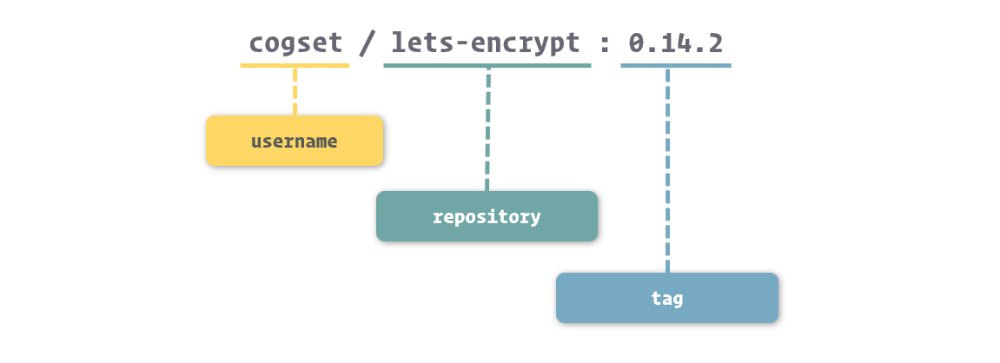

准确的来说，镜像的命名我们可以分成三个部分：**username**、**repository** 和 **tag**。

- **username**： 主要用于识别上传镜像的不同用户，与 GitHub 中的用户空间类似。
- **repository**：主要用于识别进行的内容，形成对镜像的表意描述。
- **tag**：主要用户表示镜像的版本，方便区分进行内容的不同细节

对于 username 来说，在上面我们展示的 `docker images` 结果中，有的镜像有 username 这个部分，而有的镜像是没有的。没有 username 这个部分的镜像，表示镜像是由 Docker 官方所维护和提供的，所以就不单独标记用户了。

如果大家再多接触一些镜像，会发现 Docker 中镜像的 repository 部分通常采用的是软件名。这时候大家一定要注意了，镜像还是镜像，镜像名还是镜像名，其与软件命名其实是独立的。

之所以镜像通常直接采用软件名，这还要回归到 Docker 对容器的轻量化设计中。Docker 对容器的设计和定义是微型容器而不是庞大臃肿的完整环境 ( 这当然归功于容器技术在实现虚拟化过程中性能几乎无损 )，这就使得我们通常会只在一个容器中运行一个应用程序，这样的好处自然是能够大幅降低程序之间相互的影响，也有利于利用容器技术控制每个程序所使用的资源。

回过头来，既然我们推崇这种一个容器运行一个程序的做法，那么自然容器的镜像也会仅包含程序以及与它运行有关的一些依赖包，所以我们使用程序的名字直接套用在镜像之上，既祛除了镜像取名的麻烦，又能直接表达镜像中的内容。

在镜像命名中，还有一个非常重要的部分，也就是镜像的标签 ( tag )。镜像的标签是对同一种镜像进行更细层次区分的方法，也是最终识别镜像的关键部分。

通常来说，镜像的标签主要是为了区分同类镜像不同构建过程所产生的不同结果的。由于时间、空间等因素的不同，Docker 每次构建镜像的内容也就有所不同，具体体现就是镜像层以及它们的 ID 都会产生变化。而标签就是在镜像命名这个层面上区分这些镜像的方法。

与镜像的 repository 类似，镜像 tag 的命名方法也通常参考镜像所关联的应用程序。更确切的来说，我们通常会采用镜像内应用程序的版本号以及一些环境、构建方式等信息来作为镜像的 tag。

例如，我们之前示例的结果中就分别有包含 Redis 3.2 版本和 4.0 版本的两个镜像：`redis:3.2` 和 `redis:4.0`。

除了单纯使用应用程序版本来作为镜像的标签外，有时候我们也会在其中包含一些构建方式的区别。例如 `php:7.2-cli` 和 `php:7.2-fpm` 两个镜像分别表示只包含控制台命令的 PHP 镜像以及包含 PHP-FPM 功能的 PHP 镜像，而他们对应 PHP 版本都是 7.2。

通过组合应用程序和它的版本号来命名镜像，大大方便了我们在 Docker 区别和使用镜像的门槛，与其说我们在使用 Docker 进行来启动容器，这个过程倒更像我们在运行指定版本的应用程序。

另外，Docker 中还有一个约定，当我们在操作中没有具体给出镜像的 tag 时，Docker 会采用 **latest** 作为缺省 tag。这也就带来了一个共识，也就是绝大多数镜像提供者在提供镜像时，会在 latest 对应的镜像中包含软件最新的版本。这带来了一项小便利，就是我们在不需要了解应用程序迭代周期的情况下，可以利用 latest 镜像保持软件最新版本的使用。

## 容器的生命周期

要熟悉 Docker 容器，还有一个重要的概念，也就是容器的生命周期。

由于 Docker 揽下了大部分对容器管理的活，只提供给我们非常简单的操作接口，这就意味着 Docker 里对容器的一些运行细节会被更加严格的定义，这其中就包括了容器的生命周期。

这里有一张容器运行的状态流转图：


图中展示了几种常见对 Docker 容器的操作命令，以及执行它们之后容器运行状态的变化。这里我们撇开命令，着重看看容器的几个核心状态，也就是图中色块表示的：**Created**、**Running**、**Paused**、**Stopped**、**Deleted**。

在这几种状态中，Running 是最为关键的状态，在这种状态中的容器，就是真正正在运行的容器了。

### 主进程

如果单纯去看容器的生命周期会有一些难理解的地方，而 Docker 中对容器生命周期的定义其实并不是独立存在的。

在 Docker 的设计中，容器的生命周期其实与容器中 PID 为 1 这个进程有着密切的关系。更确切的说，它们其实是共患难，同生死的兄弟。容器的启动，本质上可以理解为这个进程的启动，而容器的停止也就意味着这个进程的停止，反过来理解亦然。

当我们启动容器时，Docker 其实会按照镜像中的定义，启动对应的程序，并将这个程序的主进程作为容器的主进程 ( 也就是 PID 为 1 的进程 )。而当我们控制容器停止时，Docker 会向主进程发送结束信号，通知程序退出。

而当容器中的主进程主动关闭时 ( 正常结束或出错停止 )，也会让容器随之停止。

通过之前提到的几个方面来看，Docker 不仅是从设计上推崇轻量化的容器，也是许多机制上是以此为原则去实现的。所以，我们最佳的 Docker 实践方法是遵循着它的逻辑，逐渐习惯这种容器即应用，应用即容器的虚拟化方式。虽然在 Docker 中我们也能够实现在同一个容器中运行多个不同类型的程序，但这么做的话，Docker 就无法跟踪不同应用的生命周期，有可能造成应用的非正常关闭，进而影响系统、数据的稳定性。

## 写时复制机制

写时复制 ( Copy on Write ) 这个词对于开发者来说应该并不陌生，在很多编程语言里，都隐藏了写时复制的实现。在编程里，写时复制常常用于对象或数组的拷贝中，当我们拷贝对象或数组时，复制的过程并不是马上发生在内存中，而只是先让两个变量同时指向同一个内存空间，并进行一些标记，当我们要对对象或数组进行修改时，才真正进行内存的拷贝。

Docker 的写时复制与编程中的相类似，也就是在通过镜像运行容器时，并不是马上就把镜像里的所有内容拷贝到容器所运行的沙盒文件系统中，而是利用 UnionFS 将镜像以只读的方式挂载到沙盒文件系统中。只有在容器中发生对文件的修改时，修改才会体现到沙盒环境上。

也就是说，容器在创建和启动的过程中，不需要进行任何的文件系统复制操作，也不需要为容器单独开辟大量的硬盘空间，与其他虚拟化方式对这个过程的操作进行对比，Docker 启动的速度可见一斑。

采用写时复制机制来设计的 Docker，既保证了镜像在生成为容器时，以及容器在运行过程中，不会对自身造成修改。又借助剔除常见虚拟化在初始化时需要从镜像中拷贝整个文件系统的过程，大幅提高了容器的创建和启动速度。可以说，Docker 容器能够实现秒级启动速度，写时复制机制在其中发挥了举足轻重的作用。


# 为容器配置网络

在互联网时代，网络已经成为绝大多数应用进行数据交换的主要通道，Docker 作为集群部署的利器，在网络支持上也下了许多功夫。功能丰富和强大，并不代表使用复杂，在 Docker 的封装下，我们依然可以通过命令和参数轻松的为容器制定不同的网络方案。在这一节中，我们就来了解 Docker 的网络部分。

## 容器网络

在之前介绍 Docker 核心组成的时候，我们已经简单谈到了容器网络的相关知识。容器网络实质上也是由 Docker 为应用程序所创造的虚拟环境的一部分，它能让应用从宿主机操作系统的网络环境中独立出来，形成容器自有的网络设备、IP 协议栈、端口套接字、IP 路由表、防火墙等等与网络相关的模块。


还是回归上面这幅之前展示过的关于 Docker 网络的图片。在 Docker 网络中，有三个比较核心的概念，也就是：**沙盒 ( Sandbox )**、**网络 ( Network )**、**端点 ( Endpoint )**。

- **沙盒**提供了容器的虚拟网络栈，也就是之前所提到的端口套接字、IP 路由表、防火墙等的内容。其实现隔离了容器网络与宿主机网络，形成了完全独立的容器网络环境。
- **网络**可以理解为 Docker 内部的虚拟子网，网络内的参与者相互可见并能够进行通讯。Docker 的这种虚拟网络也是于宿主机网络存在隔离关系的，其目的主要是形成容器间的安全通讯环境。
- **端点**是位于容器或网络隔离墙之上的洞，其主要目的是形成一个可以控制的突破封闭的网络环境的出入口。当容器的端点与网络的端点形成配对后，就如同在这两者之间搭建了桥梁，便能够进行数据传输了。

这三者形成了 Docker 网络的核心模型，也就是容器网络模型 ( Container Network Model )。

### 浅析 Docker 的网络实现

容器网络模型为容器引擎提供了一套标准的网络对接范式，而在 Docker 中，实现这套范式的是 Docker 所封装的 libnetwork 模块。

而对于网络的具体实现，在 Docker 的发展过程中也逐渐抽象，形成了统一的抽象定义。进而通过这些抽象定义，便可以对 Docker 网络的实现方式进行不同的变化。

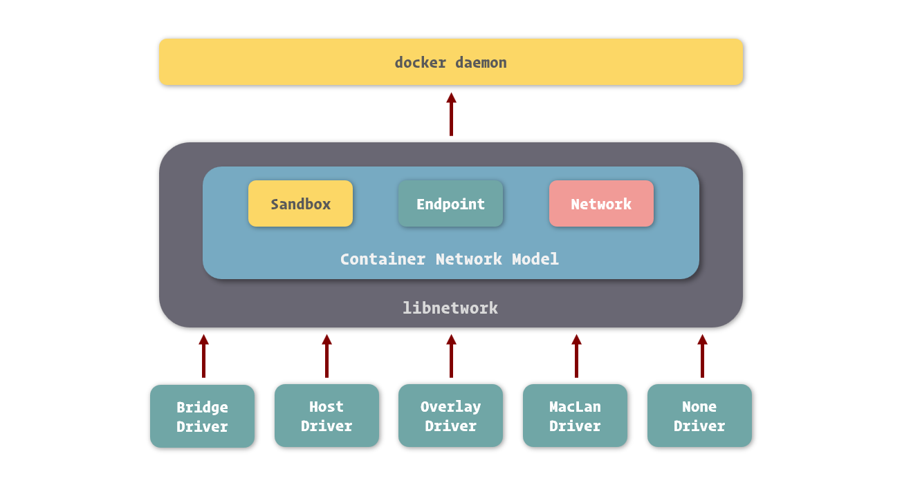

目前 Docker 官方为我们提供了五种 Docker 网络驱动，分别是：**Bridge Driver**、**Host Driver**、**Overlay Driver**、**MacLan Driver**、**None Driver**。

其中，Bridge 网络是 Docker 容器的默认网络驱动，简而言之其就是通过网桥来实现网络通讯 ( 网桥网络的实现可以基于硬件，也可以基于软件 )。而 Overlay 网络是借助 Docker 集群模块 Docker Swarm 来搭建的跨 Docker Daemon 网络，我们可以通过它搭建跨物理主机的虚拟网络，进而让不同物理机中运行的容器感知不到多个物理机的存在。

Bridge Driver 和 Overlay Driver 在开发中使用频率较高，之后的小节讲解里，关于容器网络的部分我们都主要围绕着它们展开。

当然，关于 Docker 的网络实现还有非常多的细节。对于开发者来说，我们只是 Docker 的使用者而非技术专家，所以这里我们不做更多详尽的论述。

## 容器互联

由于 Docker 提倡容器与应用共生的轻量级容器理念，所以容器中通常只包含一种应用程序，但我们知道，如今纷繁的系统服务，没有几个是可以通过单一的应用程序支撑的。拿最简单的 Web 应用为例，也至少需要业务应用、数据库应用、缓存应用等组成。也就是说，在 Docker 里我们需要通过多个容器来组成这样的系统。

而这些互联网时代的应用，其间的通讯方式主要以网络为主，所以打通容器间的网络，是使它们能够互相通讯的关键所在。

要让一个容器连接到另外一个容器，我们可以在容器通过 `docker create` 或 `docker run` 创建时通过 `--link` 选项进行配置。

例如，这里我们创建一个 MySQL 容器，将运行我们 Web 应用的容器连接到这个 MySQL 容器上，打通两个容器间的网络，实现它们之间的网络互通。

```
$ sudo docker run -d --name mysql -e MYSQL_RANDOM_ROOT_PASSWORD=yes mysql
$ sudo docker run -d --name webapp --link mysql webapp:latest
```

容器间的网络已经打通，那么我们要如何在 Web 应用中连接到 MySQL 数据库呢？Docker 为容器间连接提供了一种非常友好的方式，我们只需要将容器的网络命名填入到连接地址中，就可以访问需要连接的容器了。

假设我们在 Web 应用中使用的是 JDBC 进行数据库连接的，我们可以这么填写连接。

```
String url = "jdbc:mysql://mysql:3306/webapp";
```

在这里，连接地址中的 mysql 就好似我们常见的域名解析，Docker 会将其指向 MySQL 容器的 IP 地址。

看到这里，读者们有没有发现 Docker 在容器互通中为我们带来的一项便利，也就是我们不再需要真实的知道另外一个容器的 IP 地址就能进行连接。再具体来对比，在以往的开发中，我们每切换一个环境 ( 例如将程序从开发环境提交到测试环境 )，都需要重新配置程序中的各项连接地址等参数，而在 Docker 里，我们并不需要关心这个，只需要程序中配置被连接容器的别名，映射 IP 的工作就交给 Docker 完成了。

### 暴露端口

需要注意的是，虽然容器间的网络打通了，但并不意味着我们可以任意访问被连接容器中的任何服务。Docker 为容器网络增加了一套安全机制，只有容器自身允许的端口，才能被其他容器所访问。

这个容器自我标记端口可被访问的过程，我们通常称为暴露端口。我们在 `docker ps` 的结果中可以看到容器暴露给其他容器访问的端口。

```
$ sudo docker ps
CONTAINER ID        IMAGE               COMMAND                  CREATED             STATUS              PORTS                 NAMES
95507bc88082        mysql:5.7           "docker-entrypoint.s…"   17 seconds ago      Up 16 seconds       3306/tcp, 33060/tcp   mysql
```

这里我们看到，MySQL 这个容器暴露的端口是 3306 和 33060。所以我们连接到 MySQL 容器后，只能对这两个端口进行访问。

端口的暴露可以通过 Docker 镜像进行定义，也可以在容器创建时进行定义。在容器创建时进行定义的方法是借助 `--expose` 这个选项。

```
$ sudo docker run -d --name mysql -e MYSQL_RANDOM_ROOT_PASSWORD=yes --expose 13306 --expose 23306 mysql:5.7
```

这里我们为 MySQL 暴露了 13306 和 23306 这两个端口，暴露后我们可以在 `docker ps` 中看到这两个端口已经成功的打开。

```
$ sudo docker ps 
CONTAINER ID        IMAGE               COMMAND                  CREATED             STATUS              PORTS                                       NAMES
3c4e645f21d7        mysql:5.7           "docker-entrypoint.s…"   4 seconds ago       Up 3 seconds        3306/tcp, 13306/tcp, 23306/tcp, 33060/tcp   mysql
```

容器暴露了端口只是类似我们打开了容器的防火墙，具体能不能通过这个端口访问容器中的服务，还需要容器中的应用监听并处理来自这个端口的请求。

### 通过别名连接

纯粹的通过容器名来打开容器间的网络通道缺乏一定的灵活性，在 Docker 里还支持连接时使用别名来使我们摆脱容器名的限制。

```
$ sudo docker run -d --name webapp --link mysql:database webapp:latest
```

在这里，我们使用 `--link <name>:<alias>` 的形式，连接到 MySQL 容器，并设置它的别名为 database。当我们要在 Web 应用中使用 MySQL 连接时，我们就可以使用 database 来代替连接地址了。

```
String url = "jdbc:mysql://database:3306/webapp";
```

## 管理网络

容器能够互相连接的前提是两者同处于一个网络中 ( 这里的网络是指容器网络模型中的网络 )。这个限制很好理解，刚才我们说了，网络这个概念我们可以理解为 Docker 所虚拟的子网，而容器网络沙盒可以看做是虚拟的主机，只有当多个主机在同一子网里时，才能互相看到并进行网络数据交换。

当我们启动 Docker 服务时，它会为我们创建一个默认的 bridge 网络，而我们创建的容器在不专门指定网络的情况下都会连接到这个网络上。所以我们刚才之所以能够把 webapp 容器连接到 mysql 容器上，其原因是两者都处于 bridge 这个网络上。

我们通过 `docker inspect` 命令查看容器，可以在 Network 部分看到容器网络相关的信息。

```
$ sudo docker inspect mysql
[
    {
## ......
        "NetworkSettings": {
## ......
            "Networks": {
                "bridge": {
                    "IPAMConfig": null,
                    "Links": null,
                    "Aliases": null,
                    "NetworkID": "bc14eb1da66b67c7d155d6c78cb5389d4ffa6c719c8be3280628b7b54617441b",
                    "EndpointID": "1e201db6858341d326be4510971b2f81f0f85ebd09b9b168e1df61bab18a6f22",
                    "Gateway": "172.17.0.1",
                    "IPAddress": "172.17.0.2",
                    "IPPrefixLen": 16,
                    "IPv6Gateway": "",
                    "GlobalIPv6Address": "",
                    "GlobalIPv6PrefixLen": 0,
                    "MacAddress": "02:42:ac:11:00:02",
                    "DriverOpts": null
                }
            }
## ......
        }
## ......
    }
]
```

这里我们能够看到 mysql 容器在 bridge 网络中所分配的 IP 地址，其自身的端点、Mac 地址，bridge 网络的网关地址等信息。

Docker 默认创建的这个 bridge 网络是非常重要的，理由自然是在没有明确指定容器网络时，容器都会连接到这个网络中。在之前讲解 Docker for Win 和 Docker for Mac 安装的时候，我们提到过这两个软件的配置中都有一块配置 Docker 中默认网络的内容，这块所指的默认网络就是这个 bridge 网络。

### 创建网络

在 Docker 里，我们也能够创建网络，形成自己定义虚拟子网的目的。

docker CLI 里与网络相关的命令都以 `docker network` 开头，其中创建网络的命令是 `docker network create`。

```
$ sudo docker network create -d bridge individual
```

通过 `-d` 选项我们可以为新的网络指定驱动的类型，其值可以是刚才我们所提及的 bridge、host、overlay、maclan、none，也可以是其他网络驱动插件所定义的类型。这里我们使用的是 Bridge Driver ( 当我们不指定网络驱动时，Docker 也会默认采用 Bridge Driver 作为网络驱动 )。

通过 `docker network ls` 或是 `docker network list` 可以查看 Docker 中已经存在的网络。

```
$ sudo docker network ls
NETWORK ID          NAME                DRIVER              SCOPE
bc14eb1da66b        bridge              bridge              local
35c3ef1cc27d        individual          bridge              local
```

之后在我们创建容器时，可以通过 `--network` 来指定容器所加入的网络，一旦这个参数被指定，容器便不会默认加入到 bridge 这个网络中了 ( 但是仍然可以通过 `--network bridge` 让其加入 )。

```
$ sudo docker run -d --name mysql -e MYSQL_RANDOM_ROOT_PASSWORD=yes --network individual mysql:5.7
```

我们通过 `docker inspect` 观察一下此时的容器网络。

```
$ sudo docker inspect mysql
[
    {
## ......
        "NetworkSettings": {
## ......
            "Networks": {
                "individual": {
                    "IPAMConfig": null,
                    "Links": null,
                    "Aliases": [
                        "2ad678e6d110"
                    ],
                    "NetworkID": "35c3ef1cc27d24e15a2b22bdd606dc28e58f0593ead6a57da34a8ed989b1b15d",
                    "EndpointID": "41a2345b913a45c3c5aae258776fcd1be03b812403e249f96b161e50d66595ab",
                    "Gateway": "172.18.0.1",
                    "IPAddress": "172.18.0.2",
                    "IPPrefixLen": 16,
                    "IPv6Gateway": "",
                    "GlobalIPv6Address": "",
                    "GlobalIPv6PrefixLen": 0,
                    "MacAddress": "02:42:ac:12:00:02",
                    "DriverOpts": null
                }
            }
## ......
        }
## ......
    }
]
```

可以看到，容器所加入网络已经变成了 individual 这个网络了。

这时候我们通过 `--link` 让处于另外一个网络的容器连接到这个容器上，看看会发生什么样的效果。

```
$ sudo docker run -d --name webapp --link mysql --network bridge webapp:latest
docker: Error response from daemon: Cannot link to /mysql, as it does not belong to the default network.
ERRO[0000] error waiting for container: context canceled
```

可以看到容器并不能正常的启动，而 Docker 提醒我们两个容器处于不同的网络，之间是不能相互连接引用的。

我们来改变一下，让运行 Web 应用的容器加入到 individual 这个网络，就可以成功建立容器间的网络连接了。

```
$ sudo docker run -d --name webapp --link mysql --network individual webapp:latest
```

## 端口映射

刚才我们提及的都是容器直接通过 Docker 网络进行的互相访问，在实际使用中，还有一个非常常见的需求，就是我们需要在容器外通过网络访问容器中的应用。最简单的一个例子，我们提供了 Web 服务，那么我们就需要提供一种方式访问运行在容器中的 Web 应用。

在 Docker 中，提供了一个端口映射的功能实现这样的需求。

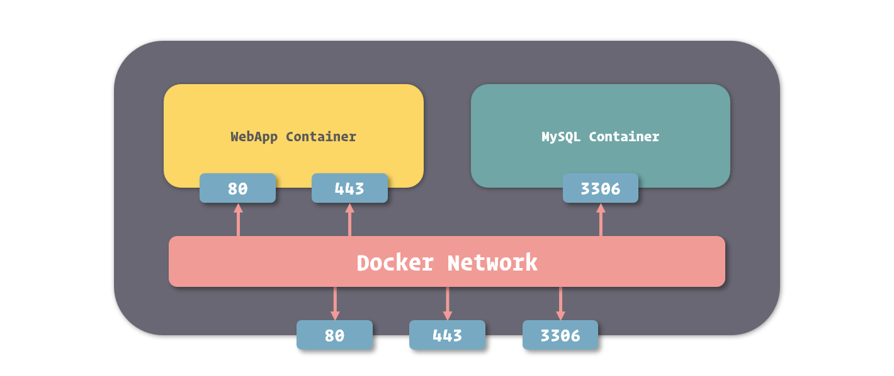

通过 Docker 端口映射功能，我们可以把容器的端口映射到宿主操作系统的端口上，当我们从外部访问宿主操作系统的端口时，数据请求就会自动发送给与之关联的容器端口。

要映射端口，我们可以在创建容器时使用 `-p` 或者是 `--publish` 选项。

```
$ sudo docker run -d --name nginx -p 80:80 -p 443:443 nginx:1.12
```

使用端口映射选项的格式是 `-p <ip>:<host-port>:<container-port>`，其中 ip 是宿主操作系统的监听 ip，可以用来控制监听的网卡，默认为 0.0.0.0，也就是监听所有网卡。host-port 和 container-port 分别表示映射到宿主操作系统的端口和容器的端口，这两者是可以不一样的，我们可以将容器的 80 端口映射到宿主操作系统的 8080 端口，传入 `-p 8080:80` 即可。

我们可以在容器列表里看到端口映射的配置。

```
$ sudo docker ps
CONTAINER ID        IMAGE               COMMAND                  CREATED             STATUS              PORTS                                      NAMES
bc79fc5d42a6        nginx:1.12          "nginx -g 'daemon of…"   4 seconds ago       Up 2 seconds        0.0.0.0:80->80/tcp, 0.0.0.0:443->443/tcp   nginx
```

打印的结果里用 `->` 标记了端口的映射关系。

### 在 Windows 和 macOS 中使用映射

Docker 的端口映射功能是将容器端口映射到宿主操作系统的端口上，实际来说就是映射到了 Linux 系统的端口上。而我们知道，在 Windows 和 macOS 中运行的 Docker，其 Linux 环境是被虚拟出来的，如果我们仅仅是将端口映射到 Linux 上，由于虚拟环境还有一层隔离，我们依然不能通过 Windows 或 macOS 的端口来访问容器。

解决这种问题的方法很简单，只需要再加一次映射，将虚拟 Linux 系统中的端口映射到 Windows 或 macOS 的端口即可。

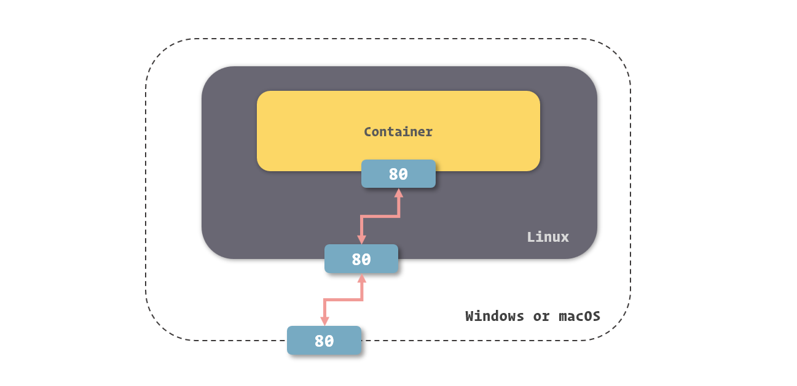

如果我们使用 Docker for Windows 或 Docker for Mac，这个端口映射的操作程序会自动帮助我们完成，所以我们不需要做任何额外的事情，就能够直接使用 Windows 或 macOS 的端口访问容器端口了。

而当我们使用 Docker Toolbox 时，由于其自动化能力比较差，所以需要我们在 VirtualBox 里单独配置这个操作系统端口到 Linux 端口的映射关系。

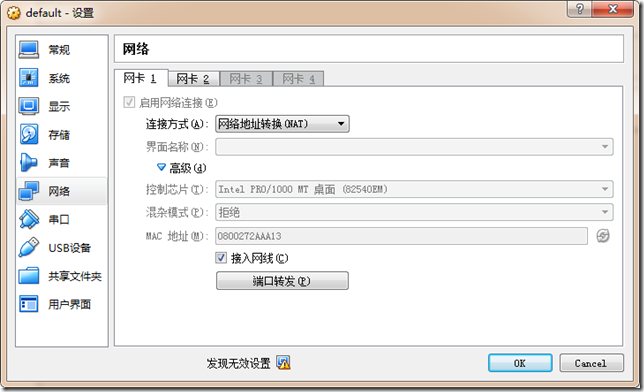

在 VirtualBox 配置中的端口转发一栏里，进行相关的配置即可。


# 运行和管理容器

容器是基于容器技术所建立和运行的轻量级应用运行环境，它是 Docker 封装和管理应用程序或微服务的“集装箱”。在 Docker 中，容器算是最核心的部分了，掌握容器的操作也是 Docker 中最基础的技能了。在这一节中，我们会深入了解容器，展示关于容器的操作。

## 容器的创建和启动

在了解容器的各项操作之前，我们再来回顾一下之前我们所提及的容器状态流转。

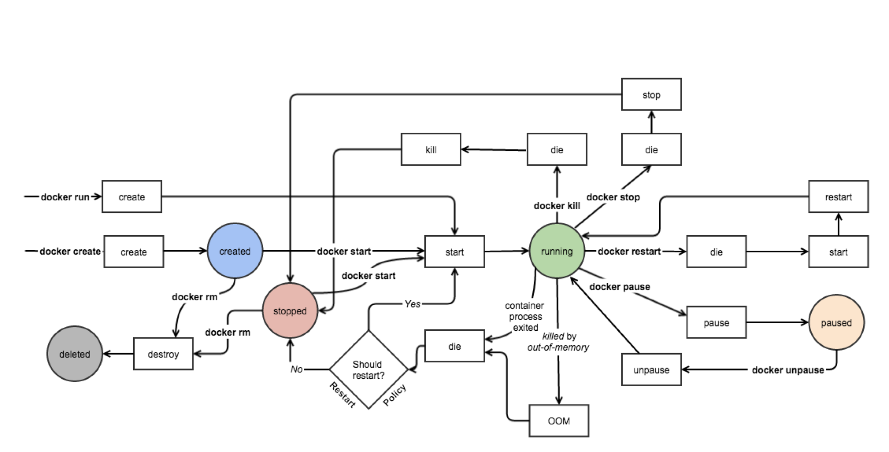

在这幅图中，我们可以看到，Docker 容器的生命周期里分为五种状态，其分别代表着：

- **Created**：容器已经被创建，容器所需的相关资源已经准备就绪，但容器中的程序还未处于运行状态。
- **Running**：容器正在运行，也就是容器中的应用正在运行。
- **Paused**：容器已暂停，表示容器中的所有程序都处于暂停 ( 不是停止 ) 状态。
- **Stopped**：容器处于停止状态，占用的资源和沙盒环境都依然存在，只是容器中的应用程序均已停止。
- **Deleted**：容器已删除，相关占用的资源及存储在 Docker 中的管理信息也都已释放和移除。

### 创建容器

当我们选择好镜像以后，就可以通过 `docker create` 这个命令来创建容器了。

```
$ sudo docker create nginx:1.12
34f277e22be252b51d204acbb32ce21181df86520de0c337a835de6932ca06c3
```

执行 `docker create` 后，Docker 会根据我们所给出的镜像创建容器，在控制台中会打印出 Docker 为容器所分配的容器 ID，此时容器是处于 Created 状态的。

之后我们对容器的操作可以通过这个容器 ID 或者它的缩略形式进行，但用容器 ID 操作容器就和用镜像 ID 操作镜像一样烦闷，所以我们更习惯于使用容器名来操作容器。

要使用容器名操作容器，就先得给容器命名，在创建容器时，我们可以通过 `--name` 这个选项来配置容器名。

```
$ sudo docker create --name nginx nginx:1.12
```

### 启动容器

通过 `docker create` 创建的容器，是处于 Created 状态的，其内部的应用程序还没有启动，所以我们需要通过 `docker start` 命令来启动它。

```
$ sudo docker start nginx
```

由于我们为容器指定了名称，这样的操作会更加自然，所以我们非常推荐为每个被创建的容器都进行命名。

当容器启动后，其中的应用就会运行起来，容器的几个生命周期也会绑定到了这个应用上，这个之前我们已经提及，这里就不在赘述。只要应用程序还在运行，那么容器的状态就会是 Running，除非进行一些修改容器的操作。

在 Docker 里，还允许我们通过 `docker run` 这个命令将 `docker create` 和 `docker start` 这两步操作合成为一步，进一步提高工作效率。

```
$ sudo docker run --name nginx -d nginx:1.12
89f2b769498a50f5c35a314ab82300ce9945cbb69da9cda4b022646125db8ca7
```

通过 `docker run` 创建的容器，在创建完成之后会直接启动起来，不需要我们再使用 `docker start` 去启动了。

这里需要注意的一点是，通常来说我们启动容器会期望它运行在“后台”，而 `docker run` 在启动容器时，会采用“前台”运行这种方式，这时候我们的控制台就会衔接到容器上，不能再进行其他操作了。我们可以通过 `-d` 或 `--detach` 这个选项告诉 Docker 在启动后将程序与控制台分离，使其进入“后台”运行。

## 管理容器

容器创建和启动后，除了关注应用程序是否功能正常外，我们也会关注容器的状态等内容。

通过 `docker ps` 这个命令，我们可以罗列出 Docker 中的容器。

```
$ sudo docker ps
CONTAINER ID        IMAGE               COMMAND                  CREATED             STATUS              PORTS               NAMES
89f2b769498a        nginx:1.12          "nginx -g 'daemon of…"   About an hour ago   Up About an hour    80/tcp              nginx
```

默认情况下，`docker ps` 列出的容器是处于运行中的容器，如果要列出所有状态的容器，需要增加 `-a` 或 `--all` 选项。

```
$ sudo docker ps -a
CONTAINER ID        IMAGE               COMMAND                  CREATED             STATUS              PORTS               NAMES
425a0d3cd18b        redis:3.2           "docker-entrypoint.s…"   2 minutes ago       Created                                 redis
89f2b769498a        nginx:1.12          "nginx -g 'daemon of…"   About an hour ago   Up About an hour    80/tcp              nginx
```

在 `docker ps` 的结果中，我们可以看到几项关于容器的信息。其中 **CONTAINER ID**、**IMAGE**、**CREATED**、**NAMES** 大家都比较容易理解，分别表示容器 ID，容器所基于的镜像，容器的创建时间和容器的名称。

结果中的 **COMMAND** 表示的是容器中主程序 ( 也就是与容器生命周期所绑定进程所关联的程序 ) 的启动命令，这条命令是在镜像内定义的，而容器的启动其实质就是启动这条命令。关于 COMMAND 的更多知识，我们在之后的 Docker 镜像制作中会更详细的解读。

结果中的 **STATUS** 表示容器所处的状态，其值和我们之前所谈到的状态有所区别，主要是因为这里还记录了其他的一些信息。在这里，常见的状态表示有三种：

- **Created** 此时容器已创建，但还没有被启动过。
- **Up \[ Time \]** 这时候容器处于正在运行状态，而这里的 Time 表示容器从开始运行到查看时的时间。
- **Exited (\[ Code \]) \[ Time \]** 容器已经结束运行，这里的 Code 表示容器结束运行时，主程序返回的程序退出码，而 Time 则表示容器结束到查看时的时间。

有些读者有疑问，既然是列出容器，应该为命令取一些带有 `ls` 字眼的名字，为啥会用类似 Linux 中查看进程的 `ps` 呢？这其实有一部分历史原因，由于容器并非真的包裹住了进程，而只是隔离了进程，进程还是允许在宿主机操作系统之上的，所以列出镜像的过程到更新是查看正在运行的进程，故而有了这样的名字。

当然，在 Docker 逐渐成熟后，命令的命名也没有原来那么随意了，已经逐渐转换为使用大家广泛认可的形式。只是 `docker ps` 这条命令，还保留着复古的风格。

### 停止和删除容器

要将正在运行的容器停止，我们可以使用 `docker stop` 命令。

```
$ sudo docker stop nginx
```

容器停止后，其维持的文件系统沙盒环境还是存在的，内部被修改的内容也都会保留，我们可以通过 `docker start` 命令将这个容器再次启动。

当我们需要完全删除容器时，可以通过 `docker rm` 命令将容器进行删除。

```
$ sudo docker rm nginx
```

正在运行中的容器默认情况下是不能被删除的，我们可以通过增加 `-f` 或 `--force` 选项来让 `docker rm` 强制停止并删除容器，不过这种做法并不妥当。

### 随手删除容器

与其他虚拟机不同，Docker 的轻量级容器设计，讲究随用随开，随关随删。也就是说，当我们短时间内不需要使用容器时，最佳的做法是删除它而不是仅仅停止它。

有的读者会问，容器一旦删除，其内部的文件系统变动也就消失了，这样做岂不是非常麻烦。要解决这个疑惑，其根本是解决为什么我们会对容器中的文件系统做更改。我这里总结了两个对虚拟环境做更改的原因，以及在 Docker 中如何优雅的解决它们。

- 在使用虚拟机或其他虚拟化所搭建的虚拟环境时，我们倾向于使用一个干净的系统镜像并搭建程序的运行环境，由于将这类虚拟环境制作成镜像的成本较高，耗时也非常久，所以我们对于一些细小的改动倾向于修改后保持虚拟环境不被清除即可。而在 Docker 中，打包镜像的成本是非常低的，其速度也快得惊人，所以如果我们要为程序准备一些环境或者配置，完全可以直接将它们打包至新的镜像中，下次直接使用这个新的镜像创建容器即可。
- 容器中应用程序所产生的一些文件数据，是非常重要的，如果这些数据随着容器的删除而丢失，其损失是非常巨大的。对于这类由应用程序所产生的数据，并且需要保证它们不会随着容器的删除而消失的，我们可以使用 Docker 中的数据卷来单独存放。由于数据卷是独立于容器存在的，所以其能保证数据不会随着容器的删除而丢失。关于数据卷的具体使用，在之后的小节会专门讲解。

解决了这两个问题，大家心中的疑虑是不是就小了很多。而事实上，容器的随用随删既能保证在我们不需要它们的时候它们不会枉占很多资源，也保证了每次我们建立和启动容器时，它们都是“热乎”的崭新版本。大家都知道，系统卡就重装，而借助 Docker 秒级的容器启停特性，我们就是可以这么任性的“重装”。

## 进入容器

很多时间，我们需要的操作并不仅仅是按镜像所给出的命令启动容器而已，我们还会希望进一步了解容器或操作容器，这时候最佳的方式就是让我们进入到容器了。

我们知道，容器是一个隔离运行环境的东西，它里面除了镜像所规定的主进程外，其他的进程也是能够运行的，Docker 为我们提供了一个命令 `docker exec` 来让容器运行我们所给出的命令。

这里我们试试用容器中的 `more` 命令查看容器的主机名定义。

```
$ sudo docker exec nginx more /etc/hostname
::::::::::::::
/etc/hostname
::::::::::::::
83821ea220ed
```

`docker exec` 命令能帮助我们在正在运行的容器中运行指定命令，这对于服务控制，运维监控等有着不错的应用场景。但是在开发过程中，我们更常使用它来作为我们进入容器的桥梁。

熟悉 Linux 的朋友们知道，我们操作 Linux 这个过程，并不是 Linux 内部的某些机能，而是通过控制台软件来完成的。控制台软件分析我们的命令，将其转化为对 Linux 的系统调用，实现了我们对 Linux 的操作。若不是这样，生涩的系统调用方法对普通开发者来说简直就是黑洞一般的存在，更别提用它们控制系统了。

在 Linux 中，大家熟悉的控制台软件应该是 Shell 和 Bash 了，它们分别由 sh 和 bash 这两个程序启动。

说到这里，有读者一定想到了，既然有这两个控制台程序，我们只要在容器里执行它们，然后通过它们去控制容器内的环境，岂不就可以“自由的飞翔”了吗。没错，这里说的进入容器，就是通过 `docker exec` 命令来启动 sh 或 bash，并通过它们实现对容器内的虚拟环境的控制。

由于 bash 的功能要比 sh 丰富，所以在能够使用 bash 的容器里，我们优先选择它作为控制台程序。

```
$ sudo docker exec -it nginx bash
root@83821ea220ed:/#
```

在借助 `docker exec` 进入容器的时候，我们需要特别注意命令中的两个选项不可或缺，即 `-i` 和 `-t` ( 它们俩可以利用简写机制合并成 `-it` )。

其中 `-i` ( `--interactive` ) 表示保持我们的输入流，只有使用它才能保证控制台程序能够正确识别我们的命令。而 `-t` ( `--tty` ) 表示启用一个伪终端，形成我们与 bash 的交互，如果没有它，我们无法看到 bash 内部的执行结果。

熟悉通过在容器中执行控制台程序进而进入容器这种方法，在开发过程中你能更轻松的观察容器中发生了什么，也更容易排查程序或者环境引起的问题。

### 衔接到容器

Docker 为我们提供了一个 `docker attach` 命令，用于将当前的输入输出流连接到指定的容器上。

```
$ sudo docker attach nginx
```

这个命令最直观的效果可以理解为我们将容器中的主程序转为了“前台”运行 ( 与 `docker run` 中的 `-d` 选项有相反的意思 )。

由于我们的输入输出流衔接到了容器的主程序上，我们的输入输出操作也就直接针对了这个程序，而我们发送的 Linux 信号也会转移到这个程序上。例如我们可以通过 Ctrl + C 来向程序发送停止信号，让程序停止 ( 从而容器也会随之停止 )。

在实际开发中，由于 `docker attach` 限制较多，功能也不够强大，所以并没有太多用武之地，这里我们就一笔带过，不做详细的解读了。

