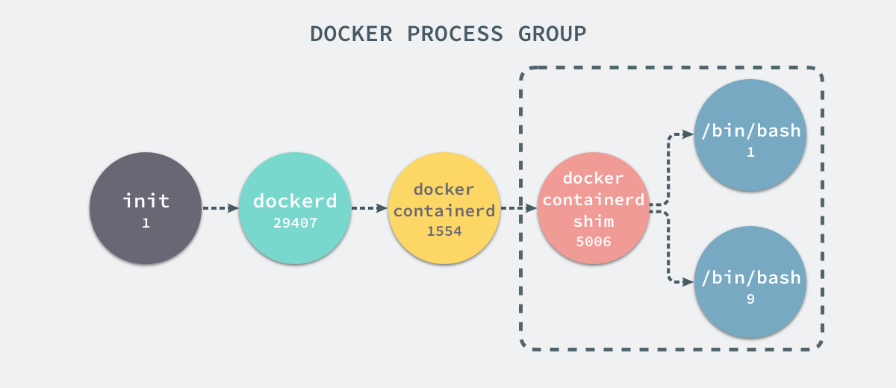
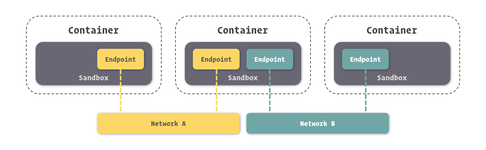

<!--more-->

# Docker 的简介

在了解虚拟化和容器技术后，我们就更容易理解 Docker 的相关知识了。在这一小节中，我将介绍关于 Docker 的出现和发展，Docker 背后的技术。同时，我们将阐述 Docker 在虚拟化领域中的定位以及其带来的变革。

## Docker 开源项目

如果说 Docker 的诞生，就必须从 Docker 这个开源项目提起 ( 虽然它现在已经不叫 Docker 了 )。Docker 项目是一个由 Go 语言实现的容器引擎，它最初由 dotCloud 这家做云服务的公司在 2013 年开源。

由于 Docker 带来的巨大的便利，让很多开发、测试和运维等软件开发环节上的工作被简化甚至省去，所以在短短的几年间便成为虚拟化乃至整个技术领域的热词。同时，许多开发者乃至大型科技企业都参与到了 Docker 相关领域的贡献中来，为 Docker 及其生态圈贡献了许多优秀的软件项目，这大大提高了 Docker 生态的完整性，也让 Docker 日益健壮。

也许 dotCloud 自己也没有想到，云服务没卖出几个钱，反倒是 Docker 越来越火。拥有商业头脑的他们，干脆不再做云服务了，也把公司名字改成 Docker Inc. 专门从事 Docker 周边的生意。

当然，Docker 的商业化也带来了一定的变化。为了更好的进行商业运作，Docker Inc. 将 Docker 开源项目的名称修改为了 Moby，所以大家要是在 GitHub 上没有搜索到 Docker 不要觉得惊讶，因为它现在的名字是 Moby ( [https://github.com/moby/moby](https://github.com/moby/moby) )。

关于 Moby 和 Docker 更多的内容，这里给大家提供一下参考资料，有兴趣的朋友们可以前往阅读：

- [Docker改名啦？什么是 Moby Project](https://yq.aliyun.com/articles/74437)
- [对于 Docker 改名 Moby ，大家怎么看？](https://www.zhihu.com/question/58805021)
- [Introducing Moby Project](https://blog.docker.com/2017/04/introducing-the-moby-project/)

## Docker 所带来的改变

简单说了一些 Docker 的故事，接来下我们就必须重点说一下 Docker 所带来的改变。正是这些对我们工作方式的改变，让我们越来越难以离开 Docker，又源于我们对 Docker 如此的喜爱，让 Docker 能够在短时间内就从雏鸟成长为大鹏，成为万众瞩目的新星。

### 云计算时代的挑战

在计算机技术发展的早期，几乎所有的程序都是在开发后部署到一台或是少数几台服务器上的。那时的程序也几乎都是集所有模块和运行时环境为一身的“全栈应用”，虽然这些程序可以基于一套良好、完善的协议栈 ( 譬如一套完整的 MVC 架构 ) 进行开发，但再好的架构也无法让应用服务在这种体系下快速发展。

随着互联网的极速发展，应用程序的功能越来越丰富，而需要迭代的速度要求也越来越高，为了实现这些目标，应用的开发逐渐趋向服务化甚至微服务化。每个应用程序都有其对应依赖的操作系统或者其他程序，而在将应用程序细分为不同的微服务或者是其他形式的微小应用模块后，解决这种依赖问题会愈发显得棘手。有的应用运行环境特别复杂，搭建过程也极易出错，这都是让开发、测试、运维人员焦头烂额的地方。更多时候，开发者们肯定更愿意将他们宝贵的时间用在实际的开发中，而不是纠缠着应用运行环境的问题上。

同时，由于物理硬件的更新迭代速度已经难以追赶互联网的脚步，应用的部署逐渐转向集群化。应用模块的数量乘上每个应用所部署的机器的数量，会是一个非常庞大的数字。相信所有的开发或者运维都不会愿意把时间浪费在逐一搭建服务器环境这种重复的劳动上。

这些变化都对应用的开发、部署带来了不小的挑战。

我想很多读者已经想到了应对这些挑战的办法了，没错，那就是虚拟化技术。通过虚拟化技术可以让环境的搭建变得更加的容易，对我们快速部署分布式应用服务体系提供了极大的便利。

进而言之，如果我们把管理环境的复杂度，更轻量级的虚拟化实现等更加实际的问题考虑进去，容器技术自然成了虚拟化技术中最佳的选择项。

### 皆为效率

如果说在分布式部署中应用容器技术是一个方向，那么 Docker 就是在这个方向上跑得最快也最完美的运动员了。Docker 不论从实现容器技术的完整性上来说，还是从上手易用性来说，都是可圈可点的。

好了，这里我要穿插一下推荐 Docker 的原因了。我们使用 Docker 的目的其实很简单，就是**利用它的全面性和易用性带来的提升我们的工作效率**。了解了这个目的，我想大家会更容易理解很多场合 Docker 能派上用场的原因。当然，通过这个道理，你也就明白了为什么我会说 Docker 是一门新时代开发者必须掌握的技术了。毕竟所有的老板都希望找到会得多、干活快的优秀开发者 ( 亦或者说，会的多、干活快是优秀开发者所必备的品质 )。

再怎么从理论上说快也是很难服众的，是骡子是马拉出来“跑个分”就知道了。Docker 官方对 Docker 在工作上带来的提升做了调查研究，分别从工作效率的提升和技术设计投入的减少等方面数据化了 Docker 所做出的突出贡献。

相信看到这些数据，你已经明白为何 Docker 备受关注的原因了。

## Docker 的技术实现

这里我们再简单了解一下 Docker 的技术实现，以便有探索欲望的读者查找相关资料进行深入阅读。

Docker 的实现，主要归结于三大技术：命名空间 ( Namespaces ) 、控制组 ( Control Groups ) 和联合文件系统 ( Union File System ) 。

### Namespace

命名空间是 Linux 核心在 2.4 版本后逐渐引入的一项用于运行隔离的模块。

相信很多开发者在不同的编程语言中都见过命名空间的概念，在这些编程语言中，命名空间的主要目的就是为了集合相同模块的类，区分不同模块间的同名类。

同样的道理，Linux 内核的命名空间，就是能够将计算机资源进行切割划分，形成各自独立的空间。

就实现而言，Linux Namespaces 可以分为很多具体的子系统，如 User Namespace、Net Namespace、PID Namespace、Mount Namespace 等等。

这里我们以进程为例，通过 PID Namespace，我们可以造就一个独立的进程运行空间，在其中进程的编号又会从 1 开始。在这个空间中运行的进程，完全感知不到外界系统中的其他进程或是其他进程命名空间中运行的进程。

利用 PID Namespace，Docker 就实现了容器中隔离程序运行中进程隔离这一目标。

### Control Groups

资源控制组 ( 常缩写为 CGroups ) 是 Linux 内核在 2.6 版本后逐渐引入的一项对计算机资源控制的模块。

顾名思义，资源控制组的作用就是控制计算机资源的。与以隔离进程、网络、文件系统等虚拟资源为目的 Namespace 不同，CGroups 主要做的是硬件资源的隔离。

之前我们提到了，虚拟化除了制造出虚拟的环境隔离同一物理平台运行的不同程序之外，另一大作用就是控制硬件资源的分配，CGroups 的使用正是为了这样的目的。

需要再强调一次的是，CGroups 除了资源的隔离，还有资源**分配**这个关键性的作用。通过 CGroups，我们可以指定任意一个隔离环境对任意资源的占用值或占用率，这对于很多分布式使用场景来说是非常有用的功能。

例如，我们在服务器上部署一个业务服务和一个健康监控服务。通常情况下，监控服务只会占用很少的计算机资源，但我们无法保证其不会因为一些逻辑问题产生 Bug 进而过分消耗计算机资源。而它申请的计算机资源越多，意味着业务服务所能使用的计算机资源也就越少，最后甚至可能造成物理服务器的崩溃。

上述的问题在没有隔离实现的普通运行环境下是比较难解决的，因为所有不从系统层面出发的限制程序资源使用的方式都并不完全有效。由于 CGroups 实现于操作系统，而操作系统垄断着系统资源的分配，所以其完全能够限制隔离环境下应用的资源占有量。

### Union File System

联合文件系统 ( Union File System ) 是一种能够同时挂载不同实际文件或文件夹到同一目录，形成一种**联合文件结构**的文件系统。联合文件系统本身与虚拟化并无太大的关系，但 Docker 却创新的将其引入到容器实现中，用它解决虚拟环境对文件系统占用过量，实现虚拟环境快速启停等问题。

在 Docker 中，提供了一种对 UnionFS 的改进实现，也就是 AUFS ( Advanced Union File System )。

AUFS 将文件的更新挂载到老的文件之上，而不去修改那些不更新的内容，这就意味着即使虚拟的文件系统被反复修改，也能保证对真实文件系统的空间占用保持一个较低水平。

也许这个表述还不够形象，那么我们来用 Git 进行比较，会让大家会更容易理解。大家知道，我们在 Git 中每进行一次提交，Git 并不是将我们所有的内容打包成一个版本，而只是将修改的部分进行记录，这样即使我们提交很多次后，代码库的空间占用也不会倍数增加。

同样的，通过 AUFS，Docker 大幅减少了虚拟文件系统对物理存储空间的占用。由此，Docker 也开创出了虚拟化领域很多新的轻量级解决方案，这在之后的小节里我们会提到。

## Docker 的理念

在对 Docker 及其背后的一些技术有了一个初步了解之后，我们还要着重说一下 Docker 本身的一些设计理念。如果说熟悉 Docker 背后的技术能够更好的帮助你正确使用 Docker，那么理解 Docker 的理念将更好的指导你如何搭配 Docker 容器间的关系。

让我们先来从一张 Docker 官方提供的架构图来看看 Docker 对容器结构的设计。

与其他虚拟化实现甚至其他容器引擎不同的是，Docker 推崇一种轻量级容器的结构，即一个应用一个容器。

举个具体的例子，在常见的虚拟机实现中，我们要搭建一套 LAMP 结构的服务，我们通常会建立一个虚拟机，在虚拟机中安装上 Linux 系统，之后分别安装 Apache、MySQL 和 PHP。而在 Docker 里，最佳的实践是分别基于 Apache、MySQL 和 PHP 的镜像建立三个容器，分别运行 Apache、MySQL 和 PHP ，而它们所在的虚拟操作系统也直接共享于宿主机的操作系统。

如果我们将 Docker 的轻量级容器实现和虚拟机的一些参数进行对比，更容易得到结果。

属性

Docker

虚拟机

启动速度

秒级

分钟级

硬盘使用

MB 级

GB 级

性能

接近原生

较低

普通机器支撑量

数百个

几个

虽然这里只列出了一些 Docker 的优势项，但这些优势都是对我们开发中环境搭建和使用极其有帮助的内容。就拿启动速度来说，我们在开发中显然不愿意调整环境或更新代码后要等待几分钟来让其生效，Docker 秒级的启动速度几乎让我们感知不到我们对环境做了什么改动。而像虚拟机占用大量操作系统资源，导致我们本地开发使用电脑过慢 ( 有时候不得不将环境搭建在另外的机器上，但这显然在代码编写到运行自测的过程中增加很多工作量 ) 等问题，也容易得到解决。

当然，在 Docker 中能实现这样的设计理念，还要归功于几项基础设施的支持。

首先，只有在容器技术的支撑下，应用即容器的方案才能有效的实施。因为容器技术既剔除了 Hypervisor 层，又干掉了虚拟操作系统的概念，让容器中应用运行的消耗与真实操作系统中运行的消耗几乎完全一致。只有这样，我们才能像在真实操作系统中开启应用一样开启新的容器，而不用过分担心虚拟化带来的性能消耗。

其次，基于联合文件系统的底层文件系统支持，让容器能够很容易在真实操作系统中共享存储资源，并由此带来了对存储空间的低消耗。与动辄就要独立开辟十几 GB 甚至几十 GB 的虚拟化实现相比，要存在巨大的优势。

当然，Docker 也支持你在容器中同时运行很多种程序，但其容器设计本身并不针对这种方案，所以如果你以这种方案在 Docker 中搭建环境，你会花费不少时间做出一些本来并不需要做的事情。虽然这看上去动手性很强，但我并不推荐在工作中这么去做，因为我们使用 Docker 本身就是为了效率，浪费时间在这些不必要的事情上，已经违背了我们使用 Docker 的初衷。

## 我们能用 Docker 做些什么

从理论上我们已经知道 Docker 能够为我们的工作带来巨大的便利，那么将其放于实践中，我们应该如何正确的使用它呢？这里我摘录整理了一段来自 Docker 官方文档的指导意见，希望能够对大家的实践提供参考。

### 更快、更一致的交付你的应用程序

使用 Docker 后，开发者能够在本地容器中得到一套标准的应用或服务的运行环境，由此可以简化开发的生命周期 ( 减少在不同环境间进行适配、调整所造成的额外消耗 )。对于整个应用迭代来说，加入 Docker 的工作流程将更加适合持续集成 ( Continuous Integration ) 和持续交付 ( Continuous Delivery )。

举个具体的例子：

- 开发者能够使用 Docker 在本地编写代码并通过容器与其他同事共享他们的工作。
- 他们能够使用 Docker 将编写好的程序推送至测试环境进行自动化测试或是人工测试。
- 当出现 Bugs 时，开发者可以在开发环境中修复它们，并很快的重新部署到测试环境中。
- 在测试完成后，部署装有应用程序的镜像就能完成生产环境的发布。

### 跨平台部署和动态伸缩

基于容器技术的 Docker 拥有很高的跨平台性，Docker 的容器能够很轻松的运行在开发者本地的电脑，数据中心的物理机或虚拟机，云服务商提供的云服务器，甚至是混合环境中。

同时，Docker 的轻量性和高可移植性能够很好的帮助我们完成应用的动态伸缩，我们可以通过一些手段近实时的对基于 Docker 运行的应用进行弹性伸缩，这能够大幅提高应用的健壮性。

### 让同样的硬件提供更多的产出能力

Docker 的高效和轻量等特征，为替代基于 Hypervisor 的虚拟机提供了一个经济、高效、可行的方案。在 Docker 下，你能节约出更多的资源投入到业务中去，让应用程序产生更高的效益。同时，如此低的资源消耗也说明了 Docker 非常适合在高密度的中小型部署场景中使用。

# 了解 Docker 的核心组成

在掌握 Docker 的一些背景知识后，我们还不得不花费一节的篇幅来简单介绍有关 Docker 核心的一些知识。当然，大家不要觉得有“核心”这类的词，我们就要在这一节中深入 Docker 底层去讲解原理性的东西，更确切的说这一节更像一张词汇表，在掌握这些与 Docker 紧密相关的词汇后，大家可以更好的理解之后小节中的内容。

## 四大组成对象

在之前的小节里，我们提到了 Docker 实现容器引擎的一些技术，但那些都是一些相对底层的原理实现，在 Docker 将它们封装后，我们并不会直接操作它们。在 Docker 中，另外提供出了一些软件层面的概念，这才是我们操作 Docker 所针对的对象。

在 Docker 体系里，有四个对象 ( Object ) 是我们不得不进行介绍的，因为几乎所有 Docker 以及周边生态的功能，都是围绕着它们所展开的。它们分别是：**镜像 ( Image )**、**容器 ( Container )**、**网络 ( Network )**、**数据卷 ( Volume )**。

### 镜像

镜像 ( Image ) 这个概念相信大家不会陌生，因为它是其他虚拟化技术 ( 特别是虚拟机 ) 中常常被使用的一个概念。所谓镜像，可以理解为一个只读的文件包，其中包含了**虚拟环境运行最原始文件系统的内容**。

当然，Docker 的镜像与虚拟机中的镜像还是有一定区别的。首先，之前我们谈到了 Docker 中的一个创新是利用了 AUFS 作为底层文件系统实现，通过这种方式，Docker 实现了一种增量式的镜像结构。

每次对镜像内容的修改，Docker 都会将这些修改铸造成一个镜像层，而一个镜像其实就是由其下层所有的镜像层所组成的。当然，每一个镜像层单独拿出来，与它之下的镜像层都可以组成一个镜像。

另外，由于这种结构，Docker 的镜像实质上是无法被修改的，因为所有对镜像的修改只会产生新的镜像，而不是更新原有的镜像。

### 容器

容器 ( Container ) 就更好理解了，在容器技术中，容器就是用来隔离虚拟环境的基础设施，而在 Docker 里，它也被引申为隔离出来的虚拟环境。

如果把镜像理解为编程中的类，那么容器就可以理解为类的实例。镜像内存放的是不可变化的东西，当以它们为基础的容器启动后，容器内也就成为了一个“活”的空间。

用更官方的定义，Docker 的容器应该有三项内容组成：

- 一个 Docker 镜像
- 一个程序运行环境
- 一个指令集合

关于镜像与容器的更多细节知识，我们在后面的小节中还会单独进行讲解。

### 网络

对于大部分程序来说，它们的运行都不会是孤立的，而是要与外界或者更准确的说是与其他程序进行交互的，这里的交互绝大多数情况下指的就是数据信息的交换。网络通讯是目前最常用的一种程序间的数据交换方式了。

由于计算机网络领域拥有相对统一且独立的协议等约定，其跨平台性非常优秀，所有的应用都可以通过网络在不同的硬件平台或操作系统平台上进行数据交互。特别是在分布式云计算的时代，应用或服务间的通讯更是充分依赖于网络传输，所以自然拥有一套完善的网络体系支撑，是承载应用运行所必须的基础设施。

在 Docker 中，实现了强大的网络功能，我们不但能够十分轻松的对每个容器的网络进行配置，还能在容器间建立虚拟网络，将数个容器包裹其中，同时与其他网络环境隔离。

另外，利用一些技术，Docker 能够在容器中营造独立的域名解析环境，这使得我们可以在不修改代码和配置的前提下直接迁移容器，Docker 会为我们完成新环境的网络适配。对于这个功能，我们甚至能够在不同的物理服务器间实现，让处在两台物理机上的两个 Docker 所提供的容器，加入到同一个虚拟网络中，形成完全屏蔽硬件的效果。

正是因为拥有强大的网络功能，才能让我们制造健壮的 Docker 应用体系。

### 数据卷

除了网络之外，文件也是重要的进行数据交互的资源。在以往的虚拟机中，我们通常直接采用虚拟机的文件系统作为应用数据等文件的存储位置。然而这种方式其实并非完全安全的，当虚拟机或者容器出现问题导致文件系统无法使用时，虽然我们可以很快的通过镜像重置文件系统使得应用快速恢复运行，但是之前存放的数据也就消失了。

为了保证数据的独立性，我们通常会单独挂载一个文件系统来存放数据。这种操作在虚拟机中是繁琐的，因为我们不但要搞定挂载在不同宿主机中实现的方法，还要考虑挂载文件系统兼容性，虚拟操作系统配置等问题。值得庆幸的是，这些在 Docker 里都已经为我们轻松的实现了，我们只需要简单的一两个命令或参数，就能完成文件系统目录的挂载。

能够这么简单的实现挂载，主要还是得益于 Docker 底层的 Union File System 技术。在 UnionFS 的加持下，除了能够从宿主操作系统中挂载目录外，还能够建立独立的目录持久存放数据，或者在容器间共享。

在 Docker 中，通过这几种方式进行数据共享或持久化的文件或目录，我们都称为数据卷 ( Volume )。

## Docker Engine

时至今日，Docker 生态已经远比它诞生之初要庞大许多，虽然我们仍然习惯使用 Docker 这个名字去指代实现容器技术支持的软件，但显然更加容易与其他的概念产生混淆。这里我们很有必要对这个 Docker 中最核心的软件进行介绍，不仅因为它在 Docker 生态中扮演着中心的地位，也因为它是我们在开发中实实在在接触最多的东西。

目前这款实现容器化的工具是由 Docker 官方进行维护的，Docker 官方将其命名为 **Docker Engine**，同时定义其为工业级的容器引擎 ( Industry-standard Container Engine )。在 Docker Engine 中，实现了 Docker 技术中最核心的部分，也就是容器引擎这一部分。

### docker daemon 和 docker CLI

虽然我们说 Docker Engine 是一款软件，但实实在在去深究的话，它其实算是由多个独立软件所组成的软件包。在这些程序中，最核心的就是 **docker daemon** 和 **docker CLI** 这俩了。

所有我们通常认为的 Docker 所能提供的容器管理、应用编排、镜像分发等功能，都集中在了 docker daemon 中，而我们之前所提到的镜像模块、容器模块、数据卷模块和网络模块也都实现在其中。在操作系统里，docker daemon 通常以服务的形式运行以便静默的提供这些功能，所以我们也通常称之为 Docker 服务。

在 docker daemon 管理容器等相关资源的同时，它也向外暴露了一套 RESTful API，我们能够通过这套接口对 docker daemon 进行操作。或者更确切的说，是通过这套 RESTful API 对 docker daemon 中运行的容器和其他资源进行管理。

通常来说，我们是采用在控制台或者命令行输入命令来控制 docker daemon 的，因为这样很酷也更容易适应那些有或者没有图形界面的操作系统。

那么问题来了，如果我们在控制台中编写一个 HTTP 请求以借助 docker daemon 提供的 RESTful API 来操控它，那显然是个费脑、费手又费时间的活儿。所以在 Docker Engine 里还直接附带了 docker CLI 这个控制台程序。

熟悉程序结构的朋友们比较容易看出来，docker daemon 和 docker CLI 所组成的，正是一个标准 C/S ( Client-Server ) 结构的应用程序。衔接这两者的，正是 docker daemon 所提供的这套 RESTful API。

# 浅谈虚拟化和容器技术

相信所有对 Docker 有所耳闻的朋友都知道，它是一款以**容器虚拟化**技术为基础的软件，因此在了解有关 Docker 的概念知识和使用方法之前，虚拟化和容器技术是我们不可或缺的基础知识。在本小册的第一个小节里，我们就先来尝一尝这道有关虚拟化和容器技术的开胃菜吧。

## 虚拟化技术

如果要用简单的语句来阐述虚拟化技术的话，那么可以这么解释：

> 虚拟化技术是一种将计算机物理资源进行抽象、转换为虚拟的计算机资源提供给程序使用的技术。

这里所指的计算机资源，就包括了 CPU 提供的**运算控制资源**，硬盘提供的**数据存储资源**，网卡提供的**网络传输资源**等。

### 为程序跨平台兼容而生

虚拟化这个概念并不是什么新事物了，早在 20 世纪 60 年代，IBM 就用它来描述一套能够抽象硬件资源的实验性系统。

在计算机技术发展的早期，各类计算平台、计算资源所提供的接口、调用方式十分杂乱，没有像今天这样相对统一的标准。由于要适配不同的平台，写各种兼容代码，这无形给开发者带来了很多的困扰。这种混乱甚至都出现在 IBM 这一家公司下不同机型的机器上，所以 IBM 的工程师们创造了虚拟化技术，用来帮助程序快速适配不同平台的物理机器。

熟悉计算机原理的朋友应该知道，程序对计算机资源的调用主要依赖于操作系统所给出的接口。我们的程序通过操作系统提供的接口，向物理硬件发送指令。

所以，要实现程序跨平台兼容的方法其实很简单，只要操作系统或者物理硬件所提供的接口调用方式一致，程序便不需要兼容不同硬件平台的接口，而只需要针对这一套统一的接口开发即可。虚拟化技术正是通过其本身适配不同平台的硬件，而加以抽象成统一的接口，来实现程序跨平台运行这一目的的。

时至今日，我们之所以关注和使用虚拟化技术，实现跨平台运行应用程序依然是很大一部分的原因。

### 将虚拟化应用于资源管理

在虚拟化技术的发展过程中，人们逐渐发现了虚拟化的另一大用途，也就是将之应用于计算机资源的管理。

这其中的道理其实并不复杂，虚拟化技术本身就是抽象计算机的物理资源进而加工成虚拟的计算资源的，它自然很容易从中做“手脚”，来告诉应用程序一些虚假的资源数据。例如，我们只要告诉程序计算机只有 4GB 内存，那么不管真实的物理机是 8GB、16GB 还是 32GB，应用程序都会按照 4GB 这个虚假的值来处理它的逻辑。

通过虚拟化技术来管理计算机资源的方式，不但让我们对计算机资源的控制变得更加灵活，也大幅提高了计算机资源的使用率。

部分同学一直有一个误解：实现虚拟化的程序本身就要占用计算机的资源，而运转在其中的程序也不会降低它们对资源的消耗，怎么又会产生 1 + 1 < 2 的效果呢。

这里要注意了，我们所说的是**提高计算机资源使用率**，而非**减少程序资源的占用率**，这两者看似很相近，其实并非是同一个概念。虚拟化技术能够提高计算机资源的使用率，是指利用虚拟化，我们可以将原来程序用不到的一些资源拿出来，分享给另外一些程序，让计算机资源不被浪费。

例如，这里我们有一台运行 Nginx 的机器，由于 Nginx 运行对系统资源的消耗并不高，这就让系统几乎 95% 以上的资源处于闲置状态。这时候我们通过虚拟化技术，把其他的一些程序放到这台机器上来运行，它们就能够充分利用闲置的资源。这带来的好处就是我们不需要再为这些程序单独部署机器，从而节约不少的成本。

部分读者读到这里就会产生疑惑了，我本身就可以在操作系统里安装这些程序并且同时运行，为什么还要把它们分别装到不同的虚拟环境中去呢？

其实道理很简单，虽然我们能够在操作系统里同时运行多个程序，但前提得是这些程序本身不存在冲突。这里的冲突体现在很多的方面，例如不同的程序同时使用了同一个端口；不同程序依赖于同一个工具库的不同版本；程序本身限制了同时开启的进程数等。虚拟化技术通过资源隔离的方式，无形地也可以把这些程序隔离在不同的虚拟环境中，既然虚拟环境不同，自然运行在不同环境中的程序就不会互相干扰或争抢资源了。

## 虚拟化的分类

说完虚拟化的起源和应用，我们得说说虚拟化的分类了。所谓虚拟化的分类，其实主要指的是我们在实现虚拟化的方式上的区别。

对于虚拟化技术的分类，有很多种不同的方式，有的之间也有互相重合的部分，但总体来说可以区分为两大类：**硬件虚拟化**、**软件虚拟化**。

所谓硬件虚拟化，指的是物理硬件本身就提供虚拟化的支持。举个例子来说，某个平台的 CPU，能够将另外一个平台的指令集转换为自身的指令集执行，并给程序完全运行在那个平台上的感觉。又或者说，CPU 能够自身模拟裂变，让程序或者操作系统认为存在多个 CPU，进而能够同时运行多个程序或者操作系统。这些都是硬件虚拟化的体现。

而软件虚拟化则指的是通过软件的方式来实现虚拟化中关键的指令转换部分。依然用 CPU 的例子来说话，在软件虚拟化实现中，通过一层夹杂在应用程序和硬件平台上的虚拟化实现软件来进行指令的转换。也就是说，虽然应用程序向操作系统或者物理硬件发出的指令不是当前硬件平台所支持的指令，这个实现虚拟化的软件也会将之转换为当前硬件平台所能识别的。

当然，在实际场景中，虚拟化还能进行更加细化的分类，例如：

- **平台虚拟化**：在操作系统和硬件平台间搭建虚拟化设施，使得整个操作系统都运行在虚拟后的环境中。
- **应用程序虚拟化**：在操作系统和应用程序间实现虚拟化，只让应用程序运行在虚拟化环境中。
- **内存虚拟化**：将不相邻的内存区，甚至硬盘空间虚拟成统一连续的内存地址，即我们常说的虚拟内存。
- **桌面虚拟化**：让本地桌面程序利用远程计算机资源运行，达到控制远程计算机的目的。
- ……

由于虚拟化的分类实在太多，且不是这本小册关注的重点，这里就不全部罗列了。总之，从实现上来说，皆是硬件虚拟化和软件虚拟化两个方案的相互组合、组装而得。

### 虚拟机

在这些虚拟化分类或者说是虚拟化实现中，我们要着重讲一下**虚拟机 ( Virtual Machine )**。所谓虚拟机，通常来说就是通过一个**虚拟机监视器 ( Virtual Machine Monitor )** 的设施来隔离操作系统与硬件或者应用程序和操作系统，以此达到虚拟化的目的。这个夹在其中的虚拟机监视器，常常被称为 **Hypervisor**。

之所以我们在这里单独谈谈虚拟机，是因为它对于我们开发者来说是个再熟悉不过的概念了。从我们习惯用来搭建虚拟操作系统环境的 VMware Workstation、Xen 等软件，到 Java 虚拟机 JVM，PHP 虚拟机 HHVM 等等，都充活跃在我们程序开发到程序运行的过程中。

这时候有的读者可能会眼前一亮，发现原来 JVM、HHVM 等特定语言运行环境中的核心部分，也是虚拟化的一种实实在在的实现。没错，只要大家仔细分析和思考一下就会发现，它们正是基于虚拟化的思想来实现的。它们通过隔离程序和操作系统，将程序的指令转换为当前所在操作系统平台所能执行的指令，达到了不用对程序进行任何修改即可执行的目的。也正是这个原因，这些语言的程序都具有非常强的跨平台性。

虽然虚拟机技术得益于 Hypervisor 的加持，使得应用程序或者操作系统可以在无任何修改的情况下运行在另一平台上，但大家很容易发现，其有一个致命的缺陷，就是所有的指令都必须经过虚拟机监视器的处理。这也就意味着，虚拟机的性能是低下的，例如运行在 ZendVM 或者 HHVM 中的 PHP 程序，所有代码虽然编译成了 Opcode 码，但其依然是通过虚拟机才最终转换为机器所能识别的机器码去执行。

这种效率的低下有时候是无法容忍的，为了解决这个问题，真实的虚拟机程序常常不完全遵循 Hypervisor 的设计结构，而是引入一些其他技术来解决效率问题。

例如，在 VMware Workstation、Xen 中我们能够看到硬件辅助虚拟化的使用，通过让指令直达支持虚拟化的硬件，以此避开了效率低下的 Hypervisor。而如 JRE、HPHP 中，除了基于 Hypervisor 实现的**解释执行**机制外，还有**即时编译 ( Just In Time )** 运行机制，让程序代码在运行前编译成符合当前硬件平台的机器码，这种方式就已经不属于虚拟化的范畴了。

## 容器技术

容器技术是一种全新意义上的虚拟化技术，按分类或者实现方式来说，其应该属于操作系统虚拟化的范畴，也就是在由操作系统提供虚拟化的支持。

所谓容器技术，指的是操作系统自身支持一些接口，能够让应用程序间可以互不干扰的独立运行，并且能够对其在运行中所使用的资源进行干预。当然，目前来说容器技术还没有一个严格的定义，其实现方式也各有不同，所以这里只能算是我的一点小小总结归纳。

由于应用程序的运行被隔离在了一个独立的运行环境之中，这个独立的运行环境就好似一个容器，包裹住了应用程序，这就是容器技术名字的由来。

容器技术近年来已经是一个火遍大江南北的概念了，其之所以能名声大噪，很重要的一个原因是其在运行性能上要远超虚拟机等其他虚拟化实现。更甚一步说，运行在容器虚拟化中的应用程序，在运行效率上与真实运行在物理平台上的应用程序不相上下。

为什么容器技术能够造就近乎完美的运行效率呢？这就得从容器技术如何实现应用程序的指令转换开始说起。下面这张图展示了容器技术如何进行指令转换的。

...

实在无奈，没有找到容器技术进行指令转换的图片，因为容器技术压根没有做指令转换。是的，你没有听错，有时候**解决问题的最佳方法就是不解决它**。

由于没有指令转换，运行在容器中的应用程序自身必须支持在真实操作系统上运行，也就是必须遵循硬件平台的指令规则。

很多同学这时候就有疑问了，指令都不转换，也没有解决程序跨平台兼容的问题，这算哪门子虚拟化技术。

没错，正是这种原因，很多人并不认同容器技术属于虚拟化技术的范畴。不过另一派观点认为，容器技术提供了相对独立的应用程序运行的环境，也提供了资源控制的功能，所以我们依然可以归纳其为一种实现不完全的虚拟化技术。

### 虚拟机 VS 容器

这里我们直接通过虚拟机和容器技术的剖析图来分析，就更容易看出容器虚拟化是如何在效率上完胜虚拟机的。

由于没有了虚拟操作系统和虚拟机监视器这两个层次，大幅减少了应用程序运行带来的额外消耗。

更准确的来说，所有在容器中的应用程序其实完全运行在了宿主操作系统中，与其他真实运行在其中的应用程序在指令运行层面是完全没有任何区别的。