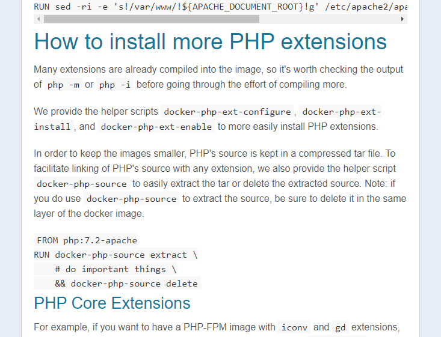
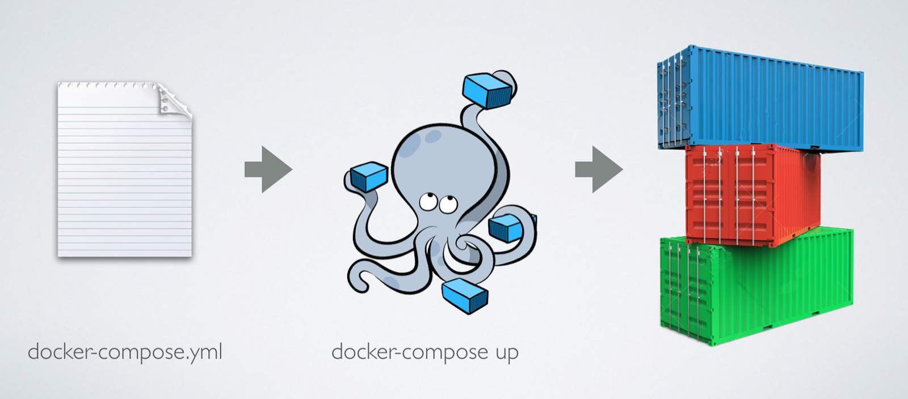
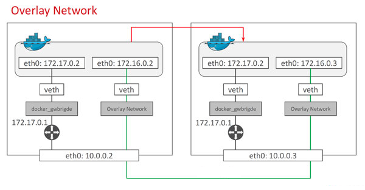
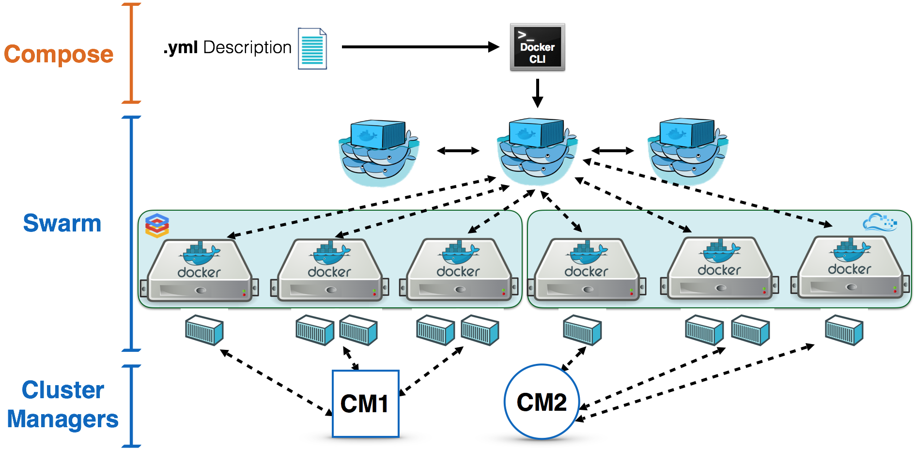

<!--more-->


# 编写 Docker Compose 项目

通过阅读之前的小节，相信大家对 Docker 在开发中的应用已经有了一定的了解。作为一款实用的软件，我们必须回归到实践中来，这样才能更好地理解 Docker 的实用逻辑和背后的原理。在这一小节里，我们就举一个完整的例子，让大家跟随这个项目的脉络，熟悉如何通过 Docker 和 Docker Compose 来搭建应用开发环境。

## 设计项目的目录结构

在这一小节里，我们以一个由 MySQL、Redis、PHP-FPM 和 Nginx 组成的小型 PHP 网站为例，介绍通过 Docker 搭建运行这套程序运行环境的方法。

既然我们说到这个小型网站是由 MySQL、Redis、PHP-FPM 和 Nginx 四款软件所组成的，那么自然在 Docker 里，我们要准备四个容器分别来运行它们。而为了更好地管理这四个容器所组成的环境，我们这里还会使用到 Docker Compose。

与搭建一个软件开发项目类似，我们提倡将 Docker Compose 项目的组成内容聚集到一个文件目录中，这样更利于我们进行管理和迁移。

这里我已经建立好了一个目录结构，虽然我们在实践的过程中不一定要按照这样的结构，但我相信这个结构一定对你有所启发。


简单说明一下这个结构中主要目录和文件的功能和作用。在这个结构里，我们可以将根目录下的几个目录分为四类：

- 第一类是 Docker 定义目录，也就是 compose 这个目录。在这个目录里，包含了 docker-compose.yml 这个用于定义 Docker Compose 项目的配置文件。此外，还包含了我们用于构建自定义镜像的内容。
- 第二类是程序文件目录，在这个项目里是 mysql、nginx、phpfpm、redis 这四个目录。这些目录分别对应着 Docker Compose 中定义的服务，在其中主要存放对应程序的配置，产生的数据或日志等内容。
- 第三类是代码目录，在这个项目中就是存放 Web 程序的 website 目录。我们将代码统一放在这个目录中，方便在容器中挂载。
- 第四类是工具命令目录，这里指 bin 这个目录。我们在这里存放一些自己编写的命令脚本，我们通过这些脚本可以更简洁地操作整个项目。

## 编写 Docker Compose 配置文件

接下来我们就要编写 docker-compose.yml 文件来定义组成这个环境的所有 Docker 容器以及与它们相关的内容了。docker-compose.yml 规则和编写的方法在前两小节中已经谈到，这里我们就不再展开，直接来看看编写好的 docker-compose.yml 配置文件。

```
version: "3"

networks:
  frontend:
  backend:

services:

  redis:
    image: redis:3.2
    networks:
      - backend
    volumes:
      - ../redis/redis.conf:/etc/redis/redis.conf:ro
      - ../redis/data:/data
    command: ["redis-server", "/etc/redis/redis.conf"]
    ports:
      - "6379:6379"

  mysql:
    image: mysql:5.7
    networks:
      - backend
    volumes:
      - ../mysql/my.cnf:/etc/mysql/my.cnf:ro
      - ../mysql/data:/var/lib/mysql
    environment:
      MYSQL_ROOT_PASSWORD: my-secret-pw
    ports:
      - "3306:3306"

  phpfpm:
    build: ./phpfpm
    networks:
      - frontend
      - backend
    volumes:
      - ../phpfpm/php.ini:/usr/local/etc/php/php.ini:ro
      - ../phpfpm/php-fpm.conf:/usr/local/etc/php-fpm.conf:ro
      - ../phpfpm/php-fpm.d:/usr/local/etc/php-fpm.d:ro
      - ../phpfpm/crontab:/etc/crontab:ro
      - ../website:/website
    depends_on:
      - redis
      - mysql
  
  nginx:
    image: nginx:1.12
    networks:
      - frontend
    volumes:
      - ../nginx/nginx.conf:/etc/nginx/nginx.conf:ro
      - ../nginx/conf.d:/etc/nginx/conf.d:ro
      - ../website:/website
    depends_on:
      - phpfpm
    ports:
      - "80:80"
```

使用合适的镜像是提高工作效率的途径之一，这里讲解一下我们在这个项目中选择镜像的原由。

在这个项目里，我们直接采用了 MySQL、Redis 和 Nginx 三个官方镜像，而对于 PHP-FPM 的镜像，我们需要增加一些功能，所以我们通过 Dockerfile 构建的方式来生成。

对于 MySQL 来说，我们需要为它们设置密码，所以原则上我们是需要对它们进行改造并生成新的镜像来使用的。而由于 MySQL 镜像可以通过我们之前在镜像使用方法一节所提到的环境变量配置的方式，来直接指定 MySQL 的密码及其他一些关键性内容，所以我们就无须单独构建镜像，可以直接采用官方镜像并配合使用环境变量来达到目的。

对于 Redis 来说，出于安全考虑，我们一样需要设置密码。Redis 设置密码的方法是通过配置文件来完成的，所以我们需要修改 Redis 的配置文件并挂载到 Redis 容器中。这个过程也相对简单，不过需要注意的是，在官方提供的 Redis 镜像里，默认的启动命令是 redis-server，其并没有指定加载配置文件。所以在我们定义 Redis 容器时，要使用 command 配置修改容器的启动命令，使其读取我们挂载到容器的配置文件。

### 自定义镜像

相比较于 MySQL、Redis 这样可以通过简单配置即可直接使用的镜像不同，PHP 的镜像中缺乏了一些我们程序中必要的元素，而这些部分我们推荐使用自定义镜像的方式将它们加入其中。

在这个例子里，因为需要让 PHP 连接到 MySQL 数据库中，所以我们要为镜像中的 PHP 程序安装和开启 pdo\_mysql 这个扩展。

了解如何安装扩展，这就要考验我们之前在 Docker Hub 镜像使用一节中学到的知识了。我们通过阅读 PHP 镜像的介绍页面，可以找到 PHP 镜像中已经为我们准备好了扩展的安装和启用命令，这让我们可以很轻松地在镜像中加入扩展。



在准备好这些使用方法之后，我们就可以开始编写构建 PHP 镜像的 Dockerfile 文件了。这里我已经编写好了一份，供大家参考。

```
FROM php:7.2-fpm

MAINTAINER You Ming <youming@funcuter.org>

RUN apt-get update \
 && apt-get install -y --no-install-recommends cron

RUN docker-php-ext-install pdo_mysql

COPY docker-entrypoint.sh /usr/local/bin/

RUN chmod +x /usr/local/bin/docker-entrypoint.sh

ENTRYPOINT ["docker-entrypoint.sh"]

CMD ["php-fpm"]
```

由于 Docker 官方所提供的镜像比较精简，所以在这个 Dockerfile 里，我们还执行了 cron 的安装命令，来确保我们可以使用定时任务。

大家注意到，这里除了我们进行功能安装外，还将一个脚本拷入了镜像中，并将其作为 ENTRYPOINT 启动入口。这个文件的作用主要是为了启动 cron 服务，以便我们在容器中可以正常使用它。

```
#!/bin/bash

service cron start

exec "$@"
```

在 [docker-entrypoint.sh](http://docker-entrypoint.sh) 里，除了启动 cron 服务的命令外，我们在脚本的最后看到的是 `exec "$@"` 这行命令。`$@` 是 shell 脚本获取参数的符号，这里获得的是所有传入脚本的参数，而 exec 是执行命令，直接执行这些参数。

如果直接看这条命令大家会有些疑惑，参数怎么拿来执行，这不是有问题么？

请大家回顾一下，我们之前提到的，如果在镜像里同时定义了 ENTRYPOINT 和 CMD 两个指令，CMD 指令的内容会以参数的形式传递给 ENTRYPOINT 指令。所以，这里脚本最终执行的，是 CMD 中所定义的命令。

### 目录挂载

在这个例子里，我们会把项目中的一些目录或文件挂载到容器里，这样的挂载主要有三种目的：

- 将程序的配置通过挂载的方式覆盖容器中对应的文件，这让我们可以直接在容器外修改程序的配置，并通过直接重启容器就能应用这些配置；
- 把目录挂载到容器中应用数据的输出目录，就可以让容器中的程序直接将数据输出到容器外，对于 MySQL、Redis 中的数据，程序的日志等内容，我们可以使用这种方法来持久保存它们；
- 把代码或者编译后的程序挂载到容器中，让它们在容器中可以直接运行，这就避免了我们在开发中反复构建镜像带来的麻烦，节省出大量宝贵的开发时间。

上述的几种方法，对于线上部署来说都是不适用的，但在我们的开发过程中，却可以为我们免去大量不必要的工作，因此建议在开发中使用这些挂载结构。

## 编写辅助脚本

我们知道，虽然 Docker Compose 简化了许多操作流程，但我们还是需要使用 docker-compose 命令来管理项目。对于这个例子来说，我们要启动它就必须使用这样的 docker-compose 命令来管理项目。对于这个例子来说，我们要启动它就必须使用这样的：

```
$ sudo docker-compose -p website up -d
```

而执行的目录必须是 docker-compose.yml 文件所在的目录，这样才能正确地读取 Docker Compose 项目的配置内容。

我编写了一个 compose 脚本，用来简化 docker-compose 的操作命令。

```
#!/bin/bash

root=$(cd `dirname $0`; dirname `pwd`)

docker-compose -p website -f ${root}/compose/docker-compose.yml "$@"
```

在这个脚本里，我把一些共性的东西包含进去，这样我们就不必每次传入这些参数或选项了。同时，这个脚本还能自适应调用的目录，准确找到 docker-compose.yml 文件，更方便我们直接调用。

通过这个脚本来操作项目，我们的命令就可以简化为：

```
$ sudo ./bin/compose up -d

$ sudo ./bin/compose logs nginx

$ sudo ./bin/compose down
```

当然，我们还可以编写像代码部署、服务重启等脚本，来提高我们的开发效率。


# 常用的 Docker Compose 配置项

与 Dockerfile 一样，编写 Docker Compose 的配置文件是掌握和使用好 Docker Compose 的前提。编写 Docker Compose 配置文件，其本质就是根据我们所设计的应用架构，对不同应用容器进行配置并加以组合。在这一节中，我们就来谈谈如何编写 Docker Compose 的配置文件，了解其中常见配置项的使用方法。

## 定义服务

为了理解在开发中常用的 Docker Compose 配置，我们通过一个在开发中使用的 Docker Compose 文件来进行下面的讲解。

```
version: "3"

services:

  redis:
    image: redis:3.2
    networks:
      - backend
    volumes:
      - ./redis/redis.conf:/etc/redis.conf:ro
    ports:
      - "6379:6379"
    command: ["redis-server", "/etc/redis.conf"]

  database:
    image: mysql:5.7
    networks:
      - backend
    volumes:
      - ./mysql/my.cnf:/etc/mysql/my.cnf:ro
      - mysql-data:/var/lib/mysql
    environment:
      - MYSQL_ROOT_PASSWORD=my-secret-pw
    ports:
      - "3306:3306"

  webapp:
    build: ./webapp
    networks:
      - frontend
      - backend
    volumes:
      - ./webapp:/webapp
    depends_on:
      - redis
      - database

  nginx:
    image: nginx:1.12
    networks:
      - frontend
    volumes:
      - ./nginx/nginx.conf:/etc/nginx/nginx.conf:ro
      - ./nginx/conf.d:/etc/nginx/conf.d:ro
      - ./webapp/html:/webapp/html
    depends_on:
      - webapp
    ports:
      - "80:80"
      - "443:443"

networks:
  frontend:
  backend:

volumes:
  mysql-data:
```

在这个 Docker Compose 的示例中，我们看到占有大量篇幅的就是 services 部分，也就是服务定义的部分了。在上一节里，我们已经说到了，Docker Compose 中的服务，是对一组相同容器集群统一配置的定义，所以可见，在 Docker Compose 里，主要的内容也是对容器配置的定义。

这里我们依然要声明一下，这本小册主要以开发中使用 Docker 的方法为主，所以在关于 Docker Compose 的内容里，依然以开发中的使用为主。由于我们开发中，鉴于本地机器性能和易管理性等的考虑，不会为服务进行集群配置，通常就是一个服务对应一个容器，所以这里均以这种方式来进行讲解。

在 Docker Compose 的配置文件里，对服务的定义与我们之前谈到的创建和启动容器中的选项非常相似，或者说 Docker Compose 就是从配置文件中读取出这些内容，代我们创建和管理这些容器的。

在使用时，我们首先要为每个服务定义一个名称，用以区别不同的服务。在这个例子里，redis、database、webapp、nginx 就是服务的名称。

### 指定镜像

容器最基础的就是镜像了，所以每个服务必须指定镜像。在 Docker Compose 里，我们可以通过两种方式为服务指定所采用的镜像。一种是通过 image 这个配置，这个相对简单，给出能在镜像仓库中找到镜像的名称即可。

另外一种指定镜像的方式就是直接采用 Dockerfile 来构建镜像，通过 build 这个配置我们能够定义构建的环境目录，这与 `docker build` 中的环境目录是同一个含义。如果我们通过这种方式指定镜像，那么 Docker Compose 先会帮助我们执行镜像的构建，之后再通过这个镜像启动容器。

当然，在 `docker build` 里我们还能通过选项定义许多内容，这些在 Docker Compose 里我们依然可以。

```
## ......
  webapp:
    build:
      context: ./webapp
      dockerfile: webapp-dockerfile
      args:
        - JAVA_VERSION=1.6
## ......
```

在配置文件里，我们还能用 Map 的形式来定义 build，在这种格式下，我们能够指定更多的镜像构建参数，例如 Dockerfile 的文件名，构建参数等等。

当然，对于一些可以不通过重新构建镜像的方式便能修改的内容，我们还是不建议重新构建镜像，而是使用原有的镜像做简单的修改。

例如上面的配置里，我们希望修改 Redis 的启动命令，加入配置文件以便对 Redis 服务进行配置，那么我们可以直接通过 command 配置来修改。而在 MySQL 的定义，我们通过 environment 配置为 MySQL 设置了初始密码。

这些对镜像的使用方法我们在之前都已经谈到过了，只不过我们之前用的是 Docker Engine 的命令以及其选项来控制的，而在 Docker Compose 里，我们直接通过配置文件来定义它们。

由于 Docker Compose 的配置已经固化下来，所以我们不需要担心忘记之前执行了哪些命令来启动容器，当每次需要开启或关闭环境时，只需要 `docker-compose up -d` 和 `docker-compose down` 命令，就能轻松完成操作。

### 依赖声明

虽然我们在 Docker Compose 的配置文件里定义服务，在书写上有由上至下的先后关系，但实际在容器启动中，由于各种因素的存在，其顺序还是无法保障的。

所以，如果我们的服务间有非常强的依赖关系，我们就必须告知 Docker Compose 容器的先后启动顺序。只有当被依赖的容器完全启动后，Docker Compose 才会创建和启动这个容器。

定义依赖的方式很简单，在上面的例子里我们已经看到了，也就是 depends\_on 这个配置项，我们只需要通过它列出这个服务所有依赖的其他服务即可。在 Docker Compose 为我们启动项目的时候，会检查所有依赖，形成正确的启动顺序并按这个顺序来依次启动容器。

## 文件挂载

在 Docker Compose 里定义文件挂载的方式与 Docker Engine 里也并没有太多的区别，使用 volumes 配置可以像 docker CLI 里的 `-v` 选项一样来指定外部挂载和数据卷挂载。

在上面的例子里，我们看到了定义几种常用挂载的方式。我们能够直接挂载宿主机文件系统中的目录，也可以通过数据卷的形式挂载内容。

在使用外部文件挂载的时候，我们可以直接指定相对目录进行挂载，这里的相对目录是指相对于 docker-compose.yml 文件的目录。

由于有相对目录这样的机制，我们可以将 docker-compose.yml 和所有相关的挂载文件放置到同一个文件夹下，形成一个完整的项目文件夹。这样既可以很好的整理项目文件，也利于完整的进行项目迁移。

虽然 Docker 提倡将代码或编译好的程序通过构建镜像的方式打包到镜像里，随整个 CI 流部署到服务器中，但对于开发者来说，每次修改程序进行简单测试都要重新构建镜像简直是浪费生命的操作。所以在开发时，我们推荐直接将代码挂载到容器里，而不是通过镜像构建的方式打包成镜像。

同时，在开发过程中，对于程序的配置等内容，我们也建议直接使用文件挂载的形式挂载到容器里，避免经常修改所带来的麻烦。

### 使用数据卷

如果我们要在项目中使用数据卷来存放特殊的数据，我们也可以让 Docker Compose 自动完成对数据卷的创建，而不需要我们单独进行操作。

在上面的例子里，独立于 services 的 volumes 配置就是用来声明数据卷的。定义数据卷最简单的方式仅需要提供数据卷的名称，对于我们在 Docker Engine 中创建数据卷时能够使用的其他定义，也能够放入 Docker Compose 的数据卷定义中。

如果我们想把属于 Docker Compose 项目以外的数据卷引入进来直接使用，我们可以将数据卷定义为外部引入，通过 external 这个配置就能完成这个定义。

```
## ......
volumes:
  mysql-data:
    external: true
## ......
```

在加入 external 定义后，Docker Compose 在创建项目时不会直接创建数据卷，而是优先从 Docker Engine 中已有的数据卷里寻找并直接采用。

## 配置网络

网络也是容器间互相访问的桥梁，所以网络的配置对于多个容器组成的应用系统来说也是非常重要的。在 Docker Compose 里，我们可以为整个应用系统设置一个或多个网络。

要使用网络，我们必须先声明网络。声明网络的配置同样独立于 services 存在，是位于根配置下的 networks 配置。在上面的例子里，我们已经看到了声明 frontend 和 backend 这两个网络最简单的方式。

除了简单的声明网络名称，让 Docker Compose 自动按默认形式完成网络配置外，我们还可以显式的指定网络的参数。

```
networks:
  frontend:
    driver: bridge
    ipam:
      driver: default
      config:
        - subnet: 10.10.1.0/24
## ......
```

在这里，我们为网络定义了网络驱动的类型，并指定了子网的网段。

### 使用网络别名

直接使用容器名或服务名来作为连接其他服务的网络地址，因为缺乏灵活性，常常还不能满足我们的需要。这时候我们可以为服务单独设置网络别名，在其他容器里，我们将这个别名作为网络地址进行访问。

网络别名的定义方式很简单，这里需要将之前简单的网络 List 定义结构修改成 Map 结构，以便在网络中加入更多的定义。

```
## ......
  database:
    networks:
      backend:
        aliases:
          - backend.database
## ......
  webapp:
    networks:
      backend:
        aliases:
          - backend.webapp
      frontend:
        aliases:
          - frontend.webapp
## ......
```

在我们进行这样的配置后，我们便可以使用这里我们所设置的网络别名对其他容器进行访问了。

### 端口映射

在 Docker Compose 的每个服务配置里，我们还看到了 ports 这个配置项，它是用来定义端口映射的。

我们可以利用它进行宿主机与容器端口的映射，这个配置与 docker CLI 中 `-p` 选项的使用方法是近似的。

需要注意的是，由于 YAML 格式对 xx:yy 这种格式的解析有特殊性，在设置小于 60 的值时，会被当成时间而不是字符串来处理，所以我们最好使用引号将端口映射的定义包裹起来，避免歧义。


# 使用 Docker Compose 管理容器

通过之前的介绍，我们已经基本掌握了构建、运行容器的方法，但这还远远不够，由于 Docker 采用轻量级容器的设计，每个容器一般只运行一个软件，而目前绝大多数应用系统都绝不是一个软件所能组成的。虽然我们之前提到了容器间互相连接、交换数据的各种方法，通过这些方法足以搭建起完整的用于应用系统运行的容器群，但是这显然还不够，这个容器群的搭建需要执行太多命令，更重要的是需要考虑太多应用和容器间的依赖关系处理，是一波令人头大的操作。在这一节中，我们就来介绍如何解决这些问题。

## 解决容器管理问题

拿任何一个相对完整的应用系统来说，都不可能是由一个程序独立支撑的，而对于使用 Docker 来部署的分布式计算服务更是这样。随着时代的发展和技术演进，我们越来越推崇将大型服务拆分成较小的微服务，分别部署到独立的机器或容器中。也就是说，我们的应用系统往往由数十个甚至上百个应用程序或微服务组成。即使是一个小的微服务模块，通常都需要多个应用协作完成工作。

我们编写一个小型的微服务模块，虽然我们编写代码主要针对的是其中的应用部分，但如果我们要完整的进行开发、测试，与应用相关的周边软件必然是必不可少的。

虽然 Docker Engine 帮助我们完成了对应用运行环境的封装，我们可以不需要记录复杂的应用环境搭建过程，通过简单的配置便可以将应用运行起来了，但这只是针对单个容器或单个应用程序来说的。如果延伸到由多个应用组成的应用系统，那情况就稍显复杂了。

就拿最简单的例子来说吧，如果我们要为我们的应用容器准备一个 MySQL 容器和一个 Redis 容器，那么在每次启动时，我们先要将 MySQL 容器和 Redis 容器启动起来，再将应用容器运行起来。这其中还不要忘了在创建应用容器时将容器网络连接到 MySQL 容器和 Redis 容器上，以便应用连接上它们并进行数据交换。

这还不够，如果我们还对容器进行了各种配置，我们最好还得将容器创建和配置的命令保存下来，以便下次可以直接使用。

如果我们要想让这套体系像 `docker run` 和 `docker rm` 那样自如的进行无痕切换，那就更加麻烦了，我们可能需要编写一些脚本才能不至于被绕到命令的毛线球里。

说了这么多，其实核心还是缺少一个对容器组合进行管理的东西。

### Docker Compose

针对这种情况，我们就不得不引出在我们开发中最常使用的多容器定义和运行软件，也就是 Docker Compose 了。

如果说 Dockerfile 是将容器内运行环境的搭建固化下来，那么 Docker Compose 我们就可以理解为将多个容器运行的方式和配置固化下来。



在 Docker Compose 里，我们通过一个配置文件，将所有与应用系统相关的软件及它们对应的容器进行配置，之后使用 Docker Compose 提供的命令进行启动，就能让 Docker Compose 将刚才我们所提到的那些复杂问题解决掉。

## 安装 Docker Compose

虽然 Docker Compose 目前也是由 Docker 官方主要维护，但其却不属于 Docker Engine 的一部分，而是一个独立的软件。所以如果我们要在 Linux 中使用它，还必须要单独下载使用。

Docker Compose 是一个由 Python 编写的软件，在拥有 Python 运行环境的机器上，我们可以直接运行它，不需要其它的操作。

我们可以通过下面的命令下载 Docker Compose 到应用执行目录，并附上运行权限，这样 Docker Compose 就可以在机器中使用了。

```
$ sudo curl -L "https://github.com/docker/compose/releases/download/1.22.0/docker-compose-$(uname -s)-$(uname -m)" -o /usr/local/bin/docker-compose
$ sudo chmod +x /usr/local/bin/docker-compose
$
$ sudo docker-compose version
docker-compose version 1.21.2, build a133471
docker-py version: 3.3.0
CPython version: 3.6.5
OpenSSL version: OpenSSL 1.0.1t  3 May 2016
```

我们也能够通过 Python 的包管理工具 pip 来安装 Docker Compose。

```
$ sudo pip install docker-compose
```

### 在 Windows 和 macOS 中的 Docker Compose

在我们更常用于开发的 Windows 和 macOS 中，使用 Docker Compose 会来得更加方便。不论你是使用 Docker for Win 还是 Docker for Mac，亦或是 Docker Toolbox 来搭建 Docker 运行环境，你都可以直接使用 `docker-compose` 这个命令。这三款软件都已经将 Docker Compose 内置在其中，供我们使用。

## Docker Compose 的基本使用逻辑

如果将使用 Docker Compose 的步骤简化来说，可以分成三步。

1. 如果需要的话，编写容器所需镜像的 Dockerfile；( 也可以使用现有的镜像 )
2. 编写用于配置容器的 docker-compose.yml；
3. 使用 docker-compose 命令启动应用。

准备镜像这一过程我们之前已经掌握了，这里我们就简单来看看后面两个步骤。

### 编写 Docker Compose 配置

配置文件是 Docker Compose 的核心部分，我们正是通过它去定义组成应用服务容器群的各项配置，而编写配置文件，则是使用 Docker Compose 过程中最核心的一个步骤。

Docker Compose 的配置文件是一个基于 [YAML](http://yaml.org/) 格式的文件。关于 YAML 的语法大家可以在网上找到，这里不再细说，总的来说，YAML 是一种清晰、简单的标记语言，你甚至都可以在看过几个例子后摸索出它的语法。

与 Dockerfile 采用 Dockerfile 这个名字作为镜像构建定义的默认文件名一样，Docker Compose 的配置文件也有一个缺省的文件名，也就是 docker-compose.yml，如非必要，我建议大家直接使用这个文件名来做 Docker Compose 项目的定义。

这里我们来看一个简单的 Docker Compose 配置文件内容。

```
version: '3'

services:

  webapp:
    build: ./image/webapp
    ports:
      - "5000:5000"
    volumes:
      - ./code:/code
      - logvolume:/var/log
    links:
      - mysql
      - redis

  redis:
    image: redis:3.2
  
  mysql:
    image: mysql:5.7
    environment:
      - MYSQL_ROOT_PASSWORD=my-secret-pw

volumes:
  logvolume: {}
```

Docker Compose 配置文件里可以包含许多内容，从每个容器的各个细节控制，到网络、数据卷等的定义。

这里我们看几个主要的细节。首先是 version 这个配置，这代表我们定义的 docker-compose.yml 文件内容所采用的版本，目前 Docker Compose 的配置文件已经迭代至了第三版，其所支持的功能也越来越丰富，所以我们建议使用最新的版本来定义。

接下来我们来看 services 这块，这是整个 docker-compose.yml 的核心部分，其定义了容器的各项细节。

在 Docker Compose 里不直接体现容器这个概念，这是把 service 作为配置的最小单元。虽然我们看上去每个 service 里的配置内容就像是在配置容器，但其实 service 代表的是一个应用集群的配置。每个 service 定义的内容，可以通过特定的配置进行水平扩充，将同样的容器复制数份形成一个容器集群。而 Docker Compose 能够对这个集群做到黑盒效果，让其他的应用和容器无法感知它们的具体结构。

对于 docker-compose.yml 配置的具体细节，我们在下一节中还会专门讲解。

### 启动和停止

对于开发来说，最常使用的 Docker Compose 命令就是 `docker-compose up` 和 `docker-compose down` 了。

`docker-compose up` 命令类似于 Docker Engine 中的 `docker run`，它会根据 docker-compose.yml 中配置的内容，创建所有的容器、网络、数据卷等等内容，并将它们启动。与 `docker run` 一样，默认情况下 `docker-compose up` 会在“前台”运行，我们可以用 `-d` 选项使其“后台”运行。事实上，我们大多数情况都会加上 `-d` 选项。

```
$ sudo docker-compose up -d
```

需要注意的是，`docker-compose` 命令默认会识别当前控制台所在目录内的 docker-compose.yml 文件，而会以这个目录的名字作为组装的应用项目的名称。如果我们需要改变它们，可以通过选项 `-f` 来修改识别的 Docker Compose 配置文件，通过 `-p` 选项来定义项目名。

```
$ sudo docker-compose -f ./compose/docker-compose.yml -p myapp up -d
```

与 `docker-compose up` 相反，`docker-compose down` 命令用于停止所有的容器，并将它们删除，同时消除网络等配置内容，也就是几乎将这个 Docker Compose 项目的所有影响从 Docker 中清除。

```
$ sudo docker-compose down
```

如果条件允许，我更建议大家像容器使用一样对待 Docker Compose 项目，做到随用随启，随停随删。也就是使用的时候通过 `docker-compose up` 进行，而短时间内不再需要时，通过 `docker-compose down` 清理它。

借助 Docker 容器的秒级启动和停止特性，我们在使用 `docker-compose up` 和 `docker-compose down` 时可以非常快的完成操作。这就意味着，我们可以在不到半分钟的时间内停止一套环境，切换到另外一套环境，这对于经常进行多个项目开发的朋友来说，绝对是福音。

通过 Docker 让我们能够在开发过程中搭建一套不受干扰的独立环境，让开发过程能够基于稳定的环境下进行。而 Docker Compose 则让我们更近一步，同时让我们处理好多套开发环境，并进行快速切换。

### 容器命令

除了启动和停止命令外，Docker Compose 还为我们提供了很多直接操作服务的命令。之前我们说了，服务可以看成是一组相同容器的集合，所以操作服务就有点像操作容器一样。

这些命令看上去都和 Docker Engine 中对单个容器进行操作的命令类似，我们来看几个常见的。

在 Docker Engine 中，如果我们想要查看容器中主进程的输出内容，可以使用 `docker logs` 命令。而由于在 Docker Compose 下运行的服务，其命名都是由 Docker Compose 自动完成的，如果我们直接使用 `docker logs` 就需要先找到容器的名字，这显然有些麻烦了。我们可以直接使用 `docker-compose logs` 命令来完成这项工作。

```
$ sudo docker-compose logs nginx
```

在 `docker-compose logs` 衔接的是 Docker Compose 中所定义的服务的名称。

同理，在 Docker Compose 还有几个类似的命令可以单独控制某个或某些服务。

通过 `docker-compose create`，`docker-compose start` 和 `docker-compose stop` 我们可以实现与 `docker create`，`docker start` 和 `docker stop` 相似的效果，只不过操作的对象由 Docker Engine 中的容器变为了 Docker Compose 中的服务。

```
$ sudo docker-compose create webapp
$ sudo docker-compose start webapp
$ sudo docker-compose stop webapp
```


# 应用于服务化开发

上一节里我们谈到了小型的独立项目如何使用 Docker Compose 来搭建程序的运行环境，对于由多人或多部门参与的中大型服务化架构的项目，仅由一个 Docker Compose 项目来管理它们的运行环境显然是不切实际的。在这一小节里，我们就谈谈如何在服务化开发中合理利用 Docker 来搭建环境。

## 服务开发环境

在开始之前，我们依然来设定一个场景。在这里，假定我们处于一个 Dubbo 治下的微服务系统，而工作是开发系统中某一项微服务。

微服务开发与上一节里我们提到的小型项目开发在环境搭建上有一定的区别，我们要合理地调整 Docker 的使用方法和策略，就必须先了解这些区别。

在微服务开发中，我们所开发的功能都不是完整的系统，很多功能需要与其他服务之间配合才能正常运转，而我们开发所使用的机器时常无法满足我们在一台机器上将这些相关服务同时运行起来。

我们仅仅是开发某一部分服务的内容，既对其他服务的运转机制不太了解，又完全没有必要在自己的机器上运行其他的服务。所以我们最佳的实践自然就是让参与系统中服务开发的同事，各自维护自己开发服务的环境，而直接提供给我们对应的连接地址使用服务即可。

更确切地说，我们在开发中，只需要在本地搭建起自己所开发服务的运行环境，再与其他开发者搭建的环境互联即可。

### 搭建本地环境

在我们的开发机器上，我们只需要运行我们正在开发的服务，这个过程依然可以使用 Docker Compose 来完成。这里我给出了一个简单的例子，表示一个简单的小服务运行环境。

```
version: "3"

networks:
  backend:
  mesh:

services:

  mysql:
    image: mysql:5.7
    networks:
      - backend
    volumes:
      - ../mysql/my.cnf:/etc/mysql/my.cnf:ro
      - ../mysql/data:/var/lib/mysql
    environment:
      MYSQL_ROOT_PASSWORD: my-secret-pw
    ports:
      - "3306:3306"

  app:
    build: ./spring
    networks:
      - mesh
      - backend
    volumes:
      - ../app:/app
    depends_on:
      - mysql
```

关于这里 Spring 镜像的使用和改造方法，我就不展开了，大家可以通过 Docker Hub 以及 Spring 官方所提供的镜像，练习如何改造它，使它适配自己的服务。

## 跨主机网络

搭建好本地的环境，我们就需要考虑如何与朋友们所搭建的环境进行互联了。

这时候大家也许会想到，可以将服务涉及的相关端口通过映射的方式暴露到我们机器的端口上，接着我们只需要通过各服务机器的 IP 与对应的端口就可以连接了。

然而这种方法还不算特别方便，一来除了处理映射外，我们还需要配置防火墙等才能使其他的机器正确访问到容器，二来是这种方式我们依然要记录各个服务的网络地址等配置，而开发中切换它们是个烦琐的过程。

在介绍 Docker Compose 的小节里，我们知道了可以通过设置网络别名 ( alias ) 的方式来更轻松地连接其他容器，如果我们在服务化开发里也能这么做就能减少很多烦琐操作了。

要实现设置网络别名的目的，自然要先确保所有涉及的容器位于同一个网络中，这时候就需要引出我们之前在网络小节里说到的 Overlay 网络了。



Overlay Network 能够跨越物理主机的限制，让多个处于不同 Docker daemon 实例中的容器连接到同一个网络，并且让这些容器感觉这个网络与其他类型的网络没有区别。

### Docker Swarm

要搭建 Overlay Network 网络，我们就要用到 Docker Swarm 这个工具了。Docker Swarm 是 Docker 内置的集群工具，它能够帮助我们更轻松地将服务部署到 Docker daemon 的集群之中。



在真实的服务部署里，我们通常是使用 Docker Compose 来定义集群，而通过 Docker Swarm 来部署集群。

如果熟悉 Docker 周边知识的朋友，相信这时候已经想到了另外一个工具，即 Kubernetes ( K8s )。没错，Kubernetes 与这两者的组合相比，功能要丰富强大很多，也正因此，与它相关的内容完全足以另辟一本小册来说。而在开发里，我们几乎使用不到 Kubernetes，所以我们这里就不做介绍了。如果大家有想要了解的 Kubernetes 知识点，可以通过小册的微信群向我提出，我会挑选大家关注的内容补充到小册的后面。

Docker Swarm 最初是独立的项目，不过目前已经集成到了 Docker 之中，我们通过 docker CLI 的命令就能够直接操控它。

对于 Docker Swarm 来说，每一个 Docker daemon 的实例都可以成为集群中的一个节点，而在 Docker daemon 加入到集群成为其中的一员后，集群的管理节点就能对它进行控制。我们要搭建的 Overlay 网络正是基于这样的集群实现的。

既然要将 Docker 加入到集群，我们就必须先有一个集群，我们在任意一个 Docker 实例上都可以通过 `docker swarm init` 来初始化集群。

```
$ sudo docker swarm init

Swarm initialized: current node (t4ydh2o5mwp5io2netepcauyl) is now a manager.

To add a worker to this swarm, run the following command:

    docker swarm join --token SWMTKN-1-4dvxvx4n7magy5zh0g0de0xoues9azekw308jlv6hlvqwpriwy-cb43z26n5jbadk024tx0cqz5r 192.168.1.5:2377
```

在集群初始化后，这个 Docker 实例就自动成为了集群的管理节点，而其他 Docker 实例可以通过运行这里所打印的 `docker swarm join` 命令来加入集群。

加入到集群的节点默认为普通节点，如果要以管理节点的身份加入到集群中，我们可以通过 `docker swarm join-token` 命令来获得管理节点的加入命令。

```
$ sudo docker swarm join-token manager
To add a manager to this swarm, run the following command:

    docker swarm join --token SWMTKN-1-60am9y6axwot0angn1e5inxrpzrj5d6aa91gx72f8et94wztm1-7lz0dth35wywekjd1qn30jtes 192.168.1.5:2377
```

我们通过这些命令来建立用于我们服务开发的 Docker 集群，并将相关开发同事的 Docker 加入到这个集群里，就完成了搭建跨主机网络的第一步。

### 建立跨主机网络

接下来，我们就通过 `docker network create` 命令来建立 Overlay 网络。

```
$ sudo docker network create --driver overlay --attachable mesh
```

在创建 Overlay 网络时，我们要加入 `--attachable` 选项以便不同机器上的 Docker 容器能够正常使用到它。

在创建了这个网络之后，我们可以在任何一个加入到集群的 Docker 实例上使用 `docker network ls` 查看一下其下的网络列表。我们会发现这个网络定义已经同步到了所有集群中的节点上。

```
$ sudo docker network ls
NETWORK ID          NAME                DRIVER              SCOPE
## ......
y89bt74ld9l8        mesh                overlay             swarm
## ......
```

接下来我们要修改 Docker Compose 的定义，让它使用这个我们已经定义好的网络，而不是再重新创建网络。

我们只需要在 Docker Compose 配置文件的网络定义部分，将网络的 external 属性设置为 true，就可以让 Docker Compose 将其建立的容器都连接到这个不属于 Docker Compose 的项目上了。

```
networks:
  mesh:
    external: true
```

通过这个实现，我们在开发中就使整个服务都处于一个可以使用别名映射网络中，避免了要对不同功能联调时切换服务 IP 的烦琐流程。在这种结构下，我们只需要让我们开发的 Docker 退出和加入不同的集群，就能马上做到切换不同联调项目。