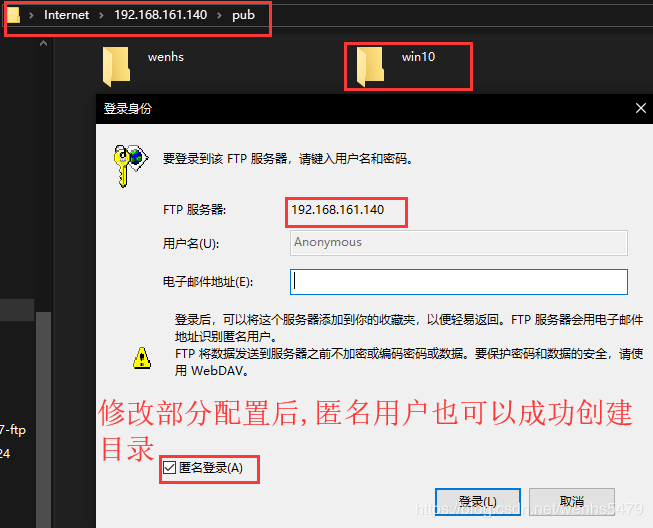
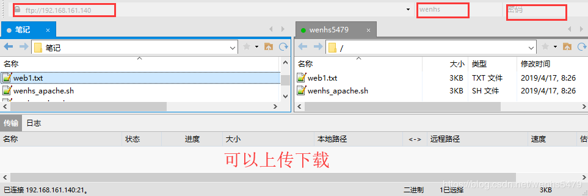

<!--more-->


# 1. ftp简介

网络文件共享服务主流的主要有三种，分别是ftp、nfs、samba。

FTP是File Transfer Protocol（文件传输协议）的简称，用于internet上的控制文件的双向传输。

FTP也是一个应用程序，基于不同的操作系统有不同的FTP应用程序，而所有这些应用程序都遵守同一种协议以传输文件。

在FTP的使用当中，用户经常遇到两种概念：**下载**和**上传**

| 下载(Download)                     | 上传(Upload)                           |
| ---------------------------------- | -------------------------------------- |
| 从远程主机拷贝文件至自己的计算机上 | 将文件从自己的计算机上拷贝至远程主机上 |

# 2. ftp架构

FTP工作于应用层，监听于tcp的21号端口，是一种C/S架构的应用程序。其有多种客户端和服务端的应用程序，下面来简单介绍一下

```
客户端工具					服务端软件
ftp							
lftp,lftpget				wu-ftpd
wget,curl					proftpd（提供web接口的一种ftp服务端程序）
filezilla					pureftp
gftp（Linux GUI）			vsftpd（Very Secure）
商业软件（flashfxp,cuteftp）	ServU（windows平台的一种强大ftp服务端程序）
```

# 3. ftp数据连接模式

ftp有2种数据连接模式：**命令连接**和**数据连接**

 - 命令连接：是指文件管理类命令，始终在线的持久性连接，直到用户退出登录为止
 - 数据连接：是指数据传输，按需创建及关闭的连接

其中数据连接需要关注的有2点:

- 数据传输格式 
- 数据传输模式

数据传输格式有以下两种：

- 文件传输
- 二进制传输

数据传输模式也有2种：

 - 主动模式：由服务器端创建数据连接
 - 被动模式：由客户端创建数据连接

两种数据传输模式的建立过程：

| 传输模式 | 建立过程                                                     |
| -------- | ------------------------------------------------------------ |
| 主动模式 | 命令连接： Client（1025）--> Server（21） 客户端以一个随机端口（大于1023）来连服务器端的21号端口  数据连接： Server（20/tcp） --> Client（1025+1） 服务器端以自己的20号端口去连客户端创建命令连接时使用的随机端口+1的端口号 |
| 被动模式 | 命令连接： Client（1110） --> Server（21） 客户端以一个随机端口来连成服务器端的21号端口 数据连接： Client（1110+1） --> Server（随机端口） 客户端以创建命令连接的端口+1的端口号去连服务器端通过命令连接告知自己的一个随机端口号来创建数据连接 |

> 主动模式有个弊端，因为客户端的端口是随机的，客户端如果开了防火墙， 则服务器端去连客户端创建数据连接时可能会被拒绝
> 被动模式有个弊端，因为服务端的端口是随机的，服务端如果开了防火墙， 则客户器端去连服务端创建数据连接时可能会被拒绝
> 所以,最好认清关系,然后开放相应端口,由于部分端口随机,最好就是客户端关闭防火墙,采用主动连接方式

# 4. 用户认证

ftp的用户主要有三种：

 - 虚拟用户：仅用于访问某特定服务中的资源
 - 系统用户：可以登录系统的真实用户
 - 匿名用户

# 5.vsftpd

此处我们要说的ftp应用程序是vsftpd，这也是在公司中用得最多的一款ftp软件。

##  vsftpd配置

```
/etc/pam.d/vsftpd       vsftpd用户认证配置文件
/etc/vsftpd/            配置文件目录
/etc/vsftpd/vsftpd.conf     主配置文件

匿名用户（映射为ftp用户）的共享资源位置是/var/ftp
系统用户通过ftp访问的资源位置为用户的家目录
虚拟用户通过ftp访问的资源位置为给虚拟用户指定的映射成为的系统用户的家目录
```

**vsftpd常见的配置参数：**

| 参数                                         | 作用                                                         |
| -------------------------------------------- | ------------------------------------------------------------ |
| anonymous_enable=YES                         | 启用匿名用户登录                                             |
| anon_upload_enable=YES                       | 允许匿名用户上传                                             |
| anon_mkdir_write_enable=YES                  | 允许匿名用户创建目录，但是不能删除                           |
| anon_other_write_enable=YES                  | 允许匿名用户创建和删除目录                                   |
| local_enable=YES                             | 启用本地用户登录                                             |
| write_enable=YES                             | 允许本地用户有写权限                                         |
| local_umask=022                              | 通过ftp上传文件的默认遮罩码                                  |
| chroot_local_user=YES                        | 禁锢所有的ftp本地用户于其家目录中                            |
| chroot_list_enable=YES                       | 开启禁锢文件列表,需要与chroot_list_file参数一起使用          |
| chroot_list_file=/etc/vsftpd/chroot_list     | 指定禁锢列表文件路径,在此文件里面的用户将被禁锢在其家目录中  |
| allow_writeable_chroot=YES                   | 允许被禁锢的用户家目录有写权限                               |
| xferlog_enable=YES                           | 是否启用传输日志，记录ftp传输过程                            |
| xferlog_std_format=YES                       | 传输日志是否使用标准格式                                     |
| xferlog_file=/var/log/xferlog                | 指定传输日志存储的位置                                       |
| chown_uploads=YES                            | 是否启用改变上传文件属主的功能                               |
| chown_username=whoever                       | 指定要将上传的文件的属主改为哪个用户,此用户必须在系统中存在  |
| pam_service_name=vsftpd                      | 指定vsftpd使用/etc/pam.d下的,哪个pam配置文件进行用户认证     |
| userlist_enable=YES                          | 是否启用控制用户登录的列表文件：默认为/etc/vsftpd/user_list文件 |
| userlist_deny=YES                            | 是否拒绝userlist指定的列表文件中存在的用户登录ftp            |
| max_clients=#                                | 最大并发连接数                                               |
| max_per_ip=#                                 | 每个IP可同时发起的并发请求数                                 |
| anon_max_rate                                | 匿名用户的最大传输速率，单位是“字节/秒”                      |
| local_max_rate                               | 本地用户的最大传输速率，单位是“字节/秒”                      |
| dirmessage_enable=YES                        | 启用某目录下的.message描述信息,假定有一个目录为/upload，在其下创建一个文件名为.message，在文件内写入一些描述信息，则当用户切换至/upload目录下时会自动显示.message文件中的内容 |
| message_file                                 | 设置访问一个目录时获得的目录信息文件的文件名,默认是.message  |
| idle_session_timeout=600                     | 设置默认的断开不活跃session的时间                            |
| data_connection_timeout=120                  | 设置数据传输超时时间                                         |
| ftpd_banner="Welcome to chenlf FTP service." | 定制欢迎信息，登录ftp时自动显示                              |

```
虚拟用户的配置：
    所有的虚拟用户会被统一映射为一个指定的系统帐号，访问的共享位置即为此系统帐号的家目录
    各虚拟用户可被赋予不同的访问权限，通过匿名用户的权限控制参数进行指定

    虚拟用户帐号的存储方式：
    1.文件：编辑文件，此文件需要被编码为hash格式。
        奇数行为用户名
        偶数行为密码
    2.关系型数据库的表中：
        通过即时查询数据库完成用户认证
        mysql库：pam要依赖于pam_mysql软件，可以通过epel源yum安装
```

## 实验要求

 - 安装vsftpd服务
 - 配置匿名用户ftp
 - 配置虚拟用户ftp
 - 配置系统用户ftp
 - 安装并配置完成后要使用ftp客户端工具登录验证

## 搭建环境

 - 本实验所用vm15虚拟机里面安装的centos7.6系统；
 - 防火墙、selinux已关闭；

**本实验所用地址如下：**

| 主机名          | 角色        | IP地址          |
| --------------- | ----------- | --------------- |
| wenhs5479       | 服务器      | 192.168.161.140 |
| wenhs-docker-ce | 客户端      | 192.168.160.142 |
| YM-WENHS        | win10客户端 | 192.168.161.137 |

## 安装步骤

 - 安装依赖的程序,本地源没有需要安装的依赖程序，利用网络源安装）并修改yum源

```
[root@wenhs5479 ~]# cd /etc/yum.repos.d/
[root@wenhs5479 yum.repos.d]# wget http://mirrors.163.com/.help/CentOS7-Base-163.repo
--2019-04-17 14:56:14--  http://mirrors.163.com/.help/CentOS7-Base-163.repo
正在解析主机 mirrors.163.com (mirrors.163.com)... 59.111.0.251
正在连接 mirrors.163.com (mirrors.163.com)|59.111.0.251|:80... 已连接。
已发出 HTTP 请求，正在等待回应... 200 OK
长度：1572 (1.5K) [application/octet-stream]
正在保存至: “CentOS7-Base-163.repo”

100%[=============================================>] 1,572       --.-K/s 用时 0s      

2019-04-17 14:56:15 (100 MB/s) - 已保存 “CentOS7-Base-163.repo” [1572/1572])

[root@wenhs5479 yum.repos.d]# sed -i 's/\$releasever/7/g' /etc/yum.repos.d/CentOS7-Base-163.repo
[root@wenhs5479 yum.repos.d]# sed -i 's/^enabled=.*/enabled=1/g' /etc/yum.repos.d/CentOS7-Base-163.repo
[root@wenhs5479 yum.repos.d]# yum clean all
[root@wenhs5479 yum.repos.d]# yum -y install epel-release
[root@wenhs5479 yum.repos.d]# yum -y install vsftpd
```

 - 启动服务

```
[root@wenhs5479 ~]# systemctl start vsftpd
```

### 匿名用户

 - 配置匿名用户，利用匿名用户访问ftp

```
在客户端安装ftp命令,以匿名用户登录FTP，匿名账号为anonymous，密码直接确认
[root@wenhs-docker-ce ~]# yum install -y ftp

匿名用户默认开启,若没有开启则将NO改为YES
[root@wenhs5479 ~]# vim /etc/vsftpd/vsftpd.conf
anonymous_enable=YES

登录192.168.161.140 ftp服务器，账号为anonymous，密码直接确认
[root@wenhs-docker-ce ~]# ftp 192.168.161.140
Connected to 192.168.161.140 (192.168.161.140).
220 (vsFTPd 3.0.2)
Name (192.168.161.140:root): anonymous
331 Please specify the password.
Password:
230 Login successful.
Remote system type is UNIX.
Using binary mode to transfer files.

登录之后 ，ls 可以看到，匿名用户访问的是pub目录
ftp> ls
227 Entering Passive Mode (192,168,161,140,167,7).
150 Here comes the directory listing.
drwxr-xr-x    2 0        0               6 Oct 30 19:45 pub
226 Directory send OK.

进入pub目录，在ftp目录中创建目录，目录没有权限创建
ftp> cd pub
250 Directory successfully changed.	
ftp> mkdir wenhs
550 Permission denied.
win10客户端见下方第一张图


要想在ftp目录中写，就必须修改配置
[root@wenhs5479 ~]# vim /etc/vsftpd/vsftpd.conf
找到这两行取消这注释，或者重新再写
anon_upload_enable=YES #允许匿名用户上传
anon_mkdir_write_enable=YES #允许匿名用户创建目录
添加一行
anon_other_write_enable=YES #允许匿名用户除创建和上传之外的权限，如删除、重命名
：wq #保存退出

因为匿名用户登录ftp所用的账户是ftp用户，所以将/var/ftp/pub的属主和属组改为ftp
[root@wenhs5479 ~]# chown ftp.ftp /var/ftp/pub

重启vsftpd服务
[root@wenhs5479 ~]# systemctl restart vsftpd

再在/var/ftp/pub目录下创建目录，这时可以写
ftp> mkdir wenhs
257 "/pub/wenhs" created
ftp> ls
227 Entering Passive Mode (192,168,161,140,208,210).
150 Here comes the directory listing.
drwx------    2 14       50              6 Apr 17 07:54 wenhs
226 Directory send OK.
win10客户端见下方第二张图
```




### 系统用户

 - 配置系统用户，利用wenhs用户进行访问

```
还原匿名用户配置，注销添加的配置文件
#anon_mkdir_write_enable=YES
#anon_other_write_enable=YES
#anon_upload_enable=YES

创建wenhs用户，并设置密码
[root@wenhs5479 ~]# useradd wenhs
[root@wenhs5479 ~]# echo 123456 |passwd --stdin wenhs
更改用户 wenhs 的密码 。
passwd：所有的身份验证令牌已经成功更新。

修改/etc/vsftpd/vsftpd.conf配置文件，开启如下参数
local_enable=YES
write_eanble=YES
local_umask=022

重启vsftpd服务
[root@wenhs5479 ~]# systemctl restart vsftpd

利用wenhs登录FTP服务器，账号为wenhs，密码为123456
[root@wenhs-docker-ce ~]# ftp 192.168.161.140
Connected to 192.168.161.140 (192.168.161.140).
220 (vsFTPd 3.0.2)
Name (192.168.161.140:root): wenhs
331 Please specify the password.
Password:
230 Login successful.
Remote system type is UNIX.
Using binary mode to transfer files.

查看登录到ftp服务器的家目录
ftp> ls
227 Entering Passive Mode (192,168,161,140,224,15).
150 Here comes the directory listing.
226 Directory send OK.
ftp> cd ..
250 Directory successfully changed.
ftp> ls
227 Entering Passive Mode (192,168,161,140,216,85).
150 Here comes the directory listing.
drwx------   16 1000     1000         4096 Mar 24 12:03 test
drwx------    3 1001     1001           78 Apr 17 08:07 wenhs
226 Directory send OK.
ftp> pwd
257 "/home"		可以看出利用wenhs账户登录ftp，ftp家目录就是wenhs用户的家目录

为了系统安全，将用户锁定在家目录里面，修改配置文件，取消注释或则添加一条
chroot_local_user=YES #禁锢所有FTP本地用户在其家目录中

重新启动vsftpd服务后，再次登录，wenhs用户无法登录
[root@wenhs-docker-ce ~]# ftp 192.168.161.140
Connected to 192.168.161.140 (192.168.161.140).
220 (vsFTPd 3.0.2)
Name (192.168.161.140:root): wenhs
331 Please specify the password.
Password:
500 OOPS: vsftpd: refusing to run with writable root inside chroot()
Login failed.			#登录失败
421 Service not available, remote server has closed connection
ftp> 

修改配置文件，添加一条
allow_writeable_chroot=YES 	#允许被禁锢

重启vsftpd服务，再次登录wenhs用户
[root@wenhs-docker-ce ~]# ftp 192.168.161.140
Connected to 192.168.161.140 (192.168.161.140).
220 (vsFTPd 3.0.2)
Name (192.168.161.140:root): wenhs
331 Please specify the password.
Password:
230 Login successful.		#登录成功
Remote system type is UNIX.
Using binary mode to transfer files.
ftp>

利用wemhs用户上传文件，利用windows上传文件见下图
ftp> put qwer
local: qwer remote: qwer
227 Entering Passive Mode (192,168,161,140,24,173).
150 Ok to send data.
226 Transfer complete.
ftp> ls
227 Entering Passive Mode (192,168,161,140,173,125).
150 Here comes the directory listing.
-rw-r--r--    1 1001     1001            0 Apr 17 08:33 qwer
-rw-r--r--    1 1001     1001         2783 Apr 17 08:26 web1.txt
-rw-r--r--    1 1001     1001         3583 Apr 17 08:26 wenhs_apache.sh
226 Directory send OK.
ftp> get web1.txt
local: web1.txt remote: web1.txt
227 Entering Passive Mode (192,168,161,140,217,253).
150 Opening BINARY mode data connection for web1.txt (2783 bytes).
226 Transfer complete.
2783 bytes received in 0.000122 secs (22811.48 Kbytes/sec)
ftp> exit
221 Goodbye.
[root@wenhs-docker-ce ~]# ls
anaconda-ks.cfg       qwer     initial-setup-ks.cfg  web1.txt
```

[遇到了个问题,点这里解决](https://blog.csdn.net/demo_deng/article/details/9622559)


### 虚拟用户

 - 配置虚拟用户，创建一个本地用户whs，两个虚拟用户分别为tom，list。

```
注销如下两行，恢复上面改动的配置，删除用户
allow_writeable_chroot=YES
chroot_local_user=YES

安装依赖程序在本章开头第一步已经安装完成

创建文本格式的用户名、密码列表（创建的列表规则为奇数用户名，偶数为用户密码）
[root@wenhs5479 ~]# cat <<EOF >>/etc/vsftpd/user.list
> tom
> 123456
> list
> 123456
> EOF
[root@wenhs5479 ~]# cat /etc/vsftpd/user.list 
tom
123456
list
123456

安装db4工具（依赖前面的epel_release包），将创建/etc/vsftpd/user.list文件使用db4工具进行转换
[root@wenhs5479 ~]# yum -y install db4*
[root@wenhs5479 ~]# db_load -T -t hash -f /etc/vsftpd/user.list /etc/vsftpd/user.db

为了提高虚拟用户账号的安全性，将文件权限设置为600
[root@wenhs5479 ~]# chmod 600 /etc/vsftpd/user.*

添加虚拟用户的映射账号、创建ftp根目录，并将权限改为755
[root@wenhs5479 ~]# useradd -d /var/vftproot -s /sbin/nologin whs
[root@wenhs5479 ~]# ll -d /var/vftproot/
drwx------. 3 whs whs 78 4月  17 16:51 /var/vftproot/
[root@wenhs5479 ~]# chmod 755 /var/vftproot/
[root@wenhs5479 ~]# ll -d /var/vftproot/
drwxr-xr-x. 3 whs whs 78 4月  17 16:51 /var/vftproot/

为虚拟用户建立PAM认证，修改/etc/pam.d/vsftpd文件，将文件里面的内容删除或者注销（留下第一行）,并添加两行内容（防止出现问题，先备份一份）
[root@wenhs5479 ~]# cp /etc/pam.d/vsftpd{,.bak}
[root@wenhs5479 ~]# vim /etc/pam.d/vsftpd
#%PAM-1.0
auth    required        pam_userdb.so   db=/etc/vsftpd/user 
account required        pam_userdb.so   db=/etc/vsftpd/user

修改/etc/vsftpd/vsftpd.conf配置文件，添加虚拟用户支持
guest_enable=YES
guest_username=whs

修改/etc/vsftpd/vsftpd.conf配置文件，建立虚拟用户配置文件
user_config_dir=/etc/vsftpd/whs_dir
allow_writeable_chroot=YES

创建虚拟用户目录（/etc/vsftpd/whs_dir），为两个虚拟用户创建不同的配置文件(创建两个用户配置文件)
[root@wenhs5479 ~]# mkdir /etc/vsftpd/whs_dir
[root@wenhs5479 ~]# cd /etc/vsftpd/whs_dir/
[root@wenhs5479 whs_dir]# touch tom list

设置tom用户可上传文件、创建目录；设置list用户只有默认的下载权限（/etc/vsftpd/whs_dir/list文件为空）
[root@wenhs5479 whs_dir]# vim /etc/vsftpd/whs_dir/tom
anon_upload_enable=YES
anon_mkdir_write_enable=YES
:wq
注：虚拟用户是通过匿名访问的，所以要开启匿名访问功能。

重启服务
[root@wenhs5479 ~]# systemctl restart vsftpd

用tom虚拟用户登录ftp服务器，验证是否可以上传文件，创建目录但不能删除目录
[root@wenhs-docker-ce ~]# ftp 192.168.161.140
Connected to 192.168.161.140 (192.168.161.140).
220 (vsFTPd 3.0.2)
Name (192.168.161.140:root): tom
331 Please specify the password.
Password:		#密码为123456
230 Login successful.
Remote system type is UNIX.
Using binary mode to transfer files.
ftp> mkdir 123
257 "/123" created
ftp> ls
227 Entering Passive Mode (192,168,161,140,102,65).
150 Here comes the directory listing.
drwx------    2 1002     1002            6 Apr 17 09:05 123
226 Directory send OK.
ftp> rmdir 123
550 Permission denied.		#权限拒绝
ftp> 

利用list用户登录到ftp服务器，验证是否只能查看
[root@wenhs-docker-ce ~]# ftp 192.168.161.140
Connected to 192.168.161.140 (192.168.161.140).
220 (vsFTPd 3.0.2)
Name (192.168.161.140:root): list
331 Please specify the password.
Password:		#密码123456
230 Login successful.
Remote system type is UNIX.
Using binary mode to transfer files.
ftp> ls
227 Entering Passive Mode (192,168,161,140,26,179).
150 Here comes the directory listing.
drwx------    2 1002     1002            6 Apr 17 09:05 123
226 Directory send OK.
ftp> mkdir 456
550 Permission denied.		#权限拒绝
ftp> 
win10测试和linux客户端验证一样效果
```