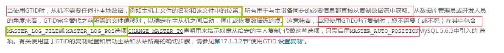

<!--more-->

 

# GTID主从 与 传统主从复制

### 1.主从复制

#### 1.）普通主从复制：

普通主从复制主要是基于二进制日志文件位置的复制，因此主必须启动二进制日志记录并建立唯一的服务器ID，复制组中的每个服务器都必须配置唯一的服务器ID。如果您省略server-id（或者明确地将其设置为其默认值0），则主设备将拒绝来自从设备的任何连接。 

#### 2.） GTID 主从：　

##### （1.）基本概念

MySQL 5.6 的新特性之一，全局事务标识符（GTID）是创建的唯一标识符，并与在源（主）服务器上提交的每个事务相关联。此标识符不但是唯一的，而且在给定复制设置中的所有服务器上都是唯一的。所有交易和所有GTID之间都有一对一的映射关系 。它由服务器ID以及事务ID组合而成。这个全局事务ID不仅仅在原始服务器上唯一，在所有存在主从关系 的mysql服务器上也是唯一的。正是因为这样一个特性使得mysql的主从复制变得更加简单，以及数据库一致性更可靠。一个GTID在一个服务器上只执行一次，避免重复执行导致数据混乱或者主从不一致。

一个GTID被表示为一对坐标，用冒号（:）分隔，如下所示：GTID = source_id:transaction_id，source_id标识的源服务器。通常情况下，服务器 server_uuid用于这个目的。这transaction_id是一个序列号，由在此服务器上提交事务的顺序决定 .

```
3E11FA47-71CA-11E1-9E33-C80AA9429562:23
```

在传统的主从复制slave端，binlog是不用开启的，但是在GTID中slave端的binlog是必须开启的，目的是记录执行过的GTID（强制）。GTID用来代替classic的复制方法，不在使用binlog+pos开启复制。而是使用master_auto_postion=1的方式自动匹配GTID断点进行复制。

mysql的主从复制是十分经典的一个应用，但是主从之间总会有数据一致性（data consistency ）的问题，一般情况从库会落后主库几个小时，而且在传统一主多从(mysql5.6之前)的模型中当master down掉后，我们不只是需要将一个slave提成master就可以，还要将其他slave的同步目的地从以前的master改成现在master，而且bin-log的序号和偏移量也要去查看，这是十分不方便和耗时的，但mysql5.6引入gtid之后解决了这个问题。

红色代表GTID，绿色代表传统主从：



### 2.gtid的生命周期

**gtid的生命周期对于配置和维护基于gtid的复制至关重要**。所以，请尽可能理解以下几个过程。

gtid在master和slave上是一直**持久化保存**(即使删除了日志，也会记录到Previous_GTID中)的。它在master和slave上的生命周期如下：

1. 客户端发送DDL/DML给master上，master首先对此事务生成一个唯一的gtid，假如为`uuid_xxx:1`，然后立即执行该事务中的操作。

注意，主从复制的情况下，sync-binlog基本上都会设置为1，这表示在每次提交事务时将缓存中的binlog刷盘。所以，在事务提交前，gtid以及事务相关操作的信息都在缓存中，提交后它们才写入到binlog file中，然后才会被dump线程dump出去。

换句话说，**只有提交了的事务，gtid和对应的事务操作才会记录到binlog文件中。记录的格式是先记录gtid，紧跟着再记录事务相关的操作。**

2. 当binlog传送到relay log中后，slave上的SQL线程首先读取该gtid，并设置变量 *gtid_next* 的值为该gtid，表示下一个要操作的事务是该gtid。 *gtid_next* **是基于会话的，不同会话的gtid_next不同。**

3. 随后slave检测该gtid在自己的binlog中是否存在。如果存在，则放弃此gtid事务；如果不存在，则将此gtid写入到**自己的binlog中**，然后立刻执行该事务，并在自己的binlog中记录该事务相关的操作。

注意，**slave上replay的时候，gtid不是提交后才写到自己的binlog file的，而是判断gtid不存在后立即写入binlog file。**

通过这种在执行事务前先检查并写gtid到binlog的机制，不仅可以保证当前会话在此之前没有执行过该事务，还能保证没有其他会话读取了该gtid却没有提交。因为如果其他会话读取了该gtid会立即写入到binlog(不管是否已经开始执行事务)，所以当前会话总能读取到binlog中的该gtid，于是当前会话就会放弃该事务。总之，一个gtid事务是决不允许多次执行、多个会话并行执行的。

4. slave在重放relay log中的事务时，不会自己生成gtid，所以所有的slave(无论是何种方式的一主一从或一主多从复制架构)通过重放relay log中事务获取的gtid都来源于master，并永久保存在slave上。

#### 一张图说明GTID复制

使用xtrabackup备份的方式提供gtid复制的基准数据。其中涉及到一些gtid检查、设置的操作。通过这些操作，大概可以感受的到gtid复制的几个概念。

用一张图来说明：


假如当前master的gtid为A3，已经purge掉的gtid为"1-->A1"，备份到slave上的数据为1-A2部分。

如果`A1 = 0`，表示master的binlog没有被Purge过。slave可以直接开启gtid复制，但这样可能速度较慢，因为slave要复制所有binlog。也可以将master数据备份到slave上，然后设置 *gtid_purged* 跳过备份结束时的gtid，这样速度较快。

如果`A1 != 0`，表示master上的binlog中删除了一部分gtid。此时slave上必须先从master处恢复purge掉的那部分日志对应的数据。上图中备份结束时的GTID为A2。然后slave开启复制，唯一需要考虑的是"是否需要设置 *gtid_purged* 跳过一部分gtid以避免重复执行"。

备份数据到slave上，方式可以是mysqldump、冷备份、xtrabackup备份都行。由于gtid复制的特性，所需要的操作都很少，也很简单，前提是理解了"gtid的生命周期"。

### 3.基于gtid复制的好处

从上面可以看出，gtid复制的优点大致有：

1. **保证同一个事务在某slave上绝对只执行一次，没有执行过的gtid事务总是会被执行。**
2. **不用像传统复制那样保证binlog的坐标准确，因为根本不需要binlog以及坐标。**
3. **故障转移到新的master的时候很方便，简化了很多任务。**
4. **很容易判断master和slave的数据是否一致。只要master上提交的事务在slave上也提交了，那么一定是一致的。**

当然，MySQL提供了选项可以控制跳过某些gtid事务，防止slave第一次启动复制时执行master上的所有事务而导致耗时过久。

虽然对于row-based和statement-based的格式都能进行gtid复制，但建议采用row-based格式。


### 2.）GTID的工作原理：

```
1、当一个事务在主库端执行并提交时，产生GTID，一同记录到binlog日志中。
2、binlog传输到slave,并存储到slave的relaylog后，读取这个GTID的这个值设置gtid_next变量，即告诉Slave，下一个要执行的GTID值。
3、sql线程从relay log中获取GTID，然后对比slave端的binlog是否有该GTID。
4、如果有记录，说明该GTID的事务已经执行，slave会忽略。
5、如果没有记录，slave就会执行该GTID事务，并记录该GTID到自身的binlog，在读取执行事务前会先检查其他session持有该GTID，确保不被重复执行。
6、在解析过程中会判断是否有主键，如果有就用二级索引，如果没有就用全部扫描。
```


## 4.MySQL基于GTID主从复制实战

### 4.1 前提条件

1. 准备 3 台服务器
2. 安装 MySQL 并且运行状态正常，MySQL 安装参考
3. 两台服务器配置时间同步
4. 关闭 SELINUX
5. 防火墙放行 3306 端口

### 4.2 配置一主一从的 GTID 复制

#### 4.2.1 环境说明


#### 4.2.2 修改 master 配置文件

```
[root@ip-10-0-100-31 ~]# vim /etc/my.cnf
# mysql GTID
log-bin=/var/lib/mysql/mysql-bin # 必须项,这里目录属主和组必须是mysql
binlog_format=row # 建议项
sync-binlog=1 # 建议项
server-id=101 # 必须项
master_info_repository=table # 建议项
relay_log_info_repository=table # 建议项
enforce_gtid_consistency=on # gtid复制需要加上的必须项
gtid_mode=on # gtid复制需要加上的必须项
```

修改配置文件后重启 MySQL

```
[root@ip-10-0-100-31 ~]# service mysqld restart
```

#### 4.2.3 修改 slave 配置文件

```
[root@ip-10-0-100-134 ~]# vim /etc/my.cnf 
# mysql GTID
log-bin=/var/lib/mysql/slave-bin # mysql 5.6必须项，mysql 5.7非必须项
binlog_format=row # 建议项
relay-log=/var/lib/mysql/relay-bin # 必须项
sync-binlog=1 # 建议项
server-id=182 # 必须项
master_info_repository=table # 建议项 
relay_log_info_repository=table # 建议项 
enforce_gtid_consistency=on # gtid复制需要加上的必须项
gtid_mode=on # gtid复制需要加上的必须项
```

修改配置文件后重启 MySQL

```
[root@ip-10-0-100-134 ~]# service mysqld restart
```

#### 4.2.4 master 上创建复制用户

在 master 上执行

```
mysql> create user 'whs'@'10.0.100.%' identified by 'itwhs123!';
Query OK, 0 rows affected (0.00 sec)

mysql> grant replication slave on *.* to 'whs'@'10.0.100.%';
Query OK, 0 rows affected (0.00 sec)

mysql> flush privileges;
Query OK, 0 rows affected (0.00 sec)
```

#### 4.2.5 slave 启用复制线程

因为全新实例 master 上的 binlog 没有删除过，所以在 slave 上直接change master to 配置连接参数。

在 slave 上执行

```
mysql> CHANGE MASTER TO MASTER_HOST='10.0.100.31',MASTER_PORT=3306,MASTER_AUTO_POSITION=1;
Query OK, 0 rows affected (0.03 sec)
```

因为是 MySQL 5.7，没有在 change master to 语句中加入 user 和 password 项，而是在 start slave 语句中使用，否则会警告。

现在启动 slave 上的两个复制线程:

```
mysql> START SLAVE USER='whs' PASSWORD='itwhs123!';
Query OK, 0 rows affected, 1 warning (0.00 sec)
```

#### 4.2.6 验证 GTID 复制是否生效

查看 io 线程和 sql 线程是否正常。

```
mysql> show processlist;
+----+-------------+-----------+------+---------+------+--------------------------------------------------------+------------------+
| Id | User        | Host      | db   | Command | Time | State                                                  | Info             |
+----+-------------+-----------+------+---------+------+--------------------------------------------------------+------------------+
|  2 | root        | localhost | NULL | Query   |    0 | starting                                               | show processlist |
|  3 | system user |           | NULL | Connect |   29 | Waiting for master to send event                       | NULL             |
|  4 | system user |           | NULL | Connect |  168 | Slave has read all relay log; waiting for more updates | NULL             |
+----+-------------+-----------+------+---------+------+--------------------------------------------------------+------------------+
3 rows in set (0.00 sec)
```

在 master 上新增一些测试数据：

```
DROP DATABASE IF EXISTS backuptest;
CREATE DATABASE backuptest;
USE backuptest;

# 创建myisam类型的数值辅助表和插入数据的存储过程
CREATE TABLE num_isam (n INT NOT NULL PRIMARY KEY) ENGINE = MYISAM ;

DROP PROCEDURE IF EXISTS proc_num1;
DELIMITER $$
CREATE PROCEDURE proc_num1 (num INT) 
BEGIN
    DECLARE rn INT DEFAULT 1 ;
    TRUNCATE TABLE backuptest.num_isam ;
    INSERT INTO backuptest.num_isam VALUES(1) ;
    dd: WHILE rn * 2 < num DO 
        BEGIN
            INSERT INTO backuptest.num_isam 
            SELECT rn + n FROM backuptest.num_isam;
            SET rn = rn * 2 ;
        END ;
    END WHILE dd;
    INSERT INTO backuptest.num_isam 
    SELECT n + rn 
    FROM backuptest.num_isam 
    WHERE n + rn <= num;
END ;
$$
DELIMITER ;

# 创建innodb类型的数值辅助表和插入数据的存储过程
CREATE TABLE num_innodb (n INT NOT NULL PRIMARY KEY) ENGINE = INNODB ;

DROP PROCEDURE IF EXISTS proc_num2;
DELIMITER $$
CREATE PROCEDURE proc_num2 (num INT) 
BEGIN
    DECLARE rn INT DEFAULT 1 ;
    TRUNCATE TABLE backuptest.num_innodb ;
    INSERT INTO backuptest.num_innodb VALUES(1) ;
    dd: WHILE rn * 2 < num DO 
        BEGIN
            INSERT INTO backuptest.num_innodb 
            SELECT rn + n FROM backuptest.num_innodb;
            SET rn = rn * 2 ;
        END ;
    END WHILE dd;
    INSERT INTO backuptest.num_innodb 
    SELECT n + rn 
    FROM backuptest.num_innodb 
    WHERE n + rn <= num ;
END ;
$$
DELIMITER ;

# 分别向两个数值辅助表中插入100W条数据
CALL proc_num1 (1000000) ;
CALL proc_num2 (1000000) ;
```

在 slave 上查看 slave 的状态，以下是同步结束后的状态信息：

```
mysql> show slave status\G
*************************** 1. row ***************************
               Slave_IO_State: Waiting for master to send event
                  Master_Host: 10.0.100.31
                  Master_User: whs
                  Master_Port: 3306
                Connect_Retry: 60
              Master_Log_File: mysql-bin.000003
          Read_Master_Log_Pos: 10058377
               Relay_Log_File: relay-bin.000002
                Relay_Log_Pos: 10058590
        Relay_Master_Log_File: mysql-bin.000003
             Slave_IO_Running: Yes
            Slave_SQL_Running: Yes
              Replicate_Do_DB: 
          Replicate_Ignore_DB: 
           Replicate_Do_Table: 
       Replicate_Ignore_Table: 
      Replicate_Wild_Do_Table: 
  Replicate_Wild_Ignore_Table: 
                   Last_Errno: 0
                   Last_Error: 
                 Skip_Counter: 0
          Exec_Master_Log_Pos: 10058377
              Relay_Log_Space: 10058791
              Until_Condition: None
               Until_Log_File: 
                Until_Log_Pos: 0
           Master_SSL_Allowed: No
           Master_SSL_CA_File: 
           Master_SSL_CA_Path: 
              Master_SSL_Cert: 
            Master_SSL_Cipher: 
               Master_SSL_Key: 
        Seconds_Behind_Master: 0
Master_SSL_Verify_Server_Cert: No
                Last_IO_Errno: 0
                Last_IO_Error: 
               Last_SQL_Errno: 0
               Last_SQL_Error: 
  Replicate_Ignore_Server_Ids: 
             Master_Server_Id: 101
                  Master_UUID: aece386a-7877-11e9-959a-0a6df75fd3e6
             Master_Info_File: mysql.slave_master_info
                    SQL_Delay: 0
          SQL_Remaining_Delay: NULL
      Slave_SQL_Running_State: Slave has read all relay log; waiting for more updates
           Master_Retry_Count: 86400
                  Master_Bind: 
      Last_IO_Error_Timestamp: 
     Last_SQL_Error_Timestamp: 
               Master_SSL_Crl: 
           Master_SSL_Crlpath: 
           Retrieved_Gtid_Set: aece386a-7877-11e9-959a-0a6df75fd3e6:1-55
            Executed_Gtid_Set: aece386a-7877-11e9-959a-0a6df75fd3e6:1-55
                Auto_Position: 1
         Replicate_Rewrite_DB: 
                 Channel_Name: 
           Master_TLS_Version: 
1 row in set (0.00 sec)
```

至此处一主已从基础 GTID 复制就完成了。

### 4.3 添加新的 slave 到 GTID 复制集群中

上面的实验是基于全新的实例，生产环境中往往 master 数据库已经运行了很久，并且 binlog 可能会定期删除掉一部分，所以，为了配置更通用的 gtid 复制环境，这里把刚才的 master 的 binlog 给 purge 掉一部分。模拟实际环境中定期删除了一部分 binlog 的场景。

目前 master 上的 binlog 使用情况如下，不难发现绝大多数操作都集中在mysql-bin.000001 这个 binlog 中。

```
[root@ip-10-0-100-31 ~]# ll /var/lib/mysql/*bin*
-rw-r-----. 1 mysql mysql      177 May 17 08:17 /var/lib/mysql/mysql-bin.000001
-rw-r-----. 1 mysql mysql      177 May 17 08:18 /var/lib/mysql/mysql-bin.000002
-rw-r-----. 1 mysql mysql 10058377 May 17 08:50 /var/lib/mysql/mysql-bin.000003
-rw-r-----. 1 mysql mysql       96 May 17 08:18 /var/lib/mysql/mysql-bin.index
```

purge 已有的 binlog:

```
mysql> flush logs;
Query OK, 0 rows affected (0.01 sec)

mysql> purge master logs to 'mysql/mysql-bin.000003';
Query OK, 0 rows affected (0.00 sec)
```

查看当前使用的 binlog

```
[root@ip-10-0-100-31 ~]# cat /var/lib/mysql/mysql-bin.index
/var/lib/mysql/mysql-bin.000003
/var/lib/mysql/mysql-bin.000004
```

#### 4.3.1 当前环境说明


#### 4.3.2 修改 slave2 节点配置文件

其中 slave2 节点的配置文件和 slave1 的配置文件完全相同：

```
[root@ip-10-0-100-143 ~]# vim /etc/my.cnf 
# mysql GTID
log-bin=/var/lib/mysql/slave-bin # mysql 5.6必须项，mysql 5.7非必须项
binlog_format=row # 建议项
relay-log=/var/lib/mysql/relay-bin # 必须项
sync-binlog=1 # 建议项
server-id=183 # 必须项
master_info_repository=table # 建议项 
relay_log_info_repository=table # 建议项 
enforce_gtid_consistency=on # gtid复制需要加上的必须项
gtid_mode=on # gtid复制需要加上的必须项
```

#### 4.3.3 备份 master 节点数据

我这里没有安装 xtrabackup 的 innobackupex 工具，所以使用 mysqldump。

在 master 节点执行：

```
[root@ip-10-0-100-31 ~]# mysqldump -uroot -pjbgsn123! -R --triggers --master-data=2 --single-transaction --set-gtid-purged=OFF --all-databases > all.sql
mysqldump: [Warning] Using a password on the command line interface can be insecure.
```

将数据复制到 slave2 节点

```
[root@ip-10-0-100-31 ~]# mv all.sql /nfs/
```

#### 4.3.4 将备份恢复到 slave2

在 slave 2上执行：

```
[root@ip-10-0-100-143 ~]# mysql -uroot -pjbgsn123! </nfs/all.sql 
mysql: [Warning] Using a password on the command line interface can be insecure.
```

#### 4.3.5 在 master 查看已经执行过的事务

查看已经执行过的事务，这部分是不需要再 slave2 上执行了，因为已经都恢复数据过去了。

在 master 上直接查看 gtid_executed 的值，注意不是 gtid_purged 的值，master 上的 gtid_purged 表示的是曾经删除掉的 binlog。

```
mysql> show global variables like '%gtid%';
+----------------------------------+-------------------------------------------+
| Variable_name                    | Value                                     |
+----------------------------------+-------------------------------------------+
| binlog_gtid_simple_recovery      | ON                                        |
| enforce_gtid_consistency         | ON                                        |
| gtid_executed                    | aece386a-7877-11e9-959a-0a6df75fd3e6:1-55 |
| gtid_executed_compression_period | 1000                                      |
| gtid_mode                        | ON                                        |
| gtid_owned                       |                                           |
| gtid_purged                      |                                           |
| session_track_gtids              | OFF                                       |
+----------------------------------+-------------------------------------------+
8 rows in set (0.00 sec)
```

#### 4.3.6 启用 slave2 上的复制线程

可以在启动 slave2 线程之前使用 gtid_purged 变量来指定需要跳过的 gtid 集合。但因为要设置 gtid_purged 必须保证全局变量 gtid_executed为空，所以先在 slave2 上执行 reset master(注意，不是 reset slave)，再设置 gtid_purged。

```
mysql> reset master;
Query OK, 0 rows affected (0.00 sec)

mysql> set @@global.gtid_purged='aece386a-7877-11e9-959a-0a6df75fd3e6:1-55';
Query OK, 0 rows affected (0.01 sec)
```

设置好 gtid_purged 之后，就可以开启复制线程了。

```
mysql> CHANGE MASTER TO MASTER_HOST='10.0.100.31',MASTER_PORT=3306,MASTER_AUTO_POSITION=1;
Query OK, 0 rows affected (0.01 sec)

mysql> START SLAVE USER='whs' PASSWORD='itwhs123!';
Query OK, 0 rows affected, 1 warning (0.00 sec)
```

查看 slave2 的状态，看是否正确启动了复制功能。如果没错，再在 master 上修改一部分数据，检查是否同步到 slave1和 slave2。

```
mysql> show slave status\G
*************************** 1. row ***************************
               Slave_IO_State: Waiting for master to send event
                  Master_Host: 10.0.100.31
                  Master_User: whs
                  Master_Port: 3306
                Connect_Retry: 60
              Master_Log_File: mysql-bin.000004
          Read_Master_Log_Pos: 194
               Relay_Log_File: relay-bin.000002
                Relay_Log_Pos: 367
        Relay_Master_Log_File: mysql-bin.000004
             Slave_IO_Running: Yes
            Slave_SQL_Running: Yes
              Replicate_Do_DB: 
          Replicate_Ignore_DB: 
           Replicate_Do_Table: 
       Replicate_Ignore_Table: 
      Replicate_Wild_Do_Table: 
  Replicate_Wild_Ignore_Table: 
                   Last_Errno: 0
                   Last_Error: 
                 Skip_Counter: 0
          Exec_Master_Log_Pos: 194
              Relay_Log_Space: 568
              Until_Condition: None
               Until_Log_File: 
                Until_Log_Pos: 0
           Master_SSL_Allowed: No
           Master_SSL_CA_File: 
           Master_SSL_CA_Path: 
              Master_SSL_Cert: 
            Master_SSL_Cipher: 
               Master_SSL_Key: 
        Seconds_Behind_Master: 0
Master_SSL_Verify_Server_Cert: No
                Last_IO_Errno: 0
                Last_IO_Error: 
               Last_SQL_Errno: 0
               Last_SQL_Error: 
  Replicate_Ignore_Server_Ids: 
             Master_Server_Id: 101
                  Master_UUID: aece386a-7877-11e9-959a-0a6df75fd3e6
             Master_Info_File: mysql.slave_master_info
                    SQL_Delay: 0
          SQL_Remaining_Delay: NULL
      Slave_SQL_Running_State: Slave has read all relay log; waiting for more updates
           Master_Retry_Count: 86400
                  Master_Bind: 
      Last_IO_Error_Timestamp: 
     Last_SQL_Error_Timestamp: 
               Master_SSL_Crl: 
           Master_SSL_Crlpath: 
           Retrieved_Gtid_Set: 
            Executed_Gtid_Set: aece386a-7877-11e9-959a-0a6df75fd3e6:1-55
                Auto_Position: 1
         Replicate_Rewrite_DB: 
                 Channel_Name: 
           Master_TLS_Version: 
1 row in set (0.00 sec)
```

在 master 上创建一个测试数据库 mydb 检查 slave1 和 slave2 节点能否同步。

```
mysql> create database mydb;
Query OK, 1 row affected (0.00 sec)
```

slave1 节点查看

```
mysql> show databases;
+--------------------+
| Database           |
+--------------------+
| information_schema |
| backuptest         |
| mydb               |
| mysql              |
| performance_schema |
| sys                |
+--------------------+
6 rows in set (0.00 sec)
```

slave1节点验证数据同步

slave2 节点查看

```
mysql> show databases;
+--------------------+
| Database           |
+--------------------+
| information_schema |
| backuptest         |
| mydb               |
| mysql              |
| performance_schema |
| sys                |
+--------------------+
6 rows in set (0.00 sec)
```

slave2节点验证数据同步

#### 4.3.7 回到 master，purge 掉已同步的 binlog

当 slave 指定 gtid_purged 并实现了同步之后，为了下次重启 mysqld 实例不用再次设置 gtid_purged(甚至可能会在启动的时候自动开启复制线程)，所以应该去 master 上将已经同步的 binlog 给 purged 掉。

在 master 上执行

```
mysql> flush logs;
Query OK, 0 rows affected (0.01 sec)

mysql> purge master logs to 'mysql-bin.000005';
Query OK, 0 rows affected (0.00 sec)

mysql> show global variables like '%gtid%';
+----------------------------------+-------------------------------------------+
| Variable_name                    | Value                                     |
+----------------------------------+-------------------------------------------+
| binlog_gtid_simple_recovery      | ON                                        |
| enforce_gtid_consistency         | ON                                        |
| gtid_executed                    | aece386a-7877-11e9-959a-0a6df75fd3e6:1-56 |
| gtid_executed_compression_period | 1000                                      |
| gtid_mode                        | ON                                        |
| gtid_owned                       |                                           |
| gtid_purged                      | aece386a-7877-11e9-959a-0a6df75fd3e6:1-56 |
| session_track_gtids              | OFF                                       |
+----------------------------------+-------------------------------------------+
8 rows in set (0.00 sec)
```

### 4.4 GTID 复制相关的状态信息和变量

#### 4.4.1 show slave status 中和 gtid 复制相关的状态行

```
Retrieved_Gtid_Set: aece386a-7877-11e9-959a-0a6df75fd3e6:56
Executed_Gtid_Set: aece386a-7877-11e9-959a-0a6df75fd3e6:1-56
Auto_Position: 1
```

 - Retrieved_Gtid_Set：在开启了 gtid 复制(即 gtid_mode=on)时，slave 在启动 io 线程的时候会检查自己的 relay log，并从中检索出gtid 集合。也就是说，这代表的是 slave 已经从 master 中复制了哪些事务过来。检索出来的 gtid 不会再请求 master 发送过来。
 - Executed_Gtid_Set：在开启了 gtid 复制(即 gtid_mode=on)时，它表示已经向自己的 binlog 中写入了哪些 gtid 集合。注意，这个值是根据一些状态信息计算出来的，并非 binlog 中能看到的那些。举个特殊一点的例子，可能 slave 的 binlog 还是空的，但这里已经显示一些已执行 gtid 集合了。
 - Auto_Position：开启 gtid 时是否自动获取 binlog 坐标。1 表示开启，这是 gtid 复制的默认值。

#### 4.4.2 一些重要的变量

 - gtid_mode：是否开启gtid复制模式。只允许on/off类的布尔值，不允许其他类型(如1/0)的布尔值，实际上这个变量是枚举类型的。要设置 gtid_mode=on ，必须同时设置 enforce_gtid_consistency 开。在MySQL 5.6中，还必须开启 log_slave_updates ，即使是master也要开启。
 - enforce_gtid_consistency：强制要求只允许复制事务安全的事务。 gtid_mode=on 时必须显式设置该项，如果不给定值，则默认为 on。应该尽量将该选项放在 gtid_mode 的前面，减少启动 mysqld 时的检查。
 - 不能在事务内部创建和删除临时表。只能在事务外部进行，且 autocommit 需要设置为 1。
 - 不能执行 create table … select 语句。该语句除了创建一张新表并填充一些数据，其他什么事也没干。
 - 不能在事务内既更新事务表又更新非事务表。
 - gtid_executed：已经执行过的 GTID。 reset master 会清空该项的全局变量值。
 - gtid_purged：已经 purge 掉的 gtid。要设置该项，必须先保证gtid_executed 已经为空，这意味着也一定会同时设置该项为空。在 slave 上设置该项时，表示稍后启动 io 线程和 SQL 线程都跳过这些 gtid，slave 上设置时应该让此项的 gtid 集合等于 master上 gtid_executed 的值。
 - gtid_next：表示下一个要执行的gtid事务。

需要注意，master和slave上都有gtid_executed和gtid_purged，它们代表的意义有时候是不同的。