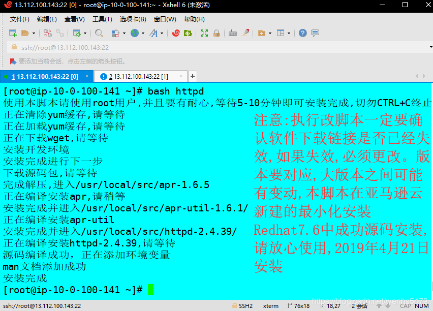
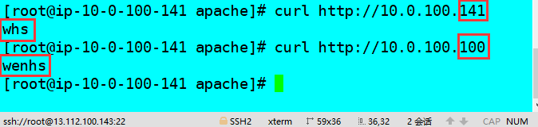
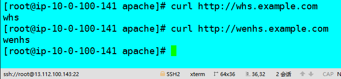

<!--more-->

# 1. httpd简介

httpd是Apache的超文本传输协议（HTTP）服务器的主程序。被设计为一个独立运行的后台进程，它会建立一个处理请求的子进程或线程的池。

通常，httpd的不应该被直接调用，而应该在类Unix的系统中由的apachectl调用，在Windows中作为服务运行。

# 2. httpd版本

本文主要介绍的httpd的两大版本，httpd-2.2和httpd-2.4。

 - CentOS6系列的版本默认提供的是的httpd-2.2版本的rpm包
 - CentOS7系列的版本默认提供的是的httpd-2.4版本的rpm包

## 2.1 httpd的特性

httpd的有很多特性，下面就分别来说说的httpd-2.2版本和的httpd-2.4版本各自的特性。

#### httpd-2.2的特性

 - 事先创建进程
 - 按需维持适当的进程
 - 模块化设计，核心比较小，各种功能通过模块添加（包括PHP），支持运行时配置，支持单独编译模块
 - 支持多种方式的虚拟主机配置，如基于ip的虚拟主机，基于端口的虚拟主机，基于域名的虚拟主机等
 - 支持https协议（通过mod_ssl模块实现）
 - 支持用户认证
 - 支持基于IP或域名的ACL访问控制机制
 - 支持每目录的访问控制（用户访问默认主页时不需要提供用户名和密码，但是用户访问某特定目录时 需要提供用户名和密码）
 - 支持URL重写
 - 支持MPM（Multi Path Modules，多处理模块）。用于定义httpd的工作模型（单进程、单进程多线程、多进程、多进程单线程、多进程多线程）

#### httpd-2.4的新特性：

 

 - MPM支持运行DSO机制（Dynamic Share Object，模块的动态装/卸载机制），以模块形式按需加载
 - 支持event MPM，eventMPM模块生产环境可用
 - 支持异步读写
 - 支持每个模块及每个目录分别使用各自的日志级别
 - 每个请求相关的专业配置，使用<If>来配置
 - 增强版的表达式分析器
 - 支持毫秒级的keepalive timeout
 - 基于FQDN的虚拟主机不再需要NameVirtualHost指令
 - 支持用户自定义变量
 - 支持新的指令（AllowOverrideList）
 - 降低对内存的消耗

| 工作模型 | 工作方式                                                     |
| -------- | ------------------------------------------------------------ |
| prefork  | 多进程模型，预先生成进程，请求一个用一个进程响应,一个主进程负责生成Ñ个子进程，进程子也。称为工作进程,每个子进程处理一个用户请求，即使没有用户请求，也会预先生成多个空闲进程，随时等待请求到达，最大不会超过1024个 |
| worker   | 基于线程工作，一个请求用一个线程响应（启动多个进程，每个进程生成多个线程） |
| event    | 基于事件的驱动，一个进程处理多个请求                         |

## 2.2 httpd-2.4新增的模块

httpd-2.4在之前的版本基础上新增了几大模块，下面就几个常用的来介绍一下。

| 模块           | 功能                                                         |
| -------------- | ------------------------------------------------------------ |
| mod_proxy_fcgi | 反向代理时支持的Apache服务器后端协议的模块                   |
| mod_ratelimit  | 提供速率限制功能的模块                                       |
| mod_remoteip   | 基于ip的访问控制机制被改变，不再支持使用Order，Deny，Allow来做基于IP的访问控制 |

# 3. httpd基础

## 3.1 httpd自带的工具程序

| 工具       | 功能                                                         |
| ---------- | ------------------------------------------------------------ |
| htpasswd   | basic认证基于文件实现时，用到的帐号密码生成工具              |
| apachectl  | httpd自带的服务控制脚本，支持start，stop，restart            |
| apxs       | 由httpd-devel包提供的，扩展httpd使用第三方模块的工具         |
| rotatelogs | 日志滚动工具                                                 |
| suexec     | 访问某些有特殊权限配置的资源时，临时切换至指定用户运行的工具 |
| ab         | apache benchmark，httpd的压力测试工具                        |

## 3.2 rpm包安装的httpd程序环境

| 文件/目录                        | 对应的功能   |
| -------------------------------- | ------------ |
| /var/log/httpd/access.log        | 访问日志     |
| /var/log/httpd/error_log         | 错误日志     |
| /var/www/html/                   | 站点文档目录 |
| /usr/lib64/httpd/modules/        | 模块文件路径 |
| /etc/httpd/conf/httpd.conf       | 主配置文件   |
| /etc/httpd/conf.modules.d/*.conf | 模块配置文件 |
| /etc/httpd/conf.d/*.conf         | 辅助配置文件 |

> mpm：以DSO机制提供，配置文件为/etc/httpd/conf.modules.d/00-mpm.conf

## 3.3 web相关的命令

#### 3.3.1 curl命令

curl是基于URL语法在命令行方式下工作的文件传输工具，它支持FTP，FTPS，HTTP，HTTPS，GOPHER，TELNET，DICT，FILE及LDAP等协议。

curl支持以下功能：

 - https认证
 - http的POST/PUT等方法
 - ftp上传
 - kerberos认证
 - http上传
 - 代理服务器
 - cookies
 - 用户名/密码认证
 - 下载文件断点续传
 - socks5代理服务器
 - 通过http代理服务器上传文件到ftp服务器

```
//语法：curl [options] [URL ...]
//常用的options：
    -A/--user-agent <string>    //设置用户代理发送给服务器
    -basic              //使用Http基本认证
    --tcp-nodelay       //使用TCP_NODELAY选项
    -e/--referer <URL>      //来源网址
    --cacert <file>     //CA证书（SSL）
    --compressed        //要求返回时压缩的格式
    -H/--header <line>  //自定义请求首部信息传递给服务器
    -I/--head           //只显示响应报文首部信息
    --limit-rate <rate>     //设置传输速度
    -u/--user <user[:password]>     //设置服务器的用户和密码
    -0/--http1      //使用http 1.0版本，默认使用1.1版本。这个选项是数字0而不是字母o
    -o/--output     //把输出写到文件中
    -#/--progress-bar       //进度条显示当前的传送状态
```

#### 3.3.2 httpd命令

```
//语法：httpd [options]
//常用的options：
    -l      //查看静态编译的模块，列出核心中编译了哪些模块。 \
            //它不会列出使用LoadModule指令动态加载的模块
    -M      //输出一个已经启用的模块列表，包括静态编译在服务 \
            //器中的模块和作为DSO动态加载的模块
    -v      //显示httpd的版本，然后退出
    -V      //显示httpd和apr/apr-util的版本和编译参数，然后退出
    -X      //以调试模式运行httpd。仅启动一个工作进程，并且 \
            //服务器不与控制台脱离
    -t      //检查配置文件是否有语法错误
```

# 4.编译安装http-2.4

[点这里,查看详细安装步骤,下面为源码安装脚本](https://blog.csdn.net/wenhs5479/article/details/88536361)

```
#!/bin/bash
##配置yum源：
echo "使用本脚本请使用root用户,并且要有耐心,等待5-10分钟即可安装完成,切勿CTRL+C终止"
yum -y install wget &> /dev/null
if [ $? -ne 0 ];then
ls -l /etc/yum.repos.d/7centos_base.repo &>/dev/null
  if [ $? -ne 0 ];then
   echo "正在下载yum源"
   curl -o /etc/yum.repos.d/7centos_base.repo http://mirrors.aliyun.com/repo/Centos-7.repo &>/dev/null
   sed -i 's/$releasever/7/g' /etc/yum.repos.d/7centos_base.repo   &>/dev/null
  else
   mv /etc/yum.repos.d/7centos_base.repo /etc/yum.repos.d/7centos_base.repo_backup 
   echo "正在备份yum源并重新下载，请重新运行脚本"
   exit
  fi
fi

yum clean all &>/dev/null
echo "正在清除yum缓存,请等待"

echo "正在加载yum缓存,请等待"
yum makecache &>/dev/null
##下载wget
echo "正在下载wget,请等待 "
yum -y install wget  &>/dev/null

##准备make环境
echo "安装开发环境"
yum -y groups mark install "Development Tools" &>/dev/null
#安装make gcc gcc-c++ gzip bzip2 openssl-devel pcre-devel expat-devel libtool
yum -y install make gcc gcc-c++ gzip bzip2 openssl-devel pcre-devel expat-devel libtool &>/dev/null
echo "安装完成进行下一步"
##下载httpd源码包
mkdir /usr/local/src &> /dev/src
cd /usr/local/src
echo "下载源码包,请等待"
wget http://mirrors.tuna.tsinghua.edu.cn/apache//httpd/httpd-2.4.39.tar.bz2 &>/dev/null
wget http://mirror.bit.edu.cn/apache//apr/apr-1.6.5.tar.bz2 &>/dev/null
wget http://mirror.bit.edu.cn/apache//apr/apr-util-1.6.1.tar.bz2 &>/dev/null
##解压源码包
tar xf apr-1.6.5.tar.bz2
tar xf apr-util-1.6.1.tar.bz2
tar xf httpd-2.4.39.tar.bz2
echo "完成解压,进入/usr/local/src/apr-1.6.5"
##源码安装apr
cd /usr/local/src/apr-1.6.5
echo "正在编译安装apr,请稍等"
sed -i 's/$RM "$cfgfile"/#$RM "$cfgfile"/g' configure
./configure --prefix=/usr/local/apr &>/dev/null
if [ $? -ne 0 ];then
echo "apr ./configure定制组件失败，请自行排错"
exit
fi
make &>/dev/null
if [ $? -ne 0 ];then
echo "apr make编译失败，请自行排错"
exit
fi
make install &> /dev/null
echo "安装完成并进入/usr/local/src/apr-util-1.6.1/"
##源码安装apr-util
cd /usr/local/src/apr-util-1.6.1/
echo "正在编译安装apr-util"
./configure --prefix=/usr/local/apr-util --with-apr=/usr/local/apr &>/dev/null
if [ $? -ne 0 ];then
echo "apr-util ./configure定制组件失败，请自行排错"
exit
fi
make &>/dev/null
if [ $? -ne 0 ];then
echo "apr-util make编译失败，请自行排错"
exit
fi
make install &>/dev/null
echo "安装完成并进入/usr/local/src/httpd-2.4.39/"
##源码安装httpd
cd /usr/local/src/httpd-2.4.39/
echo "正在编译安装httpd-2.4.39,请等待"
./configure --prefix=/usr/local/apache --with-apr=/usr/local/apr --with-apr-util=/usr/local/apr-util/ &>/dev/null
if [ $? -ne 0 ];then
echo "httpd ./configure定制组件失败，请自行排错"
exit
fi

make &>/dev/null
if [ $? -ne 0 ];then
echo "httpd make编译失败，请自行排错"
exit
fi

make install &>/dev/null
echo "源码编译成功，正在添加环境变量"

##添加man文档
echo "MANDATORY_MANPATH /usr/local/apache/man" >> /etc/man_db.conf
man httpd &>/dev/null
if [ $? -eq 0 ];then
echo "man文档添加成功"
else
echo "man文档添加失败,如有需要，请自行添加"
exit
fi
##编辑httpd配置文件
sed -i '/ServerName www.example.com:80/aServerName localhost:80' /usr/local/apache/conf/httpd.conf
systemctl stop firewalld &> /dev/null
systemctl disable firewalld &> /dev/null

##添加环境变量
ln -s /usr/local/apache/bin/* /usr/bin/ &>/dev/null

echo  "安装完成"
```



# 5. httpd常用配置

**切换使用MPM（编辑/etc/httpd/conf.modules.d/00-mpm.conf文件）：**

```
LoadModule mpm_NAME_module modules/mod_mpm_NAME.so
NAME有三种，分别是：
    prefork
    event
    worker
```

**访问控制法则：**

| 法则                      | 功能                         |
| ------------------------- | ---------------------------- |
| Require all granted       | 允许所有主机访问             |
| Require all deny          | 拒绝所有主机访问             |
| Require ip IPADDR         | 授权指定来源地址的主机访问   |
| Require not ip IPADDR     | 拒绝指定来源地址的主机访问   |
| Require host HOSTNAME     | 授权指定来源主机名的主机访问 |
| Require not host HOSTNAME | 拒绝指定来源主机名的主机访问 |

**IPADDR的类型**	

- IP：192.168.1.1

- Network/mask：192.168.1.0/255.255.255.0

- Network/Length：192.168.1.0/24

- Net：192.168	

**HOSTNAME的类型**

- FQDN：特定主机的全名

- DOMAIN：指定域内的所有主机


**注意：httpd-2.4版本默认是拒绝所有主机访问的，所以安装以后必须做显示授权访问**

示例：

```
<Directory /var/www/html/www>
    <RequireAll>
        Require not ip 192.168.160.89
        Require all granted
    </RequireAll>
</Directory>
```

虚拟主机：
虚拟主机有三类：

 - 相同IP不同端口
 - 不同IP相同端口
 - 相同IP相同端口不同域名

**ssl：**

启用模块：编辑/etc/httpd/conf.modules.d/00-base.conf文件，添加下面这行，如果已经有了但是注释了，则取消注释即可

> LoadModule ssl_module modules/mod_ssl.so

### 实验 

 - 编译安装Httpd-2.4版本；
 - 配置三种不同风格的虚拟主机：
 - 相同IP不同端口；
 - 不同IP相同端口；
 - 相同IP相同端口不同域名
 - 配置https

### 步骤

```
//相同ip不同端口

//设置主机名
ServerAdmin you@example.com

#
# ServerName gives the name and port that the server uses to identify itself.
# This can often be determined automatically, but we recommend you specify
# it explicitly to prevent problems during startup.
#
# If your host doesn't have a registered DNS name, enter its IP address here.
#
ServerName www.example.com:80  //此行如果有注释请取消

httpd-vhosts.conf  //这个文件可以查看编写虚拟主机格式示例
[root@ip-10-0-100-141 apache]# vim conf/httpd.conf
//设置监听端口
#Listen 12.34.56.78:80
Listen 80
Listen 8080 //与添加主机的端口号相同

//在文本最后添加主机配置

<VirtualHost 10.0.100.141:80>
    ServerName whs.example.com
    DocumentRoot "/usr/local/apache/htdocs/whs"
    ErrorLog "/usr/local/apache/logs/whs_error_log"
    ErrorLog "/usr/local/apache/logs/whs_error_log"
    CustomLog "/usr/local/apache/logs/whs_access_log" combined
    <Directory /usr/local/apache/htdocs/whs>
        Require all granted
    </Directory>
</VirtualHost>

<VirtualHost 10.0.100.141:8080>
    ServerName wenhs.example.com
    DocumentRoot "/usr/local/apache/htdocs/wenhs"
    ErrorLog "/usr/local/apache/logs/wenhs_error_log"
    CustomLog "/usr/local/apache/logs/wenhs_access_log" combined
    <Directory /usr/local/apache/htdocs/wenhs>
        Require all granted
    </Directory>
</VirtualHost>

[root@ip-10-0-100-141 apache]# mkdir htdocs/whs
[root@ip-10-0-100-141 apache]# mkdir htdocs/wenhs
[root@ip-10-0-100-141 apache]# echo whs >htdocs/whs/index.html
[root@ip-10-0-100-141 apache]# echo wenhs >htdocs/wenhs/index.html
[root@ip-10-0-100-141 apache]# apachectl -t
Syntax OK
[root@ip-10-0-100-141 apache]# apachectl restart

验证:
[root@ip-10-0-100-141 apache]# curl http://13.112.100.143
whs
[root@ip-10-0-100-141 apache]# curl http://13.112.100.143:8080
wenhs
```


```
不同ip相同端口
//设置主机名
ServerAdmin you@example.com

#
# ServerName gives the name and port that the server uses to identify itself.
# This can often be determined automatically, but we recommend you specify
# it explicitly to prevent problems during startup.
#
# If your host doesn't have a registered DNS name, enter its IP address here.
#
ServerName www.example.com:80  //此行如果有注释请取消

httpd-vhosts.conf  //这个文件可以查看编写虚拟主机格式示例
[root@ip-10-0-100-141 apache]# vim conf/httpd.conf
//设置监听端口
#Listen 12.34.56.78:80
Listen 80

<VirtualHost 10.0.100.141:80>
    ServerName whs.example.com
    DocumentRoot "/usr/local/apache/htdocs/whs"
    ErrorLog "/usr/local/apache/logs/whs_error_log"
    ErrorLog "/usr/local/apache/logs/whs_error_log"
    CustomLog "/usr/local/apache/logs/whs_access_log" combined
    <Directory /usr/local/apache/htdocs/whs>
        Require all granted
    </Directory>
</VirtualHost>

<VirtualHost 10.0.100.100:80>
    ServerName wenhs.example.com
    DocumentRoot "/usr/local/apache/htdocs/wenhs"
    ErrorLog "/usr/local/apache/logs/wenhs_error_log"
    CustomLog "/usr/local/apache/logs/wenhs_access_log" combined
    <Directory /usr/local/apache/htdocs/wenhs>
        Require all granted
    </Directory>
</VirtualHost>

[root@ip-10-0-100-141 apache]# apachectl -t
Syntax OK
[root@ip-10-0-100-141 apache]# ip addr add 10.0.100.100/24 dev eth0
[root@ip-10-0-100-141 apache]# ip a
1: lo: <LOOPBACK,UP,LOWER_UP> mtu 65536 qdisc noqueue state UNKNOWN group default qlen 1000
    link/loopback 00:00:00:00:00:00 brd 00:00:00:00:00:00
    inet 127.0.0.1/8 scope host lo
       valid_lft forever preferred_lft forever
    inet6 ::1/128 scope host 
       valid_lft forever preferred_lft forever
2: eth0: <BROADCAST,MULTICAST,UP,LOWER_UP> mtu 9001 qdisc pfifo_fast state UP group default qlen 1000
    link/ether 0a:f5:fa:b7:e9:60 brd ff:ff:ff:ff:ff:ff
    inet 10.0.100.141/24 brd 10.0.100.255 scope global noprefixroute dynamic eth0
       valid_lft 3473sec preferred_lft 3473sec
    inet 10.0.100.100/24 scope global secondary eth0
       valid_lft forever preferred_lft forever
    inet6 fe80::8f5:faff:feb7:e960/64 scope link 
       valid_lft forever preferred_lft forever
[root@ip-10-0-100-141 apache]# apachectl restart
```

公网IP就一个,所以只好用curl验证了



```
//相同端口相同ip不同域名

//设置主机名
ServerAdmin you@example.com

#
# ServerName gives the name and port that the server uses to identify itself.
# This can often be determined automatically, but we recommend you specify
# it explicitly to prevent problems during startup.
#
# If your host doesn't have a registered DNS name, enter its IP address here.
#
ServerName www.example.com:80  //此行如果有注释请取消

[root@server apache]# vim /etc/httpd24/extra/httpd-vhosts.conf //编写主机格式示例
[root@server apache]# vim /etc/httpd24/httpd.conf
//设置监听端口
#Listen 12.34.56.78:80
Listen 80

//在文本最后添加主机配置
<VirtualHost 10.0.100.141:80>
    ServerName whs.example.com
    DocumentRoot "/usr/local/apache/htdocs/whs"
    ErrorLog "/usr/local/apache/logs/whs_error_log"
    ErrorLog "/usr/local/apache/logs/whs_error_log"
    CustomLog "/usr/local/apache/logs/whs_access_log" combined
    <Directory /usr/local/apache/htdocs/whs>
        Require all granted
    </Directory>
</VirtualHost>

<VirtualHost 10.0.100.141:80>
    ServerName wenhs.example.com
    DocumentRoot "/usr/local/apache/htdocs/wenhs"
    ErrorLog "/usr/local/apache/logs/wenhs_error_log"
    CustomLog "/usr/local/apache/logs/wenhs_access_log" combined
    <Directory /usr/local/apache/htdocs/wenhs>
        Require all granted
    </Directory>
</VirtualHost>

[root@ip-10-0-100-141 apache]# vim /etc/hosts
127.0.0.1   localhost localhost.localdomain localhost4 localhost4.localdomain4
::1         localhost localhost.localdomain localhost6 localhost6.localdomain6
10.0.100.141 whs.example.com
10.0.100.141 wenhs.example.com
```



```
配置https

[root@ip-10-0-100-141 apache]# cd /etc/pki/CA/
[root@ip-10-0-100-141 CA]# (umask 077;openssl genrsa -out private/cakey.pem 2048)
Generating RSA private key, 2048 bit long modulus
..+++
..........................+++
e is 65537 (0x10001)
[root@ip-10-0-100-141 CA]# openssl rsa -in private/cakey.pem -pubout
writing RSA key
-----BEGIN PUBLIC KEY-----
MIIBIjANBgkqhkiG9w0BAQEFAAOCAQ8AMIIBCgKCAQEA0yVZHFUCKX+QRdAwD2tU
msTBiKYM1njY9Nq35GXVu6h2LFoz7a8E51NyyEGDKDrBKQ9qsnHFLxLejL5BKRRM
hCKNjguedCsPyig+skDGRJyJqqdCMTQPOvvRPd+8RzPkx6PbvPFqq2AcYgy19mhF
RJ+yBGatLB9fLe14NwaR85B2aNynMQHCG8Kqw+eLLdknaD0Bj4wT5mlbxAHH42Zp
NTYh56nYyL1dj19CclCTSXmiesXCb0P/r7NWPkm69q6c3V8Tk5IpVv5AsNTiyirq
3J2pWKHNclpXpnuVvyOZe/CaE138ifNS8iu+9UDgXW+lUd3KLVmgqf0ImFd+G3oQ
gQIDAQAB
-----END PUBLIC KEY-----
[root@ip-10-0-100-141 CA]# openssl req -new -x509 -key private/cakey.pem -out cacert.pem -days 365
...
-----
Country Name (2 letter code) [XX]:cn
State or Province Name (full name) []:HuBei 
Locality Name (eg, city) [Default City]:WuHan
Organization Name (eg, company) [Default Company Ltd]:ec2-13-112-100-143.ap-northeast-1.compute.amazonaws.com
Organizational Unit Name (eg, section) []:ec2-13-112-100-143.ap-northeast-1.compute.amazonaws.com
Common Name (eg, your name or your server's hostname) []:ec2-13-112-100-143.ap-northeast-1.compute.amazonaws.com
Email Address []:qingjiuyeye@gmail.com
[root@ip-10-0-100-141 CA]# openssl x509 -text -in cacert.pem
.....
-----END CERTIFICATE-----
[root@ip-10-0-100-141 CA]# cd /usr/local/apache/conf/
[root@ip-10-0-100-141 conf]# mkdir ssl && cd ssl
[root@ip-10-0-100-141 ssl]# (umask 077;openssl genrsa -out httpd.key 2048)
Generating RSA private key, 2048 bit long modulus
.................................+++
............................+++
e is 65537 (0x10001)
[root@ip-10-0-100-141 ssl]# ls
httpd.key
[root@ip-10-0-100-141 ssl]# openssl req -new -key httpd.key -days 365 -out httpd.csr
You are about to be asked to enter information that will be incorporated
...
-----
Country Name (2 letter code) [XX]:cn
State or Province Name (full name) []:HuBei
Locality Name (eg, city) [Default City]:WuHan
Organization Name (eg, company) [Default Company Ltd]:ec2-13-112-100-143.ap-northeast-1.compute.amazonaws.com
Organizational Unit Name (eg, section) []:ec2-13-112-100-143.ap-northeast-1.compute.amazonaws.com
Common Name (eg, your name or your server's hostname) []:ec2-13-112-100-143.ap-northeast-1.compute.amazonaws.com
Email Address []:qingjiuyeye@gmail.com

Please enter the following 'extra' attributes
to be sent with your certificate request
A challenge password []:
An optional company name []:
[root@ip-10-0-100-141 ssl]# ls
httpd.csr  httpd.key
[root@ip-10-0-100-141 ssl]# openssl ca -in httpd.csr -out /etc/pki/CA/httpd.crt -days 365
Using configuration from /etc/pki/tls/openssl.cnf
Check that the request matches the signature
....
Certificate is to be certified until Apr 20 07:44:24 2020 GMT (365 days)
Sign the certificate? [y/n]:y    


1 out of 1 certificate requests certified, commit? [y/n]y
Write out database with 1 new entries
Data Base Updated
 [root@ip-10-0-100-141 ssl]# cp /etc/pki/CA/httpd.crt .

配置httpd.conf文件
[root@ip-10-0-100-141 apache]# vim conf/httpd.conf  将以下内容取消注释
   LoadModule ssl_module modules/mod_ssl.so
   
    Include conf/extra/httpd-vhosts.conf
    Include conf/extra/httpd-ssl.conf
在httpd-ssl.conf中配置证书的位置
[root@server ssl]# vim /etc/httpd24/extra/httpd-ssl.conf 

<VirtualHost 10.0.100.141:443>

#   General setup for the virtual host
DocumentRoot "/usr/local/apache/htdocs/wenhs"
ServerName ec2-13-112-100-143.ap-northeast-1.compute.amazonaws.com:443
ServerAdmin you@example.com
ErrorLog "/usr/local/apache/logs/wenhs_error_log"
TransferLog "/usr/local/apache/logs/wenhs_access_log"
...
SSLCertificateFile "/usr/local/apache/conf/ssl/httpd.crt"
SSLCertificateKeyFile "/usr/local/apache/conf/ssl/httpd.key"
...
填写证书的正确路径
[root@ip-10-0-100-141 apache]# apachectl -t
Syntax OK
[root@ip-10-0-100-141 apache]# apachectl restart
```

验证：

