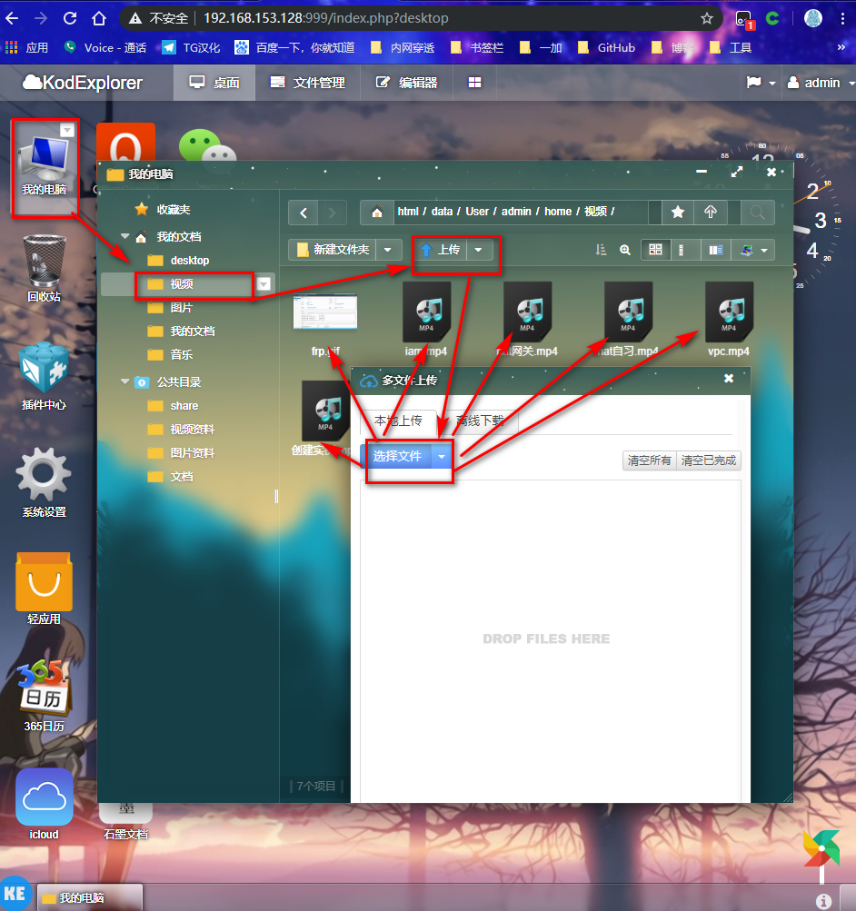
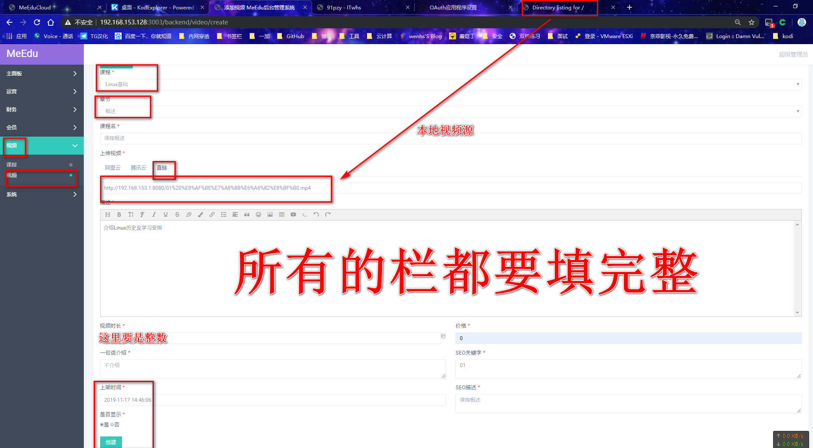
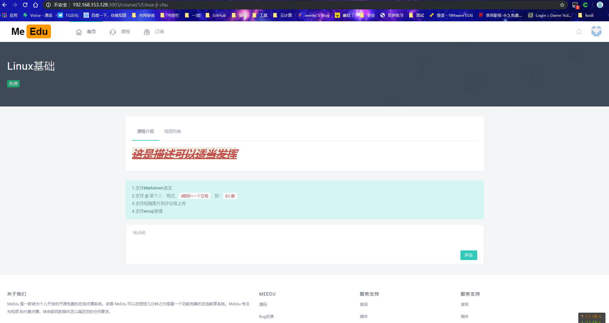

<!--more-->


## 环境介绍:

虚拟机安装的最小化Centos7

由于校园网设备限制,这里网卡是NAT模式:192.168.153.128

### 参考链接

[程序开发者：小腾](https://github.com/Qsnh/meedu)

[一条命令安装MeEdu（Docker方式），由 MeEdu 社区小伙伴提供](https://github.com/Baiyuetribe/meedu)

[MeEdu 作者录制的简单安装视频教程](https://www.bilibili.com/video/av36024146/)[使用Docker简单快速的搭建MeEdu（适合小白）](https://www.bilibili.com/video/av44963351/)

[使用Docker简单快速的搭建MeEdu（适合小白）](https://www.bilibili.com/video/av44963351/)

[MeEdu使用阿里云视频加密服务保障视频安全性(手把手教程)](https://www.bilibili.com/video/av45755754/)

## 下面开始图文教程

最小化安装完虚拟机Centos7后执行

```shell
[root@MeEdu ~]# bash <(curl -L -s https://raw.githubusercontent.com/Baiyuetribe/meedu/master/meedu.sh)

选择1,进行安装,如果网络问题,下载卡顿,没网速,可以CTRL+c终止,重新运行该脚本安装,主要是docker的镜像下载问题导致
```


安装完成,如下所示


### 登录管理

说明:默认支持手机号注册,qq登录,github登录,安装商城免费插件,还能微信登录和微博登录,但是对于个人实践学习来说,只有GitHub授权登录是完全免费的,其他多多少少会花一点,而且各种实名等等,所以这里只介绍github登录


> 登录后台-系统-全站配置-社交登录-github登录-开启

下面介绍怎么获取接入github登录的id:

> github登录，实质就是 OAuth 授权。用户想要登录 A 网站，A 网站让用户提供第三方网站的数据，证明自己的身份。获取第三方网站的身份数据，就需要 OAuth 授权。

举例来说，A 网站允许 GitHub 登录，背后就是下面的流程。

1. A 网站让用户跳转到 GitHub。
2. GitHub 要求用户登录，然后询问"A 网站要求获得 xx 权限，你是否同意？"
3. 用户同意，GitHub 就会重定向回 A 网站，同时发回一个授权码。
4. A 网站使用授权码，向 GitHub 请求令牌。
5. GitHub 返回令牌.
6. A 网站使用令牌，向 GitHub 请求用户数据。


一个应用要求 OAuth 授权，必须先到对方网站登记，让对方知道是谁在请求。

所以，你要先去 GitHub 登记一下。当然，我已经登记过了，你使用我的登记信息也可以，但为了完整走一遍流程，还是建议大家自己登记。这是免费的。

访问这个[网址](https://github.com/settings/applications/new)，填写登记表。


提交表单以后，GitHub 应该会返回客户端 ID（client ID）和客户端密钥（client secret），这就是应用的身份识别码。


再修改网站后台的2处id


网站主页测试登录


### 获取视频链接

根据脚本的部署,还有一个可道云的容器


上传视频



获得视频链接


这个是本地做法,还支持添加阿里云和腾讯云视频源

### 添加视频

下面是几张图,一步一步来


创建课程


添加章节


添加视频



测试结果




> 小结:
>
> 由图可知,MeEdu点播系统只支持添加视频链接的方式添加视频,所有给了一些便利,比如前端用MeEdu供客户浏览,后端是web集群或者其他推流服务集群,推流集群做一下负载均衡,MeEdu做一下高可用,还要注意备份

