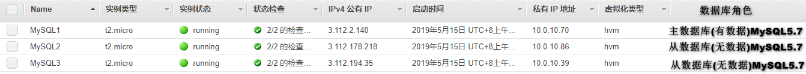

<!--more-->

### MySQL主从复制虽好，能完美解决数据库单点问题吗？

#### 一、单个数据库服务器的缺点

 - 数据库服务器存在单点问题；
 - 数据库服务器资源无法满足增长的读写请求；
 - 高峰时数据库连接数经常超过上限。

#### 二、如何解决单点问题

 - 增加额外的数据库服务器，组建数据库集群；
 - 同一集群中的数据库服务器需要具有相同的数据；
 - 集群中的任一服务器宕机后，其它服务器可以取代宕机服务器。

#### 三、MySQL主从复制架构

**1、主库将变更写入到主库的binlog中**

 - 一些MySQL版本并不会开启二进制日志，所以一定要检查是否开启；
 - 如果刚开始没有开启，后面再进行开启的话，需要重启数据库才能生效，而且数据库的重启往往会对业务造成很大的影响；
 - 尽管二进制日志对性能有稍许的影响，所以还是建议大家无论是否使用复制功能，都要开启MySQL二进制日志，因为增量备份也需要二进制日志。

**2、从库的IO线程在指定位置读取主库binlog内容存储到本地的中继日志（Relay Log）中**

要完成二进制日志的传输过程，MySQL会在从服务器上启动一个工作线程，称为IO线程，这个IO线程会跟主数据库建立一个普通的客户端连接，然后在主服务器上启动一个特殊的二进制转储线程称为binlogdown线程。

从库上的IO线程通过这个二进制转储线程来读取主库上的二进制事件，如果该事件追赶上主库，则会进入sleep状态，直到主库发起信号通知有新事件产生时，才会被唤醒，relay log的格式和binlog格式是完全相同的，

可以使用mysqlbinlog来读取relay log中的内容。

**3、从库的SQL线程读取Relay Log日志中的内容，并在从库中重放**

SQL线程所执行的事件，我们可以通过配置选项来决定是否要写入到从服务器的二进制日志中。

目前MySQL支持两种复制类型：

 - 基于二进制日志点的复制
 - 基于GTID的复制（MySQL>=5.7推荐使用）

#### 四. 主从复制的一些缺点

虽然主从复制增加了一个数据库副本，但从数据库和主数据库的数据最终会是一致的。之所以说是最终一致，因为MySQL复制是异步的，正常情况下主从复制数据之间会有一个微小的延迟。

通过这个数据库副本看似解决了数据库单点问题，但并不完美：因为这种架构下，如果主服务器宕机，需要手动切换从服务器，业务中断不能忍受，不能满足应用高可用的要求。

## 1.主从简介

在现代企业中，数据显得尤为重要，而存储数据的数据库选择又五花八门，但无论是何种数据库，均存在着一种隐患。

想几个问题：

 - 用一台数据库存放数据，若此数据库服务器宕机了导致数据丢失怎么办？
 - 业务量大了，数据多了，访问的人多了，一台数据库无法保证服务质量了怎么办？

### 1.1 主从作用

 - 实时灾备，用于故障切换
 - 读写分离，提供查询服务
 - 备份，避免影响业务(这里说的备份是备份sql服务器,而不是备份数据)

### 1.2 主从形式


 - 一主一从
 - 主主复制
 - 一主多从---扩展系统读取的性能，因为读是在从库读取的
 - 多主一从---5.7开始支持
 - 联级复制

## 2. 主从复制原理


**主从复制步骤：**

 - 主库将所有的写操作记录到binlog日志中并生成一个log dump线程，将binlog日志传给从库的I/O线程
 - 从库生成两个线程，一个I/O线程，一个SQL线程
	 - I/O线程去请求主库的binlog，并将得到的binlog日志写到relay log（中继日志） 文件中
	 - SQL线程，会读取relay log文件中的日志，并解析成具体操作，来实现主从的操作一致，达到最终数据一致的目的

## 3. 主从复制配置

**主从复制配置步骤：**

1. 确保从数据库与主数据库里的数据一样
2. 在主数据库里创建一个同步账号授权给从数据库使用
3. 配置主数据库（修改配置文件）
4. 配置从数据库（修改配置文件）

**需求：**
搭建两台`MySQL`服务器，一台作为主服务器，一台作为从服务器，主服务器进行写操作，从服务器进行读操作

**环境说明：**Red Hat Enterprise Linux 8.0 (Ootpa)



### 3.1 mysql安装

```
[root@ip-10-0-10-70 ~]# dnf -y install wget vim
[root@ip-10-0-10-70 ~]# groupadd -r mysql
[root@ip-10-0-10-70 ~]# useradd -M -s /sbin/nologin -g mysql mysql
[root@ip-10-0-10-70 ~]# mkdir /opt/data
[root@ip-10-0-10-70 ~]# chown -R mysql.mysql /opt/data/
[root@ip-10-0-10-70 ~]# ll /opt/
total 0
drwxr-xr-x. 2 mysql mysql 6 May 15 04:37 data
[root@ip-10-0-10-70 ~]# wget https://downloads.mysql.com/archives/get/file/mysql-5.7.25-linux-glibc2.12-x86_64.tar.gz
--2019-05-15 04:32:36--  https://downloads.mysql.com/archives/get/file/mysql-5.7.25-linux-glibc2.12-x86_64.tar.gz
Resolving downloads.mysql.com (downloads.mysql.com)... 137.254.60.14
Connecting to downloads.mysql.com (downloads.mysql.com)|137.254.60.14|:443... connected.
HTTP request sent, awaiting response... 302 Found
Location: https://cdn.mysql.com/archives/mysql-5.7/mysql-5.7.25-linux-glibc2.12-x86_64.tar.gz [following]
--2019-05-15 04:32:37--  https://cdn.mysql.com/archives/mysql-5.7/mysql-5.7.25-linux-glibc2.12-x86_64.tar.gz
Resolving cdn.mysql.com (cdn.mysql.com)... 23.35.197.183
Connecting to cdn.mysql.com (cdn.mysql.com)|23.35.197.183|:443... connected.
HTTP request sent, awaiting response... 200 OK
......
成功后615m大小
发现下载速度太慢,决定共享这个二进制的源码包,既然在同一可用区,那么内网互通,就用了nfs,配置简单,快捷
[root@ip-10-0-10-70 ~]# dnf -y install nfs* rpcbind*   //三台都执行这个命令
[root@ip-10-0-10-70 ~]# mkdir /nfs
[root@ip-10-0-10-70 ~]# vim /etc/exports
/nfs *(rw)
[root@ip-10-0-10-70 ~]# systemctl restart rpcbind nfs-server
[root@ip-10-0-10-70 ~]# showmount -e 10.0.10.70
Export list for 10.0.10.70:
/nfs *
[root@ip-10-0-10-70 ~]# mv mysql-5.7.25-linux-glibc2.12-x86_64.tar.gz /nfs/
[root@ip-10-0-10-70 ~]# ls -lh /nfs/
total 615M
-rw-r--r--. 1 root root 615M Dec 21 10:24 mysql-5.7.25-linux-glibc2.12-x86_64.tar.gz
从数据库1:
[root@ip-10-0-10-86 ~]# mkdir /nfs1
[root@ip-10-0-10-86 ~]# systemctl restart rpcbind
[root@ip-10-0-10-86 ~]# mount -t nfs 10.0.10.70:/nfs /nfs1
[root@ip-10-0-10-86 ~]# df -Th
Filesystem      Type      Size  Used Avail Use% Mounted on
devtmpfs        devtmpfs  391M     0  391M   0% /dev
tmpfs           tmpfs     410M     0  410M   0% /dev/shm
tmpfs           tmpfs     410M   11M  400M   3% /run
tmpfs           tmpfs     410M     0  410M   0% /sys/fs/cgroup
/dev/xvda2      xfs        10G  1.2G  8.9G  12% /
tmpfs           tmpfs      82M     0   82M   0% /run/user/0
10.0.10.70:/nfs nfs4       10G  1.8G  8.3G  18% /nfs1
[root@ip-10-0-10-86 ~]# ls -lh /nfs1/
total 615M
-rw-r--r--. 1 root root 615M Dec 21 10:24 mysql-5.7.25-linux-glibc2.12-x86_64.tar.gz
从数据库2:
[root@ip-10-0-10-39 ~]# mkdir /nfs2
[root@ip-10-0-10-39 ~]# systemctl restart rpcbind
[root@ip-10-0-10-39 ~]# mount -t nfs 10.0.10.70:/nfs /nfs2
[root@ip-10-0-10-39 ~]# df -Th
Filesystem      Type      Size  Used Avail Use% Mounted on
devtmpfs        devtmpfs  391M     0  391M   0% /dev
tmpfs           tmpfs     410M     0  410M   0% /dev/shm
tmpfs           tmpfs     410M   11M  400M   3% /run
tmpfs           tmpfs     410M     0  410M   0% /sys/fs/cgroup
/dev/xvda2      xfs        10G  1.2G  8.9G  12% /
tmpfs           tmpfs      82M     0   82M   0% /run/user/0
10.0.10.70:/nfs nfs4       10G  1.8G  8.3G  18% /nfs2
[root@ip-10-0-10-39 ~]# ls -lh /nfs2/
total 615M
-rw-r--r--. 1 root root 615M Dec 21 10:24 mysql-5.7.25-linux-glibc2.12-x86_64.tar.gz

安装开始:
[root@ip-10-0-10-70 nfs]# tar xf mysql-5.7.25-linux-glibc2.12-x86_64.tar.gz -C /usr/local/
[root@ip-10-0-10-70 nfs]# cd /usr/local/
[root@ip-10-0-10-70 local]# ln -sv mysql-5.7.25-linux-glibc2.12-x86_64/ mysql
'mysql' -> 'mysql-5.7.25-linux-glibc2.12-x86_64/'
[root@ip-10-0-10-70 local]# chown -R mysql.mysql /usr/local/mysql
[root@ip-10-0-10-70 local]# ll /usr/local/mysql -d
lrwxrwxrwx. 1 mysql mysql 36 May 15 05:55 /usr/local/mysql -> mysql-5.7.25-linux-glibc2.12-x86_64/
[root@ip-10-0-10-70 local]# ls /usr/local/mysql
bin  COPYING  docs  include  lib  man  README  share  support-files
[root@ip-10-0-10-70 local]# echo 'export PATH=/usr/local/mysql/bin:$PATH' > /etc/profile.d/mysql.sh
[root@ip-10-0-10-70 local]# source /etc/profile.d/mysql.sh
[root@ip-10-0-10-70 local]# echo $PATH
/usr/local/mysql/bin:/usr/local/sbin:/usr/local/bin:/usr/sbin:/usr/bin:/root/bin
初始化数据库
[root@ip-10-0-10-70 ~]# /usr/local/mysql/bin/mysqld --initialize --user=mysql --datadir=/opt/data/
/usr/local/mysql/bin/mysqld: error while loading shared libraries: libaio.so.1: cannot open shared object file: No such file or directory
解决方法:
[root@ip-10-0-10-70 ~]# dnf -y install libaio*    //另外2个也要安装
[root@ip-10-0-10-70 ~]# /usr/local/mysql/bin/mysqld --initialize --user=mysql --datadir=/opt/data/
2019-05-15T06:05:26.411877Z 0 [Warning] TIMESTAMP with implicit DEFAULT value is deprecated. Please use --explicit_defaults_for_timestamp server option (see documentation for more details).
2019-05-15T06:05:27.226596Z 0 [Warning] InnoDB: New log files created, LSN=45790
2019-05-15T06:05:27.469528Z 0 [Warning] InnoDB: Creating foreign key constraint system tables.
2019-05-15T06:05:27.532234Z 0 [Warning] No existing UUID has been found, so we assume that this is the first time that this server has been started. Generating a new UUID: 6faf638d-76d7-11e9-a710-061fe46abf16.
2019-05-15T06:05:27.533755Z 0 [Warning] Gtid table is not ready to be used. Table 'mysql.gtid_executed' cannot be opened.
2019-05-15T06:05:27.534192Z 1 [Note] A temporary password is generated for root@localhost: dgjdbs6vi.6T
[root@ip-10-0-10-70 ~]# echo 'dgjdbs6vi.6T' >pass
[root@ip-10-0-10-70 ~]# cat pass 
dgjdbs6vi.6T    //初始密码,要记住,一会要用
生成配置文件
[root@ip-10-0-10-70 ~]# cat >/etc/my.cnf <<EOF
> [mysqld]
> basedir = /usr/local/mysql
> datadir = /opt/data
> socket = /tmp/mysql.sock
> port = 3306
> pid-file = /opt/data/mysql.pid
> user = mysql
> skip-name-resolve
> EOF
配置服务启动脚本
[root@ip-10-0-10-70 ~]# cp -a /usr/local/mysql/support-files/mysql.server /etc/init.d/mysqld
[root@ip-10-0-10-70 ~]# sed -ri 's#^(basedir=).*#\1/usr/local/mysql#g' /etc/init.d/mysqld
[root@ip-10-0-10-70 ~]# sed -ri 's#^(datadir=).*#\1/opt/data#g' /etc/init.d/mysqld
启动mysql
[root@ip-10-0-10-70 ~]# /etc/init.d/mysqld start
Starting MySQL.Logging to '/opt/data/ip-10-0-10-70.ap-northeast-1.compute.internal.err'.
 SUCCESS! 
[root@ip-10-0-10-70 ~]# ps -ef|grep mysql
root     15530     1  0 06:13 pts/1    00:00:00 /bin/sh /usr/local/mysql/bin/mysqld_safe --datadir=/opt/data --pid-file=/opt/data/mysql.pid
mysql    15718 15530  2 06:13 pts/1    00:00:00 /usr/local/mysql/bin/mysqld --basedir=/usr/local/mysql --datadir=/opt/data --plugin-dir=/usr/local/mysql/lib/plugin --user=mysql --log-error=ip-10-0-10-70.ap-northeast-1.compute.internal.err --pid-file=/opt/data/mysql.pid --socket=/tmp/mysql.sock --port=3306
root     15748 15355  0 06:13 pts/1    00:00:00 grep --color=auto mysql
[root@ip-10-0-10-70 ~]# ss -antl
State     Recv-Q     Send-Q           Local Address:Port            Peer Address:Port     
LISTEN    0          128                    0.0.0.0:22                   0.0.0.0:*        
LISTEN    0          64                     0.0.0.0:39517                0.0.0.0:*        
LISTEN    0          64                     0.0.0.0:2049                 0.0.0.0:*        
LISTEN    0          128                    0.0.0.0:48229                0.0.0.0:*        
LISTEN    0          128                    0.0.0.0:111                  0.0.0.0:*        
LISTEN    0          128                    0.0.0.0:20048                0.0.0.0:*        
LISTEN    0          128                       [::]:22                      [::]:*        
LISTEN    0          64                        [::]:2049                    [::]:*        
LISTEN    0          128                       [::]:48385                   [::]:*        
LISTEN    0          80                           *:3306                       *:*        
LISTEN    0          64                        [::]:40523                   [::]:*        
LISTEN    0          128                       [::]:111                     [::]:*        
LISTEN    0          128                       [::]:20048                   [::]:*
修改密码
使用临时密码登录
[root@ip-10-0-10-70 ~]# /usr/local/mysql/bin/mysql -uroot -p
/usr/local/mysql/bin/mysql: error while loading shared libraries: libncurses.so.5: cannot open shared object file: No such file or directory
解决方法
[root@ip-10-0-10-70 ~]# dnf -y install libncurses*
[root@ip-10-0-10-70 ~]# /usr/local/mysql/bin/mysql -uroot -p
Enter password: 
Welcome to the MySQL monitor.  Commands end with ; or \g.
Your MySQL connection id is 2
Server version: 5.7.25

Copyright (c) 2000, 2019, Oracle and/or its affiliates. All rights reserved.

Oracle is a registered trademark of Oracle Corporation and/or its
affiliates. Other names may be trademarks of their respective
owners.

Type 'help;' or '\h' for help. Type '\c' to clear the current input statement.

mysql> set password = password('jbgsn123!');
Query OK, 0 rows affected, 1 warning (0.01 sec)

mysql> exit
Bye
[root@ip-10-0-10-70 ~]# cp /etc/my.cnf /nfs/
[root@ip-10-0-10-70 ~]# cp /etc/init.d/mysqld /nfs/
[root@ip-10-0-10-70 ~]# ll /nfs/
total 629768
-rw-r--r--. 1 root root        155 May 15 06:20 my.cnf
-rw-r--r--. 1 7161 31415 644862820 Dec 21 11:23 mysql-5.7.25-linux-glibc2.12-x86_64.tar.gz
-rwxr-xr-x. 1 root root      10601 May 15 06:20 mysqld
从服务器方法一样,特此写一个
[root@ip-10-0-10-86 nfs1]# tar xf mysql-5.7.25-linux-glibc2.12-x86_64.tar -C /usr/local/
[root@ip-10-0-10-86 nfs1]# cd /usr/local/
[root@ip-10-0-10-86 local]# ln -sv mysql-5.7.25-linux-glibc2.12-x86_64/ mysql
'mysql' -> 'mysql-5.7.25-linux-glibc2.12-x86_64/'
[root@ip-10-0-10-86 local]# chown -R mysql.mysql /usr/local/mysql
[root@ip-10-0-10-86 local]# echo 'export PATH=/usr/local/mysql/bin:$PATH' > /etc/profile.d/mysql.sh
[root@ip-10-0-10-86 local]# source /etc/profile.d/mysql.sh
[root@ip-10-0-10-86 local]# /usr/local/mysql/bin/mysqld --initialize --user=mysql --datadir=/opt/data/
2019-05-15T06:25:33.161453Z 0 [Warning] TIMESTAMP with implicit DEFAULT value is deprecated. Please use --explicit_defaults_for_timestamp server option (see documentation for more details).
2019-05-15T06:25:33.981113Z 0 [Warning] InnoDB: New log files created, LSN=45790
2019-05-15T06:25:34.223408Z 0 [Warning] InnoDB: Creating foreign key constraint system tables.
2019-05-15T06:25:34.284942Z 0 [Warning] No existing UUID has been found, so we assume that this is the first time that this server has been started. Generating a new UUID: 3ef73d2c-76da-11e9-bea1-06dc2c9b3f12.
2019-05-15T06:25:34.286543Z 0 [Warning] Gtid table is not ready to be used. Table 'mysql.gtid_executed' cannot be opened.
2019-05-15T06:25:34.286983Z 1 [Note] A temporary password is generated for root@localhost: q%_H12.OAvta
[root@ip-10-0-10-86 local]# echo 'q%_H12.OAvta'>pass
[root@ip-10-0-10-86 local]# cp /nfs1/my.cnf /etc/
[root@ip-10-0-10-86 local]# cp /nfs1/mysqld /etc/init.d/
[root@ip-10-0-10-86 local]# /etc/init.d/mysqld start
Starting MySQL.Logging to '/opt/data/ip-10-0-10-86.ap-northeast-1.compute.internal.err'.
 SUCCESS! 
[root@ip-10-0-10-86 local]# /usr/local/mysql/bin/mysql -uroot -p
Enter password: 
Welcome to the MySQL monitor.  Commands end with ; or \g.
Your MySQL connection id is 2
Server version: 5.7.25

Copyright (c) 2000, 2019, Oracle and/or its affiliates. All rights reserved.

Oracle is a registered trademark of Oracle Corporation and/or its
affiliates. Other names may be trademarks of their respective
owners.

Type 'help;' or '\h' for help. Type '\c' to clear the current input statement.

mysql> set password = password('jbgsn123!');
Query OK, 0 rows affected, 1 warning (0.00 sec)

mysql> quit
Bye
三个服务器上MySQL密码都是jbgsn123!,配置一样
```

### 3.2 mysql主从配置(2个新的mysql服务器)

#### 3.2.1 在主数据库里创建一个同步账号授权给从数据库使用

```
mysql> create user 'whs'@'10.0.10.86' identified by 'itwhs1';
Query OK, 0 rows affected (0.00 sec)

mysql> grant replication slave on *.* to 'whs'@'10.0.10.86';
Query OK, 0 rows affected (0.00 sec)

mysql> flush privileges;
Query OK, 0 rows affected (0.01 sec)
```

#### 3.2.2 配置主数据库

```text
[root@ip-10-0-10-70 ~]# vim /etc/my.cnf 
在[mysqld]这段的后面加上如下内容
[mysqld]
basedir = /usr/local/mysql
datadir = /opt/data
socket = /tmp/mysql.sock
port = 3306
pid-file = /opt/data/mysql.pid
user = mysql
skip-name-resolve
log-bin = mysql-bin    //启用binlog日志
server-id = 1    //数据库服务器唯一标识符，主库的server-id值必须比从库的大
log-error = /var/log/mysqld.log   //记录错误日志

重启mysql服务
[root@ip-10-0-10-70 ~]# /etc/init.d/mysqld restart
Shutting down MySQL.. SUCCESS! 
Starting MySQL. SUCCESS!


查看主库的状态
[root@ip-10-0-10-70 ~]# /usr/local/mysql/bin/mysql -uroot -pjbgsn123! -e 'show master status;'
mysql: [Warning] Using a password on the command line interface can be insecure.
+------------------+----------+--------------+------------------+-------------------+
| File             | Position | Binlog_Do_DB | Binlog_Ignore_DB | Executed_Gtid_Set |
+------------------+----------+--------------+------------------+-------------------+
| mysql-bin.000001 |      154 |              |                  |                   |
+------------------+----------+--------------+------------------+-------------------+
```

#### 3.2.3 配置从数据库

```
[root@ip-10-0-10-86 ~]# vim /etc/my.cnf
添加如下内容
[mysqld]
basedir = /usr/local/mysql
datadir = /opt/data
socket = /tmp/mysql.sock
port = 3306
pid-file = /opt/data/mysql.pid
user = mysql
skip-name-resolve
server-id=2    //设置从库的唯一标识符，从库的server-id值必须小于主库的该值
relay-log=mysql-relay-bin    //启用中继日志relay-log     
symbolic-links=0
log-error=/var/log/mysqld.log


重启从库的mysql服务
[root@ip-10-0-10-86 ~]# /etc/init.d/mysqld restart
Shutting down MySQL.. SUCCESS! 
Starting MySQL. SUCCESS!


配置并启动主从复制
[root@ip-10-0-10-86 ~]# /usr/local/mysql/bin/mysql -uroot -pjbgsn123!
mysql: [Warning] Using a password on the command line interface can be insecure.
Welcome to the MySQL monitor.  Commands end with ; or \g.
Your MySQL connection id is 2
Server version: 5.7.25 MySQL Community Server (GPL)

Copyright (c) 2000, 2019, Oracle and/or its affiliates. All rights reserved.

Oracle is a registered trademark of Oracle Corporation and/or its
affiliates. Other names may be trademarks of their respective
owners.

Type 'help;' or '\h' for help. Type '\c' to clear the current input statement.

mysql> change master to
    -> master_host='10.0.10.70',
    -> master_user='whs',
    -> master_password='itwhs1',
    -> master_log_file='mysql-bin.000001',
    -> master_log_pos=154;
Query OK, 0 rows affected, 2 warnings (0.02 sec)

mysql> start slave;
Query OK, 0 rows affected (0.01 sec)

mysql> show slave status \G
*************************** 1. row ***************************
               Slave_IO_State: Waiting for master to send event
                  Master_Host: 10.0.10.70
                  Master_User: whs
                  Master_Port: 3306
                Connect_Retry: 60
              Master_Log_File: mysql-bin.000001
          Read_Master_Log_Pos: 154
               Relay_Log_File: mysql-relay-bin.000002
                Relay_Log_Pos: 320
        Relay_Master_Log_File: mysql-bin.000001
             Slave_IO_Running: Yes      //此处必须为Yes
            Slave_SQL_Running: Yes      //此处必须为Yes
              Replicate_Do_DB:
          Replicate_Ignore_DB:  
```

#### 3.2.4 测试验证

**在主服务器创建aiwhs库和it表并插入数据：**

```text
mysql> create database aiwhs;
Query OK, 1 row affected (0.01 sec)

mysql> use aiwhs;
Database changed
mysql> create table it (id mediumint not null auto_increment,name char(30) not null,age tinyint,primary key (id));
Query OK, 0 rows affected (0.02 sec)

mysql> insert into it(name,age) values('zhangshan',26),('zhangshan',20),('lisi',null),('chenshuo',10),('wangwu',3);
Query OK, 5 rows affected (0.01 sec)
Records: 5  Duplicates: 0  Warnings: 0

mysql> select * from it;
+----+-----------+------+
| id | name      | age  |
+----+-----------+------+
|  1 | zhangshan |   26 |
|  2 | zhangshan |   20 |
|  3 | lisi      | NULL |
|  4 | chenshuo  |   10 |
|  5 | wangwu    |    3 |
+----+-----------+------+
5 rows in set (0.00 sec)
```

**在从数据库中查看数据是否同步：**

```
[root@ip-10-0-10-86 ~]# /usr/local/mysql/bin/mysql -uroot -pjbgsn123! -e 'select * from aiwhs.it;'
mysql: [Warning] Using a password on the command line interface can be insecure.
+----+-----------+------+
| id | name      | age  |
+----+-----------+------+
|  1 | zhangshan |   26 |
|  2 | zhangshan |   20 |
|  3 | lisi      | NULL |
|  4 | chenshuo  |   10 |
|  5 | wangwu    |    3 |
+----+-----------+------+
```


### 3.3 mysql主从配置

#### 3.3.1 确保从数据库与主数据库里的数据一样

为确保从数据库与主数据库里的数据一样，先全备主数据库并还原到从数据库中

```
先查看主库有哪些库
[root@ip-10-0-10-70 ~]# mysql -uroot -pjbgsn123! -e 'show databases;'
mysql: [Warning] Using a password on the command line interface can be insecure.
+--------------------+
| Database           |
+--------------------+
| information_schema |
| aiwhs              |
| mysql              |
| performance_schema |
| sys                |
+--------------------+

再查看从库有哪些库
[root@ip-10-0-10-39 ~]# mysql -uroot -pjbgsn123! -e 'show databases;'
mysql: [Warning] Using a password on the command line interface can be insecure.
+--------------------+
| Database           |
+--------------------+
| information_schema |
| mysql              |
| performance_schema |
| sys                |
+--------------------+

全备主库
全备主库时需要另开一个终端，给数据库加上读锁，避免在备份期间有其他人在写入导致数据不一致
mysql> flush tables with read lock;
Query OK, 0 rows affected (0.00 sec)
此锁表的终端必须在备份完成以后才能退出

备份主库并将备份文件传送到从库
[root@ip-10-0-10-70 ~]# mysqldump -uroot -pjbgsn123! --all-databases >/nfs/all-201905151548.sql
mysqldump: [Warning] Using a password on the command line interface can be insecure.
[root@ip-10-0-10-70 ~]# ls /nfs/
all-201905151548.sql  my.cnf  mysql-5.7.25-linux-glibc2.12-x86_64.tar.gz  mysqld

解除主库的锁表状态，直接退出交互式界面即可
mysql> quit
Bye

在从库上恢复主库的备份并查看从库有哪些库，确保与主库一致
[root@ip-10-0-10-39 ~]# cd /nfs2/
[root@ip-10-0-10-39 nfs2]# ll
total 630544
-rw-r--r--. 1 root root     792967 May 15 07:50 all-201905151548.sql
-rw-r--r--. 1 root root        155 May 15 06:20 my.cnf
-rw-r--r--. 1 7161 31415 644862820 Dec 21 11:23 mysql-5.7.25-linux-glibc2.12-x86_64.tar.gz
-rwxr-xr-x. 1 root root      10601 May 15 06:20 mysqld
[root@ip-10-0-10-39 nfs2]# mysql -uroot -pjbgsn123! < all-201905151548.sql 
mysql: [Warning] Using a password on the command line interface can be insecure.
[root@ip-10-0-10-39 nfs2]# mysql -uroot -pjbgsn123! -e 'show databases;'
mysql: [Warning] Using a password on the command line interface can be insecure.
+--------------------+
| Database           |
+--------------------+
| information_schema |
| aiwhs              |
| mysql              |
| performance_schema |
| sys                |
+--------------------+
```

#### 3.3.2 在主数据库里创建一个同步账号授权给从数据库使用

```
mysql> create user 'whs'@'10.0.10.39' identified by 'itwhs2';
Query OK, 0 rows affected (0.00 sec)

mysql> grant replication slave on *.* to 'whs'@'10.0.10.39';
Query OK, 0 rows affected (0.00 sec)

mysql> flush privileges;
Query OK, 0 rows affected (0.00 sec)
```

#### 3.3.3 配置主数据库

```
[root@ip-10-0-10-70 ~]# /etc/init.d/mysqld restart
Shutting down MySQL............ SUCCESS! 
Starting MySQL. SUCCESS!

查看主库的状态
mysql> show master status;
+------------------+----------+--------------+------------------+-------------------+
| File             | Position | Binlog_Do_DB | Binlog_Ignore_DB | Executed_Gtid_Set |
+------------------+----------+--------------+------------------+-------------------+
| mysql-bin.000003 |      154 |              |                  |                   |
+------------------+----------+--------------+------------------+-------------------+
1 row in set (0.00 sec)  //发现,重启mysql后log-bin会变,position也会变,之前配的从服务器大约10秒后会同步状态

上一个从服务器同步状态
mysql> show slave status \G
*************************** 1. row ***************************
               Slave_IO_State: Waiting for master to send event
                  Master_Host: 10.0.10.70
                  Master_User: whs
                  Master_Port: 3306
                Connect_Retry: 60
              Master_Log_File: mysql-bin.000003
          Read_Master_Log_Pos: 154
               Relay_Log_File: mysql-relay-bin.000006
                Relay_Log_Pos: 367
        Relay_Master_Log_File: mysql-bin.000003
             Slave_IO_Running: Yes
            Slave_SQL_Running: Yes
```

#### 3.3.4 配置从数据库

```
[root@ip-10-0-10-39 ~]# vim /etc/my.cnf
添加如下内容
[mysqld]
basedir = /usr/local/mysql
datadir = /opt/data
socket = /tmp/mysql.sock
port = 3306
pid-file = /opt/data/mysql.pid
user = mysql
skip-name-resolve
server-id = 3   //设置从库的唯一标识符，从库的server-id值必须小于主库的该值
relay-log = mysql-relay-bin    //启用中继日志relay-log     
symbolic-links = 0
log-error = /var/log/mysqld.log

重启从库的mysql服务
[root@ip-10-0-10-39 ~]# /etc/init.d/mysqld restart
Shutting down MySQL.. SUCCESS! 
Starting MySQL. SUCCESS!

配置并启动主从复制
mysql> change master to
    -> master_host='10.0.10.70',
    -> master_user='whs',
    -> master_password='itwhs2',
    -> master_log_file='mysql-bin.000003',
    -> master_log_pos=154;
Query OK, 0 rows affected, 2 warnings (0.02 sec)

mysql> start slave;
Query OK, 0 rows affected (0.00 sec)

mysql> show slave status \G
*************************** 1. row ***************************
               Slave_IO_State: Waiting for master to send event
                  Master_Host: 10.0.10.70
                  Master_User: whs
                  Master_Port: 3306
                Connect_Retry: 60
              Master_Log_File: mysql-bin.000003
          Read_Master_Log_Pos: 154
               Relay_Log_File: mysql-relay-bin.000002
                Relay_Log_Pos: 320
        Relay_Master_Log_File: mysql-bin.000003
             Slave_IO_Running: Yes
            Slave_SQL_Running: Yes  
```

#### 3.3.5 测试验证

**在主服务器的aiwhs库的it表中插入数据：**

```
mysql> insert into it(name,age) values('dbf',26),('nfgb',56),('gsd',54),('sfs',33); 
Query OK, 4 rows affected (0.01 sec)
Records: 4  Duplicates: 0  Warnings: 0

mysql> select * from it;
+----+-----------+------+
| id | name      | age  |
+----+-----------+------+
|  1 | zhangshan |   26 |
|  2 | zhangshan |   20 |
|  3 | lisi      | NULL |
|  4 | chenshuo  |   10 |
|  5 | wangwu    |    3 |
|  6 | dbf       |   26 |
|  7 | nfgb      |   56 |
|  8 | gsd       |   54 |
|  9 | sfs       |   33 |
+----+-----------+------+
9 rows in set (0.00 sec)
```

**在从数据库中查看数据是否同步：**

```
[root@ip-10-0-10-39 ~]# mysql -uroot -pjbgsn123! -e 'select * from aiwhs.it;'
mysql: [Warning] Using a password on the command line interface can be insecure.
+----+-----------+------+
| id | name      | age  |
+----+-----------+------+
|  1 | zhangshan |   26 |
|  2 | zhangshan |   20 |
|  3 | lisi      | NULL |
|  4 | chenshuo  |   10 |
|  5 | wangwu    |    3 |
|  6 | dbf       |   26 |
|  7 | nfgb      |   56 |
|  8 | gsd       |   54 |
|  9 | sfs       |   33 |
+----+-----------+------+
```