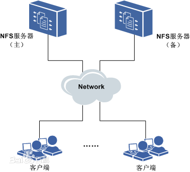
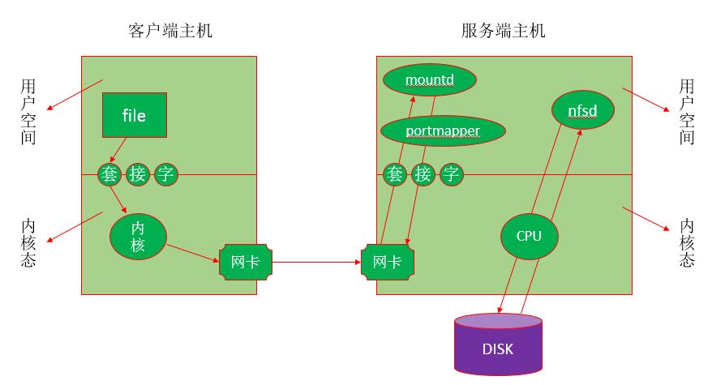

<!--more-->

# 1. nfs简介

### 1.1 nfs特点

 - NFS（Network File
   System）即网络文件系统，是FreeBSD支持的文件系统中的一种，它允许网络中的计算机之间通过TCP/IP网络共享资源
 - 在NFS的应用中，本地NFS的客户端应用可以透明地读写位于远端NFS服务器上的文件，就像访问本地文件一样
 - nfs适用于Linux与Unix之间实现文件共享，不能实现Linux与Windows间的文件共享功能
 - nfs是运行在应用层的协议，其监听于2049/tcp和2049/udp套接字上 
 - nfs服务只能基于IP进行认证，这也是它的缺点之一

### 1.2 使用nfs的好处

 - 节省本地存储空间，将常用的数据存放在一台NFS服务器上且可以通过网络访问，那么本地终端将可以减少自身存储空间的使用
 - 用户不需要在网络中的每个机器上都建有Home目录，Home目录可以放在NFS服务器上且可以在网络上被访问使用
 - 一些存储设备如软驱、CDROM和Zip（一种高储存密度的磁盘驱动器与磁盘）等都可以在网络上被别的机器使用。这可以减少整个网络上可移动介质设备的数量

### 1.3 nfs的体系组成

nfs体系至少有两个主要部分：

 - 一台nfs服务器
 - 若干台客户机

nfs体系的架构图如下：



> 客户机通过TCP/IP网络远程访问存放在NFS服务器上的数据 在NFS服务器正式启用前，需要根据实际环境和需求，配置一些NFS参数

### 1.4 nfs的应用场景

nfs有很多实际应用场景，以下是一些常用的场景：

 - 多个机器共享一台CDROM或其他设备。这对于在多台机器中安装软件来说更加便宜与方便
 - 在大型网络中，配置一台中心NFS服务器用来放置所有用户的home目录可能会带来便利。这些目录能被输出到网络以便用户不管在哪台工作站上登录，总能得到相同的home目录
 - 不同客户端可在NFS上观看影视文件，节省本地空间
 - 在客户端完成的工作数据，可以备份保存到NFS服务器上用户自己的路径下

# 2.nfs工作机制

**nfs是基于rpc来实现网络文件系统共享的。所以我们先来说说rpc。**

### 2.1 RPC

RPC（Remote Procedure Call Protocol），远程过程调用协议，它是一种通过网络从远程计算机程序上请求服务，而不需要了解底层网络技术的协议。

RPC协议假定某些传输协议的存在，如TCP或UDP，为通信程序之间携带信息数据。在OSI网络通信模型中，RPC跨越了传输层和应用层。

RPC采用客户机/服务器模式。请求程序就是一个客户机，而服务提供程序就是一个服务器。


rpc工作机制如上图所示，下面来描述一下它：

 - 客户端程序发起一个RPC系统调用基于TCP协议发送给另一台主机（服务端）
 - 服务端监听在某个套接字上，当收到客户端的系统调用请求以后，将收到的请求和其所传递的参数通过本地的系统调用执行一遍，并将结果返回给本地的服务进程
 - 服务端的服务进程收到返回的执行结果后将其封装成响应报文，再通过rpc协议返回给客户端
 - 客户端调用进程接收答复信息，获得进程结果，然后调用执行继续进行

### 2.2 NIS

NIS(Network Information System)，网络信息系统，是对主机帐号等系统提供集中管理的网络服务。

用户登录任何一台NIS客户机都会从NIS服务器进行登录认证，可实现用户帐号的集中管理。

NIS协议是明文的，所以NIS一般不建议在公网中使用而通常在局域网中使用。

此章主要是讲NFS，所以NIS的配置这里就不详说了，有兴趣的朋友可以去网上搜索。

### 2.3 nfs工作机制

```
NFS服务器端运行着四个进程：
    nfsd
    mountd
    idmapd
    portmapper

idmapd  实现用户帐号的集中映射，把所有的帐号都映射为NFSNOBODY，但是在访问时却能以本地用户的身份去访问

mountd  用于验证客户端是否在允许访问此NFS文件系统的客户端列表中，在则允许访问（发放一个令牌，持令牌去找nfsd），否则拒绝访问
        mountd的服务端口是随机的，由rpc服务（portmapper）提供随机端口号

nfsd    nfs的守护进程，监听在2049/tcp和2049/udp端口上
        不负责文件存储（由NFS服务器本地内核负责调度存储），用于理解客户端发起的rpc请求，并将其转交给本地内核，而后存储在指定的文件系统上

portmapper  NFS服务器的rpc服务，其监听于111/TCP和111/UDP套接字上，用于管理远程过程调用（RPC）
```

下面通过一个例子来说明NFS的简单工作流程：

```
需求：查看file文件的信息，此file存储在远程NFS服务端主机上（挂载在本地目录/shared/nfs中）
```



 - 客户端发起查看file信息的指令（ls
   file）给内核，内核通过NFS模块得知此文件并不是本地文件系统中的文件，而是在远程NFS主机上的一个文件
 - 客户端主机的内核通过RPC协议把查看file信息的指令（系统调用）封装成rpc请求通过TCP的111端口发送给NFS服务端主机的portmapper
 - NFS服务端主机的portmapper（RPC服务进程）告诉客户端说NFS服务端的mountd服务在某某端口上，你去找它验证

> 因为mountd在提供服务时必须要向portmapper注册一个端口号，所以portmapper是知道其工作于哪个端口的

 - 客户端得知服务端的mountd进程端口号后，通过已知的服务端mountd端口号请求验证
 - mountd收到验证请求后验证发起请求的客户端是否在允许访问此NFS文件系统的客户端列表中，在则允许访问（发放一个令牌，持令牌去找nfsd），否则拒绝访问
 - 验证通过后客户端持mountd发放的令牌去找服务端的nfsd进程，请求查看某文件
 - 服务端的nfsd进程发起本地系统调用，向内核请求查看客户端要查看的文件的信息
 - 服务端的内核执行nfsd请求的系统调用，并将结果返回给nfsd服务
 - nfsd进程收到内核返回的结果后将其封装成rpc请求报文并通过tcp/ip协议返回给客户端

# 3.exports文件的格式

nfs的主配置文件是/etc/exports，在此文件中，可以定义NFS系统的输出目录（即共享目录）、访问权限和允许访问的主机等参数。该文件默认为空，没有配置输出任何共享目录，这是基于安全性的考虑，如此即使系统启动了NFS服务也不会输出任何共享资源。

exports文件中每一行提供了一个共享目录的设置，其命令格式为：
```
格式： 共享目录的路径 允许访问的NFS客户端（共享权限参数）
<输出目录> [客户端1(选项1,选项2,...)] [客户端2(选项1,选项2,...)]

请注意，NFS客户端地址与权限之间没有空格。
NFS输出保护需要用到kerberos加密（none，sys，krb5，krb5i，krb5p），格式sec=XXX
none：以匿名身份访问，如果要允许写操作，要映射到nfsnobody用户，同时布尔值开关要打开，setsebool nfsd_anon_write 1
sys：文件的访问是基于标准的文件访问，如果没有指定，默认就是sys， 信任任何发送过来用户名
krb5：客户端必须提供标识，客户端的表示也必须是krb5，基于域环境的认证
krb5i：在krb5的基础上做了加密的操作，对用户的密码做了加密，但是传输的数据没有加密
krb5p：所有的数据都加密
```
其中，除输出目录是必选参数外，其他参数均是可选项。另外，格式中的输出目录和客户端之间、客户端与客户端之间都使用空格分隔，但客户端与选项之间不能有空格。

客户端是指网络中可以访问这个NFS共享目录的计算机。客户端的指定非常灵活，可为单个主机的IP或域名，亦可为某个子网或域中的主机等。

**客户端常用的指定方式：**

| 客户端                            | 说明                            |
| --------------------------------- | ------------------------------- |
| 192.168.160.65                    | 指定IP地址的主机                |
| 192.168.160.0/24(或192.168.160.*) | 指定子网中的所有主机            |
| www.wenhs5479.com                 | 指定域名的主机                  |
| *.wenhs5479.com                   | 指定wenhs5479.com域中的所有主机 |
| *(或缺省)                         | 所有主机                        |
选项用来设置共享目录的访问权限、用户映射等。exports文件中的选项比较多，一般可分为三类：

 - 访问权限选项（用于控制共享目录的访问权限）
 - 用户映射选项
	 - [ ] 默认情况下，当客户端访问NFS服务器时，若远程访问的用户是root用户，则NFS服务器会将其映射成一个本地的匿名用户（该用户为nfsnobody），并将其所属的用户组也映射成匿名用户组（该用户组也为nfsnobody），如此有助于提高系统的安全性。
 - 其他选项

**访问权限选项：**

| 访问权限选项 | 说明               |
| ------------ | ------------------ |
| ro           | 设置输出目录只读   |
| rw           | 设置输出目录可读写 |

**用户映射选项：**

| 用户映射选项   | 说明                                                         |
| -------------- | ------------------------------------------------------------ |
| all_squash     | 将远程访问的所有普通用户及所属组都映射为匿名用户或用户组(nfsnobody) |
| no_all_squash  | 不将远程访问的所有普通用户及所属用户组都映射为匿名用户或用户组(默认设置) |
| root_squash    | 将root用户及所属用户组都映射为匿名用户或用户组(默认设置)     |
| no_root_squash | 不将root用户及所属用户组都映射为匿名用户或用户组             |
| anonuid=xxx    | 将远程访问的所有用户都映射为匿名用户，并指定该匿名用户为本地用户帐户(UID=xxx) |
| anongid=xxx    | 将远程访问的所有用户组都映射为匿名用户组，并指定该匿名用户组为本地用户组(GID=xxx) |

**常用的其他选项：**


| 其他选项         | 说明                                                         |
| ---------------- | ------------------------------------------------------------ |
| secure           | 限制客户端只能从小于1024的TCP/IP端口连接NFS服务器(默认设置)  |
| insecure         | 允许客户端从大于1024的TCP/IP端口连接NFS服务器                |
| sync             | 将数据同步写入内存缓冲区或磁盘中，效率较低，但可保证数据一致性 |
| async            | 将数据先保存在内存缓冲区中，必要时才写入磁盘                 |
| wdelay           | 检查是否有相关的写操作，如果有则这些写操作一起执行，可提高效率(默认设置) |
| no_wdelay        | 若有写操作则立即执行，应与sync配置使用                       |
| subtree_check    | 若输出目录是一个子目录，则NFS服务器将检查其父目录的权限(默认设置) |
| no_subtree_check | 即使输出目录是一个子目录，NFS服务亦不检查其父目录的权限，可提高效率 |
| nohide           | 若将一个目录挂载到另一个目录之上，则原来的目录通常就被隐藏起来或看起来像空的一样。要禁用这种行为，需启用hide选项 |

# 4. nfs管理

**nfs安装：**

```
安装
    yum -y install nfs-utils

启动
    systemctl start rpcbind nfs-server
```

**使用shoumount命令测试NFS服务器的输出目录状态：**

```
语法：showmount [选项] [NFS服务器名称或地址]
常用的选项有：
    -a  显示指定NFS服务器的所有客户端主机及其所连接的目录
    -d  显示指定的NFS服务器中已被客户端连接的所有输出目录
    -e  显示指定的NFS服务器上所有输出的共享目录
```

**在客户端挂载NFS文件系统：**

```
mount -t nfs SERVER:/path/to/sharedfs /path/to/mount_point
```

**在客户端设置开机自动挂载nfs：编辑/etc/fstab文件，添加如下格式的内容**

```
SERVER:/PATH/TO/EXPORTED_FS /mnt_point nfs defaults,_netdev 0 0
```

客户端挂载时可以使用的特殊选项：

 - rsize：其值是从服务器读取的字节数（缓冲）。默认为1024。若使用比较高的值，如8192，可以提高传输速度
 - wsize：其值是写入到服务器的字节数（缓冲）。默认为1024。若使用比较高的值，如8192，可以提高传输速度

```
exportfs        维护exports文件导出的文件系统表的专用工具
    -a      输出在/etc/exports文件中所设置的所有目录
    -r      重新读取/etc/exports文件中的设置，并使其立即生效，无需重启服务
    -u      停止输出某一目录
    -v      在输出目录时将目录显示到屏幕上
```

**检查输出目录所使用的选项：**

在配置文件/etc/exports中，即使在命令行中只设置了一两个选项，但在真正输出目录时，实际上还带有很多默认的选项。通过查看/var/lib/nfs/etab文件，可以看到具体使用了何选项

```
[root@wenhs5479 ~]# cat /var/lib/nfs/etab 
/nfs/upload	192.168.160.0/24(rw,sync,wdelay,hide,nocrossmnt,secure,root_squash,no_all_squash,no_subtree_check,secure_locks,acl,no_pnfs,anonuid=300,anongid=300,sec=sys,rw,secure,root_squash,no_all_squash)
/nfs/shared	*(ro,sync,wdelay,hide,nocrossmnt,secure,root_squash,no_all_squash,no_subtree_check,secure_locks,acl,no_pnfs,anonuid=65534,anongid=65534,sec=sys,ro,secure,root_squash,no_all_squash)
```

## 实验:搭建NFS服务器

#### 搭建环境

 - 服务器地址为192.168.160.66/24，客户端地址为192.168.160.65/24

**搭建一个NFS服务器**

 - 开放/nfs/shared目录，供所有用户查阅资料
 - 开放/nfs/upload目录为192.168.160.0/24网段的数据上传目录，并将所有用户及所属的用户组都映射为nfs-upload，其UID与GID均为300。

#### NFS应用场景及好处

**NFS一些常用的场景及好处：**

 - 多个客户端需要资源时可以连接到NFS服务器，将自己所需文件下载下来；
 - 将用户都需要的文件放到一个共享的目录里面，既方便用户需要的时候下载，有可以大大节省磁盘空间；
 - 可以用作备份数据，当数据丢失时，只需要简单的几条命令就可以将数据下载下来；
 - 不论任何时间，任何地点，随时可以登录，文件总是一样。

#### NFS配置

**在服务端和客户端安装nfs-utils**

```
yum -y install nfs-utils* rpcbind*
```

 - 在服务端启动服务

```
systemctl start rpcbind nfs-server
```

- 在客户端启动服务

```
systemctl start rpcbind
```

 - 创建/nfs/shared目录,将shared目录共享给所有用户使用：

```
首先创建共享目录，
mkdir -p /nfs{/shared,/upload}
```

```
在修改/etc/exports文件，添加如下代码：
/nfs/shared *(ro,sync)
重新启动服务
systemctl restart rpcbind nfs-server
```

```
在客户端查看服务器的共享目录
[root@wenhs ~]# showmount -e 192.168.160.66
Export list for 192.168.160.66:
/nfs/shared *
```

```
在客户端将/nfs/shared挂在到/nfs/shared目录下
mount -t nfs 192.168.160.66:/nfs/shared /nfs/shared
```

 - 创建/nfs/upload目录，创建用户和组为nfs-upload，指定UID与GID为300，

```
创建/nfs/upload目录，
mkdir /nfs/upload
```

```
创建用户nfs-upload，UID与GID为300,
useradd -r -u 300 nfs-upload
```

```
修改/nfs/exports文件，
/nfs/upload 192.168.160.0/24(rw,anonuid=300,anongid=300,sync)
```

```
客户端查看NFS服务器共享的目录，
[root@wenhs ~]# showmount -e 192.168.160.66
Export list for 192.168.160.66:
/nfs/shared *
/nfs/upload 192.168.160.0/24
```

```
挂载共享目录，
mount -t nfs 192.168.160.66:/nfs/upload /nfs/upload
```

```
这时候不能在客户端进行写操作，需要在服务器端将所属主和属组改为nfs-upload，
chown nfs-upload.nfs-upload /nfs/upload
```

 - NFS扩展
	 - 客户端开机自动挂载

```
编辑/etc/fstab文件，添加如下内容：
192.168.160.66:/nfs/upload /nfs/upload nfs defaults,_netdev 0 0
```

最终效果:

```
[root@wenhs upload]# df -Th
文件系统                   类型      容量  已用  可用 已用% 挂载点
/dev/mapper/centos-root    xfs        36G  6.4G   30G   18% /
devtmpfs                   devtmpfs  1.9G     0  1.9G    0% /dev
tmpfs                      tmpfs     1.9G     0  1.9G    0% /dev/shm
tmpfs                      tmpfs     1.9G   13M  1.9G    1% /run
tmpfs                      tmpfs     1.9G     0  1.9G    0% /sys/fs/cgroup
/dev/sda1                  xfs      1014M  233M  782M   23% /boot
/dev/mapper/centos-home    xfs        18G   37M   18G    1% /home
tmpfs                      tmpfs     378M  4.0K  378M    1% /run/user/42
tmpfs                      tmpfs     378M   36K  378M    1% /run/user/0
/dev/sr0                   iso9660    11G   11G     0  100% /run/media/root/CentOS 7 x86_64
192.168.160.66:/nfs/upload nfs4       13G  5.8G  6.7G   47% /nfs/upload
192.168.160.66:/nfs/shared nfs4       13G  5.8G  6.7G   47% /nfs/shared
```