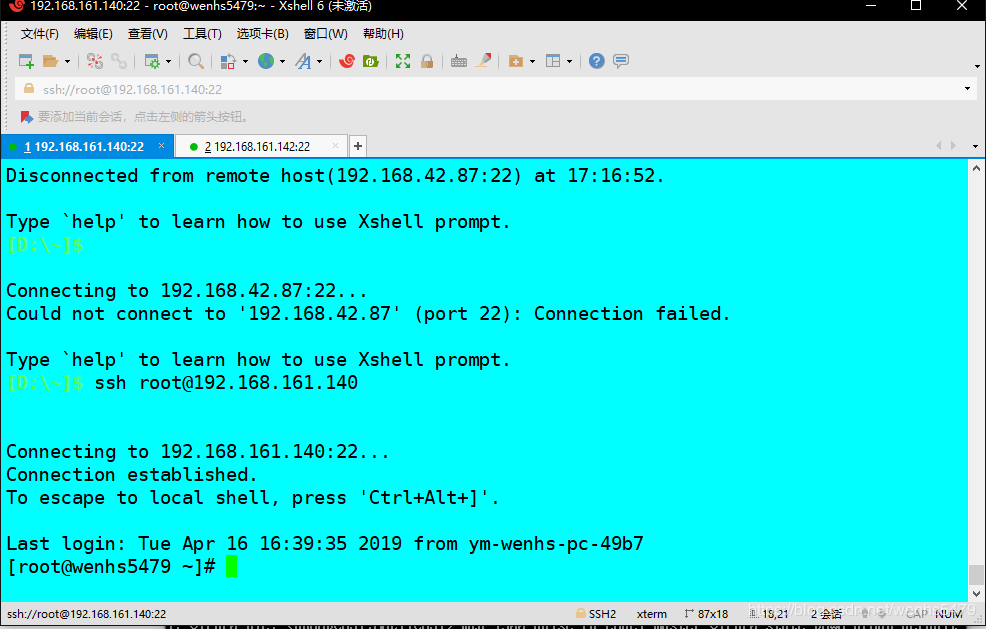
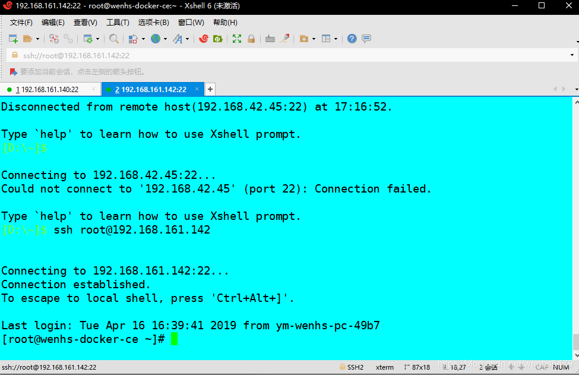
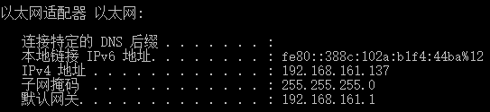
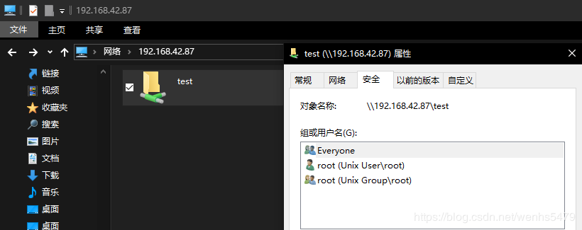
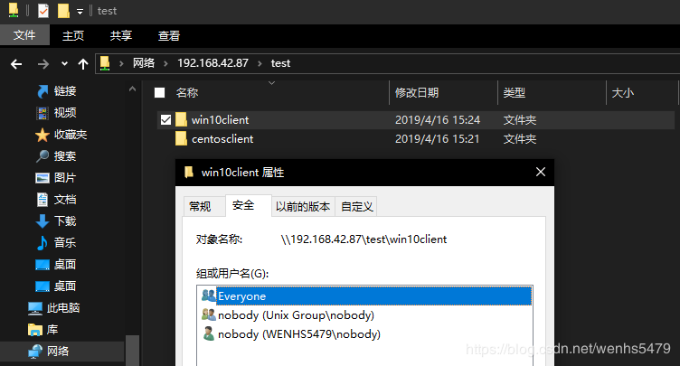
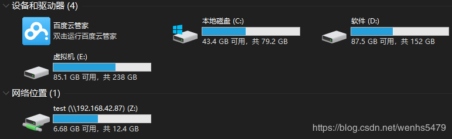
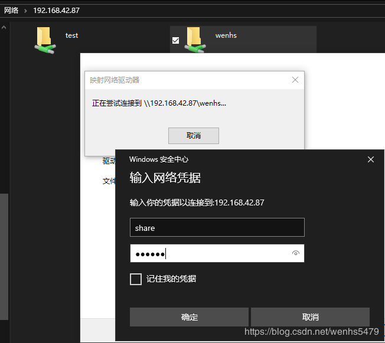
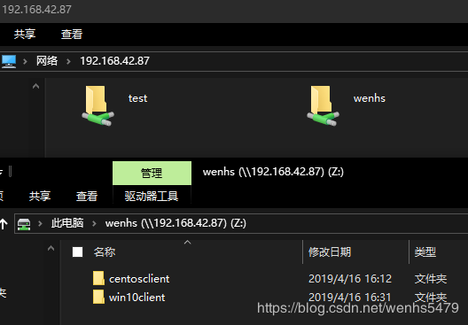
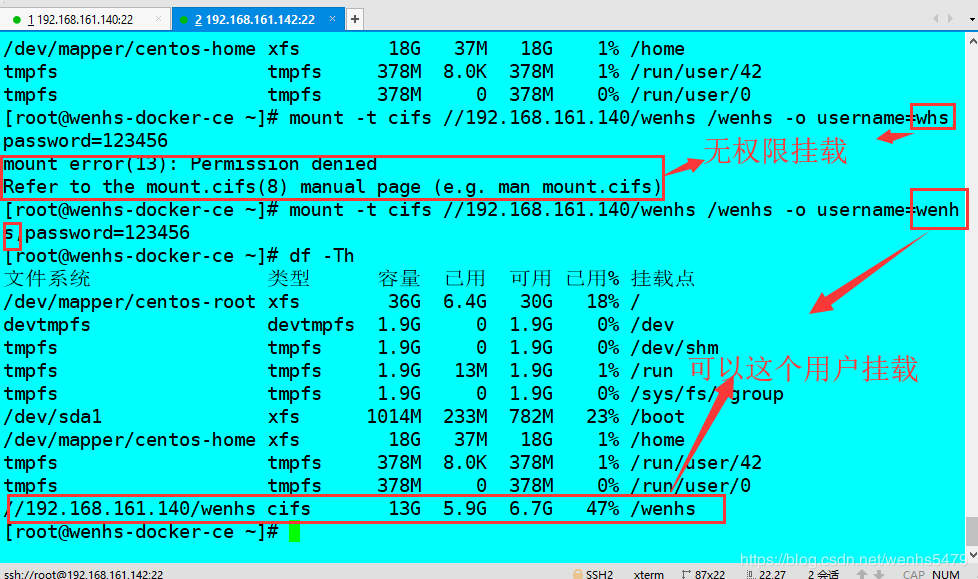

<!--more-->

# samba简介

**Samba**是在Linux和UNIX系统上实现SMB协议的一个免费软件，由服务器及客户端程序构成。

**SMB**（Server Messages    Block，信息服务块）是一种**在局域网上共享文件和打印机的一种通信协议**，它为局域网内的**不同计算机之间提供文件及打印机等资源的共享服务。**

**SMB**协议是**客户机/服务器**型协议，客户机通过该协议可以访问服务器上的**共享文件系统、打印机及其他资源**。

### samba监听端口

 - `TCP——139、445`，tcp端口相对应的服务是smbd服务，其作用是提供服务器中文件、打印资源的共享访问；
 - `UDP——137、138`，udp端口相对应的服务是nmbd服务，起作用是提供基于NetBOIS主机名称的解析。

### samba进程：

| 进程            | 对应                   |
| --------------- | ---------------------- |
| nmbd            | 对应netbios            |
| smbd            | 对应cifs协议           |
| winbindd + ldap | 对应Windows AD活动目录 |

### samba用户：

| 帐号                    | 密码                                                   |
| ----------------------- | ------------------------------------------------------ |
| 都是系统用户/etc/passwd | Samba服务自有密码文件通过smbpasswd -a USERNAME命令设置 |

```
smbpasswd
 -L	本地模式（必须是第一选项）
   -h	打印此用法消息
   -s	使用stdin进行密码提示
   -c smb.conf	文件使用smb.conf文件的给定路径
   -D LEVEL	调试级别
   -r MACHINE	远程机器
   -U USER	远程用户名（例如SAM /用户）
在root或本地模式下运行时的额外选项：
   -a	添加用户
   -d	禁用用户
   -e	启用用户
   -i	域间信任帐户
   -m	机器信托帐户
   -n	设置无密码
   -W	使用stdin ldap管理员密码
   -w PASSWORD 	ldap管理员密码
   -x	删除用户
   -R 	ORDER名称解析顺序
```

### Samba安全级别：

Samba服务器的安全级别有三个，分别是user，server，domain

| 安全级别 | 作用                                   |
| -------- | -------------------------------------- |
| user     | 基于本地的验证                         |
| server   | 由另一台指定的服务器对用户身份进行认证 |
| domain   | 由域控进行身份验证                     |

> 以前的samba版本支持的安全级别有四个，分别是share，user，server，domain
> 
> share是用来设置匿名访问的，但现在的版本已经不支持share了，但是还是可以实现匿名访问的 只是配置方式变了

### samba配置文件：

 - /etc/samba/smb.conf(主配置文件)

| samba三大组成 | 作用                                                         |
| ------------- | ------------------------------------------------------------ |
| [global]      | 全局配置，此处的设置项对整个samba服务器都有效                |
| [homes]       | 宿主目录共享设置，此处用来设置Linux用户的默认共享，对应用户的宿主目录。当用户访问服务器中与自己用户名同名的共享目录时，通过验证后将会自动映射到该用户的宿主目录中 |
| [printers]    | 打印机共享设置                                               |

### 常用配置文件参数：

| 参数           | 作用                                                         |
| -------------- | ------------------------------------------------------------ |
| workgroup      | 表示设置工作组名称                                           |
| server string  | 表示描述samba服务器                                          |
| security       | 表示设置安全级别，其值可为share、user、server、domain        |
| passdb backend | 表示设置共享帐户文件的类型，其值可为tdbsam（tdb数据库文件）、ldapsam（LDAP目录认证）、smbpasswd（兼容旧版本samba密码文件） |
| comment        | 表示设置对应共享目录的注释，说明信息，即文件共享名           |
| browseable     | 表示设置共享是否可见                                         |
| writable       | 表示设置目录是否可写                                         |
| path           | 表示共享目录的路径                                           |
| guest ok       | 表示设置是否所有人均可访问共享目录                           |
| public         | 表示设置是否允许匿名用户访问                                 |
| write list     | 表示设置允许写的用户和组，组要用@表示，例如 write list = root,@root |
| valid users    | 设置可以访问的用户和组，例如 valid users = root,@root        |
| hosts deny     | 设置拒绝哪台主机访问，例如 hosts deny = 192.168.72.1         |
| hosts allow    | 设置允许哪台主机访问，例如 hosts allow = 192.168.72.2        |
| printable      | 表示设置是否为打印机                                         |

**测试配置文件是否有语法错误，以及显示最终生效的配置：使用testparm命令**

```
交互式数据访问
smbclient -L HOST -U USERNAME
smbclient //SERVER/shared_name -U USERNAME

基于挂载的方式访问
mount -t cifs //SERVER/shared_name /挂载到本地的什么目录 -o username=USERNAME,password=PASSWORD

/etc/fstab写法
//SERVER/shared_name /挂载到本地的什么目录	cifs	defaults,username=USERNAME,password=PASSWORD	0	0
```

### 实验

 - 搭建匿名用户共享服务器
 - 搭建用户认证共享服务器
	**要求：**
	 - 不论是匿名用户还是用户认证共享，均要在客户机验证结果
	 - 用户认证共享需要映射系统用户为一个虚拟用户

### 搭建环境

 - 本实验的linux跑在vm15虚拟机软件中,网卡模式为桥接
 - 服务器系统版本为centos 7.6版本,客户端有centos7.6和本机win10
 - 实验前关闭防火墙以及selinux
 - 实验所用地址如下：
 - 服务器[wenhs5479]地址为192.168.42.87/24

 

 -  客户端[wenhs-docker-ce]地址为192.168.42.45/24



 -  客户端win10地址192.168.42.46/24



 - 注意系统版本；
 - 主配置文件/etc/samba/smb.conf
 - 用户映射文件/etc/ samba/smbusers
 - 请先检查地址能否相互ping通

**注意:** 环境由于部分原因导致换了IP,不影响最终实验,看得懂就看,看不懂请从最基础的学起,实验初始IP是手打的字,后来改成了图片里面的IP,下面实验,一定要弄清楚谁是服务器,谁是客户端

### 搭建步骤

 - 搭建匿名用户共享服务器

首先在服务器端安装samba服务

```
yum -y install samba-*
```

在服务器端创建共享目录

```
mkdir -p /samba/test
```

在服务器端修改/etc/samba/smb.conf配置文件，添加以下内容

```
[globol]
		map to guest = Bad User #设置匿名用户
[test]
        comment = test 		#共享目录的注释
        path = /samba/test 	#共享目录的路径
        browseable = yes 		#共享目录可见
        public = yes 			#允许匿名用户访问
        writable = yes 		#允许用户在目录下写
        guest ok = yes 		#允许所有人访问共享目录
```

在服务器端修改权限，将/samba/test目录的其他人权限设置成rw，才能在客户端进行写操作，

```
chmod o+w /samba/test
```

测试配置文件是否有语法错误

```
[root@wenhs5479 samba]# testparm 
Load smb config files from /etc/samba/smb.conf
rlimit_max: increasing rlimit_max (1024) to minimum Windows limit (16384)
Processing section "[homes]"
Processing section "[printers]"
Processing section "[print$]"
Processing section "[test]"
Loaded services file OK.
Server role: ROLE_STANDALONE

Press enter to see a dump of your service definitions

# Global parameters
[global]
	map to guest = Bad User
	printcap name = cups
	security = USER
	workgroup = SAMBA
	idmap config * : backend = tdb
	cups options = raw


[homes]
	browseable = No
	comment = Home Directories
	inherit acls = Yes
	read only = No
	valid users = %S %D%w%S


[printers]
	browseable = No
	comment = All Printers
	create mask = 0600
	path = /var/tmp
	printable = Yes


[print$]
	comment = Printer Drivers
	create mask = 0664
	directory mask = 0775
	force group = @printadmin
	path = /var/lib/samba/drivers
	write list = @printadmin root


[test]
	comment = test
	guest ok = Yes
	path = /samba/test
	read only = No
```

 - 重新启动samba服务

```
systemctl restart smb nmb
```

 - 查看端口是否开启

```
[root@wenhs5479 samba]# ss -anltup|grep smb
tcp    LISTEN     0      50        *:139                   *:*                   users:(("smbd",pid=22277,fd=36))
tcp    LISTEN     0      50        *:445                   *:*                   users:(("smbd",pid=22277,fd=35))
tcp    LISTEN     0      50       :::139                  :::*                   users:(("smbd",pid=22277,fd=34))
tcp    LISTEN     0      50       :::445                  :::*                   users:(("smbd",pid=22277,fd=33))
```

 - 在客户端上安装samba-client，然后在客户端上进行验证

```
yum -y install samba-client 
```

 - 交互式验证查看：

```
[root@wenhs-docker-ce ~]# smbclient -L 192.168.42.87 -U 'Bad User'
Enter SAMBA\Bad User's password: 		#这里直接回车即可,并没有密码

	Sharename       Type      Comment
	---------       ----      -------
	print$          Disk      Printer Drivers
	test            Disk      test
	IPC$            IPC       IPC Service (Samba 4.8.3)
Reconnecting with SMB1 for workgroup listing.

	Server               Comment
	---------            -------

	Workgroup            Master
	---------            -------
	SAMBA                WENHS5479
```

 - 交互式访问共享：(远程主机地址后接共享目录的名字，一般不用)

```
[root@wenhs-docker-ce ~]# smbclient //192.168.42.87/test -U 'Bad User'
Enter SAMBA\Bad User's password: 		#这里直接回车即可,并没有密码
Try "help" to get a list of possible commands.
smb: \> mkdir centosclient
smb: \> ls
  .                                   D        0  Tue Apr 16 15:21:55 2019
  ..                                  D        0  Tue Apr 16 14:53:46 2019
  centosclient                        D        0  Tue Apr 16 15:21:55 2019

		13092864 blocks of size 1024. 7008284 blocks available

smb: \> q		#quit退出
[root@wenhs-docker-ce ~]#
```





 - 在服务器上查看创建的文件和目录

```
[root@wenhs5479 ~]# ls -al /samba/test/
总用量 0
drwxr-xrwx. 4 root   root   45 4月  16 15:24 .
drwxr-xr-x. 3 root   root   18 4月  16 14:53 ..
drwxr-xr-x. 2 nobody nobody  6 4月  16 15:21 centosclient
drwxr-xr-x. 2 nobody nobody  6 4月  16 15:24 win10client
```

 - 挂载式访问共享：(远程主机地址后接共享目录的名字)

```
[root@wenhs-docker-ce ~]# mkdir /samba				#创建挂载目录
[root@wenhs-docker-ce ~]# mount -t cifs //192.168.42.87/test /samba -o username='Bad User'
Password for Bad User@//192.168.42.87/test:  		#直接回车确认
[root@wenhs-docker-ce ~]# df -Th
文件系统                类型      容量  已用  可用 已用% 挂载点
/dev/mapper/centos-root xfs        36G  6.4G   30G   18% /
devtmpfs                devtmpfs  1.9G     0  1.9G    0% /dev
tmpfs                   tmpfs     1.9G     0  1.9G    0% /dev/shm
tmpfs                   tmpfs     1.9G   13M  1.9G    1% /run
tmpfs                   tmpfs     1.9G     0  1.9G    0% /sys/fs/cgroup
/dev/sda1               xfs      1014M  233M  782M   23% /boot
/dev/mapper/centos-home xfs        18G   37M   18G    1% /home
tmpfs                   tmpfs     378M  4.0K  378M    1% /run/user/42
tmpfs                   tmpfs     378M   20K  378M    1% /run/user/0
/dev/sr0                iso9660    11G   11G     0  100% /run/media/root/CentOS 7 x86_64
//192.168.42.87/test    cifs       13G  5.9G  6.7G   47% /samba
[root@wenhs-docker-ce ~]#
```

win10映射网络驱动器:\\192.168.42.87\test,确认即可



### 搭建用户共享服务器
 - 创建用户，将用户设置为samba专用用户，并设置专用密码

```
[root@wenhs5479 ~]# useradd wenhs
[root@wenhs5479 ~]# smbpasswd -a wenhs
New SMB password:
Retype new SMB password:
Added user wenhs.
```

 - 创建/samba/wenhs共享目录，并将权限改为757。

```
[root@wenhs5479 ~]# mkdir /samba/wenhs
[root@wenhs5479 ~]# chmod 757 /samba/wenhs/
```

 - 假设将wenhs用户映射为share用户，修改/etc/samba/smbusers文件添加如下内容：

```
[root@wenhs5479 ~]# echo 'wenhs = share' >/etc/samba/smbusers
```

 - 在服务器端修改配置文件/etc/samba/smb.conf内容

```
[global]
        username map = /etc/samba/smbusers		#指定本地用户映射成虚拟用户的文件存放位置
[wenhs]
        comment = wenhs
        path = /samba/wenhs
        browseable = yes
        write list = wenhs	#指定wenhs用户进行读写访问，不管这个共享是否是只读文件
        guest ok = yes
        public = yes
```

 - 检查配置文件

```
[root@wenhs5479 ~]# testparm 
Load smb config files from /etc/samba/smb.conf
rlimit_max: increasing rlimit_max (1024) to minimum Windows limit (16384)
Processing section "[homes]"
Processing section "[printers]"
Processing section "[print$]"
Processing section "[test]"
Processing section "[wenhs]"
Loaded services file OK.
Server role: ROLE_STANDALONE

Press enter to see a dump of your service definitions

# Global parameters
[global]
	map to guest = Bad User
	printcap name = cups
	security = USER
	username map = /etc/samba/smbusers
	workgroup = SAMBA
	idmap config * : backend = tdb
	cups options = raw


[homes]
	browseable = No
	comment = Home Directories
	inherit acls = Yes
	read only = No
	valid users = %S %D%w%S


[printers]
	browseable = No
	comment = All Printers
	create mask = 0600
	path = /var/tmp
	printable = Yes


[print$]
	comment = Printer Drivers
	create mask = 0664
	directory mask = 0775
	force group = @printadmin
	path = /var/lib/samba/drivers
	write list = @printadmin root


[test]
	comment = test
	guest ok = Yes
	path = /samba/test
	read only = No


[wenhs]
	comment = wenhs
	guest ok = Yes
	path = /samba/wenhs
	write list = wenhs
```

 - 重启服务

```
systemctl restart smb nmb
```

 - 在客户端进行验证：
 - 交互式验证查看

```
[root@wenhs-docker-ce ~]# smbclient -L 192.168.42.87 -U share
Enter SAMBA\share's password: 

	Sharename       Type      Comment
	---------       ----      -------
	print$          Disk      Printer Drivers
	test            Disk      test
	wenhs           Disk      wenhs
	IPC$            IPC       IPC Service (Samba 4.8.3)
Reconnecting with SMB1 for workgroup listing.

	Server               Comment
	---------            -------

	Workgroup            Master
	---------            -------
	SAMBA                WENHS5479
```

 - 交互式访问共享目录，（一般不用）

```
[root@wenhs-docker-ce ~]# smbclient //192.168.42.87/wenhs -U share
Enter SAMBA\share's password: 
Try "help" to get a list of possible commands.
smb: \> mkdir centosclient
smb: \> ls
  .                                   D        0  Tue Apr 16 16:12:36 2019
  ..                                  D        0  Tue Apr 16 15:55:47 2019
  centosclient                        D        0  Tue Apr 16 16:12:36 2019

		13092864 blocks of size 1024. 7007108 blocks available
smb: \> q
[root@wenhs-docker-ce ~]#
注：用户名用映射用户登录,密码还是wenhs的密码
```





 - 挂载式访问共享目录

```
[root@wenhs-docker-ce ~]# mkdir /wenhs
[root@wenhs-docker-ce ~]# mount -t cifs //192.168.42.87/wenhs /wenhs -o username=share,password=123456
[root@wenhs-docker-ce ~]# df -Th
文件系统                类型      容量  已用  可用 已用% 挂载点
/dev/mapper/centos-root xfs        36G  6.4G   30G   18% /
devtmpfs                devtmpfs  1.9G     0  1.9G    0% /dev
tmpfs                   tmpfs     1.9G     0  1.9G    0% /dev/shm
tmpfs                   tmpfs     1.9G   13M  1.9G    1% /run
tmpfs                   tmpfs     1.9G     0  1.9G    0% /sys/fs/cgroup
/dev/sda1               xfs      1014M  233M  782M   23% /boot
/dev/mapper/centos-home xfs        18G   37M   18G    1% /home
tmpfs                   tmpfs     378M  4.0K  378M    1% /run/user/42
tmpfs                   tmpfs     378M   20K  378M    1% /run/user/0
/dev/sr0                iso9660    11G   11G     0  100% /run/media/root/CentOS 7 x86_64
//192.168.42.87/test    cifs       13G  5.9G  6.7G   47% /samba
//192.168.42.87/wenhs   cifs       13G  5.9G  6.7G   47% /wenhs
```


**创建目录进行查看效果：**

 - 挂载式共享创建 [客户端] 目录

```
[root@wenhs-docker-ce wenhs]# mkdir centos222
[root@wenhs-docker-ce wenhs]# ls -al
总用量 0
drwxr-xr-x   2 root root   0 4月  16 16:53 .
dr-xr-xr-x. 20 root root 261 4月  16 16:47 ..
drwxr-xr-x   2 root root   0 4月  16 16:53 centos222
drwxr-xr-x   2 root root   0 4月  16 16:12 centosclient
drwxr-xr-x   2 root root   0 4月  16 16:31 win10client
```


 - 服务端进行查看

```
[root@wenhs5479 ~]# ls -al /samba/wenhs/
总用量 0
drwxr-xrwx. 6 root  root  78 4月  16 16:56 .
drwxr-xr-x. 4 root  root  31 4月  16 15:55 ..
drwxr-xr-x. 2 wenhs wenhs  6 4月  16 16:53 centos222
drwxr-xr-x. 2 wenhs wenhs  6 4月  16 16:12 centosclient
drwxr-xr-x. 2 wenhs wenhs  6 4月  16 16:56 win10222
drwxr-xr-x. 2 wenhs wenhs  6 4月  16 16:31 win10client
```

### 设置指定用户访问共享文件夹

 - 创建一个samba用户

```
[root@wenhs5479 ~]# useradd -M whs
[root@wenhs5479 ~]# smbpasswd -a whs
New SMB password:
Retype new SMB password:
Added user whs.
```

 - 在etc/samba/smb.conf配置文件中加入“vaild users = wenhs”

```
[wenhs]
        comment = wenhs
        path = /samba/wenhs
        browseable = yes
        write list = wenhs
        guest ok = yes
        public = yes
        valid users = wenhs		#允许wenhs用户进行访问，其他用户不允许访问（添加到配置文件）
```

 - 重新启动服务

```
systemctl restart smb nmb
```

 - 测试

