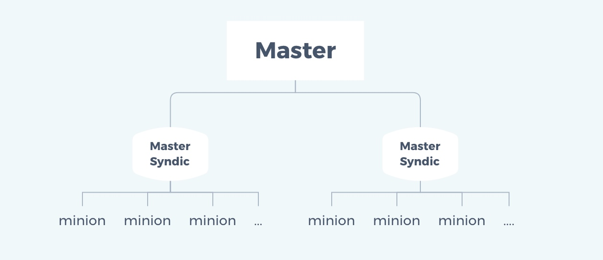

<!--more-->


## 1. masterless

### 1.1 应用场景

 - master 与 minion 网络不通或通信有延迟，即网络不稳定
 - 想在 minion 端直接执行状态

传统的 SaltStack 是需要通过 master 来执行状态控制 minion 从而实现状态的管理，但是当网络不稳定的时候，当想在minion本地执行状态的时候，当在只有一台主机的时候，想执行状态该怎么办呢？这就需要用到 masterless 了。

有了masterless，即使你只有一台主机，也能玩saltstack，而不需要你有N台主机架构。

### 1.2 masterless配置

#### 1.2.1 修改配置文件minion

 - 注释master行
 - 取消注释file_client并设其值为local
 - 设置file_roots
 - 设置pillar_roots

```
[root@minion ~]# vim /etc/salt/minion
....此处省略N行
# resolved, then the minion will fail to start.
# master: salt      //注释此行
....此处省略N行
file_client: local  //取消此行注释并将值设为local
....此处省略N行
file_roots:         //设置file_roots的路径和环境，可有多套环境
  base:
    - /srv/salt/
```

#### 1.2.2 关闭salt-minion服务

使用 masterless 模式时是不需要启动任何服务的，包括salt-master和salt-minion。

```
[root@minion ~]# systemctl stop salt-minion
[root@minion ~]# systemctl disable salt-minion
Removed symlink /etc/systemd/system/multi-user.target.wants/salt-minion.service.
```

#### 1.2.3 salt-call

masterless模式执行模块或状态时需要使用salt-call命令，而不再是salt或者salt-ssh。需要注意的是要使用salt-call的--local选项。

```
[root@minion ~]# salt-call --local cmd.run 'uptime'
local:
     21:16:41 up  6:06,  1 user,  load average: 0.00, 0.01, 0.05
 
 
[root@minion ~]# salt-call --local cmd.run 'ls -l /root'
local:
    total 12
    -rw-------. 1 root root 1313 Jun 13 21:37 anaconda-ks.cfg
    -r--------  1 root root   18 Jul 23 22:33 b
    -rw-r--r--  1 root root   35 Jul 23 22:25 cca
    dr--------  2 itw  itw     6 Jul 23 21:47 haha
[root@minion ~]# salt-call --local cmd.run 'echo "hehe" > /root/henhen'
local:
[root@minion ~]# salt-call --local cmd.run 'ls -l /root'
local:
    total 16
    -rw-------. 1 root root 1313 Jun 13 21:37 anaconda-ks.cfg
    -r--------  1 root root   18 Jul 23 22:33 b
    -rw-r--r--  1 root root   35 Jul 23 22:25 cca
    dr--------  2 itw  itw     6 Jul 23 21:47 haha
    -rw-r--r--  1 root root    5 Jul 24 21:18 henhen
[root@minion ~]# salt-call --local cmd.run 'cat /root/henhen'
local:
    hehe
```

## 2. salt-master高可用

### 2.1 salt-master高可用配置

我们需要用salt来管理公司的所有机器，那么salt的master就不能宕机，否则就会整个瘫痪，所以我们必须要对salt进行高可用。salt的高可用配置非常简单，只需要改一下minion配置文件，将master用列表的形式列出即可。

```
[root@minion ~]# vim /etc/salt/minion
....此处省略N行
master:
  - 192.168.153.136
  - 192.168.153.142
master_type: failover
....此处省略N行
```

本例列出的136和142上必须都安装了salt-master且保证服务都是正常状态。

### 2.2 salt-master高可用之数据同步

涉及到高可用时，数据的同步是个永恒的话题，我们必须保证高可用的2个master间使用的数据是一致的，包括：

 - /etc/salt/pki下的所有key
 - /srv/下的salt和pillar目录下的所有文件

保障这些数据同步的方案有：

 - nfs挂载
 - rsync同步
 - 使用gitlab进行版本控制

安全相关：
为保证数据的同步与防止丢失，可将状态文件通过gitlab进行版本控制管理。

## 3. salt-syndic分布式架构

### 3.1 salt-syndic架构图



### 3.2 salt-syndic的优劣势

优势：

 - 可以通过syndic实现更复杂的salt架构
 - 减轻master的负担

劣势：

 - syndic的/srv目录下的salt和pillar目录内容要与最顶层的master下的一致，所以要进行数据同步，同步方案同salt-master高可用
 - 最顶层的master不知道自己有几个syndic，它只知道自己有多少个minion，并不知道这些minion是由哪些syndic来管理的

### 3.3 salt-syndic部署

#### 3.3.1 环境说明

|     主机IP      |  角色  | 安装的应用                 |
| :-------------: | :----: | :------------------------- |
| 192.168.153.136 | Master | salt-master                |
| 192.168.153.142 | Syndic | salt-master<br>salt-syndic |
| 192.168.153.141 | Minion | salt-minion                |
| 192.168.153.148 | Minion | salt-minion                |

#### 3.3.2 安装salt-master与salt-syndic

在`192.168.153.142`上安装`salt-master`与`salt-syndic`，安装前请自行配置yum源

```
[root@syndic ~]# yum -y install salt-master salt-syndic
```

#### 3.3.3 配置master

修改master的master配置文件

 - 取消注释order_master
 - 将order_master的值设为True

```
[root@master ~]# vim /etc/salt/master
.....此处省略N行
# masters' syndic interfaces.
order_masters: True

[root@master ~]# systemctl enable salt-master
[root@master ~]# systemctl restart salt-master
```

#### 3.3.4 配置syndic

修改syndic所在主机的master配置文件

 - 取消注释syndic_master
 - 将syndic_master的值设为master的IP

```
[root@syndic ~]# vim /etc/salt/master
.....此处省略N行
syndic_master: 192.168.153.136

[root@syndic ~]# systemctl enable salt-master
Created symlink from /etc/systemd/system/multi-user.target.wants/salt-master.service to /usr/lib/systemd/system/salt-master.service.
[root@syndic ~]# systemctl enable salt-syndic
Created symlink from /etc/systemd/system/multi-user.target.wants/salt-syndic.service to /usr/lib/systemd/system/salt-syndic.service.
[root@syndic ~]# systemctl restart salt-master
[root@syndic ~]# systemctl restart salt-syndic
```

#### 3.3.5 配置minion

配置minion，将master指向syndic所在主机

```
[root@minion ~]# vim /etc/salt/minion
.....此处省略N行
master: 192.168.153.142

[root@minion ~]# systemctl restart salt-minion
[root@minion ~]# systemctl enable salt-minion
Created symlink from /etc/systemd/system/multi-user.target.wants/salt-minion.service to /usr/lib/systemd/system/salt-minion.service.
```

在所有minion上做同样的操作，注意，要设置minion配置文件中的id参数，指向minion自身的ip地址或主机名，必须能够唯一标识minion本机。

#### 3.3.6 在syndic上接受minion主机的key

```
[root@syndic ~]# salt-key -L
Accepted Keys:
Denied Keys:
Unaccepted Keys:
192.168.153.141
192.168.153.148
Rejected Keys:
[root@syndic ~]# salt-key -A
The following keys are going to be accepted:
Unaccepted Keys:
192.168.153.141
192.168.153.148
Proceed? [n/Y] Y
Key for minion 192.168.153.141 accepted.
Key for minion 192.168.153.148 accepted.
[root@syndic ~]# salt-key
Accepted Keys:
192.168.153.141
192.168.153.148
Denied Keys:
Unaccepted Keys:
Rejected Keys:
```

#### 3.3.7 在master上接受syndic主机的key

```
[root@master ~]# salt-key -L 
Accepted Keys:
Denied Keys:
Unaccepted Keys:
192.168.153.142
192.168.153.141
Rejected Keys:
[root@master ~]# salt-key -A
The following keys are going to be accepted:
Unaccepted Keys:
192.168.153.142
192.168.153.141
Proceed? [n/Y] Y
Key for minion 192.168.153.142 accepted.
Key for minion master accepted.
[root@master ~]# salt-key -L 
Accepted Keys:
192.168.153.142
192.168.153.141
Denied Keys:
Unaccepted Keys:
Rejected Keys:
```

#### 3.3.8 在master上执行模块或状态检验有几个minion应答

```
[root@master ~]# salt '*' test.ping
192.168.153.141:
    True
192.168.153.142:
    True
192.168.153.148:
    True
192.168.153.141:
    True
```
