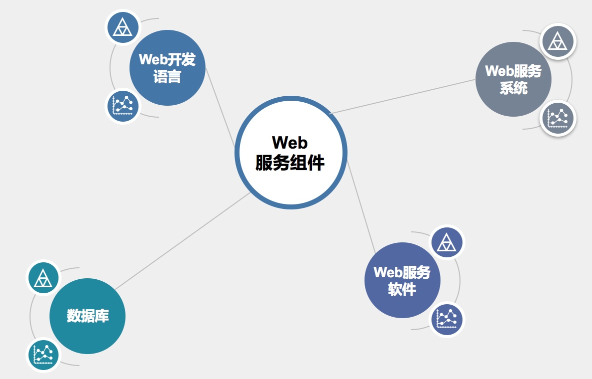
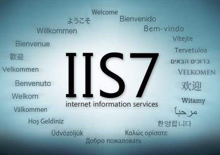
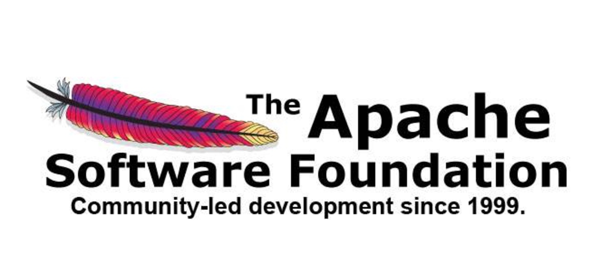
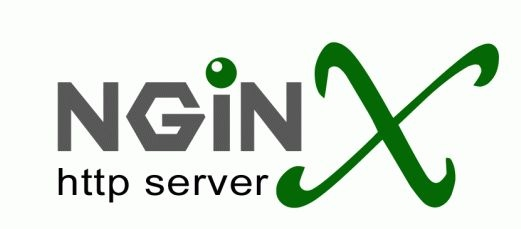
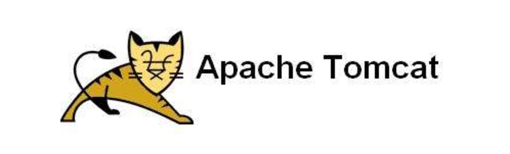
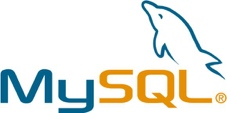
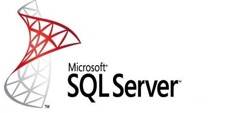
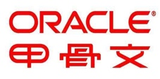
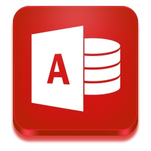

<!--more-->

# 3. Web 服务原理

#### 3.1 Web 概述

图 1-1

- Web（World Wide Web）即全球广域网，也称为万维网，它是一种基于超文本和 HTTP 的、全球性的、动态交互的、跨平台的分布式图形信息系统。是建立在 Internet 上的一种网络服务，为浏览者在 Internet 上查找和浏览信息提供了图形化的、易于访问的直观界面，其中的文档及超级链接将 Internet上 的信息节点组织成一个互为关联的网状结构。
- 我们通常所说的 WWW 服务、Web 服务，其实是一个意思，泛指通过 HTTP 协议传输，使用图形化界面来展示信息的一种方式。也就是俗称的网站或者网页

　　**Web 相关概念**

- 网页（Web 页面）：
  - 网页，是网站中的一个页面，通常是网页是构成网站的基本元素，是承载各种网站应用的平台。通俗的说，网站就是由网页组成的。
- 网站（WebSite）：
  - 网站，指根据一定的规则，使用 HTML 等工具制作的用于展示特定内容的相关网页的集合。简单地说，网站是一种通讯工具，就像布告栏一样，人们可以通过网站来发布或收集信息。
  - 网站就是一组相同所属的网页的集合
- HTML（超文本标记语言）：
  - “超文本” 就是指页面文本内可以包含图片、链接，甚至音乐、程序等非文字元素。
  - 是一种规范，一种标准，超文本标记语言通过标记符号来标记要显示的网页中的各个部分
  - 网页的本质是使用 HTML 语言编写代码所产生的文件
- 静态网页：
  - 指纯 HTML 语言编写，呈现的内容固定化的 Web 页面
  - 静态网页所呈现的所有内容都编写在源文件中，更改内容只能修改源代码
- 动态网页：
  - 除了 HTML，还使用相应的动态程序序言编写的 Web 页面
  - 动态网页中呈现的内容一般存储在数据库中，通过程序语言来调用数据
- HTTP（超文本传输协议）：
  - 用于发布和接收 HTML 页面的协议，定义了 Web 客户端和服务器端的请求和应答标准
  - 默认工作在 TCP 80 端口
- HTTPS（HTTP over SSL）
  - 基于 SSL 的 HTTP 协议，使用 SSL 协议来保护 HTTP 传输，使 HTTP 协议更加安全
- 浏览器（Browser）：
  - 可以接收并解析 HTML 语言，使 HTML 能够图形化显示，并与 Web 服务器进行交互的应用程序

------

#### 3.2. Web 服务组件

图 1-2

> 如图 1-2，要构建一个网站，一般需要具备 Web 服务系统、Web 服务软件、Web 开发语言、数据库这四个组件。这只是比较概括性的划分了 Web 服务的组件，如果要细分的话，还可以细分为操作系统、存储（Web 源文件和数据库）、Web 容器、中间件、Web 服务端语言、Web 开发框架、Web 应用、Web 前端框架、第三方内容等组件。本课程内容不关注 Web 的搭建和优化，所以只按照图示组件讲解

**3.2.1 Web 服务系统**

> Web 作为网络服务，必然需要基于操作系统来运行和工作，这里的 Web 服务系统指的就是 Web 服务运行在哪种操作系统上

- Windows
  - 作为使用最广泛的电脑端操作系统，Windows 无疑是良好的运行 Web 服务的操作系统平台。无论是桌面版的 Windows，还是 Server 版的 Windows，都具备运行 Web 服务的能力，但生产环境中的 Web 服务更多的会选择 Server 版的 Windows，如 Windows Server 2003、Windows Server 2008、Windows Server 2012 等
  - Windows 拥有优秀的图形化界面处理能力，也成为了众多 Web 初学者入门会选择的操作系统
- Linux
  - Server 端的操作系统，无疑是 Linux 的天下。基于开源、高效、安全等优点，Linux 成为了生产环境中搭建 Web 服务的首选操作系统
  - 常见的有 CentOS、RatHat、Ubuntu，互联网中几乎 99% 的 Web 服务都运行在 Linux 系统之上

**3.2.2 Web 服务软件**

> Web 服务软件指 Web 服务器，也称为 HTTP 服务器，是响应来自浏览器的 HTTP 请求，并且发送出网页文件的 Web 服务端软件。 想要把自己的网站发布到网络中让用户可以访问，就需要 Web 服务软件来搭建网站

- IIS（Internet Information Service）

  

  

  图 2-1

  

  - IIS 是微软在 Windows 操作系统中自带的 Internet 服务器软件，提供包括 Web、FTP、SMTP 等服务器功能，IIS 也只能运行在 Windows 中
  - IIS 在几乎所有版本的 Windows 中都自带了，无需独立下载，全图形化界面操作，继承了 Windows 的操作风格，使用非常简单便捷
  - IIS 支持发布静态网站，以及 ASP、ASP.NET 的动态网站，使用相应中间件还可以支持发布 PHP 的动态网站
  - IIS 在安全性上一直被业界所诟病，著名的 IIS 6.0 版本中的文件解析漏洞可以让黑客非常轻松的绕过网站限制，上传 WebShell，来获得系统权限。直到 IIS 7.5 版本以后情况才有所好转

- Apache

  

  

  图 2-2

  

  - Apache 是世界使用排名第一的 Web 服务器软件。它可以运行在几乎所有广泛使用的计算机平台上，由于其跨平台和安全性被广泛使用，是最流行的 Web 服务器端软件之一。它快速、可靠并且可通过简单的 API 扩充，将 Perl/Python 等解释器编译到服务器中。同时 Apache 音译为阿帕奇，是北美印第安人的一个部落，叫阿帕奇族，在美国的西南部。也是一个基金会的名称、一种武装直升机等等。
  - 虽然 Apache 可以非常完美的运行在各种操作系统中，但是绝大多数的 Apache 还是运行在 Linux 之上，Apache 也成为了众多 Linux 发行版本的自带应用
  - 严格来说，Apache 只支持发布静态网站、但可以通过中间件来支持 PHP，ASP、ASP.NET、JSP，但 Apache 仍然被大多数用来发布 PHP 网站
  - Apache 虽然也存在安全性的漏洞，但由于其开源性，漏洞的修补和版本的更新速度非常快，相比 IIS， Apache 会更加安全

- Nginx

  

  

  图 2-3

  

  - Nginx 是一款轻量级的 Web 服务器/反向代理服务器及电子邮件（IMAP/POP3）代理服务器，并在一个 BSD-like 协议下发行。其特点是占有内存少，并发能力强，事实上 nginx 的并发能力确实在同类型的网页服务器中表现较好，中国大陆使用 nginx 网站用户有：百度、京东、新浪、网易、腾讯、淘宝等。
  - Nginx 只能安装在 Linux 系统中，但是也有 Windows 的移植版
  - Nginx 是 Apache 的最佳替代品，相比 Apache，Nginx 在处理高并发业务时，资源消耗更低，性能更强
  - Nginx 本身只是一款反向代理软件，只支持 HTML 静态页面，需要通过各种中间件来支持其他动态页面
  - 虽然从性能上来讲，Nginx 要优于 Apache，但 Nginx 也存在模块少、BUG 多，稳定性较差的缺点

- Tomcat

  

  

  图 2-4

  

  - Tomcat 服务器是一个免费的开放源代码的 Web 应用服务器，属于轻量级应用服务器，在中小型系统和并发访问用户不是很多的场合下被普遍使用，是开发和调试 JSP 程序的首选。
  - Tomcat 可以作为一个 Web 服务软件，同样也可以作为 Apache 的一个中间件来使 Apache 可以支持 JSP 站点
  - Tomcat 可以运行在 Windows 和 Linux 中

- Weblogic

  

  

  图 2-5

  

  - Weblogic 是一个基于 JAVAEE 架构的中间件，WebLogic 是用于开发、集成、部署和管理大型分布式 Web 应用、网络应用和数据库应用的 Java 应用服务器。

**3.2.3 Web 开发语言**

> Web 开发语言是指用于编写动态网页的语言，目前几乎所有的网站都是动态网页技术编写的。就算很多网站浏览时发现 URL 后缀是 html，也是通过后台做了动转静。

- PHP（超文本预处理器）
  - PHP 是一种通用开源脚本语言。语法吸收了 C 语言、Java 和 Perl 的特点，利于学习，使用广泛，主要适用于 Web 开发领域。PHP 独特的语法混合了 C、Java、Perl 以及 PHP 自创的语法。它可以比 CGI 或者 Perl 更快速地执行动态网页。用 PHP 做出的动态页面与其他的编程语言相比，PHP 是将程序嵌入到 HTML（标准通用标记语言下的一个应用）文档中去执行，执行效率比完全生成 HTML 标记的 CGI 要高许多；PHP 还可以执行编译后代码，编译可以达到加密和优化代码运行，使代码运行更快。
  - PHP 是目前使用最广泛的 Web 开发语言
- ASP（动态脚本页面）
  - 是微软公司开发的服务器端脚本环境，可用来创建动态交互式网页并建立强大的 web 应用程序。当服务器收到对 ASP 文件的请求时，它会处理包含在用于构建发送给浏览器的 HTML 网页文件中的服务器端脚本代码。除服务器端脚本代码外，ASP 文件也可以包含文本、HTML（包括相关的客户端脚本）和 com 组件调用。
  - ASP 简单、易于维护，是小型页面应用程序的选择。ASP 语言并不面向对象，开发难度相对较大，一般不用于大中型网站
- ASP.NET
  - ASP.NET 又称为 ASP+，不仅仅是 ASP 的简单升级，而是微软公司推出的新一代脚本语言。ASP.NET 基于 .NET Framework 的 Web 开发平台，不但吸收了 ASP 以前版本的最大优点并参照 Java、VB 语言的开发优势加入了许多新的特色，同时也修正了以前的 ASP 版本的运行错误。
  - 一般多见于政府机构和国企的网站
- JSP（JAVA 服务器页面）
  - JSP 技术有点类似 ASP 技术，它是在传统的网页 HTML 文件中插入 Java 程序段 (Scriptlet) 和 JSP 标记 (tag)，从而形成 JSP 文件，后缀名为 .jsp。 用 JSP 开发的 Web 应用是跨平台的，既能在 Linux 下运行，也能在其他操作系统上运行。
- CMS（内容管理系统）
  - 可以把 CMS 理解为网站模板，允许用户根据统一的网站模板，快速生成自定义的个人或企业站点；CMS 提供常见企业网站所需的的信息展示、信息更新、信息删除、信息管理等功能，包括非常详细的网站风格自定义设置。
  - CMS 有各种语言编写的，常见的有 ASP、PHP、ASP.NET
  - 常见的有动易 CMS，织梦 CMS，PHPcms 等

**3.2.4 数据库**

> 数据库（Database），即为数据的仓库，用于存储和记录数据信息。在动态网站的架构中，页面展示的内容并不是写在页面中，而是存储在数据库中，Web 服务通过动态语言来调用数据库中的数据，产生静态页面后再传递至客户端浏览器。这样就避免了网站内容更新时去修改源文件。只需要更新数据库就行了

- MySQL

  

  

  图 2-6

  

  - MySQL 是一个关系型数据库管理系统，由瑞典 MySQL AB 公司开发，目前属于 Oracle 旗下产品。MySQL 是最流行的关系型数据库管理系统之一，在 WEB 应用方面，MySQL 是最好的 RDBMS (Relational Database Management System，关系数据库管理系统) 应用软件。
  - 目前在 Web 架构中使用最广泛的数据库系统

- SQL Server

  

  

  图 2-7

  

  - SQL Server 是由微软开发和推广的关系数据库管理系统（DBMS），它最初是由Microsoft、Sybase 和 Ashton-Tate 三家公司共同开发的，并于 1988 年推出了第一个 OS/2 版本。Microsoft SQL Server 近年来不断更新版本，1996 年，Microsoft 推出了 SQL Server 6.5 版本；1998 年，SQL Server 7.0 版本和用户见面；SQL Server 2000 是 Microsoft 公司于 2000 年推出，目前最新版本是 2017 年份推出的 SQL SERVER 2017。

- Oracle

  

  

  图 2-8

  

  - Oracle 是甲骨文公司的一款关系数据库管理系统。它是在数据库领域一直处于领先地位的产品。可以说 Oracle 数据库系统是目前世界上流行的关系数据库管理系统，系统可移植性好、使用方便、功能强，适用于各类大、中、小、微机环境。它是一种高效率、可靠性好的 适应高吞吐量的数据库解决方案。

- Access

  

  

  图 2-9

  

  - Microsoft Office Access 是由微软发布的小型关系数据库管理系统。它结合了 MicrosoftJet Database Engine 和 图形用户界面两项特点，是 Microsoft Office 套件的程序之一。

- 数据库管理工具

  - PhpMyAdmin：一个以 PHP 为基础，以 Web 方式架构在网站主机上的 MySQL 的数据库管理工具，让管理者可用 Web 图形化界面管理 MySQL 数据库。
  - Navicat：一套快速、可靠并价格相当便宜的数据库管理工具，专为简化数据库的管理及降低系统管理成本而设。它的设计符合数据库管理员、开发人员及中小企业的需要。

------

#### 3.3 Web 服务常见架构

> Web 服务架构指选择什么开发语言 + Web 服务软件 + 数据库 + 操作系统的组合来搭建 Web 服务，虽然严格来说，所有的组件都可以自由组合，但是因为某几种常被放在一起使用，所以拥有了越来越高的兼容度，逐渐共同组成了一个个强大的 Web 应用程序平台

**3.3.1 LAMP**

- Linux + Apache + MySQL + PHP
- 被誉为 Web 服务黄金组合，适用于大型网站架构，稳定性高，常见于企业网站。大多数网站都采用的该架构

**3.3.2 LNMP**

- Linux + Nginx + MySQL + PHP
- 使用 Nginx 来取代 Apache，对性能有较高要求的 Web 站点可以选择这种架构组合

**3.3.3 WAMP**

- Windows + Apache + MySQL + PHP
- 把 Apache 放在 Windows 操作系统中运行，适用于中小型网站架构，易于管理，常见于教育（大学等）、政府事业单位

**3.4 其他**

- IIS + ASP + Access：大多用在学校、地方政府等站点
- JSP + Tomcat + Oracle：大多用在企业内部 ERP 系统、金融机构站点