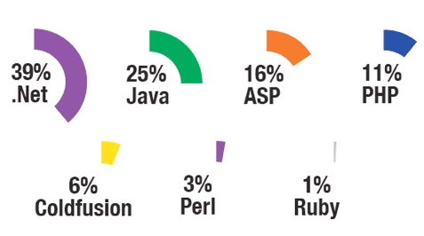
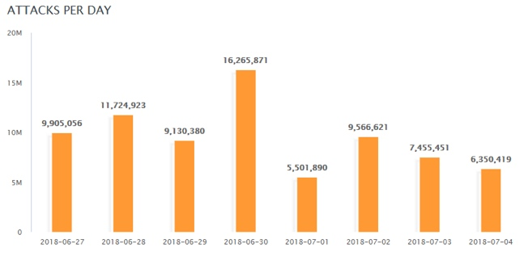
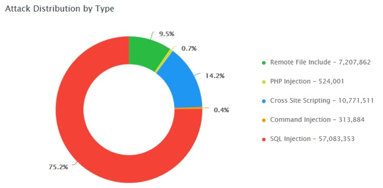
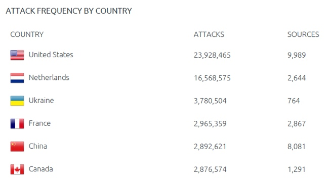
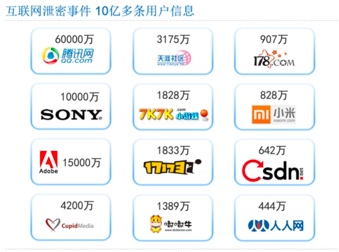

<!--more-->

# 2. Web 渗透概述

> Web 已经在企业信息化、电子商务、电子政务中等得到广泛的应用，Web 的迅速发展同时，也带来了众多的安全威胁。
>
> 网络攻击重心已转向应用层， Web 已成为黑客首选攻击目标， 针对 Web 的攻击和破坏不断增长，据高盛统计数据表明，75% 的攻击是针对 Web 应用的。
>
> 然而，对于 Web 应用安全领域，很多企业还没有充分的认识、没有做好准备；许多开发人员也没有相应的经验，这给了黑客可乘之机。

#### 2.1 Web 安全风险与趋势

- 最新发布的白帽 Web 安全统计报告显示，接受抽样调查网站达 3 万余个，负责撰写报告的首席研究员 Gabriel Gumbs 指出：没有哪一种开发语言或平台有着明显的安全性优势，从漏洞数量来看，大量网站使用的不同的开发语言之间并没有太大的差异，几个主要开发平台的漏洞数量基本处于同一个数量级。

  

  

  图 1-1

  

- 2018 年夏季互联网发展状况安全报告关于 Web 攻击的报告指出，Web 攻击平均每天发生次数在 10 兆次左右，最高可到达 16 兆次以上；同时使用最广泛的攻击方式仍然集中在 SQL 注入、XSS、文件包含；在该报告覆盖的时间范围内，俄罗斯、中国和印度尼西亚是对旅游行业进行撞库攻击的主要来源国，其中半数的撞库活动都指向酒店、游轮公司、航空公司和旅游网站。中国和俄罗斯针对酒店行业和旅游行业的攻击流量加起来是来自美国的攻击流量的三倍。

  

  

  图 1-2

  

  

  

  图 1-3

  

  

  

  图 1-4

  

- 通过入侵 Web 站点而产生的信息泄露事件越来越多。在网络大互联的今天，所有人都有各种私人敏感信息存留在网络中，而其中最多的又是用户自行在网站上注册并记录的，这也就给了黑客一个非常大的驱动力，窃取用户数据贩卖至黑产，使用户信息流向电话推销、电信诈骗等渠道

  

  

  图 1-5

  

#### 2.3 Web 攻击的常见目的

- 恶作剧；
- 关闭 Web 站点，拒绝正常服务；
- 篡改 Web 网页，损害企业名誉；
- 免费浏览收费内容；
- 盗窃用户隐私信息，例如 Email；
- 以用户身份登录执行非法操作，从而获取暴利；
- 以此为跳板攻击企业内网其他系统；
- 网页挂木马，攻击访问网页的特定用户群；
- 仿冒系统发布方，诱骗用户执行危险操作，例如用木马替换正常下载文件，要求用户汇款等；

#### 2.4 Web 安全术语

- 后门
  - 绕过安全控制而获取对程序或系统访问权的方法。后门的最主要目的就是方便以后再次秘密进入或者控制系统。
- Webshell
  - Webshell 就是以 asp、php、jsp 或者 cgi 等网页文件形式存在的一种命令执行环境，也可以将其称作为一种网页后门。
- 0day漏洞
  - 通常是指还没有补丁的漏洞。也就是说官方还没有发现或者是发现了还没有开发出安全补丁的漏洞
- Exploit
  - 简称 exp，漏洞利用
- 提权
  - 提高自己在服务器中的权限，主要针对网站入侵过程中，当入侵某一网站时，通过各种漏洞提升 Webshell 权限以夺得该服务器权限。
- 跳板
  - 跳板，简单来说，就是在进行攻击或渗透时，不直接发起，而是控制一台中间主机来进行。这台中间主机就成为跳板。
- 拖库
  - 网站遭到入侵后，黑客窃取其数据库。
- 社会工程学
  - 一种通过对受害者心理弱点、本能反应、好奇心、信任、贪婪等心理陷阱进行诸如欺骗、伤害等危害手段取得自身利益的手法，已成迅速上升甚至滥用的趋势。
- Apt 攻击
  - 高级持续性威胁。 利用先进的攻击手段对特定目标进行长期持续性网络攻击的攻击形式

#### 2.5 Web 常见攻击手段（OWASP TOP 10）

> 针对 Web 服务的攻击手段五花八门，形形色色。为了帮助IT公司和开发团队规范应用程序开发流程和测试流程，提高Web产品的安全性，OWASP 组织每年都会发布 OWASP TOP 10 年度报告，该报告总结了 Web 应用程序最可能、最常见、最危险的十大漏洞
> OWASP：开放式 Web 应用程序安全项目，是一个非营利组织，不附属于任何企业或财团。因此，由 OWASP 提供和开发的所有设施和文件都不受商业因素的影响。OWASP 支持商业安全技术的合理使用，它有一个论坛，在论坛里信息技术专业人员可以发表和传授专业知识和技能。

图 3-1

#### 2.6 OWASP TOP 10 2017

- A1 - Injection（注入漏洞）
  - 当不可信的数据作为命令或查询语句的一部分被发送给解释器的时候，会发生注入漏洞，包括 SQL、NoSQL、OS 以及 LDAP 注入等。
  - 攻击者发送的恶意数据可能会诱使解释器执行计划外的命令，或在没有适当授权的情况下访问数据。
- A2 - BrokenAuthentication（中断身份认证）
  - 与认证和会话管理相关的应用函数经常被错误地实现，从而允许攻击者破坏密码、密钥或是会话令牌
  - 或者利用其他的应用漏洞来暂时或永久地获取用户身份信息。
- A3 - Sensitive DataExposure（敏感数据泄露）
  - 许多 Web 应用程序和 API 不能正确的保护敏感数据，如金融、医疗保健和 PII（个人身份信息）等。攻击者可能会窃取或篡改这些弱保护的数据，从而进行信用卡欺诈、身份盗窃或其他犯罪行为。
  - 在缺少额外保护（例如，在存放和传输过程中加密，且在与浏览器进行交换时需要特别谨慎）的情况下，敏感数据可能会受到损害。
- A4 - XML ExternalEntities（XXE）XML 外部处理器漏洞
  - 许多过时的或配置不当的XML处理器在XML文档内进行外部实体引用。
  - 外部实体可用于泄露内部文件，通过使用文件URI处理器、内部文件共享、内部端口扫描、远程代码执行以及拒绝服务攻击等手段。
- A5 - Broken AccessControl（中断访问控制）
  - 限制“认证的用户可以实现哪些操作”的命令没有得到正确的执行。
  - 攻击者可以利用这些漏洞访问未经授权的功能和数据，例如访问其他用户的账户，查看敏感文件，篡改其他用户的数据，更改访问权限等。
- A6 - SecurityMisconfiguration（安全配置错误）
  - 安全配置错误是最常见的问题。
  - 这通常是由不安全的默认配置，不完整或 ad hoc 配置，开放云存储，错误配置的 HTTP 标头，以及包含敏感信息的详细错误信息造成的。
  - 所有的操作系统、框架、库、应用程序都需要进行安全配置外，还必须要及时进行系统更新和升级。
- A7 - Cross-SiteScripting（XSS）跨站脚本攻击
  - 如果应用程序在未经适当验证或转义的情况下，能够在新网页中包含不受信任的数据，或是使用可以创建 HTML 或者 JavaScript 的浏览器 API 更新包含用户提供的数据的现有网页，就会出现 XSS 漏洞。
  - XSS 允许攻击者在受害者的浏览器中执行脚本，这些脚本可以劫持用户会话、破坏网站或将用户重定向到恶意网站中。
- A8 - InsecureDeserialization（不安全的反序列化）
  - 不安全的反序列化漏洞通常会导致远程代码执行问题。
  - 即使反序列化错误不会导致远程代码执行，也可以被用来执行攻击，包括重放攻击、注入攻击以及权限提升攻击等。
- A9 - UsingComponents with Known Vulnerabilities（使用含有已知漏洞的组件）
  - 组件（如库、框架和其他软件模块）是以与应用程序相同的权限运行的。如果存在漏洞的组件被利用，这种攻击可能会导致严重的数据丢失或服务器接管危机。
  - 使用已知漏洞组件的应用程序和API可能会破坏应用程序的防御系统，从而启动各种形式的攻击，造成更为严重的影响。
- A10 - InsufficientLogging & Monitoring（不足的记录和监控漏洞）
  - 不足的记录和监控漏洞，再加上事件响应能力欠缺以及缺少有效的整合，使得攻击者可以进一步攻击系统，维持其持久性，转而攻击更多的系统，并篡改、提取或销毁数据。
  - 大部分的数据泄露研究显示，检测出发生数据泄漏的时间通常需要超过 200 天，而且通常是外部机构率先发现数据泄漏的事实，而不是通过内部发现的。