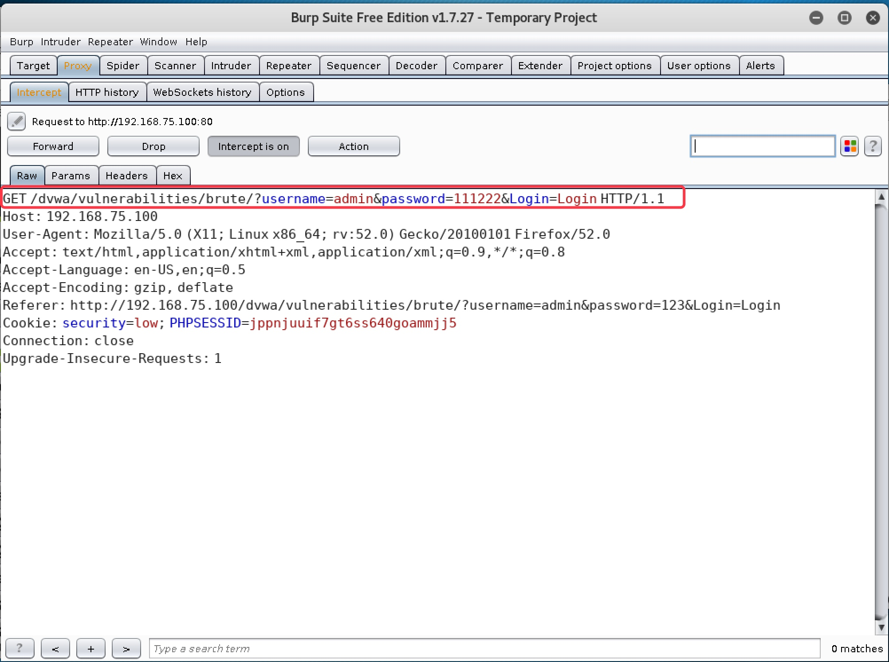
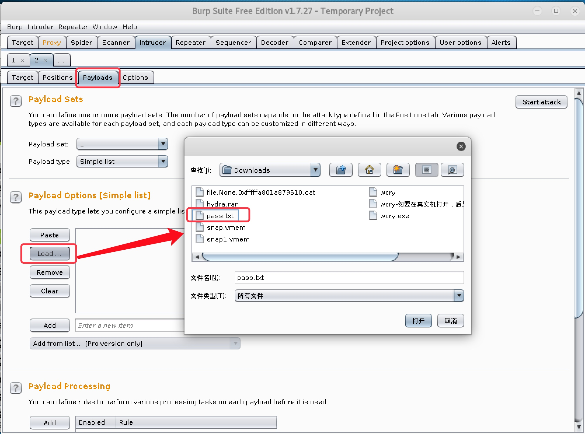
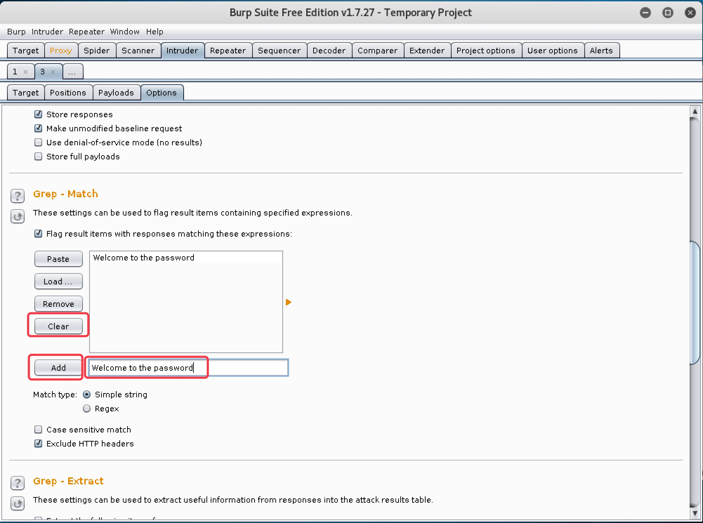

<!--more-->


# 10. Web 爆破攻击实战

#### 10.1 暴力破解简介

　　在很多情况下，黑客在找不到其他途径进入 Web 管理后台时，就会采用暴力破解的方式来破解后台管理员的账号和密码。所谓暴力破解，就是使用“穷举法”，对用户名和密码进行逐个猜解，直至猜出来为止。虽然暴力破解显得不是很有技术含量，但确实最有效的一种方式。理论上来说，只要时间足够，终究会把用户名和密码猜解出来。

　　为了提高暴力破解的效率，一般在破解时，都会使用字典。所谓字典，就是黑客会把自己认为的有可能是正确的密码，以及曾经碰到过的密码，写到一个文档里去，这个文档就是字典。在进行暴力破解时，会按照字典的顺序来进行猜解，这样会大大提高破解的效率。

　　暴力破解可以分别分为破解用户名和破解密码。在对攻击目标一无所知时，往往不仅要猜解出对方的密码，还需要先猜解出对方的用户名，这时破解难度和需要的时间会以大大提升。但如果已经知道了对方的用户名（极有可能是默认的用户名），只破解密码，难度就要小很多。

　　对于 Web 暴力破解来说，由于需要构造 HTTP 请求包，所以必须使用专门的工具，最常见的就是著名的 Burpsuite。Burpsuite 也有专门的爆破模块。

## 　

#### 10.2 Low 级别 Web 爆破攻击实战

##### 10.2.1 暴力破解账户密码

1. 设置安全级别为 `Low`，点击 `Brute Force` 按钮，进行暴力破解模块，发现是个用户登录的页面，随意输入用户名和密码，发现提示用户名或密码错误；同时发现输入的用户名和密码携带在了 `URL` 中，所以确认该页面提交方式为 `GET`，如图 10-1

   

   

   图 10-1

   

2. 我们已经得知 `DVWA` 存在一个默认账户，用户名和密码为 `admin/password`，使用该账户登录，发现页面提示 `Welcome to the passowrd protected area admin`，来说明登录成功，如图 10-2

   

   

   图 10-2

   

3. 我们先自己构建一个字典文件，包含正确的密码信息 `password`，如图 10-3

   

   

   图 10-3

   

4. 设置好 `Burpsuite` 和浏览器的代理，先随便输入一个用户名和密码，用 `Burpsuite` 抓包，如图 10-4

   

   

   图 10-4

   

5. 点击 `Action` 按钮，选择 `Send to Intruder`，把数据包信息发送到暴力破解模块，如图 10-5

   

   

   图 10-5

   

6. 点击 `Intruder` 模块，选择 `Positions` 标签，可以看到发送过来的数据包信息，如图 10-6

   

   

   图 10-6

   

7. 点击 `Clear §` 按钮清除掉所有变量，如图 10-7

   

   

   图 10-7

   

8. 我们这里为了节省时间，假定已经得知了用户名为 `admin`，只猜解密码，所以选中之前随意输入的密码，点击 `Add §`，把密码部分设置为要猜解的变量，如图 10-8

   

   

   图 10-8

   

9. 切换到 `Payloads` 标签，在 `Payload Option` 处，点击 `Load` 按钮，选择之前构建的字典文件，如图 10-9

   

   

   图 10-9

   

10. 下拉到 `Grep Match` 处，点击 `Clear`，清除掉现有猜解成功匹配字符，然后添加之前我们看到的 `DVWA` 中登录成功的提示字符 `Welcome to the passowrd`，然后点击 Add。这样等到猜解成功后，就会自动提示，不用我们自己去比对回包长度和响应状态码来判断哪个是正确的密码，如图 10-11

    

    

    图 10-11

    

11. 点击 `Start Attack` 按钮，开始爆破，可以发现，当猜解到 `password` 时，回包长度与其他都不一致，而且打钩提示该密码是正确的，如图 10-12

    

    

    图 10-12

    

##### 10.2.2 SQL 注入破解账户密码

1. 尝试使用 `SQL` 注入的方式登录，用户名输入 `admin’#` ，密码留空登录，发现可以直接进入，如图 10-13，图 10-14

   

   

   图 10-13

   

   

   

   图 10-14

   

   > 该方式的原理是，猜测后台验证用户名和密码的 SQL 语句为 `select * from users where user='$_GET['username']' and password='$_GET['password']'`，我们提交 `admin'#`，首先通过单引号闭合原语法中的单引号，再用 # 注释掉后面的语句，所以 SQL 注入之后的语句就变成了 `select * from users where user='admin'#' and password=''`，由于 # 后面被注释了，不会提交给服务器执行，所以只要 users 表中存在 admin 用户，无论密码是否正确，都可以通过验证。如果连用户名都不知道，还可以通过 `admin' or '1'='1` 来构造一个恒真表达式进行绕过。

------

##### 10.3 Medium 级别 Web 爆破攻击实战

1. 安全级别设置为 `Medium`，进入 `Web` 爆破攻击页面，查看页面源码，发现对提交的用户名和密码内容使用了 `mysqli_real_escape_string` 函数，对特殊字符进行转义，从而防止了以 SQL 注入的方式登录，如图 10-15。同时，通过 `sleep(2)`，使登录失败后让页面延迟 2 秒响应，对暴力破解起到了一定的防御作用，如图 10-16

   

   

   图 10-15

   

   

   

   图 10-16

   

2. 根据上述情况分析，防 SQL 注入并不能影响我们进行暴力破解，而登录失败的 2 秒延迟对暴力破解的影响也是微乎其微，所以我们这里直接使用 `Low` 级别的方式使用 `Burpsuite` 进行爆破即可。这里只展示最终结果，如图 10-17

   

   

   图 10-17

   

------

#### 10.4 High 级别 Web 爆破攻击实战

1. 安全级别设置为 `High`，进入 `Web` 爆破攻击页面，查看页面源码，发现除了保留 `Medium` 级别的防护措施外，还加入了随机 `Token` 检查机制，如图 10-18。服务器每次返回登录页面都会给客户端产生一个随机的 Token 值，客户端登录时，需要携带该 `Token`，服务器如果检查发现用户携带的 `Token` 和它产生的不一样，就会判断为攻击行为，拒绝登录。

   

   

   图 10-18

   

2. 在这种情况下，`Burpsuite` 就不再有效，需要使用脚本来抓取服务器产生的随机 `Token` 值，然后构造在 `HTTP` 请求包中，才能进行暴力破解。这里我们使用 `Python` 脚本来实现该功能。脚本内容如下

   ```
   import requests 
   from bs4 import BeautifulSoup 
   import sys 
   import re
   
   get_user_token = re.compile(r'(?<=value=").*?(?=")')
   
   def get_token(url): 
       reload(sys)     
       sys.setdefaultencoding('utf-8') 
       header = {                           # 构造 HTTP 头部
           'Host': '192.168.75.100',        # Web 服务器地址
           'Accept': 'text/html,application/xhtml+xml,application/xml;q=0.9,*/*;q=0.8', 
           'Accept-Encoding': 'gzip, deflate', 
           'Accept-Language': 'en-US,en;q=0.5', 
           'Connection': 'keep-alive', 
           'Cookie': 'security=high; PHPSESSID=jppnjuuif7gt6ss640goammjj5',   # 当前浏览器的 Cookie 值
           'User-Agent': 'Mozilla/5.0 (X11; Linux x86_64; rv:52.0) Gecko/20100101 Firefox/52.0' } 
       rep = requests.get(url, headers=header) 
       rep.encoding = 'utf-8' 
       soup = BeautifulSoup(rep.text, "lxml") 
       print len(rep.text) 
       input_list = soup.find('input', type="hidden") 
       user_token = get_user_token.search(str(input_list)).group()
       return user_token 
   
   if __name__ == '__main__': 
       user_token = get_token("http://192.168.75.100/dvwa/vulnerabilities/brute/")    # 取 Token 的页面 URL
       with open('pass.txt') as f:     # 调字典文件
           i = 0 
           for item in f.readlines(): 
               pos = item.rfind(",") 
               username = 'admin'      # 要猜解的用户名，也可用字典来猜解
               password = item[pos + 1:]
               requrl = "http://192.168.75.100/dvwa/vulnerabilities/brute/" + "?username=" + username.strip() +  "&password=" + password.strip() + "&Login=Login&user_token=" + user_token     # 要爆破的 URL 完整格式
               i += 1 
               print i, username.strip(), password.strip(),
               user_token = get_token(requrl)
   ```

3. 由于该脚本使用 `Python2.7` 版本编写，所以我们使用命令 `python2.7 brute.py` 执行脚本，发现其它密码返回的包长度都是 `4469`，只有正确的密码 `password` 回包长度是`4507`，说明成功猜解出了密码，如图 10-18

   

   

   图 10-18

   

------

#### 10.5 Impossible 级别 Web 爆破攻击

　　查看 `Impossible` 级别的页面源码，发现加入了登录失败 3 次，就锁定账户 15 分钟的机制，如图 10-19，使爆破基本无法进行；另外还使用了 `PDO` 技术来防止通过 `SQL` 注入来登录，如图 10-19。

　　另外，对于防暴力破解，加入验证码机制也是常用的较为有效的方法
　　
　　


图 10-19