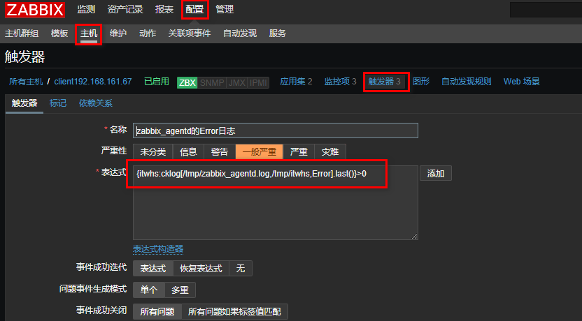

<!--more-->


### 进程和日志

 - 有的时候zabbix提供的监控项目，不能满足我们生产环境下的监控需求，此时我们就要按照zabbix的规范自定义监控项目，达到监控的目的

 - zabbix_get:模拟zabbix_server和agent获取数据

 - 相关概念

 - item: Items是从agnet主机里面获取的所有数据。通常情况下我叫itme为监控项,item由key+参数组成
 - Key：我们可以理解为key是item的唯一标识，在agent端有很多监控项，zabbix-server根据key区分不同的监控项
 - trigger：触发器是建立在item数据上的，具有阈值触发事件的功能
>   基本格式: :.()}
>   
>   server:agent名称，加入主机时配置的
>   
>   key：就是上面说的key
>   
>   function：对阈值进行操作的函数，以下函数
>   
>   operate：表达式
>   
>   constant：常量

例如：{docker02:proc.mysql.last()}<>1

 - 不用担心trigger表达式不好写，在定义好item后，在zabbix点点就自动生成了

```
zabbix_get -s 192.168.161.67 -k ckproc[postfix]
3
# -s:指定agent地址
# -p：agent端口
# -k：指定item的key
# [postfix]:向脚本传递的参数(用逗号分隔)
```

------

#### 下面以监控postfix服务进程为例，做了自定义监控

------

### 1. zabbix_server与zabbix_agent


 - zabbix_server通过发送key给zabbix_agent,然后agent端口根据key，把所要监控的item的最新数据返回给server端

------

### 2. 自定义监控项

 - 自定义脚本格式

```
key[*],[command|sh]
# <key[参数]>，<命令或者脚本>
# [*]：固定格式，表示server端是否传过来参数，在命令或者脚本中用$1,23...引用，shell脚本中的引用$$1,2,3..引用，
# 如果server端不传参数，[*]可以不写
```

#### 2.1 修改agent端配置文件，自定义key

```
vim /usr/local/etc/zabbix_agentd.conf
```

 - 做以下修改

```
UnsafeUserParameters=1 # 默认为0，表示不允许自定义key
# 监控*进程是否存在，[*]是server端传递参数，是服务名称
UserParameter=ckproc[*],/usr/bin/bash /scripts/proc.sh $1
```

然后写脚本

```
mkdir /scripts
vim /scripts/proc.sh
#!/bin/bash
proc_count=$(ps -ef|grep -Ev "grep|$0" |grep -c $1)
echo $proc_count
chown -R zabbix.zabbix /scripts/
chmod +x /scripts/*
```


#### 2.2 web页面配置，加入自定义监控项

 1.【配置】->【主机】,点击所要监控的主机

 2.点击【监控项】

 3.点击右上角【创建监控项】

 4.创建监控项

 - 这里的key值对应我们在agent端自定义的key


 - 重启agent服务

```
pkill zabbix
zabbix_agentd
```

#### 2.3 查看返回的数据：【检测中】->【最新数据】

最新数据是zabbix所有监控项的收集的数据的概览，从这可以看到监控项最新的监控值


> 从图中可以看到，postfix监控项返回的数值是3，说明postfix的进程数为3，代表postfix运行正常，如果想要可以邮件报警，可以给这个自定义的添加触发器，参考“Zabbix监控组件及流程”一章

------

#### 2.4 测试结果:


------

#### 下面是以监控日志，做了自定义监控

------

注：监控日志用shell脚本难以实现记录之前已经看过的日志，为了解决这个问题，我们用python来监控

 - 编写Python程序，可以点击[查看](https://github.com/chendao2015/pyscripts/blob/master/log.py)

 - 说明：第一个参数为日志文件名（必须有，相对路径、绝对路径均可）
 - 第二个参数为“记录之前所看位置”的文件路径（可选项，若不设置则默认为/tmp/logseek文件。相对路径、绝对路径均可）
 - 第三个参数为搜索关键字，默认为 Error

 - 将脚本文件下载后上传到/scripts/目录下，将文件赋予执行权限并将属主和属组改为zabbix

```
放脚本路径和上一个例子一样,如果不做上一个例子,自行创建目录,更改属主属组
vim /scripts/log.py
#!/usr/bin/env python3
import sys
import re

def prePos(seekfile):
    global curpos
    try:
        cf = open(seekfile)
    except IOError:
        curpos = 0
        return curpos
    except FileNotFoundError:
        curpos = 0
        return curpos
    else:
        try:
            curpos = int(cf.readline().strip())
        except ValueError:
            curpos = 0
            cf.close()
            return curpos
        cf.close()
    return curpos

def lastPos(filename):
    with open(filename) as lfile:
        if lfile.readline():
            lfile.seek(0,2)
        else:
            return 0
        lastPos = lfile.tell()
    return lastPos

def getSeekFile():
    try:
        seekfile = sys.argv[2]
    except IndexError:
        seekfile = '/tmp/logseek'
    return seekfile

def getKey():
    try:
        tagKey = str(sys.argv[3])
    except IndexError:
        tagKey = 'Error'
    return tagKey

def getResult(filename,seekfile,tagkey):
    destPos = prePos(seekfile)
    curPos = lastPos(filename)

    if curPos < destPos:
        curpos = 0

    try:
        f = open(filename)
    except IOError:
        print('Could not open file: %s' % filename)
    except FileNotFoundError:
        print('Could not open file: %s' % filename)
    else:
        f.seek(destPos)

        while curPos != 0 and f.tell() < curPos:
            rresult = f.readline().strip()
            global result
            if re.search(tagkey, rresult):
                result = 1
                break
            else:
                result = 0

        with open(seekfile,'w') as sf:
            sf.write(str(curPos))
    finally:
        f.close()
    return result

if __name__ == "__main__":
    result = 0
    curpos = 0
    tagkey = getKey()
    seekfile = getSeekFile()
    result = getResult(sys.argv[1],seekfile,tagkey)
    print(result)

chmod +x /scripts/log.py
chown zabbix.zabbix log.py
```

 - 修改客户端/usr/locla/etc/zabbix_agentd.conf文件

```
UnsafeUserParameters=1
UserParameter=cklog[*],/usr/bin/python /scripts/log.py $1 $2 $3
```


 - 创建日志文件（有，则不需要创建），创建存放读取记录的目录并设置属主和属组为zabbix


```
cat >> /tmp/zabbix_agentd.log << EOF
sklfs
sfkfnkslf
error
errorksdm
Error
failed
failed
whs
itwhs
qwszc
EOF
```

 - 重新启动服务

```
pkill zabbix
zabbix_agentd 
```

 - 在服务端手动执行脚本

```
zabbix_get -s 192.168.161.67 -k cklog[/tmp/zabbix_agentd.log,/tmp/itwhs,failed]
1
```

 - 添加主机监控项


 - 给监控项添加触发器




 - 添加报警媒(介参考“Zabbix监控组件及流程”一章)
 - 添加用户报警类型(介参考“Zabbix监控组件及流程”一章)
 - 添加动作(介参考“Zabbix监控组件及流程”一章)

测试结果:


