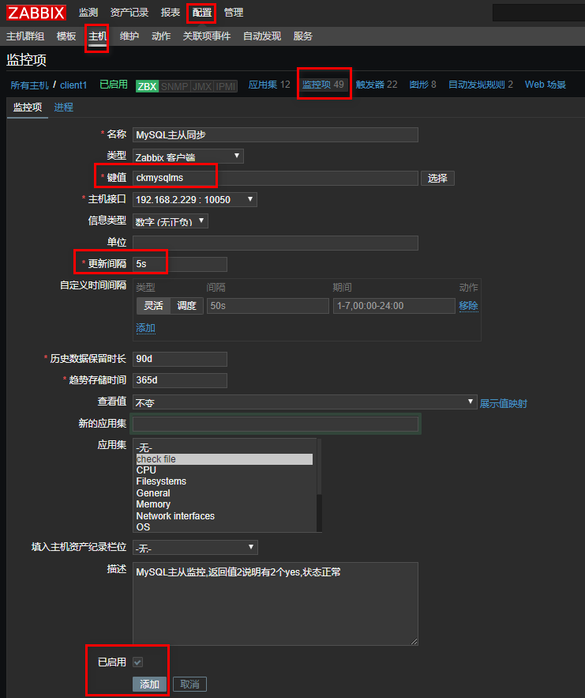
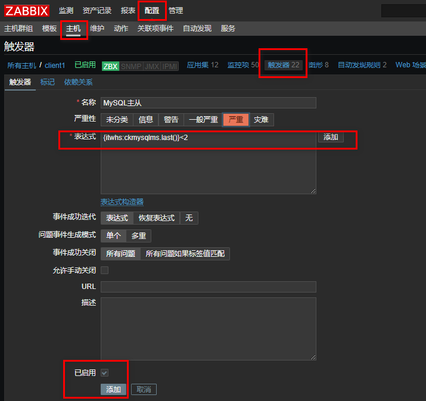
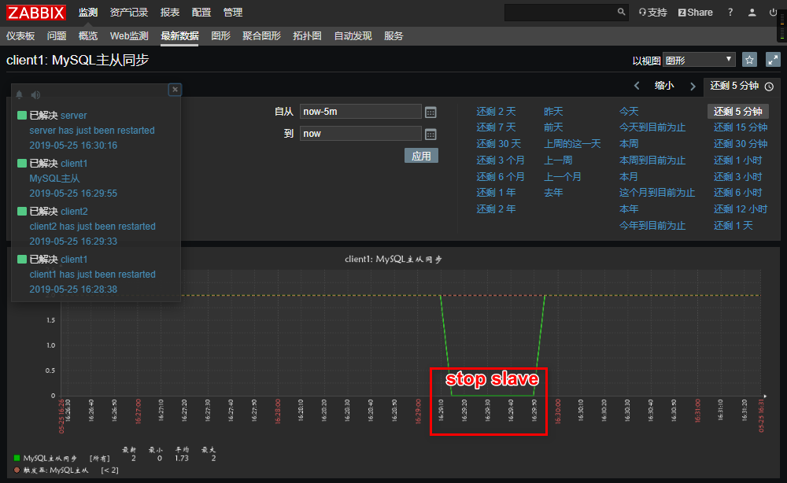
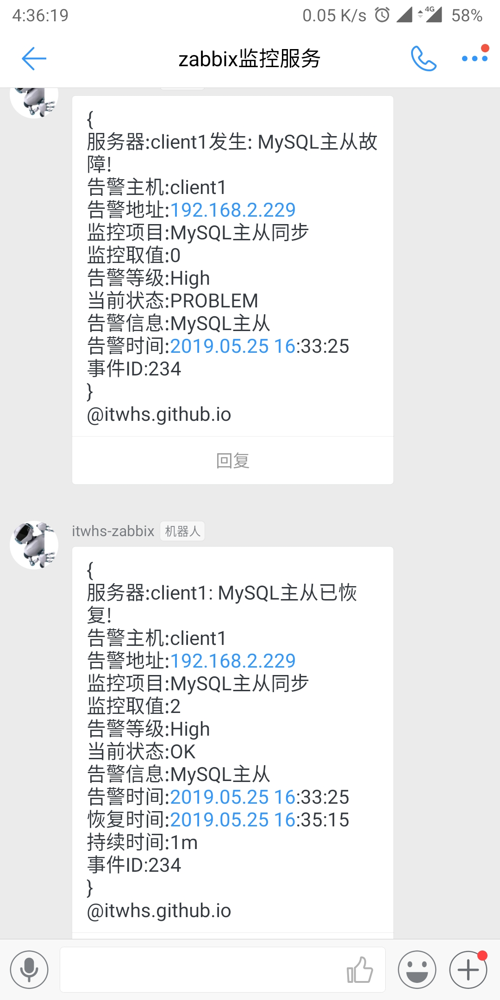
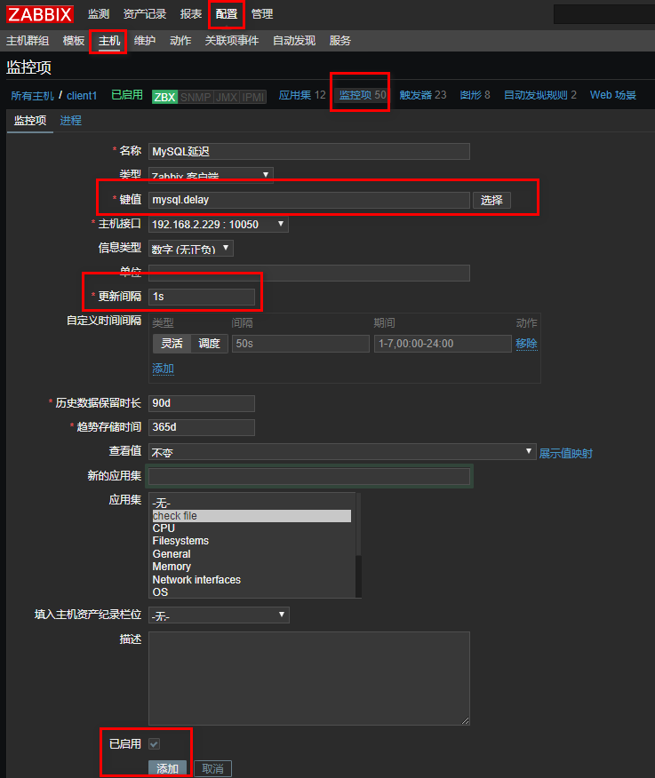
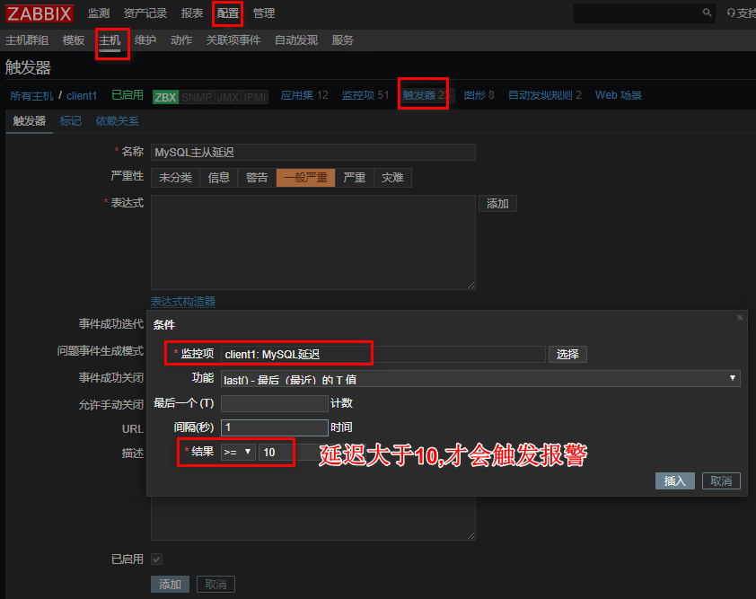
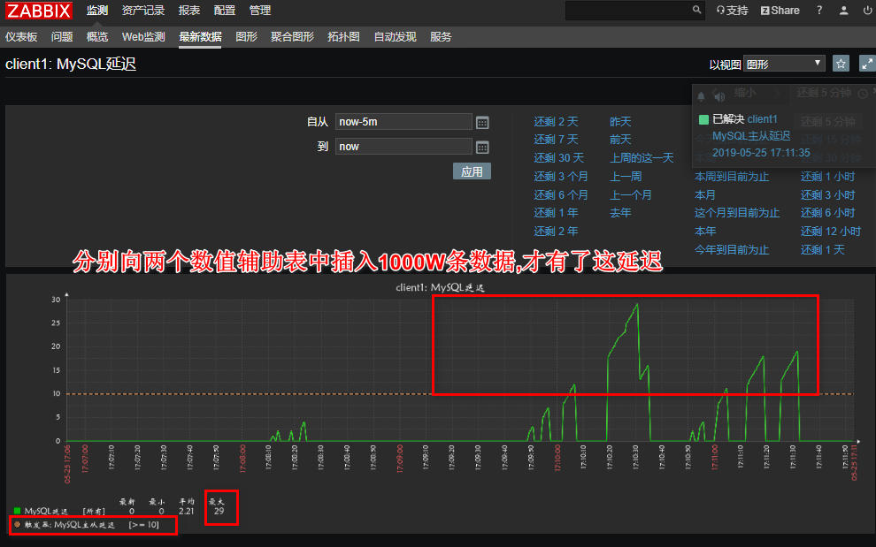
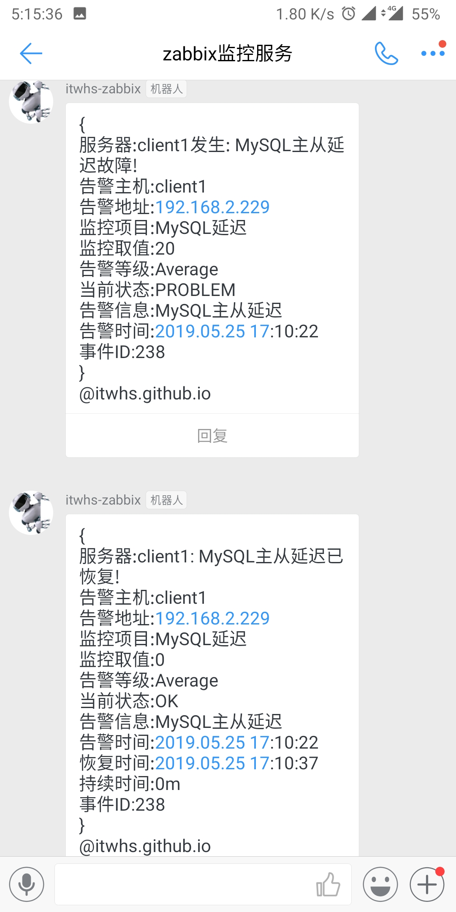

<!--more-->


## 实验环境:

mysql主从配置参考 [mysql主从](https://blog.csdn.net/wenhs5479/article/details/90240226)

关闭防火墙和selinux
安装zabbix，zabbix是基于lamp环境下的，先搭建lamp架构

[安装zabbix](https://blog.csdn.net/wenhs5479/article/details/90267202)监控mysql主从

|    主机系统     |      IP       |              角色              |
| :-------------: | :-----------: | :----------------------------: |
| centos7.6最小化 | 192.168.2.158 |     zabbix-server<br>lamp      |
| centos7.6最小化 | 192.168.2.229 |  zabbix-agentd<br>MySQL-slave  |
| centos7.6最小化 | 192.168.2.157 | zabbix-agentd<br/>MySQL-server |

[ZABBIX的自定义监控](https://blog.csdn.net/wenhs5479/article/details/90514799)续章扩展,

### 实验一:监控MySQL主从同步状态

```
[root@itwhs ~]# egrep -v "#|^$" /usr/local/etc/zabbix_agentd.conf
LogFile=/tmp/zabbix_agentd.log
Server=192.168.2.158
ServerActive=192.168.2.158
Hostname=itwhs
UnsafeUserParameters=1    //设1为开启
UserParameter=ckproc[*],/usr/bin/bash /scripts/proc.sh $1
UserParameter=cklog[*],/usr/bin/python /scripts/log.py $1 $2 $3

配置免密登录
[root@itwhs ~]# head -4 /etc/my.cnf
[client]
host=localhost
user=root
password=itwhsgithubio

添加一个key
[root@itwhs ~]# vim /usr/local/etc/zabbix_agentd.conf
UserParameter=ckmysqlms,mysql -e "show slave status\G" | grep "Running" |awk '{print $NF}' | grep -c "Yes"

重启服务
[root@itwhs ~]# pkill zabbix
[root@itwhs ~]# zabbix_agentd
```

服务端验证:

```
[root@zabbix ~]# zabbix_get -s 192.168.2.229 -k ckmysqlms
2
#抓取mysql-slave端的键值，如果返回数值2.则表明IO和SQL线程状态都为yes状态，则表明主从正常
```

**【Zabbix-server-web端配置】**

**创建一个监控项作为mysql主从**



【创建触发器，实现主从异常报警】



手动触发测试:

```
[root@itwhs ~]# mysql -e "stop slave;"
[root@itwhs ~]# mysql -e "start slave;"
```





### 实验二:监控MySQL主从延迟

```
添加key
[root@itwhs ~]# vim /usr/local/etc/zabbix_agentd.conf
UserParameter=mysql.delay,mysql -e "show slave status\G" 2>/dev/null|egrep 'Seconds_Behind_Master'|awk '{print $2}'

重启服务
[root@itwhs ~]# pkill zabbix
[root@itwhs ~]# zabbix_agentd 
```

服务端验证:

```
[root@zabbix ~]# zabbix_get -s 192.168.2.229 -k mysql.delay
0
说明没有延迟
```

**【Zabbix-server-web端配置】**

**创建一个监控项作为mysql延迟**



【创建触发器，实现主从异常报警】



手动测试

插入几百到几千万条数据,才能看出延迟,方法在[gtid主从](https://blog.csdn.net/wenhs5479/article/details/90320220)那一章

结果:



