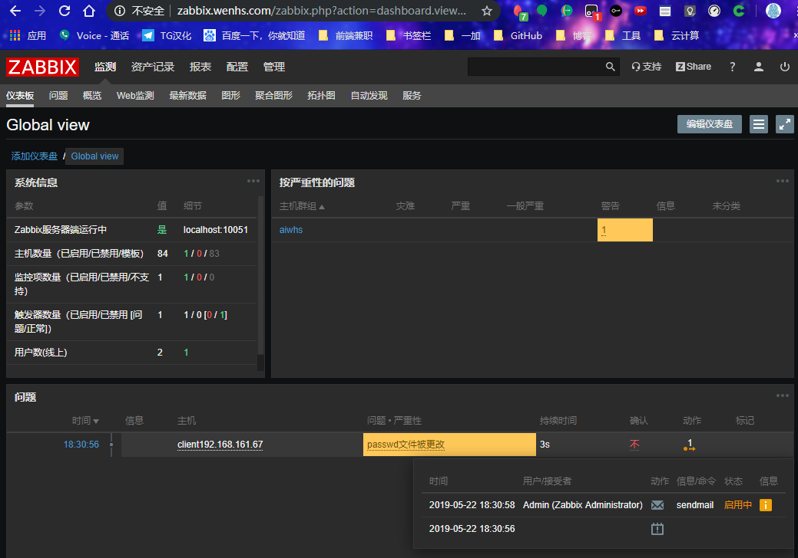
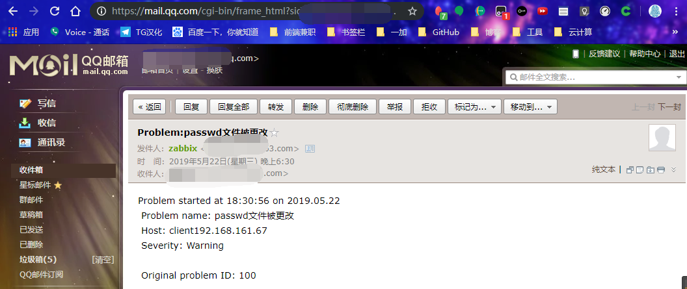

<!--more-->


## **Zabbix监控组件及流程**

Zabbix监控组件主要包括：Zabbix Server、Zabbix Proxy、Zabbix Agent；其中Zabbix Server包括：WEB GUI、Database、Zabbix Server。

### 每个模块工作职责：

 - Zabbix Server：负责接收agent发送的报告信息的核心组件，所有配置，统计数据及操作数据均由其组织进行；
 - Database Storage：用户存储所有配置信息，以及存储由Zabbix Server收集到的数据；
 - Web Interface：Zabbix的GUI接口，通常与Server运行在同一台主机上；
 - Zabbix Proxy：常用于分布监控环境中，代理Server收集部分被监控的监控数据并统一发往Server端；（通常大于500台主机需要使用）
 - Zabbix Agent：部署在被监控主机上，负责收集本地数据发往Server端或Proxy端；

## Zabbix监控系统具体监控流程：


## **Zabbix监控原理：**

Agentd安装在被监控的主机上，Agent负责定期收集客户端本地各项数据，并发送至Zabbix Server端，Zabbix Server收到数据，将数据存储到数据库中，用户基于Zabbix WEB可以看到数据在前端展现图像。当Zabbix监控某个具体的项目，改项目会设置一个触发器阈值，当被监控的指标超过该触发器设定的阈值，会进行一些必要的动作，动作包括：发送信息（邮件、微信、短信）、发送命令（SHELL 命令、Reboot、Restart、Install等）。

## Zabbix监控常见的五个程序及功能

 - zabbix server：zabbix服务端守护进程，其中zabbix_agentd、zabbix_get、zabbix_sender、zabbix_proxy的数据最终都提交给zabbix server；
 - zabbix agentd：客户端守护进程，负责收集客户端数据，例如：收集cpu负载、内存、硬盘使用情况等；
 - zabbix proxy：zabbix分布式代理守护进程，通过大于500台主机，需要进行分布式监控架构部署；
 - zabbix get：zabbix数据接收工具，单独使用的命令，通常在server或者proxy端执行获取远程客户端信息的命令；
 - zabbix sender：zabbix数据发送工具，用户发送数据给server或proxy端，通常用户耗时比较长的检查。

## **Zabbix三种监控方式：Agent、SNMP、IPMI**

Agent：Zabbix可以基于自身zabbix_agent客户端插件监控OS的状态，例如CPU、内存、硬盘、网卡、文件等。

SNMP：Zabbix通过简单网络管理协议（Simple Network Management Protocol）监控网络设备或windows主机等。通过设定SNMP的参数将相关监控数据传送至服务端，交换机、防火墙等网络设备一般都支持SNMP协议。

IPMI：智能平台管理接口（Intelligent Platform Management Interface，IPMI）即主要应用于设备的物理特性，包括：温度、电压、电扇工作状态，电源供应以及机箱入侵等。IPMI最大的优势在于无论OS的开机还是关机状态下，只要接通电源就可以实现对服务器的监控。

## 主动监控与被动监控

 - Zabbix监控客户端分为主动监控与被动监控，主被动模式以客户端为参照，Zabbix监控客户端默认为被动模式，可以修改为主动模式，只需要在客户端配置文件中添加 StartAgents=0。主被动监控模式如下：
 - Zabbix主动模式：Agent主动请求server获取主动的监控项列表，并主动将监控项内需要检测的数据提交给server/proxy，zabbix agent首先向ServerActive配置的IP请求获取active items，获取并提交active items数据至server/proxy。
 - Zabbix被动模式：Server向agent请求获取监控项的数据，agent返回数据，server打开一个TCP连接，Server发送请求agent.ping，Agent接收到请求并且响应，Server处理接收到的数据。

## **Zabbix监控概念**

```
主机（host）：                             被监控的网络设备，可以写IP或者DNS；
主机组（host group）：             主机组用于管理主机，可以批量设置权限；
监控项（item）：                        具体监控项，items值由独立的keys进行识别；
触发器（trigger）：                    为某个items设置触发器，达到触发器会执行action动作；
事件（event）：                          例如达到某个触发器，称之为一个事件；
动作（action）：                         对于特定事件事先定义的处理方法，默认可以发送信息及发送命令；
报警升级（escalation）：         发送警报或执行远程命令的自定义方案，如隔5分钟发送一次警报，共发送5次等。
媒介（media）：                        发送通知的方式，可以支持Mail、SMS、Scripts等；
通知（notification）：               通过设置的媒介向用户发送的有关某事件的信息；
远程命令 ：                                   达到触发器，可以在被监控端执行命令；
模板（template）：                    可以快速监控被监控端，模块包含：item、trigger、graph、screen、application；
web场景（web scennario）       用于检测web站点可用性，监控HTTP关键词；
web前端（frontend）：             Zabbix的web接口；
图形（graph）：                          监控图像；
屏幕（screens）：                       屏幕显示；
幻灯（slide show）：                  幻灯显示
```

## 在WEB界面主机配置的步骤

 - 创建主机群组(按照项目分类,按照系统类型分类,按照应用类型分类)
 - 添加主机(注意配置文件参数和web对应)
 - 创建应用集(或者添加模板)
 - 添加监控项
 - 给监控项添加触发器
 - 设置报警类型(发邮件,打电话,发短信,微信推送,脚本)
 - 配置用户报警方式
 - 添加针对触发器指定的动作
 - 测试

## 以监控/etc/passwd为例

### 创建主机群组

点击配置——主机群组——创建主机群组，页面如下


说明：

 - 每个主机都需要在一个主机群组中，在创建主机时需要指定。

### 添加主机

 - 点击配置——主机——创建主机，页面配置如下


### 创建应用集

 - 配置——主机——应用集——创建应用集，页面如下


### 添加监控项

 - 配置——主机——监控项——创建监控项页，页面配置如下


 - 查看监控是否可以监控到数据，点击检测中——最新数据，页面配置如下


 - 监控到的数据，点击查看


### 给监控项添加触发器

 - 配置——主机——触发器——创建触发器，页面配置如下


 - 需要验证触发器的正确性，在client端中，修改/etc/passwd文件，看能否触发，点击**监测——仪表板**，问题仪表盘中有**闪烁**项表示触发器**生效**，反之不生效


### 电子邮件报警


 - 先要在服务端安装mailx；
 - 重新启动postfix服务；

```
[root@server ~]# systemctl restart postfix
```

 - 测试手动发送邮件；


 - 添加报警媒介内容（可以选择默认的E-mail方式或者手动创建媒介类型）；
	 - 默认的E-mail方式；
	 - 点击管理——报警媒介类型——选择Email，页面设置如下


 - 注：手动添加方式与上图一样，若没有邮箱可用或者邮箱反垃圾系统会将邮件过滤掉可以使用linux系统自带邮箱，设置方法如下图


 - 配置用户发送的警告方式

 - 管理——用户——选择Admin（或者其他用户）——报警媒介，页面设置如下


 - 配置触发器的动作

 - 点击配置——动作——创建动作，第一页面添加名称,——点击操作，页面如下


 - 修改/etc/passwd文件查看验证


### 脚本报警

 - 安装mailx
 - 重启postfix服务
 - 测试手动发送邮件
 - 添加告警媒介
	 - 点击配置——报警媒介类型——创建媒介类型，页面配置如下


 - 配置用户的警告方式


点击更新

 - 配置触发器的动作
 - 点击配置——动作——创建动作，页面如图一——操作，页面如图二


 - 在服务端上写发送告警信息脚本

 - 在服务端创建存放脚本的目录并写如下图脚本，将目录以及脚本的属主和属组设置为zabbix，并给脚本执行权限

```
[root@server ~]# mkdir /usr/local/etc/scripts
[root@server scripts]# vim sendmail.sh
#!/bin/bash
subject=$(echo $2 |tr "\r\n" "\n")
message=$(echo $3 |tr "\r\n" "\n")
echo "$message" | /usr/bin/mail -s "$subject" $1 &>/tmp/sm.log

[root@server scripts]# cd ..
[root@server etc]# chown -R zabbix.zabbix scripts
[root@server etc]# chmod +x scripts/sendmail.sh
```

  

 - 修改/usr/local/etc/zabbix_server.conf，修改如下

```
AlertScriptsPath=/usr/local/etc/scripts
```

 - 重启服务


```
[root@server ~]# pkill zabbix
[root@server ~]# zabbix_server 
[root@server ~]# zabbix_agentd 
[root@server ~]# ss -ntl
State       Recv-Q Send-Q               Local Address:Port                 Peer Address:Port 
LISTEN      0      128                             *:10050                           *:*     
LISTEN      0      128                              *:10051                     
```

 - 修改配置文件查看验证





### 通过zabbix用户发送邮件

 - 在服务端安装mailx、postfix
 - 重新启动postfix
 - 添加邮箱白名单zabbix@zabbix.server.com
 - 修改主机名

```
[root@localhost ~]# hostnamectl set-hostname zabbix.server.com
```

 - 修改/etc/hosts文件,添加如下

```
127.0.0.1	zabbix.com
```

 - 重启postfix服务

```
[root@server etc]# systemctl restart postfix
```

 - 添加告警媒介


 - 添加告警用户


 - 添加动作


 - 修改配置文件进行验证


