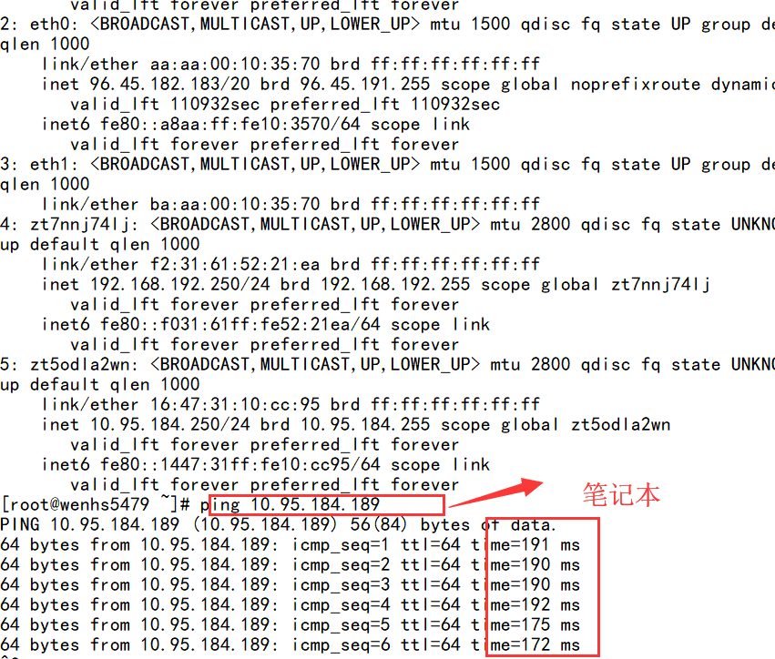

<!--more-->


首先 Zerotier 是什么呢？ Zerotier 是一拨人为了解决网络复杂，以及因特网过于中心化而提出的解决[方案](https://www.zerotier.com/about.shtml)。他们使用[点对点](https://www.zerotier.com/manual.shtml#2_1) 的网络，并且在上面附加一层 [VXLAN-like 虚拟网络层](https://www.zerotier.com/manual.shtml#2_2) 来提高局域网的可见性，安全性。

所以简单来说，Zerotier 通过创建一个虚拟网络，把你的设备添加到这个网络，那么在这个网络内，你的设备就像在同一个路由器内那样可以使用各种端口。

免费版 Zerotier 支持局域网内 100 个设备。Zerotier 支持 Windows、macOS、Linux 三大桌面平台，iOS、Android 两大移动平台，QNAP（威连通）、Synology（群晖）、Western Digital MyCloud NAS（西部数据）三个 NAS 平台，还支持 [OpenWrt/LEDE](https://openwrt.org/) 开源路由器项目。

官网地址：

- https://www.zerotier.com/

## 使用

- 注册 [ZeroTier](https://my.zerotier.com/)
- 创建 Network 私有局域网，得到一个 16 位的 [Network ID](https://www.zerotier.com/manual.shtml#2_2_1)
- 在需要加入虚拟局域网的设备上安装各个平台客户端，设备会生成一个 10 位的 [ZeroTier address](https://www.zerotier.com/manual.shtml#2_1_2)
- 在设备上加入刚刚创建的 Network ID `zerotier-cli join `（或在网页上添加 ZeroTier address）
- 在官网 network 页面上找到设备，在设备前勾选，信任设备，获得局域网 IP

Windows 系统用命令 `IPconfig`，Linux/Unix 用命令 `ifconfig`，然后会看到一个虚拟网卡，有一个 IP 地址。这个 IP 和在官网看到的 network 下的 IP 是一致的，只有同在该虚拟网络下的机器才能访问。

接下来，你可以设置远程桌面（端口号 3389），或者 FTP 服务（端口 21），或者搭建内网网站（端口 80），各种玩法都可以尝试咯。

图文教程可以参考[这篇文章](https://www.appinn.com/zerotier-one/),或者,搜索关键词"zerotier使用图文教程",依照国内CP现象,可得到想要的结果

## 对比

和 ngrok 和 frp 功能类似，但是 ZeroTier 明显入手简单。ZeroTier 只有客户端开源，服务端并没有开源。而 ngrok 和 frp 都是完全开源。但是 ngrok 和 frp 严重依赖于公网固定 IP 的 VPS，是一个中性化的内网穿透工具，一旦中心挂掉，那么所有的节点都无法工作。Zerotier 帮助用户实现了服务端，虽然安全性有待考验，但至少还是能用状态。

另外很多人提到的 [N2N](https://github.com/meyerd/n2n) 开上去也不错，不过我还没怎么用过。等以后尝试过后再补上。

## 建立中转服务器 moon

Zerotier 的官方服务器在国外，国内客户端使用时延迟较大，网络高峰期时甚至各个客户端节点之间访问不了。此时，“自定义根服务器”，又称 moon 中转服务器就显得非常重要，它的主要功能是通过自定义的服务器作为跳板加速内网机器之间的互相访问。

Zerotier 定义了几个专业名词：

- `PLANET` 行星服务器，Zerotier 各地的根服务器，有日本、新加坡等地
- `moon` 卫星级服务器，用户自建的私有根服务器，起到中转加速的作用
- `LEAF` 相当于各个枝叶，就是每台连接到该网络的机器节点。

在使用 `zerotier-cli listpeers` 命令时能看到这几个名词。充当 moon 的机子最好有公网 IP，现在我们尝试用 qnap 搭建一个 moon 中转：

注:以上内容全部来自[这篇文章](http://einverne.github.io/post/2018/06/zerotier.html),CP只做备份使用,敬请谅解

### 环境

#### 机器 A (moon)

- 公网机器(1mbps带宽)
- IP: `139.9.124.192`
- 系统: Centos7

#### 机器 B

- 内网机器笔记本电脑

#### 机器 C

- 被墙的机器:搬瓦工服务器

### 开始

 **搭建开源的Moon　卫星中转节点** 

```
#ztncui依赖于zerotier，所以需要先安装zerotier
	curl -s https://install.zerotier.com | sudo bash
```

```
#安装ztncui软件,并启动
	yum install https://download.key-networks.com/el7/ztncui/1/ztncui-release-1-1.noarch.rpm -y
	yum install ztncui -y
	echo "HTTPS_PORT = 3443" > /opt/key-networks/ztncui/.env

	systemctl restart ztncui

#web登录ztncui控制台
	https://ip:3443
	账户：admin
	密码：password
```

```
#将本机配置为moon节点
	#进入zerotier-one的配置文件目录
	cd /var/lib/zerotier-one
	#在/var/lib/zerotier-one 目录下生成moon.json
	zerotier-idtool initmoon identity.public >> moon.json

	vi /var/lib/zerotier-one/moon.json
	#将这行修改为
	"stableEndpoints": [ "主机ip1/9993","主机ip2/9993" ]
```

```
	#生成签名文件，此命令会生成一个签名文件在当前目录下，文件名如 000000deadbeef00.moon （机器 A 的 id 为 deadbeef00)
	zerotier-idtool genmoon moon.json

	#关闭selinux
```


(备注)使用方式，及其他系统参看ztncui的社区文档
	https://key-networks.com/ztncui/

#### 将 moon 节点加入网络

在机器 A 中的 ZeroTier 目录中建立子文件夹 `moons.d`

不同系统下的 ZeroTier 目录位置：

- Windows: `C:\ProgramData\ZeroTier\One`
- Macintosh: `/Library/Application Support/ZeroTier/One` (在 Terminal 中应为 `/Library/Application\ Support/ZeroTier/One`)
- Linux: `/var/lib/zerotier-one`
- FreeBSD/OpenBSD: `/var/db/zerotier-one`

将在机器 A 生成的 `000000deadbeef00.moon` 拷贝进 `moons.d` 文件夹中，并重启 ZeroTier（此步好像有些许 bug，重启电脑为佳）

> 重新启动moon服务器,由于使用命令安装时会自动注册为服务,所以可以依靠以下命令完成启动或重启
>
> service zerotier-one restart  #(服务重启命令)
>
> /etc/init.d/zerotier-one restart #(服务重启命令)
>
> service zerotier-one start #(服务启动命令)
>
> zerotier-one -d #或直接程序启动
>
> 经过以上配置,服务器上的moon即配置并应用完闭.

#### 将内网机器连接上 moon 节点

##### 方法一

在机器 B、机器 C 中的 ZeroTier 目录中建立子文件夹 `moons.d`

不同系统下的 ZeroTier 目录位置：

- Windows: `C:\ProgramData\ZeroTier\One`
- Macintosh: `/Library/Application Support/ZeroTier/One` (在 Terminal 中应为 `/Library/Application\ Support/ZeroTier/One`)
- Linux: `/var/lib/zerotier-one`
- FreeBSD/OpenBSD: `/var/db/zerotier-one`

将在机器 A 生成的 `000000deadbeef00.moon` 拷贝进 `moons.d` 文件夹中，并重启 ZeroTier（此步好像有些许 bug，重启电脑为佳）


##### 方法二

在机器 B、机器 C 上执行

```
zerotier-cli orbit deadbeef00 deadbeef00
```

(此种方法依赖zerotier的根服务器,若根服务器连接不上,则会无效,由于不确定性, 所以本人更喜欢方法一.这个,看个人情况而定,适用就好)

要验证是否moon生效,只需要在客户端zerotier程序目录下,执行以下命令即可:
`zerotier-cli listpeers`

若有类似地址,即可证明moon连接成功


#### 效果

 说明:192网段走官方服务器,10网段走华为云1mbps云主机,实验测试结果,笔记本连接搬瓦工服务器,一开始在第三方服务器验证,最后笔记本到搬瓦工服务器走P2P隧道,Ping可知,同样笔记本到服务器走p2p打洞,用华为云握手的网段,明显延迟小了不少,具体理解,看下面几张截屏吧.


**zerotier-one客户端安装**

```
#linux安装zerotier-one
	curl -s https://install.zerotier.com | sudo bash

#加入网络
	zerotier-cli join xxxxxxxx
	
#linux若作为本地转发网关，需要关闭selinux，需要设置SNAT以及开启，内核转发 
#echo "net.ipv4.ip_forward = 1" >> /etc/sysctl.conf
#sysctl -p
#iptables -t nat -A POSTROUTING -s 虚拟ip/掩码位 -o eth0 -j SNAT --to-source 本地真实ip

```

**zerotier-one客户端操作帮助**

```
#客户端目录路径
	cd /var/lib/zerotier-one

#重启客户端
	systemctl restart zerotier-one

#zerotier-cli用法指引
	zerotier-cli info			#查看当前zerotier-one的信息
	zerotier-cli listpeers			#列出所有的peers
	zerotier-cli listnetworks		#列出加入的所有的网络
	zerotier-cli join <network>		#加入某个网络
	zerotier-cli leave <network>		#离开某个网络
	zerotier-cli listmoons			#列出加入的Moon节点
	zerotier-cli orbit <world ID> <seed> 	#加入某个Moon节点
	zerotier-cli deorbit <world ID> 	#离开某个Moon节点
```

#### 参考链接

[ZeroTier|Manual](https://www.zerotier.com/manual/#4_4)

[Will transfers go faster if I pay you?](https://zerotier.atlassian.net/wiki/spaces/SD/pages/53739526/Will+transfers+go+faster+if+I+pay+you)

[The "Earth" Test Network](https://zerotier.atlassian.net/wiki/spaces/SD/pages/7372813/The+Earth+Test+Network)

[ZeroTier 中级教程](https://xiwaer.com/541.html)

[开始使用软件定义的网络并使用ZeroTier One创建VPN](https://www.howtoing.com/getting-started-software-defined-networking-creating-vpn-zerotier-one),使用效果欠佳,因为一直是转发模式,受中间服务器带宽限制,速度一直起不来,除非,自建moon服务器,如果自建moon服务器,为何不直接在自建那台上做VPN呢?总归,根据实际情况选择