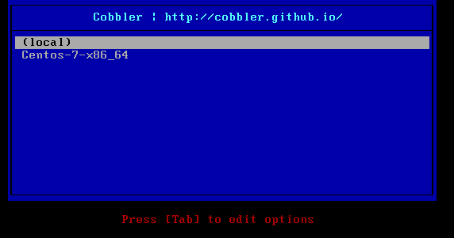
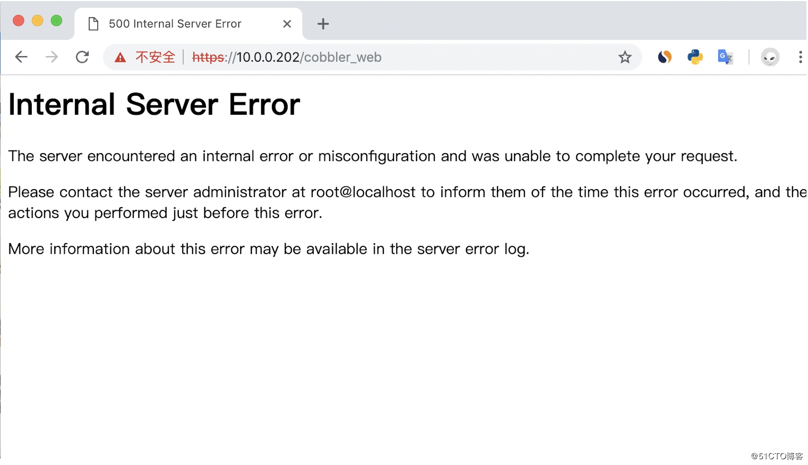
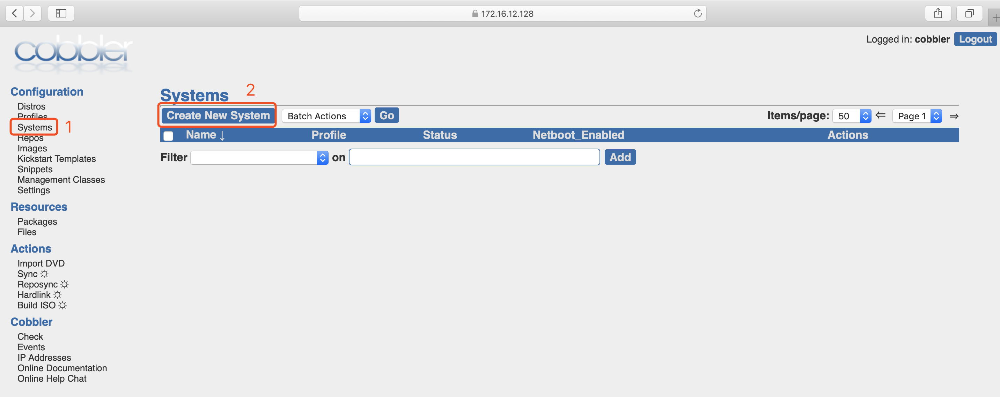
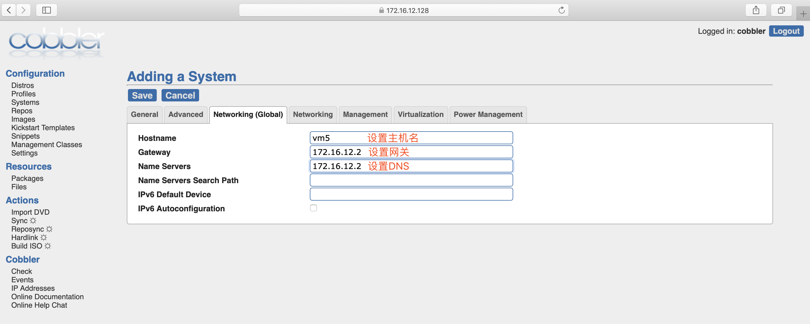
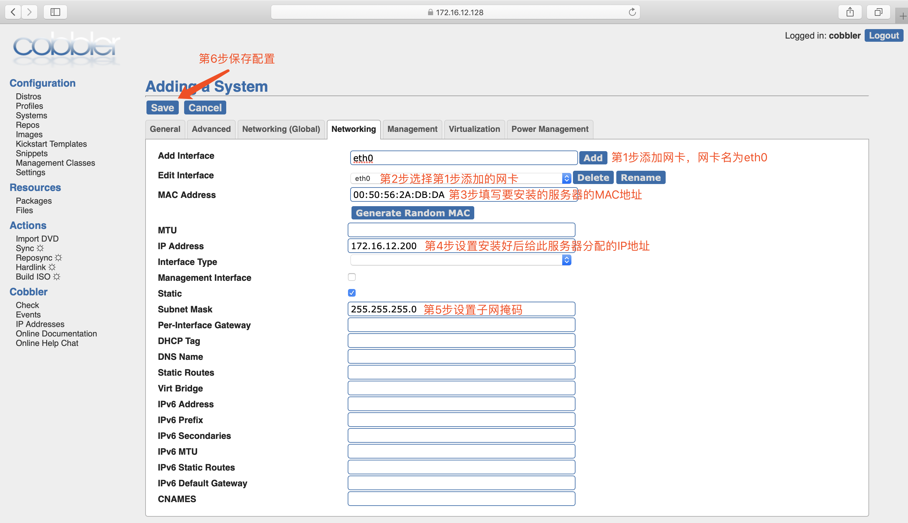

<!--more-->


## 1. cobbler简介

`Cobbler`是一个Linux服务器安装的服务，可以通过网络启动(PXE)的方式来快速安装、重装物理服务器和虚拟机，同时还可以管理`DHCP`，`DNS`等。

`Cobbler`可以使用命令行方式管理，也提供了基于Web的界面管理工具(cobbler-web)，还提供了API接口，可以方便二次开发使用。

`Cobbler`是较早前的kickstart的升级版，优点是比较容易配置，还自带web界面比较易于管理。

`Cobbler`内置了一个轻量级配置管理系统，但它也支持和其它配置管理系统集成，如Puppet，暂时不支持SaltStack。

`Cobbler`[官网](http://cobbler.github.io/)

**cobbler集成的服务**

 - PXE服务支持
 - DHCP服务管理
 - DNS服务管理(可选bind,dnsmasq)
 - 电源管理
 - Kickstart服务支持
 - YUM仓库管理
 - TFTP(PXE启动时需要)
 - Apache(提供kickstart的安装源，并提供定制化的kickstart配置)

**cobbler配置文件详解**
`cobbler`配置文件目录在`/etc/cobbler`

| 配置文件                      | 作用                        |
| :---------------------------- | :-------------------------- |
| /etc/cobbler/settings         | cobbler 主配置文件          |
| /etc/cobbler/iso/             | iso模板配置文件             |
| /etc/cobbler/pxe              | pxe模板配置文件             |
| /etc/cobbler/power            | 电源配置文件                |
| /etc/cobbler/user.conf        | web服务授权配置文件         |
| /etc/cobbler/users.digest     | web访问的用户名密码配置文件 |
| /etc/cobbler/dhcp.template    | dhcp服务器的的配置模板      |
| /etc/cobbler/dnsmasq.template | dns服务器的配置模板         |
| /etc/cobbler/tftpd.template   | tftp服务的配置模板          |
| /etc/cobbler/modules.conf     | 模块的配置文件              |

**cobbler数据目录**

| 目录                          | 作用                                            |
| :---------------------------- | :---------------------------------------------- |
| /var/lib/cobbler/config/      | 用于存放distros，system，profiles等信息配置文件 |
| /var/lib/cobbler/triggers/    | 用于存放用户定义的cobbler命令                   |
| /var/lib/cobbler/kickstart/   | 默认存放kickstart文件                           |
| /var/lib/cobbler/loaders/     | 存放各种引导程序以及镜像目录                    |
| /var/www/cobbler/ks_mirror/   | 导入的发行版系统的所有数据                      |
| /var/www/cobbler/images/      | 导入发行版的kernel和initrd镜像用于远程网络启动  |
| /var/www/cobbler/repo_mirror/ | yum仓库存储目录                                 |

**cobbler日志文件**

| 日志文件路径                 | 说明           |
| :--------------------------- | :------------- |
| /var/log/cobbler/installing  | 客户端安装日志 |
| /var/log/cobbler/cobbler.log | cobbler日志    |

`cobbler`命令详解

```
cobbler check       //核对当前设置是否有问题
cobbler list        //列出所有的cobbler元素
cobbler report      //列出元素的详细信息
cobbler sync        //同步配置到数据目录,更改配置最好都要执行下
cobbler reposync    //同步yum仓库
cobbler distro      //查看导入的发行版系统信息
cobbler system      //查看添加的系统信息
cobbler profile     //查看配置信息
```

## 2. cobbler服务端部署

```
配置yum源
[root@localhost ~]# curl -o /etc/yum.repos.d/CentOS7-Base-163.repo http://mirrors.163.com/.help/CentOS7-Base-163.repo
[root@localhost ~]# sed -i 's/\$releasever/7/g' /etc/yum.repos.d/CentOS7-Base-163.repo
[root@localhost ~]# sed -i 's/^enabled=.*/enabled=1/g' /etc/yum.repos.d/CentOS7-Base-163.repo
[root@localhost ~]# yum -y install epel-release
安装过程略。。。。

安装cobbler以及相关的软件
[root@localhost ~]# yum -y install httpd dhcp tftp python-ctypes cobbler xinetd cobbler-web pykickstart
安装过程略....

启动服务并设置开机自启
[root@localhost ~]# systemctl start httpd
[root@localhost ~]# systemctl start cobblerd
[root@localhost ~]# systemctl enable httpd
Created symlink from /etc/systemd/system/multi-user.target.wants/httpd.service to /usr/lib/systemd/system/httpd.service.
[root@localhost ~]# systemctl enable cobblerd
Created symlink from /etc/systemd/system/multi-user.target.wants/cobblerd.service to /usr/lib/systemd/system/cobblerd.service.

修改server的ip地址为本机ip
[root@localhost ~]# sed -i 's/^server: 127.0.0.1/server: 192.168.137.10/' /etc/cobbler/settings

设置tftp的ip地址为本机ip
[root@localhost ~]# sed -i 's/^next_server: 127.0.0.1/next_server: 192.168.137.10/' /etc/cobbler/settings

开启tftp
[root@localhost ~]# sed -i '/disable/s/yes/no/g' /etc/xinetd.d/tftp

下载缺失文件
[root@localhost ~]# cobbler get-loaders
......
downloading https://cobbler.github.io/loaders/grub-0.97-x86_64.efi to /var/lib/cobbler/loaders/grub-x86_64.efi
*** TASK COMPLETE ***

启动rsync并设置开机自启
[root@localhost ~]# systemctl start rsyncd
[root@localhost ~]# systemctl enable rsyncd
Created symlink from /etc/systemd/system/multi-user.target.wants/rsyncd.service to /usr/lib/systemd/system/rsyncd.service.

生成加密的密码
[root@localhost ~]# openssl passwd -1 -salt "$RANDOM" 'itwhs123!'
$1$8280$A4fc8ZnmQZlZjw/hDcN5Z1         //这是密码加密后的形式

将新生成的加密密码加入到配置文件
[root@localhost ~]# vim /etc/cobbler/settings
....    //此处为省略内容
default_password_crypted: "$1$8280$A4fc8ZnmQZlZjw/hDcN5Z1"
.....   //此处为省略内容

重启cobbler
[root@localhost ~]# systemctl restart cobblerd
[root@localhost ~]# ss -antl
State       Recv-Q Send-Q      Local Address:Port                     Peer Address:Port
LISTEN      0      128                     *:22                                  *:*
LISTEN      0      100             127.0.0.1:25                                  *:*
LISTEN      0      5               127.0.0.1:25151                               *:*
LISTEN      0      5                       *:873                                 *:*
LISTEN      0      128                    :::80                                 :::*
LISTEN      0      128                    :::22                                 :::*
LISTEN      0      100                   ::1:25                                 :::*
LISTEN      0      128                    :::443                                :::*
LISTEN      0      5                      :::873                                :::*

通过cobbler check 核对当前设置是否有问题
[root@localhost ~]# cobbler check
The following are potential configuration items that you may want to fix:

1 : debmirror package is not installed, it will be required to manage debian deployments and repositories
2 : fencing tools were not found, and are required to use the (optional) power management features. install cman or fence-agents to use them

Restart cobblerd and then run 'cobbler sync' to apply changes.
以上两个是关于debian系统的错误，请忽略


配置cobbler dhcp
修改cobbler配置文件，让cobbler控制dhcp
[root@localhost ~]# sed -i '/^manage_dhcp/s/0/1/g' /etc/cobbler/settings
[root@localhost ~]# sed -n '/^manage_dhcp/p' /etc/cobbler/settings
manage_dhcp: 1

配置dhcp
[root@localhost ~]# vim /etc/cobbler/dhcp.template
....    //此处为省略内容
subnet 192.168.137.0 netmask 255.255.255.0 {
     option routers             192.168.137.10;
     option domain-name-servers 192.168.137.1;        //此处为系统安装好后指定的dns地址
     option subnet-mask         255.255.255.0;
     range dynamic-bootp        192.168.137.100 192.168.137.150;
     default-lease-time         21600;
     max-lease-time             43200;
     next-server                $next_server; 
....    //此处为省略内容

重启服务并同步配置，改完dhcp必须要sync同步配置
[root@localhost ~]# systemctl restart cobblerd
[root@localhost ~]# cobbler sync
......
running python trigger cobbler.modules.scm_track
running shell triggers from /var/lib/cobbler/triggers/change/*
*** TASK COMPLETE ***

检查dhcp是否正常
[root@localhost ~]# netstat -anulp|grep dhcp
udp        0      0 0.0.0.0:67              0.0.0.0:*                           12692/dhcpd 


导入redhat7镜像
[root@localhost ~]# mount /dev/cdrom /mnt
mount: /dev/sr0 is write-protected, mounting read-only
[root@localhost ~]# cobbler import --path=/mnt --name=rhel-7 --arch=x86_64
......
Found a candidate signature: breed=redhat, version=rhel6
Found a candidate signature: breed=redhat, version=rhel7
Found a matching signature: breed=redhat, version=rhel7
Adding distros from path /var/www/cobbler/ks_mirror/rhel-7-x86_64:
creating new distro: rhel-7-x86_64
trying symlink: /var/www/cobbler/ks_mirror/rhel-7-x86_64 -> /var/www/cobbler/links/rhel-7-x86_64
creating new profile: rhel-7-x86_64
associating repos
checking for rsync repo(s)
checking for rhn repo(s)
checking for yum repo(s)
starting descent into /var/www/cobbler/ks_mirror/rhel-7-x86_64 for rhel-7-x86_64
processing repo at : /var/www/cobbler/ks_mirror/rhel-7-x86_64     //导入镜像的位置
need to process repo/comps: /var/www/cobbler/ks_mirror/rhel-7-x86_64
looking for /var/www/cobbler/ks_mirror/rhel-7-x86_64/repodata/*comps*.xml
Keeping repodata as-is :/var/www/cobbler/ks_mirror/rhel-7-x86_64/repodata
*** TASK COMPLETE ***

说明：
    --path      //镜像路径
    --name      //为安装源定义一个名字
    --arch      //指定安装源平台

安装源的唯一标示就是根据name参数来定义，本例导入成功后，安装源的唯一标示就是：CentOS-7-x86_64，如果重复，系统会提示导入失败


查看cobbler镜像列表
[root@localhost ~]# cobbler list
distros:
   rhel-7-x86_64

profiles:
   rhel-7-x86_64

systems:

repos:

images:

mgmtclasses:

packages:

files:


创建kickstarts自动安装脚本
[root@localhost ~]# cat > /var/lib/cobbler/kickstarts/Centos-7.6-x86_64.ks <<'EOF'
auth --enableshadow --passalgo=sha512
bootloader --location=mbr
clearpart --all --initlabel
part /boot --asprimary --fstype="ext4" --size=500
part swap --fstype="swap" --size=3072
part / --fstype="ext4" --grow --size=15000
text
firewall --disabled
firstboot --disable
keyboard us
lang en_US
url --url=http://192.168.137.10/cobbler/ks_mirror/Centos-7.6-x86_64
$yum_repo_stanza
reboot

rootpw --iscrypted $6$1DqmGBTIZJdzSAGN$i/neDtJQxcA5cAdXns6DPjgL6tSJABJIVsVQg/6MQNrF1FoXjjC6wB8M/jLc8vGv.rNVzINL6R9u2TqF3KeOB1

selinux --disabled
skipx
timezone Asia/Shanghai --isUtc --nontp
install
zerombr

%packages
@^minimal
@core
kexec-tools

%end

%addon com_redhat_kdump --enable --reserve-mb='auto'

%end

%anaconda
pwpolicy root --minlen=6 --minquality=1 --notstrict --nochanges --notempty
pwpolicy user --minlen=6 --minquality=1 --notstrict --nochanges --emptyok
pwpolicy luks --minlen=6 --minquality=1 --notstrict --nochanges --notempty
%end
EOF

检查ks文件语法是否有误
[root@ct10 ~]# cobbler validateks
task started: 2019-06-26_191758_validateks
task started (id=Kickstart Validation, time=Wed Jun 26 19:17:58 2019)
----------------------------
osversion: rhel6
checking url: http://192.168.137.10/cblr/svc/op/ks/profile/Centos-7.6-x86_64
running: /usr/bin/ksvalidator -v "rhel6" "http://192.168.137.10/cblr/svc/op/ks/profile/Centos-7.6-x86_64"
received on stdout: 
received on stderr: 
*** all kickstarts seem to be ok ***
*** TASK COMPLETE ***

查看当前cobbler有哪些配置文件
[root@localhost ~]# cobbler profile list
   Centos-7-x86_64
   
修改profile，将我们新建的ks文件设为默认的kickstarts安装文件
[root@localhost ~]# cobbler profile edit --name Centos-7.6-x86_64 --kickstart=/var/lib/cobbler/kickstarts/Centos-7.6-x86_64.ks

配置网卡名称为传统网卡名称eth0
[root@localhost ~]# cobbler profile edit --name Centos-7.6-x86_64 --kopts='net.ifnames=0 biosdevname=0'


检查当前系统cobbler配置文件信息
[root@localhost ~]# cobbler profile report
Name                           : Centos-7.6-x86_64
TFTP Boot Files                : {}
Comment                        :
DHCP Tag                       : default
Distribution                   : Centos-7.6-x86_64        //仓库名字
Enable gPXE?                   : 0
Enable PXE Menu?               : 1
Fetchable Files                : {}
Kernel Options                 : {'biosdevname': '0', 'net.ifnames': '0'}       //网卡设为传统命名方式
Kernel Options (Post Install)  : {}
Kickstart                      : /var/lib/cobbler/kickstarts/Centos-7.6-x86_64.ks     //使用的kickstarts配置文件的路径，必须为我们新建的ks文件的路径
Kickstart Metadata             : {}
Management Classes             : []
Management Parameters          : <<inherit>>
Name Servers                   : []
Name Servers Search Path       : []
Owners                         : ['admin']
Parent Profile                 :
Internal proxy                 :
Red Hat Management Key         : <<inherit>>
Red Hat Management Server      : <<inherit>>
Repos                          : []
Server Override                : <<inherit>>
Template Files                 : {}
Virt Auto Boot                 : 1
Virt Bridge                    : xenbr0
Virt CPUs                      : 1
Virt Disk Driver Type          : raw
Virt File Size(GB)             : 5
Virt Path                      :
Virt RAM (MB)                  : 512
Virt Type                      : kvm


同步cobbler
[root@localhost ~]# cobbler sync
task started: 2019-06-26_192053_sync
task started (id=Sync, time=Wed Jun 26 19:20:53 2019)
running pre-sync triggers
cleaning trees
removing: /var/www/cobbler/images/Centos-7.6-x86_64
removing: /var/lib/tftpboot/pxelinux.cfg/default
removing: /var/lib/tftpboot/grub/images
removing: /var/lib/tftpboot/grub/grub-x86.efi
removing: /var/lib/tftpboot/grub/grub-x86_64.efi
removing: /var/lib/tftpboot/grub/efidefault
removing: /var/lib/tftpboot/images/Centos-7.6-x86_64
removing: /var/lib/tftpboot/s390x/profile_list
copying bootloaders
trying hardlink /var/lib/cobbler/loaders/grub-x86.efi -> /var/lib/tftpboot/grub/grub-x86.efi
trying hardlink /var/lib/cobbler/loaders/grub-x86_64.efi -> /var/lib/tftpboot/grub/grub-x86_64.efi
copying distros to tftpboot
copying files for distro: Centos-7.6-x86_64
trying hardlink /var/www/cobbler/ks_mirror/Centos-7.6-x86_64/images/pxeboot/vmlinuz -> /var/lib/tftpboot/images/Centos-7.6-x86_64/vmlinuz
trying hardlink /var/www/cobbler/ks_mirror/Centos-7.6-x86_64/images/pxeboot/initrd.img -> /var/lib/tftpboot/images/Centos-7.6-x86_64/initrd.img
copying images
generating PXE configuration files
generating PXE menu structure
copying files for distro: Centos-7.6-x86_64
trying hardlink /var/www/cobbler/ks_mirror/Centos-7.6-x86_64/images/pxeboot/vmlinuz -> /var/www/cobbler/images/Centos-7.6-x86_64/vmlinuz
trying hardlink /var/www/cobbler/ks_mirror/Centos-7.6-x86_64/images/pxeboot/initrd.img -> /var/www/cobbler/images/Centos-7.6-x86_64/initrd.img
Writing template files for Centos-7.6-x86_64
rendering DHCP files
generating /etc/dhcp/dhcpd.conf
rendering TFTPD files
generating /etc/xinetd.d/tftp
processing boot_files for distro: Centos-7.6-x86_64
cleaning link caches
running post-sync triggers
running python triggers from /var/lib/cobbler/triggers/sync/post/*
running python trigger cobbler.modules.sync_post_restart_services
running: dhcpd -t -q
received on stdout: 
received on stderr: 
running: service dhcpd restart
received on stdout: 
received on stderr: Redirecting to /bin/systemctl restart dhcpd.service

running shell triggers from /var/lib/cobbler/triggers/sync/post/*
running python triggers from /var/lib/cobbler/triggers/change/*
running python trigger cobbler.modules.manage_genders
running python trigger cobbler.modules.scm_track
running shell triggers from /var/lib/cobbler/triggers/change/*
*** TASK COMPLETE ***


为避免发生未知问题，先把服务端所有服务重启
[root@localhost ~]# systemctl restart xinetd
[root@localhost ~]# systemctl restart cobblerd
[root@localhost ~]# systemctl restart httpd
[root@localhost ~]# ss -antl
State      Recv-Q Send-Q Local Address:Port               Peer Address:Port
LISTEN     0      128            *:22                         *:*
LISTEN     0      100    127.0.0.1:25                         *:*
LISTEN     0      5      127.0.0.1:25151                      *:*
LISTEN     0      5              *:873                        *:*
LISTEN     0      128           :::80                        :::*
LISTEN     0      128           :::22                        :::*
LISTEN     0      100          ::1:25                        :::*
LISTEN     0      128           :::443                       :::*
LISTEN     0      5             :::873                       :::*
```

## 3.客户端安装

新建虚拟机从PXE启动，若出现以下界面则表示成功：



## 4.定制安装

定制安装步骤：

 - 统计服务器的MAC地址
 - 配置皮匠
 - 安装


在访问cobbler web界面到时候出现以下提示



ssl的报错日志如下：

```
[root@Cobbler ~]# tail -f /var/log/httpd/ssl_error_log
[Mon Jan 07 16:24:53.363029 2019] [:error] [pid 3383] [remote 10.0.0.1:212]     mod = importlib.import_module(self.SETTINGS_MODULE)
[Mon Jan 07 16:24:53.363032 2019] [:error] [pid 3383] [remote 10.0.0.1:212]   File "/usr/lib64/python2.7/importlib/__init__.py", line 37, in import_module
[Mon Jan 07 16:24:53.363084 2019] [:error] [pid 3383] [remote 10.0.0.1:212]     __import__(name)
[Mon Jan 07 16:24:53.363089 2019] [:error] [pid 3383] [remote 10.0.0.1:212]   File "/usr/share/cobbler/web/settings.py", line 89, in <module>
[Mon Jan 07 16:24:53.363097 2019] [:error] [pid 3383] [remote 10.0.0.1:212]     from django.conf.global_settings import TEMPLATE_CONTEXT_PROCESSORS
[Mon Jan 07 16:24:53.363124 2019] [:error] [pid 3383] [remote 10.0.0.1:212] ImportError: cannot import name TEMPLATE_CONTEXT_PROCESSORS
```

查看cobbler的py配置文件

```
[root@Cobbler ~]# sed -n '38,41p' /usr/share/cobbler/web/settings.py
if django.VERSION[0] == 1 and django.VERSION[1] < 4:
    ADMIN_MEDIA_PREFIX = '/media/'
else:
    STATIC_URL = '/media/

[root@Cobbler ~]# sed -n '89p' /usr/share/cobbler/web/settings.py
from django.conf.global_settings import TEMPLATE_CONTEXT_PROCESSORS
```

初步判断应该是pythone-django版本问题

```
#下载pip.py
wget https://bootstrap.pypa.io/get-pip.py

#调用本地python运行pip.py脚本
python get-pip.py

#安装pip
pip install Django==1.8.9

#查看pip版本号
python -c "import django; print(django.get_version())"

#重启httpd
systemctl restart httpd
```

最后完美解决

统计mac地址此处就不赘述了，直接最重要的配置
在cobbler的web界面上配置：








同步配置并重启相关服务：

```
[root@localhost ~]# cobbler sync
[root@localhost ~]# systemctl restart httpd
[root@localhost ~]# systemctl restart cobblerd
[root@localhost ~]# systemctl restart xinetd
```

最后开机自动会安装系统