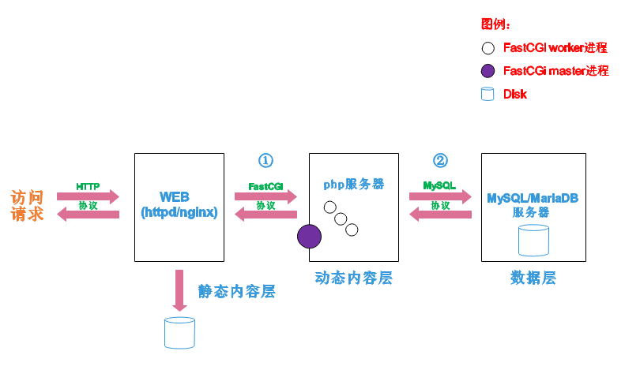

<!--more-->


## 1. lamp简介

有了前面学习的知识的铺垫，今天可以来学习下第一个常用的web架构了。

所谓lamp，其实就是由Linux+Apache+Mysql/MariaDB+Php/Perl/Python的一组动态网站或者服务器的开源软件，除Linux外其它各部件本身都是各自独立的程序，但是因为经常被放在一起使用，拥有了越来越高的兼容度，共同组成了一个强大的Web应用程序平台。

LAMP指的是Linux（操作系统）、Apache（HTTP服务器）、MySQL（也指MariaDB，数据库软件）和PHP（有时也是指Perl或Python）的第一个字母，一般用来建立web应用平台。

## 2. web服务器工作流程

在说lamp架构平台的搭建前，我们先来了解下什么是CGI，什么是FastCGI，什么是......

web服务器的资源分为两种，静态资源和动态资源

 - 静态资源就是指静态内容，客户端从服务器获得的资源的表现形式与原文件相同。可以简单的理解为就是直接存储于文件系统中的资源
 - 动态资源则通常是程序文件，需要在服务器执行之后，将执行的结果返回给客户端

那么web服务器如何执行程序并将结果返回给客户端呢？下面通过一张图来说明一下web服务器如何处理客户端的请求



如上图所示

阶段①显示的是**httpd服务器（即apache）和php服务器通过FastCGI协议进行通信**，且php作为独立的服务进程运行

阶段②显示的是**php程序和mysql数据库间通过mysql协议进行通信**。php与mysql本没有什么联系，但是由Php语言写成的程序可以与mysql进行数据交互。同理perl和python写的程序也可以与mysql数据库进行交互

### 2.1 cgi与fastcgi

上图阶段①中提到了FastCGI，下面我们来了解下CGI与FastCGI。

> CGI（Common Gateway Interface，通用网关接口），CGI是外部应用程序（CGI程序）与WEB服务器之间的接口标准，是在CGI程序和Web服务器之间传递信息的过程。CGI规范允许Web服务器执行外部程序，并将它们的输出发送给Web浏览器，CGI将web的一组简单的静态超媒体文档变成一个完整的新的交互式媒体。
>
> FastCGI（Fast Common Gateway Interface）是CGI的改良版，CGI是通过启用一个解释器进程来处理每个请求，耗时且耗资源，而FastCGI则是通过master-worker形式来处理每个请求，即启动一个master主进程，然后根据配置启动几个worker进程，当请求进来时，master会从worker进程中选择一个去处理请求，这样就避免了重复的生成和杀死进程带来的频繁cpu上下文切换而导致耗时

### 2.2 httpd与php结合的方式

httpd与php结合的方式有以下三种：

 - modules：php将以httpd的扩展模块形式存在，需要加载动态资源时，httpd可以直接通过php模块来加工资源并返回给客户端
	 - httpd prefork：libphp5.so（多进程模型的php）
	 - httpd event or worker：libphp5-zts.so（线程模型的php）
 - CGI：httpd需要加载动态资源时，通过CGI与php解释器联系，获得php执行的结果，此时httpd负责与php连接的建立和断开等
 - FastCGI：利用php-fpm机制，启动为服务进程，php自行运行为一个服务，https通过socket与php通信

**较于CGI方式，FastCGI更为常用，很少有人使用CGI方式来加载动态资源**

### 2.3 web工作流程

通过上面的图说明一下web的工作流程：

 - 客户端通过http协议请求web服务器资源
 - web服务器收到请求后判断客户端请求的资源是静态资源或是动态资源
	 - 若是静态资源则直接从本地文件系统取之返回给客户端。
	 - 否则若为动态资源则通过FastCGI协议与php服务器联系，通过CGI程序的master进程调度worker进程来执行程序以获得客户端请求的动态资源，并将执行的结果通过FastCGI协议返回给httpd服务器，httpd服务器收到php的执行结果后将其封装为http响应报文响应给客户端。在执行程序获取动态资源时若需要获得数据库中的资源时，由Php服务器通过mysql协议与MySQL/MariaDB服务器交互，取之而后返回给httpd，httpd将从php服务器收到的执行结果封装成http响应报文响应给客户端。

## 3. lamp平台构建

**环境说明：**

| 系统平台            | IP              | 需要安装的服务                                |
| :------------------ | :-------------- | :-------------------------------------------- |
| centos7 <br>redhat7 | 192.168.161.130 | httpd-2.4 <br>mysql-5.7 <br>php<br> php-mysql |

lamp平台软件安装次序：

```
    httpd --> mysql --> php
```

**注意：php要求httpd使用prefork MPM**

### 3.1 安装httpd

```
安装开发工具包
[root@localhost ~]# yum groups mark install 'Development Tools'

创建apache服务的用户和组
[root@localhost ~]# groupadd -r apache
[root@localhost ~]# useradd -r -M -s /sbin/nologin -g apache apache 

安装依赖包
[root@localhost ~]# yum -y install openssl-devel pcre-devel expat-devel libtool

下载和安装apr以及apr-util
[root@localhost ~]# cd /usr/src/
[root@localhost src]# wget http://mirrors.shu.edu.cn/apache//apr/apr-1.6.5.tar.bz2
[root@localhost src]# wget http://mirrors.shu.edu.cn/apache//apr/apr-util-1.6.1.tar.bz2
[root@localhost src]# ls
apr-1.6.5.tar.bz2  apr-util-1.6.1.tar.bz2  debug  kernels
[root@localhost src]# tar xf apr-1.6.5.tar.bz2
[root@localhost src]# tar xf apr-util-1.6.1.tar.bz2
[root@localhost src]# ls
apr-1.6.5  apr-1.6.5.tar.bz2  apr-util-1.6.1  apr-util-1.6.1.tar.bz2  debug  kernels
[root@localhost src]# cd apr-1.6.5
[root@localhost apr-1.6.5]# vim configure
    cfgfile="${ofile}T"
    trap "$RM \"$cfgfile\"; exit 1" 1 2 15
    # $RM "$cfgfile"        //将此行加上注释，或者删除此行

[root@localhost apr-1.6.5]# ./configure --prefix=/usr/local/apr
[root@localhost apr-1.6.5]# make && make install
[root@localhost apr-1.6.5]# cd /usr/src/apr-util-1.6.1
[root@localhost apr-util-1.6.1]# ./configure --prefix=/usr/local/apr-util --with-apr=/usr/local/apr
[root@localhost apr-util-1.6.1]# make && make install

编译安装httpd
[root@localhost ~]# wget http://mirror.bit.edu.cn/apache//httpd/httpd-2.4.37.tar.bz2

[root@localhost ~]# ls
httpd-2.4.37.tar.bz2
[root@localhost ~]# tar xf httpd-2.4.37.tar.bz2
[root@localhost ~]# cd httpd-2.4.37
[root@localhost httpd-2.4.37]# ./configure --prefix=/usr/local/apache \
--sysconfdir=/etc/httpd24 \
--enable-so \
--enable-ssl \
--enable-cgi \
--enable-rewrite \
--with-zlib \
--with-pcre \
--with-apr=/usr/local/apr \
--with-apr-util=/usr/local/apr-util/ \
--enable-modules=most \
--enable-mpms-shared=all \
--with-mpm=prefork

[root@localhost httpd-2.4.37]# make && make install

安装后配置
[root@localhost ~]# echo 'export PATH=/usr/local/apache/bin:$PATH' > /etc/profile.d/httpd.sh
[root@localhost ~]# source /etc/profile.d/httpd.sh
[root@localhost ~]# ln -s /usr/local/apache/include/ /usr/include/httpd
[root@localhost ~]# echo 'MANPATH /usr/local/apache/man' >> /etc/man.config

取消ServerName前面的注释
[root@localhost ~]# sed -i '/#ServerName/s/#//g' /etc/httpd24/httpd.conf 

启动apache
[root@localhost ~]# apachectl start
[root@localhost ~]# ss -antl
State      Recv-Q Send-Q   Local Address:Port                  Peer Address:Port
LISTEN     0      128                  *:22                               *:*
LISTEN     0      100          127.0.0.1:25                               *:*
LISTEN     0      128                 :::80                              :::*
LISTEN     0      128                 :::22                              :::*
LISTEN     0      100                ::1:25                              :::* 
```

### 3.2 安装mysql

```
安装依赖包
[root@localhost ~]# yum -y install ncurses-devel openssl-devel openssl cmake mariadb-devel


创建用户和组
[root@localhost src]# groupadd -r -g 306 mysql
[root@localhost src]# useradd -M -s /sbin/nologin -g 306 -u 306 mysql


下载二进制格式的mysql软件包
[root@localhost ~]# cd /usr/src/
[root@localhost src]# wget https://downloads.mysql.com/archives/get/file/mysql-5.7.22-linux-glibc2.12-x86_64.tar.gz
--2018-08-13 23:56:27--  https://downloads.mysql.com/archives/get/file/mysql-5.7.22-linux-glibc2.12-x86_64.tar.gz
Resolving downloads.mysql.com (downloads.mysql.com)... 137.254.60.14
Connecting to downloads.mysql.com (downloads.mysql.com)|137.254.60.14|:443... connected.
HTTP request sent, awaiting response... 302 Found
Location: https://cdn.mysql.com/archives/mysql-5.7/mysql-5.7.22-linux-glibc2.12-x86_64.tar.gz [following]
......
Saving to: ‘mysql-5.7.22-linux-glibc2.12-x86_64.tar.gz’

100%[=====================================>] 643,790,848 2.46MB/s   in 4m 20s

2018-08-14 00:00:50 (2.36 MB/s) - ‘mysql-5.7.22-linux-glibc2.12-x86_64.tar.gz’saved [643790848/643790848]


解压软件至/usr/local/
[root@localhost src]# ls
debug  kernels  mysql-5.7.22-linux-glibc2.12-x86_64.tar.gz
[root@localhost src]# tar xf mysql-5.7.22-linux-glibc2.12-x86_64.tar.gz -C /usr/local/
[root@localhost ~]# ls /usr/local/
bin  games    lib    libexec                              sbin   src
etc  include  lib64  mysql-5.7.22-linux-glibc2.12-x86_64  share
[root@localhost ~]# cd /usr/local/
[root@localhost local]# ln -sv mysql-5.7.22-linux-glibc2.12-x86_64/ mysql
‘mysql’ -> ‘mysql-5.7.22-linux-glibc2.12-x86_64/’
[root@localhost local]# ll
total 0
drwxr-xr-x. 2 root root   6 Mar 10  2016 bin
drwxr-xr-x. 2 root root   6 Mar 10  2016 etc
drwxr-xr-x. 2 root root   6 Mar 10  2016 games
drwxr-xr-x. 2 root root   6 Mar 10  2016 include
drwxr-xr-x. 2 root root   6 Mar 10  2016 lib
drwxr-xr-x. 2 root root   6 Mar 10  2016 lib64
drwxr-xr-x. 2 root root   6 Mar 10  2016 libexec
lrwxrwxrwx  1 root root  36 Aug 14 16:00 mysql -> mysql-5.7.22-linux-glibc2.12-x86_64/
drwxr-xr-x  9 root root 129 Aug 14 00:16 mysql-5.7.22-linux-glibc2.12-x86_64
drwxr-xr-x. 2 root root   6 Mar 10  2016 sbin
drwxr-xr-x. 5 root root  49 Jun 13 19:03 share
drwxr-xr-x. 2 root root   6 Mar 10  2016 src


修改目录/usr/local/mysql的属主属组
[root@localhost ~]# chown -R mysql.mysql /usr/local/mysql
[root@localhost ~]# ll /usr/local/mysql -d
lrwxrwxrwx 1 mysql mysql 36 Aug 14 16:00 /usr/local/mysql -> mysql-5.7.22-linux-glibc2.12-x86_64/


添加环境变量
[root@localhost ~]# ls /usr/local/mysql
bin  COPYING  docs  include  lib  man  README  share  support-files
[root@localhost ~]# echo 'export PATH=/usr/local/mysql/bin:$PATH' > /etc/profile.d/mysql.sh
[root@localhost ~]# . /etc/profile.d/mysql.sh
[root@localhost ~]# echo $PATH
/usr/local/mysql/bin:/usr/local/sbin:/usr/local/bin:/usr/sbin:/usr/bin:/root/bin


建立数据存放目录
[root@localhost mysql]# mkdir /opt/data
[root@localhost mysql]# chown -R mysql.mysql /opt/data/
[root@localhost mysql]# ll /opt/
total 0
drwxr-xr-x 2 mysql mysql 6 Aug 14 16:54 data


初始化数据库
[root@localhost ~]# /usr/local/mysql/bin/mysqld --initialize --user=mysql --datadir=/opt/data/
.......
temporary password is generatedfor root@localhost: adjceSV12=Sa
请注意，这个命令的最后会生成一个临时密码，此处密码是adjceSV12=Sa


配置mysql
[root@localhost ~]# ln -sv /usr/local/mysql/include/ /usr/local/include/mysql
‘/usr/local/include/mysql’ -> ‘/usr/local/mysql/include/’
[root@localhost ~]# echo '/usr/local/mysql/lib' > /etc/ld.so.conf.d/mysql.conf
[root@localhost ~]# ldconfig -v
ldconfig: Can't stat /libx32: No such file or directory
ldconfig: Path `/usr/lib' given more than once
ldconfig: Path `/usr/lib64' given more than once
ldconfig: Can't stat /usr/libx32: No such file or directory
/usr/lib64/mysql:
        libmysqlclient.so.18 -> libmysqlclient_r.so
/usr/local/mysql/lib:
        libmysqlclient.so.20 -> libmysqlclient.so.20.3.9 
......
/lib/sse2: (hwcap: 0x0000000004000000)
/lib64/sse2: (hwcap: 0x0000000004000000)
/lib64/tls: (hwcap: 0x8000000000000000)
[root@localhost ~]# ldconfig -p |grep mysql
        libmysqlclient.so.20 (libc6,x86-64) => /usr/local/mysql/lib/libmysqlclient.so.20
        libmysqlclient.so.18 (libc6,x86-64) => /usr/lib64/mysql/libmysqlclient.so.18
        libmysqlclient.so (libc6,x86-64) => /usr/lib64/mysql/libmysqlclient.so
        libmysqlclient.so (libc6,x86-64) => /usr/local/mysql/lib/libmysqlclient.so
        

生成配置文件
[root@localhost ~]# cat > /etc/my.cnf <<EOF
[mysqld]
basedir = /usr/local/mysql
datadir = /opt/data
socket = /tmp/mysql.sock
port = 3306
pid-file = /opt/data/mysql.pid
user = mysql
skip-name-resolve
EOF


配置服务启动脚本
[root@localhost ~]# cp -a /usr/local/mysql/support-files/mysql.server /etc/init.d/mysqld
[root@localhost ~]# sed -ri 's#^(basedir=).*#\1/usr/local/mysql#g' /etc/init.d/mysqld
[root@localhost ~]# sed -ri 's#^(datadir=).*#\1/opt/data#g' /etc/init.d/mysqld


启动mysql
[root@localhost ~]# service mysqld start
Starting MySQL.. SUCCESS!  
[root@localhost ~]# ps -ef|grep mysql
root       1521      1  0 01:58 pts/0    00:00:00 /bin/sh /usr/local/mysql/binmysqld_safe --datadir=/opt/data --pid-file=/opt/data/mysql.pid
mysql      1699   1521  0 01:58 pts/0    00:00:00 /usr/local/mysql/bin/mysqld --basedir=/usr/local/mysql --datadir=/opt/data --plugin-dir=/usr/local/mysql/lib/plugin --user=mysql --log-error=localhost.localdomain.err --pid-file=/opt/data/mysql.pid --socket=/tmp/mysql.sock --port=3306
root       1734   1301  0 01:59 pts/0    00:00:00 grep --color=auto mysql
[root@localhost ~]# ss -antl
State       Recv-Q Send-Q Local Address:Port               Peer Address:Port
LISTEN      0      128         *:22                      *:*
LISTEN      0      100    127.0.0.1:25                      *:*
LISTEN      0      128        :::22                     :::*
LISTEN      0      100       ::1:25                     :::*
LISTEN      0      80         :::3306                   :::* 
 
 

修改密码
使用临时密码登录
[root@localhost ~]# mysql -uroot -p
Enter password:
Welcome to the MySQL monitor.  Commands end with ; or \g.
Your MySQL connection id is 2
Server version: 5.7.22

Copyright (c) 2000, 2018, Oracle and/or its affiliates. All rights reserved.

Oracle is a registered trademark of Oracle Corporation and/or its
affiliates. Other names may be trademarks of their respective
owners.

Type 'help;' or '\h' for help. Type '\c' to clear the current input statement.

mysql> 

设置新密码
mysql> set password = password('itwhs123[');
Query OK, 0 rows affected, 1 warning (0.00 sec)
mysql> quit
Bye
```

### 3.3 安装php

```
配置yum源
[root@localhost ~]# cd /etc/yum.repos.d/
[root@localhost yum.repos.d]# wget http://mirrors.163.com/.help/CentOS7-Base-163.repo
[root@localhost ~]# sed -i 's/\$releasever/7/g' /etc/yum.repos.d/CentOS7-Base-163.repo
[root@localhost ~]# sed -i 's/^enabled=.*/enabled=1/g' /etc/yum.repos.d/CentOS7-Base-163.repo
[root@localhost ~]# yum -y install epel-release
[root@localhost ~]# rpm -Uvh https://mirror.webtatic.com/yum/el7/webtatic-release.rpm


安装依赖包
[root@localhost ~]# yum -y install libxml2 libxml2-devel openssl openssl-devel bzip2 bzip2-devel libcurl libcurl-devel libicu-devel libjpeg libjpeg-devel libpng libpng-devel openldap-devel  libpcre-devel freetype freetype-devel gmp gmp-devel libmcrypt libmcrypt-devel readline readline-devel libxslt libxslt-devel mhash mhash-devel php72w-mysqlnd


下载php
[root@localhost ~]# cd /usr/src/
[root@localhost src]# wget http://cn.php.net/distributions/php-7.2.8.tar.xz


编译安装php
[root@localhost src]# tar xf php-7.2.8.tar.xz
[root@localhost src]# cd php-7.2.8
[root@localhost php-7.2.8]# ./configure --prefix=/usr/local/php7  \
--with-config-file-path=/etc \
--enable-fpm \
--enable-inline-optimization \
--disable-debug \
--disable-rpath \
--enable-shared \
--enable-soap \
--with-openssl \
--enable-bcmath \
--with-iconv \
--with-bz2 \
--enable-calendar \
--with-curl \
--enable-exif  \
--enable-ftp \
--with-gd \
--with-jpeg-dir \
--with-png-dir \
--with-zlib-dir \
--with-freetype-dir \
--with-gettext \
--enable-json \
--enable-mbstring \
--enable-pdo \
--with-mysqli=mysqlnd \
--with-pdo-mysql=mysqlnd \
--with-readline \
--enable-shmop \
--enable-simplexml \
--enable-sockets \
--enable-zip \
--enable-mysqlnd-compression-support \
--with-pear \
--enable-pcntl \
--enable-posix
[root@localhost php-7.2.8]# make -j $(cat /proc/cpuinfo |grep processor|wc -l)
编译过程略
[root@localhost php-7.2.8]# make install
安装过程略


安装后配置
[root@localhost ~]# echo 'export PATH=/usr/local/php7/bin:$PATH' > /etc/profile.d/php7.sh
[root@localhost ~]# source /etc/profile.d/php7.sh
[root@localhost php-7.2.8]# which php
/usr/local/php7/bin/php
[root@localhost php-7.2.8]# php -v
PHP 7.2.8 (cli) (built: May 14 2019 14:32:34) ( NTS )
Copyright (c) 1997-2018 The PHP Group
Zend Engine v3.2.0, Copyright (c) 1998-2018 Zend Technologies


配置php-fpm
[root@localhost php-7.2.8]# cp php.ini-production /etc/php.ini
[root@localhost php-7.2.8]# cp sapi/fpm/init.d.php-fpm /etc/init.d/php-fpm
[root@localhost php-7.2.8]# chmod +x /etc/rc.d/init.d/php-fpm
[root@localhost php-7.2.8]# cp /usr/local/php7/etc/php-fpm.conf.default /usr/local/php7/etc/php-fpm.conf
[root@localhost php-7.2.8]# cp /usr/local/php7/etc/php-fpm.d/www.conf.default /usr/local/php7/etc/php-fpm.d/www.conf

编辑php-fpm的配置文件（/usr/local/php7/etc/php-fpm.conf）：
配置fpm的相关选项为你所需要的值：
[root@localhost ~]# vim /usr/local/php7/etc/php-fpm.conf
.....
.....
pm.max_children = 50    //最多同时提供50个进程提供50个并发服务
pm.start_servers = 5    //启动时启动5个进程
pm.min_spare_servers = 2    //最小空闲进程数
pm.max_spare_servers = 8    //最大空闲进程数

[root@localhost ~]# tail /usr/local/php7/etc/php-fpm.conf
; file.
; Relative path can also be used. They will be prefixed by:
;  - the global prefix if it's been set (-p argument)
;  - /usr/local/php7 otherwise
include=/usr/local/php7/etc/php-fpm.d/*.conf
pm.max_children = 50
pm.start_servers = 5
pm.min_spare_servers = 2
pm.max_spare_servers = 8


启动php-fpm
[root@localhost ~]# service php-fpm start
Starting php-fpm  done

默认情况下，fpm监听在127.0.0.1的9000端口，也可以使用如下命令验证其是否已经监听在相应的套接字
[root@localhost ~]# ss -antl
State      Recv-Q Send-Q           Local Address:Port                          Peer Address:Port
LISTEN     0      128                          *:22                                       *:*
LISTEN     0      100                  127.0.0.1:25                                       *:*
LISTEN     0      128                  127.0.0.1:9000                                     *:*
LISTEN     0      128                         :::80                                      :::*
LISTEN     0      128                         :::22                                      :::*
LISTEN     0      100                        ::1:25                                      :::*
LISTEN     0      80                          :::3306                                    :::*

[root@localhost ~]# ps -ef|grep php
root      81070      1  0 14:13 ?        00:00:00 php-fpm: master process (/usr/local/php7/etc/php-fpm.conf)
nobody    81071  81070  0 14:13 ?        00:00:00 php-fpm: pool www
nobody    81072  81070  0 14:13 ?        00:00:00 php-fpm: pool www
nobody    81073  81070  0 14:13 ?        00:00:00 php-fpm: pool www
nobody    81074  81070  0 14:13 ?        00:00:00 php-fpm: pool www
nobody    81075  81070  0 14:13 ?        00:00:00 php-fpm: pool www
root      81079  83354  0 14:15 pts/1    00:00:00 grep --color=auto php
```

### 3.4 配置apache

#### 3.4.1 启用代理模块

在apache httpd 2.4以后已经专门有一个模块针对FastCGI的实现，此模块为mod_proxy_fcgi.so，它其实是作为mod_proxy.so模块的扩展，因此，这两个模块都要加载，编辑httpd.conf文件，取消以下两行内容的注释:

 - LoadModule proxy_module modules/mod_proxy.so
 - LoadModule proxy_fcgi_module modules/mod_proxy_fcgi.so

```
//启用httpd的相关模块
[root@localhost ~]# sed -i '/proxy_module/s/#//g' /etc/httpd24/httpd.conf
[root@localhost ~]# sed -i '/proxy_fcgi_module/s/#//g' /etc/httpd24/httpd.conf
```

#### 3.4.2 配置虚拟主机

在需要使用fcgi的虚拟主机中添加类似如下两行：

```
ProxyRequests Off       //关闭正向代理
ProxyPassMatch ^/(.*\.php)$ fcgi://127.0.0.1:9000/PATH/TO/DOCUMENT_ROOT/$1
```

**例如：**

```
ProxyPassMatch ^/(.*\.php)$ fcgi://127.0.0.1:9000/var/www/html/itwhs.com/$1
```

以上设置表示把以.php结尾的文件请求发送到php-fpm进程，php-fpm至少需要知道运行的目录和URI，所以这里直接在fcgi://127.0.0.1:9000后指明了这两个参数，其它参数的传递已经被mod_proxy_fcgi.so进行了封装，不需要手动指定。

**注意：**

> 这里写的/var/www/html/是yum源安装方式生成的网页存放目录，这里必须改成你编译安装指定的网页存放路径，禁止直接复制我这里的路径
> 这里的idfsoft.com是域名，你必须改成你所使用的域名，禁止直接复制此处的域名
> 这里的$1表示匹配所有以.php结尾的http请求

```
创建虚拟主机目录并生成php测试页面
[root@localhost ~]# mkdir /usr/local/apache/htdocs/itwhs.com
[root@localhost ~]# cat > /usr/local/apache/htdocs/itwhs.com/index.php <<EOF
<?php
   phpinfo();
?>
EOF
[root@localhost ~]# chown -R apache.apache /usr/local/apache/htdocs/
[root@localhost ~]# ll /usr/local/apache/htdocs/ -d
drwxr-xr-x 3 apache apache 44 Aug 16 14:50 /usr/local/apache/htdocs/


[root@localhost ~]# vim /etc/httpd24/httpd.conf
在配置文件的最后加入以下内容
<VirtualHost *:80>
    DocumentRoot "/usr/local/apache/htdocs/itwhs.com"
    ServerName www.itwhs.com
    ProxyRequests Off
    ProxyPassMatch ^/(.*\.php)$ fcgi://127.0.0.1:9000/usr/local/apache/htdocs/itwhs.com/$1
    <Directory "/usr/local/apache/htdocs/itwhs.com">
        Options none
        AllowOverride none
        Require all granted
    </Directory>
</VirtualHost>  

[root@localhost ~]# vim /etc/httpd24/httpd.conf
搜索AddType，添加以下内容
    # If the AddEncoding directives above are commented-out, then you
    # probably should define those extensions to indicate media types:
    #
    AddType application/x-compress .Z
    AddType application/x-gzip .gz .tgz
    AddType application/x-httpd-php .php        //添加此行
    AddType application/x-httpd-php-source .phps        //添加此行
    
[root@localhost ~]# sed -i '/    DirectoryIndex/s/index.html/index.php index.html/g' /etc/httpd24/httpd.conf


重启apache服务
[root@localhost ~]# apachectl stop
[root@localhost ~]# ss -antl
State      Recv-Q Send-Q           Local Address:Port                          Peer Address:Port
LISTEN     0      128                          *:22                                       *:*
LISTEN     0      100                  127.0.0.1:25                                       *:*
LISTEN     0      128                  127.0.0.1:9000                                     *:*
LISTEN     0      128                         :::22                                      :::*
LISTEN     0      100                        ::1:25                                      :::*
LISTEN     0      80                          :::3306                                    :::*
[root@localhost ~]# apachectl start
[root@localhost ~]# ss -antl
State      Recv-Q Send-Q           Local Address:Port                          Peer Address:Port
LISTEN     0      128                          *:22                                       *:*
LISTEN     0      100                  127.0.0.1:25                                       *:*
LISTEN     0      128                  127.0.0.1:9000                                     *:*
LISTEN     0      128                         :::80                                      :::*
LISTEN     0      128                         :::22                                      :::*
LISTEN     0      100                        ::1:25                                      :::*
LISTEN     0      80                          :::3306                                    :::* 
```

### 3.5 验证

1.修改/etc/hosts文件，添加域名与IP的映射
2.在浏览器上使用域名访问，若看到以下界面则表示lamp架构搭建成功，否则请检查你的操作

