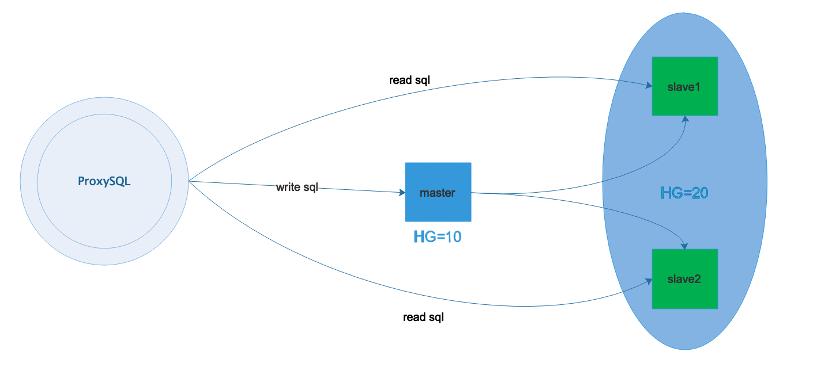
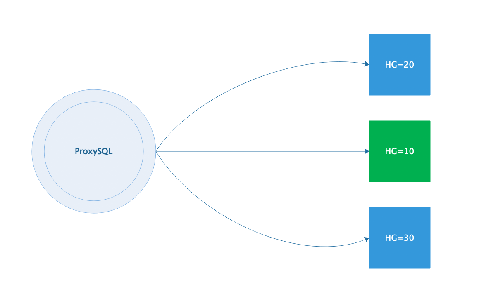
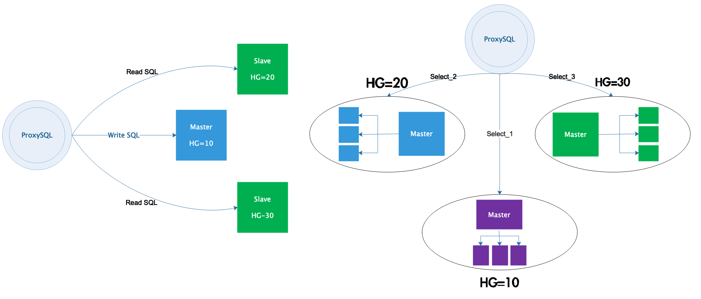

<!--more-->

## 1. mysql实现读写分离的方式

mysql 实现读写分离的方式有以下几种：

 - 程序修改mysql操作，直接和数据库通信，简单快捷的读写分离和随机的方式实现的负载均衡，权限独立分配，需要开发人员协助。
 - amoeba，直接实现读写分离和负载均衡，不用修改代码，有很灵活的数据解决方案，自己分配账户，和后端数据库权限管理独立，权限处理不够灵活。
 - mysql-proxy，直接实现读写分离和负载均衡，不用修改代码，master和slave用一样的帐号，效率低
 - mycat中间件
 - proxysql中间件（推荐使用）

## 2. ProxySQL简介

ProxySQL 是一款可以实际用于生产环境的 MySQL 中间件，它有官方版和 percona 版两种。percona版是在官方版的基础上修改的，添加了几个比较实用的工具。生产环境建议用官方版。

ProxySQL 是用 C++ 语言开发的，虽然也是一个轻量级产品，但性能很好(据测试，能处理千亿级的数据)，功能也足够，能满足中间件所需的绝大多数功能，包括：

 - 最基本的读/写分离，且方式有多种
 - 可定制基于用户、基于schema、基于语句的规则对SQL语句进行路由。换句话说，规则很灵活。基于schema和与语句级的规则，可以实现简单的sharding(分库分表)
 - 可缓存查询结果。虽然ProxySQL的缓存策略比较简陋，但实现了基本的缓存功能，绝大多数时候也够用了。此外，作者已经打算实现更丰富的缓存策略
 - 监控后端节点。ProxySQL可以监控后端节点的多个指标，包括：ProxySQL和后端的心跳信息，后端节点的read-only/read-write，slave和master的数据同步延迟性(replication lag)

## 3. ProxySQL安装

```
//配置yum源
[root@proxysql ~]# cat <<EOF | tee /etc/yum.repos.d/proxysql.repo
[proxysql_repo]
name= ProxySQL
baseurl=http://repo.proxysql.com/ProxySQL/proxysql-1.4.x/centos/7
gpgcheck=1
gpgkey=http://repo.proxysql.com/ProxySQL/repo_pub_key
EOF

[root@proxysql ~]# yum -y install proxysql
```

## 4. ProxySQL的Admin管理接口

当 ProxySQL 启动后，将监听两个端口：

 - admin管理接口，默认端口为6032。该端口用于查看、配置ProxySQL
 - 接收SQL语句的接口，默认端口为6033，这个接口类似于MySQL的3306端口


ProxySQL 的 admin 管理接口是一个使用 MySQL 协议的接口，所以，可以直接使用 mysql 客户端、navicat 等工具去连接这个管理接口，其默认的用户名和密码均为 admin

例如，使用 mysql 客户端去连接 ProxySQL 的管理接口：

```
[root@proxysql ~]# mysql -uadmin -padmin -h127.0.0.1 -P6032
Welcome to the MariaDB monitor.  Commands end with ; or \g.
Your MySQL connection id is 6
Server version: 5.5.30 (ProxySQL Admin Module)

Copyright (c) 2000, 2018, Oracle, MariaDB Corporation Ab and others.

Type 'help;' or '\h' for help. Type '\c' to clear the current input statement.

MySQL [(none)]> show databases;
+-----+---------------+-------------------------------------+
| seq | name          | file                                |
+-----+---------------+-------------------------------------+
| 0   | main          |                                     |
| 2   | disk          | /var/lib/proxysql/proxysql.db       |
| 3   | stats         |                                     |
| 4   | monitor       |                                     |
| 5   | stats_history | /var/lib/proxysql/proxysql_stats.db |
+-----+---------------+-------------------------------------+
5 rows in set (0.00 sec)
```

由于 ProxySQL 的配置全部保存在几个自带的库中，所以通过管理接口，可以非常方便地通过发送一些SQL命令去修改 ProxySQL 的配置。 ProxySQL 会解析通过该接口发送的某些对ProxySQL 有效的特定命令，并将其合理转换后发送给内嵌的 SQLite3 数据库引擎去运行

ProxySQL 的配置几乎都是通过管理接口来操作的，通过 Admin 管理接口，可以在线修改几乎所有的配置并使其生效。只有两个变量的配置是必须重启 ProxySQL 才能生效的，它们是：
**mysql-threads 和 mysql-stacksize**

## 5. 和admin管理接口相关的变量

### 5.1 admin-admin_credentials

admin-admin_credentials 变量控制的是admin管理接口的管理员账户。默认的管理员账户和密码为admin:admin，但是这个默认的用户只能在本地使用。如果想要远程连接到ProxySQL，例如用windows上的navicat连接Linux上的ProxySQL管理接口，必须自定义一个管理员账户。

**添加管理员帐户**

```
MySQL [(none)]> select @@admin-admin_credentials;       //查看当前用户名和密码
+---------------------------+
| @@admin-admin_credentials |
+---------------------------+
| admin:admin               |
+---------------------------+
1 row in set (0.01 sec)

//设置管理员帐号myadmin,密码wangqing123!
MySQL [(none)]> set admin-admin_credentials='admin:admin;myadmin:wangqing123!';
Query OK, 1 row affected (0.00 sec)

MySQL [(none)]> select @@admin-admin_credentials;
+----------------------------------+
| @@admin-admin_credentials        |
+----------------------------------+
| admin:admin;runtime:wangqing123! |
+----------------------------------+
1 row in set (0.00 sec)

MySQL [(none)]> load admin variables to runtime;    //使修改立即生效
Query OK, 0 rows affected (0.01 sec)

MySQL [(none)]> save admin variables to disk;   //使修改永久保存到磁盘
Query OK, 31 rows affected (0.00 sec)
```

修改后，就可以使用该用户名和密码连接管理接口

```
[root@proxysql ~]# mysql -umyadmin -pwangqing123! -h172.16.12.128 -P6032
Welcome to the MariaDB monitor.  Commands end with ; or \g.
Your MySQL connection id is 7
Server version: 5.5.30 (ProxySQL Admin Module)

Copyright (c) 2000, 2018, Oracle, MariaDB Corporation Ab and others.

Type 'help;' or '\h' for help. Type '\c' to clear the current input statement.

MySQL [(none)]> 
```

所有的配置操作都是在修改main库中对应的表

```
MySQL [(none)]> select * from global_variables where variable_name='admin-admin_credentials';
+-------------------------+----------------------------------+
| variable_name           | variable_value                   |
+-------------------------+----------------------------------+
| admin-admin_credentials | admin:admin;myadmin:wangqing123! |
+-------------------------+----------------------------------+
1 row in set (0.00 sec)
```

**必须要区分admin管理接口的用户名和mysql_users中的用户名**

 - admin管理接口的用户是连接到管理接口(默认端口6032)上用来管理、配置ProxySQL的
 - mysql_users表中的用户名是应用程序连接ProxySQL(默认端口6033)，以及ProxySQL连接后端MySQL Servers使用的用户。它的作用是发送、路由SQL语句，类似于MySQL Server的3306端口。所以，这个表中的用户必须已经在后端MySQL Server上存在且授权了

**admin管理接口的用户必须不能存在于mysql_users中，这是出于安全的考虑，防止通过admin管理接口用户猜出mysql_users中的用户**

### 5.2 admin-stats_credentials

admin-stats_credentials 变量控制admin管理接口的普通用户，这个变量中的用户没有超级管理员权限，只能查看monitor库和main库中关于统计的数据，其它库都是不可见的，且没有任何写权限

默认的普通用户名和密码均为 stats ，与admin一样，它默认也只能用于本地登录，若想让人远程查看则要添加查看的专有用户

```
MySQL [(none)]> select @@admin-stats_credentials;
+---------------------------+
| @@admin-stats_credentials |
+---------------------------+
| stats:stats               |
+---------------------------+
1 row in set (0.00 sec)

//添加专有的查看用户
MySQL [(none)]> set admin-stats_credentials='stats:stats;mystats:wangqing123!';
Query OK, 1 row affected (0.00 sec)

MySQL [(none)]> select @@admin-stats_credentials;
+----------------------------------+
| @@admin-stats_credentials        |
+----------------------------------+
| stats:stats;mystats:wangqing123! |
+----------------------------------+
1 row in set (0.00 sec)

MySQL [(none)]> load admin variables to runtime;
Query OK, 0 rows affected (0.00 sec)

MySQL [(none)]> save admin variables to disk;
Query OK, 31 rows affected (0.00 sec)
```

同样，**这个变量中的用户必须不能存在于mysql_users表中**
使用mystats用户远程连接查看

```
[root@proxysql ~]# mysql -umystats -pwangqing123! -h172.16.12.128 -P6032
Welcome to the MariaDB monitor.  Commands end with ; or \g.
Your MySQL connection id is 11
Server version: 5.5.30 (ProxySQL Admin Module)

Copyright (c) 2000, 2018, Oracle, MariaDB Corporation Ab and others.

Type 'help;' or '\h' for help. Type '\c' to clear the current input statement.

MySQL [(none)]>

MySQL [(none)]> show tables from main;
+--------------------------------------+
| tables                               |
+--------------------------------------+
| global_variables                     |    
| stats_memory_metrics                 |
| stats_mysql_commands_counters        |
| stats_mysql_connection_pool          |
| stats_mysql_connection_pool_reset    |
| stats_mysql_global                   |
| stats_mysql_prepared_statements_info |
| stats_mysql_processlist              |
| stats_mysql_query_digest             |
| stats_mysql_query_digest_reset       |
| stats_mysql_query_rules              |
| stats_mysql_users                    |
| stats_proxysql_servers_checksums     |
| stats_proxysql_servers_metrics       |
| stats_proxysql_servers_status        |
+--------------------------------------+
15 rows in set (0.00 sec)
```

### 5.3 admin-mysql_ifaces

admin-mysql_ifaces 变量指定admin接口的监听地址，格式为冒号分隔的hostname:port列表。默认监听在 0.0.0.0:6032

注意，允许使用UNIX的domain socket进行监听，这样本主机内的应用程序就可以直接被处理。
例如：

```
MySQL [(none)]> SET admin-mysql_ifaces='0.0.0.0:6032;/tmp/proxysql_admin.sock';
Query OK, 1 row affected (0.00 sec)

MySQL [(none)]> load admin variables to runtime;
Query OK, 0 rows affected (0.00 sec)

MySQL [(none)]> save admin variables to disk;
Query OK, 31 rows affected (0.00 sec)
```

## 6. 多层配置系统

### 6.1 proxysql中的库

**使用ProxySQL的Admin管理接口连上ProxySQL，可查看ProxySQL拥有的库**

```
[root@proxysql ~]# mysql -umyadmin -pwangqing123! -h172.16.12.128 -P6032
Welcome to the MariaDB monitor.  Commands end with ; or \g.
Your MySQL connection id is 14
Server version: 5.5.30 (ProxySQL Admin Module)

Copyright (c) 2000, 2018, Oracle, MariaDB Corporation Ab and others.

Type 'help;' or '\h' for help. Type '\c' to clear the current input statement.

MySQL [(none)]> show databases;
+-----+---------------+-------------------------------------+
| seq | name          | file                                |
+-----+---------------+-------------------------------------+
| 0   | main          |                                     |
| 2   | disk          | /var/lib/proxysql/proxysql.db       |
| 3   | stats         |                                     |
| 4   | monitor       |                                     |
| 5   | stats_history | /var/lib/proxysql/proxysql_stats.db |
+-----+---------------+-------------------------------------+
5 rows in set (0.00 sec)
```

其中：

 - main库是ProxySQL最主要的库，是需要修改配置时使用的库，它其实是一个内存数据库系统。所以，修改main库中的配置后，必须将其持久化到disk上才能永久保存
 - disk库是磁盘数据库，该数据库结构和内存数据库完全一致。当持久化内存数据库中的配置时，其实就是写入到disk库中。磁盘数据库的默认路径为 $DATADIR/proxysql.db
 - stats库是统计信息库。这个库中的数据一般是在检索其内数据时临时填充的，它保存在内存中。因为没有相关的配置项，所以无需持久化
 - monitor库是监控后端MySQL节点相关的库，该库中只有几个log类的表，监控模块收集到的监控信息全都存放到对应的log表中
 - stats_history库是1.4.4版新增的库，用于存放历史统计数据。默认路径为 $DATADIR/proxysql_stats.db

ProxySQL 内部使用的是 SQLite3 数据库，无论是内存数据库还是磁盘数据库，都是通过SQLite3引 擎进行解析、操作的。它和 MySQL 的语法可能稍有不同，但ProxySQL会对不兼容的语法自动进行调整，最大程度上保证MySQL语句的有效率。
上面描述main库的时候，只是说了内存数据库需要持久化到disk库才能永久保存配置。但实际上，修改了main库中的配置后，并不会立即生效，它还需要load到runtime的数据结构中才生效，只有在runtime数据结构中的配置才是对ProxySQL当前有效的配置

### 6.2 ProxySQL多层配置系统

ProxySQL 的配置系统非常强大，它能在线修改几乎所有配置(仅有的两个需要重启才能生效的变量为 mysql-threads 和 mysql-stacksize )，并在线生效、持久化保存。这得益于它采用的多层配置系统。
多层配置系统结构如下：

```
       +-------------------------+
       |         RUNTIME         |
       +-------------------------+
              /|\          |
               |           |
           [1] |       [2] |
               |          \|/
       +-------------------------+
       |         MEMORY          |
       +-------------------------+ _
              /|\          |      |\
               |           |        \
           [3] |       [4] |         \ [5]
               |          \|/         \
       +-------------------------+  +---------------+
       |          DISK           |  |  CONFIG FILE  |
       +-------------------------+  +---------------+
```

最底层的是 disk 库和 config file 。这里需要注意，这里的 config file 就是传统的配置文件，默认为 /etc/proxysql.cnf ， ProxySQL 启动时，主要是从 disk 库中读取配置加载到内存并最终加载到 runtime 生效，只有极少的几个特定配置内容是从 config file 中加载的，除非是第一次初始化 ProxySQL 运行环境(或者disk库为空)。

中间层的是 memory ，表示的是内存数据库，其实就是 main 库。通过管理接口修改的所有配置，都保存在内存数据库(main)中。当 ProxySQL 重启或者崩溃时，这个内存数据库中的数据会丢失，所以需要 save 到 disk 库中。

最上层的是 runtime ，它是 ProxySQL 有关线程运行时读取的数据结构。换句话说，该数据结构中的配置都是已生效的配置。所以，修改了 main 库中的配置后，必须 load 到 runtime 数据结构中才能使其生效。
在上面的多层配置系统图中，标注了[1]、[2]、[3]、[4]、[5]的序号。每个序号都有两个操作方向from/to，其实只是所站角度不同而已。以下是各序号对应的操作：

```
[1] ：将内存数据库中的配置加载到RUNTIME数据结构中
        LOAD XXX FROM MEMORY
        LOAD XXX TO RUNTIME

[2] ：将RUNTIME数据结构中的配置持久化到内存数据库中
        SAVE XXX FROM RUNTIME
        SAVE XXX TO MEMORY

[3] ：将磁盘数据库中的配置加载到内存数据库中
        LOAD XXX FROM DISK
        LOAD XXX TO MEMORY

[4] ：将内存数据库中的配置持久化到磁盘数据库中
        SAVE XXX FROM MEMORY
        SAVE XXX TO DISK

[5] ：从传统配置文件中读取配置加载到内存数据库中
        LOAD XXX FROM CONFIG
```

**DISK/MEMORY/RUNTIME/CONFIG 可以缩写，只要能识别即可。例如MEMORY可以缩写为MEM，runtime可以缩写为run**

另外，上面的XXX是什么？这表示要加载/保存的是哪类配置。目前的ProxySQL支持以下几种：

 - mysql users
 - mysql servers
 - mysql variables
 - mysql query rules
 - admin variables
 - scheduler
 - proxysql_servers：目前ProxySQL集群功能还处于实验阶段，所以该类配置不应该去使用

这些从main库或disk库中就可以查看到

```
MySQL [(none)]> show tables from disk;
+------------------------------------+
| tables                             |
+------------------------------------+
| global_variables                   |  # (1)
| mysql_collations                   |  # (N)
| mysql_group_replication_hostgroups |  # (2)
| mysql_query_rules                  |  # (3)
| mysql_query_rules_fast_routing     |  # (4)
| mysql_replication_hostgroups       |  # (5)
| mysql_servers                      |  # (6)
| mysql_users                        |  # (7)
| proxysql_servers                   |  # (8)
| scheduler                          |  # (9)
+------------------------------------+
10 rows in set (0.00 sec)
```

上面的结果中我给这些表都标注了一些序号，其所对应的表的内容有以下讲究：

 - (1)中包含两类变量，以amdin-开头的表示admin variables，以mysql-开头的表示mysql variables。修改哪类变量，前文的XXX就代表哪类
 - (2,5,6)对应的都是mysql servers
 - (3,4)对应的是mysql query rules
 - (7)对应的mysql users
 - (9)对应的scheduler
 - (N)只是一张表，保存的是ProxySQL支持的字符集和排序规则，它是不用修改的
 - (8)是ProxySQL的集群配置表，该功能目前还处于实验阶段。如果想要配置该功能，则load/save proxysql_servers to/from ...

### 6.3 启动ProxySQL时如何加载配置

如果 ProxySQL 是刚安装的，或者磁盘数据库文件为空(甚至不存在)，或者启动 ProxySQL 时使用了选项 --initial，这几种情况启动 ProxySQL 时，都会从传统配置文件 config file 中读取配置加载到内存数据库，并自动 load 到 runtime 数据结构、save到磁盘数据库，这是初始化 ProxySQL 运行环境的过程。

如果不是第一次启动 ProxySQL ，由于已经存在磁盘数据库文件，这时 ProxySQL 会从磁盘数据库中读取几乎所有的配置(即使传统配置文件中配置了某项，也不会去解析)，但有3项是必须从传统配置文件中读取，它们分别是：

 - datadir：ProxySQL启动时，必须从配置文件中确定它的数据目录，因为磁盘数据库文件、日志以及其它一些文件是存放在数据目录下的。如果使用/etc/init.d/proxysql管理ProxySQL，则除了修改/etc/proxysql.cnf的datadir，还需要修改该脚本中的datadir。
 - restart_on_missing_heartbeats：MySQL线程丢失多少次心跳，就会杀掉这个线程并重启它。默认值为10。
 - execute_on_exit_failure：如果设置了该变量，ProxySQL父进程将在每次ProxySQL崩溃的时候执行已经定义好的脚本。建议使用它来生成一些崩溃时的警告和日志。注意，ProxySQL的重启速度可能只有几毫秒，因此很多其它的监控工具可能无法探测到ProxySQL的一次普通故障，此时可使用该变量

## 7. 不同类型的读写分离方案解析

数据库中间件最基本的功能就是实现读写分离， ProxySQL 当然也支持。而且 ProxySQL 支持的路由规则非常灵活，不仅可以实现最简单的读写分离，还可以将读/写都分散到多个不同的组，以及实现分库 sharding (分表sharding的规则比较难写，但也能实现)。

本文只描述通过规则制定的语句级读写分离，不讨论通过 ip/port, client, username, schemaname 实现的读写分离。

下面描述了ProxySQL能实现的常见读写分离类型

### 7.1 最简单的读写分离



这种模式的读写分离，严格区分后端的master和slave节点，且slave节点必须设置选项read_only=1

在ProxySQL上，分两个组，一个写组HG=10，一个读组HG=20。同时在ProxySQL上开启monitor模块的read_only监控功能，让ProxySQL根据监控到的read_only值来自动调整节点放在HG=10(master会放进这个组)还是HG=20(slave会放进这个组)

这种模式的读写分离是最简单的，只需在mysql_users表中设置用户的默认路由组为写组HG=10，并在mysql_query_rules中加上两条简单的规则(一个select for update，一个select)即可

这种读写分离模式，在环境较小时能满足绝大多数需求。但是需求复杂、环境较大时，这种模式就太过死板，因为一切都是monitor模块控制的

### 7.2 多个读组或写组的分离模式

前面那种读写分离模式，是通过 monitor 模块监控 read_only 来调整的，所以每一个后端集群必须只能分为一个写组，一个读组。
但如果想要区分不同的 select ，并将不同的 select 路由到不同的节点上。例如有些查询语句的开销非常大，想让它们独占一个节点/组，其它查询共享一个节点/组，怎么实现？

例如，下面这种模式



看上去非常简单。但是却能适应各种需求。例如，后端做了分库，对某库的查询要路由到特定的主机组

至于各个主机组是同一个主从集群(下图左边)，还是互相独立的主从集群环境(下图右边)，要看具体的需求，不过这种读写分离模式都能应付



在实现这种模式时，前提是不能开启monitor模块的read_only监控功能，也不要设置mysql_replication_hostgroup 表

例如，下面的配置实现的是上图左边的结构：写请求路由给HG=10，对test1库的select语句路由给HG=20，其它select路由给HG=30

```
mysql_servers: 
+--------------+----------+------+--------+--------+
| hostgroup_id | hostname | port | status | weight |
+--------------+----------+------+--------+--------+
| 10           | host1    | 3306 | ONLINE | 1      |
| 20           | host2    | 3306 | ONLINE | 1      |
| 30           | host3    | 3306 | ONLINE | 1      |
+--------------+----------+------+--------+--------+

mysql_users: 
+----------+-------------------+
| username | default_hostgroup |
+----------+-------------------+
| root     | 10                |
+----------+-------------------+

mysql_query_rules: 
+---------+-----------------------+----------------------+
| rule_id | destination_hostgroup | match_digest         |
+---------+-----------------------+----------------------+
| 1       | 10                    | ^SELECT.*FOR UPDATE$ |
| 2       | 20                    | ^SELECT.*test1\..*   |
| 3       | 30                    | ^SELECT              |
+---------+-----------------------+----------------------+
```

**查看表结构的方式：**

```
PRAGMA  table_info("表名");
```

## 8. ProxySQL实现读写分离示例

**环境说明：**

|       IP        |       角色       |     应用     | 系统平台  |
| :-------------: | :--------------: | :----------: | :-------: |
| 192.168.153.136 | 读写分离解析主机 |   proxysql   | centos7.6 |
| 192.168.153.140 |      master      | mariadb5.5.6 | centos7.6 |
| 192.168.153.141 |      slave       | mariadb5.5.6 | centos7.6 |
| 192.168.153.142 |      slave       | mariadb5.5.6 | centos7.6 |

**准备工作：**

 - 关闭防火墙
 - 关闭SELINUX
 - 安装mysql并配置主从

### 8.1 安装ProxySQL

```
配置proxysql的yum源
[root@ct136 ~]# cat <<EOF | tee /etc/yum.repos.d/proxysql.repo
[proxysql_repo]
name= ProxySQL
baseurl=http://repo.proxysql.com/ProxySQL/proxysql-1.4.x/centos/7
gpgcheck=1
gpgkey=http://repo.proxysql.com/ProxySQL/repo_pub_key
EOF

安装proxysql
[root@ct136 ~]# yum -y install proxysql

启动proxysql并设置开机自动启动
proxysql默认只提供了sysv风格的启动脚本，所以想设置开机自启则需借助于chkconfig工具
[root@ct136 ~]# systemctl start proxysql
[root@ct136 ~]# chkconfig proxysql on
```

### 8.2 配置ProxySQL

#### 8.2.1 mysql主库添加proxysql可以增删改查的账号

```
[root@ct140 ~]# mysql
Welcome to the MariaDB monitor.  Commands end with ; or \g.
Your MariaDB connection id is 6
Server version: 5.5.60-MariaDB MariaDB Server

Copyright (c) 2000, 2018, Oracle, MariaDB Corporation Ab and others.

Type 'help;' or '\h' for help. Type '\c' to clear the current input statement.

MariaDB [(none)]> grant all on *.* to 'proxysql'@'192.168.153.136' identified by 'pwproxysql';
Query OK, 0 rows affected (0.01 sec)

MariaDB [(none)]> flush privileges;
Query OK, 0 rows affected (0.00 sec)
```

#### 8.2.2 登录proxysql管理端

```
[root@ct136 ~]# yum -y install mariadb
[root@ct136 ~]# export MYSQL_PS1="(\u@\h:\p) [\d]> "
[root@ct136 ~]# mysql -uadmin -padmin -h127.0.0.1 -P6032
Welcome to the MariaDB monitor.  Commands end with ; or \g.
Your MySQL connection id is 1
Server version: 5.5.30 (ProxySQL Admin Module)

Copyright (c) 2000, 2018, Oracle, MariaDB Corporation Ab and others.

Type 'help;' or '\h' for help. Type '\c' to clear the current input statement.

(admin@127.0.0.1:6032) [(none)]> show databases;
+-----+---------------+-------------------------------------+
| seq | name          | file                                |
+-----+---------------+-------------------------------------+
| 0   | main          |                                     |
| 2   | disk          | /var/lib/proxysql/proxysql.db       |
| 3   | stats         |                                     |
| 4   | monitor       |                                     |
| 5   | stats_history | /var/lib/proxysql/proxysql_stats.db |
+-----+---------------+-------------------------------------+
5 rows in set (0.00 sec)
```

数据库说明：

 - main 内存配置数据库，表里存放后端db实例、用户验证、路由规则等信息。表名以 runtime开头的表示proxysql当前运行的配置内容，不能通过dml语句修改，只能修改对应的不以 runtime 开头的（在内存）里的表，然后 LOAD 使其生效， SAVE 使其存到硬盘以供下次重启加载
 - disk 是持久化到硬盘的配置，sqlite数据文件
 - stats 是proxysql运行抓取的统计信息，包括到后端各命令的执行次数、流量、processlist、查询种类汇总/执行时间等等
 - monitor 库存储 monitor 模块收集的信息，主要是对后端db的健康/延迟检查
 - stats_history 统计信息历史库

#### 8.2.3 Proxysql管理端添加后端连接mysql主从数据库的配置

```
(admin@127.0.0.1:6032) [(none)]> show tables from main;
+--------------------------------------------+
| tables                                     |
+--------------------------------------------+
| global_variables                           |  # ProxySQL的基本配置参数，类似与MySQL
| mysql_collations                           |  # 配置对MySQL字符集的支持
| mysql_group_replication_hostgroups         |  # MGR相关的表，用于实例的读写组自动分配
| mysql_query_rules                          |  # 路由表
| mysql_query_rules_fast_routing             |  # 主从复制相关的表，用于实例的读写组自动分配
| mysql_replication_hostgroups               |  
| mysql_servers                              |  # 存储MySQL实例的信息
| mysql_users                                |  # 存储MySQL用户
| proxysql_servers                           |  # 存储ProxySQL的信息，用于ProxySQL Cluster同步
| runtime_checksums_values                   |  # 运行环境的存储校验值
| runtime_global_variables                   |
| runtime_mysql_group_replication_hostgroups |
| runtime_mysql_query_rules                  |
| runtime_mysql_query_rules_fast_routing     |
| runtime_mysql_replication_hostgroups       |  # 与上面对应，但是运行环境正在使用的配置
| runtime_mysql_servers                      |
| runtime_mysql_users                        |
| runtime_proxysql_servers                   |
| runtime_scheduler                          |
| scheduler                                  |  # 定时任务表
+--------------------------------------------+
20 rows in set (0.00 sec)
```

runtime_ 开头的是运行时的配置，这些是不能修改的。要修改 ProxySQL 的配置，需要修改了非 runtime_ 表，修改后必须执行 LOAD ... TO RUNTIME 才能加载到 RUNTIME 生效，执行 save ... to disk 才能将配置持久化保存到磁盘

下面语句中没有先切换到 main 库也执行成功了，因为 ProxySQL 内部使用的 SQLite3 数据库引擎，和 MySQL 的解析方式是不一样的。即使执行了 USE main 语句也是无任何效果的，但不会报错

使用 insert 语句添加 mysql 主机到 mysql_servers 表中，其中：hostgroup_id 1 表示写组，2表示读组

```
(admin@127.0.0.1:6032) [(none)]> insert into mysql_servers(hostgroup_id,hostname,port,weight,comment) values(10,'192.168.153.140',3306,1,'Write Group'),(20,'192.168.153.141',3306,1,'Read Group'),(20,'192.168.153.142',3306,1,'Read Group');
Query OK, 2 rows affected (0.00 sec)

(admin@127.0.0.1:6032) [(none)]> select * from mysql_servers;
+--------------+-----------------+------+--------+--------+-------------+-----------------+---------------------+---------+----------------+-------------+
| hostgroup_id | hostname        | port | status | weight | compression | max_connections | max_replication_lag | use_ssl | max_latency_ms | comment     |
+--------------+-----------------+------+--------+--------+-------------+-----------------+---------------------+---------+----------------+-------------+
| 10           | 192.168.153.140 | 3306 | ONLINE | 1      | 0           | 1000            | 0                   | 0       | 0              | Write Group |
| 20           | 192.168.153.141 | 3306 | ONLINE | 1      | 0           | 1000            | 0                   | 0       | 0              | Read Group  |
| 20           | 192.168.153.142 | 3306 | ONLINE | 1      | 0           | 1000            | 0                   | 0       | 0              | Read Group  |
+--------------+-----------------+------+--------+--------+-------------+-----------------+---------------------+---------+----------------+-------------+
3 rows in set (0.00 sec)
```

修改后，需要加载到RUNTIME，并保存到disk

```
(admin@127.0.0.1:6032) [(none)]> load mysql servers to runtime;
Query OK, 0 rows affected (0.01 sec)

(admin@127.0.0.1:6032) [(none)]> save mysql servers to disk;
Query OK, 0 rows affected (0.05 sec)
```

在 proxysql 主机的 mysql_users 表中添加刚才在 master 上创建的账号 proxysql，proxysql 客户端需要使用这个账号来访问数据库
default_hostgroup 默认组设置为写组，也就是1;
当读写分离的路由规则不符合时，会访问默认组的数据库;

```
(admin@127.0.0.1:6032) [(none)]> insert into mysql_users(username,password,default_hostgroup,transaction_persistent) values('proxysql','pwproxysql',10,1);
Query OK, 1 row affected (0.00 sec)

(admin@127.0.0.1:6032) [(none)]> select * from mysql_users \G
*************************** 1. row ***************************
              username: proxysql        # 后端mysql实例的用户名
              password: pwproxysql      # 后端mysql实例的密码
                active: 1               # active=1表示用户生效，0表示不生效
               use_ssl: 0
     default_hostgroup: 10               # 用户默认登录到哪个hostgroup_id下的实例
        default_schema: NULL            # 用户默认登录后端mysql实例时连接的数据库，这个地方为NULL的话，则由全局变量mysql-default_schema决定，默认是information_schema
         schema_locked: 0
transaction_persistent: 1       # 如果设置为1，连接上ProxySQL的会话后，如果在一个hostgroup上开启了事务，那么后续的sql都继续维持在这个hostgroup上，不论是否会匹配上其它路由规则，直到事务结束。虽然默认是0
          fast_forward: 0       # 忽略查询重写/缓存层，直接把这个用户的请求透传到后端DB。相当于只用它的连接池功能，一般不用，路由规则 .* 就行了
               backend: 1
              frontend: 1
       max_connections: 10000   # 该用户允许的最大连接数
1 row in set (0.00 sec)

(admin@127.0.0.1:6032) [(none)]> load mysql users to runtime;
Query OK, 0 rows affected (0.00 sec)

(admin@127.0.0.1:6032) [(none)]> save mysql users to disk;
Query OK, 0 rows affected (0.00 sec)
```

#### 8.2.4 添加健康检测的帐号

**在mysql的 master 端添加属于proxysql的只读账号**

```
MariaDB [(none)]> grant select on *.* to 'monitor'@'192.168.153.%' identified by 'monitor';
Query OK, 0 rows affected (0.00 sec)

MariaDB [(none)]> flush privileges;
Query OK, 0 rows affected (0.00 sec)
```

**在proxysql主机端修改变量设置健康检测的账号**

```
(admin@127.0.0.1:6032) [(none)]> set mysql-monitor_username='monitor';
Query OK, 1 row affected (0.00 sec)

(admin@127.0.0.1:6032) [(none)]> set mysql-monitor_password='monitor';
Query OK, 1 row affected (0.00 sec)

(admin@127.0.0.1:6032) [(none)]> load mysql variables to runtime;
Query OK, 0 rows affected (0.00 sec)

(admin@127.0.0.1:6032) [(none)]> save mysql variables to disk;
Query OK, 97 rows affected (0.01 sec)
```

#### 8.2.5 添加读写分离的路由规则

**需求：**

- 将 select 查询语句全部路由至 hostgroup_id=2 的组(也就是读组)
- 但是 select * from tb for update 这样的语句是会修改数据的，所以需要单独定义，将它路由至 hostgroup_id=1 的组(也就是写组)
- 其他没有被规则匹配到的组将会被路由至用户默认的组(mysql_users 表中的 default_hostgroup)

```
(admin@127.0.0.1:6032) [(none)]> insert into mysql_query_rules(rule_id,active,match_digest,destination_hostgroup,apply)values(1,1,'^SELECT.*FOR UPDATE$',1,1);
Query OK, 1 row affected (0.00 sec)

(admin@127.0.0.1:6032) [(none)]> insert into mysql_query_rules(rule_id,active,match_digest,destination_hostgroup,apply)values(2,1,'^SELECT',2,1);
Query OK, 1 row affected (0.00 sec)

(admin@127.0.0.1:6032) [(none)]> select rule_id,active,match_digest,destination_hostgroup,apply from mysql_query_rules;
+---------+--------+----------------------+-----------------------+-------+
| rule_id | active | match_digest         | destination_hostgroup | apply |
+---------+--------+----------------------+-----------------------+-------+
| 1       | 1      | ^SELECT.*FOR UPDATE$ | 10                    | 1     |
| 2       | 1      | ^SELECT              | 20                    | 1     |
+---------+--------+----------------------+-----------------------+-------+
2 rows in set (0.00 sec)

(admin@127.0.0.1:6032) [(none)]> load mysql query rules to runtime;
Query OK, 0 rows affected (0.00 sec)

(admin@127.0.0.1:6032) [(none)]> load admin variables to runtime;
Query OK, 0 rows affected (0.00 sec)

(admin@127.0.0.1:6032) [(none)]> save mysql query rules to disk;
Query OK, 0 rows affected (0.01 sec)

(admin@127.0.0.1:6032) [(none)]> save admin variables to disk;
Query OK, 31 rows affected (0.01 sec)
```

### 8.3 验证读写分离

#### 8.3.1 登录 proxysql 客户端

登录用户是刚才我们在 mysql_user 表中创建的用户，端口为6033

```
[root@ct136 ~]# mysql -uproxysql -ppwproxysql -h127.0.0.1 -P6033
Welcome to the MariaDB monitor.  Commands end with ; or \g.
Your MySQL connection id is 3
Server version: 5.5.30 (ProxySQL)

Copyright (c) 2000, 2018, Oracle, MariaDB Corporation Ab and others.

Type 'help;' or '\h' for help. Type '\c' to clear the current input statement.

(proxysql@127.0.0.1:6033) [(none)]> show databases;
+--------------------+
| Database           |
+--------------------+
| information_schema |
| mysql              |
| performance_schema |
| test               |
| whs                |
+--------------------+
5 rows in set (0.00 sec)
```

#### 8.3.2 尝试修改数据库和查询

创建2个数据库并查询一下表

```
(proxysql@127.0.0.1:6033) [(none)]> create database itwhs;
Query OK, 1 row affected (0.00 sec)

(proxysql@127.0.0.1:6033) [(none)]> create database itw;
Query OK, 1 row affected (0.00 sec)

(proxysql@127.0.0.1:6033) [(none)]> select user,host from mysql.user;
+----------+-----------------+
| user     | host            |
+----------+-----------------+
| root     | 127.0.0.1       |
| monitor  | 192.168.153.%   |
| proxysql | 192.168.153.136 |
| whs      | 192.168.153.142 |
| root     | ::1             |
|          | ct141           |
| root     | ct141           |
|          | localhost       |
| root     | localhost       |
+----------+-----------------+
9 rows in set (0.00 sec)
```

#### 8.3.3 验证读写分离是否成功

> proxysql有个类似审计的功能，可以查看各类SQL的执行情况，其需要在proxysql管理端执行

```
[root@ct136 ~]# mysql -uadmin -padmin -h127.0.0.1 -P6032
Welcome to the MariaDB monitor.  Commands end with ; or \g.
Your MySQL connection id is 5
Server version: 5.5.30 (ProxySQL Admin Module)

Copyright (c) 2000, 2018, Oracle, MariaDB Corporation Ab and others.

Type 'help;' or '\h' for help. Type '\c' to clear the current input statement.

(admin@127.0.0.1:6032) [(none)]> select * from stats_mysql_query_digest;
+-----------+--------------------+----------+--------------------+----------------------------------+------------+------------+------------+----------+----------+----------+
| hostgroup | schemaname         | username | digest             | digest_text                      | count_star | first_seen | last_seen  | sum_time | min_time | max_time |
+-----------+--------------------+----------+--------------------+----------------------------------+------------+------------+------------+----------+----------+----------+
| 20        | information_schema | proxysql | 0x0F02B330C823D739 | select user,host from mysql.user | 1          | 1561462395 | 1561462395 | 5578     | 5578     | 5578     |
| 10        | information_schema | proxysql | 0x88DAAF812073F71F | create database itw              | 1          | 1561462378 | 1561462378 | 1870     | 1870     | 1870     |
| 10        | information_schema | proxysql | 0x02033E45904D3DF0 | show databases                   | 1          | 1561462249 | 1561462249 | 5885     | 5885     | 5885     |
| 10        | information_schema | proxysql | 0xFC4D8902AD1850BE | create database itwhs            | 1          | 1561462373 | 1561462373 | 1970     | 1970     | 1970     |
| 10        | information_schema | proxysql | 0x594F2C744B698066 | select USER()                    | 1          | 1561462244 | 1561462244 | 0        | 0        | 0        |
+-----------+--------------------+----------+--------------------+----------------------------------+------------+------------+------------+----------+----------+----------+
9 rows in set (0.00 sec)
```

从上面的 hostgroup 和 digest_text 值来看，所有的写操作都被路由至10组，读操作都被路由至20组，其中10组为写组，20组为读组！

由此可见，读写分离成功！！！

