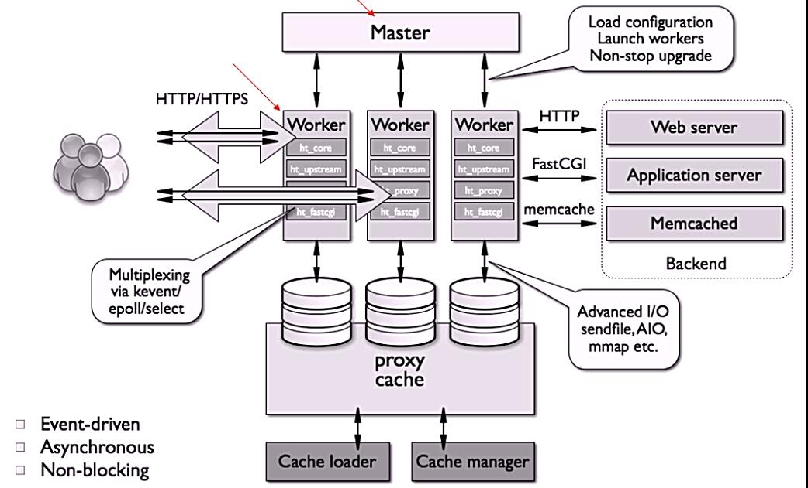
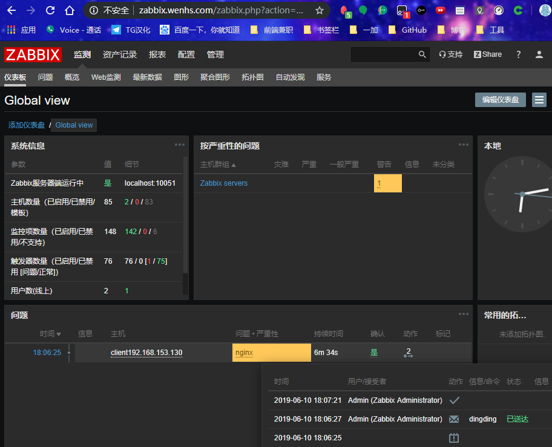

<!--more-->

## 1. nginx简介

`nginx`（发音同engine x）是一款轻量级的Web服务器/反向代理服务器及电子邮件（IMAP/POP3）代理服务器，并在一个BSD-like协议下发行。

`nginx`由俄罗斯的程序设计师Igor Sysoev所开发，最初供俄国大型的入口网站及搜寻引擎Rambler使用。

第一个公开版本0.1.0发布于2004年10月4日。其将源代码以类BSD许可证的形式发布，因它的稳定性、丰富的功能集、示例配置文件和低系统资源的消耗而闻名。2011年6月1日，nginx 1.0.4发布。

`nginx`的特点是占有内存少，并发能力强，事实上`nginx`的并发能力确实在同类型的网页服务器中表现较好，中国大陆使用`nginx`网站用户有：百度、京东、新浪、网易、腾讯、淘宝等。

## 2. nginx的特性与优点

### 2.1 nginx的特性

`nginx`是一个很牛的高性能Web和反向代理服务器，它具有很多非常优越的特性：

 - 在高连接并发的情况下，nginx是Apache服务器不错的替代品，能够支持高达50000个并发连接数的响应
 - 使用epoll and kqueue作为开发模型
 - nginx作为负载均衡服务器：nginx既可在内部直接支持和PHP程序对外进行服务，也可支持作为HTTP代理服务器对外进行服务
 - nginx采用C进行编写，不论系统资源开销还是CPU使用效率都比Perlbal要好很多

### 2.2 nginx的优点

 - 高并发连接：官方测试能够支撑5万并发连接，在实际生产环境中跑到2-3万并发连接数
 - 内存消耗少：在3万并发连接下，开启的10个nginx进程才消耗150M内存（15M*10=150M）
 - 配置文件非常简单：风格跟程序一样通俗易懂
 - 成本低廉：nginx为开源软件，可以免费使用。而购买F5 BIG-IP、NetScaler等硬件负载均衡交换机则需要十多万至几十万人民币
 - 支持Rewrite重写规则：能够根据域名、URL的不同，将HTTP请求分到不同的后端服务器群组
 - 内置的健康检查功能：如果Nginx Proxy后端的某台Web服务器宕机了，不会影响前端访问
 - 节省带宽：支持GZIP压缩，可以添加浏览器本地缓存的Header头
 - 稳定性高：用于反向代理，宕机的概率微乎其微
 - 模块化设计：模块可以动态编译
 - 外围支持好：文档全，二次开发和模块较多
 - 支持热部署：可以不停机重载配置文件
 - 支持事件驱动、AIO（AsyncIO，异步IO）、mmap（Memory Map，内存映射）等性能优化

## 3. nginx的功能及应用类别

### 3.1 nginx的基本功能

 - 静态资源的web服务器，能缓存打开的文件描述符
 - http、smtp、pop3协议的反向代理服务器
 - 缓存加速、负载均衡
 - 支持FastCGI（fpm，LNMP），uWSGI（Python）等
 - 模块化（非DSO机制），过滤器zip、SSI及图像的大小调整
 - 支持SSL

### 3.2 nginx的扩展功能

 - 基于名称和IP的虚拟主机
 - 支持keepalive
 - 支持平滑升级
 - 定制访问日志、支持使用日志缓冲区提高日志存储性能
 - 支持URL重写
 - 支持路径别名
 - 支持基于IP及用户的访问控制
 - 支持速率限制，支持并发数限制

### 3.3 nginx的应用类别

 - 使用nginx结合FastCGI运行PHP、JSP、Perl等程序
 - 使用nginx作反向代理、负载均衡、规则过滤
 - 使用nginx运行静态HTML网页、图片
 - nginx与其他新技术的结合应用

## 4. nginx的模块与工作原理

`nginx`由内核和模块组成。其中，内核的设计非常微小和简洁，完成的工作也非常简单，仅仅通过查找配置文件将客户端请求映射到一个location block（location是nginx配置中的一个指令，用于URL匹配），而在这个location中所配置的每个指令将会启动不同的模块去完成相应的工作。

### 4.1 nginx的模块分类

nginx的模块从结构上分为核心模块、基础模块和第三方模块

 - HTTP模块、EVENT模块和MAIL模块等属于核心模块
 - HTTP Access模块、HTTP FastCGI模块、HTTP Proxy模块和HTTP Rewrite模块属于基本模块
 - HTTP Upstream模块、Request Hash模块、Notice模块和HTTP Access Key模块属于第三方模块

**用户根据自己的需要开发的模块都属于第三方模块。正是有了如此多模块的支撑，nginx的功能才会如此强大**

nginx模块从功能上分为三类，分别是：

 - Handlers（处理器模块）。此类模块直接处理请求，并进行输出内容和修改headers信息等操作。handlers处理器模块一般只能有一个
 - Filters（过滤器模块）。此类模块主要对其他处理器模块输出的内容进行修改操作，最后由nginx输出
 - Proxies（代理器模块）。就是nginx的HTTP Upstream之类的模块，这些模块主要与后端一些服务比如fastcgi等操作交互，实现服务代理和负载均衡等功能

nginx模块分为：核心模块、事件模块、标准Http模块、可选Http模块、邮件模块、第三方模块和补丁等

 - nginx基本模块：所谓基本模块，指的是nginx默认的功能模块，它们提供的指令，允许你使用定义nginx基本功能的变量，在编译时不能被禁用，包括：
 - 核心模块：基本功能和指令，如进程管理和安全。常见的核心模块指令，大部分是放置在配置文件的顶部
 - 事件模块：在Nginx内配置网络使用的能力。常见的events（事件）模块指令，大部分是放置在配置文件的顶部
 - 配置模块：提供包含机制

具体的指令，请参考`nginx`的[官方文档](http://nginx.org/en/docs/ngx_core_module.html)

### 4.2 nginx的工作原理

`nginx`的模块直接被编译进`nginx`，因此属于静态编译方式。

启动`nginx`后，`nginx`的模块被自动加载，与`Apache`不一样，首先将模块编译为一个so文件，然后在配置文件中指定是否进行加载。

在解析配置文件时，`nginx`的每个模块都有可能去处理某个请求，但是同一个处理请求只能由一个模块来完成。

**nginx的进程架构：**

启动`nginx`时，会启动一个`Master`进程，这个进程不处理任何客户端的请求，主要用来产生`worker`线程，一个`worker`线程用来处理n个`request`。



下图展示了`nginx`模块一次常规的HTTP请求和响应的过程


下图展示了基本的WEB服务请求步骤


## 5. nginx的安装与配置

### 5.1 [nginx](https://github.com/itwhs/zabbix/blob/master/zabbix/nginx.sh)的[安装](https://blog.csdn.net/wenhs5479/article/details/88536361)

```
#!/bin/bash
logdir=/var/log/nginx
nginxdir=/usr/local/nginx
cores=$(grep 'core id' /proc/cpuinfo | sort -u | wc -l)
log=/root/nginxinstall.log
#安装依赖包
yum -y install pcre-devel openssl openssl-devel gd-devel zlib-devel gcc gcc-c++
#创建日志存放目录
id nginx 2>$log
if [ $? != 0 ];then
useradd -r -M -s /sbin/nologin nginx
fi
mkdir -p $logdir
chown -R nginx.nginx $logdir
[ ! -f Package/nginx-1.16.0.tar.gz ] && wget http://nginx.org/download/nginx-1.16.0.tar.gz
[ ! -d /nginx-1.16.0 ] && tar xf nginx-1.16.0.tar.gz -C /usr/src/
cd /usr/src/nginx-1.16.0
./configure --prefix=$nginxdir --user=nginx --group=nginx --with-debug --with-http_ssl_module --with-http_realip_module --with-http_image_filter_module --with-http_gunzip_module --with-http_gzip_static_module --with-http_stub_status_module --http-log-path=$logdir/access.log --error-log-path=$logdir/error.log --with-pcre
make -j$cores 2>$log && make install
#添加服务控制脚本
cat >>/etc/init.d/nginx <<'EOF'
#!/bin/bash
nginx="/usr/local/nginx/sbin/nginx"
NGINX_CONF_FILE="/usr/local/nginx/conf/nginx.conf"
pid="/usr/local/nginx/logs/nginx.pid"
case $1 in
	start)
		$nginx -c $NGINX_CONF_FILE
		;;
	stop)
		$nginx -s stop
		;;
	restart)
		$nginx -s stop
		sleep 1
		$nginx -c $NGINX_CONF_FILE
		;;
	reload)
		$nginx -s reload
		;;
	status)
		if [ -f $pid ];then
		    echo "nginx is running"
        else
		    echo "nginx is stoped"
	    fi
		;;
	*)
		echo $"Usage: $0 {start|stop|status|restart|reload}"
		exit 2
		;;
esac
EOF
chmod +x /etc/init.d/nginx
##添加环境变量
echo "export PATH=$nginxdir/sbin:\$PATH" >/etc/profile.d/nginx.sh
echo "请执行 : source /etc/profile.d/nginx.sh 来添加环境变量"
echo  "安装完成"
echo "启动服务方法:service nginx start|stop|status|restart|reload "
```

### 5.2 nginx安装后配置

```
//服务控制方式，使用nginx命令
    -t  //检查配置文件语法
    -v  //输出nginx的版本
    -c  //指定配置文件的路径
    -s  //发送服务控制信号，可选值有{stop|quit|reopen|reload}
  (这里reopen是重启,但是一般不用,效果不好,要么reload重读配置文件,要么stop后在nginx启动)
  
//启动nginx
[root@localhost ~]# nginx
[root@localhost ~]# ss -antl
State      Recv-Q Send-Q   Local Address:Port                  Peer Address:Port
LISTEN     0      128                  *:80                               *:*
LISTEN     0      128                  *:22                               *:*
LISTEN     0      100          127.0.0.1:25                               *:*
LISTEN     0      128                 :::22                              :::*
LISTEN     0      100                ::1:25                              :::* 
```

## 6 nginx的配置文件详解

主配置文件：/usr/local/nginx/conf/nginx.conf

 - 默认启动nginx时，使用的配置文件是：安装路径/conf/nginx.conf文件
 - 可以在启动nginx时通过-c选项来指定要读取的配置文件

**nginx常见的配置文件及其作用**

| 配置文件     | 作用                              |
| ------------ | --------------------------------- |
| nginx.conf   | nginx的基本配置文件               |
| mime.types   | MIME类型关联的扩展文件            |
| fastcgi.conf | 与fastcgi相关的配置               |
| proxy.conf   | 与proxy相关的配置                 |
| sites.conf   | 配置nginx提供的网站，包括虚拟主机 |

### 6.1 nginx.conf配置详解

nginx.conf的内容分为以下几段：

 - main配置段：全局配置段。其中main配置段中可能包含event配置段
 - event {}：定义event模型工作特性
 - http {}：定义http协议相关的配置

配置指令：要以分号结尾，语法格式如下：

```
derective value1 [value2 ...]
```

支持使用变量：

 - 内置变量：模块会提供内建变量定义
 - 自定义变量：`set var_name value`

### 6.2 用于调试、定位问题的配置参数

```
daemon {on|off};    //是否以守护进程方式运行nginx，调试时应设置为off
master_process {on|off};    //是否以master/worker模型来运行nginx，调试时可以设置为off
error_log 位置 级别;    //配置错误日志
```

error_log里的位置和级别能有以下可选项：

| 位置                                                         | 级别                                                         |
| ------------------------------------------------------------ | ------------------------------------------------------------ |
| file stderr syslog:server=address[,parameter=value] memory:size | debug：若要使用debug级别，需要在编译nginx时使用--with-debug选项 info notice warn error crit alert emerg |

### 6.3 正常运行必备的配置参数

```
user USERNAME [GROUPNAME];    //指定运行worker进程的用户和组
pid /path/to/pid_file;    //指定nginx守护进程的pid文件
worker_rlimit_nofile number;    //设置所有worker进程最大可以打开的文件数，默认为1024(最大65535,这里设置了65535后,并不能就可以打开65535个了,还要设置/etc/security/limits.conf文件里面的参数nofile,让nginx可以打开65535个文件,也就是说,这里设置的数字会比系统限制小,要想大,就先加大系统限制)
worker_rlimit_core size;    //指明所有worker进程所能够使用的总体的最大核心文件大小，保持默认即可
```

### 6.4 优化性能的配置参数

```
worker_processes n;    //启动n个worker进程，这里的n为了避免上下文切换，通常设置为cpu总核心数减1或等于总核心数
worker_cpu_affinity cpumask ...;    //将进程绑定到某cpu中，避免频繁刷新缓存
//cpumask：使用8位二进制表示cpu核心，如：
    0000 0001   //第一颗cpu核心
    0000 0010   //第二颗cpu核心
    0000 0100   //第三颗cpu核心
    0000 1000   //第四颗cpu核心
    0001 0000   //第五颗cpu核心
    0010 0000   //第六颗cpu核心
    0100 0000   //第七颗cpu核心
    1000 0000   //第八颗cpu核心
timer_resolution interval;    //计时器解析度。降低此值，可减少gettimeofday()系统调用的次数
worker_priority number;    //指明worker进程的nice值(-20到19,一般是0)
```

### 6.5 事件相关的配置：event{}段中的配置参数

```
accept_mutex {off|on};    //master调度用户请求至各worker进程时使用的负载均衡锁；on表示能让多个worker轮流地、序列化地去响应新请求,要启动on配置则要设置下面这个锁文件
lock_file file;    //accept_mutex用到的互斥锁锁文件路径(这个参数要放前面的全局配置段,否则语法错误)
use [epoll | rtsig | select | poll];    //指明使用的事件模型，建议让nginx自行选择
worker_connections #;    //每个进程能够接受的最大连接数(看worker数量,例如最大5万链接,有4个worker,则这里可以设置5120-10240,总量也就是2万到4万链接,不要满负载运行)
```

### 6.6 网络连接相关的配置参数

```
keepalive_timeout number;    //长连接的超时时长，默认为65s(问题:请求资源过大,还没传输完,时间超时,断开链接,如此重复.解决方法:提高带宽,压缩资源,加长超时时长)
keepalive_requests number;    //在一个长连接上所能够允许请求的最大资源数
keepalive_disable [msie6|safari|none];    //为指定类型的UserAgeng禁用长连接(列出来才会禁用)
tcp_nodelay on|off;    //是否对长连接使用TCP_NODELAY选项，为了提升用户体验，通常设为on(也就是不延迟)
client_header_timeout number;    //读取http请求报文首部的超时时长
client_body_timeout number;    //读取http请求报文body部分的超时时长
send_timeout number;    //发送响应报文的超时时长
```

### 6.7 fastcgi的相关配置参数

LNMP：php要启用fpm模型
配置示例如下：

```
location ~ \.php$ {
  root html;
  fastcgi_pass 127.0.0.1:9000;      //定义反向代理
  fastcgi_index index.php;
  fastcgi_param SCRIPT_FILENAME /scripts$fastcgi_script_name;
  include fastcgi_params;
}
这里的/scripts一般改成$document_root也就是网站默认家目录(变量名字做到见名知义)
开头是只匹配.php结尾的文件
```

### 6.8 常需要进行调整的参数

 - worker_processes
 - worker_connections
 - worker_cpu_affinity
 - worker_priority

### 6.9 nginx作为web服务器时使用的配置：http{}段的配置参数

http{...}：配置http相关，由ngx_http_core_module模块引入。nginx的HTTP配置主要包括四个区块，结构如下：

```
http {//协议级别,这个配置文件只有一个http{},所以,想配置虚拟主机,可以'sed -ri /^http/a"\ \ \ \ include\ \ \ \ \ \ \ vhost.types;" /usr/local/nginx/conf/nginx.conf'在同级目录下加一个vhost.types写虚拟主机配置
  include mime.types;
  default_type application/octet-stream;
  keepalive_timeout 65;
  gzipon;
  upstream {//负载均衡配置
    ...
  }
  server {//服务器级别，每个server类似于httpd中的一个<VirtualHost>
    listen 80;
    server_name localhost;
    location / {//请求级别，类似于httpd中的<Location>，用于定义URL与本地文件系统的映射关系
      root html;(这里的html是'location /'的'/',要理清路径关系,比如要访问html/haha则可写成location /haha{root html;...})
      index index.html index.htm;
    }
  }
}
```

**http{}段配置指令：**

server {}：定义一个虚拟主机，示例如下：

```
server {
  listen 80;(必须有的参数,也可以放在http{里面},这样的话,http里面的主机都监听Listen的端口) 
  server_name itw.design;
  root "/vhosts/web";(这里用的绝对路径)
}
```

listen：指定监听的地址和端口

```
listen address[:port];
listen port;
```

`server_name NAME [...];` 后面可跟多个主机，名称可使用正则表达式或通配符

**当有多个server时，匹配顺序如下(相当于匹配优先级)：**

1. 先做精确匹配检查
2. 左侧通配符匹配检查，如`*.design`
3. 右侧通配符匹配检查，如`mail.*`
4. 正则表达式匹配检查，如`~ ^.*\.design$`
5. default_server

`root path;` 设置资源路径映射，用于指明请求的URL所对应的资源所在的文件系统上的起始路径

`alias path;` 用于location配置段，定义路径别名,要写全路径(用于没有修饰符的情况下)

`index file;` 默认主页面

```
index index.php index.html;
error_page code [...] [=code] URI | @name` 根据http响应状态码来指明特用的错误页面，例如 `error_page 404 /404_customed.html
这个错误网页放在默认网页根下,也就是html下
```

[=code]：以指定的响应码进行响应，而不是默认的原来的响应，默认表示以新资源的响应码为其响应码，例如 `error_page 404 =200 /404_customed.html`

`log_format` 定义日志格式

```
log_format  main  '$remote_addr - $remote_user [$time_local] "$request" '
                    '$status $body_bytes_sent "$http_referer" '
                    '"$http_user_agent" "$http_x_forwarded_for"';
access_log  logs/access.log  main;

//注意：此处可用变量为nginx各模块内建变量,内建变量可自行百度
```

**location区段，通过指定模式来与客户端请求的URI相匹配**

```
//功能：允许根据用户请求的URI来匹配定义的各location，匹配到时，此请求将被相应的location配置块中的配置所处理，例如做访问控制等功能

//语法：location [ 修饰符 ] pattern {......}
```

**常用修饰符说明：**

| 修饰符 | 功能                                                         |
| ------ | ------------------------------------------------------------ |
| =      | 精确匹配                                                     |
| ~      | 正则表达式模式匹配，区分大小写                               |
| ~*     | 匹配文件后缀名称                                             |
| ^~     | 前缀匹配，类似于无修饰符的行为，也是以指定模块开始，不同的是，如果模式匹配，那么就停止搜索其他模式了，不支持正则表达式 |
| @      | 定义命名location区段，这些区段客户端不能访问，只可以由内部产生的请求来访问，如try_files或error_page等 |

**没有修饰符表示必须以指定模式开始**，如：

```
server {
  server_name itw.design;
  location /abc {
    ......
  }
}
```

那么如下内容就可正确匹配：

- <http://itw.design/abc>
- <http://itw.design/abc?p1=11&p2=22>
- <http://itw.design/abc/>

**=：表示必须与指定的模式精确匹配**，如：

```
server {
  server_name itw.design;
  location = /abc {
    ......
  }
}
```

那么如下内容就可正确匹配：

- <http://itw.design/abc>
- <http://itw.design/abc?p1=11&p2=22>

如下内容则无法匹配：

- <http://itw.design/abc/>

- <http://itw.design/abc/abcde>

**~：表示指定的正则表达式要区分大小写**，如：

```
server {
  server_name itw.design;
  location ~ ^/abc$ {
  ......
  }
}
```

那么如下内容就可正确匹配：

- <http://itw.design/abc>
- <http://itw.design/abc?p1=11&p2=22>

如下内容则无法匹配：

- <http://itw.design/abc/>
- <http://itw.design/ABC>
- <http://itw.design/abcde>

**~\*：表示指定的正则表达式不区分大小写**，如：

```
server {
  server_name itw.design;
  location ~* ^/*.jpg$ {
    ......
  }
}
```

那么如下内容就可正确匹配：

- <http://itw.design/1.jpg>

如下内容则无法匹配：

- <http://itw.design/abc/>
- <http://itw.design/abcde>

**~：类似于无修饰符的行为，也是以指定模式开始，不同的是，如果模式匹配，则停止搜索其他模式**

**查找顺序和优先级：由高到底依次为**

1. 带有`=`的精确匹配优先
2. 正则表达式按照他们在配置文件中定义的顺序
3. 带有`^~`修饰符的，开头匹配
4. 带有`~`或`~*`修饰符的，如果正则表达式与URI匹配
5. 没有修饰符的精确匹配

**优先级次序如下：**

```
( location = 路径 ) --> ( location ^~ 路径 ) --> ( location ~ 正则 ) --> ( location ~* 正则 ) --> ( location 路径 )
```

### 6.10 访问控制

**用于location段**

allow：设定允许哪台或哪些主机访问，多个参数间用空格隔开
deny：设定禁止哪台或哪些主机访问，多个参数间用空格隔开
示例：

```
allow 192.168.1.1/32 172.16.0.0/16;
deny all;
```

### 6.11 基于用户认证

```
auth_basic "欢迎信息";
auth_basic_user_file "/path/to/user_auth_file"
```

user_auth_file内容格式为：

```
username:password
```

这里的密码为加密后的密码串，建议用htpasswd来创建此文件：

```
htpasswd -c -m /path/to/.user_auth_file USERNAME
```

### 6.12 https配置

生成私钥，生成证书签署请求并获得证书，然后在nginx.conf中配置如下内容：

```
server {
  listen       443 ssl;
  server_name  itw.design;
  ssl_certificate      /etc/nginx/ssl/nginx.crt;(可用绝对路径,也可相对路径)
  ssl_certificate_key  /etc/nginx/ssl/nginx.key;
  ssl_session_cache    shared:SSL:1m;
  ssl_session_timeout  5m;
  ssl_ciphers  HIGH:!aNULL:!MD5;
  ssl_prefer_server_ciphers  on;
  location / {
    root   html;
    index  index.html index.htm;
  }
}
```

### 6.13 开启状态界面

开启status：

```
location /status {
  stub_status {on | off};
  allow 192.168.0.0/16;最好是只允许自己主机访问:ip/32掩码
  deny all;
}

自定义监控取驻留连接值(越小越好):curl -s http://server_ip/status|awk 'NR==4 {print $NF}'
例如:
[root@localhost ~]# curl -s http://192.168.153.130/status
Active connections: 1 
server accepts handled requests
 32 32 62 
Reading: 0 Writing: 1 Waiting: 0 
[root@localhost ~]# curl -s http://192.168.153.130/status|awk 'NR==4 {print $NF}'
0
```

访问状态页面的方式：`http://server_ip/status`


[添加自定义监控](https://blog.csdn.net/wenhs5479/article/details/90514799)

修改/usr/local/etc/zabbix_agentd.conf配置文件


然后配置主机监控项,添加触发器,和告警媒介,最后再选择用户配置媒介选项,实现下图告警




**状态页面信息详解：**

|       状态码       | 表示的意义                                                   |
| :----------------: | :----------------------------------------------------------- |
| Active connections | 当前所有处于打开状态的连接数                                 |
|      accepts       | 总共处理了多少个连接                                         |
|      handled       | 成功创建多少握手                                             |
|      requests      | 总共处理了多少个请求                                         |
|      Reading       | nginx读取到客户端的Header信息数，表示正处于接收请求状态的连接数 |
|      Writing       | nginx返回给客户端的Header信息数，表示请求已经接收完成， 且正处于处理请求或发送响应的过程中的连接数 |
|      Waiting       | 开启keep-alive的情况下，这个值等于active - (reading + writing)， 意思就是Nginx已处理完正在等候下一次请求指令的驻留连接 |

### 6.14 rewrite

语法：`rewrite regex replacement flag;`

案例1：原访问地址http://server_ip/images/1.jpg,但是个别原因,这个images要更名为img,这时有以下几种方法,解决客户访问原地址,仍然访问正确资源[此处的$1用于引用(.*.jpg)匹配到的内容]

```
在nginx.conf添加下列定位
location /images {
                rewrite ^/images/(.*\.jpg)$ /img/$1 break;
        }
```


```
在nginx.conf添加下列定位(这个会重写客户端的url)
location /images {
                rewrite ^/images/(.*\.jpg)$ http://192.168.153.130/img/$1 break;
        }
location /img {
                root html;
        }
一开始访问http://192.168.153.130/images/1.jpg,自动跳转到http://192.168.153.130/img/1.jpg
```


案例2:某公司域名太长或不容易记,便可借别人短域名,做一个短网址

```text
在nginx.conf添加下列定位(这个会重写客户端的url)
location /blog {
                rewrite ^/blog/(.*)$ https://itwhs.github.io/index.html redirect;
        }
```

如上例所示，replacement可以是某个路径，也可以是某个URL


```
在nginx.conf添加下列定位(这个会重写客户端的url)
location /blog {
                rewrite ^/blog/(.*)$ https://itwhs.github.io/index.html redirect;
        }
```


**常见的flag**

|   flag    | 作用                                                         |
| :-------: | :----------------------------------------------------------- |
|   last    | 基本上都用这个flag，表示当前的匹配结束，继续下一个匹配，最多匹配10个到20个 一旦此rewrite规则重写完成后，就不再被后面其它的rewrite规则进行处理 而是由UserAgent重新对重写后的URL再一次发起请求，并从头开始执行类似的过程 |
|   break   | 中止Rewrite，不再继续匹配 一旦此rewrite规则重写完成后，由UserAgent对新的URL重新发起请求， 且不再会被当前location内的任何rewrite规则所检查 |
| redirect  | 以临时重定向的HTTP状态302返回新的URL                         |
| permanent | 以永久重定向的HTTP状态301返回新的URL                         |

rewrite模块的作用是用来执行URL重定向。这个机制有利于去掉恶意访问的url，也有利于搜索引擎优化（SEO）

nginx使用的语法源于Perl兼容正则表达式（PCRE）库，基本语法如下：

| 标识符 | 意义                                             |
| :----: | :----------------------------------------------- |
|   ^    | 必须以^后的实体开头                              |
|   $    | 必须以$前的实体结尾                              |
|   .    | 匹配任意字符                                     |
|   []   | 匹配指定字符集内的任意字符                       |
|  [^]   | 匹配任何不包括在指定字符集内的任意字符串         |
|   \|   | 匹配 \| 之前或之后的实体                         |
|   ()   | 分组，组成一组用于匹配的实体，通常会有 \| 来协助 |

捕获子表达式，可以捕获放在()之间的任何文本，比如：

```text
^(hi|sir)$       //字符串为“hi sir”捕获的结果：$1=hi$2=sir

//这些被捕获的数据，在后面就可以当变量一样使用了
```


不写last和break - 那么流程就是依次执行这些rewrite

**使用last和break实现URI重写，浏览器地址栏不变**

- break - url重写后，直接使用当前资源，不再执行location里余下的语句，完成本次请求，地址栏url不变
- last - url重写后，马上发起一个新的请求，再次进入server块，重试location匹配，超过10次匹配不到报500错误，地址栏url不变。牢记：使用last会对server标签重新发起请求

使用redirect 和permanent 实现URI重写，浏览器以返回的新地址重新发起请求

- redirect – 返回302临时重定向，地址栏显示重定向后的url，爬虫不会更新url（因为是临时）
- permanent – 返回301永久重定向, 地址栏显示重定向后的url，爬虫更新url

#### last 和 break 总结如下：

**1、last 和 break 当出现在location 之外时，两者的作用是一致的没有任何差异**。

注意一点就是，他们会跳过所有的在他们之后的rewrite 模块中的指令，去选择自己匹配的location

rewrite url1 url2 last; ①

rewrite url3 url4 last; ②

rewrite url5 url6 last; ③

location ~ url2 ④

location ~ url4 ⑤

location ~ url6 ⑥

当① 这条rewrite 规则生效后，它后面的②和③ 将被跳过不做判断，而去直接选择 后面的location。

这里可能有一个疑问，那些指令输入rewrite 模块中的指令呢？ 若是使用nginx本身，你就要到官网上去查询了。

但如果你使用的是tengine ，可以使用tengine -V 。会将你想要的信息列举出来。


放在server块rewrite语句前面 ：如果是直接请求某个真实存在的文件,则用break语句停止rewrite检查

if (-f $request_filename) {

break;

}

**2、last 和 break 当出现在location 内部时，两者就存在了差异。**

last: 使用了last 指令，rewrite 后会跳出location 作用域，重新开始再走一次刚刚的行为break: 使用了break 指令，rewrite后不会跳出location 作用域。它的生命也在这个location中终结。

rewrite xxx1 yyy last; ⑦

rewrite xxx2 yyy last; ⑧

rewrite xxx3 yyy last; ⑨

rewrite xxx4 yyy last; ⑩

location ~ url1 {

rewrite url1 url2 last; ①

}

location ~ url2 {

rewrite url3 url4 break; ②

fastcgi_pass 127.0.0.1:9000;

}

以上事例：

第一个location 中的 rewrite 指令处理完成之后，会跳出location ，再重新判断rewrite 7 ~ 9 的规则。

第二个location 中的 rewrite 指令处理完成之后，不会跳出location， 更不会重新判断rewrite 7 ~ 9 的规则。而只能将

信息传递给后面的fastcgi_pass 或者proxy_pass 等指令

牢记：使用last会对server标签重新发起请求

- 如果location中rewrite后是对静态资源的请求，不需要再进行其他匹配，一般要使用break或不写，直接使用当前location中的数据源，完成本次请求
- 如果location中rewrite后，还需要进行其他处理，如动态fastcgi请求(.php,.jsp)等，要用last继续发起新的请求
- 使用alias指定源：必须使用last
- 使用proxy_pass指令时，需要使用break标记。


#### permanent 和 redirect 总结如下：

**permanent**: 大家公认的信息 ，永久性重定向。请求日志中的状态码为301

**redirect**： 大家公认的信息 ，临时重定向。请求日志中的状态码为302

从实现功能的角度上去看，permanent 和 redirect 是一样的。不存在哪里好，哪里坏。也不存在什么性能上的问题。

但从SEO(或者是百度爬你的网站时)。 类似于这样的东西，会对你到底是永久性重定向还是临时重定向感兴趣。了解不到，需要深入，就google 吧。

#### last 和 break VS permanent 和 redirect

在 permanent 和 redirect 中提到了 状态码 301 和 302。 那么last 和 break 想对于的访问日志的请求状态码又是多少呢？

答案为： 200

这两类关键字，我们能够眼睛看到的差异是什么呢？ 我举个例子说明吧：

当你打开一个网页，同时打开debug 模式时，会发现301 和 302 时的行为是这样的。第一个请求301 或者 302 后，浏览器重新获取了一个新的URL ，然后会对这个新的URL 重新进行访问。所以当你配置的是permanent 和 redirect ,你对一个URL 的访问请求，落到服务器上至少为2次。

而当你配置了last 或者是break 时，你最终的URL 确定下来后，不会将这个URL返回给浏览器，而是将其扔给了fastcgi_pass或者是proxy_pass指令去处理。请求一个URL ，落到服务器上的次数就为1次。


### 6.15 if

语法：`if (condition) {...}`

应用场景：

- server段
- location段

**常见的condition**

- 变量名（变量值为空串，或者以“0”开始，则为false，其它的均为true）
- 以变量为操作数构成的比较表达式（可使用=，!=类似的比较操作符进行测试）
- 正则表达式的模式匹配操作
  - ~：区分大小写的模式匹配检查
  - ~*：不区分大小写的模式匹配检查
  - !~和!~*：对上面两种测试取反
- 测试指定路径为文件的可能性（-f，!-f)
- 测试指定路径为目录的可能性（-d，!-d）
- 测试文件的存在性（-e，!-e）
- 检查文件是否有执行权限（-x，!-x）

#### 6.15.1 基于浏览器实现分离案例

各个浏览器的排版可能会有区别,所以,前端人员会写多平台的前端页面,这时就要把这些分离

```
[root@localhost html]# mkdir MobileSafari MobileEdge SafariEdge Trident
[root@localhost html]# ll
总用量 8
-rw-r--r-- 1 root root 494 6月  11 17:12 50x.html
-rw-r--r-- 1 root root 612 6月  11 17:12 index.html
drwxr-xr-x 2 root root   6 6月  11 18:23 MobileEdge
drwxr-xr-x 2 root root   6 6月  11 18:23 MobileSafari
drwxr-xr-x 2 root root   6 6月  11 18:23 SafariEdge
drwxr-xr-x 2 root root   6 6月  11 18:23 Trident
[root@localhost html]# echo "MobileEdge" >MobileEdge/index.html
[root@localhost html]# echo "MobileSafari" >MobileSafari/index.html
[root@localhost html]# echo "SafariEdge" >SafariEdge/index.html
[root@localhost html]# echo "Trident" >Trident/index.html
```


```text
        location / {
            root   html;
            index index.html;
                if ($http_user_agent ~ 'Mobile Safari/537.36 Edge/14.14263' ) {
                        rewrite ^(.*)$ /MobileEdge/$1 break;
                }

                if ($http_user_agent ~ "Mobile/15A5341f Safari/604.1" ) {
                        rewrite ^(.*)$ /MobileSafari/$1 break;
                }

                if ($http_user_agent ~ "Chrome/64.0.3282.140 Safari/537.36 Edge/18.17763" ) {
                        rewrite ^(.*)$ /SafariEdge/$1 break;
                }

                if ($http_user_agent ~ Trident) {
                        rewrite ^(.*)$ /Trident/$1 break;
                }
        }
        
        版本号可以直接写Chrome  Firefox  Safari  Trident等...
```

效果图:


#### 6.15.2 防盗链案例

```text
location ~* \.(jpg|gif|jpeg|png)$ {
  valid_referers none blocked itw.design;
  if ($invalid_referer) {
    rewrite ^/ http://itw.design/403.html;
  }
}
```

### 6.16 反向代理与负载均衡

`nginx`通常被用作后端服务器的反向代理，这样就可以很方便的实现动静分离以及负载均衡，从而大大提高服务器的处理能力。

#### 扩展:

**硬件负载均衡**：

- F5，BIG-IP
- Citrix NetScaler
- A10
- Array
- Redware

**软件负载均衡**：
- lvs
- haproxy
- nginx
- ats
- perlbal

##### 基于工作的协议层次划分：

- 传输层：lvs，haproxy,(mode tcp)

- 应用层: haproxy,nginx,ats,perlbal

`nginx`实现动静分离，其实就是在反向代理的时候，如果是静态资源，就直接从`nginx`发布的路径去读取，而不需要从后台服务器获取了。

但是要注意，这种情况下需要保证后端跟前端的程序保持一致，可以使用`Rsync`做服务端自动同步或者使用`NFS`、`MFS`分布式共享存储。

```
Http Proxy`模块，功能很多，最常用的是`proxy_pass`和`proxy_cache
```

如果要使用`proxy_cache`，需要集成第三方的`ngx_cache_purge`模块，用来清除指定的URL缓存。这个集成需要在安装`nginx`的时候去做，如：
`./configure --add-module=../ngx_cache_purge-1.0 ......`

`nginx`通过`upstream`模块来实现简单的负载均衡，`upstream`需要定义在`http`段内

在`upstream`段内，定义一个服务器列表，默认的方式是轮询，如果要确定同一个访问者发出的请求总是由同一个后端服务器来处理，可以设置ip_hash，如：

```text
准备工作:
[root@localhost html]# mkdir 8080 8090 800 8000
[root@localhost html]# echo 8080 >8080/index.html
[root@localhost html]# echo 800 >800/index.html
[root@localhost html]# echo 8090 >8090/index.html
[root@localhost html]# echo 8000 >8000/index.html
[root@localhost html]# vim /usr/local/nginx17/conf/nginx.conf
    server {
        listen 800;
        location / {
            root   html/800;
        }
    }
    server {
        listen 8000;
        location / {
            root   html/8000;
        }
    }
    server {
        listen 8080;
        location / {
            root   html/8080;
        }
    }
    server {
        listen 8090;
        location / {
            root   html/8090;
        }
    }
    upstream 192.168.153.130 {
        server 127.0.0.1:800 weight=4;
        server 127.0.0.1:8000 weight=3;
        server 127.0.0.1:8080 weight=2;
        server 127.0.0.1:8090;
    }
    server {
        location / {
    proxy_pass http://192.168.153.130;
        }
    }
这里的weight=n是权重,也就是800端口4个请求;8000端口3个请求;8080端口2个请求;8090端口1个请求,这里的'192.168.153.130'可换做公司域名,'127.0.0.1'可换做集群中其他主机ip地址,权重按需求和机器性能,合理配置
修改后:
upstream 192.168.153.130 {
        ip_hash;
        server 127.0.0.1:800 weight=4;
        server 127.0.0.1:8000 weight=3;
        server 127.0.0.1:8080 weight=2;
        server 127.0.0.1:8090;
    }
这种修改后,用本机验证一直是其中一个虚拟主机页面,没有再更改
```

注意：这个方法本质还是轮询，而且由于客户端的ip可能是不断变化的，比如动态ip，代理，翻墙等，因此ip_hash并不能完全保证同一个客户端总是由同一个服务器来处理。

定义好`upstream`后，需要在`server`段内添加如下内容：

```text
server {
  location / {
    proxy_pass http://域名或IP;
  }
}
```


### 6.17 nginx内置变量

内置变量存放在 ngx_http_core_module 模块中，下面我来把这些变量分类记忆下，这里包括日常运维的内置变量讲解

#### 6.17.1 nginx地址栏系统内置变量匹配


以<https://itwhs.github.io/index.php?m=content&c=index&a=lists&catid=110>的匹配顺序为例：

**$scheme** 请求使用的Web协议, “http” 或 “https”

**$host** 请求中的主机头(Host)字段，如果请求中的主机头不可用或者空，则为处理请求的server名称(处理请求的server的server_name指令的值)。值为小写，不包含端口。

**$hostname** 主机名，机器名使用 gethostname系统调用的值

**$document_uri** 与$uri相同。请求中的当前URI(不带请求参数，参数位于$args)，可以不同于浏览器传递的$request_uri的值，它可以通过内部重定向，或者使用index指令进行修改，$uri不包含主机名，如”/foo/bar.html”。

**$document_root** 当前请求的文档根目录或别名——当前请求在root指令中指定的值。

**$args** 这个变量等于GET请求中的参数。$query_string 与$args相同。例如，foo=123&bar=blahblah;这个变量只可以被修改

**$arg_name**请求中的的参数名，即“?”后面的arg_name=arg_value形式的arg_name

**$is_args** 如果$args设置，值为"?"，否则为""。

**$cookie_COOKI**E cookie COOKIE的值。

**$cookie_name** cookie名称

#### 6.17.2 nginx服务端参数内置变量匹配

**$server_protocol** 服务器的HTTP版本, 通常为 “HTTP/1.0” 或 “HTTP/1.1”

**$server_nam** 服务器名，如[itwhs.github.io](https://itwhs.github.io/)

**$server_addr** 服务器端地址，需要注意的是：为了避免访问linux系统内核，应将ip地址提前设置在配置文件中。

**$server_port** 服务器端口

**$status** HTTP响应代码 (1.3.2, 1.2.2)

**$https** 如果开启了SSL安全模式，值为“on”，否则为空字符串。

#### 6.17.3 nginx客户端参数内置变量匹配

**$remote_addr** 客户端的IP地址。

**$remote_por**t 客户端的端口。

**$remote_user** 用于HTTP基础认证服务的用户名，已经经过Auth Basic Module验证的用户名。

**$request**代表客户端的请求地址

**$request_filename** 当前连接请求的文件路径，由root或alias指令与URI请求生成。

**$realpath_root**当前请求的文档根目录或别名的真实路径，会将所有符号连接转换为真实路径。

**$request_body** 客户端的请求主体，此变量可在location中使用，将请求主体通过proxy_pass, fastcgi_pass, uwsgi_pass, 和 scgi_pass传递给下一级的代理服务器。这个变量（0.7.58+）包含请求的主要信息。在使用proxy_pass或fastcgi_pass指令的location**中比较有意义。**

**$request_body_file** 客户端请求主体信息的临时文件名。将客户端请求主体保存在临时文件中。文件处理结束后，此文件需删除。如果需要之一开启此功能，需要设置client_body_in_file_only。如果将次文件传递给后端的代理服务器，需要禁用request body，即设置proxy_pass_request_body off，fastcgi_pass_request_body off, uwsgi_pass_request_body off, or scgi_pass_request_body off 。

**$request_completion** 如果请求成功，设为"OK"；如果请求未完成或者不是一系列请求中最后一部分则设为空。

**$request_method** 这个变量是客户端请求的动作，通常为GET或POST。包括0.8.20及之前的版本中，这个变量总为main request中的动作，如果当前请求是一个子请求，并不使用这个当前请求的动作。

**$http_HEADER** HTTP请求头中的内容，HEADER为HTTP请求中的内容转为小写，-变为_(破折号变为下划线)，例如：$http_user_agent(Uaer-Agent的值), $http_referer...;

**$http_name**匹配任意请求头字段； 变量名中的后半部分“name”可以替换成任意请求头字段，如在配置文件中需要获取http请求头：“Accept-Language”，那么将“－”替换为下划线，大写字母替换为小写，形如：$http_accept_language即可。

**$sent_http_HEADER** HTTP响应头中的内容，HEADER为HTTP响应中的内容转为小写，-变为_(破折号变为下划线)，例如： $sent_http_cache_control, $sent_http_content_type...;

#### 6.17.4 nginx运维及系统状态内置变量匹配

**$nginx_version** 当前运行的nginx版本号。

**$time_iso8601** 服务器时间的ISO 8610格式 (1.3.12, 1.2.7)

**$msec** 当前的Unix时间戳 (1.3.9, 1.2.6)

$pid工作进程的PID

**$limit_rate** 用于设置响应的速度限制

$binary_remote_addr 二进制码形式的客户端地址。

**$body_bytes_sent** 传送页面的字节数

**$connection** TCP连接的序列号 (1.3.8, 1.2.5)

**$connection_requests** TCP连接当前的请求数量 (1.3.8, 1.2.5)

**$content_length** 请求头中的Content-length字段。

**$content_type** 请求头中的Content-Type字段。

#### 6.18 nginx的平滑升级

nginx在编译安装完成之后，出于以下两种考虑都需要进行升级：

- 版本更新

- 添加未编译安装的模块

而nginx所采用的平滑升级可以保证在不停止服务的情况下解决以上问题。我们以动态增加–with-http_stub_status_module模块为例，步骤如下：

**1.查看nginx版本号及已安装模块**

```
[root@localhost ~]# nginx -V
nginx version: nginx/1.16.0
built by gcc 4.8.5 20150623 (Red Hat 4.8.5-36) (GCC) 
built with OpenSSL 1.0.2k-fips  26 Jan 2017
TLS SNI support enabled
configure arguments: --prefix=/usr/local/nginx --user=nginx --group=nginx --with-debug --with-http_ssl_module --with-http_realip_module --with-http_image_filter_module --with-http_gunzip_module --with-http_gzip_static_module --with-http_stub_status_module --http-log-path=/var/log/nginx/access.log --error-log-path=/var/log/nginx/error.log --with-pcre
```

**2.下载对应版本的源码包和要添加的模块**

```
[root@localhost ~]# wget http://nginx.org/download/nginx-1.17.0.tar.gz
[root@localhost ~]# wget https://github.com/openresty/echo-nginx-module/archive/v0.61.tar.gz
```

**3.解压并重新编译**

```
[root@localhost ~]# tar xf nginx-1.17.0.tar.gz 
[root@localhost ~]# tar xf v0.61.tar.gz 
[root@localhost ~]# ll
drwxrwxr-x  5 root root      174 8月   9 2017 echo-nginx-module-0.61
drwxr-xr-x  8 1001 1001      158 5月  21 22:24 nginx-1.17.0
-rw-r--r--  1 root root  1032978 5月  23 21:32 nginx-1.17.0.tar.gz
-rw-r--r--  1 root root    53155 6月  11 17:01 v0.61.tar.gz
[root@localhost ~]# cd nginx-1.17.0
[root@localhost ~]# cd nginx-1.17.0
[root@localhost nginx-1.17.0]# ./configure --prefix=/usr/local/nginx17 --user=nginx --group=nginx --with-debug --with-http_ssl_module --with-http_realip_module --with-http_image_filter_module --with-http_gunzip_module --with-http_gzip_static_module --with-http_stub_status_module --http-log-path=/var/log/nginx/access.log --error-log-path=/var/log/nginx/error.log --with-pcre --add-module=../echo-nginx-module-0.61
.......
[root@localhost nginx-1.17.0]# make
此时2种方法升级,一是把objs里面的新编译的文件,替换到原有的文件,实现升级和加模块,这个方法不需要make install,二是直接把老版本的conf文件替换到新版本目录(下面演示的方法二)
[root@localhost nginx-1.17.0]# make install

```

**4.备份,升级**

```
[root@localhost nginx-1.17.0]# mv /usr/local/nginx17/conf/nginx.conf{,.origin}
[root@localhost nginx-1.17.0]# cp /usr/local/nginx/conf/nginx.conf /usr/local/nginx17/conf/
[root@localhost nginx-1.17.0]# pkill nginx
[root@localhost nginx-1.17.0]# /usr/local/nginx17/sbin/nginx 
[root@localhost nginx-1.17.0]# /usr/local/nginx17/sbin/nginx -V
nginx version: nginx/1.17.0
built by gcc 4.8.5 20150623 (Red Hat 4.8.5-36) (GCC) 
built with OpenSSL 1.0.2k-fips  26 Jan 2017
TLS SNI support enabled
configure arguments: --prefix=/usr/local/nginx17 --user=nginx --group=nginx --with-debug --with-http_ssl_module --with-http_realip_module --with-http_image_filter_module --with-http_gunzip_module --with-http_gzip_static_module --with-http_stub_status_module --http-log-path=/var/log/nginx/access.log --error-log-path=/var/log/nginx/error.log --with-pcre --add-module=../echo-nginx-module-0.61
```

**5.添加环境变量**

```
[root@localhost ~]# vim /etc/profile.d/nginx.sh
export PATH=/usr/local/nginx17/sbin:$PATH
[root@localhost ~]# source /etc/profile.d/nginx.sh 
[root@localhost ~]# whereis nginx
nginx: /usr/local/nginx /usr/local/nginx17/sbin/nginx /usr/local/nginx/sbin/nginx
```

