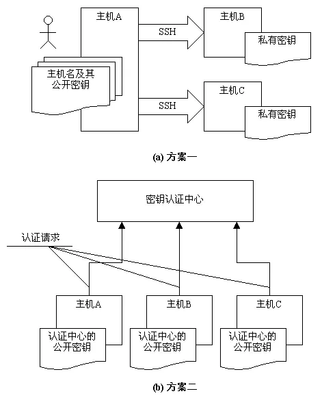
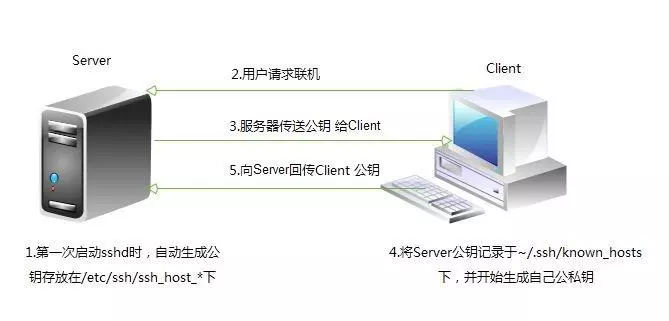

<!--more-->

# 1. 使用 SSH 访问远程命令行

### 1.1 OpenSSH 简介

`OpenSSH`这一术语指系统中使用的`Secure Shell`软件的软件实施。用于在远程系统上安全运行`shell`。如果您在可提供`ssh`服务的远程`Linux`系统中拥有用户帐户，则`ssh`是通常用来远程登录到该系统的命令。ssh命令也可用于在远程系统中运行命令。

常见的远程登录工具有：

 - telnet
 - ssh
 - dropbear

```
telnet      //远程登录协议，23/TCP
    认证明文
    数据传输明文
(由于其不安全性,现如今使用telnet远程登录的比较少了,一般用这个命令来测试端口是否开启)

ssh         //Secure SHell，应用层协议，22/TCP
    通信过程及认证过程是加密的，主机认证
    用户认证过程加密
    数据传输过程加密
   (相对较安全,不容易被破解)
    
dropbear    //嵌入式系统专用的SSH服务器端和客户端工具
```

### 1.2 SSH 版本

`openssh`有两个版本，分别为v1和v2，其特点如下：

> v1：基于CRC-32做MAC，无法防范中间人（man-in-middle）攻击
>
> v2：双方主机协议选择安全的MAC方式。基于DH算法做密钥交换，基于RSA或DSA算法实现身份认证

### 1.3 SSH 认证方式

`openssh`有两种认证方式，分别是：

 - 基于口令认证:输入用户名和密码
 - 基于密钥认证

	 - [ ] 客户端建立两把钥匙(公钥与私钥)
	 - [ ] 将公钥数据上传到服务器上
	 - [ ] 将公钥放置服务器端的正确目录与文件名（scp 或 ssh-copy-id）



### 1.4 openSSH 的工作模式

**`openSSH`是基于C/S架构工作的。**

```
服务器端    //sshd，配置文件在/etc/ssh/sshd_config

客户端     //ssh，配置文件在/etc/ssh/ssh_config
    ssh-keygen      //密钥生成器
    ssh-copy-id     //将公钥传输至远程服务器
    scp             //跨主机安全复制工具
```

### 1.4 Secure Shell 示例

```
以当前用户身份创建远程交互式shell，然后在结束时使用exit命令返回到之前的shell
[D:\~]$ ssh ec2-user@13.231.194.216
Password: 
Last login: Mon Apr  1 07:55:44 UTC 2019 on pts/0
[root@ip-10-0-10-33 ~]# exit
logout
[ec2-user@ip-10-0-10-33 ~]$

以其他用户身份（remoteuser）在选定主机（remotehost）上连接到远程`shell`
[root@ip-10-0-10-33 ~]# ssh wenhs@13.231.194.216
wenhs@13.231.194.216's password:
[wenhs@ip-10-0-10-33 ~]$ exit
logout
Connection to 10.0.10.33 closed.

以远程用户身份（remoteuser）在远程主机（remotehost）上通过将输出返回到本地显示器的方式来执行单一命令
[root@ip-10-0-10-33 ~]# ip a s eth0
2: eth0: <BROADCAST,MULTICAST,UP,LOWER_UP> mtu 9001 qdisc pfifo_fast state UP group default qlen 1000
    link/ether 06:56:68:17:b8:b4 brd ff:ff:ff:ff:ff:ff
    inet 10.0.10.33/24 brd 10.0.10.255 scope global eth0
       valid_lft forever preferred_lft forever
    inet6 fe80::456:68ff:fe17:b8b4/64 scope link 
       valid_lft forever preferred_lft forever
[root@ip-10-0-10-33 ~]# ssh ec2-user@13.231.194.216 '/usr/sbin/ip a s ens33'
ec2-user@13.231.194.216's password:
2: eth0: <BROADCAST,MULTICAST,UP,LOWER_UP> mtu 9001 qdisc pfifo_fast state UP group default qlen 1000
    link/ether 06:56:68:17:b8:b4 brd ff:ff:ff:ff:ff:ff
    inet 10.0.10.33/24 brd 10.0.10.255 scope global eth0
       valid_lft forever preferred_lft forever
    inet6 fe80::456:68ff:fe17:b8b4/64 scope link 
       valid_lft forever preferred_lft forever
       
w命令可以显示当前登录到计算机的用户列表。这对于显示哪些用户使用ssh从哪些远程位置进行了登录以及执行了何种操作等内容特别有用
[root@ip-10-0-10-33 ~]# w
 16:46:39 up  1:02,  3 users,  load average: 0.00, 0.00, 0.00
USER     TTY      FROM             LOGIN@   IDLE   JCPU   PCPU WHAT
root     :0       :0               15:44   ?xdm?  59.79s  0.25s /usr/libexec/gnome-ses
root     pts/0    :0               15:45    1.00s  0.15s  0.01s w
root     pts/3    ym-wenhs-pc-d4b1 16:31   21.00s  0.04s  0.04s -bash
```

### 1.5 SSH 主机密钥

`ssh`通过公钥加密的方式保持通信安全。当某一ssh客户端连接到ssh服务器时，在该客户端登录之前，服务器会向其发送公钥副本。这可用于为通信渠道设置安全加密，并可验证客户端的服务器。

当用户第一次使用`ssh`连接到特定服务器时，`ssh`命令可在用户的`~/.ssh/known_hosts`文件中存储该服务器的公钥。在此之后每当用户进行连接时，客户端都会通过对比`~/.ssh/known_hosts`文件中的服务器条目和服务器发送的公钥，确保从服务器获得相同的公钥。如果公钥不匹配，客户端会假定网络通信已遭劫持或服务器已被入侵，并且中断连接。

这意味着，如果服务器的公钥发生更改（由于硬盘出现故障导致公钥丢失，或者出于某些正当理由替换公钥），用户则需要更新其`~/.ssh/known_hosts`文件并删除旧的条目才能够进行登录。

```
主机ID存储在本地客户端系统上的 ~/.ssh/known_hosts 中
[root@ip-10-0-10-33 ~]# cat ~/.ssh/known_hosts 
|1|8rW60XdgmpybvWPLSWEQcnZGDpM=|lc4gt9vvnAXZdb44tQszjQz5pGs= ecdsa-sha2-nistp256 AAAAE2VjZHNhLXNoYTItbmlzdHAyNTYAAAAIbmlzdHAyNTYAAABBBAJ9X6VwmkCjY9IVN6m0qJOJt1WkXdbF/urbikUSm0g0rWHOYaMoAkDVzirHFgK7BKDzqLDe/v8gIZcysmUBt+o=
|1|PtGqIyYZtZx2jTb3cNeqKNWJz+E=|43R/vnypv9OEmwnPzm1Yoj4dz5U= ecdsa-sha2-nistp256 AAAAE2VjZHNhLXNoYTItbmlzdHAyNTYAAAAIbmlzdHAyNTYAAABBBAJ9X6VwmkCjY9IVN6m0qJOJt1WkXdbF/urbikUSm0g0rWHOYaMoAkDVzirHFgK7BKDzqLDe/v8gIZcysmUBt+o=

主机密钥存储在SSH服务器上的 /etc/ssh/ssh_host_key* 中
[root@ip-10-0-10-33 ~]# ls /etc/ssh/*key*
/etc/ssh/ssh_host_dsa_key
/etc/ssh/ssh_host_dsa_key.pub
/etc/ssh/ssh_host_ecdsa_key
/etc/ssh/ssh_host_ecdsa_key.pub
/etc/ssh/ssh_host_ed25519_key
/etc/ssh/ssh_host_ed25519_key.pub
/etc/ssh/ssh_host_rsa_key
/etc/ssh/ssh_host_rsa_key.pub
```

# 2. 配置基于 SSH 密钥的身份验证

用户可通过使用公钥身份验证进行`ssh`登录身份验证。`ssh`允许用户使用私钥-公钥方案进行身份验证。这意味着将生成私钥和公钥这两个密钥。私钥文件用作身份验证凭据，像密码一样，必须妥善保管。公钥复制到用户希望登录的系统，用于验证私钥。公钥并不需要保密。拥有公钥的ssh服务器可以发布仅持有您私钥的系统才可解答的问题。因此，可以根据所持有的密钥进行验证。如此一来，就不必在每次访问系统时键入密码，但安全性仍能得到保证。

**使用`ssh-keygen`命令生成密码。将会生成私钥`~/.ssh/id_rsa`和公钥`~/.ssh/id_rsa.pub`。**

***注意：***


> 生成密钥时，系统将提供指定密码的选项，在访问私钥时必须提供该密码。如果私钥被偷，除颁发者之外的其他任何人很难使用该私钥，因为已使用密码对其进行保护。这样，在攻击者破解并使用私钥前，会有足够的时间生成新的密钥对并删除所有涉及旧密钥的内容。

生成`ssh`密钥后，密钥将默认存储在家目录下的`.ssh/`目录中。私钥和公钥的权限就分别为`600`和`644`。`.ssh`目录权限必须是`700`。

在可以使用基于密钥的身份验证前，需要将公钥复制到目标系统上。可以使用`ssh-copy-id`完成这一操作

```
[root@ip-10-0-10-33 ~]# ssh-copy-id remoteuser@remotehost
```

通过`ssh-copy-id`将密钥复制到另一系统时，它默认复制`~/.ssh/id_rsa.pub`文件

```
SSH密钥演示
使用 ssh-keygen 创建公钥-私钥对
[root@ip-10-0-10-33 ~]# ssh-keygen -t rsa
Generating public/private rsa key pair.
Enter file in which to save the key (/root/.ssh/id_rsa): 
Enter passphrase (empty for no passphrase): 
Enter same passphrase again: 
Your identification has been saved in /root/.ssh/id_rsa.
Your public key has been saved in /root/.ssh/id_rsa.pub.
The key fingerprint is:
SHA256:QTqn8+Ml2UR0cRlD/PlOhcX3xoqIUQH/tM8OfM7G9t8 root@ip-10-0-10-33
The key's randomart image is:
+---[RSA 2048]----+
|        o.o.o+=+ |
|       o o.. .o.+|
|      o o.o .  =+|
|       +.o o ...*|
|      o So..o. oo|
|       o.+...o. o|
|        = o o.+o |
|       . +   *+ o|
|        .    o+.E|
+----[SHA256]-----+

使用 ssh-copy-id 将公钥复制到远程系统上的正确位置
[root@wenhs5479 ~]# ls ~/.ssh/
id_rsa  id_rsa.pub
[root@wenhs5479 ~]# ssh-copy-id -i ~/.ssh/id_rsa.pub root@192.168.42.88
/usr/bin/ssh-copy-id: INFO: Source of key(s) to be installed: "/root/.ssh/id_rsa.pub"
The authenticity of host '192.168.42.88 (192.168.42.88)' can't be established.
ECDSA key fingerprint is SHA256:qwQZf/VtSahPu/kpd9GE2x3GUPwRqgnJc4SEotVRwdQ.
ECDSA key fingerprint is MD5:0d:a1:e4:e8:03:ad:0b:32:c2:1f:bd:f1:4f:a6:84:9c.
Are you sure you want to continue connecting (yes/no)? yes
/usr/bin/ssh-copy-id: INFO: attempting to log in with the new key(s), to filter out any that are already installed
/usr/bin/ssh-copy-id: INFO: 1 key(s) remain to be installed -- if you are prompted now it is to install the new keys
root@192.168.42.88's password:

Number of key(s) added: 1

Now try logging into the machine, with:   "ssh 'root@192.168.42.88'"
and check to make sure that only the key(s) you wanted were added.

使用 ssh 命令无命令登录远程主机
[root@wenhs5479 ~]# ssh root@192.168.42.88
Last login: Mon Apr  1 17:59:03 2019 from ym-wenhs-pc-c311
[root@wenhs5479 ~]# ip a s ens32
2: ens32: <BROADCAST,MULTICAST,UP,LOWER_UP> mtu 1500 qdisc fq_codel state UP group default qlen 1000
    link/ether 00:0c:29:8a:2a:2e brd ff:ff:ff:ff:ff:ff
    inet 192.168.42.88/24 brd 192.168.42.255 scope global noprefixroute dynamic ens32
       valid_lft 2080sec preferred_lft 2080sec
    inet6 fe80::ed8d:7e09:d472:34a5/64 scope link noprefixroute 
       valid_lft forever preferred_lft forever
       
       
使用 scp 命令传送文件到远程主机
[root@wenhs5479 ~]# scp test.sh root@192.168.42.88:/tmp
root@192.168.42.88's password:
test.sh                                                       100%   45    29.8KB/s   00:00

使用 scp 命令从远程主机上下载文件到本地
[root@wenhs5479 ~]# ls
anaconda-ks.cfg  test.sh
[root@wenhs5479 ~]# rm -f test.sh
[root@wenhs5479 ~]# ls
anaconda-ks.cfg  
[root@wenhs5479 ~]# scp root@192.168.42.88:/tmp/test.sh .
root@192.168.42.88's password:
test.sh                                                       100%   45    39.1KB/s   00:00
[root@wenhs5479 ~]# ls
anaconda-ks.cfg    test.sh

scp命令常用选项
    -r      //递归复制
    -p      //保持权限
    -P      //端口
    -q      //静默模式
    -a      //全部复制
```

# 3. 自定义 SSH 服务配置

虽然`OpenSSH`服务器通常无需修改，但会提供其他安全措施，可以在配置文件`/etc/ssh/sshd_config`中修改`OpenSSH`服务器的各个方面。
```
PermitRootLogin {yes|no}    //是否允许root用户远程登录系统
PermitRootLogin without-password    //仅允许root用户基于密钥方式远程登录
PasswordAuthentication {yes|no}     //是否启用密码身份验证，默认开启
```

# 4. SSH 安全注意事项

 - 密码应该经常换且足够复杂

```
[root@wenhs5479 ~]# tr -dc A-Za-z0-9_ < /dev/urandom | head -c 30 |xargs
Ic6TRUmCqafpaUoZcqDiWBiEWphTvk

[root@wenhs5479 ~]# openssl rand 20 -base64
GcGX26V2/rrwMy9+5SOgPkVnspA=   //生成20位随机密码
```

 - 使用非默认端口
 - 限制登录客户端地址
 - 仅监听特定的IP地址
 - 禁止管理员直接登录
 - 仅允许有限制用户登录
	 - [ ] AllowUsers
	 - [ ] AllowGroups
 - 使用基于密钥的认证
 - 禁止使用空密码
 - 禁止使用SSHv1版本
 - 设定空闲会话超时时长
 - 利用防火墙设置ssh访问策略
 - 限制ssh的访问频度和并发在线数
 - 做好日志的备份，经常分析（集中于某台服务器）

**实验**

**1.说明密钥认证的过程**

*


* Client端向Server端发起SSH连接请求。
* Server端向Client端发起版本协商。
* 协商结束后Server端发送Host Key公钥 Server Key公钥，随机数等信息。到这里所有通信是不加密的。
* Client端返回确认信息，同时附带用公钥加密过的一个随机数，用于双方计算Session Key。
* 进入认证阶段。从此以后所有通信均加密。
* 认证成功后，进入交互阶段。

**2.手动配置密钥认证登录**

**生成密钥对**

    $ ssh-keygen
此处可选择生成密钥的文件路径，默认为~/.ssh/id_rsa
密码为可选。

**拷贝公钥到服务器**

方式一：

    $ ssh-copy-id -i ~/.ssh/id_rsa.pub xxx@host

方式二：

手动拷贝id_rsa.pub到服务器上，并收到添加认证文件。

    $ cat id_rsa.pub >> ~/.ssh/authorized_keys

**服务器配置**

配置服务器上/etc/ssh/sshd_config文件，修改以下配置项

    RSAAuthentication yes
    PubkeyAuthentication yes
    AuthorizedKeysFile  .ssh/authorized_keys
    修改后，重启sshd服务，根据不同的系统使用相应命令

**登录**

直接登录

    $ ssh user@host

如果配置成功，则不需要密码直接登录。

**问题**

配置成功后，仍提示密码输入
主要原因在于服务器上认证文件及所在目录的权限问题
详情排查步骤可查看文章配置ssh公钥登录提示还是输入密码

**解决方法：**

    $ chmod 755 ~/home/xxxuser

