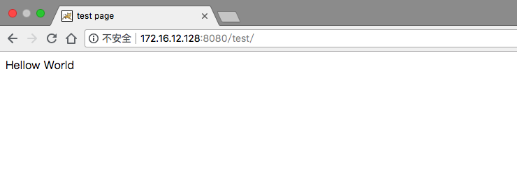

<!--more-->

## 1. tomcat简介

> Tomcat是Apache 软件基金会（Apache Software Foundation）的Jakarta 项目中的一个核心项目，由Apache、Sun 和其他一些公司及个人共同开发而成。由于有了Sun 的参与和支持，最新的Servlet 和JSP 规范总是能在Tomcat 中得到体现，Tomcat 5支持最新的Servlet 2.4 和JSP 2.0 规范。因为Tomcat 技术先进、性能稳定，而且免费，因而深受Java 爱好者的喜爱并得到了部分软件开发商的认可，成为目前比较流行的Web 应用服务器。
> 
> Tomcat 服务器是一个免费的开放源代码的Web 应用服务器，属于轻量级应用服务器，在中小型系统和并发访问用户不是很多的场合下被普遍使用，是开发和调试JSP 程序的首选。对于一个初学者来说，可以这样认为，当在一台机器上配置好Apache 服务器，可利用它响应HTML（标准通用标记语言下的一个应用）页面的访问请求。实际上Tomcat是Apache 服务器的扩展，但运行时它是独立运行的，所以当你运行tomcat 时，它实际上作为一个与Apache 独立的进程单独运行的。
> 
> 诀窍是，当配置正确时，Apache 为HTML页面服务，而Tomcat 实际上运行JSP 页面和Servlet。另外，Tomcat和IIS等Web服务器一样，具有处理HTML页面的功能，另外它还是一个Servlet和JSP容器，独立的Servlet容器是Tomcat的默认模式。不过，Tomcat处理静态HTML的能力不如Apache服务器。目前Tomcat最新版本为9.0。

tomcat就是传说中的中间件之一，tomcat本身是一个容器，专门用来运行java程序，java语言开发的网页.jsp就应该运行于tomcat中。而tomcat本身的运行也依赖于jdk环境。

tomcat应用场景：`lnmt`

## 2. tomcat项目部署

### 2.1 java环境安装

```
安装jdk环境
[root@localhost ~]# yum -y install java-1.8.0-openjdk java-1.8.0-openjdk-devel
.....安装过程略

查看安装的版本
[root@localhost ~]# java -version
openjdk version "1.8.0_131"
OpenJDK Runtime Environment (build 1.8.0_131-b12)
OpenJDK 64-Bit Server VM (build 25.131-b12, mixed mode)
```

### 2.2 tomcat部署

上[官网](http://tomcat.apache.org/)下载tomcat

```
下载tomcat
[root@localhost ~]# cd /usr/src/
[root@localhost src]# wget https://archive.apache.org/dist/tomcat/tomcat-9/v9.0.8/bin/apache-tomcat-9.0.8.tar.gz

解压部署
[root@localhost src]# ls
apache-tomcat-9.0.8.tar.gz  debug  kernels
[root@localhost src]# tar xf apache-tomcat-9.0.8.tar.gz -C /usr/local/
[root@localhost src]# cd /usr/local/
[root@localhost local]# ln -s apache-tomcat-9.0.8/ tomcat
[root@localhost local]# ll
total 0
drwxr-xr-x. 9 root root 160 Sep  4 19:45 apache-tomcat-9.0.8
drwxr-xr-x. 2 root root   6 Mar 10  2016 bin
drwxr-xr-x. 2 root root   6 Mar 10  2016 etc
drwxr-xr-x. 2 root root   6 Mar 10  2016 games
drwxr-xr-x. 2 root root   6 Mar 10  2016 include
drwxr-xr-x. 2 root root   6 Mar 10  2016 lib
drwxr-xr-x. 2 root root   6 Mar 10  2016 lib64
drwxr-xr-x. 2 root root   6 Mar 10  2016 libexec
drwxr-xr-x. 2 root root   6 Mar 10  2016 sbin
drwxr-xr-x. 5 root root  49 Jun 13 19:03 share
drwxr-xr-x. 2 root root   6 Mar 10  2016 src
lrwxrwxrwx. 1 root root  20 Sep  4 19:45 tomcat -> apache-tomcat-9.0.8/


写一个hello world的java页面
[root@localhost ~]# vim index.jsp
[root@localhost ~]# cat index.jsp
<html>
<head>
        <title>test page</title>
</head>
<body>
        <%
            out.println("Hellow World");
        %>
</body>
</html>


[root@localhost ~]# mkdir /usr/local/tomcat/webapps/test
[root@localhost ~]# cp index.jsp /usr/local/tomcat/webapps/test/
[root@localhost ~]# ll /usr/local/tomcat/webapps/test/
total 4
-rw-r--r--. 1 root root 113 Sep  4 20:32 index.jsp


启动tomcat
[root@localhost ~]# /usr/local/tomcat/bin/catalina.sh start
Using CATALINA_BASE:   /usr/local/tomcat
Using CATALINA_HOME:   /usr/local/tomcat
Using CATALINA_TMPDIR: /usr/local/tomcat/temp
Using JRE_HOME:        /usr
Using CLASSPATH:       /usr/local/tomcat/bin/bootstrap.jar:/usr/local/tomcat/bin/tomcat-juli.jar
Tomcat started.

[root@localhost ~]# ps -ef|grep tomcat
root      21582      1 24 20:33 pts/0    00:00:05 /usr/bin/java -Djava.util.logging.config.file=/usr/local/tomcat/conf/logging.properties -Djava.util.logging.manager=org.apache.juli.ClassLoaderLogManager -Djdk.tls.ephemeralDHKeySize=2048 -Djava.protocol.handler.pkgs=org.apache.catalina.webresources -Dorg.apache.catalina.security.SecurityListener.UMASK=0027 -Dignore.endorsed.dirs= -classpath /usr/local/tomcat/bin/bootstrap.jar:/usr/local/tomcat/bin/tomcat-juli.jar -Dcatalina.base=/usr/local/tomcat -Dcatalina.home=/usr/local/tomcat -Djava.io.tmpdir=/usr/local/tomcat/temp org.apache.catalina.startup.Bootstrap start
root      21632  10293  0 20:34 pts/0    00:00:00 grep --color=auto tomcat
[root@localhost ~]# ss -antl
State       Recv-Q Send-Q                      Local Address:Port                                     Peer Address:Port
LISTEN      0      128                                     *:22                                                  *:*
LISTEN      0      100                             127.0.0.1:25                                                  *:*
LISTEN      0      100                                    :::8080                                               :::*
LISTEN      0      128                                    :::22                                                 :::*
LISTEN      0      100                                   ::1:25                                                 :::*
LISTEN      0      1                        ::ffff:127.0.0.1:8005                                               :::*
LISTEN      0      100                                    :::8009                                               :::*
```

在浏览器上浏览网页

