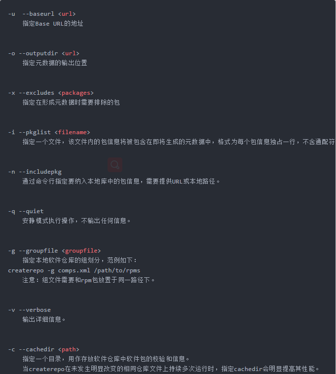
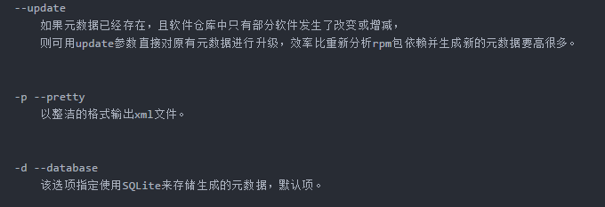

<!--more-->

# 1. rpm的弊端

---
前面我们讲了下rpm，那么rpm有什么弊端呢？
其弊端是显而易见的，当用rpm安装软件时，若遇到有依赖关系的软件，必须先安装依赖的软件才能继续安装我们要安装的软件，
当依赖关系很复杂的情况下，这种安装方式就很让人头疼，所以我们需要另一种安装方式来解决这个问题----yum安装工具

# 2. yum的优劣势

---
yum有什么优势呢？
yum最大的优势就是能够解决rpm的依赖问题，yum能够自动解决软件安装时的依赖关系。
当然了，有优势就有劣势，人无完人嘛，软件也是一样的。
yum的缺陷就是如果在未完成安装的情况下强行中止安装过程，下次再安装时将无法解决依赖关系。
Fedora22+、redhat7和centos7等可以通过手动安装dnf工具来解决此问题。
dnf是redhat7上用来代替yum的一个工具，其存在的意义就是处理yum的缺陷，但其用法与yum是完全一样的，甚至连选项都是一样的，你可以理解为dnf就是yum，只是换了个名字而已。所以说只要学会了yum就自然会dnf，大家不用担心学了yum又要去学dnf之类的问题

# 3. 什么是yum及其作用

---
那么什么是yum呢？yum是yellowdog update manager的简称，它能够实现rpm管理的所有操作，并能够自动解决各rpm包之间的依赖关系。yum是rpm的前端工具，是基于rpm来实现软件的管理的一个工具。
你不能用yum去管理windows的exe程序包，也不能用yum去管理ubuntu的deb程序包，只能用yum来管理redhat系列的rpm包

# 4. 挂载光盘

---

 - 插入光盘
 - 执行以下命令

```
[root@wenhs5479 ~]# mount /dev/cdrom /mnt
mount: /dev/sr0 is write-protected, mounting read-only
[root@wenhs5479 ~]# ls /mnt/
addons  EULA              GPL     isolinux  media.repo  repodata                 RPM-GPG-KEY-redhat-release
EFI     extra_files.json  images  LiveOS    Packages    RPM-GPG-KEY-redhat-beta  TRANS.TBL
[root@wenhs5479 ~]#
```

# 5. yum的原理

---


**yum的工作需要两部分来合作，一部分是yum服务器，另一部分就是client的yum工具。**

**yum服务器端工作原理**

所有要发行的rpm包都放在yum服务器上以提供别人来下载，rpm包根据kernel的版本号，cpu的版本号分别编译发布。yum服务器只要提供简单的下载就可以了，ftp或者http的形式都可以。yum服务器有一个最重要的环节就是整理出每个rpm包的基本信息，包括rpm包对应的版本号、conf文件、binary信息，以及很关键的依赖信息。在yum服务器上提供了createrepo工具，用于把rpm包的基本概要信息做成一张“清单”，这张“清单”就是描述每个rpm包的spec文件中信息。

**client端工作原理**

client每次调用yum install或者search的时候，都会去解析/etc/yum.repos.d下面所有以.repo结尾的配置文件，这些配置文件指定了yum服务器的地址。yum会定期去更新yum服务器上的rpm包清单，然后把清单下载保存到yum客户端自己的cache里面，根据/etc/yum.conf里配置（默认是/var/cache/yum下面），每次调用yum装包的时候都会去这个cache目录下去找清单，根据清单里的rpm包描述从而来确定安装包的名字、版本号、所需要的依赖包等，然后再去yum服务器下载rpm安装。（前提是不存在rpm包的cache）

# 6. yum的元数据

---
 - 存放位置（repodata目录）
 - 包含的文件及其对应的功能

	 - [ ] primary.xml.gz
		 - 当前仓库所有rpm包的列表；
		 - 依赖关系；
		 - 每个rpm包安装生成的文件列表
	 - [ ] filelists.xml.gz
		 - 当前仓库所有rpm包的所有文件列表
	 - [ ] other.xml.gz
		 - 额外信息，rpm包的修改日志
	 - [ ] repomd.xml
		 - 记录的是primary.xml.gz、filelists.xml.gz、other.xml.gz这三个文件的时间戳和校验和
	 - [ ] comps*.xml
		 - rpm包分组信息

# 7. yum的配置文件

---

 - 配置文件有哪些：
	 - [ ] **/etc/yum.conf 作用**：为所有仓库提供公共配置
	 - [ ] **/etc/yum.repos.d/*.repo 作用**：为仓库的指向提供配置
 - yum的repo配置文件中可用的变量：
	 - [ ] **$releaseversion**:当前OS的发行版的主版本号
	 - [ ] **$arch**：平台类型
	 - [ ] **$basearch**：基础平台

**为yum定义repo文件：**

```
[Repo_Name]：仓库名称
name：描述信息
baseurl：仓库的具体路径，接受以下三种类型
    ftp://
    http://
    file:///
enabled：可选值｛1｜0｝，1为启用此仓库，0为禁用此仓库
gpgcheck：可选值｛1｜0｝，1为检查软件包来源合法性，0为不检查来源
    如果gpgcheck设为1，则必须用gpgkey定义密钥文件的具体路径
    gpgkey=/PATH/TO/KEY
```

```
vim /etc/yum.conf
cachedir=/var/cache/yum/$basearch/$releasever   //缓存目录
keepcache=0     //缓存软件包, 1启动 0 关闭
debuglevel=2    //调试级别
logfile=/var/log/yum.log    //日志记录位置
exactarch=1     //检查平台是否兼容
obsoletes=1     //检查包是否废弃
gpgcheck=1      //检查来源是否合法,需要有制作者的公钥信息
plugins=1       //是否启用插件
tolerant={1|0}  //容错功能，1为开启，0为关闭，当设为0时，如果用yum安装多个软件包且其中某个软件包已经安装过就会报错；当设为1时，当要安装的软件已经安装时自动忽略
installonly_limit=5
bugtracker_url
# metadata_expire=90m //每一个半小时手动检查元数据
# in /etc/yum.repos.d   //包含repos.d目录 
```

# 8. yum仓库管理

---

#### 8.1 yum本地仓库

 - 挂载光盘参照本章第4部分内容
 - 复制光盘内容到yum服务器

```
[root@wenhs5479 ~]# mkdir /opt/myrepo
[root@wenhs5479 ~]# cp -r /mnt/* /opt/myrepo/
[root@wenhs5479 ~]# ls /opt/myrepo/
addons  EULA              GPL     isolinux  media.repo  repodata                 RPM-GPG-KEY-redhat-release
EFI     extra_files.json  images  LiveOS    Packages    RPM-GPG-KEY-redhat-beta  TRANS.TBL
```

 - 配置repo文件

```
[root@wenhs5479 ~]# ls /etc/yum.repos.d/
redhat.repo
[root@wenhs5479 ~]# vim /etc/yum.repos.d/myrepo.repo
[root@wenhs5479 ~]# cat /etc/yum.repos.d/myrepo.repo
[myrepo]
name=myrepo
baseurl=file:///opt/myrepo
gpgcheck=0
enabled=1
[root@wenhs5479 ~]#
```

 - 清空yum本地缓存

```
[root@wenhs5479 ~]# yum clean all
Loaded plugins: langpacks, product-id, search-disabled-repos, subscription-manager
This system is not registered with an entitlement server. You can use subscription-manager to register.
Cleaning repos: myrepo
Cleaning up everything
Maybe you want: rm -rf /var/cache/yum, to also free up space taken by orphaned data from disabled or removed repos
```

 - 检验yum本地仓库

```
[root@wenhs5479 ~]# yum list all
```

#### 8.2 yum网络仓库

 - 官方网络yum仓库（国外）:速度慢
 - 阿里云yum仓库
 - 163yum仓库
 - xx大学yum仓库
 - epel源:软件包相对比较最全的第三方源

```
Base/Extras/Updates: 默认国外官方源
[root@wenhs5479 ~]# curl -o /etc/yum.repos.d/CentOS-Base.repo \
http://mirrors.aliyun.com/repo/Centos-7.repo

国外epel源
[root@wenhs5479 ~]# yum -y install epel-release

阿里云epel源
[root@wenhs5479 ~]# curl -o /etc/yum.repos.d/epel.repo \
http://mirrors.aliyun.com/repo/epel-7.repo
```

#### 8.3 软件官方仓库

```
源查找方式基本一致,zabbix,mysql,saltstack,openstack等等，上官网找
[root@wenhs5479 ~]# vim /etc/yum.repos.d/nginx.repo
[nginx]
name=nginx repo 
baseurl=http://nginx.org/packages/centos/7/$basearch/ 
gpgcheck=0
enabled=1
```

#### 8.4 redhat7使用centos7的yum源

```
1.卸载红帽yum源
[root@wenhs5479 ~]# rpm -e $(rpm -qa|grep yum) --nodeps

2.删除所有repo相关文件
[root@wenhs5479 ~]# rm -f /etc/yum.conf
[root@wenhs5479 ~]# rm -rf /etc/yum.repos.d/
[root@wenhs5479 ~]# rm -rf /var/cache/yum

3.下载centos相关yum组件
[root@wenhs5479 ~]# wget https://mirrors.aliyun.com/centos/7/os/x86_64/Packages/yum-3.4.3-154.el7.centos.noarch.rpm
[root@wenhs5479 ~]# wget https://mirrors.aliyun.com/centos/7/os/x86_64/Packages/yum-metadata-parser-1.1.4-10.el7.x86_64.rpm
[root@wenhs5479 ~]# wget https://mirrors.aliyun.com/centos/7/os/x86_64/Packages/yum-plugin-fastestmirror-1.1.31-42.el7.noarch.rpm
[root@wenhs5479 ~]# wget https://mirrors.aliyun.com/centos/7/os/x86_64/Packages/yum-updateonboot-1.1.31-42.el7.noarch.rpm
[root@wenhs5479~]# wget https://mirrors.aliyun.com/centos/7/os/x86_64/Packages/yum-utils-1.1.31-42.el7.noarch.rpm

如果没有wget命令则使用curl命令
[root@wenhs5479 ~]# curl -o yum-utils-1.1.31-42.el7.noarch.rpm  https://mirrors.aliyun.com/centos/7/os/x86_64/Packages/yum-utils-1.1.31-42.el7.noarch.rpm
[root@wenhs5479 ~]# curl -o yum-3.4.3-154.el7.centos.noarch.rpm  https://mirrors.aliyun.com/centos/7/os/x86_64/Packages/yum-3.4.3-154.el7.centos.noarch.rpm
[root@wenhs5479 ~]# curl -o yum-metadata-parser-1.1.4-10.el7.x86_64.rpm  https://mirrors.aliyun.com/centos/7/os/x86_64/Packages/yum-metadata-parser-1.1.4-10.el7.x86_64.rpm
[root@wenhs5479 ~]# curl -o yum-plugin-fastestmirror-1.1.31-42.el7.noarch.rpm   https://mirrors.aliyun.com/centos/7/os/x86_64/Packages/yum-plugin-fastestmirror-1.1.31-42.el7.noarch.rpm
[root@wenhs5479 ~]# curl -o yum-updateonboot-1.1.31-42.el7.noarch.rpm https://mirrors.aliyun.com/centos/7/os/x86_64/Packages/yum-updateonboot-1.1.31-42.el7.noarch.rpm

3.安装所有相关组件
[root@wenhs5479 ~]# rpm -ivh yum-* --nodeps

4.下载base和epel仓库
[root@wenhs5479 ~]# wget -O /etc/yum.repos.d/CentOS-Base.repo http://mirrors.aliyun.com/repo/Centos-7.repo
[root@wenhs5479 ~]# sed -i 's#\$releasever#7#g' /etc/yum.repos.d/CentOS-Base.repo

[root@wenhs5479 ~]# wget -O /etc/yum.repos.d/epel.repo http://mirrors.aliyun.com/repo/epel-7.repo
```

# 9. yum管理软件

#### 9.1 yum命令语法：

```
yum [options] [command] [package ...]
```

#### 9.2 常用的options：

```
--nogpgcheck                //如果从网上下载包有时会检查gpgkey，此时可以使用此命令跳过gpgkey的检查
-y                          //自动回答为"yes"
-q                          //静默模式，安装时不输出信息至标准输出
--disablerepo=repoidglob    //临时禁用此处指定的repo
--enablerepo=repoidglob     //临时启用此处指定的repo
--noplugins                 //禁用所有插件
```

**9.3 常用的command：**

```
list            //列表
    all         //默认项
    available   //列出仓库中有的，但尚未安装的所有可用的包
    installed   //列出已经安装的包
    updates     //可用的升级
    
clean           //清理缓存
    packages
    headers
    metadata
    dbcache
    all

repolist        //显示repo列表及其简要信息
    all
    enabled     //默认项
    disabled
    
install         //安装
    yum install packages [...]

update          //升级
    yum update packages [...]
update_to       //升级为指定版本

downgrade package1 [package2 ...]   //降级

remove|erase    //卸载

info    //显示rpm -qi package的结果
    yum info packages
    
provides|whatprovides   //查看指定的文件或特性是由哪个包安装生成的

search string1 [string2 ...]    //以指定的关键字搜索程序包名及summary信息

deplist package [package2 ...]  //显示指定包的依赖关系

history     //查看yum的历史事务信息

localinstall    //安装本地rpm包，自动解决依赖关系

grouplist       //列出可用的组

groupinstall "group name"   //安装一组软件

createrepo命令    //创建yum仓库的元数据信息
[root@wenhs5479 ~]# yum install createrepo -y
[root@wenhs5479 ~]# createrepo [options] <directory>

createrepo --update:

有时候你的软件仓库中含有很多的软件包，虽然只是其中的一小部分有所改动但是你却不必为每个软件包重新产生元数据，这样做明显太浪费时间了。这就是--update 选项诞生的原因。
像之前一样运行 createrepo 命令但是添加了--update
```





```
使用自己下载的rpm包搭建本地仓库，需要用createrepo去创建仓库元数据

#  createrepo  -v    /path/to/rpmDir

SQLite 是一个软件库,实现了自给自足的、无服务器的、零配置的、事务性的 SQL 数据库引擎。
什么是元数据:
元数据(metadata) 
1.任何文件系统中的数据分为数据和元数据
2.数据是指普通文件中的实际数据
3.而元数据指用来描述一个文件的特征
4.比如:访问权限,文件拥有者以及文件数据快的分布信息(inode...)等
```

#### 9.4 具体实例

**9.4.1 搜索软件包**

```
列出软件仓库中可用的软件
[root@wenhs5479 ~]# yum list all

进行模糊查找
[root@wenhs5479 ~]# yum list|grep ftp

列出软件包详情
[root@wenhs5479 ~]# yum info ftp
```

**9.4.2 安装软件包**

```
安装软件只需要给出软件名称
[root@wenhs5479 ~]# yum install traceroute

安装过程中分析依赖关系后, 直接安装, 无需交互
[root@wenhs5479 ~]# yum -y install php

安装本地的rpm包, 如果有依赖关系, 会自动从软件仓库中下载所需依赖（非来自.repo定义的软件仓库）
[root@wenhs5479 ~]# yum localinstall /mnt/Packages/bind-9.9.4-50.el7.x86_64.rpm

安装网络上rpm包
[root@wenhs5479 ~]# yum install http://repo.zabbix.com/zabbix/3.4/rhel/7/x86_64/zabbix-release-3.4-2.el7.noarch.rpm
```

**9.4.3 重装软件包**

```
检查软件是否存在
[root@wenhs5479 ~]# rpm -q vsftpd
vsftpd-2.2.2-24.el6.x86_64

检查vsftpd软件配置文件
[root@wenhs5479 ~]# rpm -qc vsftpd
/etc/logrotate.d/vsftpd
/etc/pam.d/vsftpd
/etc/vsftpd/ftpusers
/etc/vsftpd/user_list
/etc/vsftpd/vsftpd.conf

不小心删除vsftpd配置文件
[root@wenhs5479 ~]# rm -f /etc/vsftpd/vsftpd.conf

重新安装软件
[root@wenhs5479 ~]# yum reinstall vsftpd

再次检查
[root@wenhs5479 ~]# rpm -qc vsftpd
/etc/logrotate.d/vsftpd
/etc/pam.d/vsftpd
/etc/vsftpd/ftpusers
/etc/vsftpd/user_list
/etc/vsftpd/vsftpd.conf
```

**9.4.4 更新软件包**

```
对比Linux已安装的软件和yum仓库中的软件, 有哪些需要升级
[root@wenhs5479 ~]# yum check-update

更新软件
[root@wenhs5479 ~]#  yum update acl -y
```

**9.4.5 删除软件包**

```
先安装一个samba软件
[root@wenhs5479 ~]# yum -y install samba

删除该软件包,不会删除依赖, 但是我们尽可能不要使用删除软件操作
[root@wenhs5479 ~]# yum -y erase samba
[root@wenhs5479 ~]# yum -y remove samba
```

**9.4.6 与仓库相关的命令**

```
列出yum源可用的软件仓库
[root@wenhs5479 ~]# yum repolist

列出全部yum源可用和禁用的仓库
[root@wenhs5479 ~]# yum repolist all

查看这个文件或命令属于哪个包
[root@wenhs5479 ~]# yum provides /etc/my.cnf
[root@wenhs5479 ~]# yum provides cd
[root@wenhs5479 ~]# yum provides *bin/pstree
```

**9.4.7 与缓存相关的命令**

```
缓存yum源软件仓库, xml元数据文件
[root@wenhs5479 ~]# yum makecache

缓存软件包, 修改yum全局配置文件
[root@wenhs5479 ~]# vim /etc/yum.conf
[main]
cachedir=/var/cache/yum/$basearch/$releasever
keepcache=1 //启动缓存


查看缓存的xml文件
[root@wenhs5479 ~]# ls /var/cache/yum/x86_64/7/base/

查看缓存软件包路径
[root@wenhs5479 ~]# ls /var/cache/yum/x86_64/7/


#另一种缓存rpm包方式

1.安装插件支持只下载软件包不安装
[root@wenhs5479 ~]# yum -y install yum-plugin-downloadonly
2.将软件下载至指定目录
[root@wenhs5479 ~]# yum -y install --downloadonly --downloaddir=/tmp httpd


清除所有yum缓存
[root@wenhs5479 ~]# yum clean all

只清除缓存的软件包
[root@wenhs5479 ~]# yum clean packages
```

**9.4.8 与包组相关的命令**

```
列出已经安装和所有可使用的软件组
[root@wenhs5479 ~]# yum groups list

安装一整个组的软件
[root@wenhs5479 ~]# yum groups install Development tools Compatibility libraries Base Debugging Tools

yum删除包组
[root@wenhs5479 ~]# yum groups remove  -y Base
```

**9.4.9 与历史记录相关的命令**

```
查看历史执行yum命令
[root@wenhs5479 ~]# yum history

查询历史执行yum命令ID详细信息
[root@wenhs5479 ~]# yum history info N

撤销历史执行过的yum命令
[root@wenhs5479 ~]# yum history undo N
```

**9.4.10 YUM签名检查机制**

 - rpm软件提供组织redhat在构建rpm包时, 使用其私钥private key对 rpm进行签名
 - 客户端在使用rpm为了验证其合法性, 可以使用redhat提供的公钥public key进行签名检查

方式1：**指定公钥位置**

```
[root@wenhs5479 ~]# vim /etc/yum.repos.d/CentOS-Base.repo
[base]
name=CentOS-$releasever - Base mirrorlist=http://mirrorlist.centos.org/?release=$releasever&arch=$basearch&repo=os&infra=$infra #baseurl=http://mirror.centos.org/centos/$releasever/os/$basearch/
gpgcheck=1
gpgkey=file:///etc/pki/rpm-gpg/RPM-GPG-KEY-CentOS-7
```

方式2：**提前导入公钥**

```
[root@wenhs5479 ~]# rpm --import /etc/pki/rpm-gpg/RPM-GPG-KEY-CentOS-7
[root@wenhs5479 ~]# vim /etc/yum.repos.d/CentOS-Base.repo
[base]
name=CentOS-$releasever - Base 
mirrorlist=http://mirrorlist.centos.org/?release=$releasever&arch=$basearch&repo=os&infra=$infra
baseurl=http://mirror.centos.org/centos/$releasever/os/$basearch/
gpgcheck=1
```

方式3：**不进行签名验证**

```
不检查软件包的签名
[root@wenhs5479 ~]# yum install httpd --nogpgcheck
```
### 示例：

配置本地光盘yum仓库以及网络yum仓库

```
[root@wenhs5479 ~]# mkdir /localhost
[root@wenhs5479 ~]# mount /dev/sr0 /localhost
mount: /dev/sr0 写保护，将以只读方式挂载
[root@wenhs5479 ~]# cat <<END>>/etc/yum.repos.d/localhost.repo
> [localhost]
> name=wenhs5479
> baseurl=file:///localhost/#########本地挂载源路径
> gpgcheck=0################关闭验证
> enabled=1################开启软件源
> END
[root@wenhs5479 ~]# yum clean all
已加载插件：fastestmirror, langpacks
正在清理软件源： base extras localhost updates
Cleaning up list of fastest mirrors
[root@wenhs5479 ~]# yum makecache
已加载插件：fastestmirror, langpacks
Determining fastest mirrors
......
* updates: mirrors.aliyun.com
源标识                              源名称                                状态
base/7/x86_64                       CentOS-7 - Base                       10,019
extras/7/x86_64                     CentOS-7 - Extras                        371
localhost                           wenhs5479                             10,019
updates/7/x86_64                    CentOS-7 - Updates                     1,158
repolist: 21,567
[root@wenhs5479 ~]# 


网络源,上方列出方法很多
```

配置yum缓存rpm包（至少阐述两种方式）

```
1.yum makecache

2.设置 /etc/yum.conf 中的 keepcache 选项为 1：keepcache=1
```

使用yum安装本地缓存好的rpm包

```
yum -y install /path/*.rpm

这个install可以换成localinstall
```

使用yum删除httpd软件包

```
yum -y remove httpd
```

构建企业内部yum仓库服务(请写出详细步骤,至少准备两台虚拟机，使用http方式)

```
1.两台虚拟机互通
2.其中一台挂载iso或者把ISO镜像中的东西拷贝在一个目录
3.安装httpd服务,并设置开机自启,防火墙和selinux在内网最好关闭,免得自寻烦恼
4.创建网站的虚拟主机指向拷贝ISO镜像文件的目录,先本机测试,网页能不能访问,能访问再接下一步
5.配置第二台客户机的repo文件,参数如下:

[root@wenhs5479 ~]# cat <<END>>/etc/yum.repos.d/http.repo
> [http]
> name=wenhs5479
> baseurl=http://第一台主机IP加端口,默认80可不写/软件包路径/#########网路挂载源路径
> gpgcheck=0################关闭验证
> enabled=1################开启软件源
> END
[root@wenhs5479 ~]# yum clean all
清理缓存
[root@wenhs5479 ~]# yum makecache
重建缓存
```