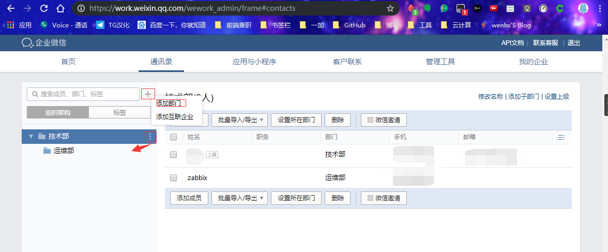
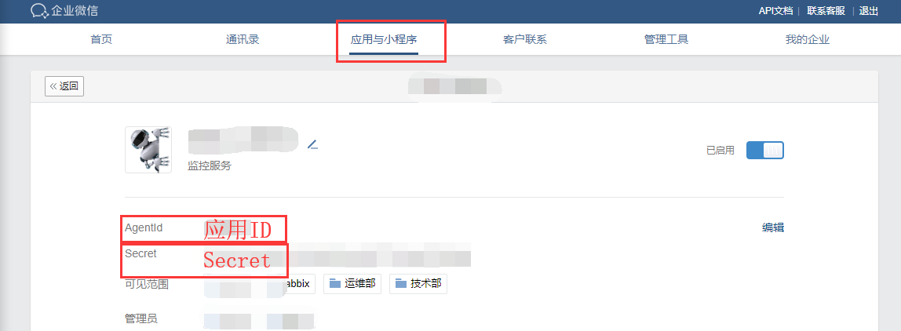
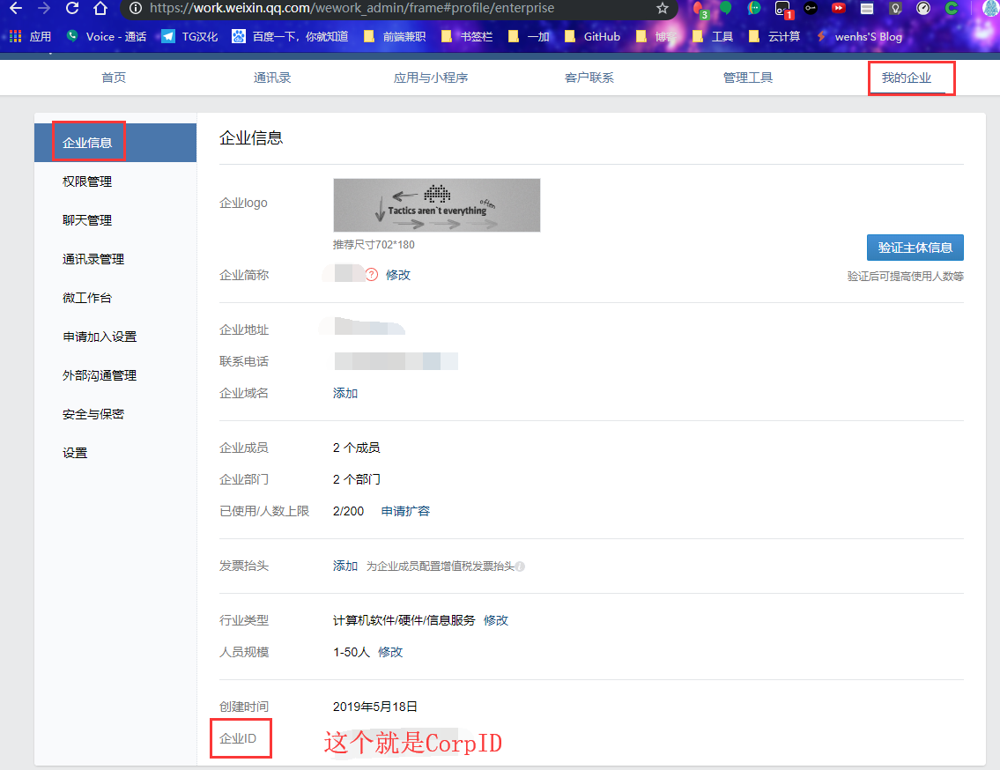
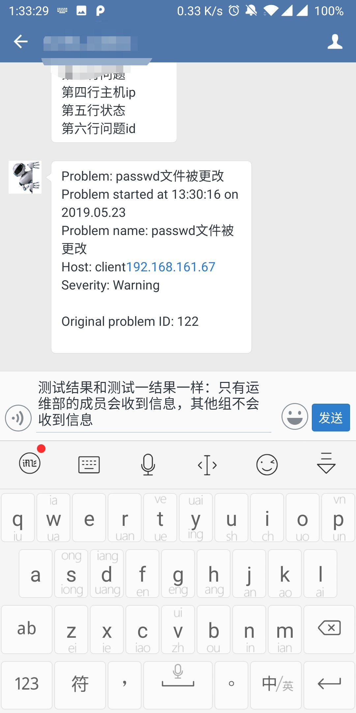

<!--more-->


## 一,zabbix配置WeChat报警

写先声明:本人完全python小白,脚本内容有许多看不懂,这都不影响接下来的操作,写这个就是为了复习记忆,也多谢[官网](https://www.zabbix.com/cn/integrations/wechat)推荐的,用于WeChat报警的python脚本,主要是图文教程,配合作者[火星小刘](https://github.com/X-Mars/Zabbix-Alert-WeChat)的README和脚本,更容易学习.

注意事项等,作者[火星小刘](https://github.com/X-Mars/Zabbix-Alert-WeChat)的README中有,下面开始教程正文

### 需要具备一下条件

 - 注册微信企业号 [点击注册](https://qy.weixin.qq.com/)   或    注册企业号微信  [点击注册](https://work.weixin.qq.com/）


信息不要求,无需认证

#### 安装组件

1. 安装方法一

```
yum -y install python-pip python-wheel python-setuptools
yum upgrade python-setuptools
pip install requests
pip install --upgrade requests
```

2. 安装方法二

```
wget https://pypi.python.org/packages/c3/38/d95ddb6cc8558930600be088e174a2152261a1e0708a18bf91b5b8c90b22/requests-2.18.3.tar.gz
tar zxvf requests-2.18.3.tar.gz
cd requests-2.18.3
python setup.py build
python setup.py install
```

#### 下载安装脚本  

```
git clone https://github.com/X-Mars/Zabbix-Alert-WeChat.git  
cp Zabbix-Alert-WeChat/wechat.py /etc/zabbix/alertscripts  
chmod +x /usr/local/etc/scripts/wechat.py  
chown zabbix.zabbix /usr/local/etc/scripts/wechat.py 
```

### 微信企业号设置

#### 通讯录设置

登陆微信企业号控制台  


点击左侧“通讯录”，新增部门（技术部）与子部门（运维部），并添加用户 




点击（运维部）后方的三角，修改部门，记录**部门ID**  


#### 创建应用  

点击左侧“应用中心”，新建消息型应用，应用名称“自己随便取” 


“应用可见范围”，添加刚刚新建的子部门（运维部）  


点击“自己随便取的应用”，记录**应用ID**

#### 应用权限设置  

点击左侧“设置”，权限管理，新建普通管理组，名称填写“zabbix报警组”  
点击修改“通讯录权限”，勾选（技术部）后方的管理  
点击修改“应用权限”，勾选刚刚创建的“zabbix报警”  


点击刚刚创建的“zabbix报警组”，记录左侧的**CorpID与Secret**(个人创建的没有,问题不大)

#### 收集微信相关信息

1. 记录**应用ID**



2. 记录**CorpID与Secret**



3. 记录**子部门（运维部）ID**


这时,就可以填写脚本却的参数了:

```
#!/usr/bin/python2.7
#_*_coding:utf-8 _*_
#auther:火星小刘(出自这位大佬的GitHub库,链接在开头)

import requests,sys,json
import urllib3
urllib3.disable_warnings()

reload(sys)
sys.setdefaultencoding('utf-8')

def GetTokenFromServer(Corpid,Secret):
    Url = "https://qyapi.weixin.qq.com/cgi-bin/gettoken"
    Data = {
        "corpid":Corpid,
        "corpsecret":Secret
    }
    r = requests.get(url=Url,params=Data,verify=False)
    print(r.json())
    if r.json()['errcode'] != 0:
        return False
    else:
        Token = r.json()['access_token']
        file = open('/tmp/zabbix_wechat_config.json', 'w')
        file.write(r.text)
        file.close()
        return Token

def SendMessage(User,Agentid,Subject,Content):
    try:
        file = open('/tmp/zabbix_wechat_config.json', 'r')
        Token = json.load(file)['access_token']
        file.close()
    except:
        Token = GetTokenFromServer(Corpid, Secret)

    n = 0
    Url = "https://qyapi.weixin.qq.com/cgi-bin/message/send?access_token=%s" % Token
    Data = {
        "touser": User,          # 企业号中的用户帐号，在zabbix用户Media中配置，如果配置不正常，将按部门发送。
        "totag": Tagid,          # 企业号中的标签id，群发使用（推荐）
        "toparty": Partyid,      # 企业号中的部门id，群发时使用。
        "msgtype": "text",       # 消息类型。
        "agentid": Agentid,      # 企业号中的应用id。
        "text": {
            "content": Subject + '\n' + Content
        },
        "safe": "0"
    }
    r = requests.post(url=Url,data=json.dumps(Data),verify=False)
    while r.json()['errcode'] != 0 and n < 4:
        n+=1
        Token = GetTokenFromServer(Corpid, Secret)
        if Token:
            Url = "https://qyapi.weixin.qq.com/cgi-bin/message/send?access_token=%s" % Token
            r = requests.post(url=Url,data=json.dumps(Data),verify=False)
            print(r.json())

    return r.json()


if __name__ == '__main__':
    User = sys.argv[1]               # zabbix传过来的第一个参数{ALERT.SENDTO}
    Subject = str(sys.argv[2])       # zabbix传过来的第二个参数{ALERT.SUBJECT}
    Content = str(sys.argv[3])       # zabbix传过来的第三个参数{ALERT.MESSAGE}

    Corpid = "企业Id"         # CorpID是企业号的标识
    Secret = "在应用里面"      # Secret是管理组凭证密钥
    Tagid = "zabbix"         # 通讯录标签ID(这个没搞懂,随便写的通讯录标签名)
    Agentid = "自己修改"      # 应用ID
    Partyid = "2"            # 部门ID,如果是1,则是技术部,那么技术部下面的,都可以收到告警,显然不合适

    Status = SendMessage(User,Agentid,Subject,Content)
    print Status
```

### zabbix设置

1. 添加示警媒介  


#### 管理-->示警媒介  

名称填写**微信报警**，类型选择**脚本**，脚本名称填写**wechat.py**  

#### 管理-->用户-->示警媒介

类型选择**微信报警**，收件人添加**微信企业号通讯录内的，用户帐号**


添加到动作,具体方法,如下图所示


测试一:


结果一:


测试二:手动触发


结果二:



## 二,钉钉告警

**下载钉钉后创建群组**

**添加机器人实现报警**

 

**添加完成**

创建告警脚本

```
简洁版一:
#!/usr/bin/python
# -*- coding: utf-8 -*-

import requests
import json
import sys
import os
headers = {'Content-Type': 'application/json;charset=utf-8'}
#api_url后跟告警机器人的webhook
api_url = "上图中的webhook的链接"
def msg(text):
   json_text= {
    "msgtype": "text",
    "text": {
        "content": text
    },
    "at": {
        "atMobiles": [
            "手机号"    #@群里的一个人
        ],
        "isAtAll": False  #@所有人为True,
    }
   }
   print(requests.post(api_url,json.dumps(json_text),headers=headers).content)
if __name__ == '__main__':
   text = sys.argv[1]
   msg(text)
   
   
脚本二:
#!/usr/bin/env python
#coding:utf-8
#zabbix钉钉报警
import requests,json,sys,os,datetime
webhook="https://oapi.dingtalk.com/robot/send?access_token=8ea7abd3db4b49a9e898e911920d4899c526ae78f5794c977cfca8b6c0b77fdf"
user=sys.argv[1]
text=sys.argv[3]
data={
    "msgtype": "text",
    "text": {
        "content": text
    },
    "at": {
        "atMobiles": [
            user
        ],
        "isAtAll": False
    }
}
headers = {'Content-Type': 'application/json'}
x=requests.post(url=webhook,data=json.dumps(data),headers=headers)
if os.path.exists("/tmp/ding.log"):
    f=open("/tmp/ding.log","a+")
else:
    f=open("tmp/ding.log","w+")
f.write("\n"+"--"*30)
if x.json()["errcode"] == 0:
    f.write("\n"+str(datetime.datetime.now())+"    "+str(user)+"    "+"发送成功"+"\n"+str(text))
    f.close()
else:
    f.write("\n"+str(datetime.datetime.now()) + "    " + str(user) + "    " + "发送失败" + "\n" + str(text))
    f.close()
    
```

赋予执行权限

```
chown zabbix.zabbix ding.py

chmod +x ding.py
```

测试

```
[root@zabbix scripts]# ./ding.py 这是测试
{"errcode":0,"errmsg":"ok"}
[root@zabbix scripts]# ./ding.py 这是测试
{"errcode":0,"errmsg":"ok"}
```


如果想知道消息内容中宏，可参考[官网宏的使用场景](https://www.zabbix.com/documentation/4.2/manual/appendix/macros/supported_by_location)

```
服务器:{HOST.NAME}发生: {TRIGGER.NAME}故障!
{
告警主机:{HOST.NAME}
告警地址:{HOST.IP}
监控项目:{ITEM.NAME}
监控取值:{ITEM.LASTVALUE}
告警等级:{TRIGGER.SEVERITY}
当前状态:{TRIGGER.STATUS}
告警信息:{TRIGGER.NAME}
告警时间:{EVENT.DATE} {EVENT.TIME}
事件ID:{EVENT.ID}
}

服务器:{HOST.NAME}: {TRIGGER.NAME}已恢复!
{
告警主机:{HOST.NAME}
告警地址:{HOST.IP}
监控项目:{ITEM.NAME}
监控取值:{ITEM.LASTVALUE}
告警等级:{TRIGGER.SEVERITY}
当前状态:{TRIGGER.STATUS}
告警信息:{TRIGGER.NAME}
告警时间:{EVENT.DATE} {EVENT.TIME}
恢复时间:{EVENT.RECOVERY.DATE} {EVENT.RECOVERY.TIME}
持续时间:{EVENT.AGE}
事件ID:{EVENT.ID}
}

服务器:{HOST.NAME}: 报警确认
{
确认人:{USER.FULLNAME} 
时间:{ACK.DATE} {ACK.TIME} 
确认信息如下:
"{ACK.MESSAGE}"
问题服务器IP:{HOSTNAME1}
问题ID:{EVENT.ID}
当前的问题是: {TRIGGER.NAME}
}
分别填在下面3个操作
```


创建报警媒介   


脚本二需要3个脚本参数：ALERT.SENDTO      ALERT.SUBJECT      ALERT.MESSAGE


用户设置媒介(收件人py脚本写死了,这随便写)


脚本二:


添加动作(和上方WeChat方法一样,改一个通知介质),这里就不截屏了

最后测试附图:

