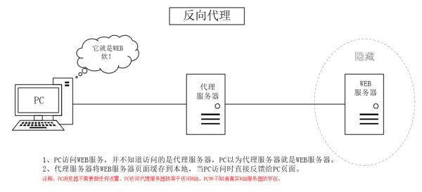
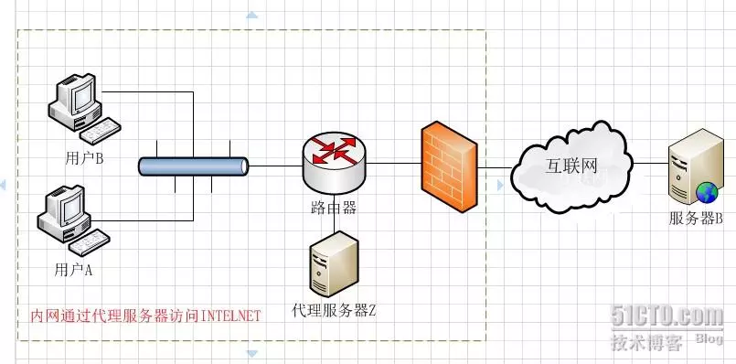

<!--more-->

## 正向代理、反向代理以及透明代理的简单总结

代理服务技术是一门很古老的技术，是在互联网早期出现就使用的技术。一般实现代理技术的方式就是在服务器上安装代理服务软件，让其成为一个代理服务器，从而实现代理技术。常用的代理技术分为正向代理、反向代理和透明代理。

### 1.正向代理服务器

正向代理服务器位于用户与目标服务器之间，用户通过对代理服务器发送指向目标服务器的请求来获得资源。用户端需要作一些设定才可以使用正向代理服务器，而反向/透明代理服务器是不需要对用户端进行任何设定的。

### 2.反向代理服务器

反向代理服务器同样位于用户与目标服务器之间，但对于用户而言，反向代理服务器就相当于目标服务器，即用户直接访问反向代理服务器就可以获得目标服务器的资源。同时，用户不需要知道目标服务器地址，也无需在用户端作任何设定。反向代理服务器通常可用来作Web加速，即使用反向代理作为Web服务器的前置机来降低网络和服务器的负载，提高访问效率。

### 3.透明代理服务器

透明代理服务器位于于用户与目标服务器之间.和前两种服务器不同的是，用户即不需要对客户端进行任何设定，也无需知道代理服务器的地址。用户只需要向目标服务器上的资源发起请求即可，然后透明代理服务器会将系统的请求重新定向到代理服务器，然后由代理服务器获得目标资源并返回给用户端。通常，透明代理服务器在局域网中应用。

### 正向代理(Forward Proxy)-代理端代理的是客户端

一般情况下，如果没有特别说明，代理技术默认说的是正向代理技术。关于正向代理的概念如下： 正向代理(forward)是一个位于客户端【用户A】和原始服务器(origin server)【服务器B】之间的服务器【代理服务器Z】，为了从原始服务器取得内容，用户A向代理服务器Z发送一个请求并指定目标(服务器B)，然后代理服务器Z向服务器B转交请求并将获得的内容返回给客户端。客户端必须要进行一些特别的设置才能使用正向代理。 

从上面的概念中，我们看出，文中所谓的**正向代理就是代理服务器替代访问方【用户】去访问目标服务器【服务器】**

#### 使用正向代理服务器的作用如下：

**1.翻墙**

国内用浏览器访问某些被强网站时，被残忍的拒绝了，于是你可以在国外搭建一台代理服务器，让代理帮我去请求，代理把请求返回的相应结构再返回给我。

**2.Cache作用**

数据缓存在代理服务器上，如果客户端请求的内容在缓存中则不去访问目标主机。 Cache（缓存）技术和代理服务技术是紧密联系的（不光是正向代理，反向代理也使用了Cache（缓存）技术。如果在用户A访问服务器B某数据J之前，已经有人通过代理服务器Z访问过服务器B上得数据J，那么代理服务器Z会把数据J保存一段时间，如果有人正好取该数据J，那么代理服务器Z不再访问服务器B，而把缓存的数据J直接发给用户A。这一技术在Cache中术语就叫Cache命中。如果有更多的像用户A的用户来访问代理服务器Z，那么这些用户都可以直接从代理服务器Z中取得数据J，而不用千里迢迢的去服务器B下载数据了。

**3.客户端访问授权**

这方面的内容现今使用的还是比较多的，例如一些公司采用ISA SERVER做为正向代理服务器来授权用户是否有权限访问互联网。

防火墙作为网关，用来过滤外网对其的访问。假设用户A和用户B都设置了代理服务器，用户A允许访问互联网，而用户B不允许访问互联网（这个在代理服务器Z上做限制）这样用户A因为授权，可以通过代理服务器访问到服务器B，而用户B因为没有被代理服务器Z授权，所以访问服务器B时，数据包会被直接丢弃。

**4.隐藏访问者**

通过配置，目标服务器无法获取真实客户端信息，只能获取到代理服务器的信息

\##反向代理(Forward Proxy)-代理端代理的是服务端

反向代理正好与正向代理相反，对于客户端而言**代理服务器就像是原始服务器**，并且客户端不需要进行任何特别的设置。客户端向反向代理的命名空间(name-space)中的内容发送普通请求，接着反向代理将判断向何处(原始服务器)转交请求，并将获得的内容返回给客户端。

#### 使用反向代理服务器的作用如下：

**1.保护和隐藏原始资源服务器**

如上图所示，用户A始终认为它访问的是原始服务器B而不是代理服务器Z，但实用际上反向代理服务器接受用户A的应答，从原始资源服务器B中取得用户A的需求资源，然后发送给用户A。由于防火墙的作用，只允许代理服务器Z访问原始资源服务器B。尽管在这个虚拟的环境下，防火墙和反向代理的共同作用保护了原始资源服务器B，但用户A并不知情。

**2.负载均衡**

当反向代理服务器不止一个的时候，我们甚至可以把它们做成集群，当更多的用户访问资源服务器B的时候，让不同的代理服务器Z(x)去应答不同的用户，然后发送不同用户需要的资源。

**3.cache缓存**

当然反向代理服务器像正向代理服务器一样拥有cache的作用，它可以缓存原始资源服务器B的资源，而不是每次都要向原始资源服务器B请求数据，特别是一些静态的数据，比如图片和文件，如果这些反向代理服务器能够做到和用户X来自同一个网络，那么用户X访问反向代理服务器X，就会得到很高质量的速度。这正是CDN技术的核心。如下图所示

## 总结

#### 正向代理

正向代理位于客户端和源服务器之间的服务器**（代理客户端）**；

 - **隐藏客户端**：由代理服务器代替客户端去访问目标服务器，用户需要设置代理服务器的IP和端口；
 - 每一次请求是到代理服务器，代理服务器转发请求到真实服务器并获取结果返回给客户端

**作用：**

 - 翻墙：绕过无法访问的结点，从另外一条路由路径进行目标服务器的访问；
 - 缓存：数据缓存在代理服务器上，如果客户端请求的内容在缓存中则不去访问目标主机；
 - 权限控制：防火墙授权代理服务器访问权限，客户端通过正向代理可以通过防火墙；
 - 隐藏访问者：通过配置，目标服务器无法获取真实客户端信息，只能获取到代理服务器的信息

#### 反向代理

对于客户端而言，反向代理服务器像是原始服务器**（代理服务端）**；

 - **隐藏真实服务器**：代理服务器代替目标服务器去接受并返回客户端的请求

**作用：**

 - 隐藏真实服务器：防止服务器恶意攻击等；
 - 缓存作用：数据缓存在代理服务器上，如果客户端请求的内容在缓存中则不去访问目标主机；
 - 负载均衡：如nginx