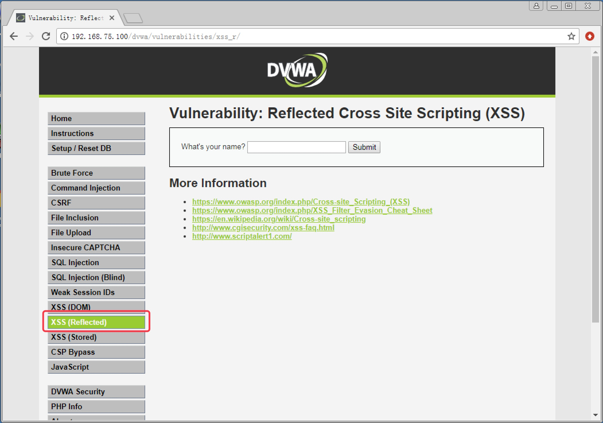
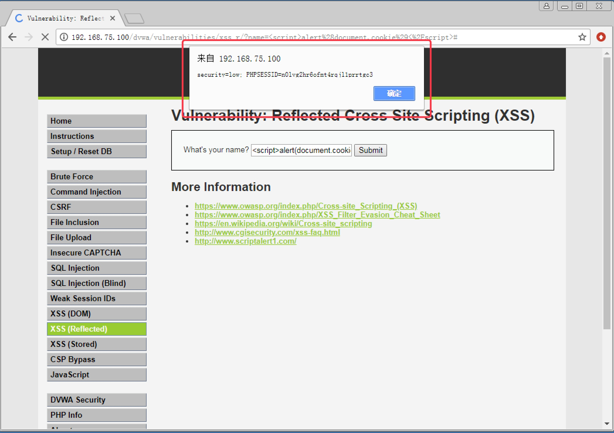
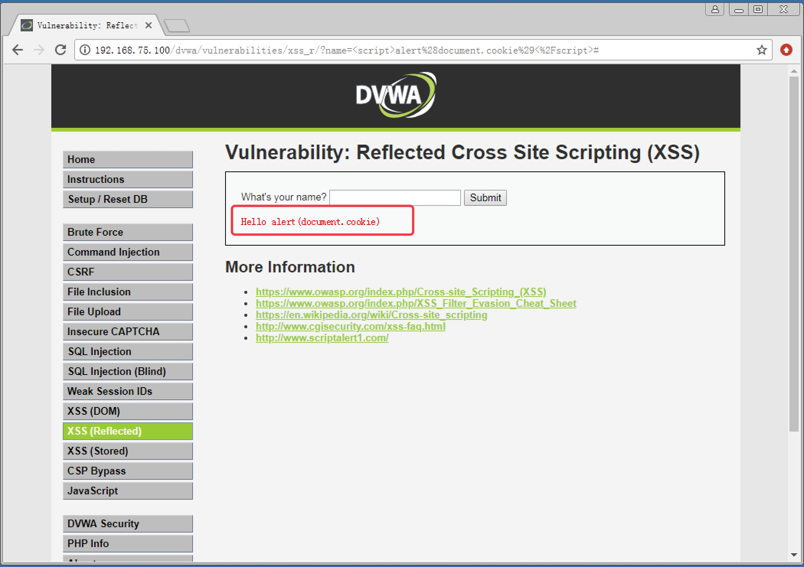
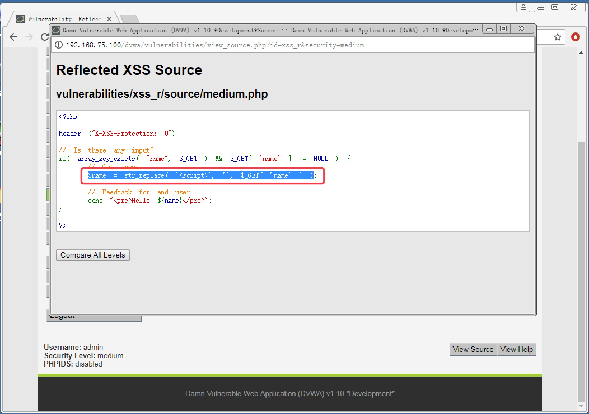
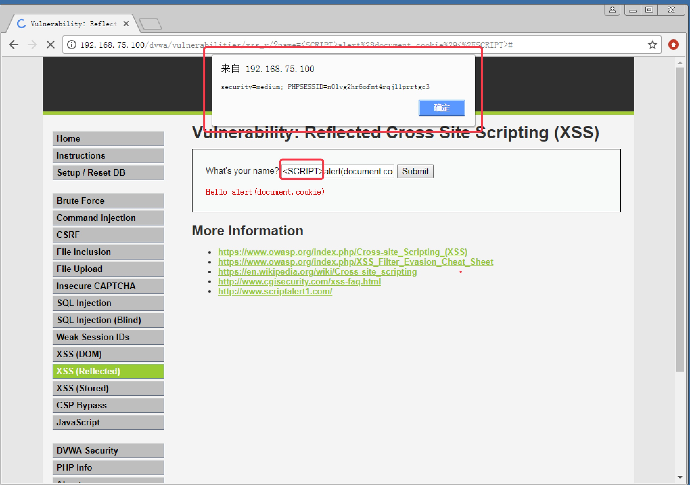
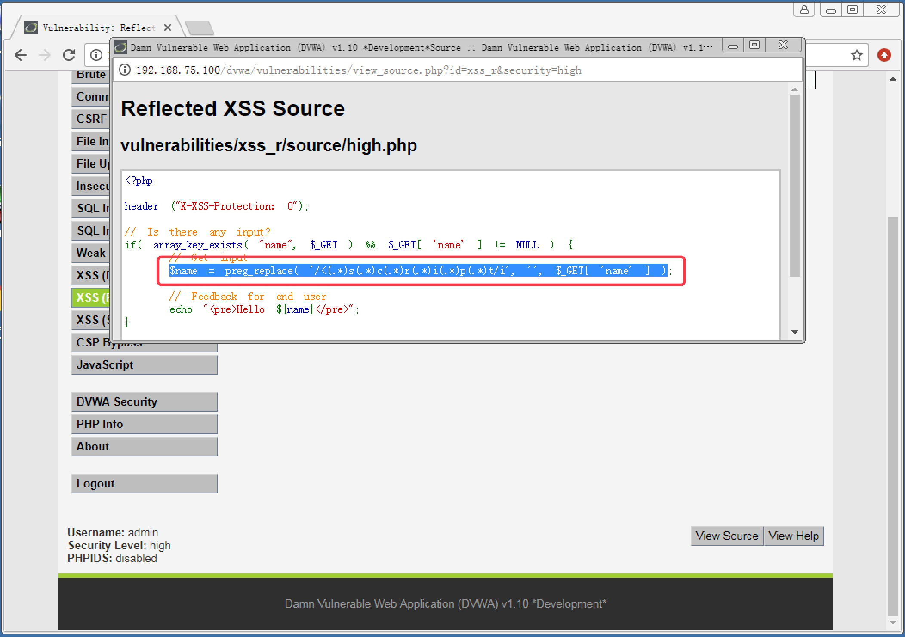
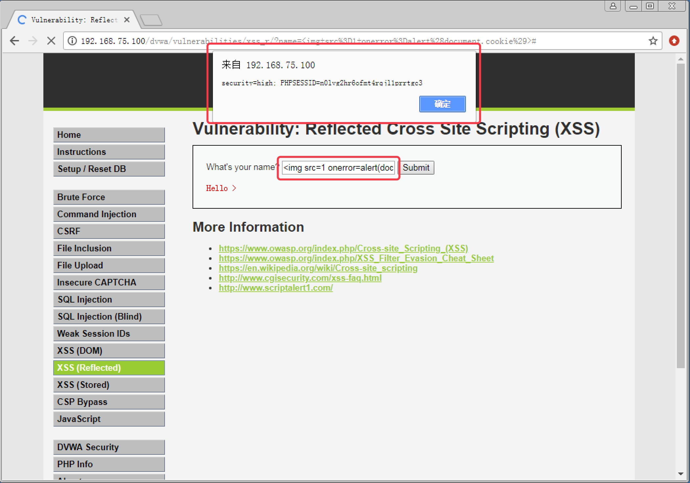
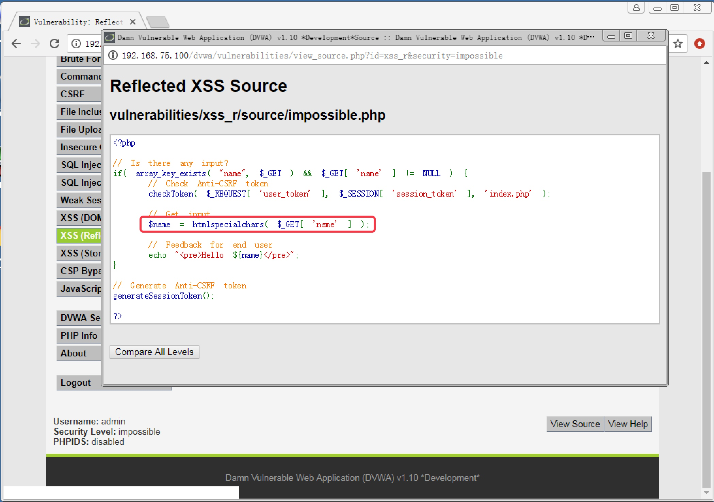

<!--more-->

# 7. 反射型 XSS 攻击实战

#### 7.1 XSS 攻击概述

　　XSS 攻击全称跨站脚本攻击。是指用户在 Web 页面中提交恶意脚本，从而使浏览包含恶意脚本的页面的用户在不知情的情况下执行该脚本，导致被攻击的行为。

　　与 SQL 注入类似，XSS 也是利用提交恶意信息来实现攻击效果的攻击行为。但是 XSS 一般提交的是 Javascript 脚本，运行在 Web 前端，也就是用户的浏览器；而 SQL 注入提交的 SQL 指令是在后台数据库服务器执行。所以两者攻击的对象是不一样的。

　　XSS 按照攻击的手法，一般可以分为反射型 XSS（Reflected）、存储型 XSS（Strored）、DOM 型 XSS（DOM）。

　　反射型 XSS 是指恶意的攻击脚本包含在 URL 中，只有当用户访问了包含恶意脚本的 URL，才会被害。反射型的攻击，攻击脚本不会写入网站的数据库，是一次性的攻击，所以黑客一般需要诱骗用户点击包含攻击脚本的 URL，才能攻击成功。

　　存储型 XSS 则是把攻击脚本提交到网站后台数据库，只要有人访问了显示该数据内容的页面，就会被攻击。比较常见的场景就是黑客发表了一篇包含攻击脚本的帖子，那么只要有人访问该帖子内容的用户，就会自动在他们的浏览器上执行攻击脚本。相对于反射型，存储型的 XSS 成功率更高。

　　DOM 型 XSS 是指基于 DOM 文档对象模型的 XSS 攻击。编写网页时，经常会用到各种 DOM 对象，如 document.referer、document.write 等等。DOM 型 XSS 攻击的输出点就位于 DOM 对象上。严格来说，DOM 型 XSS 即有可能是反射型，也有可能是存储型

## 　　

#### 7.2 Low 级别反射型 XSS 攻击实战

1. 安全级别设置为 `Low`，点击 `XSS(Reflected)` 按钮，进入反射型 `XSS` 攻击模块，如图 7-1

   

   

   图 7-1

   

2. 尝试提交弹窗脚本 ``，输出用户 `cookie`，可以直接成功，说明 `Low` 级别未做任何防护措施，如图 7-2

   

   

   图 7-2

   

------

#### 7.3 Medium 级别反射型 XSS 攻击实战

1. 安全级别设置为 `Medium`，再次尝试直接提交输出 `cookie` 脚本，发现把脚本内容直接显示出来了，说明对敏感的 JS 脚本做了过滤或转义，如图 7-3

   

   

   图 7-3

   

2. 查看页面源码，发现如下代码 `$name = str_replace( '`，发现可以成功弹窗，如图 7-5

   

   

   图 7-5

   

4. 该替换函数是对整个 ``，也可以成功，如图 7-6

   

   

   图 7-6

   

------

#### 7.4 High 级别反射型 XSS 攻击实战

1. 尝试前面的攻击方法，发现在 High 级别下都无法成功，查看页面源码，发现如下代码 `$name = preg_replace( '/<(.\*)s(.\*)c(.\*)r(.\*)i(.\*)p(.\*)t/i', '', $_GET[ 'name' ] )`，如图 7-7。`preg_replace` 函数可以调用正则表达式。我们发现该替换函数使用正则表达式进行了 `script` 的逐字检查，并通过 `/i` 来不区分大小写，所在造成之前的方法都不管用

   

   

   图 7-7

   

2. JS 脚本不仅仅可以在 `<script>` 标签中使用，通过 `` 标签中 `onerror` 行为也可以调用 JS 脚本。提交 ``，成功弹窗，如图 7-8

   

   

   图 7-8

   

------

#### 7.5 Impossible 级别反射型 XSS 攻击

　　查看页面源码，发现使用了 `htmlspecialchars` 函数对提交的信息进行转义，如图 7-9。该函数会将所有特殊字符转义为 HTML 实体。比如把 `<` 转义为 `&lt;`，把 `>` 转义为 `&gt;`。只要正确的使用该函数，XSS 攻击就可以彻底杜绝。
　　

图 7-9