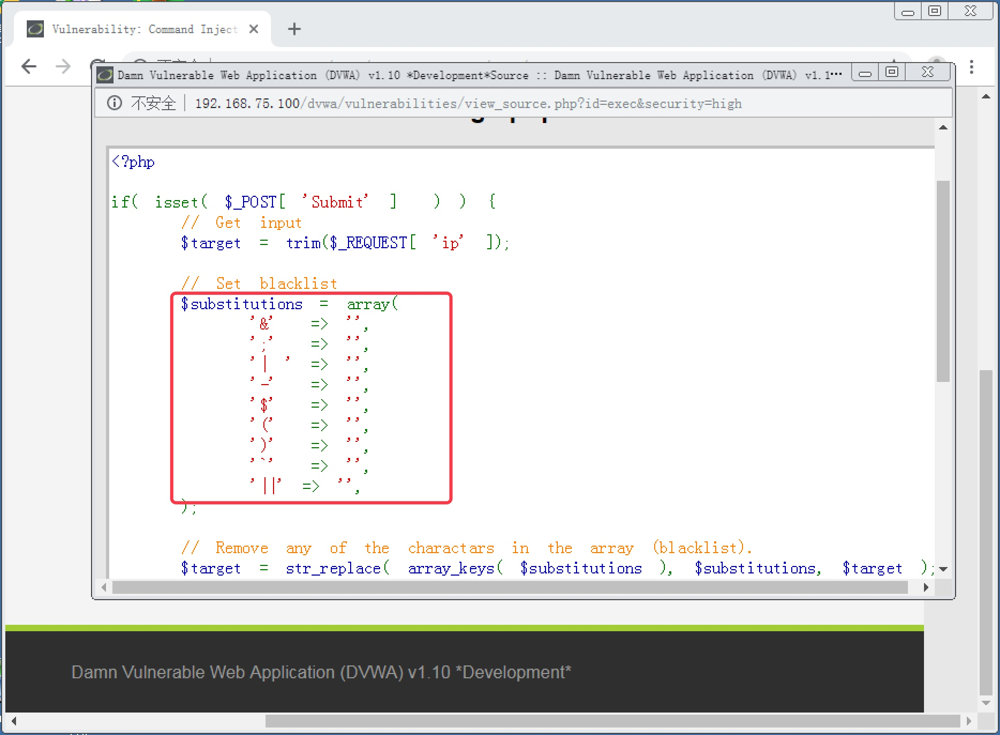
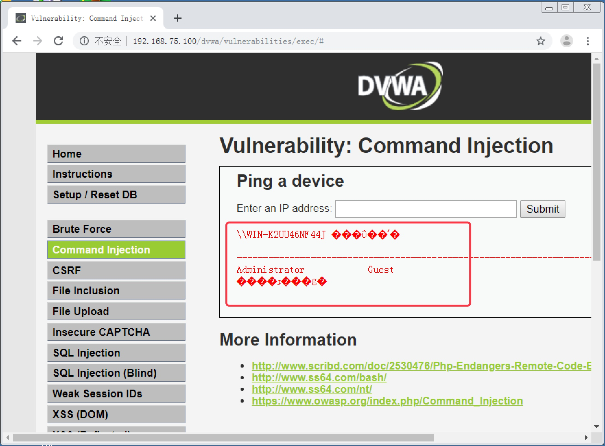

<!--more-->

# 13. 命令注入攻击实战

#### 13.1 命令注入攻击概述

　　在某些网站页面中，可能会调用到系统 Shell 来执行命令，从而实现一些功能。比如某网络设备的 Web 控制台，提供 Ping 测试网络连通性或者延时的功能。但我们都知道，Ping 属于 ICMP 协议，是网络层的协议，而 HTTP 协议属于应用层协议，本身并不具备 Ping 的功能。所以如果要在网页上提供 Ping 的功能，就需要在页面中调用系统 Shell 来执行 Ping 命令。

　　按照注入攻击的原理，如果我们在提交的命令参数中再构造一个其他命令，而页面本身没有对提交的参数做检查，那么很有可能页面将会执行我们构造的命令，后果不堪设想。这种攻击行为，我们就称为命令注入攻击。

##

#### 13.2 Low 级别命令注入攻击实战

1. 安全级别设置为 `Low`，点击 `Command Injection` 按钮，进入命令注入攻击页面，发现是一个 `Ping` 命令执行页面，在文本框中输入一个 IP 地址或者域名，页面会返回 Ping 的结果，如图 13-1

   

   

   图 13-1

   

2. 由于本服务器使用的是 `Windows Server` 系统，所以我们可以使用 `Windows` 的系统命令来进行注入攻击。在文本框中直接输入 `net user` 命令，发现报错，如图 13-2，说明页面会把文本框中提交的信息提交为 `Ping` 的参数来执行。

   

   

   图 13-2

   

3. Windows 系统和 Linux 系统都可以使用 `&&` 符号来连接多条命令，从而一次执行。所以我们尝试在文本框中先输入一个正确的 `IP` 地址，再用 `&&` 符号来连接另外一个命令。输入 `8.8.8.8&&net user`，发现成功注入，页面返回 `net user` 命令的执行结果，如图 13-3

   

   

   图 13-3

   

------

#### 13.3 Medium 级别命令注入攻击实战

1. 设置安全级别为 `Medium`，进入命令注入攻击页面，查看页面源码，发现对 `&&` 和 `;` 进行了过滤，转换为空值，如图 13-4。

   

   

   图 13-4

   

2. 页面只是过滤了 `&&` 和 `;`，但是并没有对单 `&` 符号进行过滤。在文本框中输入 `8.8.8.8&net user`，发现可以绕过防御成功注入，如图 13-5。

   

   

   图 13-5

   

   > `&&` 和 `&` 的区别是，`&&` 是只有当前一个命令执行成功后，才会执行第二个命令；而 `&` 是不管第一个命令是否执行成功，都会执行第二个命令。

------

#### 13.4 High 级别命令注入攻击实战

1. 设置安全级别为 `High`，进入命令注入攻击页面，查看页面源码，发现几乎对所有命令连接符都做了过滤，如图 13-6。

   

   

   图 13-6

   

2. 继续观察页面源码，发现对 `|` 管道符的过滤中，管道符后有一个空格，如图 13-6。由于过滤不严谨，使得 `|` 符有了可趁之机。在文本框中输入 `8.8.8.8|net user`，可以成功注入，如图 13-7。

   

   

   图 13-7

   

------

#### 13.5 Impossible 级别命令注入攻击

　　查看 `Impossible` 级别源码，发现首先使用 `stripslashes()` 函数来去掉提交的参数中的反斜杠；再使用 `explode()` 函数把提交的参数以 `.` 为间隔打散到一个数组；然后通过 `is_numeric()` 函数进行判断数组中的各个分量是否为数字；最后检查提交的格式是否为 `数组分量0.数组分量1.数组分量2.数组分量3`，（也就是 IPv4 地址格式）。如果不满足上述条件，则拒绝执行命令。另外还加入了检查随机 Token 来防止自动化注入，如图 13-8。该级别没有命令注入漏洞。

图 13-8