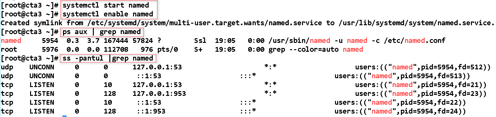
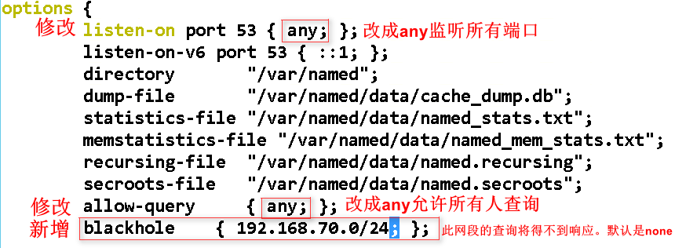
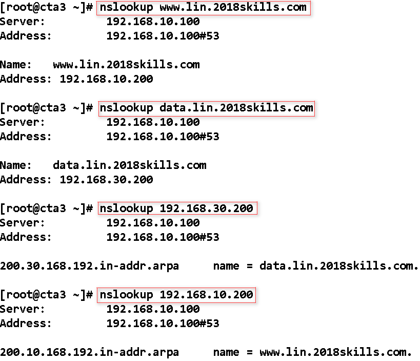
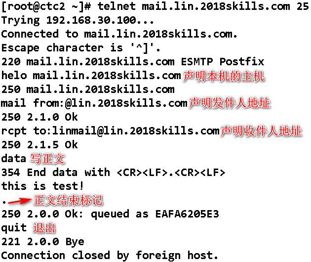

<!--more-->


# 1,初始环境配置(每个主机都要设置)


```
vi /etc/sysconfig/network-scripts/ifcfg-eth0
NAME=eth0
ONBOOT=yes
NETBOOT=yes
BOOTPROTO=none
TYPE=Ethernet
IPADDR=192.168.10.100
PREFIX=24
GATEWAY=192.168.10.1
DNS1=提供dns服务的主机ip
DNS2=提供dns服务的主机ip

systemctl restart network

vim /etc/hostname
#按题目

vi /etc/fstab
#末尾添加:/dev/cdrom /opt iso9660 defaults,ro,loop 0 0
#比赛时候是:/opt/CentOS-6.5.iso /media/cdrom iso9660 defaults,ro,loop 0 0

rm -rf /etc/yum.repos.d/*
vim /etc/yum.repos.d/opt.repo
[opt]
name=base
baseurl=file:///opt
        file:///media/cdrom
gpgcheck=0
enabled=1

yum clean all
yum list all
yum -y install vim net-tools
```

# 2 cta3:192.168.10.100/24

## 2.1 配置DNS

### 2.1.1 简介。

DNS（Domain Name System）域名系统。

目前提供网络服务的应用使用唯一的32位的IP地址来标识，但是由于数字比较复杂、难以记忆，因此产生了域名系统（DNS），通过域名系统，可以使用易于理解和形象的字符串名称来标识网络应用（如www.baidu.com、www.taobao.com）。访问互联网应用可以使用域名，也可以通过IP地址直接访问该应用，在使用域名访问网络应用时，DNS负责将域名解析为IP地址。

### 2.1.2 DNS服务器特点。

分布式的数据库；解决了数据不一致，避免了名字冲突；有缓存机制，提高了性能和可靠性。

### 2.1.3 安装环境

```
系统环境：CentOS7
DNS SERVER：192.168.10.100

更改主机名：cta3
hostnamectl set-hostname cta3

写/etx/hosts记录
#vim /etc/hosts
192.168.10.100 cta3 ---文件最后加上DNS服务器IP地址和主机名

#reboot 重启机器，使之生效。
关闭防火墙(这只是临时关闭,如果永久关闭,需要改配置文件)。
#systemctl stop firewalld
关闭selinux
#setenforce 0
```

### 2.1.4 开始安装

BIND全称是（Berkeley Internet Name Domain），是美国加利福尼亚大学伯克利分校开发的一个域名服务软件包，Linux使用这个软件包来提供域名服务，该软件实现了DNS协议。BIND的服务端软件是被称作named的守护进程。

```
#bind 主程序
#测试工具 dig host nslookup 来自 bind-utils包
yum -y install bind bind-utils

Loaded plugins: fastestmirror
Loading mirror speeds from cached hostfile
opt                                                                                                     | 3.6 kB  00:00:00
Resolving Dependencies
--> Running transaction check
......省略......
Installed:
  bind.x86_64 32:9.9.4-72.el7    bind-utils.x86_64 32:9.9.4-72.el7

Complete!
```

启动DNS服务

```
systemctl start named ---启动DNS服务
systemctl enable named ---设置为开启自启动
service named start
chkconfig named on
systemctl stop named ---关闭DNS服务
ps aux | grep named ---检查是否成功开启
netstat -pantul | grep named --查看监听端口53(netstat命令由net-tools软件包提供,可以用ss命令替代)
```



修改配置文件

/etc/named.conf

```
vim /etc/named.conf
#请看下图
#第一个any是:监听任何ip对53端口的请求
#第二个any是:接收任何来源查询dns记录
#也可以注释掉ipv6的监听

options {
    #..省略部分输出..
    forward first;
    #括号中填写主域DNS服务器地址
    forwarders { 2018skills.com主域的服务器ip地址; };
    #..省略部分输出..
}
```



/etc/named.rfc1912.zones

```
#记录你的域和域对应的数据文件在哪
vim /etc/named.rfc1912.zones
#最后添加(直接复制上面,修改部分即可):
#正向解析
# zone "顶级域名" IN {
#   type master; 代表这是主服务器
#   file "对应域名的解析文件，名称可自定义"
#   allow-update { none; }; 禁止来自客户端的更新与修改
# };
zone "2018skills.com" IN {
    type forward;
    forward only;
    forwarders { 192.168.10.103; };
};

zone "lin.2018skills.com" IN {
        type master;
        file "lin.2018skills.com.zone";
        allow-update { none; };
};
#对某个网段的反向解析
# zone "网段ip前三段反写.in-addr.arpa" IN {
#   type master;
#   file "对应域名的解析文件，可自定义"
#   allow-update { none; }; 
# };
zone "10.168.192.in-addr.arpa" IN {
        type master;
        file "192.168.10.arpa";
        allow-update { none; };
};

zone "30.168.192.in-addr.arpa" IN {
        type master;
        file "192.168.30.arpa";
        allow-update { none; };
};

```

创建区域信息文件中解析记录对应的解析文件

```
#首先将已有的正向解析与反向解析文件复制创建新的解析文件（也可以手动创建，复制会有一个参考格式，比较方便而已，-a参数会连同权限一起复制）
cp -a /var/named/named.localhost /var/named/lin.2018skills.com.zone
cp -a /var/named/named.loopback /var/named/192.168.10.arpa
cp -a /var/named/named.loopback /var/named/192.168.30.arpa

#然后逐个编辑这两个文件（注意，每个域名后面都要带"."）
vim /var/named/lin.2018skills.com.zone
# $TTL 1D
# @  IN SOA  主域名. 邮箱地址（用"."代替@符号）. (
#       0 ; serial 更新序列号
#       1D ; refresh 刷新时间，默认每天
#       1H ; retry 重试延时，默认一小时
#       1W ; expire 失效时间，默认一周
#       3H;minimum 无效解析记录缓存时间，默认3小时
#
# 域名服务器记录
#       NS      dns.lin.2018skills.com.
# ns    IN A    192.168.10.100
# 因为主域是lin.2018skills.com，所以下面这句的意思就是将www.qingsword.com解析到192.168.1.233，这是一条A记录（A记录，即域名到IP的解析记录）
# www   IN A    192.168.10.100
#如果想让N.lin.2018skills.com（N代表任何字母数字组合）都解析到192.168.10.100可以写一条泛解析如下
# *   IN A    192.168.10.100

$TTL 1D
@       IN SOA  lin.2018skills.com. root.lin.2018skills.com. (
                                        0       ; serial
                                        1D      ; refresh
                                        1H      ; retry
                                        1W      ; expire
                                        3H )    ; minimum
        IN  NS  dns.lin.2018skills.com.
        MX  10  mail.lin.2018skills.com.
dns     IN  A   192.168.10.100
www     IN  A   192.168.10.200
ftp     IN  A   192.168.30.50
mail    IN  A   192.168.30.100
smb     IN  A   192.168.30.150
data    IN  A   192.168.30.200

vim /var/named/192.168.10.arpa
#反向解析使用的是PTR记录
#反向解析的IP前缀已经在"10.168.192.in-addr.arpa"中定义，所以反向解析只需要写IP地址最后一段，下面的100就表示"192.168.10.100"，意思是将这个IP解析成"xxx.lin.2018skills.com"，以此类推
$TTL 1D
@       IN SOA  lin.2018skills.com. root.lin.2018skills.com. (
                                        0       ; serial
                                        1D      ; refresh
                                        1H      ; retry
                                        1W      ; expire
                                        3H )    ; minimum
        IN  NS  dns.lin.2018skills.com.
100     IN  PTR  dns.lin.2018skills.com.
200     IN  PTR  www.lin.2018skills.com.

#第二个
vim /var/named/192.168.30.arpa
$TTL 1D
@       IN SOA  lin.2018skills.com. root.lin.2018skills.com. (
                                        0       ; serial
                                        1D      ; refresh
                                        1H      ; retry
                                        1W      ; expire
                                        3H )    ; minimum
        IN  NS  dns.lin.2018skills.com.
        MX  10   mail.lin.2018skills.com.
50      IN  PTR  ftp.lin.2018skills.com.
100     IN  PTR  mail.lin.2018skills.com.
150     IN  PTR  smb.lin.2018skills.com.
200     IN  PTR  data.lin.2018skills.com.
```

检查配置文件并测试

```
[root@cta3 ~]# named-checkconf /etc/named.conf     (无回显输出,说明配置文件没问题)
[root@cta3 ~]# named-checkzone /var/named/{lin.2018skills.com.zone,192.168.10.arpa}
#zone /var/named/lin.2018skills.com.zone/IN: loaded serial 0
#OK
[root@cta3 ~]# named-checkzone /var/named/lin.2018skills.com.zone /var/named/192.168.30.arpa
#zone /var/named/lin.2018skills.com.zone/IN: loaded serial 0
#OK
#此时说明无错误
#注意设置dns服务器,查看cat /etc/resolv.conf文件,dns服务器是否正确,再重启服务
systemctl restart named
service named restart
#测试见下图:
```



[CentOS7-1810 系统DNS服务器BIND软件配置说明](https://www.xuejiayuan.net/blog/144460d706874dcdbb4023d9a2e9ecd9)

[CentOS DNS服务详解与基于bind的智能DNS](https://blog.51cto.com/191226139/2063287)

[使用bind服务实现域名解析](https://www.qingsword.com/qing/rhel-20.html)

## 2.2 配置telnet

```
#安装软件包
yum -y install telnet-server telnet xinetd
注意:centos7的telnet是由systemd管理,所以不需要xinetd服务,这里安装是为centos7之前的配置,也就是说,下面关于xinetd的配置操作可以忽略

vim /etc/xinetd.d/telnet
# default: on
# description: The telnet server serves telnet sessions; it uses \
#       unencrypted username/password pairs for authentication.
service telnet
{
        flags           = REUSE
        socket_type     = stream
        wait            = no
        user            = root
        server          = /usr/sbin/in.telnetd
        log_on_failure  += USERID
        disable         = no          #将disable=yes行前加#注释掉，或者把yes改为no
}

#启动Telnet，xinetd和telnet服务
systemctl start xinetd
systemctl start telnet.socket
service xinetd start

#启用Telnet，xinetd和telnet服务，Telnet，xinetd和telnet服务安装完成后是默认禁用的。
systemctl enable xinetd.service
systemctl enable telnet.socket
chkconfig xinetd on

#telnet 默认的情况之下不允许 root 以 telnet 进入 Linux 主机，在普通用户telnet进入系统之后，在切换到root用户就可以使用root用户了。如果非要使用root登录，可以使用修改securetty文件。
#一般不建议直接用root用户远程通过telnet登陆系统，因为telnet在数据传输过程采用明文方式，如果数据包被人截获，将会很容易获取root用户的登陆口令；还是建议以普通用户通过telnet远程登陆，然后su到root，这样相对比较安全。如果非要用root用户远程连接，建议采用SSH。
vim /etc/securetty
#在末尾加上
pts/0
pts/1
#多加几个
#若要开放root以telnet登入linux主机：vim /etc/pam.d/login

#修改telnet端口
#修改文件/etc/services将文件中
#telnet 8902/tcp
#telnet 8902/udp

#instances = 20
#cps = 4 60
#only_from = 192.168.70.0/24
#no_access = 192.168.10.200
#access_times = 9：00-11：00 13：00-15：00
#per_source = 2
```

### 2.2.1 只允许IP地址以192.168开头的主机使用telnet命令远程登录该服务器(具体iptables用法,下面有详解)


```
#配置好yum源以后安装iptables-service
yum install -y iptables-services
#停止firewalld
systemctl stop firewalld
#禁止firewalld自动启动
systemctl disable firewalld
#启动iptables
systemctl start iptables
#将iptables设置为开机自动启动，以后即可通过iptables-service控制iptables服务
systemctl enable iptables

#可以不清空
iptables -F
iptables -A INPUT -p tcp ! -s 192.168.0.0/16 --dport 23 -m state --state NEW,ESTABLISHED -j REJECT
iptables -A INPUT -p udp ! -s 192.168.0.0/16 --dport 23 -m state --state NEW,ESTABLISHED -j REJECT

#规则表示:只要源地址不是192.168.0.0/16网段和目标端口23的,都会被拒绝
#效果示例1:cip:172.16.0.200::telnet 192.168.10.100 失败::telnet 192.168.10.100 22能监测到端口开放
#效果示例2:cip:192.168.30.150::telnet 192.168.10.100 成功::telnet 192.168.10.100 22能监测到端口开放
#也就是说,只是阻止了非192.168.0.0/16网段主机的远程登录(注意,默认端口23,如果改了默认端口,iptabls的目标端口也要修改一致)

#查看规则
iptables -L -v -n --line-numbers
#保存配置
iptables-save >/etc/sysconfig/iptables-`date +%F`
#或者
service iptables save(这个需要安装iptables-services)
#iptables: Saving firewall rules to /etc/sysconfig/iptables:[  OK  ]

systemctl restart iptables
service iptables restart
#下面链接讲的很详细(注意:规则是从上到下匹配的)

vim /etc/hosts.allow
in.telnetd:192.168.0.0/16

vim/etc/hosts.deny
in.telnetd:ALL:Deny
```

[iptables详解[1,3]](https://www.zsythink.net/archives/category/%e8%bf%90%e7%bb%b4%e7%9b%b8%e5%85%b3/iptables/)

[iptables命令](https://man.linuxde.net/iptables)

[iptables举例1](https://linux.cn/article-10144-1.html)

[iptables举例2](https://www.cnblogs.com/zclzhao/p/5081590.html)

# 3 cta4:192.168.10.200/24

##  3.1 网站服务器部属

由于ctenos7自带iso里面没有nginx,所以网站部署全是用的httpd服务

### 3.1.1 创建网站`http://www.lin.2018skills.com:8080`,其网站主目录为`/www/8080`，主页名为`skills8080.html`，首页内容为“`Welcome chinaskills’s website：8080`”，被访问端口为`8080`，虚拟目录名为`vdir`

```
#安装服务(软件源按文章开头配置好)
yum -y install httpd
Loaded plugins: fastestmirror
Loading mirror speeds from cached hostfile
opt                                             | 3.6 kB     00:00
......省略......
Installed:
  httpd.x86_64 0:2.4.6-88.el7.centos

Dependency Installed:
  apr.x86_64 0:1.4.8-3.el7_4.1
  apr-util.x86_64 0:1.5.2-6.el7
  httpd-tools.x86_64 0:2.4.6-88.el7.centos
  mailcap.noarch 0:2.1.41-2.el7

Complete!

#配置网站(为避免错误,主配置文件没有修改,直接做虚拟主机配置)
mkdir -p /www/8080
cp -p /usr/share/doc/httpd-2.4.6/httpd-vhosts.conf /etc/httpd/conf.d/
#拷贝这个文件目的是:理解虚拟主机写法,还有一些参数在主配置文件里面(下面配置都不用记,主配置文件有,复制准确)
vim /etc/httpd/conf.d/httpd-vhosts.conf
Listen 8080
ServerName www.lin.2018skills.com
<VirtualHost 192.168.10.200:8080>
    DocumentRoot "/www/8080"
    ServerName www.lin.2018skills.com
    Alias /vdir "/www/8080"
    <Directory "/www/8080">
        Require all granted
        #v2.2:Allow from all
    </Directory>
    <IfModule dir_module>
        DirectoryIndex skills8080.html
    </IfModule>
    ErrorLog "/var/log/httpd/8080.error.log"
    CustomLog "/var/log/httpd/8080.access_log" common
</VirtualHost>
#上面可以不要log

#创建网页文件
vim /www/8080/skills8080.html
<html>
<body>
<div style="width: 100%; font-size: 40px; font-weight: bold; text-align: center;">
Welcome chinaskills’s website：8080
</div>
</body>
</html>
#注意设置为开机自启
systemctl enable httpd
systemctl restart httpd

#service httpd start
#chkconfig httpd on
```

### 3.1.2 创建网站`http://www.lin.2018skills.com`，其网站主目录为`/www/jnds`，主页为`skills.html`，首页内容为“`Welcome chinaskills’s website`”；创建用户webuser1和webuser2，密码同用户名，实现网站的认证访问，只有这两个用户可以通过认证访问`http://www.lin.2018skills.com`网站

```
#由于上面做了部分操作,这里直接开始配置
mkdir /www/jnds
vim /www/jnds/skills.html
<html>
Welcome chinaskills’s website
</html>

#编辑虚拟主机配置文件
vim /etc/httpd/conf.d/httpd-vhosts.conf
<VirtualHost 192.168.10.200:80>
    DocumentRoot "/www/jnds"
    ServerName www.lin.2018skills.com
    <Directory "/www/jnds">
        AllowOverride AuthConfig
        AuthName "www.lin.2018skills.com user auth"
        AuthType Basic
        AuthUserFile /www/jnds/.htpasswd
        require valid-user
    </Directory>
    <IfModule dir_module>
        DirectoryIndex skills.html
    </IfModule>
</VirtualHost>

#创建密码
htpasswd -cm /www/jnds/.htpasswd webuser1
#-c 表示创建  -m 指定MD5加密 指定所在位置  如果再次增加用户可以不用-c选项，-c是首次创建文件使用的,，否则/data/.htpasswd会被重置，之前用户被清空
#New password:
#Re-type new password:
#Adding password for user webuser1

htpasswd -m /www/jnds/.htpasswd webuser2
#New password:
#Re-type new password:
#Adding password for user webuser2

cat /www/jnds/.htpasswd
#webuser1:$apr1$GpmflKTm$KkHEGQ4U.qtWmIXrS7rgD.
#webuser2:$apr1$TRjsM8eR$pSDwpplR7g8D3orkSAxHd0

#检查语法配置并重启服务
apachectl -t
#Syntax OK
systemctl restart httpd
#service httpd restart

#测试:
curl -x 192.168.10.200:80 -uwebuser2:webuser2 www.lin.2018skills.com -l
#<html>
#Welcome chinaskills’s website
#</html>
#理论详解看下面链接
```

[Apache(httpd)配置--用户认证，域名跳转和访问日志配置](https://blog.51cto.com/3069201/2080163)

### 3.1.3 创建网站`https://www.lin.2018skills.com`，其网站主目录为`/www/ssl`，主页名字为`skillsssl.html`，首页内容为“`Welcome chinaskills’s website：ssl`”，使用`openssl`申请证书，创建自签名证书`server.crt`和私钥`server.key`，要求实现加密访问

```
#安装所需服务
yum -y install mod_ssl openssl
#安装过程省略

#产生私钥
openssl genrsa -out server.key 2048
#产生 CSR
openssl req -new -key server.key -out server.csr
#会有以下交互设置
#国家
Country Name (2 letter code) [XX]:CN
#省
State or Province Name (full name) []:HuBei
#市
Locality Name (eg, city) [Default City]:WuHan
#公司名
Organization Name (eg, company) [Default Company Ltd]:www.lin.2018skills.com
#部门
Organizational Unit Name (eg, section) []:www.lin.2018skills.com
#名字，一般用域名，比如example.com
Common Name (eg, your name or your server's hostname) []:www.lin.2018skills.com
#邮件
Email Address []:itwhs@foxmail
#以下不设置，回车
A challenge password []:
#以下不设置，回车
An optional company name []:

#产生自我签署的金钥
openssl x509 -req -days 365 -in server.csr -signkey server.key -out server.crt
#复制文件到对应位置
cp server.crt /etc/pki/tls/certs
cp server.key /etc/pki/tls/private/server.key
cp server.csr /etc/pki/tls/private/server.csr

#配置网站
mkdir /www/ssl
vim /www/ssl/skillsssl.html
<html>
Welcome chinaskills’s website：ssl
</html>

#编辑虚拟主机配置文件
vim /etc/httpd/conf.d/httpd-vhosts.conf
<VirtualHost 192.168.10.200:443>
    DocumentRoot "/www/ssl"
    ServerName www.lin.2018skills.com:443
    SSLEngine on
    SSLCertificateFile "/etc/pki/tls/certs/server.crt"
    SSLCertificateKeyFile "/etc/pki/tls/private/server.key"
    <Directory "/www/ssl">
        Require all granted
        #v2.2:Allow from all
    </Directory>
    <IfModule dir_module>
        DirectoryIndex skillsssl.html
    </IfModule>
</VirtualHost>
#由于安装ssl模块会生成一个ssl.conf,配置已经有linten 443,所以这里不需要写,如果写了的话,会出现端口占用的错误,切记不要写
```

[自动生成ssl证书](https://github.com/itwhs/zabbix/blob/master/%E5%B8%B8%E7%94%A8%E5%B0%8F%E8%84%9A%E6%9C%AC/ca.sh)

[httpd配置详解](https://www.linuxrumen.com/fwqdj/763.html)

[centos7配置https](http://www.yiven.vip/2019/319/centos-apache-use-ssl-setting-https/)

### 3.1.4 总结这3题的vhost配置文件

```
yum -y install httpd mod_ssl openssl
#三题三个虚拟主机(关于httpd,并没有配置主配置文件)
cat /etc/httpd/conf.d/httpd-vhosts.conf
Listen 8080
ServerName www.lin.2018skills.com
<VirtualHost 192.168.10.200:8080>
    DocumentRoot "/www/8080"
    ServerName www.lin.2018skills.com
    Alias /vdir "/www/8080"
    <Directory "/www/8080">
        Require all granted
        #v2.2:Allow from all
    </Directory>
    <IfModule dir_module>
        DirectoryIndex skills8080.html
    </IfModule>
</VirtualHost>
<VirtualHost 192.168.10.200:80>
    DocumentRoot "/www/jnds"
    ServerName www.lin.2018skills.com
    <Directory "/www/jnds">
        AllowOverride AuthConfig
        AuthName "www.lin.2018skills.com user auth"
        AuthType Basic
        AuthUserFile /www/jnds/.htpasswd
        require valid-user
    </Directory>
    <IfModule dir_module>
        DirectoryIndex skills.html
    </IfModule>
</VirtualHost>
<VirtualHost 192.168.10.200:443>
    DocumentRoot "/www/ssl"
    ServerName www.lin.2018skills.com:443
    SSLEngine on
    SSLCertificateFile "/etc/pki/tls/certs/server.crt"
    SSLCertificateKeyFile "/etc/pki/tls/private/server.key"
    <Directory "/www/ssl">
        Require all granted
        #v2.2:Allow from all
    </Directory>
    <IfModule dir_module>
        DirectoryIndex skillsssl.html
    </IfModule>
</VirtualHost>

systemctl enable httpd
systemctl restart httpd
#chkconfig httpd on
#service httpd restart
```

# 4 ctc1:192.168.30.50/24

## 4.1 文件传输服务器部署

### 4.1.1 创设域名为`ftp.lin.2018skills.com`的站点，，根目录为`/var/ftp`，最大上线人数为50人，同一IP来源最大连接数量为5人，不允许匿名用户访问，开启ftp支持被动数据传输模式；

```
yum -y install vsftpd
vim /etc/vsftpd/vsftpd.conf
#修改或添加以下参数
anonymous_enable=NO
local_root=/var/ftp
max_clients=50
max_per_ip=5
pasv_enable=YES
pasv_min_port=40000
pasv_max_port=40080
pasv_promiscuous=YES

#service vsftpd start
#chkconfig vsftpd on
systemctl enable vsftpd
systemctl start vsftpd
```


### 4.1.2 建立虚拟用户ftpuser1及ftpuser2，密码同用户名，用户的宿主目录为/home/vsftpd，用户的权限配置文件目录为/etc/vsftpd_user_conf，实现ftpuser1用户具有浏览目录、上传和下载文件、创建和删除目录的权限，ftpuser2用户可以下载，但不能上传文件。

```
#接着上题继续修改
useradd -d /home/vsftpd -s /sbin/nologin vsftpd
chmod 755 /home/vsftpd/

#创建虚拟用户账号文件（格式依次是：第一行是账户名，次行是该账号的密码；即奇数行是账户名，偶数行是对应上一行的账户密码）
vi /etc/vsftpd/vuser_passwd.txt
ftpuser1
ftpuser1
ftpuser2
ftpuser2
db_load -T -t hash -f /etc/vsftpd/vuser_passwd.txt /etc/vsftpd/vuser_passwd.db

chmod 600 /etc/vsftpd/vuser_passwd.db

配置PAM认证
ll /lib64/security/pam_userdb.so
vim /etc/pam.d/vsftpd		（注释掉原文件中的所有内容，添加以下两行内容）
auth sufficient /lib64/security/pam_userdb.so db=/etc/vsftpd/vuser_passwd
#这个vuser_passwd根据的是vuser_passwd.db
account sufficient /lib64/security/pam_userdb.so db=/etc/vsftpd/vuser_passwd
#这里是64bit系统，必须使用sufficient，否则上面vuser_conf目录下的虚拟主机配置文件无效

创建虚拟用户配置文件（文件名和虚拟用户名相同）
mkdir /etc/vsftpd_user_conf
vim /etc/vsftpd_user_conf/ftpuser1
local_root=/home/vsftpd
write_enable=YES
anon_world_readable_only=NO
anon_upload_enable=YES
anon_mkdir_write_enable=YES
anon_other_write_enable=YES
vim /etc/vsftpd_user_conf/ftpuser2   #可以为空,默认只有下载权限
local_root=/home/vsftpd
anon_world_readable_only=no

vim /etc/vsftpd/vsftpd.conf
修改或添加以下参数
pam_service_name=vsftpd
guest_enable=YES
guest_username=vsftpd
user_config_dir=/etc/vsftpd_user_conf
allow_writeable_chroot=YES
#最后一行centos6.5不加,不然无法启动,注释掉

#service vsftpd restart
systemctl restart vsftpd
#注意:一定要关闭selinux,清空防火墙
```

[vsftp虚拟用户1](https://www.linuxrumen.com/rmxx/757.html)

[vsftp虚拟用户2](https://www.93bok.com/Centos7%E5%AE%89%E8%A3%85vsftp%E8%99%9A%E6%8B%9F%E7%94%A8%E6%88%B7%E7%99%BB%E5%BD%95/)

[vsftp虚拟用户3](http://wubolive.com/post/vsftpd)

[vsftp虚拟用户权限](http://wubolive.com/post/vsftpd)

[vsftp配置详解](https://www.linuxidc.com/Linux/2019-07/159381.htm)

## 4.2 **防火墙服务器部署**

### 4.2.1开启防火墙，并仅允许客户机对本机文件传输服务的访问

```
#配置好yum源以后安装iptables-service
yum install -y iptables-services
#停止firewalld
systemctl stop firewalld
#禁止firewalld自动启动
systemctl disable firewalld
#启动iptables
systemctl start iptables
#将iptables设置为开机自动启动，以后即可通过iptables-service控制iptables服务
systemctl enable iptables

#问题:如果说找不到主机路由
#在/etc/sysconfig/iptables-config 文件中
#更改 IPTABLES_MODULES=”” 为 IPTABLES_MODULES=”ip_nat_ftp ip_conntrack_ftp”
#重启 iptables 服务(开机自启iptables服务时此模块才会有效)
#或者直接加载模块(重启会失效,可以加rc.local后面)
#modprobe ip_nat_ftp
#modprobe ip_conntrack_ftp

iptables -F
iptables -A INPUT -p tcp --dport 20:21 -j ACCEPT
iptables -A INPUT -p tcp --dport 4000:40080 -j ACCEPT
iptables -A INPUT -p tcp --dport 22 -m state --state NEW,ESTABLISHED -j ACCEPT
iptables -A INPUT -p udp --dport 22 -m state --state NEW,ESTABLISHED -j ACCEPT
iptables -A INPUT -p icmp -j ACCEPT
service iptables save
#service iptables restart
systemctl reload iptables
```


### 4.2.2 禁止本机利用ping命令访问主机Win2012-A1:192.168.10.x

```
iptables -A OUTPUT -p icmp -d 192.168.10.0/24 -j DROP
service iptables save
systemctl reload iptables

#DROP比REJECT好在节省资源，而且延缓黑客攻击的进度（因为不会给黑客返回任何有关服务器的信息）；坏在容易让企业的网络问题难以排查，而且在DDoS攻击的情况容易耗尽所有的带宽。
#REJECT比DROP的好处在于容易诊断和调试网络设备或防火墙造成的问题；坏处上面也说了，你给骗子回个电话，相当于暴露了自己的服务器信息。
#所以一般的建议是在上游防火墙中使用REJECT，在比较危险的面向外网的基础防火墙上，使用DROP要相对安全一些。
```


### 4.2.3 本机基于默认端口访问网站，均强制转为Centos-A4上的`http://www.lin.2018skills.com:8080`网站页面

```
#构建iptable策略的最后一步实在linux内核中启用ip转发
echo "net.ipv4.ip_forward=1" >>/etc/sysctl.conf
sysctl -p

iptables -t nat -A OUTPUT -p tcp -d 192.168.10.200 --dport 80 -j DNAT --to 192.168.10.200:8080
service iptables save
systemctl reload iptables

#注意:此规则效果>>>本机访问http://192.168.10.200:80端口实际上是访问http://192.168.10.200:8080|||||如果把-d 192.168.10.200去掉,则从本机访问任意ip的80,均强制转到8080网站,按要求来

#用iptables做本机端口转发:
#iptables -t nat -A OUTPUT -d localhost -p tcp --dport 80 -j REDIRECT --to-ports 8080
#iptables -t nat -A PREROUTING -p tcp --dport 80 -j REDIRECT --to-ports 8080
```

[iptables端口转发](https://blog.csdn.net/zzhongcy/article/details/42738285)

###  4.2.4 使用命令将防火墙所有设置保存到/var/iptables文件中；设置立即生效且开机自启

```
iptables-save >/var/iptables
systemctl reload iptables
service iptables save
systemctl enable iptables

#如果指定开机自启的规则在/var/iptables,则加上iptables-restore </var/iptables在/etc/rc.local最后一行,并给执行权限,如果不加,则运行service iptables save保存到默认位置
```


# 5 ctc2:192.168.30.100/24

## 5.1 邮件服务器部署

[sendmail1](https://wenku.baidu.com/view/4dff462e0066f5335a81212d.html)

[sendmail2](https://blog.51cto.com/tyjhz/1440062)

[sendmail3](http://www.111cn.net/sys/CentOS/59429.htm)

[sendmail4](http://www.cnitblog.com/CrackSky/archive/2007/11/25/36860.html)

[sendmail5](https://www.cnblogs.com/goooogs/articles/3042775.html)

### 5.1.1 服务器满足`2018skills.com`，`lin.2018skills.com`两个区域邮件服务；创建两个用户winmail、linmail；每个用户的邮箱空间为30MB,限定用户发邮件时，附件最大为5MB

```
#先改好网卡信息,配好yum源,关闭防火墙
#yum -y remove sendmail系统自带,最小化未安装
yum -y install postfix dovecot cyrus-sasl-*
#.....过程省略....iso里有软件包

vim /etc/postfix/main.cf
# 164行: 添加或修改 
mydestination = $myhostname, localhost.$mydomain, localhost, $mydomain,linmail.$myorigin,winmail.$myorigin,$myorigin
#下面这些参数都是注释状态,那就直接写在配置文件里
myhostname = mail.lin.2018skills.com
mydomain = 2018skills.com
myorigin = lin.2018skills.com
home_mailbox = Maildir/
message_size_limit = 5242880
mailbox_size_limit = 31457280

#检查语法
postfix check
#启动服务
#service postfix start
#chkconfig postfix on
systemctl start postfix
systemctl enable postfix
```

[postfix服务](https://fcloud.gzwqpx.com/archives/362/)

[sendmail限制邮箱空间1](https://www.ibadboy.net/archives/1137.html)

[sendmail限制邮箱空间2](https://www.oipapio.com/cn/article-6768525)



### 5.1.2 为winmail和linmail两员工创建邮箱账户，实现不同用户之间的正常通讯，密码同用户名，邮件服务器的域名后缀分别为`2018skills.com`、`lin.2018skills.com`，邮件服务器要在所有IP地址上进行侦听

```
#添加用户
useradd -s /sbin/nologin linmail
useradd -s /sbin/nologin winmail
echo "linmail" |passwd --stdin linmail
echo "winmail" |passwd --stdin winmail

#接着上题修改
vim /etc/postfix/main.cf
# 116行: 默认是localhost，我们需要修改成all
inet_interfaces = all
mynetworks = 192.168.10.0/24,192.168.20.0/24,192.168.30.0/24,127.0.0.0/8
```


### 5.1.3安装office outlook 2010软件发送邮件；创建名称为everyone的邮件列表，发给`everyone@2018skills.com`、`everyone@lin.2018skills.com`的邮件，所在区域员工均可收到.winmail、linmail两员工分别利用`winmail@2018skills.com`和`linmail@lin.2018skills.com`实现邮件互发，主题为“你好”，内容为“欢迎大家”

```
#发送邮件:
#telnet mail.lin.2018skills.com 25
#Trying 192.168.30.100...
#Connected to mail.lin.2018skills.com.
#Escape character is '^]'.
#220 mail.lin.2018skills.com ESMTP Postfix
helo www.lin.2018skills.com
#250 mail.lin.2018skills.com
mail from:winmail@lin.2018skills.com
#250 2.1.0 Ok
rcpt to:linmail@lin.2018skills.com
#250 2.1.5 Ok
data
#354 End data with <CR><LF>.<CR><LF>
192.168.10.200 test
.
#250 2.0.0 Ok: queued as 31803205E3
quit
#221 2.0.0 Bye
#Connection closed by foreign host.
#效果:
#cat /home/linmail/Maildir/new/1565377434.V803I1c0423M500071.ctc2
#Return-Path: <winmail@lin.2018skills.com>
#X-Original-To: linmail@lin.2018skills.com
#Delivered-To: linmail@lin.2018skills.com
#Received: from www.lin.2018skills.com (www.lin.2018skills.com [192.168.10.200])
#        by mail.lin.2018skills.com (Postfix) with SMTP id 31803205E3
#        for <linmail@lin.2018skills.com>; Sat, 10 Aug 2019 03:03:24 +0800 (CST)
#192.168.10.200 test
```


## 5.2 NTP服务器部署

### 5.2.1 服务器上实现网络时间服务（NTP）的配置，使得CentOS-C2所在网络中的其它计算机通过此服务器进行网络校时

```
#服务端安装
yum -y install ntp
systemctl start ntpd
systemctl enable ntpd
#service ntpd start
#chkconfig ntpd on

#客户端安装
yum -y install ntp
vim /etc/ntp.conf
server 192.168.30.100 iburst
systemctl start ntpd
systemctl enable ntpd
#service ntpd start
#chkconfig ntpd on
#查询
ntpq -pn
ntpstat

```


# 6 ctc3:192.168.30.150/24

## 6.1 samba服务器部署

### 6.1.1 服务不允许172.16.0.0/16网段的电脑访问，并创建四个用户tom、jerry、jack、man，密码同用户名，其中tom和jerry属于administration组，jerry和jack属于sales组；man用户属于manager组

```
yum -y install samba samba-client
groupadd administration
groupadd sales
groupadd manager
useradd -g administration -s /sbin/nologin tom
useradd -g administration -s /sbin/nologin jerry
useradd -g sales -s /sbin/nologin jack
useradd -g manager -s /sbin/nologin man
usermod -a -G sales jerry
smbpasswd -a tom
smbpasswd -a jerry
smbpasswd -a jack
smbpasswd -a man
systemctl start smb nmb
systemctl enable smb nmb
#service smb start
#service nmb start
#chkconfig smb on
#chkconfig nmb on

#备份再编辑
cp /etc/samba/smb.conf{,.bak}
vim /etc/samba/smb.conf
#[global]全局参数里加上：
hosts deny = 172.16.0.0/255.255.0.0

#重载,（不用停止服务直接加载修改的配置信息）
systemctl reload smb

#测试配置文件
#testparm
#Load smb config files from /etc/samba/smb.conf
#rlimit_max: increasing rlimit_max (1024) to minimum Windows limit (16384)
#Processing section "[homes]"
#Processing section "[printers]"
#Processing section "[print$]"
#Loaded services file OK.
#Server role: ROLE_STANDALONE
#Press enter to see a dump of your service definitions
#出现第一个告警,可以在/etc/security/limits.conf最后加上'* - nofile 16384'
```


### 6.1.2 建立共享目录/var/administration_share和/var/sales_share，administration组的用户对目录administration_share共享有读写权限，sales组的用户对目录administration_share共享有只读权限；sales组的用户对目录sales_share共享有读写权限；manager用户对所有目录均有读写权限

```
mkdir /var/administration_share
mkdir /var/sales_share
chmod 757 /var/sales_share
chmod 757 /var/administration_share

vim /etc/samba/smb.conf
#题目没说共享名,那就随便了
#末尾加上
[admin]
        path = /var/administration_share
        browseable = yes
        writable = no
        valid users = @manager,@administration,@sales
        write list = @manager,@administration

[sales]
        path = /var/sales_share
        browseable = yes
        writable = no
        valid users = @manager,@sales
        write list = @manager,@sales

#重载,（不用停止服务直接加载修改的配置信息）
systemctl reload smb

#测试配置文件
#testparm
```


### 6.1.3 建立共享目录/var/public_share，共享名为share，允许匿名用户访问public_share，具有读取权限

```
mkdir /var/public_share
#[global]全局参数里加上：
map to guest = Bad User
#末尾加上
[share]
        path = /var/public_share
        browseable = yes
        public = yes

#重载,（不用停止服务直接加载修改的配置信息）
systemctl reload smb
#service smb reload

#测试配置文件
#testparm
```

[samba详解](https://dunwu.github.io/blog/2018/09/28/os/linux/ops/samba%E4%BD%BF%E7%94%A8%E8%AF%A6%E8%A7%A3/)

## 6.2 磁盘阵列部署

### 6.2.1 利用已添加的三块虚拟硬盘hd6、hd7、hd8进行设置，hd6、hd7对应硬盘均设置为一个主分区，hd8对应硬盘设置为两个2G大小的逻辑分区，并完成磁盘阵列RAID10的操作

```
yum -y install mdadm
fdisk 接磁盘(最后改类型,t选择fd)
#做成这样
#mdadm -E /dev/sd[b-d]
#/dev/sdb:
#   MBR Magic : aa55
#Partition[0] :      4192256 sectors at         2048 (type fd)
#/dev/sdc:
#   MBR Magic : aa55
#Partition[0] :      4192256 sectors at         2048 (type fd)
#/dev/sdd:
#   MBR Magic : aa55
#Partition[0] :      4194304 sectors at         2048 (type fd)
#Partition[1] :      4192256 sectors at      4196352 (type fd)

mdadm --create /dev/md10 --level=10 --raid-devices=4 /dev/sd{b1,c1,d1,d2}

#每隔1秒刷新一次的监视当前的创建过程
#watch -n1 cat /proc/mdstat

#创建 RAID 后，使用以下命令验证 RAID 设备
#mdadm -E /dev/sd{b1,c1,d1,d2}

#保存配置到本地,
mdadm --detail --scan --verbose >> /etc/mdadm.conf
```


### 6.2.2 将RAID10的/dev/md10分区，分出一个大小为1G的空间，格式化为swap分区，设为开机生效

```
fdisk /dev/md10
#(最后改类型,t选择82,swap类型)
mkswap /dev/md10p1
swapon /dev/md10p1
#检验
free -mh


#设置开机自启
vim /etc/fstab
/dev/md10p1 swap swap defaults 0 0
#一定要追加这个,不然swap分区没有开启
echo "swapon /dev/md10p1" >>/etc/rc.local
chmod +x /etc/rc.d/rc.local
```

[RAID10](https://linux.cn/article-6122-1.html)

# 7 ctc4:192.168.30.200/24

## 7.1 数据库服务器部署

### 7.1.1 修改mysql的root用户的密码为687145；创建一个名为myDB的数据库，在该数据库中创建一个名称为baseinfo的表，其结构如下所示；并自行插入5条记录，记录内容需满足表中字段的要求即可

|   Field   |    Type     | Null | Key  | Default |
| :-------: | :---------: | :--: | :--: | :-----: |
| studentID | varchar(10) |  NO  | PRI  |  NULL   |
|   name    | varchar(10) |  NO  |      |  NULL   |
|    sex    |   char(1)   | YES  |      |    M    |
| birthday  |    date     | YES  |      |  NULL   |
|  school   |  char(20)   | YES  |      |  NULL   |

```
yum -y install mariadb*
#yum install -y mysql mysql-server mysql-devel
#service mysqld start
#/usr/bin/mysqladmin -u root password '687145'
#chkconfig mysqld on

systemctl start mariadb
systemctl enable mariadb
mysqladmin -uroot password "687145"
#或者进入数据库执行:set password = password('687145');
mysql -uroot -p687145
create database myDB;
use myDB;
create table baseinfo (studentID varchar(10) primary key,name varchar(10) not null,sex char(1) default 'M',birthday date,school char(20));

#验证
desc baseinfo;
+-----------+-------------+------+-----+---------+-------+
| Field     | Type        | Null | Key | Default | Extra |
+-----------+-------------+------+-----+---------+-------+
| studentID | varchar(10) | NO   | PRI | NULL    |       |
| name      | varchar(10) | NO   |     | NULL    |       |
| sex       | char(1)     | YES  |     | M       |       |
| birthday  | date        | YES  |     | NULL    |       |
| school    | char(20)    | YES  |     | NULL    |       |
+-----------+-------------+------+-----+---------+-------+

#更改字符类型:alter table baseinfo modify column studentID varchar(10);
#插入数据
insert into baseinfo values(1,'w',1,'2009-06-08','cjgy'),(2,'h',1,'2009-06-08','cjgy'),(3,'s',1,'2009-06-08','cjgy'),(4,'d',1,'2009-06-08','cjgy'),(5,'j',1,'2009-06-08','cjgy');

#验证
select * from baseinfo;
+-----------+------+------+------------+--------+
| studentID | name | sex  | birthday   | school |
+-----------+------+------+------------+--------+
| 1         | w    | 1    | 2009-06-08 | cjgy   |
| 2         | h    | 1    | 2009-06-08 | cjgy   |
| 3         | s    | 1    | 2009-06-08 | cjgy   |
| 4         | d    | 1    | 2009-06-08 | cjgy   |
| 5         | j    | 1    | 2009-06-08 | cjgy   |
+-----------+------+------+------------+--------+

```

[mysql操作](https://itwhs.github.io/post/mysql1/)

### 7.1.2 将表mytable中的记录导出，存放到/root/mysql.sql文件中

```
mysqldump -uroot -p687145 -hlocalhost 库名 表名 >/root/mysql.sql
#验证直接查看即可
```

[mysql进阶](https://itwhs.github.io/post/mysql2/)

## 7.2 磁盘阵列部署

### 7.2.1 利用已添加的两块虚拟硬盘hd9、hd10进行设置，hd9对应硬盘设置为一个主分区，hd10对应硬盘设置为两个2G大小的逻辑分区，并完成磁盘阵列RAID5的操作

```
yum -y install mdadm
fdisk 接磁盘(最后改类型,t选择fd)
fdisk -l | grep sd
Disk /dev/sda: 53.7 GB, 53687091200 bytes, 104857600 sectors
/dev/sda1   *        2048     1026047      512000   83  Linux
/dev/sda2         1026048     7317503     3145728   82  Linux swap / Solaris
/dev/sda3         7317504   104857599    48770048   83  Linux
Disk /dev/sdb: 2147 MB, 2147483648 bytes, 4194304 sectors
/dev/sdb1            2048     4194303     2096128   fd  Linux raid autodetect
Disk /dev/sdc: 4294 MB, 4294967296 bytes, 8388608 sectors
/dev/sdc1            2048     4196351     2097152   fd  Linux raid autodetect
/dev/sdc2         4196352     8388607     2096128   fd  Linux raid autodetect

#创建分区后，检查磁盘的变化。(注意: 磁盘的类型是 fd。)
#mdadm --examine /dev/sd{b,c}
#/dev/sdb:
#   MBR Magic : aa55
#Partition[0] :      4192256 sectors at         2048 (type fd)
#/dev/sdc:
#   MBR Magic : aa55
#Partition[0] :      4194304 sectors at         2048 (type fd)
#Partition[1] :      4192256 sectors at      4196352 (type fd)

#创建RAID5
mdadm --create /dev/md5 --level=5 --raid-devices=3 /dev/sd{b1,c1,c2}

#每隔1秒刷新一次的监视当前的创建过程
#watch -n1 cat /proc/mdstat

#创建 RAID 后，使用以下命令验证 RAID 设备
#mdadm -E /dev/sd{b1,c1,c2}

#验证 RAID 阵列，假定包含 RAID 的设备正在运行并已经开始了重新同步。
mdadm --detail /dev/md5

mkfs.ext4 /dev/md5
mkdir /mnt/raid5
#这时可以写到fstab,让它开机自动挂载
/dev/md5 /mnt/raid5 ext4 defaults 0 0

#默认情况下 RAID 没有配置文件。我们必须手动保存。如果此步中没有跟随不属于 md0 的 RAID 设备，它会是一些其他随机数字。
#所以，我们必须要在系统重新启动之前保存配置。如果配置保存它在系统重新启动时会被加载到内核中然后 RAID 也将被加载(注意:这个必须做,否则重启没有raid失效,和没做一样)
mdadm --detail --scan --verbose >> /etc/mdadm.conf
```

[raid5](https://linux.cn/article-6102-1.html)