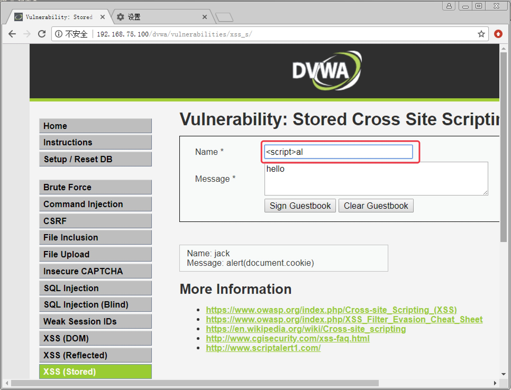
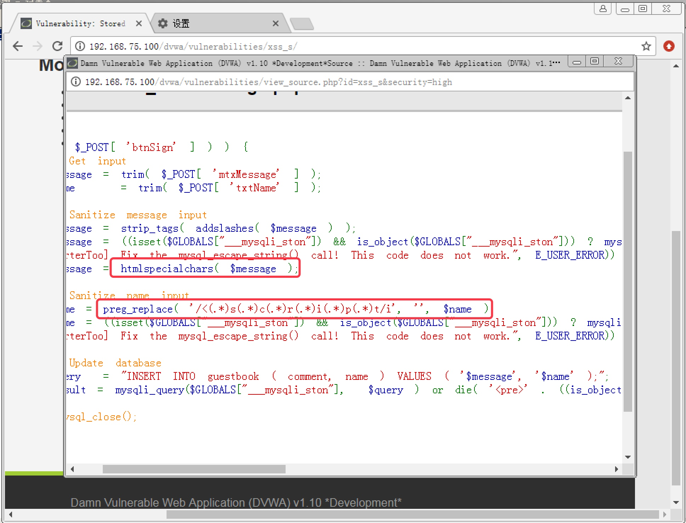

<!--more-->

# 8. 存储型 XSS 攻击实战

#### 8.1 Low 级别存储型 XSS 攻击实战

1. 安全级别设置为 `Low`，点击 `XSS (Stored)`，进入存储型 `XSS` 攻击页面。发现该页面是个留言板，随意输入留言内容，可以直接显示在当前页面，如图 8-1

   

   

   图 8-1

   

2. 尝试在 Message 框提交弹窗脚本输出当前 `cookie`，`` ，可以直接弹窗，如图 8-2。说明当前级别没有对攻击脚本做任何过滤和转义

   

   

   图 8-2

   

------

#### 8.2 Medium 级别存储型 XSS 攻击实战

1. 安全级别设置为 `Medium`，进入存储型 `XSS` 攻击页面，直接在 `Message` 框提交输出 `cookie` 脚本，发现脚本内容被显示，说明脚本被转义，如图 8-3

   

   

   图 8-3

   

2. 查看页面源码，发现对 `Message` 框提交的内容使用了 `htmlspecialchars` 函数，`Message` 框的 `XSS` 基本已不可能；但是我们发现对 `Name` 框提交的内容只是简单的使用 `str_replace` 函数进行了简单替换，与 `Medium` 反射型 `XSS` 一样，如图 8-4。我们只需要更换大写字母，或者 ``，发现脚本无法完整输入，页面对 `Name` 框的字符长度进行了前端限制，如图 8-5

   

   

   图 8-5

   

4. 由于只是在浏览器前端进行的字符长度限制，我们只需要在 `Burpsuite` 中修改数据包就可以轻松绕过限制。配置好 `Burpsuite` 和浏览器的代理，抓包后，修改 `txtName` 变量的值为脚本 `<scr`（也可以把 `script` 转换为大写），如图 8-6。放行数据包后，可以成功提交，并弹窗输出 `cookie`，如图 8-7

   

   

   图 8-6

   

   

   

   图 8-7

   

------

#### 8.3 High 级别存储型 XSS 攻击实战

1. 设置安全级别为 `High`，进入存储型 `XSS` 攻击页面，查看页面源码，发现 `Message` 字段仍然使用了 `htmlspecialchars` 函数；而 `Name` 字段使用了与 High 级别反射型 `XSS` 攻击一样的防护方法，使用 `preg_replace` 函数调用正则表达式对 `script` 做逐字匹配，并使用 `/i` 来不区分大小写，如图 8-8

   

   

   图 8-7

   

2. 方法与反射型 XSS 一致，不能使用 `<script>` 标签，但可以使用 `` 标签。由于前端仍然有字符长度限制，所以仍需要使用 `Burpsuite` 来修改数据包。在 `Burpsuite` 中修改数据包中的 `txtName` 内容为 ``，如图 8-8。放行数据包后成功弹出 `cookie`，如图 8-9

   

   

   图 8-8

   

   

   

   图 8-9

   

------

#### 8.4 Impossible 级别存储型 XSS 攻击

　　查看页面源码，发现 `Name` 框和 `Message` 框提交的内容都使用了 `htmlspecialchars` 函数，如图 8-10，彻底杜绝了 `XSS` 攻击。
　　

图 8-10

