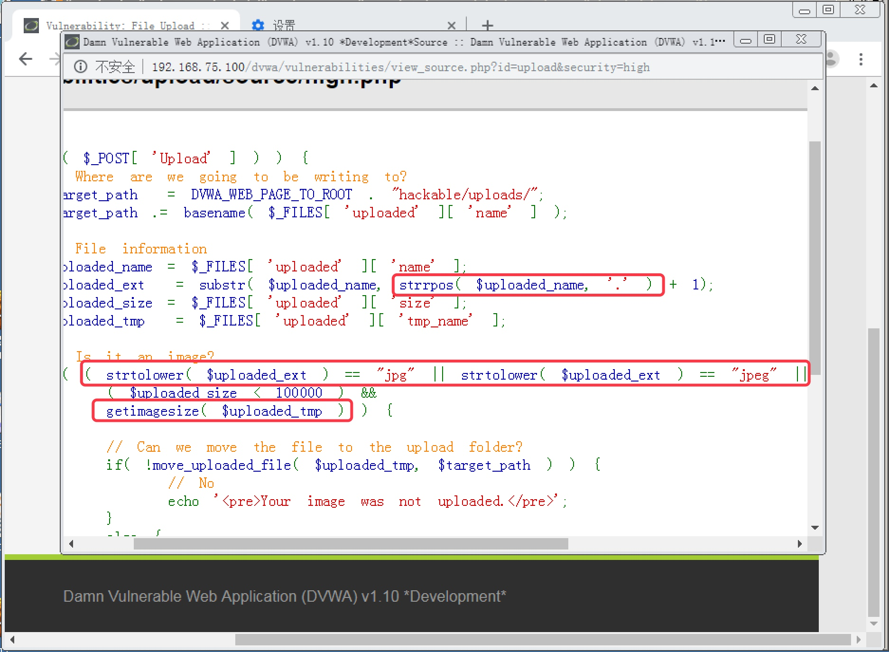
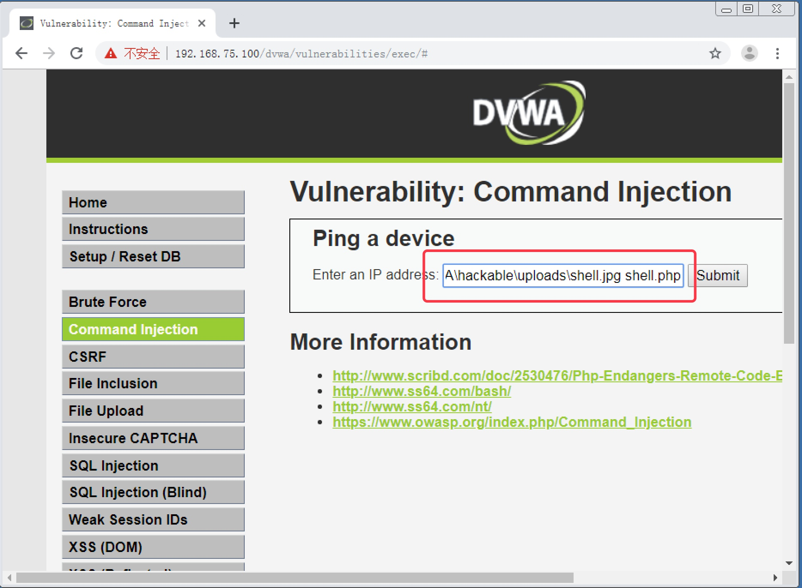
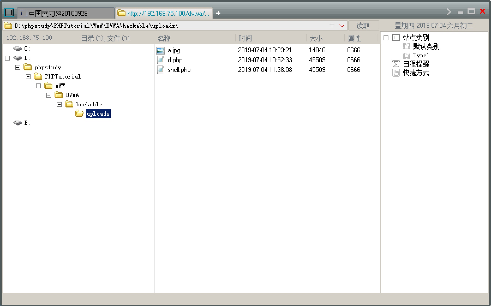

<!--more-->


# 11. 文件上传攻击实战

#### 11.1 文件上传攻击概述

　　对黑客来说，进行 Web 渗透的目的就是为了拿下网站的控制权，甚至是服务器的控制权。前面章节所讲的攻击方式大多数都是为了能够拿到网站的控制权。当拿到网站的控制权之后，其实能够做的事情还相对较少，黑客一般都会通过上传 Webshell 来提权，使自己可以获得整台服务器的控制权。

　　Webshell 以 ASP、PHP、JSP 等网页文件形式存在的一种命令执行环境，也称其为一种网页后门，通过 Webshell 可以对所在服务器进行远程管理。简单的说，就是 Webshell 运行在哪台服务器上，黑客就可以通过连接该 Webshell 来控制这台服务器。所以黑客一般会想尽千方百计来把自己的 Webshell 上传至目标服务器。


　　Webshell 也称网页木马。一般把网页木马可以分为一句话木马、小马和大马。所谓一句话木马，就是这个木马的攻击代码通常非常简短，简短到只有一句话，但是却可以对服务器实现各种控制，功能非常强大，一般需要使用 “中国菜刀” 进行连接来实现控制；小马会提供自己的管理页面，无需专门的连接工具，攻击代码一般也比较简短；而大马也有自己的管理页面，而且功能最全面，但是攻击代码会比较多，导致木马文件容量比较大，很难通过文件容量的限制。

　　有了 Webshell，如何把它上传到目标服务器上就是难度最大的一件事了。一般网站都会有很多提供上传文件功能的页面，比如上传用户头像、上传帖子附件等。这些页面也就成了黑客的重点光顾对象。虽然一般提供文件上传功能的页面都会有各种防御措施，比如限制上传的文件类型必须是图片，检查文件头部来判断文件类型。但是免不了仍然会存在一些破绽，一旦发现了破绽导致黑客能够把 Webshell 上传到服务器，那么黑客就可以轻松获得服务器的控制权。

## 　　

#### 11.2 Low 级别文件上传攻击实战

1. 安全级别设置为 `Low`，点击 `File Upload` 按钮进入文件上传攻击页面。发现是一个上传图片的页面，随便找一张图片文件（图片大小要小于 100K，前端有限制上传文件大小），可以成功上传到服务器，如图 11-1。按照返回的图片地址，可以访问到该图片，如图 11-2

   

   

   图 11-1

   

   

   

   图 11-2

   

2. 创建一个 PHP 一句话木马，文件后缀为 php，代码如下：

   ```
   <?php @eval($_POST[dmc]);?>      //dmc 为变量，作用类似于连接的密码，可以自定义
   ```

3. 把一句话木马进行上传，发现可以直接上传成功，如图 11-3

   

   

   图 11-3

   

4. 使用中国菜刀连接一句话木马。在菜刀中点击右键，添加，打开添加 SHELL 的对话框。在地址栏输入刚才上传的 PHP 一句话木马地址 `http://192.168.75.100/dvwa/hackable/uploads/shell.php`，后面的文本框中填写刚才设置的变量 `dmc`，点击添加，如图 11-4

   

   

   图 11-4

   

5. 双击添加的 `Shell` 连接，可以管理目标服务器的整个硬盘数据，包括文件上传和下载，如图 11-5

   

   

   图 11-4

   

6. 右键点击 `Shell` 连接，点击 虚拟终端，打开命令执行环境，可以在目标服务器上执行命令，如图 11-5

   

   

   图 11-5

   

------

#### 11.3 Medium 级别文件上传攻击实战

> 实验前到网站目录下删除上个级别上传成功的一句话木马文件，避免影响下个级别实验效果的真实性

1. 设置安全级别为 `Medium`，进入文件上传攻击页面，查看页面源码，发现限制了上传文件的 `MIME` 必须为 `image/jpeg` 或者 `image/png`，并且限制文件大小不能超过 100K，如图 11-6

   

   

   图 11-6

   

2. MIME 类型可以通过篡改来绕过防御，而对于文件大小限制，一句话木马本来就小，基本不用考虑。我们这里可以通过 `Burpsuite` 抓包改 `MIME` 来上传一句话木马。设置好 `Burpsuite` 和浏览器的代理，拦截上传一句话木马的包，发现 `MIME` 类型默认为 `application/octet-stream`，如图 11-7。我们修改成 `image/jpeg` 或 `image/png`，再放行数据包，如图 11-8，发现可以成功上传，如图 11-9

   

   

   图 11-7

   

   

   

   图 11-8

   

   

   

   图 11-9

   

3. 使用菜刀连接，可以成功连接并进行管理，如图 11-10

   

   

   图 11-10

   

------

#### 11.4 High 级别文件上传攻击实战

> 实验前到网站目录下删除上个级别上传成功的一句话木马文件，避免影响下个级别实验效果的真实性

1. 设置安全级别为 `High`，进入文件上传攻击页面，查看页面源码，发现使用 `strrpos( $uploaded_name, '.' )` 函数来截取文件名中最后一个 . 后面的字符，来识别为上传的文件的后缀名，并只接受后缀名为 `jpg`，`jpeg`，`png` 的文件。这个方法主要的目的是为了防止利用 IIS6 的文件解析漏洞。另外还使用了 `getimagesize( $uploaded_tmp )` 来获取文件头中的图片尺寸信息。读取不到尺寸信息则拒绝上传，如图 11-11

   

   

   图 11-11

   

2. 由于存在文件头的检查，所以我们只能找一张真正的图片文件，把一句话木马嵌入进去。在 `Windows` 中把一张正常的图片文件和一句话木马文件放置在同一个目录下，使用命令 `copy dmc5.jpg/b+shell.php/a shell.jpg`，会组合出一个携带一句话代码的 `shell.jpg` 文件，如图 11-12。上传该文件，发现可以成功，如图 11-14

   

   

   图 11-12

   

   

   

   图 11-13

   

3. 上传成功了，但由于图片仍然是 `jpg` 后缀，服务器不会把它当做 `PHP` 文件解析，使用菜刀连接，果然连接失败，如图 11-14

   

   

   图 11-14

   

4. 由于 00 截断和文件解析漏洞早已无法使用，这里只能结合 DVWA 中其他攻击模块的漏洞来完成（严格来说，接下来已经不能算是单纯的文件上传攻击了）。点击 `Command Injection` 按钮，进入命令注入攻击模块，我们可以使用 `High` 级别的命令注入漏洞来把上一步上传的 `shell.jpg` 重命名为 `shell.php`，使一句话代码能够被当做 `PHP` 解析。在命令注入页面中输入 `|ren D:\phpstudy\PHPTutorial\WWW\DVWA\hackable\uploads\shell.jpg shell.php`，如图 11-15

   

   

   图 11-15

   

5. 再次使用菜刀连接重命名之后的 `Webshell`，连接地址 `http://192.168.75.100/dvwa/hackable/uploads/shell.php`，可以成功连接，说明文件被成功重命名，如图 11-16

   

   

   图 11-16

   

------

#### 11.5 Impossible 级别文件上传攻击

　　Impossible 级别的文件上传页面，查看源码，发现使用了 `md5()` 函数对上传的文件的文件名进行重命名，重命名为 MD5 散列运算之后的值。这个方法主要是为了防御通过 00 截断来解析一句话木马；同时使用了随机 Token 检查来增加修改数据包上传的难度，如图 11-17。另外，由于 `Impossible` 级别下，命令注入攻击也无法实施，所以该级别下，并没有文件上传漏洞
　　


图 11-17