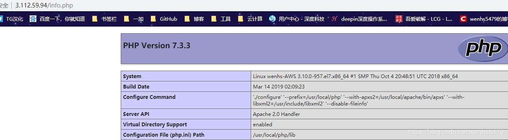

<!--more-->

# 1. 源码包基本概述

在linux环境下面安装源码包是比较常见的, 早期运维管理工作中，大部分软件都是通过源码安装的。那么安装一个源码包，是需要我们自己把源代码编译成二进制的可执行文件。

源码包的编译用到了linux系统里的编译器，通常源码包都是用C语言开发的，这也是因为C语言为linux上最标准的程序语言。Linux上的C语言编译器叫做gcc，利用它就可以把C语言变成可执行的二进制文件。所以如果你的机器上没有安装gcc就没有办法去编译源码。可以使用yum -y install gcc来完成安装。

# 2. 源码包的好处

 - 自定义修改源代码
 - 定制需要的相关功能
 - 新版软件优先更新源码

# 3. 源码包的获取

官方网站, 可以获得最新的软件包

- [Apache官方网站](http://www.apache.org/)
- [Nginx官方网站](http://nginx.org/)
- [Mysql官方网站](https://dev.mysql.com/downloads/mysql/5.7.html#downloads)

# 4. 源码包分类

 - 源码格式（需要编译安装）
 - 二进制格式（解压后可以直接使用）

# 5. 源码包的安装

 - 编译需要编译环境，开发环境，开发库，开发工具。
 - 常用的编译环境有c、c++、perl、java、python5种
 - c环境的编译器：gcc（GNU C Complier）
 - c++环境的编译器：g++
 - make：c、c++的统一项目管理工具，编译时有可能调用gcc也有可能调用g++。使用makefile文件定义make按何种次序去编译源程序文件中的源程序

**源码安装三部曲（常见）：**

> **第一步: ./configure（定制组件）**
> 
> 1.指定安装路径，例如 --prefix=/opt/nginx-1.12
> 2.启用或禁用某项功能, 例如 --enable-ssl
> 3.和其它软件关联，例如--with-pcre
> 4.检查安装环境，例如是否有编译器 gcc，是否满足软件的依赖需求
> 5.检测通过后生成Makefile文件

**第二步: make**

> 1.执行make命令进行编译, 可以使用-j指定CPU核心数进行编译
> 2.按Makefile文件进行编译, 编译成可执行二进制文件
> 3.生成各类模块和主程序

**第三步: make install**

> 1.按Makefile定义好的路径拷贝至安装目录中

上面介绍的源码三部曲不能百分百通用于所有源码包, 也就是说源码包的安装并非存在标准安装步骤，但是大部分源码安装都是类似的步骤

`建议`:

拿到源码包解压后，然后进入到目录找相关的帮助文档，通常会以INSTALL或者README为文件名

### 5.1 configure脚本的功能

 - 让用户选定编译特性
 - 检查编译环境是否符合程序编译的基本需要

### 5.2 编译安装注意事项

 - 如果安装时不是使用的默认路径，则必须要修改PATH环境变量，以能够识别此程序的二进制文件路径；
	 - [ ] 修改/etc/profile文件或在/etc/profile.d/目录建立一个以.sh为后缀的文件，在里面定义export
	       PATH=$PATH:/path/to/somewhere
 - 默认情况下，系统搜索库文件的路径只有/lib，/usr/lib
	 - [ ] 增添额外库文件搜索路径方法：
		 - 在/etc/ld.so.conf.d/中创建以.conf为后缀名的文件，而后把要增添的路径直接写至此文件中。此时库文件增添的搜索路径重启后有效，若要使用增添的路径立即生效则要使用ldconfig命令
		 - [ ] ldconfig：通知系统重新搜索库文件
	
```
/etc/ld.so.conf和/etc/ls.so.conf.d/*.conf    //配置文件
/etc/ld.so.cache            //缓存文件
-v      //显示重新搜索库的过程
-p      //打印出系统启动时自动加载并缓存到内存中的可用库文件名及文件路径映射关系
```

 - 头文件：输出给系统
	 - [ ] 默认：系统在/usr/include中找头文件，若要增添头文件搜索路径，使用链接进行
 - man文件路径：安装在--prefix指定的目录下的man目录
	 - [ ] 默认：系统在/usr/share/man中找man文件。此时因为编译安装的时候不是安装到默认路径下，如果要查找man文件则可以使用以下两种方法：
		 - man -M /path/to/man_dir command
		 - 在/etc/man.config文件中添加一条MANPATH

### 5.3 源码包编译实例

**下面通过编译安装nginx来深入理解源码包安装**

```
1.基础环境准备
[root@localhost ~]# yum -y install gcc gcc-c++ make wget

2.下载源码包(源码包一定要上官方站点下载，其他站点不安全)
[root@localhost ~]# cd /usr/src
[root@localhost src]# wget http://nginx.org/download/nginx-1.12.2.tar.gz

3.解压源码包,并进入相应目录
[root@localhost src]# tar xf nginx-1.12.2.tar.gz
[root@localhost src]# cd nginx-1.12.2

4.配置相关的选项，并生成Makefile
[root@localhost nginx-1.12.2]# ./configure --help|head

  --help                             print this message
  --prefix=PATH                      set installation prefix
  --sbin-path=PATH                   set nginx binary pathname
  --modules-path=PATH                set modules path
  --conf-path=PATH                   set nginx.conf pathname
  --error-log-path=PATH              set error log pathname
  --pid-path=PATH                    set nginx.pid pathname
  --lock-path=PATH                   set nginx.lock pathname

后面的内容省略了，使用 ./configure --help 命令查看可以使用的选项
一般常用的有 --prefix=PREFIX 这个选项的意思是定义软件包安装到哪里
建议，源码包都是安装在/opt/目录下


5.指定编译参数 
[root@localhost nginx-1.12.2]# ./configure --prefix=/opt/nginx-1.12.2


6.验证这一步命令是否成功, 非0的都不算成功
[root@localhost nginx-1.12.2]# echo $?
0

7.编译并安装
[root@localhost nginx-1.12.2]# make
[root@localhost nginx-1.12.2]# make install
[root@localhost nginx-1.12.2]# echo $?

8.建立软链接
[root@localhost nginx-1.12.2]# ln -s /opt/nginx-1.12.2 /opt/nginx
```

**源码编译报错信息处理**

```
[root@wenhs-AWS nginx-1.14.2]# ./configure 
checking for OS
 + Linux 3.10.0-957.el7.x86_64 x86_64
checking for C compiler ... not found

./configure: error: C compiler cc is not found

解决方案
[root@wenhs-AWS nginx-1.14.2]# yum -y install gcc gcc-c++ make


./configure: error: the HTTP rewrite module requires the PCRE library.
You can either disable the module by using --without-http_rewrite_module
option, or install the PCRE library into the system, or build the PCRE library
statically from the source with nginx by using --with-pcre=<path> option.

解决方案
[root@wenhs-AWS nginx-1.14.2]# yum install -y pcre-devel


./configure: error: the HTTP gzip module requires the zlib library.
You can either disable the module by using --without-http_gzip_module
option, or install the zlib library into the system, or build the zlib library
statically from the source with nginx by using --with-zlib=<path> option.

解决方案:
[root@wenhs-AWS nginx-1.14.2]# yum -y install zlib-devel


./configure: error: SSL modules require the OpenSSL library.
You can either do not enable the modules, or install the OpenSSL 
library into the system, or build the OpenSSL library statically
from the source with nginx by using --with-openssl=<path> option.

解决方案
[root@localhost ~]# yum -y install openssl-devel
```

### 实验

**1.源码安装nginx**


```
[root@wenhs-AWS ]# yum install -y pcre.devel
[root@wenhs-AWS ]#wget http://nginx.org/download/nginx-1.14.2.tar.gz
[root@wenhs-AWS ]#tar xf nginx-1.14.2.tar.gz
[root@wenhs-AWS ]#cd nginx-1.14.2
[root@wenhs-AWS nginx-1.14.2]#./configure --prefix=/usr/local/nginx --with-pcre
发现上面三次报错,以免文章过长,这里就不写了
另外,第一次编译的时候,没有指定--with-pcre,报make:No rule to make target `build', needed by `default'.  Stop.的错误,但是make已经安装,于是乎删掉重新编译,加上--with-pcre,一遍成功
[root@wenhs-AWS nginx-1.14.2]#make && make install
[root@wenhs-AWS nginx-1.14.2]#/usr/local/nginx/sbin/nginx
[root@wenhs-AWS nginx-1.14.2]#ss -antl
State      Recv-Q Send-Q Local Address:Port               Peer Address:Port              
LISTEN     0      128         *:80                      *:*                  
LISTEN     0      128         *:22                      *:*                  
LISTEN     0      100    127.0.0.1:25                      *:*                  
LISTEN     0      128        :::22                     :::*                  
LISTEN     0      100       ::1:25                     :::*
[root@wenhs-AWS nginx-1.14.2]#curl http://103.4.11.215
<!DOCTYPE html>
<html>
<head>
<title>Welcome to nginx!</title>
<style>
    body {
        width: 35em;
        margin: 0 auto;
        font-family: Tahoma, Verdana, Arial, sans-serif;
    }
</style>
</head>
<body>
<h1>Welcome to nginx!</h1>
<p>If you see this page, the nginx web server is successfully installed and
working. Further configuration is required.</p>

<p>For online documentation and support please refer to
<a href="http://nginx.org/">nginx.org</a>.<br/>
Commercial support is available at
<a href="http://nginx.com/">nginx.com</a>.</p>

<p><em>Thank you for using nginx.</em></p>
</body>
</html>
```

**2.源码安装apache**

```
免得端口占用,上题影响这题结果,先把nginx关闭。
[root@wenhs-AWS ~]# /usr/local/nginx/sbin/nginx -s stop
[root@wenhs-AWS ~]# ss -antl
State       Recv-Q Send-Q Local Address:Port               Peer Address:Port              
LISTEN      0      128              *:22                           *:*                  
LISTEN      0      100      127.0.0.1:25                           *:*                  
LISTEN      0      128             :::22                          :::*                  
LISTEN      0      100            ::1:25                          :::*                  
[root@wenhs-AWS ~]# 

```

```
[root@wenhs-AWS ]#wget https://www-us.apache.org/dist/httpd/httpd-2.4.38.tar.gz
[root@wenhs-AWS ]#wget https://www-us.apache.org/dist/apr/apr-1.6.5.tar.gz
[root@wenhs-AWS ]#wget https://www-us.apache.org/dist/apr/apr-util-1.6.1.tar.gz
[root@wenhs-AWS ~]# tar xf httpd-2.4.38.tar.gz 
[root@wenhs-AWS ~]# tar xf apr-1.6.5.tar.gz 
[root@wenhs-AWS ~]# tar xf apr-util-1.6.1.tar.gz 
[root@wenhs-AWS ~]# ls
anaconda-ks.cfg   apr-util-1.6.1.tar.gz                     nginx-1.14.2
apr-1.6.5         httpd-2.4.38                              nginx-1.14.2.tar.gz
apr-1.6.5.tar.gz  httpd-2.4.38.tar.gz                       original-ks.cfg
apr-util-1.6.1    mysql-5.7.25-1.el7.x86_64.rpm-bundle.tar
[root@wenhs-AWS ~]# cd apr-1.6.5/
[root@wenhs-AWS apr-1.6.5]# ls
apr-config.in  buildconf         dso         libapr.rc     NOTICE         support
apr.dep        build.conf        emacs-mode  LICENSE       NWGNUmakefile  tables
apr.dsp        build-outputs.mk  encoding    locks         passwd         test
apr.dsw        CHANGES           file_io     Makefile.in   poll           threadproc
apr.mak        CMakeLists.txt    helpers     Makefile.win  random         time
apr.pc.in      config.layout     include     memory        README         tools
apr.spec       configure         libapr.dep  misc          README.cmake   user
atomic         configure.in      libapr.dsp  mmap          shmem
build          docs              libapr.mak  network_io    strings
[root@wenhs-AWS apr-1.6.5]# ./configure --prefix=/usr/local/apr/
checking build system type... x86_64-pc-linux-gnu
checking host system type... x86_64-pc-linux-gnu
checking target system type... x86_64-pc-linux-gnu
Configuring APR library
Platform: x86_64-pc-linux-gnu
checking for working mkdir -p... yes
APR Version: 1.6.5
checking for chosen layout... apr
......
configure: creating ./config.status
config.status: creating Makefile
config.status: WARNING:  'Makefile.in' seems to ignore the --datarootdir setting
config.status: creating include/apr.h
config.status: creating build/apr_rules.mk
config.status: creating build/pkg/pkginfo
config.status: creating apr-1-config
config.status: creating apr.pc
config.status: creating test/Makefile
config.status: creating test/internal/Makefile
config.status: creating include/arch/unix/apr_private.h
config.status: executing libtool commands
rm: cannot remove 'libtoolT': No such file or directory
config.status: executing default commands
[root@wenhs-AWS apr-1.6.5]# echo $?							#由于不清楚到底有没有报错,查询一下是否运行成功
0															#成功了
[root@wenhs-AWS apr-1.6.5]# make
......
usr/local/apr//build-1,' < build/apr_rules.mk > build/apr_rules.out
make[1]: Leaving directory `/root/apr-1.6.5'
[root@wenhs-AWS apr-1.6.5]# echo $?
0
[root@wenhs-AWS apr-1.6.5]# make install
make[1]: Entering directory `/root/apr-1.6.5'
make[1]: Nothing to be done for `local-all'.
make[1]: Leaving directory `/root/apr-1.6.5'
...
/usr/bin/install -c -m 644 /root/apr-1.6.5/build/find_apr.m4 /usr/local/apr//build-1
/usr/bin/install -c -m 755 apr-config.out /usr/local/apr//bin/apr-1-config
[root@wenhs-AWS apr-1.6.5]# echo $?
0
[root@wenhs-AWS ~]# cd ../apr-util-1.6.1/
[root@wenhs-AWS apr-util-1.6.1]#  ./configure --prefix=/usr/local/apr-util/ --with-apr=/usr/local/apr/
checking build system type... x86_64-pc-linux-gnu
checking host system type... x86_64-pc-linux-gnu
checking target system type... x86_64-pc-linux-gnu
......
config.status: creating test/Makefile
config.status: creating include/private/apu_config.h
config.status: executing default commands
[root@wenhs-AWS apr-util-1.6.1]# echo $?
0
[root@wenhs-AWS apr-util-1.6.1]# make
make[1]: Entering directory `/root/apr-util-1.6.1'
.......
#include <expat.h>
                   ^
compilation terminated.
make[1]: *** [xml/apr_xml.lo] Error 1
make[1]: Leaving directory `/root/apr-util-1.6.1'
make: *** [all-recursive] Error 1
[root@wenhs-AWS apr-util-1.6.1]# yum install -y expat-devel
[root@wenhs-AWS apr-util-1.6.1]# make
make[1]: Entering directory `/root/apr-util-1.6.1'
.......
sed 's,^\(location=\).*$,\1installed,' < apu-1-config > apu-config.out
make[1]: Leaving directory `/root/apr-util-1.6.1'
[root@wenhs-AWS apr-util-1.6.1]# echo $?
0
[root@wenhs-AWS apr-util-1.6.1]# make install
make[1]: Entering directory `/root/apr-util-1.6.1'
make[1]: Nothing to be done for `local-all'.
make[1]: Leaving directory `/root/apr-util-1.6.1'
....
/usr/bin/install -c -m 644 aprutil.exp /usr/local/apr-util//lib
/usr/bin/install -c -m 755 apu-config.out /usr/local/apr-util//bin/apu-1-config
[root@wenhs-AWS apr-util-1.6.1]# echo $?
0
[root@wenhs-AWS apr-util-1.6.1]# cd ../httpd-2.4.38/
[root@wenhs-AWS httpd-2.4.38]# ./configure --prefix=/usr/local/apache --with-apr=/usr/local/apr/ --with-apr-util=/usr/local/apr-util
checking for chosen layout... Apache
checking for working mkdir -p... yes
......
    Server Version: 2.4.38
    Install prefix: /usr/local/apache
    C compiler:     gcc -std=gnu99
    CFLAGS:          -g -O2 -pthread  
    CPPFLAGS:        -DLINUX -D_REENTRANT -D_GNU_SOURCE  
    LDFLAGS:           
    LIBS:             
    C preprocessor: gcc -E
    
[root@wenhs-AWS httpd-2.4.38]# echo $?
0
[root@wenhs-AWS httpd-2.4.38]# make
.....
collect2: error: ld returned 1 exit status
make[2]: *** [htpasswd] Error 1
make[2]: Leaving directory `/root/httpd-2.4.38/support'
make[1]: *** [all-recursive] Error 1
make[1]: Leaving directory `/root/httpd-2.4.38/support'
make: *** [all-recursive] Error 1
[root@wenhs-AWS httpd-2.4.38]# yum install -y libxml2-devel
安装后重新编译还是失败,好像要重新安装apr-util
[root@wenhs-AWS httpd-2.4.38]# rm -rf /usr/local/apr-util
[root@wenhs-AWS ~]# rm -rf apr-util-1.6.1
[root@wenhs-AWS ~]# tar xf apr-util-1.6.1.tar.gz 
[root@wenhs-AWS ~]# cd apr-util-1.6.1/
[root@wenhs-AWS apr-util-1.6.1]#  ./configure --prefix=/usr/local/apr-util/ --with-apr=/usr/local/apr/
[root@wenhs-AWS apr-util-1.6.1]# make && make install
一切顺利,安装过一次
[root@wenhs-AWS apr-util-1.6.1]# cd ../httpd-2.4.38/
[root@wenhs-AWS httpd-2.4.38]# make
.....
make[4]: Leaving directory `/root/httpd-2.4.38/modules/mappers'
make[3]: Leaving directory `/root/httpd-2.4.38/modules/mappers'
make[2]: Leaving directory `/root/httpd-2.4.38/modules'
make[2]: Entering directory `/root/httpd-2.4.38/support'
make[2]: Leaving directory `/root/httpd-2.4.38/support'

make[1]: Leaving directory `/root/httpd-2.4.38'
[root@wenhs-AWS httpd-2.4.38]# echo $?
0
[root@wenhs-AWS httpd-2.4.38]#make install
......
mkdir /usr/local/apache/man/man8
mkdir /usr/local/apache/manual
make[1]: Leaving directory `/root/httpd-2.4.38'
[root@wenhs-AWS httpd-2.4.38]# echo $?
0
[root@wenhs-AWS httpd-2.4.38]# mkdir /usr/include/apache
[root@wenhs-AWS httpd-2.4.38]# ln -s /usr/local/apache/include/* /usr/include/apache
[root@wenhs-AWS httpd-2.4.38]# service httpd start 
Usage: /etc/init.d/httpd [-D name] [-d directory] [-f file]
                         [-C "directive"] [-c "directive"]
                         [-k start|restart|graceful|graceful-stop|stop]
                         [-v] [-V] [-h] [-l] [-L] [-t] [-T] [-S] [-X]
Options:
  -D name            : define a name for use in <IfDefine name> directives
  -d directory       : specify an alternate initial ServerRoot
  -f file            : specify an alternate ServerConfigFile
  -C "directive"     : process directive before reading config files
  -c "directive"     : process directive after reading config files
  -e level           : show startup errors of level (see LogLevel)
  -E file            : log startup errors to file
  -v                 : show version number
  -V                 : show compile settings
  -h                 : list available command line options (this page)
  -l                 : list compiled in modules
  -L                 : list available configuration directives
  -t -D DUMP_VHOSTS  : show parsed vhost settings
  -t -D DUMP_RUN_CFG : show parsed run settings
  -S                 : a synonym for -t -D DUMP_VHOSTS -D DUMP_RUN_CFG
  -t -D DUMP_MODULES : show all loaded modules 
  -M                 : a synonym for -t -D DUMP_MODULES
  -t -D DUMP_INCLUDES: show all included configuration files
  -t                 : run syntax check for config files
  -T                 : start without DocumentRoot(s) check
  -X                 : debug mode (only one worker, do not detach)
[root@wenhs-AWS httpd-2.4.38]# service httpd -k start 
AH00558: httpd: Could not reliably determine the server's fully qualified domain name, using fe80::869:6bff:fe89:6872. Set the 'ServerName' directive globally to suppress this message
[root@wenhs-AWS httpd-2.4.38]# ervice httpd -T
-bash: ervice: command not found
[root@wenhs-AWS httpd-2.4.38]# service httpd -T
AH00558: httpd: Could not reliably determine the server's fully qualified domain name, using fe80::869:6bff:fe89:6872. Set the 'ServerName' directive globally to suppress this message
httpd (pid 12017) already running
[root@wenhs-AWS httpd-2.4.38]# netstat -antp|grep 80
tcp6       0      0 :::80                   :::*                    LISTEN      12017/httpd         
[root@wenhs-AWS httpd-2.4.38]# curl http://3.112.59.94          #避免浪费资源,晚上亚马逊云主机会关机,所以再开机公网IP会变,今天IP是下面这个
<html><body><h1>It works!</h1></body></html>
```

[关于为什么监听到只有ipv6地址问题,可以看这个,但是访问ipv4地址还是可以访问到的](https://blog.csdn.net/zangjiaoshou/article/details/80523540)
本题只是让我们学会如何源码安装apache服务,过多的设置以后回学,在这里就不修改了
[另外,本题排版不是很好,点击这个,跳转到一位大神的,个人感觉十分详细](https://segmentfault.com/a/1190000015612597)

**3.源码安装PHP**

```
[root@wenhs-AWS ~]# wget http://jp2.php.net/distributions/php-7.3.3.tar.bz2
--2019-03-14 01:43:38--  http://jp2.php.net/distributions/php-7.3.3.tar.bz2
Resolving jp2.php.net (jp2.php.net)... 49.212.134.217
Connecting to jp2.php.net (jp2.php.net)|49.212.134.217|:80... connected.
HTTP request sent, awaiting response... 200 OK
Length: 14813435 (14M) [application/octet-stream]
Saving to: ‘php-7.3.3.tar.bz2’

100%[=============================================>] 14,813,435  20.0MB/s   in 0.7s   

2019-03-14 01:43:39 (20.0 MB/s) - ‘php-7.3.3.tar.bz2’ saved [14813435/14813435]

[root@wenhs-AWS ~]# ll
total 541696
-rw-------.  1 root root      7329 Oct 17 12:27 anaconda-ks.cfg
drwxr-xr-x. 28 1001 1001      4096 Mar 13 10:35 apr-1.6.5
-rw-r--r--.  1 root root   1073556 Sep 14 04:07 apr-1.6.5.tar.gz
drwxr-xr-x. 21 1001 1001      4096 Mar 13 11:09 apr-util-1.6.1
-rw-r--r--.  1 root root    554301 Oct 22  2017 apr-util-1.6.1.tar.gz
drwxr-sr-x. 12 root   40      4096 Mar 13 11:11 httpd-2.4.38
-rw-r--r--.  1 root root   9187294 Jan 21 15:03 httpd-2.4.38.tar.gz
-rw-r--r--.  1 root root 528015360 Dec 24 05:44 mysql-5.7.25-1.el7.x86_64.rpm-bundle.tar
drwxr-xr-x.  9 1001 1001       186 Mar 13 10:05 nginx-1.14.2
-rw-r--r--.  1 root root   1015384 Dec  4 14:58 nginx-1.14.2.tar.gz
-rw-------.  1 root root      6664 Oct 17 12:27 original-ks.cfg
-rw-r--r--.  1 root root  14813435 Mar  5 14:30 php-7.3.3.tar.bz2
[root@wenhs-AWS ~]# tar xf php-7.3.3.tar.bz2 
tar (child): lbzip2: Cannot exec: No such file or directory
tar (child): Error is not recoverable: exiting now
tar: Child returned status 2
tar: Error is not recoverable: exiting now
[root@wenhs-AWS ~]# yum -y install bzip2
[root@wenhs-AWS ~]# tar xf php-7.3.3.tar.bz2
[root@wenhs-AWS ~]# cd php-7.3.3/
[root@wenhs-AWS php-7.3.3]# ./configure --prefix=/usr/local/php --with-apxs2=/usr/local/apache/bin/apxs --with-libxml2=/usr/include/libxml2
configure: WARNING: unrecognized options: --with-libxml2
checking for grep that handles long lines and -e... /usr/bin/grep
.......
config.status: creating main/php_config.h
config.status: executing default commands
configure: WARNING: unrecognized options: --with-libxml2
[root@wenhs-AWS php-7.3.3]# echo $?
0
[root@wenhs-AWS php-7.3.3]# make
.......
make: *** [ext/fileinfo/libmagic/apprentice.lo] Error 1		#这是因为系统的内存不足1G造成的,然后需要加上 --disable-fileinfo,然重新编译即可；
[root@wenhs-AWS php-7.3.3]# ./configure --prefix=/usr/local/php --with-apxs2=/usr/local/apache/bin/apxs --with-libxml2=/usr/include/libxml2 --disable-fileinfo
[root@wenhs-AWS php-7.3.3]# make
.......
Don't forget to run 'make test'.

[root@wenhs-AWS php-7.3.3]# echo $?
0
[root@wenhs-AWS php-7.3.3]# make install
......
Wrote PEAR system config file at: /usr/local/php/etc/pear.conf
You may want to add: /usr/local/php/lib/php to your php.ini include_path
/root/php-7.3.3/build/shtool install -c ext/phar/phar.phar /usr/local/php/bin
ln -s -f phar.phar /usr/local/php/bin/phar
Installing PDO headers:           /usr/local/php/include/php/ext/pdo/
[root@wenhs-AWS php-7.3.3]# echo $?
0
到这里就安装完成了
```

**拓展,把PHP和apache结合**

```
[root@wenhs-AWS php-7.3.3]# vim /usr/local/apache/conf/httpd.conf

#加载这个模块
LoadModule php7_module 	modules/libphp7.so
#让apache解析PHP代码
AddHandler php7-script .php
#让apache解析html里的PHP代码
AddType application/x-httpd-php .html

[root@wenhs-AWS php-7.3.3]# vim /usr/local/apache/htdocs/info.php

<?php
phpinfo();
?>

[root@wenhs-AWS php-7.3.3]# ls /usr/local/php/
bin  etc  include  lib  php  var
[root@wenhs-AWS php-7.3.3]# mkdir /usr/bin/php
[root@wenhs-AWS php-7.3.3]# ln -s /usr/local/php/bin/* /usr/bin/php/
[root@wenhs-AWS php-7.3.3]# mkdir /usr/lib/php
[root@wenhs-AWS php-7.3.3]# ln -s /usr/local/php/lib/ /usr/lib/php/
[root@wenhs-AWS php-7.3.3]# service httpd -k stop
[root@wenhs-AWS php-7.3.3]# service httpd -k start				#用restart回显没有,不直观
httpd (pid 26025) already running
```



源码安装[脚本](https://github.com/itwhs/zabbix)