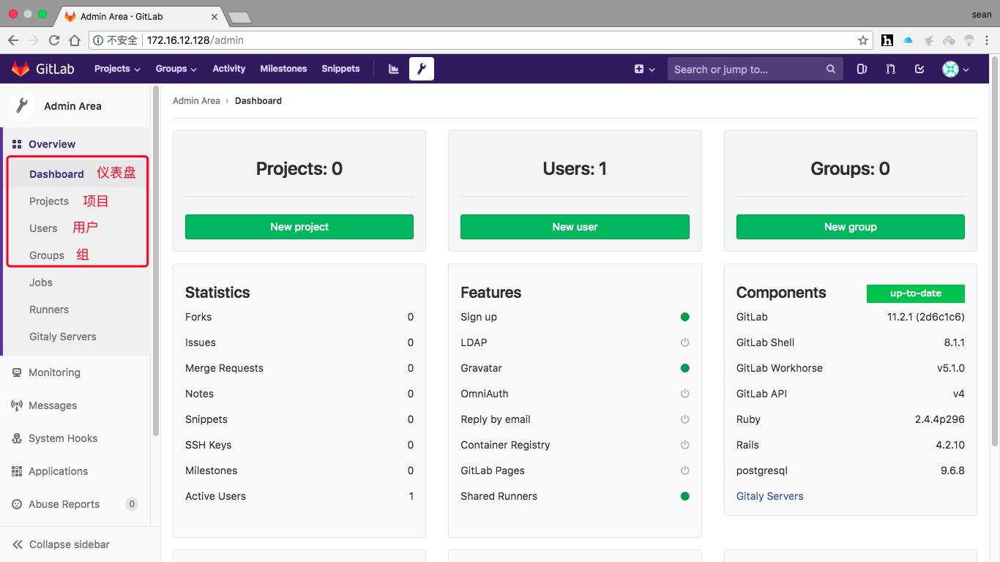

---

title: "Gitlab"
date: 2018-12-29T16:15:57+08:00
description: ""
draft: false
tags: ["版本控制"]
categories: ["Linux运维"]
---

<!--more-->


## 1.版本控制介绍

版本控制是指对软件开发过程中各种程序代码，配置文件及说明文档等文件变更的管理，是软件配置管理的核心思想之一。

版本控制最主要的功能就是追踪文件的变更。它将什么时候，什么人更改了文件的什么内容等信息忠实地了记录下来。每一次文件的改变，文件的版本号都将增加。除了记录版本变更外，版本控制的另一个重要功能是并行开发。软件开发往往是多人协同作业，版本控制可以有效地解决版本的同步以及不同开发者之间的开发通信问题，提高协同开发的效率并行。开发中最常见的不同版本软件的错误（错误）修正问题也可以通过版本控制中分支与合并的方法有效地解决。
具体来说，在每一项开发任务中，都需要首先设定开发基线，确定各个配置项的开发初始版本，在开发过程中，开发人员基于开发基线的版本，开发出所需的目标版本。当发生需求变更时，通过对变更的评估，确定变更的影响范围，对被影响的配置项的版本进行修改，根据变更的性质使配置 的版本树继续延伸或产生新的分支，形成新的目标版本，而对于不受变更影响的配置项则不应发产生变动。同时，应能够将变更所产生的对版本的影响进行记录和跟踪。必要时还可以回退到以前的版本。例如当开发需求或需求变更被取消时，就需要有能力将版本回退到开发基线版本。在曾经出现过的季度升级包拆包和重新组包的过程中，其实就是将部分配置项的版本回退到开发基线，将对应不同需求的不同分支重新组合归并，形成新的升级包版本。
版本控制是软件配置管理的核心功能。所有置于配置库中的元素都应自动予以版本的标识，并保证版本命名的唯一性。版本在生成过程中，自动依照设定的使用模型自动分支，演进。除了系统自动记录的版本信息以外，为了配合软件开发流程的各个阶段。还需要定义，收集一些元数据来记录版本的辅助信息和规范开发流程，并为今后对软件过程的度量做好准备。当然如果选用的工具支持，这些辅助数据将能直接统计出过程数据，从而方便软件过程改进活动的进行。对于配置库中的各个基线控制项，应该根据其基线的位置和状态来设置相应的访问权限。一般来说，对于基线版本之前的各个版本都应处于被锁定的状态，如需要对它们进行变更，则应按照变更控制的流程来进行操作。

常用的版本控制工具：

 - gitlab
 - 颠覆

## 2. gitlab部署

```
配置yum源
[root@localhost ~]# cd /etc/yum.repos.d/
[root@localhost yum.repos.d]# wget http://mirrors.163.com/.help/CentOS7-Base-163.repo
[root@localhost ~]# sed -i 's/\$releasever/7/g' /etc/yum.repos.d/CentOS7-Base-163.repo
[root@localhost ~]# sed -i 's/^enabled=.*/enabled=1/g' /etc/yum.repos.d/CentOS7-Base-163.repo

安装git
[root@localhost ~]# yum -y install epel-release git
安装过程略

安装依赖包
[root@localhost ~]# yum -y install curl openssh-server openssh-clients postfix cronie policycoreutils-python
安装过程略....

启动postfix服务并设置开机自启
[root@localhost ~]# systemctl restart postfix
[root@localhost ~]# systemctl enable postfix

下载gitlab的rpm包
[root@localhost ~]# cd /usr/src/
[root@localhost src]# ls
debug  kernels
[root@localhost src]# wget https://mirrors.tuna.tsinghua.edu.cn/gitlab-ce/yum/el7/gitlab-ce-11.2.1-ce.0.el7.x86_64.rpm
......
HTTP request sent, awaiting response... 200 OK
Length: 444944490 (424M) [application/x-redhat-package-manager]
Saving to: ‘gitlab-ce-11.2.1-ce.0.el7.x86_64.rpm’

[root@localhost src]# ls
debug  gitlab-ce-11.2.1-ce.0.el7.x86_64.rpm  kernels

安装gitlab
[root@localhost src]# rpm -ivh gitlab-ce-11.2.1-ce.0.el7.x86_64.rpm
warning: gitlab-ce-11.2.1-ce.0.el7.x86_64.rpm: Header V4 RSA/SHA1 Signature, key ID f27eab47: NOKEY
Preparing...                                                            (1################################# [100%]
Updating / installing...
   1:gitlab-ce-11.2.1-ce.0.el7                                          (
################################# [100%]
It looks like GitLab has not been configured yet; skipping the upgrade script.

       *.                  *.
      ***                 ***
     *****               *****
    .******             *******
    ********            ********
   ,,,,,,,,,***********,,,,,,,,,
  ,,,,,,,,,,,*********,,,,,,,,,,,
  .,,,,,,,,,,,*******,,,,,,,,,,,,
      ,,,,,,,,,*****,,,,,,,,,.
         ,,,,,,,****,,,,,,
            .,,,***,,,,
                ,*,.


     _______ __  __          __
    / ____(_) /_/ /   ____ _/ /_
   / / __/ / __/ /   / __ `/ __ \
  / /_/ / / /_/ /___/ /_/ / /_/ /
  \____/_/\__/_____/\__,_/_.___/


Thank you for installing GitLab!
GitLab was unable to detect a valid hostname for your instance.
Please configure a URL for your GitLab instance by setting `external_url`
configuration in /etc/gitlab/gitlab.rb file.
Then, you can start your GitLab instance by running the following command:
  sudo gitlab-ctl reconfigure

For a comprehensive list of configuration options please see the Omnibus GitLab readme
https://gitlab.com/gitlab-org/omnibus-gitlab/blob/master/README.md


修改配置文件
[root@localhost ~]# vim /etc/gitlab/gitlab.rb
......  //此处为省略内容
external_url 'http://172.16.137.11'     //将此处设为gitlab的服务器ip地址亦或域名
......  //此处为省略内容

重载配置文件并重启gitlab
[root@localhost ~]# gitlab-ctl reconfigure
[root@localhost ~]# gitlab-ctl restart
ok: run: alertmanager: (pid 17305) 0s
ok: run: gitaly: (pid 17318) 0s
ok: run: gitlab-monitor: (pid 17331) 0s
ok: run: gitlab-workhorse: (pid 17335) 0s
ok: run: logrotate: (pid 17363) 1s
ok: run: nginx: (pid 17369) 0s
ok: run: node-exporter: (pid 17380) 1s
ok: run: postgres-exporter: (pid 17386) 0s
ok: run: postgresql: (pid 17396) 1s
ok: run: prometheus: (pid 17405) 0s
ok: run: redis: (pid 17420) 0s
ok: run: redis-exporter: (pid 17425) 0s
ok: run: sidekiq: (pid 17510) 0s
ok: run: unicorn: (pid 17523) 0s

查看当前的gitlab版本
[root@localhost ~]# head -1 /opt/gitlab/version-manifest.txt
gitlab-ce 11.2.1


设置管理员密码
[root@localhost ~]# gitlab-rails console production
-------------------------------------------------------------------------------------
 GitLab:       11.2.1 (2d6c1c6)
 GitLab Shell: 8.1.1
 postgresql:   9.6.8
-------------------------------------------------------------------------------------
Loading production environment (Rails 4.2.10)
irb(main):001:0> user = User.where(id: 1).first     //id为1的是超级管理员
=> #<User id:1 @root>
irb(main):002:0> user.password = 'itwhs123!'     //密码必须至少8个字符
=> "itwhs123!"
irb(main):003:0> user.save!     //保存修改，若无问题将返回true
Enqueued ActionMailer::DeliveryJob (Job ID: 7feb0464-15aa-4151-be94-2e657a65494e) to Sidekiq(mailers) with arguments: "DeviseMailer", "password_change", "deliver_now", gid://gitlab/User/1
=> true
irb(main):004:0> exit   //退出
```

## 3. gitlab管理

在浏览器中使用gitlab服务器的IP访问，如下页面所示图产品


主页如下图产品所示


管理页面如下图产品所示



**gitlab常用管理操作**

 - 项目管理（通常只是创建新项目）
 - 创建成员组（针对某个项目创建一个成员组）
 - 用户管理（此用户乃gitlab用户而非系统用户）
	 - 来了新员工，为其添加gitlab用户
	 - 员工离职，将其gitlab用户禁用或删除
