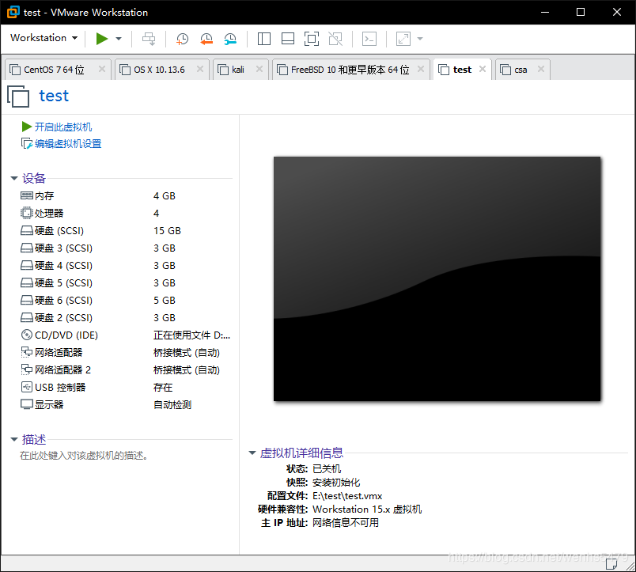

<!--more-->

***实验准备:***




***工具准备***:(centos7.5)配好软件源的情况下

```
yum -y install util-linux gdisk parted coreutils procps-ng
安装这些软件包,以下实验不会缺少,无命令的情况
```

***实验要求:***

>P:主分区;
>
>E:扩展分区;
>
>L:逻辑分区
>
>磁盘2:1P+1E(4L)空间自由分配
>
>磁盘3:用gpt格式分区空间自由分配
>
>磁盘4:2P+1E(4L)空间自由分配
>
>磁盘5:3P+1E(4L)空间自由分配
>
>磁盘6:全盘做swap分区
>
>并且设置开机自动挂载

# 1. 磁盘基本概述

### 1.1 磁盘分类

 - 固态硬盘
 - 机械硬盘
 - 服务器硬盘

### 1.2 固态硬盘的优缺点

**优点：**

 - 读写速度快
 - 防震抗摔性强
 - 低功耗
 - 无躁音
 - 体积小，携带方便

**缺点：**

 - 容量比机械硬盘小
 - 寿命比机械硬盘短
 - 制造成本高所以价格比机械硬盘高

### 1.3 Linux中磁盘命名方式

Linux中磁盘的命名方式与磁盘的接口有关，规则如下：

 - 传统IDE接口硬盘：`/dev/hd[a-z]`
 - SCISI接口硬盘：`/dev/sd[a-z]`
 - 虚拟化硬盘：`/dev/vd[a-z]`

在设备名称的定义规则如下, 其他的分区可以以此类推
系统的第一块SCSI接口的硬盘名称为`/dev/sda`
系统的第二块SCSI接口的硬盘名称为`/dev/sdb`
系统中分区由数字编号表示, 1-4留给主分区使用和扩展分区, 逻辑分区从5开始

> *第一块磁盘* 
> /dev/sda 
> *第一块磁盘的第一个分区* 
> /dev/sda1 
> *第二块磁盘的第一个分区*
>  /dev/sdb1

### 1.4 MBR与GPT

在使用新磁盘之前，你必须对其进行分区。`MBR（Master Boot Record）`和`GPT（GUID Partition Table）`是在磁盘上存储分区信息的两种不同方式。这些分区信息包含了分区从哪里开始的信息，这样操作系统才知道哪个扇区是属于哪个分区的，以及哪个分区是可以启动的。在磁盘上创建分区时，你必须在MBR和GPT之间做出选择

`MBR`是`Master Boot Record`的简称，也就是主引导记录，是位于磁盘最前边的一段引导（`Loader`）代码，主要用来引导操作系统的加载与启动

**特点：**

 1. MBR支持最大2TB磁盘，它无法处理大于2TB容量的磁盘
 2. 只支持最多4个主分区。若想要更多分区，需要创建扩展分区，并在其中创建逻辑分区

`GPT`磁盘是指使用GUID分区表的磁盘，GUID磁盘分区表（`GUID Partition Table`，缩写：GPT）其含义为“全局唯一标识磁盘分区表”，是一个实体硬盘的分区表的结构布局的标准

**特点：**

 1. GPT对磁盘大小没有限制
 2. 最多可以创建128个分区

***注意：***

> MBR与GPT之间互相转换会导致数据丢失

[GPT磁盘概述](https://baike.baidu.com/item/GPT%E7%A3%81%E7%9B%98/12761414)和 [MBR与GPT的区别](http://www.udaxia.com/wtjd/6117.html)

# 2. 磁盘容量检查

使用`df`命令查看磁盘容量，不加参数以k为单位：

```
df -i   //查看inode使用情况
df -h   //以G或者T或者M人性化方式显示
df -T   //查看文件类型

使用df命令查看磁盘，下面分别介绍每列什么含义
[root@wenhs5479 ~]# df -h
文件系统                 容量  已用  可用 已用% 挂载点
/dev/mapper/centos-root   13G  5.8G  6.8G   46% /
devtmpfs                 1.9G     0  1.9G    0% /dev
tmpfs                    1.9G     0  1.9G    0% /dev/shm
tmpfs                    1.9G   13M  1.9G    1% /run
tmpfs                    1.9G     0  1.9G    0% /sys/fs/cgroup
/dev/sda1               1014M  181M  834M   18% /boot
tmpfs                    378M  8.0K  378M    1% /run/user/42
tmpfs                    378M   28K  378M    1% /run/user/0
/dev/sr0                  11G   11G     0  100% /run/media/root/CentOS 7 x86_64
[root@wenhs5479 ~]#
```

使用`lsblk`查看分区情况：

```
[root@wenhs5479 ~]# lsblk 
NAME            MAJ:MIN RM  SIZE RO TYPE MOUNTPOINT
sda               8:0    0   15G  0 disk 
├─sda1            8:1    0    1G  0 part /boot
└─sda2            8:2    0   14G  0 part 
  ├─centos-root 253:0    0 12.5G  0 lvm  /
  └─centos-swap 253:1    0  1.5G  0 lvm  [SWAP]
sdb               8:16   0    3G  0 disk 
sdc               8:32   0    3G  0 disk 
sdd               8:48   0    3G  0 disk 
sde               8:64   0    3G  0 disk 
sdf               8:80   0    5G  0 disk 
sr0              11:0    1   10G  0 rom  /run/media/root/CentOS 7 x86_64
[root@wenhs5479 ~]#
```

使用`du`命令查看目录或者文件的容量，不加参数以`k`为单位：

```
du -sh opt  //人性化输出显示大小
-s：列出总和
-h：人性化显示容量信息
```

# 3. 磁盘分区

分区之前, 需要先给虚拟机添加一块磁盘，以便于我们做后续的实验vmware虚拟机，请按如下进行操作:

> 1.找到对应虚拟主机点击右键, 选择设置
>
> 2.在硬件向导里面点击添加按钮, 在硬件类型中选中“硬盘”, 点击下一步
>
> 3.磁盘类型选择默认, 然后创建新虚拟磁盘, 调整大小(不要勾选立即分配空间)
>
> 4.最后点击下一步, 完成即可

**分区工具有fdisk和gdisk，当硬盘小于2T的时候我们应该用fdisk来分区，而当硬盘大于2T的时候则应用gdisk来进行分区**

### 3.1 fdisk分区

```
生产分区建议: 如无特殊需求, 直接使用整个磁盘即可, 无需分区

[root@wenhs5479 ~]# fdisk -l

磁盘 /dev/sda：16.1 GB, 16106127360 字节，31457280 个扇区
Units = 扇区 of 1 * 512 = 512 bytes
扇区大小(逻辑/物理)：512 字节 / 512 字节
I/O 大小(最小/最佳)：512 字节 / 512 字节
磁盘标签类型：dos
磁盘标识符：0x000b2288

   设备 Boot      Start         End      Blocks   Id  System
/dev/sda1   *        2048     2099199     1048576   83  Linux
/dev/sda2         2099200    31457279    14679040   8e  Linux LVM

磁盘 /dev/sdb：3221 MB, 3221225472 字节，6291456 个扇区
Units = 扇区 of 1 * 512 = 512 bytes
扇区大小(逻辑/物理)：512 字节 / 512 字节
I/O 大小(最小/最佳)：512 字节 / 512 字节

磁盘 /dev/sdc：3221 MB, 3221225472 字节，6291456 个扇区
Units = 扇区 of 1 * 512 = 512 bytes
扇区大小(逻辑/物理)：512 字节 / 512 字节
I/O 大小(最小/最佳)：512 字节 / 512 字节

磁盘 /dev/sdd：3221 MB, 3221225472 字节，6291456 个扇区
Units = 扇区 of 1 * 512 = 512 bytes
扇区大小(逻辑/物理)：512 字节 / 512 字节
I/O 大小(最小/最佳)：512 字节 / 512 字节

磁盘 /dev/sde：3221 MB, 3221225472 字节，6291456 个扇区
Units = 扇区 of 1 * 512 = 512 bytes
扇区大小(逻辑/物理)：512 字节 / 512 字节
I/O 大小(最小/最佳)：512 字节 / 512 字节

磁盘 /dev/sdf：5368 MB, 5368709120 字节，10485760 个扇区
Units = 扇区 of 1 * 512 = 512 bytes
扇区大小(逻辑/物理)：512 字节 / 512 字节
I/O 大小(最小/最佳)：512 字节 / 512 字节

磁盘 /dev/mapper/centos-root：13.4 GB, 13417578496 字节，26206208 个扇区
Units = 扇区 of 1 * 512 = 512 bytes
扇区大小(逻辑/物理)：512 字节 / 512 字节
I/O 大小(最小/最佳)：512 字节 / 512 字节

磁盘 /dev/mapper/centos-swap：1610 MB, 1610612736 字节，3145728 个扇区
Units = 扇区 of 1 * 512 = 512 bytes
扇区大小(逻辑/物理)：512 字节 / 512 字节
I/O 大小(最小/最佳)：512 字节 / 512 字节

[root@wenhs5479 ~]# fdisk /dev/sdb
Command (m for help): m //输入m列出常用的命令
Command action
   a   toggle a bootable flag   //切换分区启动标记
   b   edit bsd disklabel     //编辑sdb磁盘标签
   c   toggle the dos compatibility flag    //切换dos兼容模式
   d   delete a partition     //删除分区
   l   list known partition types   //显示分区类型
   m   print this menu      //显示帮助菜单
   n   add a new partition  //新建分区
   o   create a new empty DOS partition table   //创建新的空白分区表
   p   print the partition table       //显示分区表的信息
   q   quit without saving changes  //不保存退出
   s   create a new empty Sun disklabel //创建新的Sun磁盘标签
   t   change a partition's system id   //修改分区ID,可以通过l查看id
   u   change display/entry units       //修改容量单位,磁柱或扇区
   v   verify the partition table       //检验分区表
   w   write table to disk and exit     //保存退出
   x   extra functionality (experts only)   //拓展功能

创建主分区
命令(输入 m 获取帮助)：n
Partition type:
   p   primary (0 primary, 0 extended, 4 free)
   e   extended
Select (default p): p
分区号 (1-4，默认 1)：1
起始 扇区 (2048-6291455，默认为 2048)：
将使用默认值 2048
Last 扇区, +扇区 or +size{K,M,G} (2048-6291455，默认为 6291455)：+1G
分区 1 已设置为 Linux 类型，大小设为 1 GiB

创建扩展分区
命令(输入 m 获取帮助)：n
Partition type:
   p   primary (1 primary, 0 extended, 3 free)
   e   extended
Select (default p): e
分区号 (2-4，默认 2)：2
起始 扇区 (2099200-6291455，默认为 2099200)：
将使用默认值 2099200
Last 扇区, +扇区 or +size{K,M,G} (2099200-6291455，默认为 6291455)：
将使用默认值 6291455
分区 2 已设置为 Extended 类型，大小设为 2 GiB    //默认划分所有空间给扩展分区


创建逻辑分区
命令(输入 m 获取帮助)：n
Partition type:
   p   primary (1 primary, 1 extended, 2 free)
   l   logical (numbered from 5)
Select (default p): l
添加逻辑分区 5
起始 扇区 (2101248-6291455，默认为 2101248)：
将使用默认值 2101248
Last 扇区, +扇区 or +size{K,M,G} (2101248-6291455，默认为 6291455)：+400M
分区 5 已设置为 Linux 类型，大小设为 400 MiB

命令(输入 m 获取帮助)：n
Partition type:
   p   primary (1 primary, 1 extended, 2 free)
   l   logical (numbered from 5)
Select (default p): l
添加逻辑分区 6
起始 扇区 (2922496-6291455，默认为 2922496)：
将使用默认值 2922496
Last 扇区, +扇区 or +size{K,M,G} (2922496-6291455，默认为 6291455)：+400M
分区 6 已设置为 Linux 类型，大小设为 400 MiB

命令(输入 m 获取帮助)：n
Partition type:
   p   primary (1 primary, 1 extended, 2 free)
   l   logical (numbered from 5)
Select (default p): l
添加逻辑分区 7
起始 扇区 (3743744-6291455，默认为 3743744)：
将使用默认值 3743744
Last 扇区, +扇区 or +size{K,M,G} (3743744-6291455，默认为 6291455)：+400M
分区 7 已设置为 Linux 类型，大小设为 400 MiB

命令(输入 m 获取帮助)：n
Partition type:
   p   primary (1 primary, 1 extended, 2 free)
   l   logical (numbered from 5)
Select (default p): l
添加逻辑分区 8
起始 扇区 (4564992-6291455，默认为 4564992)：
将使用默认值 4564992
Last 扇区, +扇区 or +size{K,M,G} (4564992-6291455，默认为 6291455)：+400M
分区 8 已设置为 Linux 类型，大小设为 400 MiB

查看分区创建
命令(输入 m 获取帮助)：p

磁盘 /dev/sdb：3221 MB, 3221225472 字节，6291456 个扇区
Units = 扇区 of 1 * 512 = 512 bytes
扇区大小(逻辑/物理)：512 字节 / 512 字节
I/O 大小(最小/最佳)：512 字节 / 512 字节
磁盘标签类型：dos
磁盘标识符：0xda681974

   设备 Boot      Start         End      Blocks   Id  System
/dev/sdb1            2048     2099199     1048576   83  Linux
/dev/sdb2         2099200     6291455     2096128    5  Extended
/dev/sdb5         2101248     2920447      409600   83  Linux
/dev/sdb6         2922496     3741695      409600   83  Linux
/dev/sdb7         3743744     4562943      409600   83  Linux
/dev/sdb8         4564992     5384191      409600   83  Linux

保存分区
命令(输入 m 获取帮助)：w
The partition table has been altered!

Calling ioctl() to re-read partition table.
正在同步磁盘。

检查磁盘是否是MBR分区方式
[root@wenhs5479 ~]# fdisk -l /dev/sdb

磁盘 /dev/sdb：3221 MB, 3221225472 字节，6291456 个扇区
Units = 扇区 of 1 * 512 = 512 bytes
扇区大小(逻辑/物理)：512 字节 / 512 字节
I/O 大小(最小/最佳)：512 字节 / 512 字节
磁盘标签类型：dos
磁盘标识符：0xda681974

   设备 Boot      Start         End      Blocks   Id  System
/dev/sdb1            2048     2099199     1048576   83  Linux
/dev/sdb2         2099200     6291455     2096128    5  Extended
/dev/sdb5         2101248     2920447      409600   83  Linux
/dev/sdb6         2922496     3741695      409600   83  Linux
/dev/sdb7         3743744     4562943      409600   83  Linux
/dev/sdb8         4564992     5384191      409600   83  Linux
[root@wenhs5479 ~]#

刷新内核立即生效,无需重启
[root@wenhs5479 ~]# partprobe /dev/sdb
```

### 3.2 gdisk分区

```
[root@wenhs5479 ~]# gdisk /dev/sdc 
GPT fdisk (gdisk) version 0.8.10

Partition table scan:
  MBR: not present
  BSD: not present
  APM: not present
  GPT: not present

Creating new GPT entries.

Command (? for help): n
Partition number (1-128, default 1): 1
First sector (34-6291422, default = 2048) or {+-}size{KMGTP}: 
Last sector (2048-6291422, default = 6291422) or {+-}size{KMGTP}: +500M
Current type is 'Linux filesystem'
Hex code or GUID (L to show codes, Enter = 8300): L
0700 Microsoft basic data  0c01 Microsoft reserved    2700 Windows RE          
3000 ONIE boot             3001 ONIE config           4100 PowerPC PReP boot   
4200 Windows LDM data      4201 Windows LDM metadata  7501 IBM GPFS            
7f00 ChromeOS kernel       7f01 ChromeOS root         7f02 ChromeOS reserved   
8200 Linux swap            8300 Linux filesystem      8301 Linux reserved      
8302 Linux /home           8400 Intel Rapid Start     8e00 Linux LVM           
a500 FreeBSD disklabel     a501 FreeBSD boot          a502 FreeBSD swap        
a503 FreeBSD UFS           a504 FreeBSD ZFS           a505 FreeBSD Vinum/RAID  
a580 Midnight BSD data     a581 Midnight BSD boot     a582 Midnight BSD swap   
a583 Midnight BSD UFS      a584 Midnight BSD ZFS      a585 Midnight BSD Vinum  
a800 Apple UFS             a901 NetBSD swap           a902 NetBSD FFS          
a903 NetBSD LFS            a904 NetBSD concatenated   a905 NetBSD encrypted    
a906 NetBSD RAID           ab00 Apple boot            af00 Apple HFS/HFS+      
af01 Apple RAID            af02 Apple RAID offline    af03 Apple label         
af04 AppleTV recovery      af05 Apple Core Storage    be00 Solaris boot        
bf00 Solaris root          bf01 Solaris /usr & Mac Z  bf02 Solaris swap        
bf03 Solaris backup        bf04 Solaris /var          bf05 Solaris /home       
bf06 Solaris alternate se  bf07 Solaris Reserved 1    bf08 Solaris Reserved 2  
bf09 Solaris Reserved 3    bf0a Solaris Reserved 4    bf0b Solaris Reserved 5  
c001 HP-UX data            c002 HP-UX service         ea00 Freedesktop $BOOT   
eb00 Haiku BFS             ed00 Sony system partitio  ed01 Lenovo system partit
Press the <Enter> key to see more codes: 
ef00 EFI System            ef01 MBR partition scheme  ef02 BIOS boot partition 
fb00 VMWare VMFS           fb01 VMWare reserved       fc00 VMWare kcore crash p
fd00 Linux RAID            
Hex code or GUID (L to show codes, Enter = 8300): 8200
Changed type of partition to 'Linux swap'

Command (? for help): p
Disk /dev/sdc: 6291456 sectors, 3.0 GiB
Logical sector size: 512 bytes
Disk identifier (GUID): F595A6CC-7ACB-479F-9AE7-586204B8585F
Partition table holds up to 128 entries
First usable sector is 34, last usable sector is 6291422
Partitions will be aligned on 2048-sector boundaries
Total free space is 5267389 sectors (2.5 GiB)

Number  Start (sector)    End (sector)  Size       Code  Name
   1            2048         1026047   500.0 MiB   8200  Linux swap

Command (? for help): w

Final checks complete. About to write GPT data. THIS WILL OVERWRITE EXISTING
PARTITIONS!!

Do you want to proceed? (Y/N): y
OK; writing new GUID partition table (GPT) to /dev/sdc.
The operation has completed successfully.
[root@wenhs5479 ~]#

检查磁盘是否是gpt格式
[[root@wenhs5479 ~]# fdisk -l /dev/sdc
WARNING: fdisk GPT support is currently new, and therefore in an experimental phase. Use at your own discretion.

磁盘 /dev/sdc：3221 MB, 3221225472 字节，6291456 个扇区
Units = 扇区 of 1 * 512 = 512 bytes
扇区大小(逻辑/物理)：512 字节 / 512 字节
I/O 大小(最小/最佳)：512 字节 / 512 字节
磁盘标签类型：gpt
Disk identifier: F595A6CC-7ACB-479F-9AE7-586204B8585F


#         Start          End    Size  Type            Name
 1         2048      1026047    500M  Linux swap      Linux swap
 2      1026048      3123199      1G  Linux filesyste Linux filesystem
 3      3123200      5220351      1G  Linux LVM       Linux LVM
 4      5220352      6291422    523M  Linux filesyste Linux filesystem
[root@wenhs5479 ~]#

安装parted, 刷新内核立即生效,无需重启
[root@wenhs5479 ~]# partprobe /dev/sdc
```
```
 磁盘4-磁盘6步骤与上面类似,步骤省略,下面直接做出分好区的效果:
 [root@wenhs5479 ~]# lsblk 
NAME            MAJ:MIN RM  SIZE RO TYPE MOUNTPOINT
sda               8:0    0   15G  0 disk 
├─sda1            8:1    0    1G  0 part /boot
└─sda2            8:2    0   14G  0 part 
  ├─centos-root 253:0    0 12.5G  0 lvm  /
  └─centos-swap 253:1    0  1.5G  0 lvm  [SWAP]
sdb               8:16   0    3G  0 disk 
├─sdb1            8:17   0    1G  0 part 
├─sdb2            8:18   0    1K  0 part 
├─sdb5            8:21   0  400M  0 part 
├─sdb6            8:22   0  400M  0 part 
├─sdb7            8:23   0  400M  0 part 
└─sdb8            8:24   0  400M  0 part 
sdc               8:32   0    3G  0 disk 
├─sdc1            8:33   0  500M  0 part 
├─sdc2            8:34   0    1G  0 part 
├─sdc3            8:35   0    1G  0 part 
└─sdc4            8:36   0  523M  0 part 
sdd               8:48   0    3G  0 disk 
├─sdd1            8:49   0  500M  0 part 
├─sdd2            8:50   0  500M  0 part 
├─sdd3            8:51   0    1K  0 part 
├─sdd5            8:53   0  500M  0 part 
├─sdd6            8:54   0  500M  0 part 
├─sdd7            8:55   0  500M  0 part 
└─sdd8            8:56   0  567M  0 part 
sde               8:64   0    3G  0 disk 
├─sde1            8:65   0  500M  0 part 
├─sde2            8:66   0  500M  0 part 
├─sde3            8:67   0  500M  0 part 
├─sde4            8:68   0    1K  0 part 
├─sde5            8:69   0  400M  0 part 
├─sde6            8:70   0  400M  0 part 
├─sde7            8:71   0  400M  0 part 
└─sde8            8:72   0  367M  0 part 
sdf               8:80   0    5G  0 disk 
└─sdf1            8:81   0    5G  0 part 
sr0              11:0    1   10G  0 rom  /run/media/root/CentOS 7 x86_64
[root@wenhs5479 ~]#

做的用fdisk和gdisk的时候发现,选项不区分大小写,是同一个字母就行
```

# 4. 磁盘格式化

使用`mkfs`命令格式化磁盘，创建文件系统

```
mkfs常用的选项有
-b  //设定数据区块占用空间大小，目前支持1024、2048、4096 bytes每个块。
-t  //用来指定什么类型的文件系统，可以是ext3，ext4, xfs
-i  //设定inode的大小
-N  //设定inode数量，防止Inode数量不够导致磁盘不足
-L  //预设该分区的标签label

格式化整个sdb磁盘为ext4文件系统
[root@wenhs5479 ~]# mkfs.ext4 /dev/sde5
mke2fs 1.42.9 (28-Dec-2013)
文件系统标签=
OS type: Linux
块大小=1024 (log=0)
分块大小=1024 (log=0)
Stride=0 blocks, Stripe width=0 blocks
102400 inodes, 409600 blocks
20480 blocks (5.00%) reserved for the super user
第一个数据块=1
Maximum filesystem blocks=34078720
50 block groups
8192 blocks per group, 8192 fragments per group
2048 inodes per group
Superblock backups stored on blocks: 
	8193, 24577, 40961, 57345, 73729, 204801, 221185, 401409

Allocating group tables: 完成                            
正在写入inode表: 完成                            
Creating journal (8192 blocks): 完成
Writing superblocks and filesystem accounting information: 完成

也可以使用-t指定方式创建ext4文件系统
[root@wenhs5479 ~]# mkfs -t ext4 /dev/sdd1
mke2fs 1.42.9 (28-Dec-2013)
文件系统标签=
OS type: Linux
块大小=1024 (log=0)
分块大小=1024 (log=0)
Stride=0 blocks, Stripe width=0 blocks
128016 inodes, 512000 blocks
25600 blocks (5.00%) reserved for the super user
第一个数据块=1
Maximum filesystem blocks=34078720
63 block groups
8192 blocks per group, 8192 fragments per group
2032 inodes per group
Superblock backups stored on blocks: 
	8193, 24577, 40961, 57345, 73729, 204801, 221185, 401409

Allocating group tables: 完成                            
正在写入inode表: 完成                            
Creating journal (8192 blocks): 完成
Writing superblocks and filesystem accounting information: 完成 


也可以格式化sdb1分区为xfs文件系统
[root@wenhs5479 ~]# mkfs.xfs -f /dev/sdb1
meta-data=/dev/sdb1              isize=512    agcount=4, agsize=65536 blks
         =                       sectsz=512   attr=2, projid32bit=1
         =                       crc=1        finobt=0, sparse=0
data     =                       bsize=4096   blocks=262144, imaxpct=25
         =                       sunit=0      swidth=0 blks
naming   =version 2              bsize=4096   ascii-ci=0 ftype=1
log      =internal log           bsize=4096   blocks=2560, version=2
         =                       sectsz=512   sunit=0 blks, lazy-count=1
realtime =none                   extsz=4096   blocks=0, rtextents=0
```
```
本实验要求的分区格式化好后,所有分区uuid:(过程和上面步骤没什么区别,省略几步,下面结果)
[root@wenhs5479 /]# blkid
/dev/sda1: UUID="0baabdb7-1561-475f-a00d-feea834670d2" TYPE="xfs" 
/dev/sda2: UUID="d9dYRR-lnKG-1AqO-cX3P-quXR-2kRw-BkM3hf" TYPE="LVM2_member" 
/dev/sr0: UUID="2018-11-26-14-22-58-00" LABEL="CentOS 7 x86_64" TYPE="iso9660" PTTYPE="dos" 
/dev/mapper/centos-root: UUID="cddc67f0-68fb-41a0-8c98-a565533a561c" TYPE="xfs" 
/dev/mapper/centos-swap: UUID="6a31f820-9e58-4c40-8078-3699c6b7ba3c" TYPE="swap" 
/dev/sdb1: UUID="fdd731d0-b742-49e6-928b-f97792857d70" TYPE="xfs" 
/dev/sdb5: UUID="8d7734d9-2a1d-4055-b451-396a69af11c8" TYPE="xfs" 
/dev/sdb6: UUID="fb082cf2-930a-4d68-8589-b0ba5f053f0e" TYPE="xfs" 
/dev/sdb7: UUID="62f98999-f107-411e-9420-6b45f0d33290" TYPE="xfs" 
/dev/sdb8: UUID="356460eb-76d4-4f58-9109-bcbcf034da63" TYPE="xfs" 
/dev/sdc1: UUID="42e4f949-54c8-44be-9b7a-d1941aca22e4" TYPE="xfs" PARTLABEL="Linux swap" PARTUUID="3baf047e-dd0f-45d8-8c7c-5e440ab8c708" 
/dev/sdc2: UUID="096205bf-5812-48bd-9249-50eff34947ab" TYPE="xfs" PARTLABEL="Linux filesystem" PARTUUID="467f7093-fe79-4e4c-b965-9be6edbb38bb" 
/dev/sdc3: UUID="542f3d7a-a7c9-4e9c-ab4a-44de311bef2c" TYPE="xfs" PARTLABEL="Linux LVM" PARTUUID="4bfd6bf6-18b6-451c-8c77-52fc5cc0af1d" 
/dev/sdc4: UUID="db704344-29bc-40c7-9f32-8ae7db01e377" TYPE="xfs" PARTLABEL="Linux filesystem" PARTUUID="aa13f902-862b-4596-8b63-c6fe8ebf3d4e" 
/dev/sdd1: UUID="90467e05-c13f-472e-8cd3-09891c31b358" TYPE="ext4" 
/dev/sdd2: UUID="7be8d199-a9f4-4143-9d5d-ff974b79e407" TYPE="xfs" 
/dev/sdd5: UUID="bdc0cea3-b01f-4c9f-99af-89196de79b9d" TYPE="xfs" 
/dev/sdd6: UUID="8949e094-62e7-443b-b2f0-803e7aec46db" TYPE="xfs" 
/dev/sdd7: UUID="19609546-019f-407b-8d00-2c24c946ab0b" TYPE="xfs" 
/dev/sdd8: UUID="8375-C857" TYPE="vfat" 
/dev/sde1: SEC_TYPE="msdos" UUID="810A-0A20" TYPE="vfat" 
/dev/sde2: TYPE="minix" 
/dev/sde3: SEC_TYPE="msdos" UUID="7C60-97A1" TYPE="vfat" 
/dev/sde5: UUID="da19400c-0031-4760-ae55-04af2e489a5f" TYPE="ext4" 
/dev/sde6: UUID="d204164c-ba60-4212-9419-8f119073721f" SEC_TYPE="ext2" TYPE="ext3" 
/dev/sde7: UUID="457da609-3d59-46c3-9931-d82e0ac67157" TYPE="ext2" 
/dev/sde8: UUID="556daed2-163d-4980-a17b-9ea368e3b883" UUID_SUB="0f4fb522-66a1-4fb3-8db3-0a02f937ce88" TYPE="btrfs" 
/dev/sdf: UUID="9a7627ff-c6d4-46a3-ae4f-ea3f7cedb161" TYPE="swap" PTTYPE="gpt" 
[root@wenhs5479 /]#
```

# 5. 磁盘挂载

在上面的内容中讲到了磁盘的分区和格式化, 那么格式化完了后, 如何使用, 这就涉及到了挂载这块磁盘

> 挂载分区前需要创建挂载点, 挂载点以目录形式出现
>  如果往挂载点目录写入数据, 实际上会写入到该分区 挂载点建议是空目录,
> 不是也不影响挂载分区的使用，但是会隐藏原有的文件

### 5.1 临时挂载磁盘

```
命令：mount挂载磁盘，实质为文件系统指定访问入口
mount -t       //指定文件系统挂载分区，如ext3，ext4, xfs
mount -a       //重新读取/etc/fstab配置文件的所有分区
mount -o       //指定挂载参数

fstab被损坏情况下,让只读文件系统可写（正常情况下不使用）
[root@localhost ~]#mount -o rw,remount /  

创建挂载目录并挂载
[root@wenhs5479 /]# mkdir $(ls /dev/ |grep 'sd[b-f][1-8]')
[root@wenhs5479 /]# ls
bin   home   mnt   run   sdb5  sdc1  sdd1  sdd6  sde2  sde6  sys
boot  lib    opt   sbin  sdb6  sdc2  sdd2  sdd7  sde3  sde7  tmp
dev   lib64  proc  sdb1  sdb7  sdc3  sdd3  sdd8  sde4  sde8  usr
etc   media  root  sdb2  sdb8  sdc4  sdd5  sde1  sde5  srv   var

[root@wenhs5479 /]# mount /dev/sdb1 /sdb1
```

### 5.2 永久挂载磁盘

```
使用blkid命令获取各分区的UUID
[root@wenhs5479 /]# blkid |grep "sdb1"
/dev/sdb1: UUID="fdd731d0-b742-49e6-928b-f97792857d70" TYPE="xfs"

使用UUID挂载磁盘sdb1分区至于db1, 临时挂载
[root@wenhs5479 /]# mount UUID="fdd731d0-b742-49e6-928b-f97792857d70" /sdb1
[root@wenhs5479 /]# df -h
文件系统                 容量  已用  可用 已用% 挂载点
/dev/mapper/centos-root   13G  5.8G  6.8G   46% /
devtmpfs                 1.9G     0  1.9G    0% /dev
tmpfs                    1.9G     0  1.9G    0% /dev/shm
tmpfs                    1.9G   13M  1.9G    1% /run
tmpfs                    1.9G     0  1.9G    0% /sys/fs/cgroup
/dev/sda1               1014M  181M  834M   18% /boot
tmpfs                    378M  8.0K  378M    1% /run/user/42
tmpfs                    378M   24K  378M    1% /run/user/0
/dev/sr0                  11G   11G     0  100% /run/media/root/CentOS 7 x86_64
/dev/sdb1               1014M   33M  982M    4% /sdb1
[root@wenhs5479 /]#

也可以把下面这行写到/etc/fstab中，永久挂载, 开机自动挂载
[root@localhost ~]# tail -1 /etc/fstab    
UUID=e271b5b2-b1ba-4b18-bde5-66e394fb02d9 /db1 xfs  defaults 0  0

加载fstab配置文件, 同时检测语法是否有错误
[root@localhost ~]# mount –a
```
`fstab`配置文件介绍：
```
[root@wenhs5479 /]# vim /etc/fstab 

分区标识(UUID或设备名)                    挂载点 文件类型    挂载参数    不检查 不备份
UUID=e271b5b2-b1ba-4b18-bde5-66e394fb02d9 /db1     xfs     defaults    0     0

挂载参数, 可写fstab配置文件, 也可以mount时使用-o参数指定
参数              参数意义                               系统默认值
async           系统每隔一段时间把内存数据写入磁盘中，
sync            实时同步内存和磁盘中数据；
suid，nosuid     允许/不允许分区有suid属性                suid
rw，ro           可以指定文件系统是只读(ro)或可写(rw)       rw
exec，noexec     允许/不允许可执行文件执行，不要挂载根分区    exec
user，nouser     允许/不允许root外的其他用户挂载分区        nouser
auto，noauto     开机自动挂载/不自动挂载                    auto
default         默认文件系统挂载设置 rw, suid, dev, exec, auto, nouser, async

加载所有配置
[root@localhost ~]# mount -a
```
```
fstab文件添加内容如下:
UUID=fdd731d0-b742-49e6-928b-f97792857d70	/sdb1	xfs	defaults	0	0
UUID=8d7734d9-2a1d-4055-b451-396a69af11c8	/sdb5	xfs	defaults	0	0
UUID=fb082cf2-930a-4d68-8589-b0ba5f053f0e	/sdb6	xfs	defaults	0	0
UUID=62f98999-f107-411e-9420-6b45f0d33290	/sdb7	xfs	defaults	0	0
UUID=356460eb-76d4-4f58-9109-bcbcf034da63	/sdb8	xfs	defaults	0	0
UUID=42e4f949-54c8-44be-9b7a-d1941aca22e4	/sdc1	xfs	defaults	0	0
UUID=096205bf-5812-48bd-9249-50eff34947ab	/sdc2	xfs	defaults	0	0
UUID=542f3d7a-a7c9-4e9c-ab4a-44de311bef2c	/sdc3	xfs	defaults	0	0
UUID=db704344-29bc-40c7-9f32-8ae7db01e377	/sdc4	xfs	defaults	0	0
UUID=90467e05-c13f-472e-8cd3-09891c31b358	/sdd1	ext4	defaults	0	0
UUID=7be8d199-a9f4-4143-9d5d-ff974b79e407	/sdd2	xfs	defaults	0	0
UUID=bdc0cea3-b01f-4c9f-99af-89196de79b9d	/sdd5	xfs	defaults	0	0
UUID=8949e094-62e7-443b-b2f0-803e7aec46db	/sdd6	xfs	defaults	0	0
UUID=19609546-019f-407b-8d00-2c24c946ab0b	sdd7	xfs	defaults	0	0
UUID=8375-C857	/sdd8	vfat	defaults	0	0
UUID=810A-0A20	/sde1	vfat	defaults	0	0
UUID=7C60-97A1	/sde3	vfat	defaults	0	0
UUID=da19400c-0031-4760-ae55-04af2e489a5f	/sde5	ext4	defaults	0	0
UUID=d204164c-ba60-4212-9419-8f119073721f	/sde6	ext3	defaults	0	0
UUID=457da609-3d59-46c3-9931-d82e0ac67157	/sde7	ext2	defaults	0	0
UUID=556daed2-163d-4980-a17b-9ea368e3b883	/sde8	btrfs	defaults	0	0
UUID=9a7627ff-c6d4-46a3-ae4f-ea3f7cedb161	swap	swap	defaults	0	0

挂载后:
[root@wenhs5479 /]# df -Th
文件系统                类型      容量  已用  可用 已用% 挂载点
/dev/mapper/centos-root xfs        13G  5.8G  6.8G   46% /
devtmpfs                devtmpfs  1.9G     0  1.9G    0% /dev
tmpfs                   tmpfs     1.9G     0  1.9G    0% /dev/shm
tmpfs                   tmpfs     1.9G   13M  1.9G    1% /run
tmpfs                   tmpfs     1.9G     0  1.9G    0% /sys/fs/cgroup
/dev/sda1               xfs      1014M  181M  834M   18% /boot
tmpfs                   tmpfs     378M  8.0K  378M    1% /run/user/42
tmpfs                   tmpfs     378M   24K  378M    1% /run/user/0
/dev/sr0                iso9660    11G   11G     0  100% /run/media/root/CentOS 7 x86_64
/dev/sdb1               xfs      1014M   33M  982M    4% /sdb1
/dev/sdb5               xfs       397M   21M  377M    6% /sdb5
/dev/sdb6               xfs       397M   21M  377M    6% /sdb6
/dev/sdb7               xfs       397M   21M  377M    6% /sdb7
/dev/sdb8               xfs       397M   21M  377M    6% /sdb8
/dev/sdc1               xfs       497M   26M  472M    6% /sdc1
/dev/sdc2               xfs      1014M   33M  982M    4% /sdc2
/dev/sdc3               xfs      1014M   33M  982M    4% /sdc3
/dev/sdc4               xfs       520M   27M  494M    6% /sdc4
/dev/sdd1               ext4      477M  2.3M  445M    1% /sdd1
/dev/sdd2               xfs       497M   26M  472M    6% /sdd2
/dev/sdd5               xfs       497M   26M  472M    6% /sdd5
/dev/sdd6               xfs       497M   26M  472M    6% /sdd6
/dev/sdd7               xfs       497M   26M  472M    6% /sdd7
/dev/sdd8               vfat      566M  4.0K  566M    1% /sdd8
/dev/sde1               vfat      500M     0  500M    0% /sde1
/dev/sde3               vfat      500M     0  500M    0% /sde3
/dev/sde5               ext4      380M  2.3M  354M    1% /sde5
/dev/sde6               ext3      380M  2.3M  358M    1% /sde6
/dev/sde7               ext2      388M  2.3M  366M    1% /sde7
/dev/sde8               btrfs     367M   17M  286M    6% /sde8

```

### 5.3 卸载挂载磁盘

```
umount -lf  //强制卸载挂载

使用站点目录卸载
[root@wenhs5479 /]# umount /sdb1
//使用设备名卸载/dev/sdb1
[root@wenhs5479 /]# umount /dev/sdc1

umount不能卸载的情况
[root@wenhs5479 sdd6]# umount /sdd6
umount: /sdd6：目标忙。
        (有些情况下通过 lsof(8) 或 fuser(1) 可以
         找到有关使用该设备的进程的有用信息)
[root@wenhs5479 sdd6]#
如上情况解决办法有两种, 切换至其他目录 或使用'-l'选项强制卸载    
[root@wenhs5479 sdd6]# umount -l /sdd6
```

# 6. 交换分区SWAP

交换分区SWAP就是LINUX下的虚拟内存分区,它的作用是在物理内存使用完之后,将磁盘空间(也就是SWAP分区)虚拟成内存来使用。

交换分区一般指定虚拟内存的大小为实际内存的1.5~2倍。如果实际内存超过8GB，可以直接划分16GB给虚拟内存即可，如果虚拟内存不够用的情况，须增加一个虚拟磁盘，由于不能给原有的磁盘重新分区，所以可以选择新建。

### 6.1 创建swapfile

```
[root@wenhs5479 ~]# dd if=/dev/zero of=/root/swap1 bs=1M count=1024
记录了1024+0 的读入
记录了1024+0 的写出
1073741824字节(1.1 GB)已复制，10.765 秒，99.7 MB/秒

if：指定源  一般写/dev/zero
of：指定目标
bs：定义块大小
count：数量
```

### 6.2 格式化swap分区

```
[root@wenhs5479 ~]# mkswap -f /root/swap1 
正在设置交换空间版本 1，大小 = 1048572 KiB
无标签，UUID=ba5026d4-bf6b-4070-ac1f-e0dd74bed49b
```

### 6.3 检测当前swap分区情况

```
[root@wenhs5479 ~]# free -mh
              total        used        free      shared  buff/cache   available
Mem:           3.7G        863M        284M        169M        2.6G        2.3G
Swap:          6.5G          0B        6.5G				#系统默认1.5Gswap分区,sdf盘5G的swap
```

### 6.4 开启新建的SWAP分区

```
[root@wenhs5479 ~]# swapon /root/swap1
swapon: /root/swap1：不安全的权限 0644，建议使用 0600。
[root@wenhs5479 ~]# free -mh
              total        used        free      shared  buff/cache   available
Mem:           3.7G        864M        283M        169M        2.6G        2.3G
Swap:          7.5G          0B        7.5G			#分区多出来1G
[root@wenhs5479 ~]#//swap
```

### 6.5 关闭新建的swap分区

```
[root@wenhs5479 ~]# swapoff /root/swap1 
[root@wenhs5479 ~]# swapoff /dev/sdf
[root@wenhs5479 ~]# free -mh
              total        used        free      shared  buff/cache   available
Mem:           3.7G        860M        286M        170M        2.6G        2.3G
Swap:          1.5G          0B        1.5G			#还原到没有增加虚拟磁盘
```
```
创建swap分区并且持久化使用

例子： 给系统新增加一个交换分区(swap)

考试题目：一般是要求新建一个分区，并且把分区作为swap分区使用

查看内存和交换分区的使用情况
 [root@wenhs5479 ~]# free -mh
              total        used        free      shared  buff/cache   available
Mem:           3.7G        859M        287M        170M        2.6G        2.3G
Swap:          1.5G          0B        1.5G<--- 只有1.5G的交换分区

 swapon -s  也能用该命令查看，只是默认也是没有交换分区所有没有输出

[root@wenhs5479 ~]# fdisk -l /dev/sdf

磁盘 /dev/sdf：5368 MB, 5368709120 字节，10485760 个扇区
Units = 扇区 of 1 * 512 = 512 bytes
扇区大小(逻辑/物理)：512 字节 / 512 字节
I/O 大小(最小/最佳)：512 字节 / 512 字节
磁盘标签类型：dos
磁盘标识符：0x00000000

   设备 Boot      Start         End      Blocks   Id  System
/dev/sdf1               1    10485759     5242879+  ee  GPT<---准备把该分区作为交换分区


1、新建一个分区，并且把分区类型更改为82 
    新分区我们在上面的练习已经完成了，所以本例子不用分区，而是需要修改该分区的类型

 [root@wenhs5479 ~]# fdisk /dev/sdf

命令(输入 m 获取帮助)：l  列出所有支持的分区类型对应的id

命令(输入 m 获取帮助)：T
已选择分区 1
Hex 代码(输入 L 列出所有代码)：82
已将分区“GPT”的类型更改为“Linux swap / Solaris”

命令(输入 m 获取帮助)：P

磁盘 /dev/sdf：5368 MB, 5368709120 字节，10485760 个扇区
Units = 扇区 of 1 * 512 = 512 bytes
扇区大小(逻辑/物理)：512 字节 / 512 字节
I/O 大小(最小/最佳)：512 字节 / 512 字节
磁盘标签类型：dos
磁盘标识符：0x00000000

   设备 Boot      Start         End      Blocks   Id  System
/dev/sdf1               1    10485759     5242879+  82  Linux swap / Solaris<---修改成功


命令(输入 m 获取帮助)：w

强烈建议： 对分区做了修改后都刷新一下
[root@wenhs5479 ~]# partprobe /dev/sdf

2、把sdf1格式化为交换分区
[root@wenhs5479 ~]# mkswap /dev/sdf1
正在设置交换空间版本 1，大小 = 5242872 KiB
无标签，UUID=cd6ce338-b8a5-4c3f-b9c2-be98b8606bee


3、启动交换分区
 swapon /dev/sdf1  或者  # swanon -a  启动所有交换分区


查看
[root@wenhs5479 ~]# swapon -s
文件名				类型		大小	已用	权限
/dev/dm-1                              	partition	1572860	0	-2
/dev/sdf1                              	partition	5242872	0	-3


4、持久化保存交换分区的使用
[root@wenhs5479 ~]# blkid /dev/sdf1
/dev/sdf1: UUID="cd6ce338-b8a5-4c3f-b9c2-be98b8606bee" TYPE="swap" 
[root@wenhs5479 ~]# echo 'UUID=cd6ce338-b8a5-4c3f-b9c2-be98b8606bee       swap    swap    defaults        0       0' >>/etc/fstab 
[root@wenhs5479 ~]# tail -1 /etc/fstab 
UUID=cd6ce338-b8a5-4c3f-b9c2-be98b8606bee       swap    swap    defaults        0       0
```

# 7. 生产磁盘故障案例

Inode被占满，导致磁盘有可用的剩余空间也无法继续使用

```
[root@wenhs5479 ~]# dd if=/dev/zero of=/root/disk bs=1k count=2048
记录了2048+0 的读入
记录了2048+0 的写出
2097152字节(2.1 MB)已复制，0.0237309 秒，88.4 MB/秒
[root@wenhs5479 ~]# mkfs.ext4 -i 1024 /root/disk
mke2fs 1.42.9 (28-Dec-2013)
/root/disk is not a block special device.
无论如何也要继续? (y,n) y
Discarding device blocks: 完成                            
文件系统标签=
OS type: Linux
块大小=1024 (log=0)
分块大小=1024 (log=0)
Stride=0 blocks, Stripe width=0 blocks
2048 inodes, 2048 blocks
102 blocks (4.98%) reserved for the super user
第一个数据块=1
Maximum filesystem blocks=2097152
1 block group
8192 blocks per group, 8192 fragments per group
2048 inodes per group

Allocating group tables: 完成                            
正在写入inode表: 完成                            
Creating journal (1024 blocks): 完成
Writing superblocks and filesystem accounting information: 完成

[root@wenhs5479 ~]# mkdir /disk
[root@wenhs5479 ~]# mount -t ext4 -o loop /root/disk /disk/

inode被占满
[root@wenhs5479 disk]# touch {1..20000}
touch: cannot touch `19997': No space left on device
touch: cannot touch `19998': No space left on device
touch: cannot touch `19999': No space left on device
touch: cannot touch `20000': No space left on device

inode被占满，剩余block也是无法继续使用
[root@wenhs5479 disk]# df -i|grep disk
/dev/loop0                 2048    2048       0     100% /disk

[root@wenhs5479 disk]# df -h|grep disk
/dev/loop0               763K   52K  569K    9% /disk
```

Block空间即将被占满, 但删除大文件也没有释放空间

> 假设现在线上正在运行Nginx服务, Nginx产生的日志已经达到了20个G, 磁盘眼看就看沾满了, 请问不重启Nginx的方式如何处理

```
[root@wenhs5479 ~]# dd if=/dev/zero of=/root/access.log bs=1M count=2048 
记录了2048+0 的读入
记录了2048+0 的写出
2147483648字节(2.1 GB)已复制，8.59438 秒，250 MB/秒
[root@wenhs5479 ~]# df -h |grep centos-root
/dev/mapper/centos-root   13G   11G  1.8G   87% /
[root@wenhs5479 ~]# rm -f access.log 
[root@wenhs5479 ~]# ls
anaconda-ks.cfg  initial-setup-ks.cfg  team.conf  模板  图片  下载  桌面
disk             swap1                 公共       视频  文档  音乐
[root@wenhs5479 ~]# df -h |grep centos-root
/dev/mapper/centos-root   13G   11G  1.8G   87% /
[root@wenhs5479 ~]# >access.log 
[root@wenhs5479 ~]# df -h |grep centos-root
/dev/mapper/centos-root   13G  8.8G  3.8G   70% /
```
```
是会删除文件, 但Nginx持续占用着文件, 所以空间并不会被释放
rm -f access.log

正确做法如下, 清空该文件即可释放文件内容
> access.log
```

