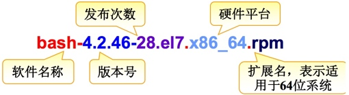

<!--more-->

# 1. 获取程序包的途径

 - 系统发行版的光盘或官方的服务器
	 - [ ] http://mirrors.aliyun.com
	 - [ ] http://mirrors.sohu.com
	 - [ ] http://mirrors.163.com

 - 项目官方站点
 - 第三方组织

	 - [ ] Fedora-EPEL（推荐）
		
	 - [ ] 搜索引擎：
	
		 - http://pkgs.org
		 - http://rpmfind.net
		 - http://rpm.pbone.net
	
 - 自己制作

# 2. 软件包管理器的职责

 - 将二进制程序，库文件，配置文件，帮助文件打包成一个文件；
 - 安装软件时按需将二进制文件，库文件，配置文件，帮助文件放到相应的位置；
 - 生成数据库，追踪所安装的每一个文件；
 - 软件卸载时根据安装时生成的数据库将对应的文件删除

# 3. 软件包管理器的核心功能

 - 制作软件包
 - 安装软件
 - 卸载软件
 - 升级软件
 - 查询软件
 - 校验软件

# 4. 软件包管理

 - 程序的组成清单（每个包独有）
	 - [ ] 文件清单
	 - [ ] 安装或卸载时运行的脚本
 - 数据库（公共）
	 - [ ] 程序包名称及版本
	 - [ ] 依赖关系
	 - [ ] 功能说明
	 - [ ] 安装生成的各文件的文件路径及校验码信息

# 5. 软件包分类

 - 二进制格式（编译好的，装上就可以用）
	 - [ ] rpm包作者下载源程序，编译配置完成后，制作成rpm包
	 - [ ] why would we do that? because：
		 - 有些特性是编译时选定的，如果编译时未选定此特性，将无法使用
		 - rpm包的版本会落后于源码包，甚至落后很多
 - 源码格式（需要编译，也叫定制）
	 - [ ] 命名方式：name-VERSION.tar.gz
		 - VERSION：major.minor.release

# 6. 软件包管理工具

 - 分类：
	 - [ ] 前端工具，常用的前端工具有以下这些：
		 - yum
		 - apt-get
		 - zypper (suse上的rpm前端管理工具)
		 - dnf（Fedora 22+ rpm前端管理工具）
	 - [ ] 后端工具，常用的后端工具有以下这些：
		 - rpm
		 - dpt
 - 注意：
	 - [ ] 前端工具是依赖于后端工具的
	 - [ ] 前端工具是为了自动解决后端工具的依赖关系而存在的

# 7. 软件安装方式

 - 通过前端工具安装
 - 通过后端工具安装
 - 编译安装

# 8. rpm包命名规范



 - 包的组成
	 - [ ] 主包：bind-9.7.1-1.el5.i586.rpm
	 - [ ] 子包：bind-libs-9.7.1-1.el5.i586.rpm bind-utils-9.7.1-1.el5.i586.rpm
 - 包名格式
	 - [ ] name-version-release-arch.rpm
		 - bind-major.minor.release-release.arch.rpm
 - 包名格式说明
	 - [ ] major（主版本号）：重大改进
	 - [ ] minor（次版本号）：某个子功能发生重大变化
	 - [ ] release（发行号）：修正了部分bug，调整了一点功能
 - 常见的arch
	 - [ ] x86：i386，i486，i586，i686
	 - [ ] x86_64：x64，x86_64，amd64
	 - [ ] 跟平台无关：noarch

# 9. rpm包管理

### 9.1 什么是rpm及其作用

 - rpm是Redhat Package Manager的简称，用于管理软件包。
 - rpm有一个强大的数据库/var/lib/rpm。
 - rpm的管理工作包括软件的安装、卸载、升级、查询、校验、重建
 - 数据库、验证软件包来源合法性等等。

### 9.2 RPM包安装

> 语法: rpm -ivh /PATH/TO/PACKAGE_FILE ... 
>
> 常用选项：
>
> -i: 安装
>
> -v: 显示详细信息
>
> -h: 显示安装进度条
>
> --test: 测试安装，但不真正执行安装过程
>
> --nodeps: 忽略依赖关系
>
> --replacepkgs: 重新安装，替换原有安装
>
> --oldpackage: 降级
>
> --force: 强行安装，可以实现重装或降级
>
> --nodigest: 不检查包的完整性
>
> --nosignature: 不检查包的来源合法性
>
> --noscripts: 不执行程序包脚本片断
>    
>
> %pre：安装前脚本    --nopre
>    
>
> %post：安装后脚本    --nopost
>    
>
> %preun：卸载前脚本    --nopreun
>    
>
> %postun：卸载后脚本    --nopostun


```
安装软件包, 需要指定软件包绝对路径
[root@wens5479 ~]# rpm -ivh tree-1.6.0-10.el7.x86_64.rpm
[root@wens5479 ~]# rpm -ivh vsftpd-3.0.2-22.el7.x86_64.rpm

在软件包所在目录下可以不指定绝对路径
[root@wens5479 ~]# cd /mnt/Packages/
[root@wens5479 Packages]# rpm -ivh zsh-5.0.2-28.el7.x86_64.rpm

测试一个软件包是否能在该系统上安装
[root@wens5479 ~]# rpm -ivh --test vsftpd-3.0.2-22.el7.x86_64.rpm

如果软件包存在, 强制再次安装
[root@wens5479 ~]# rpm -ivh --force tree-1.5.3-3.el6.x86_64.rpm

安装samba服务需要依赖其他组件, 使用--nodeps可重新强制安装
[root@wens5479 ~]# rpm -ivh --nodeps  tree-1.6.0-10.el7.x86_64.rpm
```

### 9.3 RPM包查询

```
rpm -q PACKAGE_NAME                 //查询指定的包是否已安装
rpm -qa                             //查询已经安装的所有包
rpm -qi PACKAGE_NAME                //查询指定包的说明信息
rpm -ql PACKAGE_NAME                //查询指定软件包安装后生成的文件列表
rpm -qf /path/to/somefile           //查询指定的文件是由哪个rpm包安装生成的
rpm -qc PACKAGE_NAME                //查询指定包安装的配置文件
rpm -qd PACKAGE_NAME                //查询指定包安装的帮助文件
rpm -q --scripts PACKAGE_NAME       //查询指定包中包含的脚本
rpm -q --whatprovides CAPABILITY    //查询指定的CAPABILITY（能力）由哪个包所提供
如：rpm -q --whatprovides /bin/cat
rpm -q --whatrequires CAPABILITY    //查询指定的CAPABILITY被哪个包所依赖
rpm -q --changelog COMMAND          //查询COMMAND的制作日志
rpm -q --scripts PACKAGE_NAME       //查询指定软件包包含的所有脚本文件
rpm -qR PACKAGE_NAME                //查询指定的软件包所依赖的CAPABILITY
rpm -q --provides PACKAGE_NAME      //列出指定软件包所提供的CAPABILITY
```

```
rpm -qpi /PATH/TO/PACKAGE_FILE      //查询指定未安装包的说明信息
rpm -qpl /PATH/TO/PACKAGE_FILE      //查询未安装的软件包会产生哪些文件

查询vsftpd这个rpm包是否安装
[root@wens5479 ~]# rpm -q vsftpd

模糊查找系统已安装的rpm包
[root@wens5479 ~]# rpm -qa |grep ftp

查询vsftpd软件包的相关信息
[root@wens5479 ~]# rpm -qi vsftpd

查询rpm包所安装的文件
[root@wens5479 ~]# rpm -ql vsftpd

查询rpm包相关的配置文件
[root@wens5479 ~]# rpm -qc vsftpd

查询配置文件或命令来自于哪个rpm包
[root@wens5479 ~]# rpm -qf /etc/vsftpd/vsftpd.conf
[root@wens5479 ~]# rpm -qf /usr/sbin/vsftpd


查询未安装的软件包会产生哪些文件
[root@wens5479 ~]# rpm -qlp samba-3.6.23-41.el6.x86_64.rpm

查询未安装的软件包会产生哪些文件
[root@wens5479 ~]# rpm -qip samba-3.6.23-41.el6.x86_64.rpm
```

### 9.4 RPM包升级

```
rpm -Uvh /PATH/TO/NEW_PACKAGE_FILE  //如果装有老版本的，则升级；否则，则安装
rpm -Fvh /PATH/TO/NEW_PACKAGE_FILE  //如果装有老版本的，则升级；否则，退出
--oldpackage：降级

[root@wenhs5479 ~]# rpm -Uvh tree-1.6.0-10.el7.x86_64.rpm
```

**升级注意事项：**

 - 不要对内核做升级操作
	 - [ ] Linux支持多内核版本并存，因此，可直接安装新版本内核
 - 如果原程序包的配置文件安装后曾被修改，升级时，新版本提供的同一个配置文件并不会直接覆盖老版本的配置文件，而把新版本的文件重命名（FILENAME.rpmnew）后保留

### 9.5 RPM包卸载

```
语法：rpm -e PACKAGE_NAME

先查询, 然后卸载 
[root@wenhs5479 ~]# rpm -qa |grep vsftpd
[root@wenhs5479 ~]# rpm -e vsftpd

**注意：**如果其他包依赖于要卸载的包，这个被依赖的包是无法卸载的，除非强制卸载，强制卸载后依赖于这个包的其他程序将无法正常工作
```

### 9.6 RPM包校验

```
如果执行以下命令无内容输出说明此包未被修改过
[root@localhost ~]# rpm -V vsftpd
S.5....T.  c /etc/pam.d/vsftpd
.......T.  c /etc/vsftpd/ftpusers
S.5....T.  c /etc/vsftpd/vsftpd.conf
.M.......    /var/ftp/pub

S   //文件的容量大小是否被改变
M   //文件的类型或者文件的属性是否被修改
5   //MD5这一种指纹加密的内容已经不同
D   //装置的主/次代码已经改变
L   //路径已经被改变
U   //文件的所属主已被修改
G   //文件的所属组已被修改
T   //文件的创建时间已被改变
```

### 9.7 RPM重建数据库

**数据库信息在/var/lib/rpm目录中**

```
rpm --rebuilddb     //重建数据库，一定会重新建立
rpm --initdb        //初始化数据库，没有才建立，有就不用建立
```

### 9.8 检查软件包来源合法性和完整性

```
加密类型：
对称加密    //加密解密使用同一个密钥
公钥加密    //一对密钥，公钥和私钥。公钥隐含于私钥中，可以提取出来并公布出去
单向加密    //只能加密不能解密

/etc/pki/rpm-gpg/RPM-GPG-KEY-redhat-release     //红帽官方公钥

rpm -K PACKAGE_FILE     //检查指定包有无密钥信息
dsa，gpg            //验证来源合法性，也即验证签名。可以使用--nosignatrue略过此项
sha1，md5           //验证软件包完整性。可以使用--nodigest略过此项
rpm --import /etc/pki/rpm-gpg/RPM-GPG-KEY-redhat-release    //导入密钥文件
CentOS 7发行版光盘提供的密钥文件    //RPM-GPG-KEY-CentOS-7
```