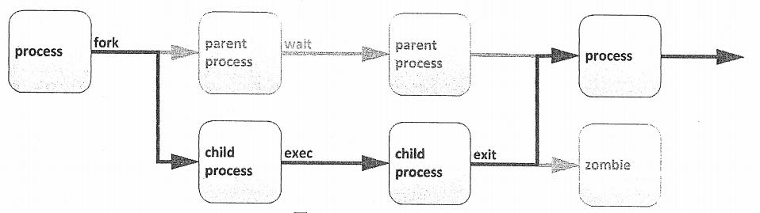

<!--more-->

# 1. 进程基本概述

**进程是已启动的可执行程序的运行中实例。**

`/proc`目录下以数字为名的目录，每一个目录代表一个进程，保存着进程的属性信息。每一个进程的`PID`是唯一的，就算进程退出了，其它进程也`不会占用`其PID。

## 1.1 进程的组成部分

 - 已分配内存的地址空间
 - 安全属性，包括所有权凭据和特权
 - 程序代码的一个或多个执行线程
 - 进程状态

## 1.2 进程的环境

 - 本地和全局变量
 - 当前调度上下文
 - 分配的系统资源，如文件描述符和网络端口

## 1.3 进程的产生

 - [ ] 现有的（父）进程复制自己的地址空间（fork）来创建一个新的（子）进程结构。
 - [ ] 每个新进程分配有一个唯一的进程ID（PID），满足跟踪和安全性之需。PID与父进程ID（PPID）是新进程环境的元素。
 - [ ] 任何进程可创建子进程。所有进程都是第一个系统进程的后代。RHEL7上，第一个系统进程是systemd。



通过fork例程，`子进程继承安全性身份`、`过去和当前的文件描述符`、`端口和资源特权`、`环境变量`，以及`程序代码`。随后，子进程可能exec其自己的程序代码。通常，父进程在子进程运行期间处于`睡眠状态`，设置一个在子进程完成时发出信号的请求（wait）。在退出时，子进程可能已经关闭或丢弃了其资源和环境，剩余的部分被称作`僵停`。父进程在子进程退出时收到信号而被唤醒，清理剩余结构，然后继续执行其自己的程序代码。

## 1.4 进程的分类

 - **前台进程**：与终端相关的进程，通过终端启动的进程

`注意：也可把在前台启动的进程送往后台，以守护模式运行`

 - **守护进程**：*daemon*，与终端无关的进程（如内核），在系统引导过程中启动的进程

# 2. 进程状态


```
Excuting                    //运行态 
Ready                       //就绪态，也可以称作睡眠态
    Uninterruptible sleep   //不可中断的睡眠。不可随时唤醒，只有当IO资源加载成功后才能唤醒
    Interruptible sleep     //可中断的睡眠。可随时唤醒
Zombie                      //僵尸进程。正常运行结束了，但是不释放占据的内存
Stopped                     //停止态，暂停于内存中，但不会被调度，除非手动启动之
```

**进程睡眠的原因：**

`当一个执行中的进程，需要加载额外的IO资源的时候，由于IO设备的速度太慢，所以会转入睡眠状态等待，交出CPU给其他进程，以免浪费剩余执行时间`

在多任务处理操作系统中，每个CPU（或CPU核心）在一个时间点上处理一个进程。在进程运行时，它对CPU时间和资源分配的直接要求会有变化。进程分配有一个状态，它随着环境要求而改变。

**Linux进程状态**

| 标志 | 内核定义的状态名称和描述                                     |
| ---- | ------------------------------------------------------------ |
| R    | TASK_RUNNING：进程正在CPU上执行，或者正在等待运行。处于运行中（或可运行）状态时，进程可能正在执行用户例程或内核例程（系统调用），或者已排队并就绪 |
| S    | TASK_INTERRUPTIBLE：进程处于睡眠状态且正在等待某一条件：硬件请求、系统资源访问或信号。当事件或信号满足该条件时，该进程将返回到运行中 |
| D    | TASK_UNINTERRUPTIBLE：此进程也在睡眠，但与S状态不同，不会响应传递的信号。仅在特定的条件下使用，其中进程中断可能会导致意外的设备状态 |
| K    | TASK_KILLABLE：进程处于睡眠状态，与不可中断的D状态相同，但有所修改，允许等待中的任务通过响应信号而被中断（彻底退出）。实用程序通常将可中断的进程显示为D状态 |
| T    | TASK_STOPPED：进程已被停止（暂停），通常是通过用户或其他进程发出的信号。进程可以通过另一信号返回到运行中状态，继续执行（恢复） |
| T    | TASK_TRACED：正在被调试的进程也会临时停止，并且共享同一个T状态标志 |
| Z    | EXIT_ZOMBIE：子进程在退出时向父进程发出信号。除进程身份（PID）之外的所有资源都已释放 |
| X    | EXIT_DEAD：当父进程清理（获取）剩余的子进程结构时，进程现在已彻底释放。此状态从不会在进程列出实用程序中看到 |
| <    | 高优先级进程                                                 |
| N    | 低优先级进程                                                 |
| +    | 前台进程组中的进程                                           |
| \|   | 多线程进程                                                   |
| s    | 会话进程首进程                                               |

# 3. 进程优先级

## 3.1 linux进程调度与多任务

现代计算机系统中既包含每次只能执行一个指令的低端处理器，也包含高性能超级计算机，这些超级计算机每台配备数百个CPU，每个CPU上具有多个核心，它们可以并行执行数以百计的指令。但是所有这些系统往往具有一个共同点：`它们需要运行的进程数量总是超出实际具有的核心数`。

通过`时间分片技术`，Linux（和其他操作系统）实际能够运行的进程数（和线程数）可以超出可用的实际处理单元数。`操作系统进程调度程序将在单个核心上的进程之间进行快速切换`，从而给用户一种有多个进程在同时运行的印象。

执行此切换的Linux内核部分称为`进程调度程序`。

## 3.2 进程优先级

 - **进程优先级范围**：

- 0-139，数字越小，优先级越高
- 0-99：实时优先级，内核调整
- 100-139：静态优先级，用户可控制
- 进程优先级高的特点：
- 获得更多的CPU运行时间
- 更优先获得CPU运行的机会

要修改进程的优先级可以通过调整进程的nice值来实现，`nice值越小`，`优先级越高`：
nice值的范围是`（-20，19），-20对应100，19对应139`

## 3.3 相对优先级

由于不是每种进程都与其他进程同样重要，可告知调度程序为不同的进程使用不同的调度策略。常规系统上运行的大多数进程所使用的调度策略称为```SCHED_OTHER```(也称为``SCHED_NORMAL``)，但还有一些其他策略可用于不同的目的。

由于并非所有进程都以同样的方式创建，可为采用`SCHED_NORMAL`策略运行的进程指定相对优先级。此优先级称为进程的`nice`值。一个进程可以有40种不同级别的`nice`值。

这些`nice`级别的范围是从-20到19。默认情况下，进程将继承其父进程的`nice`级别，通常为0

>` nice`级别越高，表示优先级越低（该进程容易将其CPU使用量让给其他进程） `nice`级别越低，表示优先级越高（该进程更加不倾向于让出CPU）
> 如果不存在资源争用（例如当活动进程数少于可用CPU核心数时），即使`nice`级别高的进程也将仍使用它们可使用的所有可用CPU资源。但当请求CPU时间的进程数超过可用核心数时，`nice`级别较高的进程将比`nice`级别较低的进程收到更少的CPU时间

## 3.4 nice级别与权限

为很占CPU资源的进程设置较低的`nice`级别可能会对同一系统上运行的其他进程的性能造成负面影响，所以仅允许root用户设置负`nice`级别以及降低现有进程的`nice`级别。

普通非特权用户仅允许设置正的`nice`级别。只能对现有进程提升`nice`级别，而不能降低`nice`级别。

## 3.5 进程优先级调整

 - **进程优先级调整**：调整nice值

> 调整已经启动的进程的nice值：
>     renice NI PID

```
[root@wenhs5479 ~]# renice 5 87579
87579 (进程 ID) 旧优先级为 0，新优先级为 5
```

> 在启动时指定nice值：（-20，19）
>     nice -n NI COMMAND
> 

```
[root@wenhs5479 ~]# nice -n 10 vim 1
------------------------------------------------------------------------------------------------------
[root@wenhs5479 ~]# ps -elF|grep vim
4 S root      87609  86130  0  90  10 - 37949 poll_s  5344   1 19:13 pts/1    00:00:00 vim 1
0 S root      87621  87527  0  80   0 - 28181 pipe_w   988   0 19:14 pts/0    00:00:00 grep --color=auto vim
```

# 4. 进程管理命令

Linux系统各进程的相关信息均保存在`/proc/PID`目录下的各文件中

## 4.1 ps

`ps(process state)`命令用于列出当前的进程。可以显示详细的进程信息，包括：

 - 用户识别符（UID）
 - 它确定进程的特权
 - 唯一进程识别符（PID）
 - CPU和已经花费的实时时间
 - 进程在各种位置上分配的内存数量
 - 进程的位置STDOUT，称为控制终端
 - 当前的进程状态

**ps支持三种选项格式：**

 - UNIX（POSIX）选项，可以分组但必须以连字符开头

 - BSD 选项，可以分组但不可与连字符同用
 - GNU 长选项，以双连字符开头

**ps(process state)，显示进程信息。注意事项**：

 - 加了［］中括号的，表示内核线程，通常位于顶部

 - `exiting`或`defunct`表示僵尸进程

>常用选项：
>
>a    ------   //显示所有与终端有关的进程
>
>u   ------    //显示进程是由哪个用户启动的
>
>x   ------   //显示所有与终端无关的进程
>
>-e     ------ //显示所有进程，与-A效果相同
>
>-l    ------  //以长格式显示
>
>-F   ------   //显示更详细的完整格式的进程信息
>
>-f     ------ //显示更详细的完整格式的进程信息
>
>-H   ------   //以进程层级格式显示进程相关信息
>
>-o    ------  //根据自己的需要选择要显示的字段

```
[root@wenhs5479 ~]# ps -o pid,comm,ni			//表示只显示进程号，命令，nice值三个字段
PID COMMAND          NI
86130 bash              0
87717 ps                0
```

>aux结果解析：
>
>VSZ -----    //Virtual memory SiZe，虚拟内存集
>
>RSS  -----   //ReSident Size，常驻内存集
>
>STAT   ----- //进程状态
>
>TIME   ----- //运行时的累积时长

```
[root@wenhs5479 ~]# ps -aux
USER        PID %CPU %MEM    VSZ   RSS TTY      STAT START   TIME COMMAND
root          1  0.0  0.3 193984  7048 ?        Ss   14:25   0:03 /usr/lib/
root          2  0.0  0.0      0     0 ?        S    14:25   0:00 [kthreadd
.......
```

>ps命令结果解析：
>
>NI  -----    //nice值
>
>PRI  -----   //优先级
>
>PSR   -----  //进程运行在哪个CPU核心上
>
>RTPTRIO----- //实时优先级
>
>C   -----    //运行的CPU编号
>
>STIME  ----- //进程的启动时间
>
>VSZ   -----  //Virtual memory SiZe，虚拟内存集
>
>RSS   -----  //ReSident Size，常驻内存集
>
>STAT   ----- //进程状态
>
>TIME   ----- //运行时的累积时长

```
[root@wenhs5479 ~]# ps -elF
F S UID         PID   PPID  C PRI  NI ADDR SZ WCHAN    RSS PSR STIME TTY          TIME CMD
4 S root          1      0  0  80   0 - 48496 ep_pol  7048   1 14:25 ?        00:00:03 /usr/lib/systemd/systemd --switched-root --system --deserialize 22
1 S root          2      0  0  80   0 -     0 kthrea     0   0 14:25 ?        00:00:00 [kthreadd]
.........
```

## 4.2 pstree

**pstree用于显示当前系统上的进程树**

```
[root@wenhs5479 ~]# pstree
systemd─┬─ModemManager───2*[{ModemManager}]
        ├─NetworkManager─┬─dhclient
        │                └─2*[{NetworkManager}]
        ├─VGAuthService
        ├─abrt-watch-log
        ├─abrtd
        ├─accounts-daemon───2*[{accounts-daemon}]
        ├─at-spi-bus-laun─┬─dbus-daemon───{dbus-daemon}
        │                 └─3*[{at-spi-bus-laun}]
        ├─at-spi2-registr───2*[{at-spi2-registr}]
        ├─atd
        ├─auditd─┬─audispd─┬─sedispatch
        │        │         └─{audispd}
        │        └─{auditd}
        ├─avahi-daemon───avahi-daemon
        ├─boltd───2*[{boltd}]
        ├─chronyd
        ├─colord───2*[{colord}]
        ├─crond
        ├─cupsd
        ├─2*[dbus-daemon───{dbus-daemon}]
        ├─dbus-launch
        ├─dconf-service───2*[{dconf-service}]
        ├─dnsmasq───dnsmasq
        ├─escd───{escd}
        ├─evolution-addre─┬─evolution-addre───5*[{evolution-addre}]
        │                 └─4*[{evolution-addre}]
        ├─evolution-calen─┬─evolution-calen───8*[{evolution-calen}]
        │                 └─4*[{evolution-calen}]
        ├─evolution-sourc───3*[{evolution-sourc}]
        ├─firewalld───{firewalld}
        ├─fwupd───4*[{fwupd}]
        ├─gdm─┬─X───3*[{X}]
        │     ├─gdm-session-wor─┬─gnome-session-b─┬─abrt-applet───2*[{abrt-applet}]
        │     │                 │                 ├─gnome-shell─┬─ibus-daemon─┬─ibus-dconf───3*[{ibus-dconf}]
        │     │                 │                 │             │             ├─ibus-engine-sim───2*[{ibus-engine-sim}]
        │     │                 │                 │             │             └─2*[{ibus-daemon}]
        │     │                 │                 │             └─14*[{gnome-shell}]
        │     │                 │                 ├─gnome-software───3*[{gnome-software}]
        │     │                 │                 ├─gsd-a11y-settin───3*[{gsd-a11y-settin}]
        │     │                 │                 ├─gsd-account───3*[{gsd-account}]
        │     │                 │                 ├─gsd-clipboard───2*[{gsd-clipboard}]
        │     │                 │                 ├─gsd-color───3*[{gsd-color}]
        │     │                 │                 ├─gsd-datetime───3*[{gsd-datetime}]
        │     │                 │                 ├─gsd-disk-utilit───2*[{gsd-disk-utilit}]
        │     │                 │                 ├─gsd-housekeepin───3*[{gsd-housekeepin}]
        │     │                 │                 ├─gsd-keyboard───3*[{gsd-keyboard}]
        │     │                 │                 ├─gsd-media-keys───3*[{gsd-media-keys}]
        │     │                 │                 ├─gsd-mouse───3*[{gsd-mouse}]
        │     │                 │                 ├─gsd-power───3*[{gsd-power}]
        │     │                 │                 ├─gsd-print-notif───2*[{gsd-print-notif}]
        │     │                 │                 ├─gsd-rfkill───2*[{gsd-rfkill}]
        │     │                 │                 ├─gsd-screensaver───2*[{gsd-screensaver}]
        │     │                 │                 ├─gsd-sharing───3*[{gsd-sharing}]
        │     │                 │                 ├─gsd-smartcard───5*[{gsd-smartcard}]
        │     │                 │                 ├─gsd-sound───3*[{gsd-sound}]
        │     │                 │                 ├─gsd-wacom───2*[{gsd-wacom}]
        │     │                 │                 ├─gsd-xsettings───3*[{gsd-xsettings}]
        │     │                 │                 ├─nautilus-deskto───3*[{nautilus-deskto}]
        │     │                 │                 ├─seapplet
        │     │                 │                 ├─ssh-agent
        │     │                 │                 ├─tracker-extract───13*[{tracker-extract}]
        │     │                 │                 ├─tracker-miner-a───3*[{tracker-miner-a}]
        │     │                 │                 ├─tracker-miner-f───3*[{tracker-miner-f}]
        │     │                 │                 ├─tracker-miner-u───3*[{tracker-miner-u}]
        │     │                 │                 └─3*[{gnome-session-b}]
        │     │                 └─2*[{gdm-session-wor}]
        │     └─3*[{gdm}]
        ├─geoclue───2*[{geoclue}]
        ├─gnome-keyring-d───3*[{gnome-keyring-d}]
        ├─gnome-shell-cal───5*[{gnome-shell-cal}]
        ├─goa-daemon───4*[{goa-daemon}]
        ├─goa-identity-se───3*[{goa-identity-se}]
        ├─gsd-printer───2*[{gsd-printer}]
        ├─gssproxy───5*[{gssproxy}]
        ├─gvfs-afc-volume───3*[{gvfs-afc-volume}]
        ├─gvfs-goa-volume───2*[{gvfs-goa-volume}]
        ├─gvfs-gphoto2-vo───2*[{gvfs-gphoto2-vo}]
        ├─gvfs-mtp-volume───2*[{gvfs-mtp-volume}]
        ├─gvfs-udisks2-vo───2*[{gvfs-udisks2-vo}]
        ├─gvfsd─┬─gvfsd-trash───2*[{gvfsd-trash}]
        │       └─2*[{gvfsd}]
        ├─gvfsd-fuse───5*[{gvfsd-fuse}]
        ├─gvfsd-metadata───2*[{gvfsd-metadata}]
        ├─ibus-daemon─┬─ibus-dconf───3*[{ibus-dconf}]
        │             └─2*[{ibus-daemon}]
        ├─ibus-portal───2*[{ibus-portal}]
        ├─2*[ibus-x11───2*[{ibus-x11}]]
        ├─irqbalance
        ├─ksmtuned───sleep
        ├─libvirtd───16*[{libvirtd}]
        ├─lsmd
        ├─lvmetad
        ├─master───qmgr
        ├─mcelog
        ├─mission-control───3*[{mission-control}]
        ├─packagekitd───2*[{packagekitd}]
        ├─pcscd───3*[{pcscd}]
        ├─polkitd───6*[{polkitd}]
        ├─pulseaudio───{pulseaudio}
        ├─rngd
        ├─rpcbind
        ├─rsyslogd───2*[{rsyslogd}]
        ├─rtkit-daemon───2*[{rtkit-daemon}]
        ├─smartd
        ├─sshd───sshd─┬─bash───pstree
        │             └─bash
        ├─systemd-journal
        ├─systemd-logind
        ├─systemd-udevd
        ├─tracker-store───7*[{tracker-store}]
        ├─tuned───4*[{tuned}]
        ├─udisksd───4*[{udisksd}]
        ├─upowerd───2*[{upowerd}]
        ├─vmtoolsd───{vmtoolsd}
        ├─vmtoolsd───2*[{vmtoolsd}]
        ├─wpa_supplicant
        └─xdg-permission-───2*[{xdg-permission-}]
```

## 4.3 pgrep

**以grep风格指定只显示哪些进程，在当前系统中找符合某些特性的进程。只显示进程号**

```
[root@wenhs5479 ~]# pgrep atd
6741
[root@wenhs5479 ~]# pgrep sshd
6718
86118
[root@wenhs5479 ~]# ps -ef|grep sshd
root       6718      1  0 14:26 ?        00:00:00 /usr/sbin/sshd -D
root      86118   6718  0 17:56 ?        00:00:00 sshd: root@pts/1,pts/0
root      87945  86130  0 19:29 pts/1    00:00:00 grep --color=auto sshd
```

## 4.4 pidof

**根据进程名查找其PID号**

```
[root@wenhs5479 ~]# pidof sshd
86118 6718
[root@wenhs5479 ~]# pidof atd
6741
```

## 4.5 vmstat

**虚拟内存状态查看命令**

```
用法：
vmstat [options] [延迟[count]]

选项：
-a， --active			非活动内存
-f， --forks  	启动以来分叉的数量
-m， --slabs 		slabinfo
-n， --one-header		不重新显示标题
-s， -  stats		事件计数器统计信息
-d，  --disk  	磁盘统计信息
-D， -  disk-sum		汇总磁盘统计信息
-p， -  partition <dev>		分区特定统计信息
-S， -  unit <char>		定义显示单位
-w， --wide 			宽输出
-t， -  timestamp		显示时间戳

-h， -  help		显示此帮助并退出
-V， -  version		输出版本信息并退出

**示例**

[root@wenhs5479 ~]# vmstat 2					表示每2秒刷新一次
procs -----------memory---------- ---swap-- -----io---- -system-- ------cpu-----
r  b   swpd   free   buff  cache   si   so    bi    bo   in   cs us sy id wa st
1  0    520 102648   2104 971616    0    0    30     7   52   99  0  0 99  0  0

0  0    520 102648   2104 971616    0    0     0     0  102  190  0  0 100  0  0
0  0    520 102648   2104 971616    0    0     0     0  103  185  0  0 100  0  0
0  0    520 102648   2104 971616    0    0     0     0  101  187  0  0 100  0  0
^C					终止掉
[root@wenhs5479 ~]# vmstat 2 5			表示每2秒刷新一次，刷新5次后退出
procs -----------memory---------- ---swap-- -----io---- -system-- ------cpu-----
r  b   swpd   free   buff  cache   si   so    bi    bo   in   cs us sy id wa st
1  0    520 102632   2104 971616    0    0    30     7   52   99  0  0 99  0  0
0  0    520 102648   2104 971616    0    0     0     0  100  183  0  0 100  0  0
0  0    520 102648   2104 971616    0    0     0     0   87  173  0  0 100  0  0
1  0    520 102648   2104 971616    0    0     0     0  108  192  0  0 100  0  0
1  0    520 102648   2104 971616    0    0     0     0  108  188  0  0 100  0  0
[root@wenhs5479 ~]# 
```


**常用的选项：**
` -s`        	  //显示内存的统计数据

```
[root@wenhs5479 ~]# vmstat
procs -----------memory---------- ---swap-- -----io---- -system-- ------cpu-----
r  b   swpd   free   buff  cache   si   so    bi    bo   in   cs us sy id wa st
2  0    520 102624   2104 971616    0    0    30     7   51   99  0  0 99  0  0
[root@wenhs5479 ~]# 
```

> **procs：**
>
> `r（running）`  //表示等待运行的队列长度，也即等待运行的进程的个数
>
> `b（block）`    //表示阻塞队列长度，也即处于不可中断睡眠态的进程个数 **memory：**
>
> `swpd`        //交换内存的使用总量
>
> `free`       //空闲物理内存总量
>
> `buffer`      //用于buffer的内存总量
>
> `cache`       //用于cache的内存总量 swap：
>
> `si（swap in）`     //表示从物理内存有多少页面换进swap，也即数据进入swap的数据速率（kb/s）
>
> `so（swap out）`    //表示从swap有多少页面换进物理内存，也即数据离开swap的数据速率（kb/s） io：
>
> `bi（block in）`    //表示磁盘块有多少个被调入内存中，也即从块设备读入数据到系统的速率（kb/s）
>
> `bo（block out）`   //表示有多少个磁盘块从内存中被同步到硬盘上去了，也即保存数据至块设备的速率（kb/s） system：
>
> `in（ interrupts）`     //表示中断的个数，也即中断速率（kb/s）
>
> `cs（context switch）`  //表示上下文切换的次数，也即进程切换速率（kb/s） **CPU：**
>
> `us`      //表示用户空间
>
> `sy`     //表示内核空间
>
> `id`    //表示空闲百分比
>
> `wa`      //表示等待IO完成所占据的时间百分比
>
> `st`    //表示steal，被虚拟化技术偷走的时间（比如运行虚拟机）

# 5. 控制作业

## 5.1 作业与会话

作业控制是`shell`的一种功能，它允许单个`shell`实例运行和管理多个命令。


作业与在`shell`提示符中输入的每个管道相关联。该管道中的所有进程均是作业的一部分，并且是同一个进程组的成员。（如果在`shell`提示符中仅输入了一条命令，则这条命令可视为命令的最小管道。该命令将是该作业的唯一成员）


一次只能有一个作业从特定终端窗口读取输入和键盘生成的信号。属于该作业的进程是该控制终端的前台进程。

该控制终端的后台进程是与该终端相关联的任何其他作业的成员。终端的后台进程无法从终端读取输入或接收键盘生成的中断，但可以写入终端。后台中的作业可能已停止（暂停），也可能正在运行。如果某个正在运行的后台作业尝试从终端读取内容，则该作业将自动暂停。

每个终端是其自身的会话，并且可以具有一个前台进程和多个独立的后台进程。一个作业只能属于一个会话，也就是属于其控制终端的会话。

## 5.2 作业分类

Linux作业分为前台作业与后台作业两种。其各自的特点如下：

**前台作业**：通过终端启动，且启动后一直占据了命令提示符

**后台作业**：可以通过终端启动，但启动之后，释放命令提示符，后续的操作在后台完成

此类作业虽然被送往后台运行，但其依然与终端相关。如果希望送往后台后，剥离与终端的关系需要执行（`nohup COMMAND &`）

## 5.3 在后台运行作业

在命令后跟上`&`符号可以生成一个后台作业

```
[root@wenhs5479 ~]# sleep 1000 &
[1] 88234
```

`jobs`命令用于显示当前所有的后台作业

```
[root@wenhs5479 ~]# jobs
[1]+  运行中               sleep 1000 &
```

`fg`命令用于将后台作业调至前台运行

```
[root@wenhs5479 ~]# fg
sleep 1000
...
```

当只有一个后台作业时，直接使用`fg`命令，不跟任何参数即可将后台作业调至前台运行，但是当有多个作业时则必须跟上`%+`作业号，也就是上面命令执行结果中以[]括起来的数字。

```
[root@wenhs5479 ~]# jobs
[1]-  运行中               sleep 1000 &
[2]+  运行中               sleep 2000 &
[root@wenhs5479 ~]# fg %2
sleep 2000
...
```

使用ctrl+z可将前台进程发送到后台，此时作业将处于停止状态

```
[root@wenhs5479 ~]# fg %2
sleep 2000
^Z
[2]+  已停止               sleep 2000
[root@wenhs5479 ~]#
```

使用`bg`命令+作业号可使后台已停止的作业重新运行

```
[root@wenhs5479 ~]# jobs 
[1]-  运行中               sleep 1000 &
[2]+  已停止               sleep 2000
[root@wenhs5479 ~]# bg		只有一个停止的情况下不用带%2
[2]+ sleep 2000 &
[root@wenhs5479 ~]# jobs 
[1]-  运行中               sleep 1000 &
[2]+  运行中               sleep 2000 &
```

`kill`加上作业号可以手动杀死指定作业

```
[root@wenhs5479 ~]# kill %1
[1]-  已终止               sleep 1000
[root@wenhs5479 ~]# jobs
[2]+  运行中               sleep 2000 &
[root@wenhs5479 ~]#
```

>`jobs`命令的结果中
>
>`+`     //命令将默认操作的作业   
>`-`     //命令将第二个默认操作的作业

# 6. 进程间通信
**进程间通信（IPC：Inter Process Communication）**

**进程间通信方式：**

- 同一主机
  - 共享内存
  - 信号：Signal
- 不同主机
  - rpc：remote procecure call
  - 基于socket实现进程间通信

# 7. 使用信号控制进程

信号是传递至进程的软件中断。信号向执行中的程序报告事件。生成信号的事件可以是错误或外部事件（如I/O请求或计时器过期），或者来自于明确请求（如使用信号发送命令）

下表列出了系统管理员用于日常进程管理的基本信号。请通过短名称（HUP）或正确名称（SIGHUP）指代信号。

指定一个信号的方法：

- 信号号码（数字标识）：`kill -1`
- 信号完整名称：`kill -SIGKILL`
- 信号简写名称：`kill -TERM`或`kill -KILL`或`kill -INT`或`kill -HUP`

**基本进程管理信号**

| 信号编号ID | 短名称 | 定义           | 用途                                                         |
| ---------- | ------ | -------------- | ------------------------------------------------------------ |
| 1          | HUP    | 挂起           | 让一个进程不用重启就可以重读配置文件，并让新的配置信息生效   |
| 2          | INT    | 键盘中断       | 中断一个前台进程。ctrl+c就是用的SIGINT信号                   |
| 9          | KILL   | 中断，无法拦截 | 导致立即终止程序。无法被拦截、忽略或处理                     |
| 15默认值   | TERM   | 终止           | 导致程序终止。和SIGKILL不同，可以被拦截、忽略或处理。要求程序终止的友好方式，允许自我清理 |

**用户可以中断自己的进程，但只有root才能终止由其他人拥有的进程。**

`kill`命令根据ID向进程发送信号。虽其名称为kill，但该命令可用于发送任何信号，而不仅仅是终止程序的信号

**语法： kill [-SIGNAL] PID ...**

显示所有可用的信号（可使用man 7 signal查看帮助信息）

```
[root@wenhs5479 ~]# kill -l
1) SIGHUP	 2) SIGINT	 3) SIGQUIT	 4) SIGILL	 5) SIGTRAP
6) SIGABRT	 7) SIGBUS	 8) SIGFPE	 9) SIGKILL	10) SIGUSR1
11) SIGSEGV	12) SIGUSR2	13) SIGPIPE	14) SIGALRM	15) SIGTERM
16) SIGSTKFLT	17) SIGCHLD	18) SIGCONT	19) SIGSTOP	20) SIGTSTP
21) SIGTTIN	22) SIGTTOU	23) SIGURG	24) SIGXCPU	25) SIGXFSZ
26) SIGVTALRM	27) SIGPROF	28) SIGWINCH	29) SIGIO	30) SIGPWR
31) SIGSYS	34) SIGRTMIN	35) SIGRTMIN+1	36) SIGRTMIN+2	37) SIGRTMIN+3
38) SIGRTMIN+4	39) SIGRTMIN+5	40) SIGRTMIN+6	41) SIGRTMIN+7	42) SIGRTMIN+8
43) SIGRTMIN+9	44) SIGRTMIN+10	45) SIGRTMIN+11	46) SIGRTMIN+12	47) SIGRTMIN+13
48) SIGRTMIN+14	49) SIGRTMIN+15	50) SIGRTMAX-14	51) SIGRTMAX-13	52) SIGRTMAX-12
53) SIGRTMAX-11	54) SIGRTMAX-10	55) SIGRTMAX-9	56) SIGRTMAX-8	57) SIGRTMAX-7
58) SIGRTMAX-6	59) SIGRTMAX-5	60) SIGRTMAX-4	61) SIGRTMAX-3	62) SIGRTMAX-2
63) SIGRTMAX-1	64) SIGRTMAX
```


`killall COMMAND`：**killall后面跟进程名，表示将匹配到的以进程名为名的进程全部杀死**

```
[root@wenhs5479 ~]# ps -ef |grep sleep
root      88261  86130  0 19:53 pts/1    00:00:00 sleep 2000
root      88584   6321  0 20:05 ?        00:00:00 sleep 60
root      88587  86130  0 20:06 pts/1    00:00:00 grep --color=auto sleep
[root@wenhs5479 ~]# killall sleep
[2]+  已终止               sleep 2000
[root@wenhs5479 ~]# ps -ef |grep sleep
root      88604   6321  0 20:06 ?        00:00:00 sleep 60
root      88606  86130  0 20:06 pts/1    00:00:00 grep --color=auto sleep
[root@wenhs5479 ~]# 
```

# 8. 监控进程活动
## 8.1 IO负载
负载平均值代表一段时间内感知的系统负载。Linux通过预期服务等待时间的表示来实施平均负载计算。

Linux不仅计算进程数，也作为独立的任务计算线程数。运行中线程和等待I/O资源的线程的CPU请求队列对应于R和D进程状态。等待I/O包括处于睡眠而等待预期磁盘和网络响应的任务。

负载数属于全局计数器计算，是所有CPU的总和数。由于从睡眠返回的任务可能会重新调度到不同的CPU，难以精确的每CPU计数，但累计数的准确度可以保障。显示的平均负载代表所有的CPU。

**查看cpu核心数**

```
[root@wenhs5479 ~]# grep 'model name' /proc/cpuinfo
model name	: Intel(R) Core(TM) i7-7700HQ CPU @ 2.80GHz
model name	: Intel(R) Core(TM) i7-7700HQ CPU @ 2.80GHz
[root@wenhs5479 ~]#
```

一些UNIX系统仅考虑CPU使用率或运行队列长度来指示系统负载。由于具有空闲CPU的系统可能会因为磁盘或网络资源忙而遇到很长时间的等待，因此Linux负载平均值中包含了对I/O的考量。遇到负载平均值很高但CPU活动很低时，请检查磁盘和网络活动。

Linux中可以使用`top`、`uptime`显示负载平均值的情况。

```
[root@wenhs5479 ~]# uptime 
20:09:36 up  5:43,  3 users,  load average: 0.06, 0.03, 0.05
```

此处的`load average`就表示负载平均值，这三个值代表最近1、5和15分钟的负载情况。

将显示的负载平均值除以系统中的逻辑CPU数。当值低于1表示资源利用率较好，等待时间很短。当值高于1表示资源饱和，而且有一定的服务等待时间。

空闲CPU队列的负载数为0。每个就绪和等待的线程使计数增加1。总队列数为1时，资源（CPU、磁盘或网络）正在使用中，但没有请求把时间花在等待上。增加的请求数会累积该计数，但由于许多请求可以在时限内处理，资源使用率会很高，而等待时间则不会。

因为磁盘或网络资源忙碌等待I/O而处于睡眠的进程包含在该计数内，而且使负载平均值增大。虽然不能表示CPU使用率，队列数依然表明用户和程序正在等待资源服务。

在资源饱和前，平均负载将保持在1以下，因为几乎不会在队列中发现等待的任务。只有资源饱和导致请求留在排队状态并且被负载计算例程计数时，负载平均才会增大。当资源使用率接近100%时，每个增加的请求将开始遭遇服务等待时间。

## 8.2 实时进程监控
**top用于实现全屏动态显示系统信息**

>常用选项：
>
>-d    --------  //设置延迟时长，top -d 1表示每隔1秒刷新一次，默认每隔5秒刷新
>
>-b   --------   //批模式翻屏显示，默认只实时显示一屏，若要显示后面的进程信息则可使用-b选项，与-n #合用，可指定显示翻#屏


```
[root@wenhs5479 ~]# top -b -n 1
top - 20:11:24 up  5:45,  3 users,  load average: 0.01, 0.02, 0.05
Tasks: 212 total,   1 running, 211 sleeping,   0 stopped,   0 zombie
%Cpu(s):  0.0 us,  7.9 sy,  0.0 ni, 92.1 id,  0.0 wa,  0.0 hi,  0.0 si,  0.0 st
KiB Mem :  1863252 total,   176968 free,   789680 used,   896604 buff/cache
KiB Swap:  1572860 total,  1572084 free,      776 used.   722344 avail Mem 

PID USER      PR  NI    VIRT    RES    SHR S  %CPU %MEM     TIME+ COMMAND
1 root      20   0  193984   7048   4212 S   0.0  0.4   0:03.34 systemd
2 root      20   0       0      0      0 S   0.0  0.0   0:00.02 kthreadd
3 root      20   0       0      0      0 S   0.0  0.0   0:00.43 ksoftirqd/0
5 root       0 -20       0      0      0 S   0.0  0.0   0:00.00 kworker/0:0H
7 root      rt   0       0      0      0 S   0.0  0.0   0:00.06 migration/0
8 root      20   0       0      0      0 S   0.0  0.0   0:00.00 rcu_bh
9 root      20   0       0      0      0 S   0.0  0.0   0:03.81 rcu_sched
10 root       0 -20       0      0      0 S   0.0  0.0   0:00.00 lru-add-drain
11 root      rt   0       0      0      0 S   0.0  0.0   0:00.81 watchdog/0
12 root      rt   0       0      0      0 S   0.0  0.0   0:00.08 watchdog/1
13 root      rt   0       0      0      0 S   0.0  0.0   0:00.05 migration/1
14 root      20   0       0      0      0 S   0.0  0.0   0:01.30 ksoftirqd/1
```

`load average`：1分钟，5分钟，15分钟

`load average`    :CPU队列中等待运行的任务的个数


>**cpu(s)**：多颗CPU平均负载，按1键显示每颗CPU平均负载。
>
>`us`  //表示用户空间；
>
>`sy` //表示内核空间；
>
>`ni`  //表示调整nice值，CPU占用的比率；
>
>`id`  //表示空闲百分比；
>
>`wa`  //表示等待IO完成所占据的时间百分比；
>
>`hi`  //表示hard interrupt，硬件中断占据的时间百分比；
>
>`si`  //表示软中断占据的时间百分比；
>
>`st`  //表示steal，被虚拟化技术偷走的时间（比如运行虚拟机）
>
>`PR`   //优先级
>
>`NI`    //nice值 
>
>`VIRT`    //虚拟内存集 
>
>`RES`     //常驻内存集 
>
>`SHR`    //共享内存大小 
>
>`S`      //进程状态
>
>
>
>**top**命令交互式子命令：
>
>`M`   //根据驻留内存大小进行排序，默认根据CPU百分比排序
>
>`P`  //根据CPU使用百分比进行排序
>
>`T`  //根据累计时间（占据CPU时长）进行排序
>
>`l`   //是否显示平均负载和启动时间
>
>`t`   //是否显示进程和CPU状态相关信息
>
>`m`  //是否显示内存相关信息
>
>`c`   //是否显示完整的命令行信息
>
>`q`  //退出top命令
>
>`k`   //终止某个进程
>
>`1`  //显示所有CPU的信息
>
>`s`  //修改刷新时间间隔
