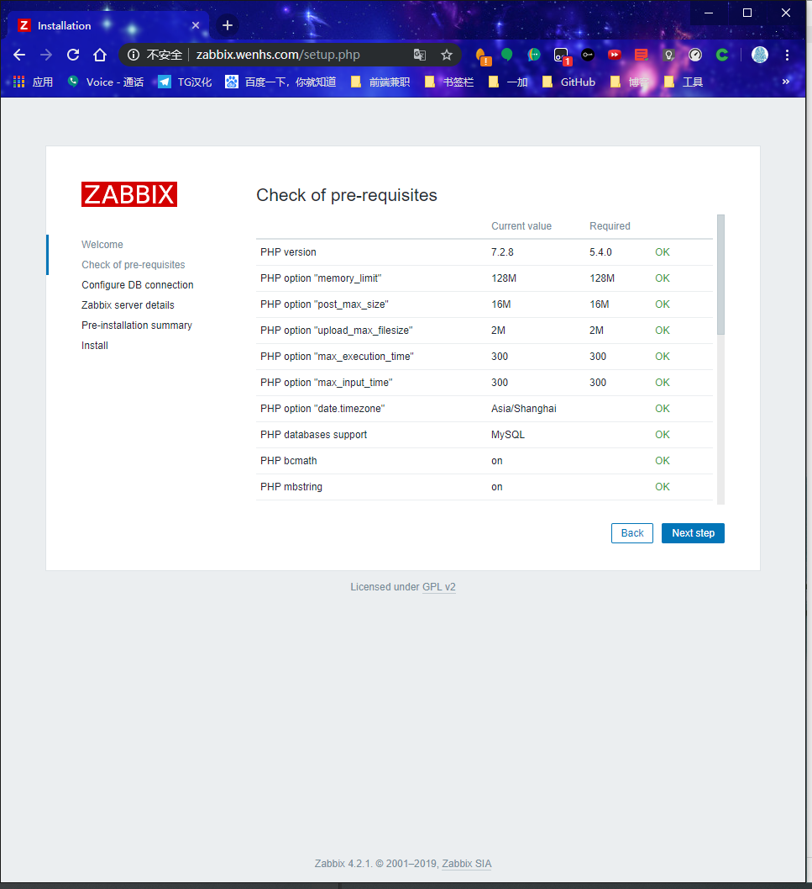
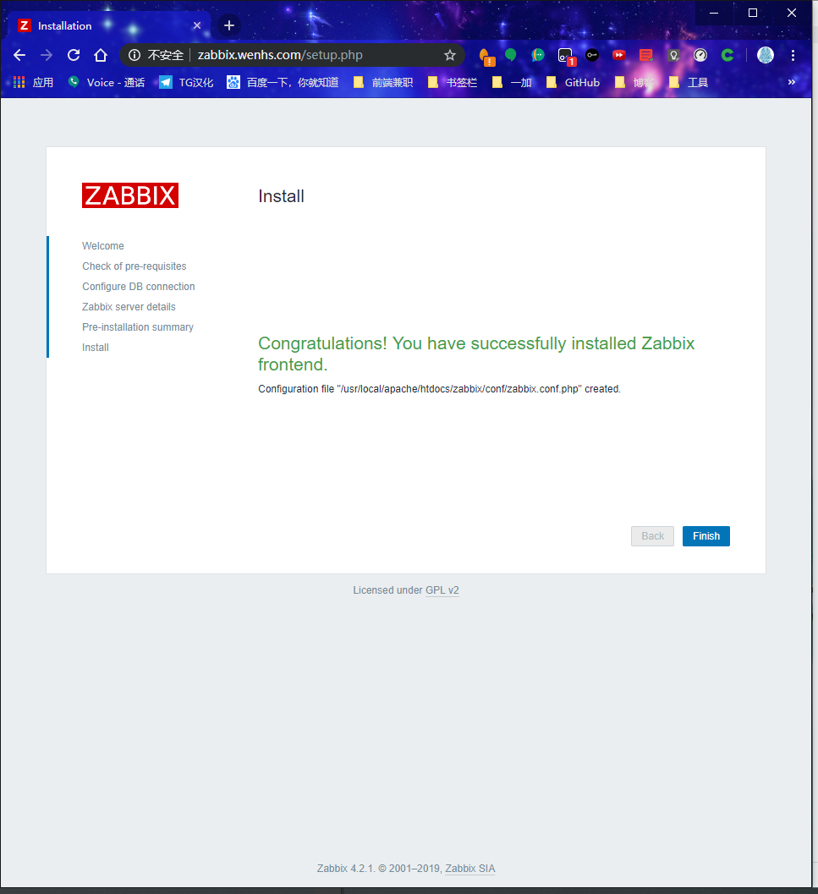

<!--more-->


## 1. zabbix介绍

`zabbix`是一个基于WEB界面的提供分布式系统监视以及网络监视功能的企业级的开源解决方案。

`zabbix`能监视各种网络参数，保证服务器系统的安全运营；并提供灵活的通知机制以让系统管理员快速定位/解决存在的各种问题。

`zabbix`由2部分构成，`zabbix server`与可选组件`zabbix agent`。

`zabbix server`可以通过`SNMP`，`zabbix agent`，`ping`，端口监视等方法提供对远程服务器/网络状态的监视，数据收集等功能，它可以运行在Linux，Ubuntu，Solaris，HP-UX，AIX，Free BSD，Open BSD，OS X等平台上。

`zabbix agent`需要安装在被监视的目标服务器上，它主要完成对硬件信息或与操作系统有关的内存，CPU等信息的收集。

`zabbix server`可以单独监视远程服务器的服务状态；同时也可以与`zabbix agent`配合，可以轮询`zabbix agent`主动接收监视数据（agent方式），同时还可被动接收`zabbix agent`发送的数据（trapping方式）。
另外`zabbix server`还支持SNMP (v1,v2)，可以与SNMP软件(例如：net-snmp)等配合使用。


## 2.什么是zabbix及优缺点（对比cacti和nagios）

Zabbix能监视各种网络参数，保证服务器系统的安全运营；并提供灵活的通知机制以让系统管理员快速定位/解决存在的各种问题。是一个基于WEB界面的提供分布式系统监视以及网络监视功能的企业级的开源解决方案。

- agent端：主机通过安装agent方式采集数据。

- server端：通过收集agent发送的数据，写入数据库（MySQL，ORACLE等），再通过php+apache在web前端展示.

- zabbix = cacti + nagios

- 优点：基于两款工具优点于一身并更强大，实现企业级分布式监控。

- 缺点：2.2版本带宽占用大但是升级到2.4版本后更节省了带宽资源，其它再无发现。


## 3. zabbix特点

zabbix的主要特点：

- 安装与配置简单，学习成本低
- 支持多语言（包括中文）
- 免费开源
- 自动发现服务器与网络设备
- 分布式监视以及WEB集中管理功能
- 可以无agent监视
- 用户安全认证和柔软的授权方式
- 通过WEB界面设置或查看监视结果
- email等通知功能

Zabbix主要功能：

- CPU负荷
- 内存使用
- 磁盘使用
- 网络状况
- 端口监视
- 日志监视


## 4.工作原理

一个监控系统运行的大概的流程是这样的：

zabbix agent需要安装到被监控的主机上，它负责定期收集各项数据，并发送到zabbix server端，zabbix server将数据存储到数据库中，zabbix web根据数据在前端进行展现和绘图。这里agent收集数据分为主动和被动两种模式：

主动：agent请求server获取主动的监控项列表，并主动将监控项内需要检测的数据提交给server/proxy

被动：server向agent请求获取监控项的数据，agent返回数据。


### 5.zabbix的组件及进程

#### 1：重要组件

zabbix由以下几个组件部分构成：

1. Zabbix Server：负责接收agent发送的报告信息的核心组件，所有配置，统计数据及操作数据均由其组织进行；
2. Database Storage：专用于存储所有配置信息，以及由zabbix收集的数据；
3. Web interface：zabbix的GUI接口，通常与Server运行在同一台主机上；
4. Proxy：可选组件，常用于分布监控环境中，代理Server收集部分被监控端的监控数据并统一发往Server端；
5. Agent：部署在被监控主机上，负责收集本地数据并发往Server端或Proxy端；

注：zabbix node也是 zabbix server的一种 。

#### 2：常见进程

默认情况下zabbix包含5个程序：zabbix_agentd、zabbix_get、zabbix_proxy、zabbix_sender、zabbix_server，另外一个zabbix_java_gateway是可选，这个需要另外安装。下面来分别介绍下他们各自的作用。

##### （1）zabbix_agentd：

客户端守护进程，此进程收集客户端数据，例如cpu负载、内存、硬盘使用情况等。

##### （2）zabbix_get

zabbix工具，单独使用的命令，通常在server或者proxy端执行获取远程客户端信息的命令。通常用户排错。例如在server端获取不到客户端的内存数据，我们可以使用zabbix_get获取客户端的内容的方式来做故障排查。

##### （3）zabbix_sender

zabbix工具，用于发送数据给server或者proxy，通常用于耗时比较长的检查。很多检查非常耗时间，导致zabbix超时。于是我们在脚本执行完毕之后，使用sender主动提交数据。

##### （4）zabbix_server

zabbix服务端守护进程。zabbix_agentd、zabbix_get、zabbix_sender、zabbix_proxy、zabbix_java_gateway的数据最终都是提交到server

备注：当然不是数据都是主动提交给zabbix_server,也有的是server主动去取数据。

##### （5）zabbix_proxy

zabbix代理守护进程。功能类似server，唯一不同的是它只是一个中转站，它需要把收集到的数据提交/被提交到server里。为什么要用代理？代理是做什么的？卖个关子，请继续关注运维生存时间zabbix教程系列。

##### （6）zabbix_java_gateway

zabbix2.0之后引入的一个功能。顾名思义：Java网关，类似agentd，但是只用于Java方面。需要特别注意的是，它只能主动去获取数据，而不能被动获取数据。它的数据最终会给到server或者proxy。

## 6.zabbix监控环境中基本概念

1. 主机（host）：要监控的网络设备，可由IP或DNS名称指定；
2. 主机组（host group）：主机的逻辑容器，可以包含主机和模板，但同一个组织内的主机和模板不能互相链接；主机组通常在给用户或用户组指派监控权限时使用；
3. 监控项（item）：一个特定监控指标的相关的数据；这些数据来自于被监控对象；item是zabbix进行数据收集的核心，相对某个监控对象，每个item都由"key"标识；
4. 触发器（trigger）：一个表达式，用于评估某监控对象的特定item内接收到的数据是否在合理范围内，也就是阈值；接收的数据量大于阈值时，触发器状态将从"OK"转变为"Problem"，当数据再次恢复到合理范围，又转变为"OK"；
5. 事件（event）：触发一个值得关注的事情，比如触发器状态转变，新的agent或重新上线的agent的自动注册等；
6. 动作（action）：指对于特定事件事先定义的处理方法，如发送通知，何时执行操作；
7. 报警升级（escalation）：发送警报或者执行远程命令的自定义方案，如每隔5分钟发送一次警报，共发送5次等；
8. 媒介（media）：发送通知的手段或者通道，如Email、Jabber或者SMS等；
9. 通知（notification）：通过选定的媒介向用户发送的有关某事件的信息；
10. 远程命令（remote command）：预定义的命令，可在被监控主机处于某特定条件下时自动执行；
11. 模板（template）：用于快速定义被监控主机的预设条目集合，通常包含了item、trigger、graph、screen、appication以及low-level discovery rule；模板可以直接链接至某个主机；
12. 应用（application）：一组item的集合；
13. web场景（web scennario）：用于检测web站点可用性的一个活多个HTTP请求；
14. 前端（frontend）：Zabbix的web接口；

## 7.zabbix的监控架构

在实际监控架构中，zabbix根据网络环境、监控规模等 分了三种架构： server-client 、master-node-client、server-proxy-client三种 。

#### 1：server-client架构

也是zabbix的最简单的架构，监控机和被监控机之间不经过任何代理 ，直接由zabbix server和zabbix agentd之间进行数据交互。适用于网络比较简单，设备比较少的监控环境 。

#### 2：server-proxy-client架构

其中proxy是server、client之间沟通的一个桥梁，proxy本身没有前端，而且其本身并不存放数据，只是将agentd发来的数据暂时存放，而后再提交给server 。该架构经常是和master-node-client架构做比较的架构 ，一般适用于跨机房、跨网络的中型网络架构的监控。

#### 3：master-node-client架构

该架构是zabbix最复杂的监控架构，适用于跨网络、跨机房、设备较多的大型环境 。每个node同时也是一个server端，node下面可以接proxy，也可以直接接client 。node有自已的配置文件和数据库，其要做的是将配置信息和监控数据向master同步，master的故障或损坏对node其下架构的完整性。

其实zabbix做的还是挺人性化的，给了我们下载地址：http://repo.zabbix.com/ 里面可以选很多版本，但这里就给大家提供一个目前最新版本4.2的部署及添加客户端方式。


## 8. zabbix配置文件

zabbix配置文件有两种：

- 服务器端配置文件(/usr/local/etc/zabbix_server.conf)
- 客户端配置文件(/usr/local/etc/zabbix_agentd.conf)
- zabbix代理配置文件(/usr/local/etc/zabbix_proxy.conf)

**服务器端配置文件zabbix_server.conf常用配置参数：**

| 参数             | 作用                           |
| :--------------- | :----------------------------- |
| LogFile          | 设置服务端日志文件存放路径     |
| ListenIP         | 设置服务端监听IP               |
| ListenPort       | 设置服务端监听的端口号         |
| PidFile          | 设置服务端进程号文件存放路径   |
| DBHost           | 指定zabbix的数据库服务器IP     |
| DBName           | 指定zabbix使用的数据库库名     |
| DBUser           | 指定zabbix数据库登录用户       |
| DBPassword       | 指定zabbix数据库登录密码       |
| DBPort           | 指定zabbix数据库端口号         |
| User             | 设置zabbix以什么用户的身份运行 |
| AlertScriptsPath | 设置告警脚本存放路径           |
| ExternalScripts  | 外部脚本存放路径               |

**客户端配置文件zabbix_agentd.conf常用配置参数：**

如果是默认值，可以不用声明，即不要删除注释，需要更改特殊值时才修改，下面为了讲解，每个选项基本都取消注释了，但是有注明默认值是多少的

```
LogFile=/usr/local/zabbix/log/zabbix_agentd.log    #日志

Server=10.10.88.20    # zabbix server IP，此种表示被动监听。可以有多个IP，以逗号分隔，如 Server=123.56.178.128,192.168.0.41

ListenPort=10050    # agent 监听端口。默认也是10050

ListenIP=0.0.0.0    # agent监听的网络接口。0.0.0.0表示监听所有IP

StartAgents=3    #处理被动检查的预启动的zabbix_agent进程。默认值为3

ServerActive=10.10.88.20:10051    #主动模式。主动检查zabbix server的端口，如果没有指明端口，则默认为10051

Hostname=slave2    # 该项需要主动检查，并且必须与服务器上服务器上配置的主机名一致。如果未定义，则从HostnameItem获取值。
 How often list of active checks is refreshed, in seconds.

RefreshActiveChecks=120    # 主动模式下，agent主动检查监控项的刷新频率（隔多久从server获取一次item），单位s，默认120s

BufferSend=5    #数据在缓冲区的保留时间。默认只保留5秒

BufferSize=100    #内存缓冲区中的最大值。 如果缓冲区已满，代理将发送所有收集的数据到Zabbix Server或Proxy。默认值为100

Timeout=30    # 处理超时时间。默认30秒为超时

AllowRoot=0    # 是否允许agent以 root用户运行。0表示不允许，1表示允许，默认值为0

User=zabbix    #

Include=xxx    # 包含的配置文件，默认没有值。如Include=/usr/local/etc/zabbix_agentd.conf.d/*.conf

UserParameter=xxx    # 用户自定义监控项，即自定义key。如
```


## 9. 部署zabbix

**环境说明：**

| 环境   | IP              | 要安装的应用                                |
| :----- | :-------------- | :------------------------------------------ |
| 服务器 | 192.168.161.130 | lamp架构 <br>zabbix server<br> zabbix agent |
| 客户端 | 192.168.161.167 | zabbix agent                                |

**因为zabbix是用php语言开发的，所以必须先部署lamp架构，使其能够支持运行php网页**

### 9.1 zabbix服务端安装

```
安装依赖包
[root@localhost ~]# yum -y install net-snmp-devel libevent-devel libxml2-devel curl-devel pcre*

下载zabbix
[root@localhost ~]# cd /usr/src/
[root@localhost src]# wget https://nchc.dl.sourceforge.net/project/zabbix/ZABBIX%20Latest%20Stable/4.2.1/zabbix-4.2.1.tar.gz
--2019-05-16 14:25:00--  https://nchc.dl.sourceforge.net/project/zabbix/ZABBIX%20Latest%20Stable/4.2.1/zabbix-4.2.1.tar.gz
正在解析主机 nchc.dl.sourceforge.net (nchc.dl.sourceforge.net)... 211.79.60.17, 2001:e10:ffff:1f02::17
正在连接 nchc.dl.sourceforge.net (nchc.dl.sourceforge.net)|211.79.60.17|:443... 已连接。
已发出 HTTP 请求，正在等待回应... 200 OK
长度：18284589 (17M) [application/x-gzip]
正在保存至: “zabbix-4.2.1.tar.gz”
    [                         <=>               ] 16,789,873   327KB/s 用时 57s    
2019-05-16 13:45:44 (287 KB/s) - “zabbix-4.2.1.tar.gz” 已保存 [16789873]

解压
[root@localhost src]# tar xf zabbix-4.2.1.tar.gz

创建zabbix用户和组
[root@localhost ~]# groupadd -r zabbix
[root@localhost ~]# useradd -r -g zabbix -M -s /sbin/nologin zabbix


配置zabbix数据库
[root@localhost ~]# mysql -uroot -pjbgsn123!
mysql: [Warning] Using a password on the command line interface can be insecure.
Welcome to the MySQL monitor.  Commands end with ; or \g.
Your MySQL connection id is 2
Server version: 5.7.22 MySQL Community Server (GPL)

Copyright (c) 2000, 2018, Oracle and/or its affiliates. All rights reserved.

Oracle is a registered trademark of Oracle Corporation and/or its
affiliates. Other names may be trademarks of their respective
owners.

Type 'help;' or '\h' for help. Type '\c' to clear the current input statement.

mysql> create database zabbix character set utf8 collate utf8_bin;
Query OK, 1 row affected (0.00 sec)

mysql> grant all privileges on zabbix.* to zabbix@localhost identified by 'zabbix123!';
Query OK, 0 rows affected, 2 warnings (0.00 sec)

mysql> flush privileges;
Query OK, 0 rows affected (0.00 sec)

mysql> exit
Bye
[root@localhost ~]# cd /usr/src/zabbix-4.2.1/database/mysql/
[root@localhost mysql]# ls
data.sql  images.sql  Makefile.am  Makefile.in  schema.sql
[root@localhost mysql]# mysql -uzabbix -pzabbix123! zabbix < schema.sql
mysql: [Warning] Using a password on the command line interface can be insecure.
[root@localhost mysql]# mysql -uzabbix -pzabbix123! zabbix < images.sql
mysql: [Warning] Using a password on the command line interface can be insecure.
[root@localhost mysql]# mysql -uzabbix -pzabbix123! zabbix < data.sql
mysql: [Warning] Using a password on the command line interface can be insecure.


编译安装zabbix
[root@localhost ~]# cd /usr/src/zabbix-4.2.1    
[root@localhost zabbix-4.2.1]# ./configure --enable-server --enable-agent --with-mysql --with-net-snmp --with-libcurl --with-libxml2

[root@localhost zabbix-4.2.1]# make install
```

### 9.2 zabbix服务端配置

```
[root@localhost ~]# ls /usr/local/etc/
zabbix_agentd.conf  zabbix_agentd.conf.d  zabbix_server.conf  zabbix_server.conf.d

修改服务端配置文件
设置数据库信息
[root@localhost ~]# vim /usr/local/etc/zabbix_server.conf
....
DBPassword=zabbix123!       //设置zabbix数据库连接密码


启动zabbix_server和zabbix_agentd
[root@localhost ~]# zabbix_server
[root@localhost ~]# zabbix_agentd
[root@localhost ~]# ss -antl
State       Recv-Q Send-Q Local Address:Port               Peer Address:Port              
LISTEN      0      128     127.0.0.1:9000                        *:*                  
LISTEN      0      128             *:22                          *:*                  
LISTEN      0      100     127.0.0.1:25                          *:*                  
LISTEN      0      128             *:10050                       *:*                  
LISTEN      0      128             *:10051                       *:*                  
LISTEN      0      80             :::3306                       :::*                  
LISTEN      0      128            :::80                         :::*                  
LISTEN      0      128            :::22                         :::*                  
LISTEN      0      100           ::1:25                         :::* 
```

### 9.3 zabbix服务端web界面安装与配置

#### 9.3.1 zabbix web界面安装前配置

```
修改/etc/php.ini的配置并重启php-fpm
[root@localhost ~]# sed -ri 's/(post_max_size =).*/\1 16M/g' /etc/php.ini
[root@localhost ~]# sed -ri 's/(max_execution_time =).*/\1 300/g' /etc/php.ini
[root@localhost ~]# sed -ri 's/(max_input_time =).*/\1 300/g' /etc/php.ini
[root@localhost ~]# sed -i '/;date.timezone/a date.timezone = Asia/Shanghai' /etc/php.ini
[root@localhost ~]# service php-fpm restart
Gracefully shutting down php-fpm . done
Starting php-fpm  done

[root@localhost ~]# cd /usr/src/zabbix-4.2.1
[root@localhost zabbix-4.2.1]# ls
aclocal.m4  compile        config.sub    depcomp     m4           misc     src
AUTHORS     conf           configure     frontends   Makefile     missing
bin         config.guess   configure.ac  include     Makefile.am  NEWS
build       config.log     COPYING       INSTALL     Makefile.in  README
ChangeLog   config.status  database      install-sh  man          sass
[root@localhost zabbix-4.2.1]# mkdir /usr/local/apache/htdocs/zabbix
[root@localhost zabbix-4.2.1]# cp -a frontends/php/* /usr/local/apache/htdocs/zabbix/
[root@localhost zabbix-4.2.1]# groupadd -r apache
[root@localhost zabbix-4.2.1]# useradd -r -g apache -M -s /sbin/nologin apache
[root@localhost zabbix-4.2.1]# chown -R apache.apache /usr/local/apache/htdocs

配置apache虚拟主机
[root@localhost ~]# vim /etc/httpd/httpd.conf
在配置文件的末尾加如下内容
ServerName zabbix.wenhs.com:80
<VirtualHost *:80>
    DocumentRoot "/usr/local/apache/htdocs/zabbix"
    ServerName zabbix.wenhs.com
    ProxyRequests Off
    ProxyPassMatch ^/(.*\.php)$ fcgi://127.0.0.1:9000/usr/local/apache/htdocs/zabbix/$1
    <Directory "/usr/local/apache/htdocs/zabbix">
        Options none
        AllowOverride none
        Require all granted
    </Directory>
</VirtualHost>


设置zabbix/conf目录的权限，让zabbix有权限生成配置文件zabbix.conf.php
[root@localhost ~]# chmod 777 /usr/local/apache/htdocs/zabbix/conf
[root@localhost ~]# ll -d /usr/local/apache/htdocs/zabbix/conf
drwxrwsrwx 2 apache apache 81 4月  18 17:26 /usr/local/apache/htdocs/zabbix/conf


重启apache
[root@localhost ~]# apachectl -t
Syntax OK
[root@localhost ~]# apachectl stop
[root@localhost ~]# apachectl start
[root@localhost ~]# ss -antl
State       Recv-Q Send-Q Local Address:Port               Peer Address:Port              
LISTEN      0      128     127.0.0.1:9000                        *:*                  
LISTEN      0      128             *:22                          *:*                  
LISTEN      0      100     127.0.0.1:25                          *:*                  
LISTEN      0      128             *:10050                       *:*                  
LISTEN      0      128             *:10051                       *:*                  
LISTEN      0      80             :::3306                       :::*                  
LISTEN      0      128            :::80                         :::*                  
LISTEN      0      128            :::22                         :::*                  
LISTEN      0      100           ::1:25                         :::*
```

#### 9.3.2 安装zabbix web界面

 - 修改/etc/hosts文件，添加域名与IP的映射
 - 在浏览器上访问域名，本文设置的域名为zabbix.wenhs.com，你需要修改成你自己的域名
 - 恢复zabbix/conf目录的权限为755

在浏览器上访问域名进行安装：








恢复zabbix/conf目录的权限为755：

```
[root@localhost ~]# chmod 755 /usr/local/apache/htdocs/zabbix/conf
[root@localhost ~]# ll -d /usr/local/apache/htdocs/zabbix/conf
drwxr-sr-x 2 apache apache 104 5月  16 15:21 /usr/local/apache/htdocs/zabbix/conf
```

### 9.4 登录zabbix

**zabbix默认登录用户名和密码：**

| 用户名 | 密码   |
| :----- | :----- |
| Admin  | zabbix |


## 10.汉化zabbix 

##### zabbix 自带多种语言包，也包括中文。登陆zabbix web控制台默认是英文，可切换中文版本

1.默认登陆界面(英文版)


  点击右上角小人图标,切换语言


  汉化后界面如下


##### 解决中文乱码

  上传本地字体

  找到本地C:\Windows\Fonts\STXINWEI.TTF(华文新魏)上传到/usr/share/zabbix/fonts


 重命名字体名称

 将zabbix服务器正在使用字体备份

```
[root@localhost ~]# mv /usr/local/apache/htdocs/zabbix/fonts/DejaVuSans.ttf{,.bak}
 将刚刚上传的字体替换

$ scp STXINWEI.TTF root@192.168.161.130:/usr/local/apache/htdocs/zabbix/fo nts/DejaVuSans.ttf                                                         root@192.168.161.130's password:                                           STXINWEI.TTF                             100% 3956KB   1.3MB/s   00:03

```

再次查看界面


## 11.客户端配置

```
安装依赖包
[root@wenhs5479 ~]# yum -y install net-snmp-devel libevent-devel libxml2-devel curl-devel pcre*

下载zabbix
[root@wenhs5479 ~]# cd /usr/src/
[root@wenhs5479 src]# scp 192.168.161.130:/usr/src/zabbix-4.2.1.tar.gz .
root@192.168.161.130's password: 
zabbix-4.2.1.tar.gz                               100%   17MB  61.7MB/s   00:00    
[root@wenhs5479 src]# tar xf zabbix-4.2.1.tar.gz

创建zabbix用户和组
[root@wenhs5479 ~]# groupadd -r zabbix
[root@wenhs5479 ~]# useradd -r -g zabbix -M -s /sbin/nologin zabbix

编译安装zabbix
[root@wenhs5479 ~]# cd /usr/src/zabbix-4.2.1    
[root@wenhs5479 zabbix-4.2.1]# ./configure --enable-agent
[root@wenhs5479 zabbix-4.2.1]# make install
[root@wenhs5479 zabbix-4.2.1]# ls /usr/local/etc/
zabbix_agentd.conf  zabbix_agentd.conf.d 

修改服务端配置文件
设置数据库信息
[root@wenhs5479 zabbix-4.2.1]# vim /usr/local/etc/zabbix_agentd.conf
Server=192.168.161.130
ServerActive=192.168.161.130
Hostname=167
启动zabbix_agentd
[root@wenhs5479 zabbix-4.2.1]# zabbix_agentd
[root@wenhs5479 zabbix-4.2.1]# ss -antl
State      Recv-Q Send-Q Local Address:Port               Peer Address:Port              
LISTEN     0      128            *:111                        *:*                  
LISTEN     0      5      192.168.122.1:53                         *:*                  
LISTEN     0      128            *:22                         *:*                  
LISTEN     0      128    127.0.0.1:631                        *:*                  
LISTEN     0      100    127.0.0.1:25                         *:*                  
LISTEN     0      128    127.0.0.1:6010                       *:*                  
LISTEN     0      128            *:10050                      *:*                  
LISTEN     0      128           :::111                       :::*                  
LISTEN     0      128           :::22                        :::*                  
LISTEN     0      128          ::1:631                       :::*                  
LISTEN     0      100          ::1:25                        :::*                  
LISTEN     0      128          ::1:6010                      :::*
```


