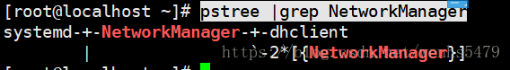

<!--more-->

### 1.添加两块网卡，配置bonding

```
nmcli connection add type bond mode balance-rr con-name bond0 ifname bond0 ipv4.method manual ipv4.addresses 192.168.161.128/24 ipv4.gateway 192.168.161.1 ipv4.dns 192.168.161.1

nmcli connection add type bond-slave con-name bond-slave0 ifname ens34 master bond0

nmcli connection add type bond-slave con-name bond-slave1 ifname ens35 master bond0
```


### 2.清除bonding配置，并配置team，配置成主备模式，并模拟主备故障

##### 清除bonding

```
nmcli device delete bond0
rm -rf /etc/sysconfig/network-scripts/ifcfg-bond*
```

##### 配置team成主备模式

```
nmcli connection add type team con-name team0 ifname team0 config '{"runner":{"name":"activebackup"}}' ipv4.addresses 172.16.12.250/24 ipv4.gateway 172.16.12.2 ipv4.dns 172.16.12.2 ipv4.method manual

nmcli connection add type team-slave con-name team0-port1 ifname ens34 master team0

nmcli connection add type team-slave con-name team0-port2 ifname ens35 master team0

systemctl restart network
```


##### 模拟主备故障

##### 无故障时:其中一个网卡工作,另外一个网卡不工作


##### 模拟故障:虚拟机断开工作的网卡,发现另外一个网卡开始工作


##### 故障解除:虚拟机重新连接上所用网卡,发现2个都工作,但是一个接收,一个发送


### 3.使用ip和ifconfig命令配置ip地址（设置多个ip地址）

##### IP:发现不加掩码默认为32位


##### ifconfig:发现不加掩码,默认掩码为24位


### 4.树状显示系统进程树，找到NetworkManaer进程的位置

```
pstree |grep NetworkManager
```



### 5.列出所有和网络相关的服务


```
systemctl list-unit-files|grep network
```


### 6.使用tcpdump抓取icmp流量，并关闭缓冲区

```
tcpdump icmp -i ens33 -b
```


### 7.ping 宿主机，发送30个包，每个包设置1000 

```
ping -c30 -s1000 192.168.161.206
```


### 8.查看所有udp网络套接字

```
ss -ua
或
netstat -ua
```


### 9.查看所有tcp/udp套接字，并显示原端口，不解析端口名字

```
ss -tuan
```


### 10.查看所有tcp/udp网络套接字，并解析ip地址。

```
ss -tua
```


### 11.查看宿主机的所有arp列表

```
arp
```


### 12.关闭lo网卡


```
ifconfig lo down
```


### 13.开启lo网卡

```
ifup lo
或
ifconfig lo up
```


### 14.清空lo网卡上所有ip地址

```
ip address flush dev lo
```

### 15.修改一个新添加网卡的mac地址

a,用虚拟机修改


b,用命令修改：

```
ifconfig  ens34 hw  ether   '00:0c:29:4d:6a:51'
或者
ip link set dev ens34  address  '00:0c:29:4d:6a:47'
```

